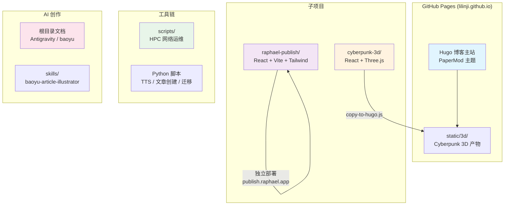

# lilinji.github.io 项目全景梳理报告

> 生成时间：2026-04-23
> 这是一份使用 Subagent 协作模式完成的项目全景分析报告

---

## 一、项目总览

`lilinji.github.io` 是一个以个人技术博客为核心、附带多个子项目和工具链的综合技术仓库，涵盖了**静态博客（Hugo）、AI 内容创作工具（Raphael Publish）、3D 交互展示（Cyberpunk 3D）、HPC 运维脚本**四大板块。

| 属性 | 详情 |
|------|------|
| **仓库地址** | `https://github.com/lilinji/lilinji.github.io` |
| **部署目标** | GitHub Pages |
| **站点地址** | https://lilinji.github.io/ |
| **博客主题** | AI/ML、云计算（OpenStack, Docker, Ceph）、Linux 运维 |
| **文章数量** | 93 篇 |
| **时间跨度** | 2013 - 2026 |

### 项目关系图

```
┌─────────────────────────────────────────────────────────────────┐
│                     lilinji.github.io (GitHub Pages)            │
│  ┌───────────────────────────────────────────────────────────┐  │
│  │  Hugo 博客主站 (PaperMod)                                  │  │
│  │  - 93 篇技术文章                                            │  │
│  │  - 3D Cyberpunk Hero ←── static/3d/ (来自 cyberpunk-3d)   │  │
│  │  - 实时 LED 时钟 / JSON-LD / GA4                           │  │
│  └───────────────────────────────────────────────────────────┘  │
│                              │                                  │
│              ┌───────────────┼───────────────┐                  │
│              ▼               ▼               ▼                  │
│  ┌──────────────────┐ ┌─────────────────┐ ┌──────────────────┐ │
│  │ raphael-publish/ │ │  cyberpunk-3d/  │ │    scripts/      │ │
│  │ React + Vite     │ │ React + Three.js│ │ HPC 网络运维脚本 │ │
│  │ Markdown 排版引擎│ │ 3D 首屏展示     │ │ + 其他工具       │ │
│  │ publish.raphael.app│ → static/3d/  │ │                  │ │
│  └──────────────────┘ └─────────────────┘ └──────────────────┘ │
│                              │                                  │
│              ┌───────────────┴───────────────┐                  │
│              ▼                               ▼                  │
│  ┌──────────────────────┐     ┌──────────────────────┐         │
│  │ AI 创作文档体系      │     │ create_post / deploy │         │
│  │ (Antigravity/baoyu)  │     │ / build / TTS 等脚本 │         │
│  └──────────────────────┘     └──────────────────────┘         │
└─────────────────────────────────────────────────────────────────┘
```

---

## 二、子项目一：Hugo 博客主站

### 2.1 技术栈

| 组件 | 版本/说明 |
|------|-----------|
| **Hugo** | v0.152.2 extended (windows/amd64) |
| **主题** | PaperMod (Git 子模块) |
| **语言** | 中文 (`zh-cn`) |
| **部署目标** | GitHub Pages |
| **站点地址** | `https://lilinji.github.io/` |

**配置文件** (`/config.yaml`) 关键设置：

- `baseURL`: `https://lilinji.github.io/`
- `theme`: `PaperMod`
- `languageCode`: `zh-cn`
- `hasCJKLanguage: true` — 中文分词支持
- `permalinks.posts`: `/:year/:month:/`
- `pagination.pagerSize`: 10
- 输出格式：HTML + RSS + JSON
- 启用 RSS、搜索、归档、标签云
- Google Analytics ID: `G-HFT45VFBX6`
- Markdown 高亮风格：`monokai`，启用行号
- 相关文章推荐：基于 tags (weight=100)、categories (weight=80)、date (weight=10)

### 2.2 内容结构

**文章统计**：
- **文章总数**：93 篇
- **Markdown 文件**：125 个
- **文章目录总文件数**：673 个（含图片等附件）

**目录组织** (`content/`)：

```
content/
├── posts/                    # 文章存放处（93篇）
│   └── YYYY-MM-DD-slug/
│       ├── index.md          # 文章正文
│       └── imgs/ / images/   # 文章配图
├── about/                    # 关于页面
│   ├── index.md
│   ├── Wechat.jpeg
│   └── flag.png
├── archives/                 # 归档页
│   └── _index.md
├── faq/                      # FAQ页面
│   └── index.md
└── search/                   # 搜索页
    └── _index.md
```

**热门标签分布**（出现次数前10）：

| 标签 | 次数 | 标签 | 次数 |
|------|------|------|------|
| AI | 18 | 翻译 | 7 |
| DeepLearning | 13 | clippings | 7 |
| AI相关 | 13 | LLM | 7 |
| Tutorial | 11 | GPU | 7 |
| 技术 | 6 | 强化学习 | 6 |

**内容主题演变**：
- **2013-2017 年**：OpenStack、Docker、Ceph、Linux 运维、算法
- **2025-2026 年**：AI/LLM、Claude Code、Agent 智能体、RAG、MCP

### 2.3 自定义布局 (layouts/)

共有 4 个自定义模板文件覆盖主题默认行为：

| 文件 | 作用 |
|------|------|
| `layouts/index.html` | **主页模板核心**：在文章列表前插入 3D Cyberpunk Hero 区块；保留 PaperMod 原始分页逻辑 |
| `layouts/partials/google_analytics.html` | Google Analytics 4 追踪代码片段（gtag.js） |
| `layouts/partials/home_info.html` | **主页信息卡**：含实时数字时钟（绿色 LED 风格）、社交图标、自定义样式和脚本 |
| `layouts/partials/templates/schema_json.html` | **JSON-LD 结构化数据**：主页 Organization/Person、内页 BreadcrumbList 和 BlogPosting |

### 2.4 静态资源

#### `static/` 目录
```
static/
├── 3d/                       # Cyberpunk 3D 场景（React Three Fiber 构建产物）
│   ├── index.html
│   ├── manifest.json
│   └── assets/
│       ├── index.BtMJFiy7.js
│       └── index.Defb-3z6.css
├── favicon.ico               # 主站点图标
├── favicon_peach.ico         # 备用 peach 主题图标
└── favicon_wine.ico          # 备用 wine 主题图标
```

#### `assets/` 目录
```
assets/
├── css/
│   ├── extended/
│   │   └── 3d-hero.css       # Cyberpunk Hero 容器样式
│   └── stylesheet.min.*.css  # 6 个构建后的 CSS bundle
└── js/
    ├── highlight.min.*.js    # 3 个代码高亮 bundle
    └── search.min.*.js       # 3 个搜索功能 bundle
```

### 2.5 自动化脚本

项目提供了 **Bash + PowerShell + Python + Batch** 四版本脚本，支持跨平台使用：

| 脚本 | Bash | PowerShell | Python | Batch | 功能 |
|------|------|------------|--------|-------|------|
| **create_post** | `create_post.sh` | `create_post.ps1` | `create_post.py` | `create_post.bat` | 创建新文章目录，生成 Hugo frontmatter 和模板结构 |
| **build** | `build.sh` | `build.ps1` | — | — | 执行 `hugo --gc [--minify]`，统计输出文件数，可选 `--serve` 启动开发服务器 |
| **deploy** | `deploy.sh` | `deploy.ps1` | — | — | `git add -A` -> `git commit` -> `git push -f` 到 GitHub Pages 仓库 |
| **迁移** | — | — | `migrate_jekyll_to_hugo.py` | — | 从 Jekyll 格式迁移到 Hugo PaperMod：转换 frontmatter、复制图片、更新路径 |

**create_post 脚本特点**：
- 自动生成 `YYYY-MM-DD-slug/index.md` 目录结构
- 默认标签：`AI,DeepLearning`
- 默认作者：`Ringi Lee`
- Frontmatter 含：`title`, `date`, `draft: false`, `tags`, `author`, `showToc: true`, `tocOpen: false`

### 2.6 CI/CD

**GitHub Actions** (`.github/workflows/deploy.yml`)：

- **触发条件**：`push` 到 `main` 分支
- **权限**：`pages: write`, `id-token: write`
- **构建步骤**：
  1. Checkout（含递归子模块）
  2. 安装 Hugo v0.152.2 extended（从 GitHub Release 下载 deb 包）
  3. 构建：`hugo --minify --gc --baseURL "<pages_url>/"`
  4. 上传 `public/` 目录为 artifact
- **部署步骤**：使用 `actions/deploy-pages@v4` 部署到 GitHub Pages

### 2.7 主题定制

#### A. 3D Cyberpunk 首页 Hero
- **实现**：基于 React Three Fiber 构建的独立 SPA，产物存放在 `static/3d/`
- **集成**：在 `layouts/index.html` 中通过 `manifest.json` 动态读取 JS/CSS 路径并注入
- **样式**：`assets/css/extended/3d-hero.css` 定义容器尺寸、霓虹发光阴影、响应式高度、悬停动效
- **特性**：
  - 高度响应式：220px(手机) -> 280px(默认) -> 320px(平板) -> 380px(桌面)
  - 暗色模式适配
  - 空状态 loading spinner 动画

#### B. 实时数字时钟
- **位置**：`layouts/partials/home_info.html`
- **样式**：黑色背景 + 绿色 LED 文字 (`#72ff9a`) + 霓虹文字阴影，使用 `Share Tech Mono` 等编程字体
- **脚本**：纯 JavaScript，`setInterval(tick, 1000)` 实时更新
- **防重复渲染**：使用 Hugo `Scratch` 状态标记避免多次加载

#### C. Google Analytics 4
- **ID**：`G-HFT45VFBX6`
- **配置**：`config.yaml` 中通过 `services.googleAnalytics.ID` 配置
- **模板**：`layouts/partials/google_analytics.html` 实现 gtag.js 异步加载

#### D. JSON-LD 结构化数据
- **模板**：`layouts/partials/templates/schema_json.html`
- **首页**：`Organization` / `Person` Schema，含社交链接
- **文章页**：`BlogPosting` Schema，含 headline、description、keywords、author、publish/modify date、publisher
- **分类/标签页**：`BreadcrumbList` Schema

#### E. 其他配置
- **代码复制按钮**、**阅读时间**、**字数统计**、**面包屑导航**、**目录(TOC)** 均启用
- **搜索**：基于 Fuse.js 的客户端搜索，配置在 `config.yaml` 的 `fuseOpts`
- **编辑建议**：每篇文章底部显示 "建议修改" 链接，指向 GitHub 仓库对应文件
- **社交图标**：GitHub、微信、Twitter、Instagram、Google Scholar

---

## 三、子项目二：raphael-publish/

### 3.1 技术栈

| 类别 | 技术 | 版本 |
|------|------|------|
| 前端框架 | React | 18.3.1 |
| 语言 | TypeScript | ~5.6.2 |
| 构建工具 | Vite | 5.4.10 |
| 样式方案 | Tailwind CSS | 3.4.14 |
| 包管理器 | pnpm | 9（CI 配置）|
| 动画库 | framer-motion | 11.11.11 |
| Markdown 解析 | markdown-it | 14.1.0 |
| 代码高亮 | highlight.js | 11.10.0 |
| 富文本转 Markdown | turndown + turndown-plugin-gfm | 7.2.2 |
| PDF 导出 | html2pdf.js | 0.14.0 |
| 图标库 | lucide-react | 0.460.0 |
| Lint 工具 | ESLint 9 + typescript-eslint | — |

**关键依赖特性：**
- `turndown` + `turndown-plugin-gfm`：实现"魔法粘贴"功能，将飞书/Notion/Word 的富 HTML 自动转为 Markdown
- `html2pdf.js`：基于 html2canvas + jsPDF 的客户端 PDF 导出
- `markdown-it` 开启 `html: true`，支持 HTML 混合渲染
- `highlight.js` 使用 GitHub 主题，代码块顶部带 macOS 风格三圆点装饰

### 3.2 项目用途

**产品名称：** Raphael Publish（在线体验：https://publish.raphael.app）

**核心定位：** 专为微信公众号和内容创作者打造的现代 Markdown 排版引擎。

**主要功能：**
1. **魔法粘贴**：从飞书、Notion、Word、任意网页复制富文本，粘贴时自动净化为纯净 Markdown
2. **30 套高定样式主题**：分为"经典""潮流""更多风格"三个分组，覆盖 Mac、Claude 燕麦色、微信原生、NYT、Medium、Stripe、飞书、Linear、Retro、Bloomberg、Notion、GitHub、少数派、Dracula、Nord、Cyberpunk、水墨等风格
3. **一键复制到公众号**：外链图片自动转 Base64，避免"此图片来自第三方"报错；DOM 底层重塑确保表格/列表在微信中不塌陷
4. **多图排版**：连续单图段落自动合并为 Flex/grid 并排布局
5. **多端预览**：手机 (480px)、平板 (768px)、桌面 (PC) 三种设备视图
6. **导出**：支持 PDF 和 HTML 文件导出

### 3.3 构建配置

#### vite.config.ts
```typescript
export default defineConfig({
    plugins: [react()],
    base: '/',
});
```
- 使用 `@vitejs/plugin-react` 插件
- `base: '/'` 配合 GitHub Pages 自定义域名使用

#### tsconfig.json
- `target`: ES2020，`jsx`: "react-jsx"（新式 JSX 转换，无需显式 import React）
- `moduleResolution`: "bundler"（Vite 推荐）
- `strict`: true，`noUnusedLocals`: true，`noUnusedParameters`: true
- 源文件范围：`"src"` 目录
- 项目引用：`tsconfig.node.json`（仅包含 `vite.config.ts`）

#### tailwind.config.js
- `darkMode: 'class'`：通过手动切换 `document.documentElement.classList.add('dark')` 控制明暗模式
- 扩展了 Apple 设计系统色彩：`apple.gray1~6`、`apple.dark1~4`
- 自定义阴影：`shadow-apple`、`shadow-apple-lg`、`shadow-apple-dark`
- 字体栈：`-apple-system` 等系统字体优先

#### postcss.config.js
标准两阶段处理：`tailwindcss` -> `autoprefixer`

### 3.4 源代码结构

```
raphael-publish/src/
├── main.tsx                    # React 入口，StrictMode 包裹 App
├── App.tsx                     # 根组件：状态管理 + 布局编排
├── index.css                   # Tailwind directives + Apple 风格工具类
├── defaultContent.ts           # 默认 Markdown 演示内容
├── components/
│   ├── Header.tsx              # 顶部导航：Logo、GitHub 链接、明暗切换
│   ├── ThemeSelector.tsx       # 主题选择器：4 个快捷 Pill + 下拉网格面板
│   ├── Toolbar.tsx             # 工具栏：设备视图切换 + 导出/复制按钮
│   ├── EditorPanel.tsx         # 左侧编辑器：textarea + 智能粘贴处理
│   ├── PreviewPanel.tsx        # 右侧预览区：PC/手机/平板设备壳渲染
│   └── DeviceFrame.tsx         # 手机/平板设备外壳（物理外壳 + Home 条）
└── lib/
    ├── markdown.ts             # markdown-it 配置、预处理、主题应用引擎
    ├── htmlToMarkdown.ts       # 智能粘贴：turndown 转换 + IDE/代码检测
    ├── wechatCompat.ts         # 微信兼容性处理：Base64 图片、flex 转 table、字体继承
    └── themes/
        ├── types.ts            # Theme / ThemeGroup 类型定义
        ├── index.ts            # 主题注册中心：30 套主题合并 + 分组
        ├── classic.ts          # 10 套经典主题（Mac/Claude/微信/NYT/Medium/Stripe/飞书/Linear/Retro/Bloomberg）
        ├── modern.ts           # 10 套潮流主题（Notion/GitHub/少数派/Dracula/Nord/樱花/深海/薄荷/日落/Monokai）
        └── extra.ts            # 10 套额外主题（Solarized/Cyberpunk/水墨/薰衣草/密林/冰川/咖啡/Bauhaus/赤铜/彩虹糖）
```

**核心数据流：**
```
Markdown 输入
  -> preprocessMarkdown()       # 清理零散 Markdown 语法
  -> md.render()                # markdown-it 转 HTML
  -> applyTheme()               # 注入 30 套主题 CSS + 图片网格化 + 代码高亮
  -> renderedHtml               # React state 驱动预览渲染
  -> makeWeChatCompatible()     # 微信专项兼容处理（复制时）
  -> ClipboardItem(text/html)   # 写入系统剪贴板
```

**关键设计模式：**
- **Theme-as-Data**：每套主题是一个纯数据对象，包含 `id`、`name`、`description` 和 `styles`（CSS 选择器到内联样式的映射）。`applyTheme()` 使用 DOMParser 将样式注入 HTML 元素。
- **内联样式优先**：所有主题样式以内联 `style` 属性写入，确保粘贴到微信公众号编辑器时样式不丢失。
- **DOM 重写引擎**：`applyTheme()` 和 `makeWeChatCompatible()` 均使用 `DOMParser` 在内存中操作 DOM，完成图片网格合并、flex 转 table、Base64 转换等操作。

### 3.5 部署方式

**托管：** GitHub Pages（通过 GitHub Actions 自动部署）

**工作流：** `raphael-publish/.github/workflows/deploy.yml`
- 触发条件：`main` 分支 push 或手动触发
- Node 版本：20
- 包管理器：pnpm 9
- 构建命令：`pnpm build`（内部执行 `tsc -b && vite build`）
- 构建产物：`dist/` 目录上传为 Pages artifact
- 环境变量：`GITHUB_PAGES: 'true'`（当前未被源代码消费，预留标记）

**自定义域名：**
- `public/CNAME` 文件内容为 `publish.raphael.app`
- DNS 配置指向 GitHub Pages 后，该域名可直接访问项目

**项目独立性说明：**
- `raphael-publish` 是 `D:\lilinji.github.io` 仓库下的一个子目录/子项目
- 它**不依赖**外层 Hugo 博客（`lilinji.github.io` 主站），拥有独立的 CI/CD 流程
- 外层仓库的 `deploy.sh` 和 Hugo 构建未触及此子项目

---

## 四、子项目三：cyberpunk-3d/

### 4.1 技术栈

| 层级 | 技术 | 版本 | 说明 |
|------|------|------|------|
| **运行时框架** | React | 18.3.1 | UI 框架 |
| **构建工具** | Vite | 6.0.0 | 开发与生产构建 |
| **语言** | TypeScript | 5.6.0 | 类型安全 |
| **3D 渲染核心** | Three.js | 0.170.0 | WebGL 底层 |
| **React 3D 绑定** | @react-three/fiber | 8.17.0 | React 渲染器（将 Three.js 场景挂载到 React  reconciler） |
| **3D 辅助组件** | @react-three/drei | 9.117.0 | 常用抽象（Text、RoundedBox、Float、Center 等） |
| **后处理** | @react-three/postprocessing + postprocessing | 2.16.0 / 6.36.0 | Bloom、色差、暗角等屏幕效果 |
| **部署脚本** | Node.js (ESM) | — | 复制产物到 Hugo 静态目录 |

**关键架构特征：**
- 使用了 `@react-three/fiber` 的声明式场景图（declarative scene graph），所有 3D 对象以 JSX 形式编写
- 自定义 GLSL Shader（GridFloor 中的顶点/片段着色器）
- Canvas 纹理动态生成（Phone3D 中的 `CanvasTexture`）
- 后处理管道使用 EffectComposer

### 4.2 项目用途

这是一个**赛博朋克风格的交互式 3D 首屏展示页面**，服务于 "Ringi's Log" 个人博客（AI / 云计算 / 容器技术方向）。

从 `TitleText.tsx` 中的内容可以确定：
- 主标题：`Ringi's Log`
- 副标题：`AI · Cloud · Container`

视觉主题围绕 AI 科技展开，包含：
- 神经网络节点与数据流粒子
- 3D 智能手机模型（带动态 UI 屏幕纹理）
- 浮动几何体（二十面体、八面体、环面、十二面体等）
- 粒子场（2000 点，模拟数据流上升）
- 自定义着色器网格地板（带鼠标交互波纹）
- 霓虹发光文字与后处理特效

部署目标：作为 Hugo 博客站点的一个子页面（`/3d/` 路径下），通过 `scripts/copy-to-hugo.js` 将构建产物集成到主站静态资源中。

### 4.3 源代码结构

项目总计 **1028 行**代码（`.tsx` + `.css`），文件大小符合"小文件、高内聚"原则。

```
cyberpunk-3d/
├── src/
│   ├── main.tsx                    (15 行) — 入口，支持 #root / #cyberpunk-scene 双挂载点
│   ├── App.tsx                     (24 行) — Canvas 配置，组合 Scene + Effects
│   ├── index.css                   (15 行) — 全局 reset，确保 canvas 全屏
│   ├── vite-env.d.ts              (2 行) — Vite 客户端类型声明
│   └── components/
│       ├── Scene.tsx               (27 行) — 场景组装器，导入并排列所有视觉元素
│       ├── CameraRig.tsx           (27 行) — 相机控制：鼠标跟随 + 平滑插值 (lerp)
│       ├── Lights.tsx              (23 行) — 多光源设置（环境光/点光源/方向光，AI 主题配色）
│       ├── GridFloor.tsx           (88 行) — 自定义 GLSL Shader 网格地板，响应鼠标位置
│       ├── TitleText.tsx           (89 行) — 3D 文字 "Ringi's Log"，三层霓虹发光叠加
│       ├── AIElements.tsx          (253 行) — 最大组件：神经网络节点 + 连接线 + 数据粒子 + AI 芯片
│       ├── Phone3D.tsx             (157 行) — 3D 手机模型（RoundedBox 机身 + Canvas 动态屏幕纹理）
│       ├── ParticleField.tsx       (92 行) — 2000 点粒子系统，BufferGeometry 直接操作，AdditiveBlending
│       ├── FloatingGeometries.tsx  (191 行) — 浮动几何体组，含悬停交互、Float 动画、MeshDistortMaterial
│       └── Effects.tsx             (27 行) — 后处理管道：Bloom + ChromaticAberration + Vignette
├── scripts/
│   └── copy-to-hugo.js             — 将 dist/ 复制到 Hugo static/3d/，生成 manifest.json
├── index.html                      — 入口 HTML，内联基础样式
├── package.json
├── vite.config.ts
├── tsconfig.json
└── tsconfig.node.json
```

### 4.4 构建配置

#### vite.config.ts
- **base**: `/3d/` — 产物部署在子路径下
- **outDir**: `dist`
- **assetsDir**: `assets`
- 输出文件名带 hash（`[name].[hash].[ext]`），利于缓存
- 使用 `@vitejs/plugin-react` 处理 JSX

#### tsconfig.json
- **target**: ES2020
- **jsx**: `react-jsx`（无需显式 import React）
- **moduleResolution**: `bundler`
- **strict**: true
- **noUnusedLocals / noUnusedParameters**: true（严格检查未使用变量）
- **include**: `src` 目录

#### tsconfig.node.json
- **composite**: true（项目引用模式）
- **include**: `vite.config.ts` + `scripts/*.js`
- 被主 tsconfig.json 通过 `references` 引用

#### package.json scripts
| 命令 | 行为 |
|------|------|
| `npm run dev` | `vite` — 本地开发服务器 |
| `npm run build` | `tsc && vite build` — 类型检查 + 生产构建 |
| `npm run preview` | `vite preview` — 预览生产构建 |
| `npm run deploy` | `npm run build && node scripts/copy-to-hugo.js` — 构建并复制到 Hugo |

### 4.5 部署产物（dist/ 目录）

```
dist/
├── index.html                      (739 B) — 基础 HTML，引用带 hash 的 JS/CSS
└── assets/
    ├── index.BtMJFiy7.js          (~1.14 MB) — 主 bundle（含 Three.js、React、后处理库等）
    └── index.Defb-3z6.css         (111 B) — 极小的 CSS（全局 reset 已被内联到 HTML）
```

**产物分析：**
- JS bundle 约 1.14 MB（未 gzip），这是包含完整 Three.js 树摇后体积的正常范围
- CSS 极小，因为大部分样式内联在 `index.html` 的 `<style>` 标签中
- 产物通过 `scripts/copy-to-hugo.js` 被复制到父 Hugo 项目的 `static/3d/` 目录
- 脚本同时生成 `manifest.json`，记录准确的 JS/CSS 文件名（带 hash），便于 Hugo 模板引用

**部署集成逻辑（copy-to-hugo.js）：**
1. 清理 `../static/3d/` 目录
2. 递归复制 `dist/` 全部内容
3. 扫描 `assets/` 目录，找到 `.js` 和 `.css` 文件
4. 写入 `manifest.json`（`{ js: "/3d/assets/xxx.js", css: "/3d/assets/xxx.css" }`）

### 4.6 关键设计与模式观察

| 方面 | 观察 |
|------|------|
| **渲染性能** | 使用 `useFrame` 进行逐帧动画；`BufferGeometry` + `Float32Array` 直接操作粒子位置；`Preload all` 预加载资源 |
| **交互** | 相机跟随鼠标（`pointer`），几何体悬停放大，网格地板响应鼠标波纹 |
| **着色器** | GridFloor 使用自定义 `shaderMaterial`，uniforms 动态绑定时间和鼠标位置 |
| **纹理** | Phone3D 的屏幕使用运行时 Canvas 2D 绘制 + `CanvasTexture` |
| **组件设计** | Scene.tsx 作为纯组合器，各视觉元素独立为组件，职责分离清晰 |
| **Hugo 兼容** | main.tsx 支持 `#cyberpunk-scene` 和 `#root` 双挂载点，便于嵌入 Hugo 模板 |
| **无测试** | 项目未配置测试框架（Jest/Vitest/Playwright），也未在 package.json 中体现 |

---

## 五、工具链与脚本

### 5.1 scripts/ 目录（HPC 集群网络运维脚本）

#### `network_bond_setup.sh` — 单节点网络 Bond 配置脚本（v3.2）

**用途**：在单个 HPC 计算节点上自动配置 50G 以太网 Bond 和 200G InfiniBand（IB）网络。

**核心功能**：
- **智能网卡自动识别**：支持多种以太网命名模式（`eno*`、`ens*f*`、`enp*s0f*np*`、`enp*s0f0d*` 等），覆盖 Mellanox ConnectX-4/5/6、Intel X710/E810、Broadcom BCM 等厂商网卡
- **IB 网卡识别**：支持 `ib*`、`ibp*s*`、`ibs*`、`mlx5_ib*` 等多种命名模式
- **IP 自动检测**：从现有配置或 `172.16.x.x`、`192.168.8.x`、`10.0.x.x` 网段自动获取 Bond/IB IP
- **从模板节点复制配置**：通过 SCP 从源节点（如 `gnode18`）复制 NetworkManager 配置文件模板并自动替换 IP、接口名、UUID
- **dry-run 预览模式**：只显示将要执行的操作，不实际修改
- **回滚功能**：自动备份配置到 `/root/nm-backup-YYYYMMDD_HHMMSS/`，支持 `--rollback` 一键回滚

**修改的文件**：
- `eth_bond_50g.nmconnection`（Bond 主配置）
- `eth_bond_50g-slave1.nmconnection`
- `eth_bond_50g-slave2.nmconnection`
- `ib_200g_p1.nmconnection`

**使用示例**：
```bash
./network_bond_setup.sh              # 交互式执行
./network_bond_setup.sh --dry-run    # 预览
./network_bond_setup.sh --yes        # 自动确认
./network_bond_setup.sh --rollback   # 回滚
```

#### `batch_network_setup.sh` — 批量网络配置脚本

**用途**：从 HPC 调度节点批量配置多个计算节点的网络，是 `network_bond_setup.sh` 的调度器。

**核心功能**：
- 支持按节点列表或范围（如 `--range 11-20`）指定目标节点
- **并行执行**：`--parallel 4` 可同时在 4 个节点上执行配置，大幅缩短集群变配时间
- **连通性预检**：SSH 探测各节点连通性，失败节点可自动跳过
- **独立日志**：每个节点生成独立日志到 `/root/batch_network_logs/gnode{N}_YYYYMMDD_HHMMSS.log`
- 自动将最新脚本上传到目标节点的 `/root/` 目录后执行

**使用示例**：
```bash
./batch_network_setup.sh --range 11-20 --parallel 4 --yes
```

### 5.2 skills/ 目录

#### `baoyu-article-illustrator`

**实际是一个软链接**，指向：
```
/d/lilinji.github.io/.agents/skills/baoyu-article-illustrator
```

但目标目录目前不存在（`.agents/` 目录为空）。这是一个为 **Antigravity**（基于 Google Gemini 的 AI 工作流平台）设计的**智能文章配图技能**，基于开源项目 [baoyu-skills](https://github.com/JimLiu/baoyu-skills)。

**功能**：
- 读取 Markdown 文章，自动分析主题和结构
- 识别需要配图的关键位置（抽象概念、流程步骤、核心论点）
- 自动选择 20 种视觉风格之一（或手动指定）
- 生成高质量图像提示词并调用图像生成 API（Google Gemini Imagen、DALL-E 等）
- 将生成的图片自动插入到文章正确位置

**20 种风格**包括：`tech`、`elegant`、`warm`、`notion`、`pixel-art`、`watercolor`、`blueprint` 等。

### 5.3 根目录下的文档

| 文件 | 内容概述 |
|------|---------|
| **`AGENTS.md`** | 仓库通用指南，说明 Hugo 项目结构（`content/`, `assets/`, `layouts/`, `static/`）、构建命令（`hugo server -D`, `hugo --minify --gc`）、编码风格、提交规范及内容创作建议 |
| **`ANTIGRAVITY_IMAGE_GENERATION_GUIDE.md`** | Antigravity 图像生成与内容创作 Skills 的完全指南（v2.0），列出了 10 个 `lilinji-*` 系列 skills 的使用方法，包括文章配图（20 种风格）、幻灯片生成（16 种风格）、知识漫画（9 种风格）、小红书图片、图片压缩、发布到公众号/X、网页抓取等。提供 Prompt 技巧、风格速查表和完整工作流 |
| **`BAOYU_ILLUSTRATOR_COMPLETE_MANUAL.md`** | `baoyu-article-illustrator` 技能的完整使用手册（v2.0，42000+ 字），包含：20 种风格的完全指南（每种风格都有配色方案、视觉元素、适用场景、示例提示词）、安装配置（Git 克隆或 npx）、命令行参数详解、插图位置识别逻辑、提示词优化技巧、批量生成、CI/CD 集成、故障排除、实战案例等 |
| **`BAOYU_ARTICLE_ILLUSTRATOR_TEST.md`** | 技能测试演示文档，记录了首次安装和测试 `baoyu-article-illustrator` 的过程，展示了 Tech 风格的配色参考（深蓝 `#1A365D` + 电子青 `#00D4FF`）和实际生成的文件结构 |
| **`ONE_CLICK_ILLUSTRATION.md`** | "一键文章配图自动化工具" Prompt 模板集，提供可直接复制到 Antigravity 使用的万能 Prompt、按风格分类的快捷 Prompt、超简版 Prompt 以及带详细控制的完整版 Prompt。目标是让 AI 自动完成从文章分析到图片生成再到文章更新的全流程，无需人工干预 |
| **`CREATE_POST_GUIDE.md`** | `create_post` 脚本的使用指南，说明四种调用方式（`.bat`、`.ps1`、`.sh`、`.py`）、生成的文件结构（`content/posts/YYYY-MM-DD-slug/index.md`）、front matter 格式、日期格式说明及常见问题排查 |

### 5.4 Python 脚本

#### `gradio_tts_client.py` — Gradio TTS 客户端

**用途**：远程调用基于 Gradio 部署的文字转语音（TTS）服务。

**核心功能**：
- 通过 `gradio_client` 库连接远程 TTS 服务（默认服务器 `http://172.16.8.75:8000/`）
- **Markdown 清洗**：`--strip-markdown` 参数可自动去除 front matter、代码块、图片链接、HTML 标签、标题符号等，纯文本输出给 TTS
- 支持 11 种语言和 9 个发音人（`Serena`、`Vivian`、`Dylan`、`Ryan` 等）
- 支持从文件（`--text-file`）或命令行（`--text`）输入，输出为 `.wav` 音频文件
- 支持从 URL 下载远程结果文件

**使用示例**：
```bash
python gradio_tts_client.py --text-file article.md --strip-markdown --speaker Dylan --lang Chinese
```

#### `create_post.py` — Hugo 文章创建器

**用途**：快速生成 Hugo PaperMod 格式的新文章，自动生成目录结构和 front matter。

**核心功能**：
- 接收标题和标签参数，自动将中文标题转换为 URL-friendly slug
- 自动创建 `content/posts/YYYY-MM-DD-slug/` 目录并生成 `index.md`
- 生成包含标准 front matter 的模板（包括 `title`、`date`、`draft`、`tags`、`author`、`showToc`）
- 生成基础文章结构模板（Introduction、Main Content、Summary、References）
- 支持中文保留，非中文特殊字符自动清理

**使用示例**：
```bash
python create_post.py "AI技术大全" "AI,DeepLearning"
```

#### `migrate_jekyll_to_hugo.py` — Jekyll 到 Hugo PaperMod 迁移脚本

**用途**：将 Jekyll 博客的全部文章迁移到 Hugo PaperMod 格式。

**核心功能**：
- 解析 Jekyll `_posts/YYYY-MM-DD-title.md` 文件名格式
- 将 Jekyll front matter 转换为 Hugo front matter（YAML）
- 查找并替换图片路径（`/img/posts/slug/image.jpg` -> 相对路径 `image.jpg`）
- 将图片从 Jekyll 图片目录复制到各文章目录下
- 生成迁移统计报告（成功数、失败数、图片复制数）

### 5.5 其他配套脚本（根目录下）

| 文件 | 用途说明 |
|------|---------|
| **`create_post.sh`** | `create_post.py` 的 Bash 版本，功能一致（Hugo 文章创建器） |
| **`create_post.bat` / `create_post.ps1`** | Windows 版本的快速创建文章工具 |
| **`build.sh` / `build.ps1`** | Hugo 构建脚本，支持 `--clean`（清理 `public/`）、`--serve`（启动开发服务器）、`--no-minify`（禁用压缩） |
| **`deploy.sh` / `deploy.ps1`** | 一键部署到 GitHub Pages，自动 `git add -A`、`commit`、`push -f` |
| **`setup.sh` / `setup.ps1`** | 项目初始化脚本 |
| **`cleanup.ps1`** | 清理脚本 |

---

## 六、AI 内容创作文档体系

根目录下保存了完整的 AI 内容创作指南：

| 文档 | 用途 |
|------|------|
| `ANTIGRAVITY_IMAGE_GENERATION_GUIDE.md` | Antigravity 图像生成 Skills 完全指南（10 个 skills） |
| `BAOYU_ILLUSTRATOR_COMPLETE_MANUAL.md` | `baoyu-article-illustrator` 完整手册（4.2 万字，20 种风格） |
| `ONE_CLICK_ILLUSTRATION.md` | 一键文章配图 Prompt 模板集 |
| `AGENTS.md` | 仓库通用开发指南 |

---

## 七、技术架构全景图（Mermaid）



---

## 八、总结

`lilinji.github.io` 远不止一个静态博客，它是一个**完整的技术内容创作与发布平台**：

1. **博客引擎**：10 年技术积累（OpenStack -> AI/LLM），Hugo + PaperMod 驱动
2. **内容创作工具链**：Raphael Publish（排版）+ baoyu-illustrator（配图）+ TTS（语音）
3. **视觉体验**：自研 3D Cyberpunk 交互首屏，React Three Fiber 构建
4. **生产级运维**：HPC 集群网络自动化配置脚本
5. **自动化部署**：Hugo 通过 GitHub Actions 自动构建，子项目独立 CI/CD

每个子项目各司其职、通过标准构建产物集成，形成了高度工程化的个人技术品牌体系。
