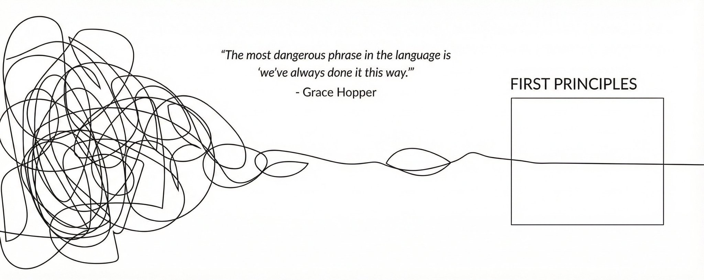
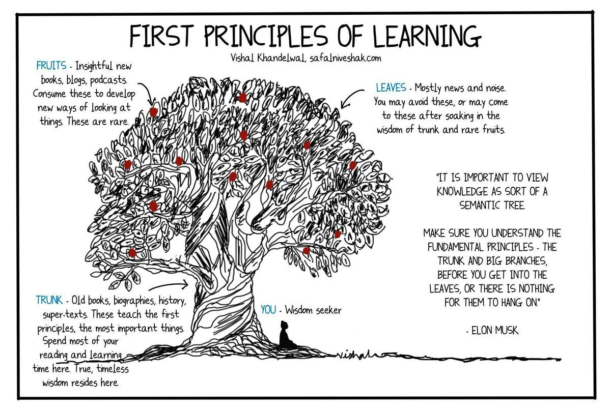
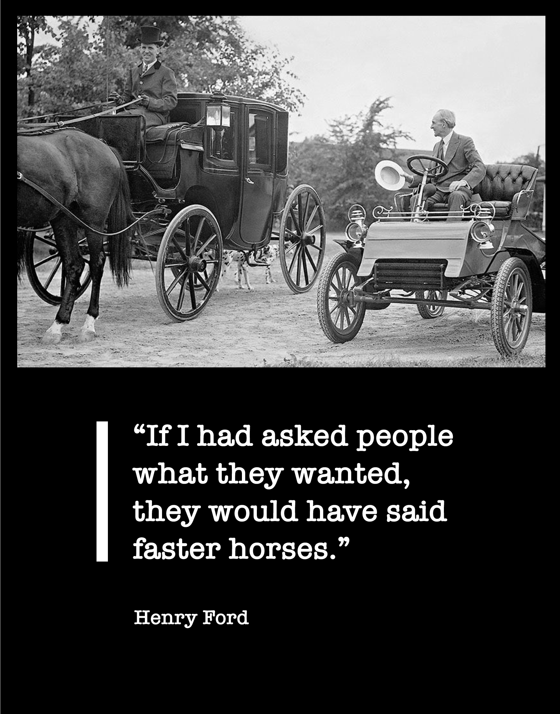

我花了六个月构建了一个没人想要的东西。

不是因为我懒。我拼命工作。熬夜。周末也干。全情投入。

问题在于我构建的是我"应该"构建的东西。我看了看我这个领域其他人都在做什么，然后做了一个版本。复制了模式。跟了模板。

但这没用。因为模板是为别人的情况设计的。为别人的受众。为别人的优势。

当我终于停下来问自己，"等等，我实际上想要达成什么，"答案和我一直在构建的东西完全不同。

我不得不扔掉六个月的工作，从头开始。

那是2023年我从大学退学后大约一年。老实说，整个经历教会了我一件本该更早学会的事情。大多数人，包括我自己，实际上并没有在思考。我们做模式匹配。我们复制。我们做那些看起来对别人有效的事，却不问问是否对我们有意义。

有一种说法叫第一性原理思维。一旦我理解了它，我开始发现它无处不在。

## 基本概念

这个概念可以追溯到亚里士多德。他把第一性原理定义为"事物被认识的第一个基础。"

这听起来很抽象，让我试着把它具体化。

第一性原理是一个不能被进一步分解的基本真理。基础。基石。无论别人怎么想怎么做，它都是真的。

当你从第一性原理推理时，你从这些基本真理出发，逐步构建。你不是从现有的东西出发。不是从别人在做什么出发。你从根本的真理出发，然后向前推进。

对立面是类比推理。这就是大多数人在大多数时间做的事情。包括我，诚实地说。

类比推理意味着看着已经存在的东西然后复制它。"这对他们有效，所以对我也有效。""这一直都是这样做的。""每个人都做X，所以X一定是对的。"

类比更快。更容易。心理上更轻松。

但它有上限。你永远无法通过复制已经存在的东西超越已经存在的东西。

## 火箭的例子

埃隆·马斯克（[@elonmusk](https://x.com/@elonmusk)）经常谈论这个。有一个采访，他解释了SpaceX（[@SpaceX](https://x.com/@SpaceX)）如何处理火箭成本。

> 2021年12月1日
>
> 最重要的问题是，我们需要更好的心理防火墙来应对不断涌来的信息。批判性思维和第一性原理思维应该是中学必修课。谁写了运行在你头脑中的软件？你确定你真的想要它在那里吗？

他说了类似的话："我倾向于从物理框架来处理事情。物理学教会你从第一性原理而不是类比来推理。所以我说，好吧，让我们看看第一性原理。火箭是由什么构成的？航空级铝合金，加上一些钛、铜和碳纤维。然后我问，这些材料在商品市场上的价值是多少？结果是，火箭的材料成本大约是典型价格的2%。"

百分之二。

所以98%的成本是……什么？制造。人工。管理费用。利润。那些可能降低成本的东西。

2%和100%之间的差距就是机会。不是逐步改进现有火箭设计。而是从根本上重新思考火箭如何建造。

大多数人不问这些问题。他们只是接受"火箭很贵"作为一个固定真理。像是物理定律什么的。但它不是。它只是一直以来做事的方式。

## 为什么我们默认复制

我想明确的是，类比推理并不是愚蠢的。它在大多数时候真的很有用。

如果你在学习烹饪，复制食谱是完全合理的。如果你刚进入一个行业，复制有效的东西是一个很好的起步策略。

问题在于当类比变得无意识时。当你忘记你正在复制而开始认为你正在思考时。

查理·芒格经常谈论这个。他说："我认为，不可否认的是，人类的大脑用模型工作。诀窍是让你的大脑比别人的大脑更好地工作，因为它理解最基础的模型。"

这里的关键词是"基础"。大多数人的心智模型不是基础的。它们是复制的复制。没有人检验过的接受来的智慧。

当我构建那个没人想要的东西时，我陷入了类比模式。我看了看我所在领域的成功人士，看到他们在做什么，就假设那是 playbook。从没质疑过他们的 playbook 对我的情况是否有意义。

我23岁。我没有一个已经做了十年的人相同的受众。我没有相同的资源。我没有相同的优势。为什么会用相同的 playbook？

但我从不问这个。我只是复制。

## 像物理学家一样思考

马斯克经常把第一性原理思维描述为像物理学家一样思考。

在物理学中，你不能说"好吧，事情就是这样运作的"。你必须理解为什么。基本的规律是什么？限制是什么？在这些限制内什么是可能的？

理查德·费曼，我读的最喜欢的物理学家，有这种学习技巧。他会尝试用简单的语言解释复杂的想法。如果他做不到，他就知道自己并不是真正理解。

他是这么说的："第一个原则是你不能欺骗自己，而你是最容易欺骗的人。"

这基本上就是全部了。我们大多数人在欺骗自己。我们认为我们理解了一些东西，因为我们能重复我们听到的。但重复不是理解。

当你只知道结论时，你无法适应。你看不到公式何时不适用。你无法为新情况创造新的解决方案。

当你理解第一性原理时，你可以从零重建。你可以适应任何事情。

## 我实际上错在哪里

让我具体说说自己的失败，因为我认为它比理论更好地说明了这一点。

当我退学后开始创作内容时，我假设我需要在每个平台上。Twitter、Instagram、YouTube、LinkedIn。每个人都这么说。处处存在。建立全渠道存在感。

但我从不质疑这个假设。这对我来说真的正确吗？

> Naval Ravikant 有这句话："得到你想要的东西的第一步是知道你想要什么。"

我不知道我想要什么。我只知道别人在做什么。所以我复制。

当我最终从第一性原理分解时：

我要达成什么？建立一个对我正在构建的东西感兴趣的受众。

那些人实际上在哪里消磨时间？主要是 Twitter。也许 YouTube。我的细分市场不是 Instagram。

我的限制是什么？时间。我不可能把所有事情都做好。

那么第一性原理的答案是什么？在一两个平台上深入，而不是在五个平台上浅薄。

这是显而易见的（回想起来）。但我花了数月分散自己的精力，因为我从不质疑"处处存在"的假设。

## 苏格拉底式的方法

第一性原理思维基本上是苏格拉底方法在问题上的应用。

苏格拉底会接受一些普遍持有的信念，然后不断问"为什么"和"这真的正确吗"，直到这个信念要么证明了自己要么崩溃。

大多数信念都会崩溃。它们基于无人检验的假设。

Shane Parrish（[@shaneparrish](https://x.com/@shaneparrish)）来自Farnam Street，他写了很多关于这个的东西。他说："第一性原理思维是逆向工程复杂情况和释放创意可能性的最佳方式之一。有时被称为从第一性原理推理，它是一种工具，通过分离基于它们的底层想法或事实来帮助澄清复杂问题。"

> 2020年10月31日
>
> 第一性原理思维是你工具箱中最有效的心理工具之一。它也解释了一些人为什么比其他人有更高的创新力。以下是它是什么，为什么重要，以及三个教训。

但这个过程不舒服。它让你感到愚蠢。你意识到你"知道"的东西有多少你实际上并不知道。你只是在重复东西。

但那种不舒服就是重点。在它的另一边是真正的理解。

有帮助的问题：

什么是我实际知道为真的 versus 我在假设什么？

我为什么相信这个？那个信念从哪里来的？

如果我必须从零重建，我会做什么？

简单的问题。但坐下来思考是困难的。你的大脑想要跳到舒适的类比。

## 这是哪里失效

我应该诚实地说，第一性原理思维并不总是正确的方法。

它很慢。昂贵。消耗你不总是有的脑力。

对于大多数日常决策，类比是可以的。我午餐应该吃什么？复制昨天有效的。不需要从基础推导营养。

杰夫·贝索斯在亚马逊谈论这个。他区分了他所说的 Type 1 和 Type 2 决策。

他是这么说的："一些决策是重大的且不可逆的或几乎不可逆的。这些决策必须系统地、仔细地、缓慢地，带着极大的审慎和协商来做出。如果你走过去却不喜欢另一边的样子，你无法回到你之前的地方。"

那些是 Type 1 决策。它们值得用第一性原理思维。

Type 2 决策是可逆的。你可以改变主意。对于这些，快速前进。使用类比。

错误是对 Type 1 决策使用类比思维。或者在无关紧要的事情上浪费第一性原理思维。

## 这实际上看起来像什么

我天生不擅长第一性原理思维。我的默认仍然是复制。跟模板。

但我一直在尝试培养这种能力。以下是帮助我的东西，虽然我仍在摸索，说实话。

写下来。当我被一个问题困住时，我会写下关于它的所有假设。只是列出它们使它们可见。然后我可以逐个质疑。

反复问"为什么"。像一个幼儿。为什么这是真的？为什么我相信那个？通常在三个或四个为什么之后，你会触及一些基本的或明显未经检验的东西。

想象我从零开始。如果我对这应该"如何"工作一无所知，我会做什么？

彼得·蒂尔有这个著名的面试问题："什么重要真理很少有人同意你的观点？"

这基本上就是问：在哪里你做了第一性原理思维，导致你走向与人群不同的地方？

大多数人都无法回答。因为大多数人不从第一性原理思考。他们从类比思考。所以他们最终得出与每个人相同的结论。

## 亨利·福特的事情

有一个关于亨利·福特的故事可能是杜撰的，但我认为它说明了这一点。

据说有人问他关于客户研究。客户想要什么？

他说："如果我问人们他们想要什么，他们会说是更快的马。"

这就是区别。

类比说：人们用马做交通工具。给他们更好的马。

第一性原理说：实际上要解决的是什么问题？从A到B。最好的方式是什么？也许根本不是马。

那个要更快的马的人并不完全是错的。他们只是从现有的东西推理。他们无法想象还不存在的东西。

这就是为什么突破性的想法很少来自复制。复制让你保持在已经存在的东西的盒子内。

## 不舒服的部分

第一性原理思维不舒服，因为它让你承担责任。

当你用类比推理时，你有一个借口。"我做了每个人都告诉我要做的。我遵循了最佳实践。不是我的错。"

当你从第一性原理推理时，你拥有结果。你质疑了假设。你做了决定。

大多数人不想要那个责任。更容易跟随模板，然后在事情出错时指责模板。

但那些真正构建新东西的人接受那个责任。他们从基础推理，做出原创的赌注，并拥有结果。

我仍然比我想要的更默认类比。它更容易。但我正在尝试抓住自己。尝试问：这是真的吗？还是我只是在复制？

那六个月我浪费的时间有时仍然困扰着我。

不完全是遗憾。我从中学习了。但我想到如果我早点停止质疑我的假设，可以节省多少时间。

每个人都在这样做。是因为这是最好的方式？还是只是因为每个人都在互相复制？

事情一直都是这样做的。是因为这是正确的？还是因为没有人质疑它？

大多数时候，假设会成立。但有时候不会。

而那就是所有的机会所在。

---

> 原文地址：<a href="https://x.com/jaynitx/status/2052734499319091384">https://x.com/jaynitx/status/2052734499319091384</a>
