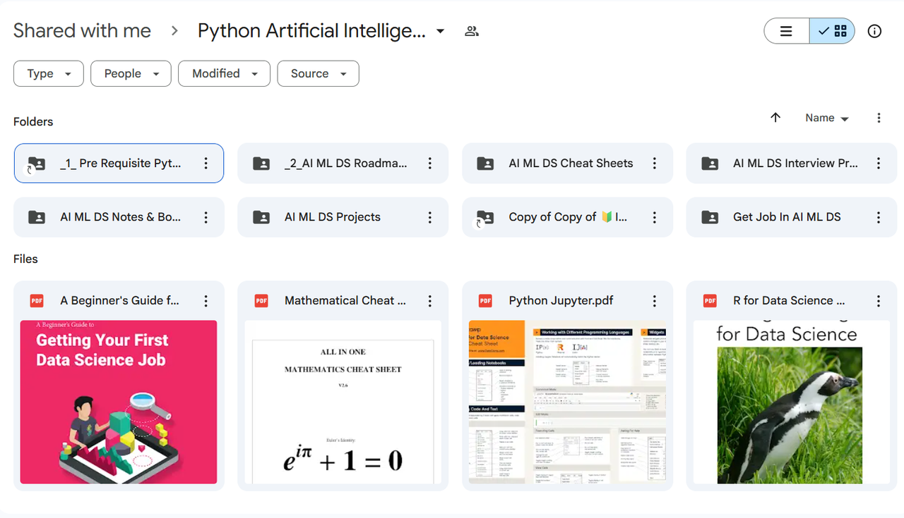
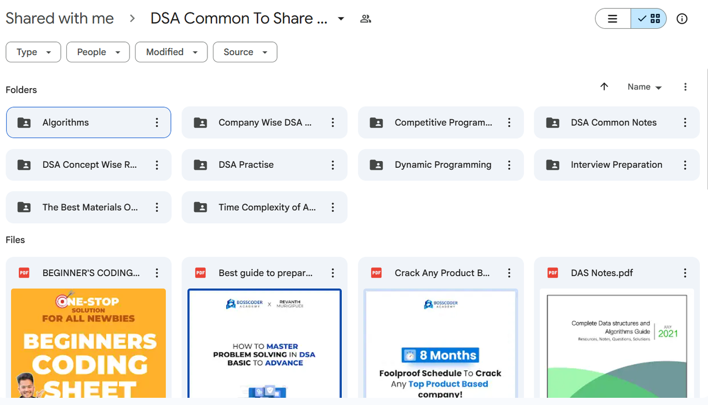
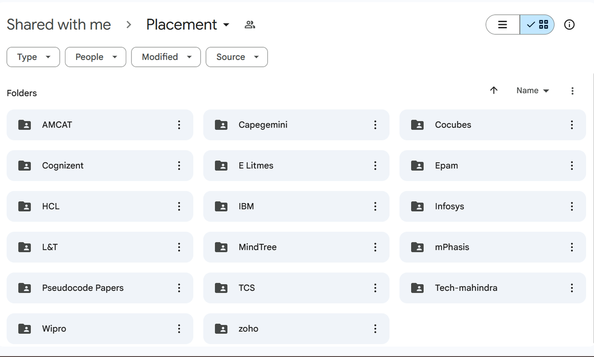
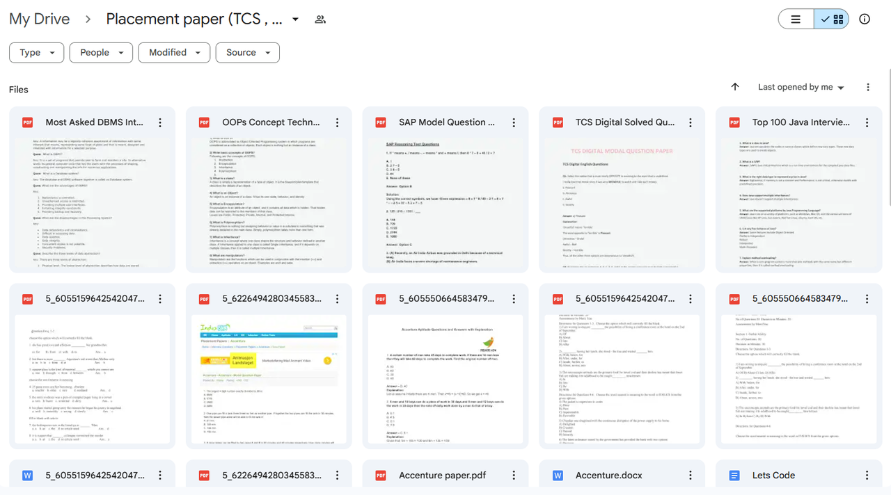
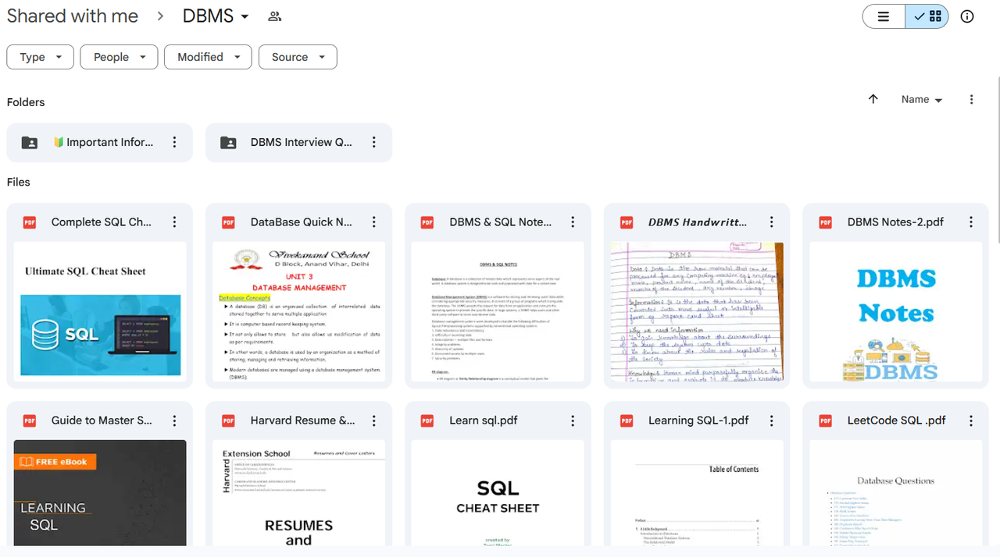
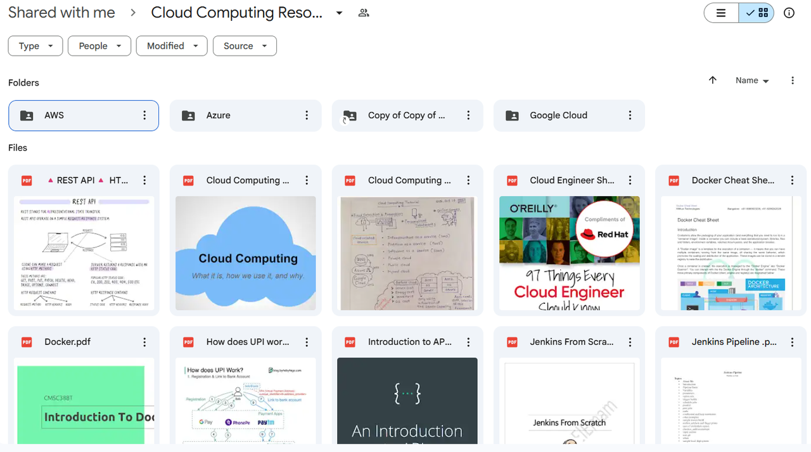
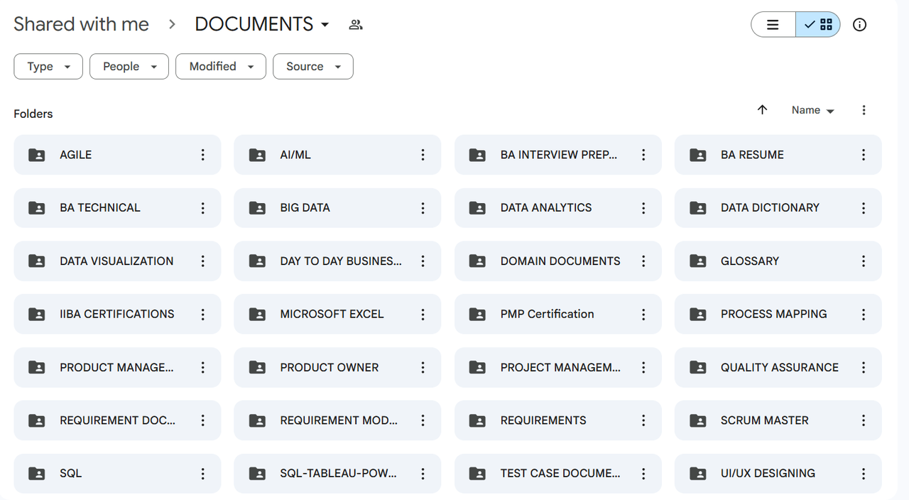

# Let's Code material

## Introduction

Welcome to your **ultimate collection of free placement preparation materials** for cracking technical interviews and succeeding in both on-campus and off-campus placements. These resources are **carefully curated and regularly updated** to help you prepare efficiently.

## Complete Resource Collection

### 1. Data Structures and Algorithms (C, C++, Java, Python)

Comprehensive collection of **DSA notes**, coding problems, and frequently asked interview questions.

📁 [Access DSA Resources](https://drive.google.com/drive/folders/1Ay5CmkoRJ5eEGcFskULc3CHNQn5iCVs3)

Java programming course

***

### 2. Computer Science Fundamentals

Covers **Operating Systems**, **Computer Networks**, **Software Engineering**, and other essential CS concepts.

📁 [Access CS Fundamentals](https://drive.google.com/drive/u/1/folders/18FBvExqEtt9mtNKKP65f_ETdtS7nCG1G)

CS fundamentals book

***

### 3. AI, ML, and Data Science

Access a complete collection of **Artificial Intelligence, Machine Learning, and Data Science** resources. Includes roadmaps, cheat sheets, projects, books, and interview preparation material.

📁 [Access AI/ML/DS Materials](https://drive.google.com/drive/folders/1D0w7UjTJlCEQNj6GXvqCgvlLPbsaCnG_)

AI Tools Subscription

***

### 4. Aptitude Materials

Preparation material for **quantitative aptitude**, **logical reasoning**, and **verbal ability**. Ideal for placement tests.

📁 [Access Aptitude Resources](https://drive.google.com/drive/folders/1XmI6Iq_0MXJ6vq6Nkk-DcBK_y_LWNLCM)

***

### 5. Off-Campus Placement Materials

Guides and resources to help you prepare for **off-campus recruitment drives**, including preparation strategies and notes.

📁 [Access Off-Campus Guide](https://drive.google.com/drive/u/0/folders/1iKiq-ZbI3dTN0igO8xRnyaWJF_RCf2Ym)

***

### 6. Company-Specific Placement Questions

**Previous year questions** and interview materials for **TCS, Wipro, Accenture, Infosys, HCL**, and other major recruiters.

📁 [Access Company Materials](https://drive.google.com/drive/folders/1V5-NWPj1JhfBBf6wpU4rV7Ebar2ShSi5)

***

### 7. Advanced DSA

Tackle **complex algorithms** and **optimization problems** for advanced coding interview preparation.

📁 [Access Advanced DSA](https://drive.google.com/drive/folders/1Da_v5uHIvBscWcRRgMsYGq-hJ00dQL9Y)

***

### 8. Database Management System (DBMS) Materials

Covers **database concepts**, **SQL queries**, and **design principles** frequently asked in technical interviews.

📁 [Access DBMS Resources](https://drive.google.com/drive/folders/1f5dmqV84E-BN1PiVWqUhNXzcVWkCbGPa)

***

### 9. Cloud Computing

Learn the **fundamentals of cloud computing** and key topics relevant to full-stack and backend developer interviews.

📁 [Access Cloud Materials](https://drive.google.com/drive/folders/1_iB9UnsVlOWvdjKVmtC7b8b26L2ORdVR)

Cloud certification prep

***

### 10. Business Analysis, Data Analytics, and Project Management Resources

Extensive collection of **Business Analysis**, **Data Analytics**, and **Project Management** materials. Includes certifications, interview preparation, SQL, visualization, documentation, agile, product management, and more.

📁 [Access BA & Project Management Materials](https://drive.google.com/drive/u/0/folders/1if09a9QyNfBRlAKey7If5preZ3BswudZ)
