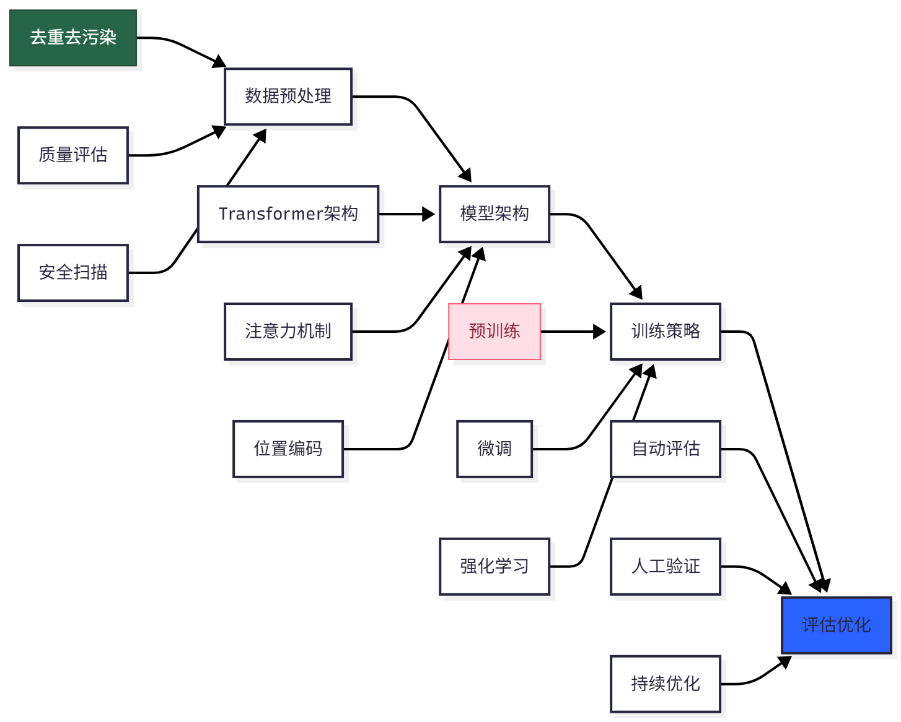
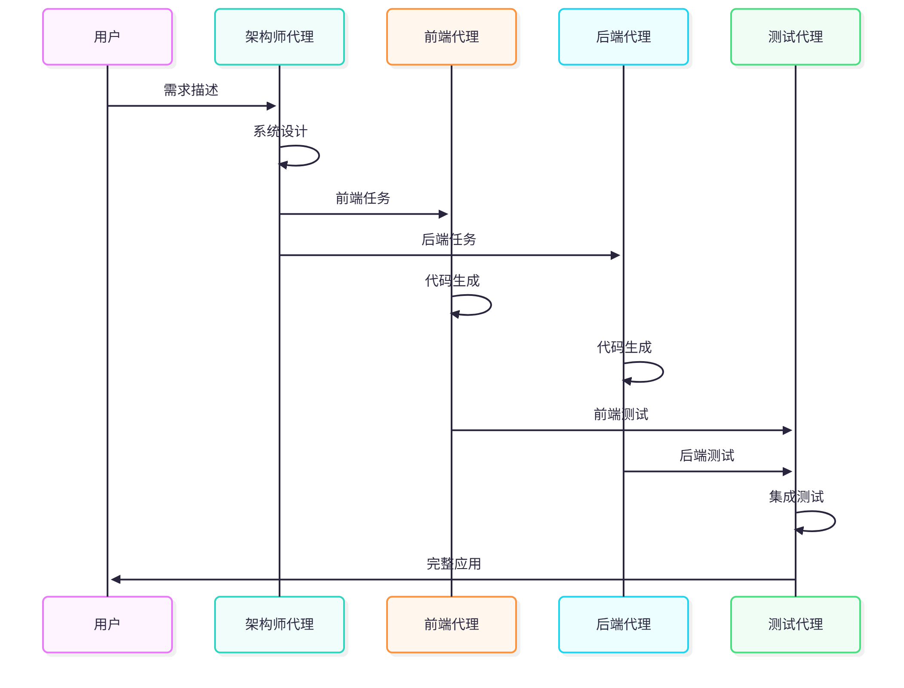
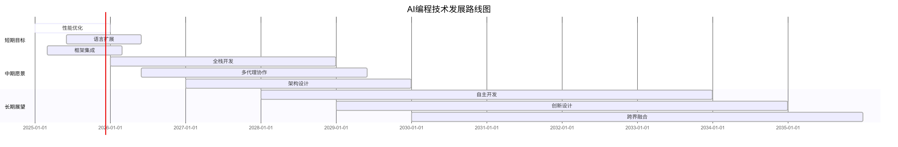
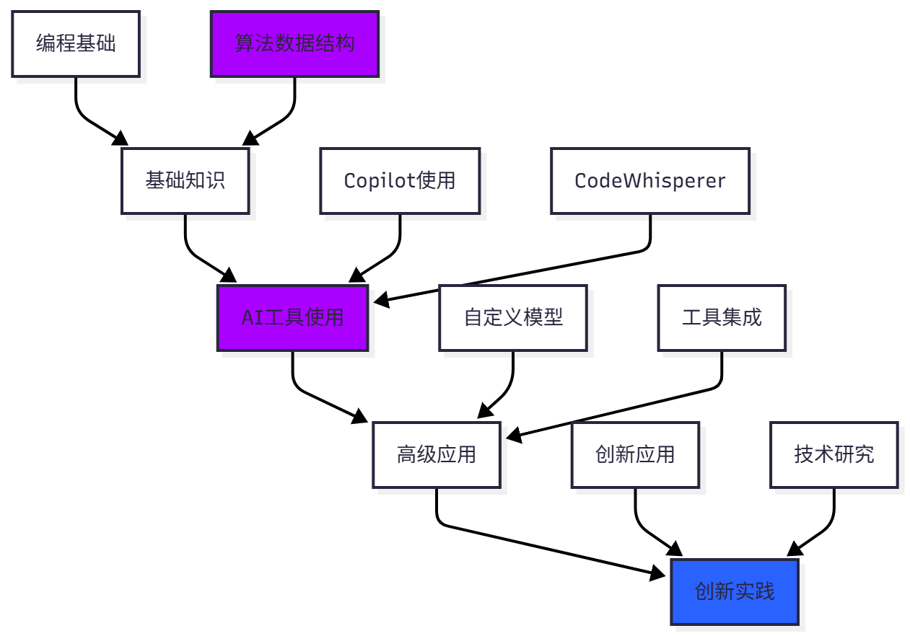

# AI编程革命

# AI编程革命：从代码基础模型到智能代理的完整指南

## 📝 摘要

> 本文基于《从代码基础模型到智能代理：代码智能的综合调研与实践指南》研究报告，系统性地总结了AI编程领域的最新进展、技术架构、应用场景和未来发展趋势。报告涵盖了从1960年代人工编码到未来AI自治时代的完整演进历程，深入分析了通用大语言模型与代码专用模型的技术差异，并提供了实用的开发建议。

## 🚀 1. 引言

大型语言模型（LLMs）已经从根本上改变了自动化软件开发，通过将自然语言描述直接转换为功能代码，推动了商业应用的普及。从GitHub Copilot到Claude Code，从Cursor到Trae，AI编程工具正在重塑开发者的工作方式。

> ### 💡 核心突破
> - **性能提升**：HumanEval基准测试从个位数提升至95%+成功率
> - **商业化应用**：Microsoft、Anthropic、ByteDance等巨头纷纷推出AI编程工具
> - **技术成熟**：从规则驱动系统发展到基于Transformer的先进架构

## 📅 2. AI编程发展历程

### ⏱️ 2.1 六个发展阶段

#### 阶段一：人工编码时代 (1960s-1980s)
- **特征**：纯手动编写代码
- **挑战**：开发者需要记忆语法和API
- **效率**：开发效率相对较低

#### 阶段二：工具辅助时代 (1980s-2000s)
- **突破**：集成开发环境(IDE)出现
- **功能**：语法高亮和基本自动补全
- **进步**：调试工具的改进

#### 阶段三：框架驱动时代 (1990s-2020s)
- **革新**：标准化框架普及
- **工具**：代码模板和生成器
- **管理**：依赖管理工具的出现

#### 阶段四：AI辅助时代 (2020-2025)
- **智能**：智能代码补全
- **转换**：自然语言到代码转换
- **自动化**：自动化测试生成

#### 阶段五：AI驱动时代 (2025+)
- **自主**：全自主代码生成
- **优化**：架构设计优化
- **智能**：智能错误修复

#### 阶段六：AI自治时代 (未来)
- **独立**：完全自主的软件开发
- **进化**：自我进化的代码系统
- **创造**：创造性问题解决

### 2.2 技术演进图表




## 🗂️ 3. 代码基础模型分类

### 3.1 通用大型语言模型

#### 代表性模型
- **GPT-4系列** (OpenAI)：强大的推理能力，广泛的知识基础
- **Claude系列** (Anthropic)：安全导向，深度对话理解
- **LLaMA系列** (Meta)：开源模型，广泛适用性

#### 优势分析
- 广泛的知识基础
- 强大的推理能力
- 多语言支持
- 跨领域应用能力

#### 局限性
- 代码专业化程度有限
- 缺乏深度编程理解
- 上下文长度限制
- 计算资源消耗大

### 3.2 代码专用大型语言模型

#### 闭源模型
- **GitHub Copilot** (基于Codex)
- **Amazon CodeWhisperer**
- **Google Codey**

#### 开源模型
- **StarCoder系列**：开源代码生成模型
- **Code LLaMA**：专为代码任务优化的LLaMA
- **DeepSeek-Coder**：高性能代码专用模型
- **QwenCoder**：多语言代码模型

#### 性能突破
- **HumanEval基准**：95%+成功率
- **语言支持**：30+编程语言
- **代码理解**：深度语法语义理解
- **生成质量**：接近人类开发者水平

### 3.3 模型性能对比

| 模型类型 | 代表模型 | HumanEval准确率 | 支持语言数 | 响应时间 | 主要优势 |
|---------|---------|----------------|-----------|----------|----------|
| 通用模型 | GPT-4 | 85% | 50+ | <1s | 广泛知识 |
| 专用模型 | Code LLaMA | 95% | 30+ | <100ms | 代码专业 |
| 开源模型 | StarCoder | 92% | 25+ | <200ms | 开放透明 |
| 新兴模型 | DeepSeek | 88% | 20+ | <150ms | 快速迭代 |

## 🧠 4. 训练策略与技术创新

### 4.1 数据策划与预处理

#### 训练数据来源
- **GitHub公共仓库**：大规模开源代码库
- **StackOverflow问答**：编程问题解决方案
- **技术文档**：官方文档和教程
- **开源项目**：各类开源项目代码

#### 数据清洗技术
- **去重处理**：消除重复代码片段
- **去污染处理**：移除潜在有害内容
- **质量评估**：代码质量和可读性评分
- **许可证检查**：确保合规性
- **安全扫描**：检测安全漏洞

### 4.2 训练阶段详解

#### 预训练阶段
- **目标**：大规模无监督学习
- **内容**：代码语法和语义理解
- **方法**：掩码语言模型、下一词预测
- **数据**：数万亿token的代码数据

#### 监督微调(SFT)
- **目标**：特定任务优化
- **内容**：指令跟随能力
- **方法**：高质量指令-响应对训练
- **数据**：精心策划的训练数据集

#### 强化学习优化
- **目标**：基于反馈持续改进
- **内容**：代码正确性验证
- **方法**：人类反馈强化学习(RLHF)
- **评估**：执行结果和用户偏好的奖励模型

#### 多模态融合
- **代码-文档融合**：理解代码上下文
- **图像界面生成**：从设计稿生成代码
- **语音指令理解**：语音控制代码生成

### 4.3 技术创新点



## 🛠️ 5. 实际应用场景

### 5.1 代码生成与补全

#### 核心功能
- **自然语言到代码转换**：将需求描述转换为可执行代码
- **上下文感知代码补全**：基于当前代码环境智能补全
- **整个函数/类生成**：一次性生成完整代码模块
- **代码重构建议**：优化现有代码结构和性能

#### 性能指标
- **准确率**：95%+ (HumanEval基准)
- **响应时间**：<100ms实时补全
- **支持语言**：30+主流编程语言
- **代码覆盖率**：80%+开发场景

#### 应用案例
```python
# 用户需求："创建一个Python函数，接收数字列表，返回平均值和中位数"

def calculate_stats(numbers):
    """
    计算数字列表的平均值和中位数
    处理空列表和异常输入情况
    """
    if not numbers:
        return None, None
    
    try:
        clean_numbers = [float(x) for x in numbers if x is not None]
        
        if not clean_numbers:
            return None, None
            
        mean_value = sum(clean_numbers) / len(clean_numbers)
        
        sorted_nums = sorted(clean_numbers)
        n = len(sorted_nums)
        
        if n % 2 == 0:
            median_value = (sorted_nums[n//2 - 1] + sorted_nums[n//2]) / 2
        else:
            median_value = sorted_nums[n//2]
            
        return mean_value, median_value
        
    except (TypeError, ValueError) as e:
        print(f"输入错误: {e}")
        return None, None
```

### 5.2 智能调试与错误修复

#### 自动化能力
- **错误检测和定位**：自动识别代码错误位置
- **修复建议生成**：提供多种修复方案
- **回归测试创建**：自动生成测试用例
- **性能优化建议**：识别性能瓶颈并提供优化方案

#### 性能表现
- **错误识别准确率**：90%+
- **修复建议可用性**：85%+
- **测试覆盖率提升**：40%+

### 5.3 代码审查与质量保证

#### 审查功能
- **代码风格检查**：确保代码符合规范
- **安全漏洞识别**：检测潜在安全风险
- **性能瓶颈检测**：识别性能问题
- **最佳实践推荐**：提供改进建议

#### 质量指标
- **安全漏洞发现率**：95%+
- **性能问题识别**：88%+
- **代码规范符合率**：92%+

### 5.4 多代理协作开发

#### 协作模式
- **前端-后端分离**：专门代理负责不同技术栈
- **架构师代理**：负责整体系统设计
- **测试代理**：自动生成和执行测试
- **运维代理**：处理部署和监控

#### 协作流程
    

## ⚖️ 6. 挑战与解决方案

### 6.1 技术挑战

#### 代码正确性验证
- **语法正确性**：确保生成代码符合语法规范
- **逻辑一致性**：验证代码逻辑的正确性
- **运行时行为**：预测代码的实际执行效果

#### 上下文理解限制
- **长代码库理解**：处理大型项目的复杂性
- **跨文件依赖关系**：理解模块间的依赖
- **项目架构把握**：整体系统设计的理解

#### 安全性考量
- **恶意代码生成防护**：防止生成有害代码
- **敏感信息泄露避免**：保护隐私数据
- **许可证合规性**：确保代码使用合规

### 6.2 解决方案

#### 技术创新
- **多代理协作框架**：多个AI代理协同工作
- **强化学习与验证**：基于反馈持续改进
- **知识图谱集成**：构建代码知识库
- **实时测试执行**：动态验证代码正确性

#### 最佳实践
- **渐进式部署**：逐步引入AI工具
- **人工监督**：保持人在回路中
- **持续学习**：适应新技术和框架
- **安全审计**：定期安全检查

## 🔮 7. 未来发展趋势

### 7.1 短期发展 (1-2年)

#### 性能提升
- **准确率接近100%**：在标准化测试中达到人类水平
- **响应时间优化**：实现实时交互体验
- **资源效率提升**：降低计算资源消耗

#### 功能扩展
- **语言支持扩展**：支持更多编程语言
- **框架集成深化**：与主流开发框架深度集成
- **个性化适应**：学习个人编码风格

### 7.2 中期愿景 (3-5年)

#### 全栈开发能力
- **完整应用生成**：从前端到后端的完整应用
- **架构设计自动化**：智能系统架构设计
- **数据库设计优化**：自动设计数据模型

#### 协作开发
- **多AI代理协作**：多个专门代理协同工作
- **团队工作流集成**：融入现有开发流程
- **持续学习优化**：实时适应新技术

### 7.3 长期展望 (5+年)

#### 自主开发能力
- **完全独立开发**：无需人工干预的软件开发
- **创新解决方案**：创造性的问题解决能力
- **自我进化系统**：代码系统的自我改进

#### 跨界融合
- **与其他AI系统集成**：形成完整的AI开发环境
- **多模态交互**：支持语音、视觉等多种交互方式
- **创造性设计**：具备创新设计能力

### 7.4 发展路线图



## 💡 8. 实践建议

### 8.1 对于开发者

#### 技能提升策略
1. **拥抱变化**：积极尝试AI编程工具
2. **提升技能**：专注于架构设计和问题解决
3. **批判思维**：验证AI生成代码的正确性
4. **持续学习**：跟上技术发展趋势

#### 学习路径


### 8.2 对于企业

#### 实施策略
1. **工具集成**：将AI编程工具整合到开发流程
2. **培训投入**：提升团队的AI工具使用能力
3. **规范制定**：建立AI辅助开发的最佳实践
4. **安全管控**：制定相应的安全策略

#### 部署方案
- **试点项目**：选择小型项目试点应用
- **团队培训**：组织AI工具使用培训
- **流程优化**：调整开发流程适应AI工具
- **效果评估**：定期评估应用效果

## 🔚 9. 结论

AI编程正在经历前所未有的快速发展，从简单的代码补全到复杂的软件开发自动化，这项技术正在重塑整个软件工程领域。虽然仍面临挑战，但技术的持续进步和商业化应用的普及表明，AI编程将成为未来软件开发不可或缺的一部分。

### 核心观点
1. **技术成熟度**：AI编程技术已达到实用化水平
2. **应用广泛性**：在各个开发环节都有重要应用
3. **发展潜力**：未来发展潜力巨大，前景广阔
4. **变革意义**：将彻底改变软件开发方式

### 行动建议
- **开发者**：积极拥抱变化，提升核心竞争力
- **企业**：制定AI策略，逐步引入AI工具
- **研究者**：关注前沿技术，推动创新发展
- **行业**：建立标准规范，促进健康发展

随着技术的不断成熟，我们可以期待一个更加智能、高效的软件开发新时代的到来。AI编程不仅是技术的革新，更是开发范式的根本性转变，将为整个软件行业带来深远的影响。

---

## 参考文献

1. 《从代码基础模型到智能代理：代码智能的综合调研与实践指南》，BUAA-SKLCCSE等研究机构，2025
2. GitHub Copilot官方文档，Microsoft，2025
3. Code LLaMA技术白皮书，Meta AI，2025
4. StarCoder项目文档，BigCode项目，2025
5. HumanEval基准测试报告，OpenAI，2025

---
