# 一文详解多智能体核心架构及 LangGraph 框架

> **随着大模型的快速发展，构建智能体已成为大模型应用最基本的能力了，然而，单智能体在处理复杂、多步骤任务时往往存在局限性。为了应对这一挑战，多智能体系统应运而生，它通过多个智能体协同工作的方式，将复杂任务分解为多个子任务，由不同的智能体分别处理，最终合并结果并返回。LangGraph 作为 LangChain 生态系统的重要扩展，通过引入有向图模型重构了传统智能体的工作流架构，将复杂的多步骤交互和决策过程模块化，是目前主流的多智能体集成框架之一。**

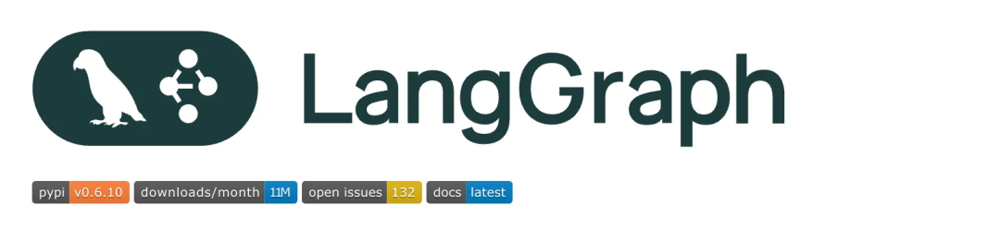

本文主要介绍多智能体集成框架 LangGraph 的相关概念及使用，关于大模型应用开发的基本的流程可以阅读：[《GitHub 12w Star 神器！一文详解大模型集成框架 LangChain》](https://mp.weixin.qq.com/s?__biz=MzI2NDU4OTExOQ==&mid=2247693109&idx=1&sn=fa97420d453a5736db39937b725ca12b&scene=21#wechat_redirect)，详细介绍了构建大模型应用的步骤及概念（提示词模版、输出解析器、记忆、工具、Agent、RAG 等）

# 01

**LangGraph 概述**

## **1.1 什么是 LangGraph**

LangGraph 是 LangChain 生态的一部分，专门用于构建基于大模型（LLM）的复杂、有状态、多智能体应用的框架，核心思想是**将应用的工作流程抽象为一个有向图结构，通过节点和边来定义任务的执行步骤和逻辑流，**&#x4ECE;而提供了远超传统线性链式调用的灵活性和控制力。相比传统的线性执行模式，**LangGraph 支持条件分支、循环、并行等复杂控制流，能够实现状态持久化、断点续跑、时间旅行、人机协作等高级功能，并提供了多智能体协作、层级架构等多种架构模式。**&#x5728;实际应用中，LangGraph 已成功应用于智能客服、自动化运维、研究 Agent 等场景，展现出卓越的适应性和扩展性。

**LangGraph 在 Github 上的热度变化**

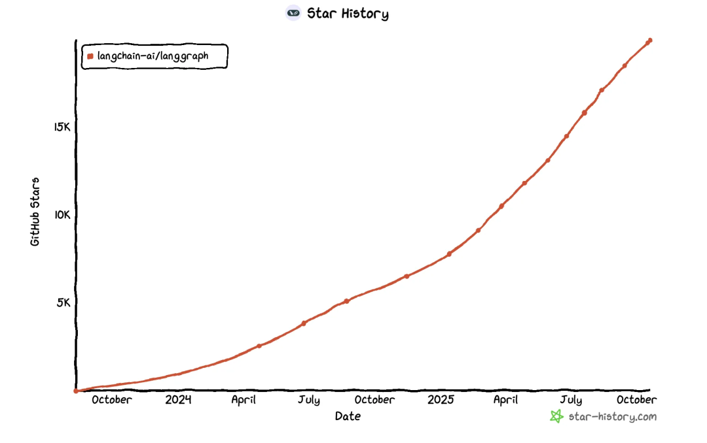

## **1.2 为什么使用 LangGraph**

LangGraph 相比传统的线性执行模式具有显著的技术优势。

1. LangGraph 提供了强大的状态管理机制，允许 Agent 在不同节点之间传递和维护信息，从而实现长期的记忆和多轮对话能力。这种集中式的状态管理避免了传统方法中状态分散在多个变量中的问题，提高了系统的可维护性和可观测性。

2. 通过定义节点和边，可以精确控制 Agent 的执行逻辑，包括条件分支、循环和并行执行等

3. LangGraph 能够无缝集成各种外部工具（如搜索引擎、数据库、API 等），让 Agent 能够获取实时信息、执行特定操作，极大地扩展了 LLM 的能力边界。

4. 图结构使得 Agent 的运行路径清晰可见，便于理解 Agent 的决策过程，并在出现问题时进行快速定位和调试。

5. 模块化与可复用性。每个节点都可以是一个独立的、可复用的组件，维护性高且易于扩展。通过子图机制，复杂的工作流可以被分解为多个可独立开发和测试的模块，提高了开发和测试效率。

### **1.3 安装使用**

安装 LangGraph

```bash
pip install -U langgraph复制
```

使用 LangGraph 创建一个简单的 Agent

```python
def get_weather(city: str) -> str:
    """获取指定城市的天气信息。
    Args:
        city: 城市名称
    Returns:
        返回该城市的天气描述
    """
    return f"今天{city}是晴天"
# 创建模型
model = ChatOpenAI(
    model_name=model_name,
    base_url=base_url,
    api_key=api_key
)


# 使用LangGraph提供的API创建Agent
agent = create_react_agent(
    model=model,          # 添加模型
    tools=[get_weather],  # 添加工具
    prompt="你是一个天气助手"
)
human_message = HumanMessage(content="今天深圳天气怎么样？")
response = agent.invoke(
    {"messages": [human_message]}
)
print(response)
复制
```

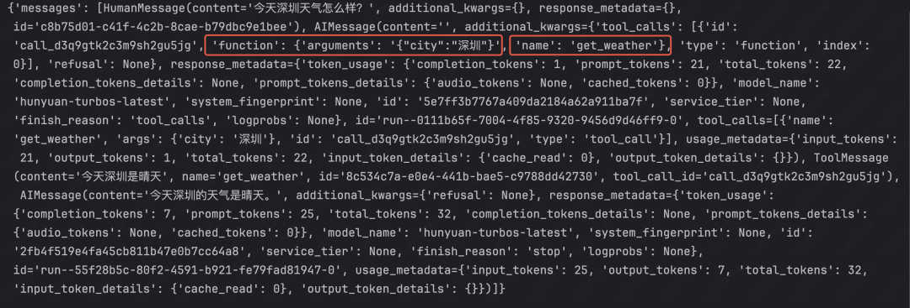

**运行模式：**&#x41;gent 可以通过两种主要模式执行

1. **同步：**&#x4F7F;用 .invoke() 或 .stream()

2. **异步：**&#x4F7F;用 await .ainvoke() 或 async for 配合 .astream()

**最大迭代次数：**&#x4E3A;了避免 Agent 无限循环执行，可以设置一个递归限制

```python
response = agent.invoke(
    {"messages": [{"role": "user", "content": "预定一个深圳到北京的机票"}]},
    {"recursion_limit": 10}   # 指定最大迭代次数
)
复制
```

# 02

**LangGraph 核心**

## **2.1 Graph（图）**

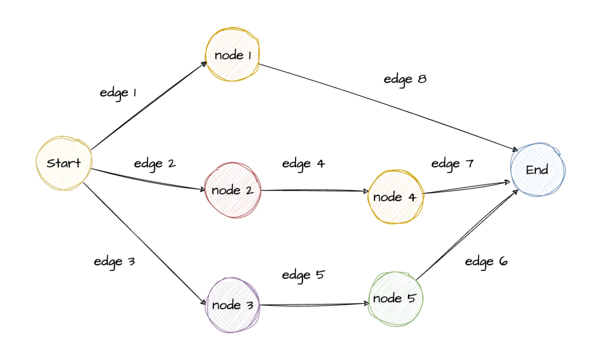

图是一种由节点和边组成的用于描述节点之间关系的数据结构，分为无向图和有向图，有向图是带有方向的图。LangGraph 通过有向图定义 AI 工作流中的执行步骤和执行顺序，从而实现复杂、有状态、可循环的应用程序逻辑。

## **2.2 LangGraph 核心要素（State、Edge、Node）**

### **1、State（状态）**

在 LangGraph 中，**State 是一个贯穿整个工作流执行过程中的共享数据的结构**，代表当前快照，它存储了从工作流开始到结束的所有必要的信息（历史对话、检索到的文档、工具执行结果等），在各个节点中共享，且每个节点都可以修改。State 可以是 TypedDict 类型，也可以是 pydantic 中的 BaseModel 类型。

```python
# 定义状态
class GraphState(TypedDict):
    process_data: dict # 默认更新策略为替换（后续会讲更新策略）
# 创建一个状态图，并指定状态
graph = StateGraph(GraphState)
复制
```

### **2、Node（节点）**

Node 是 LangGraph 中的一个基本处理单元，代表工作流中的一个操作步骤，可以是一个 Agent、调用大模型、工具或一个函数（说白了就是绑定一个函数，具体逻辑可以干任何事情）。

**Node 的设计原则：**

- **单一职责原则：**&#x6BCF;个节点应该只负责一项职责，避免功能过于复杂

- **无状态设计：**&#x8282;点本身不应该保存状态，所有数据都通过输入状态传递

- **幂等性：**&#x76F8;同的输入应该产生相同的输出，确保可重试性

- **可测试性：**&#x8282;点逻辑应该易于单元测试

如下是添加一个节点的例子：

```python
# 定义一个节点，入参为state
def input_node(state: GraphState) -> GraphState:
    print(state)
    return {"process_data": {"input": "input_value"}}
# 定义带参数的node节点
def process_node(state: dict, param1: int, param2: str) -> dict:
    print(state, param1, param2)
    return {"process_data": {"process": "process_value"}}
graph = StateGraph(GraphState)
# 添加inpu节点
graph.add_node("input", input_node)
# 给process_node节点绑定参数
process_with_params = partial(process_node, param1=100, param2="test")
# 添加带参数的node节点
graph.add_node("process", process_with_params)
复制
```

**特殊节点：**

在 LangGraph 中有两个特殊的节点 **START** （开始节点）和 **END**（结束节点）

**\_\_START\_\_节点：**&#x5F00;始节点，确定应该首先调用哪些节点。

```python
from langgraph.graph import START


# 第一个执行的节点是 node_start
graph.add_edge(START, "node_start")
复制
```

也可以通过 graph.set_entry_point("node_start") 函数设置起始节点，等价于 graph.add_edge(START, "node_start")

**\_\_END\_\_节点：**&#x7EC8;止节点，表示后续没有其他节点可以继续执行了（非必须）。

```python
from langgraph.graph import END


# node_end 节点执行后，没有后续节点了
graph.add_edge("node_a", END)
复制
```

也可以通过 graph.set_finish_point("node_end") 函数设置结束节点，等价于 graph.add_edge("node_start"， END)

**错误处理和重试机制：**

LangGraph 还提供了错误处理和重试机制来指定重试次数、重试间隔、重试异常等，用于保证系统的可靠性。

```python
# 重试策略
retry_policy = RetryPolicy(
    max_attempts=3,                       # 最大重试次数
    initial_interval=1,                   # 初始间隔
    jitter=True,                          # 抖动（添加随机性避免重试风暴）
    backoff_factor=2,                     # 退避乘数（每次重试间隔时间的增长倍数）
    retry_on=[RequestException, Timeout]  # 只重试这些异常
)
graph.add_node("process", process_node, retry=retry_policy)
复制
```

**节点缓存：**

LangGraph 支持根据节点输入对节点进行缓存，用于加快节点的响应速度

1. **缓存键与命中：**&#x5F53;一个节点开始执行时，系统会使用其配置的 key_func 根据当前节点的输入数据生成一个唯一的键。LangGraph 会检查缓存中是否存在这个键。如果存在（缓存命中），则直接返回之前存储的结果，跳过该节点的实际执行。如果不存在（缓存未命中），则正常执行节点函数，并将结果与缓存键关联后存入缓存。

2. **缓存有效期：**&#x74;tl 参数能控制缓存的有效期。例如，对于依赖实时数据的天气查询节点，可以设置较短的 ttl（如 60 秒）。而对于处理静态信息或变化不频繁数据的节点，则可以设置较长的 ttl 甚至不设置（None），让缓存永久有效，直到手动清除

```python
class State(TypedDict):
    x: int
    result: int


builder = StateGraph(State)
def expensive_node(state: State) -> dict[str, int]:
    # 模拟耗时
    time.sleep(2)
    return {"result": state["x"] * 2}
#添加节点，并指定缓存策略
builder.add_node("expensive_node", expensive_node, cache_policy=CachePolicy(ttl=3))
builder.set_entry_point("expensive_node")
builder.set_finish_point("expensive_node")
graph = builder.compile(cache=InMemoryCache())
复制
```

### **3、Edge（边）**

Edge 定义了节点之间的连接和执行顺序，以及不同节点之间是如何通讯的，一个节点可以有多个出边（指向多个节点），多个节点也可以指向同一个节点（Map-Reduce），如下是添加边的代码：

```python
# 添加固定边，执行顺序：start -> input -> process -> output -> end
graph.add_edge(START, "input")
graph.add_edge("input", "process")
graph.add_edge("process", "output")
graph.add_edge("output", END)
# 编译图，保证生成的图是正确的，如果添加了边，没添加节点，会报错
app = graph.compile()
app.invoke({})
复制
```

### **4、构建一个完整的图**

图的构建流程：1、初始化一个 StateGraph 实例。2、添加节点。3、定义边，将所有的节点连接起来。4、设置特殊节点，入口和出口（可选）。5、编译图。6、执行工作流。

```python
# 定义状态
class GraphState(TypedDict):
    process_data: dict
def input_node(state: GraphState) -> GraphState:
    print(state)
    return {"process_data": {"input": "input_value"}}
def output_node(state: GraphState) -> GraphState:
    print(state)
    return {"process_data": {"output": "output_value"}}
def process_node(state: dict) -> dict:
    print(state)
    return {"process_data": {"process": "process_value"}}
# 创建一个状态图，并指定状态
graph = StateGraph(GraphState)
# 添加input、process、output节点
graph.add_node("input", input_node)
graph.add_node("process", process_node)
graph.add_node("output", output_node)
# 添加固定边，执行顺序：start -> input -> process -> output -> end
graph.add_edge(START, "input")
graph.add_edge("input", "process")
graph.add_edge("process", "output")
graph.add_edge("output", END)
# 编译图，保证生成的图是正确的，如果添加了边，没添加节点，会报错
app = graph.compile()# 执行
app.invoke({})
复制
```

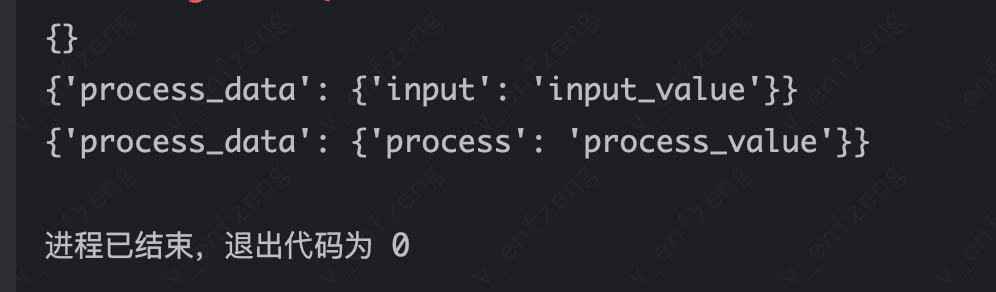

## **2.3 状态合并策略（Reducers）**

LangGraph 工作流中，State 作为贯穿整个节点之间共享数据的结构，每一个节点都可以读取当前 State 的数据，并且可以更新。**Reducer 是定义多个节点之间 State 如何更新的（覆盖、合并、添加等）。**

### **1、直接覆盖：**

如果没有为状态字段指定 Reducer，默认会覆盖更新。也就是说，后执行的节点返回的值会直接覆盖先执行节点的值，即下一个节点的 State 数据是上一个节点的返回。

```python
class OverrideState(TypedDict):
    process_data : dict  # 未指定合并策略，默认覆盖，上一个节点的返回是下一个节点的值
复制
```

### **2、Annotated：使用类型注解指定合并策略**

```python
class AddState(TypedDict):
    data_int: Annotated[int, add]   # 数字相加
    data_list: Annotated[list, add] # 合并两个列表
    data_str: Annotated[str, add]   # 字符串拼接
def add_node1(state: AddState) -> AddState:
    print(state)
    return {"data_int": 1, "data_list": [1], "data_str": "hello "}
def add_node2(state: AddState) -> AddState:
    print(state)
    return {"data_int": 2, "data_list": [2], "data_str": "world"}
复制
```

### **3、内置 Reducer：add_messages（消息列表合并）**

LangGraph 提供的专用 Reducer 函数，能智能的合并消息列表，不只是简单的追加，add_messages 能够保证消息列表正确被累计，常用在多轮对话系统中，主要逻辑包括：

- **追加新消息：**&#x5982;果新消息的 ID 不在现有列表中，则将其追加到列表末尾。

- **覆盖旧消息：**&#x5982;果新消息的 ID 与列表中某条现有消息的 ID 相同，则用新消息替换掉旧消息。用于处理工具调用中间结果或更新流式生成的临时消息。

- **自动类型转换：**&#x5982;果传入一个字符串（如 "Hello World"），add_messages 会自动将其转换为 HumanMessage（用户消息）

```python
class MessageState(TypedDict):
    # 消息列表,使用add_messages合并消息列表
    messages: Annotated[list, add_messages]


def system_node(state: MessageState) -> dict:
    return {"messages": [SystemMessage(content="你是一个精通LangGraph的专家工程师.")]}


def user_input_node(state: MessageState) -> dict:
    return {"messages": [HumanMessage(content="什么是LangGraph?")]}


def ai_response_node(state: MessageState) -> dict:
    return {"messages": [AIMessage(content="LangGraph是一个...")]}


def tool_node(state: MessageState) -> dict:
    return {"messages": [ToolMessage(content="工具调用参数params1", tool_call_id="tool_call_id")]}
复制
```

### **4、自定义 Reducer：实现自定义合并逻辑**

```python
def merge_dict_reducer(source: dict, new: dict) -> dict:
    # 自定义合并逻辑
    result = source.copy()
    result.update(new)
    return result


def max_reducer(source: int, new: int) -> int:
    # 自定义合并逻辑
    return max(source, new)


class CustomReducerState(TypedDict):
    # 使用自定义Reducer的状态
    max_score: Annotated[int, max_reducer]  # 保留最大值
    metadata: Annotated[dict, merge_dict_reducer]  # 字典合并
复制
```

## **2.4 条件边（Conditional Edge）**

实际应用中，工作流的下一个节点可能并不是固定的，需要根据当前的执行状态去确定需要路由到哪一个节点。**条件边可以动态控制执行流程，**&#x4C;angGraph 中可以指定路由函数，来选择具体要执行的节点（可以是多个节点）

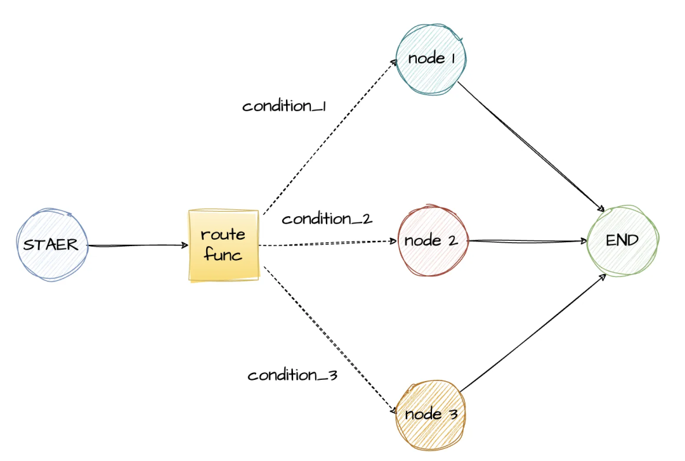

```python
def route_by_sentiment(state: GraphState) -> str:
    # 路由逻辑...返回最终的条件
    return "condition_1"


graph = StateGraph(GraphState)
graph.add_node("node1", node1)
graph.add_node("node2", node2)
graph.add_node("node3", node3)
# 添加路由函数，参数：当前节点，路由函数，路由函数返回的条件与node的映射
graph.add_conditional_edges(
    START,
    route_by_sentiment,
    {
        "condition_1": "node1",
        "condition_2": "node2",
        "condition_3": "node3"
    }
)


# 所有处理节点都连接到END
graph.add_edge("node1", END)
graph.add_edge("node2", END)
graph.add_edge("node3", END)
app = graph.compile()
复制
```

LangGraph 提供了图的可视化，可以通过调用函数保存图，用于查看工作流是否与预期定义的规则一致。

```python
png_data = app.get_graph().draw_mermaid_png()
with open("graph.png", "wb") as f:
    f.write(png_data)
复制
```

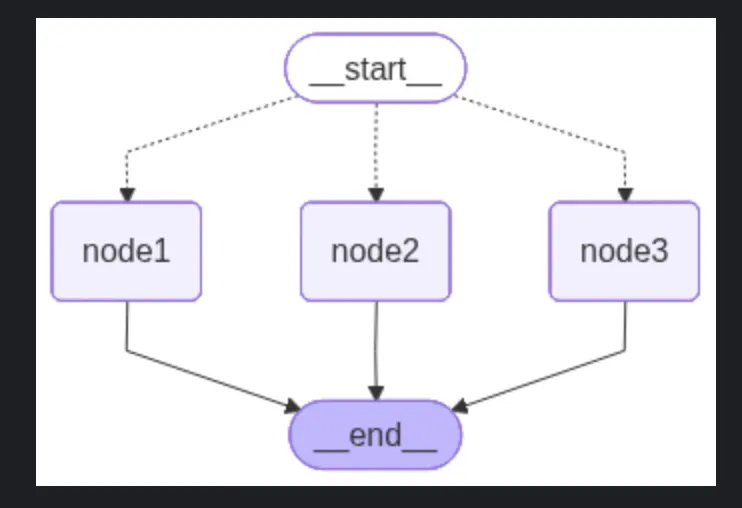

## **2.5 Send 和 Command**

Send 和 Command 是两种用于实现高级工作流控制的核心机制，用于支持动态地决定下一步执行哪个节点

### **1、Send：**

动态创建多个执行分支，实现并行处理，**每个 Send 对象都指定了一个执行目标节点和传递给该节点的参数，LangGraph 会并行执行所有的这些任务。**&#x6BD4;如可以用在 Map-Reduce 的场景，并行执行多个子节点并最终汇总到一个总节点。

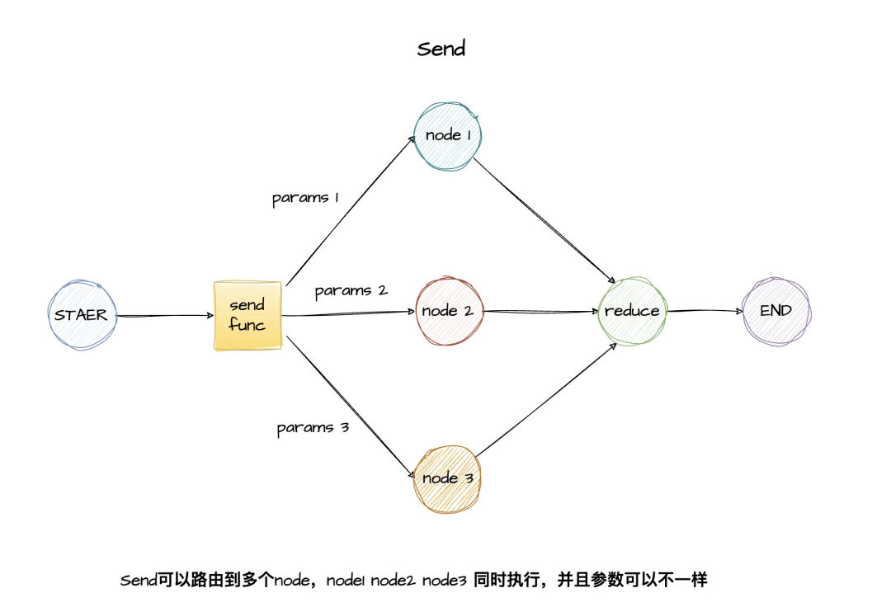

```python
def route_tasks(state: MapReduceState) -> list[Send]:
    # 为每个任务创建一个Send对象
    sends = []
    for idx, task in enumerate(state['tasks']):
        # 创建node任务及相应的参数
        send = Send("process_task",{"task_id": idx,"task_name": task})
        sends.append(send)
    # 返回所有的目标节点
    return sends
# 路由函数，返回 Send 列表
graph.add_conditional_edges("generate_tasks", route_tasks)
# 所有process_task完成后，汇总结果
graph.add_edge("process_task", "reduce_results")
复制
```

### **2、Command：**

不仅可以指定下一个节点，还支持更新状态、处理中断恢复，以及在嵌套图之间导航。常用于复杂的人机交互（Human-in-the-loop）和多智能体协同工作中智能体与智能体之间交接执行权（handoffs）

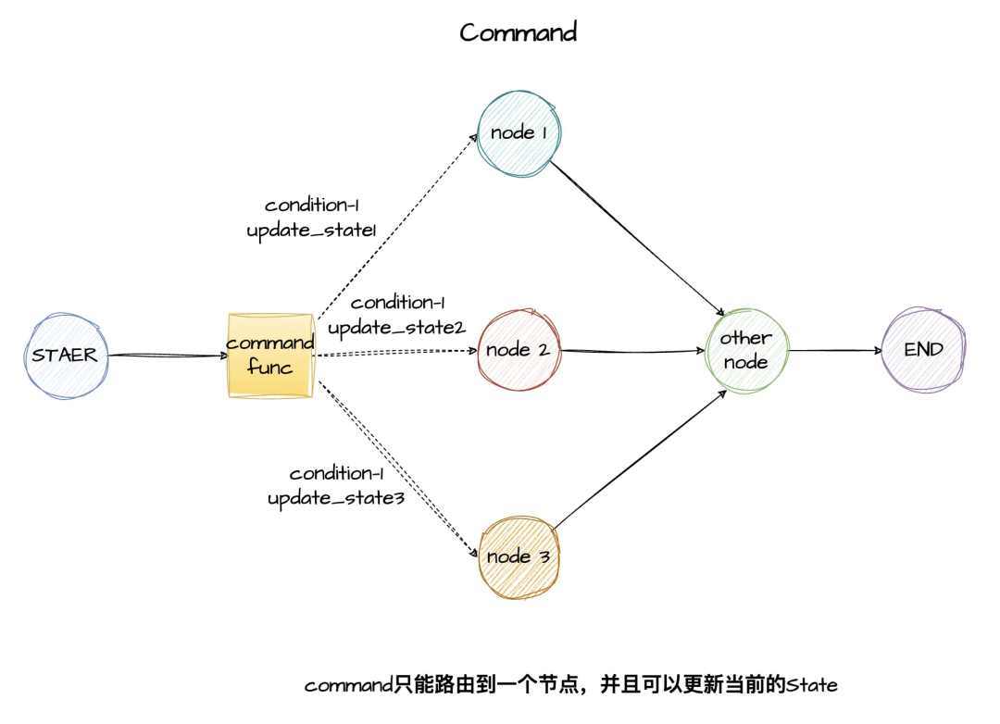

```python
# 在节点函数中返回 Command 来实现动态路由
def agent_node(state: State) -> Command:
    if need_help(state):
        # 决定将任务移交给另一个node，并更新状态
        return Command(
            goto="expert_agent",
            update={"messages": state["messages"] + [new_message]}
        )
    else:
        return Command(goto="END")
复制
```

Command 与条件边的区别是：**条件边只会路由下一个 node 节点，而 Command 不仅路由下一个 node 节点，还支持状态更新，**&#x5982;果需要同时更新状态和路由到不同的节点时，则使用 Command。

## **2.6 状态持久化**

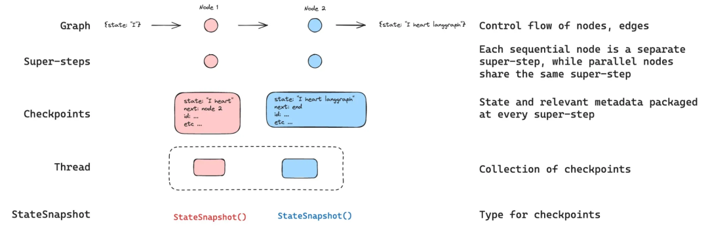

状态持久化指的是在程序运行时将瞬间的状态保存下来，以便后续需要的时候能够重新恢复执行，用于解决因为程序退出、重启等事件而丢失任务。**在 LangGraph 如果使用了持久化，工作流执行的每个步骤结束后，系统会自动将当前整个图的状态（包括所有变量、历史消息、下一步要执行的节点等信息）完整地保存下来，这份存档就是一个检查点（Checkpoint）**，LangGraph 支持存储在内存、Redis、DB 等存储介质中。检查点通过 thread_id（会话 id，不是操作系统中的线程 id）区分不同的会话，后续重新执行时会使用。

```python
memory = MemorySaver()
app = graph.compile(checkpointer=memory)   # 使用内存保存检查点
config = {"configurable": {"thread_id": "recovery_thread"}}  # 必须配置会话ID
result = app.invoke({"value": 5, "operations": []}, config=config)


# 获取所有的检查点
checkpoints = list(app.get_state_history(config))


# 恢复：从指定检查点继续执行
recovery_config = checkpoints[2].config
recovered_result = app.invoke(None, config=recovery_config)
复制
```

检查点是由一个 StateSnapshot 对象表示，具有以下关键属性：

1. config: 与此检查点关联的配置，如检查点 id、线程 id 等。

2. metadata: 与此检查点关联的元数据。

3. values: 在此时间点的状态值。

4. next: 一个元组，包含图中接下来要执行的节点名称。

5. tasks: 一个 PregelTask 对象的元组，包含有关接下来要执行的任务的信息。如果该步骤之前执行过，将包含错误信息。如果图在节点内部被动态中断，任务将包含与中断相关的其他数据。

```python
class StateSnapshot(NamedTuple):
    """Snapshot of the state of the graph at the beginning of a step."""


    values: dict[str, Any] | Any
    """Current values of channels."""
    next: tuple[str, ...]
    """The name of the node to execute in each task for this step."""
    config: RunnableConfig
    """Config used to fetch this snapshot."""
    metadata: CheckpointMetadata | None
    """Metadata associated with this snapshot."""
    created_at: str | None
    """Timestamp of snapshot creation."""
    parent_config: RunnableConfig | None
    """Config used to fetch the parent snapshot, if any."""
    tasks: tuple[PregelTask, ...]
    """Tasks to execute in this step. If already attempted, may contain an error."""
    interrupts: tuple[Interrupt, ...]
    """Interrupts that occurred in this step that are pending resolution."""
复制
```

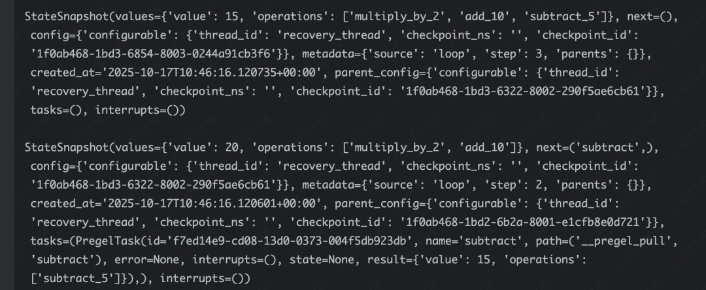

## **2.7 时间旅行**

如果使用状态持久化，则 LangGraph 在执行每一个节点的时候都会将整个图的状态及相关信息保存下来，包括所有变量、消息历史、下一步要执行的节点等，因此在任何一个节点都可以重新恢复当前的执行流程。**LangGraph 的时间旅行就是用来回溯、检查、修改一个工作流执行过程中的历史状态，并从某个历史节点重新执行，**&#x4ECE;而实现对智能体决策过程的调试、分析和路径探索。常用在以下场景：

1. 调试场景：当系统出现问题时，可以回溯到之前的状态，重新执行以定位问题

2. 审计需求：需要验证某个历史时刻的系统状态和执行结果

3. 分支探索：在某个状态点尝试不同的执行路径，比较结果差异

```python
checkpoints = list(app.get_state_history(config))
# 查看所有的步骤，注意，checkpoints的第一个值是Graph执行的最后一个节点（顺序是反的）
for i, checkpoint in enumerate(checkpoints):
    print(f"步骤 {i}: 下一节点 {checkpoint.next}, 状态值 {checkpoint.values}")


# 获取一个检查点
checkpoint = checkpoints[2]
# 更新状态，这会替换整个data_list
app.update_state(
    checkpoint.config,
    {"data_list": ["updated_value"]}  # 完全替换状态
)
# 从更新后的检查点继续执行
result = app.invoke(None, config=checkpoint.config)
复制
```

## **2.8 人机协作（Human-in-the-Loop）**

在一个多 Agent 架构中，有时并非全自动化处理，可能需要人工参与才能继续后续的操作（比如我们在使用 CodeBuddy 编程或执行某个命令前，都需要人工确认是否采纳或执行）。HIL 就是通过**在关键节点引入人类干预，实现 AI 系统的可控性和准确性。人机协作能弥补 AI 的 “能力盲区” 和人类的 “效率瓶颈”，在保证处理速度的同时，大幅提升结果的准确性、安全性和适用性。**

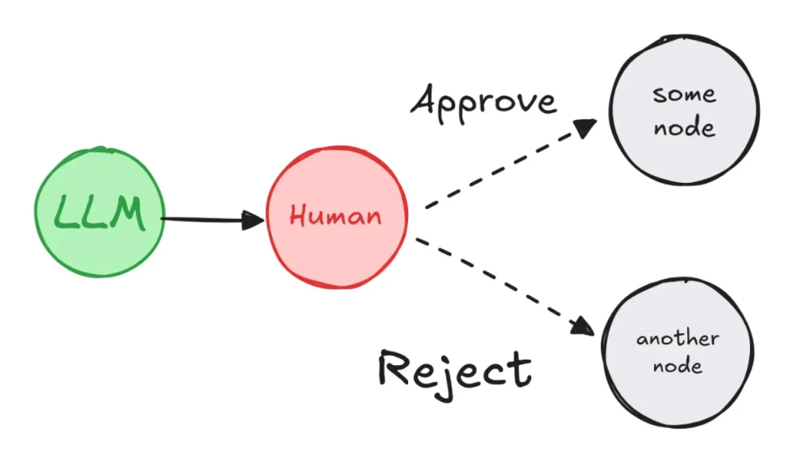

LangGraph 通过中断机制、状态持久化、恢复执行机制在 Agent 自动化工作流中嵌入人工干预，实现人机协同。

```python
def human_feedback_node(state: HumanInLoopState) -> dict:
    # 定义中断信息，告诉外界为何中断以及需要什么样的输入来恢复
    interrupt_data = {
        "type": "human_review",
        "request": state['request'],
        "analysis": state['analysis'],
        "prompt": "请输入: 同意 / 拒绝"
    }
    # 使用interrupt()函数暂停工作流，等待人工输入
    human_response = interrupt(interrupt_data)
    print(f"收到用户输入: {human_response}")
    # 解析人工输入，其他业务逻辑
    # ...

    return {
        "human_feedback": human_response.get("feedback"),
        "approved": human_response.get("decision"),
        "messages": [f"人工反馈: {human_response.get('feedback')}"]
    }


# 添加人工反馈节点，其他节点省略
graph.add_node("human_feedback", human_feedback_node)
# 添加人工反馈边，其他节点省略
graph.add_edge("analyze", "human_feedback")
# 添加条件边，根据用户反馈来选择调用后续的节点
builder.add_conditional_edges(
    "human_feedback",
    route_by_human_decision,
    {
        "process_approval": "process_approval",
        "process_rejection": "process_rejection"
    }
)


memory = MemorySaver()
# 编译图并启用检查点
app = graph.compile(checkpointer=memory)


# 配置会话id，用于区分不同的会话
config = {"configurable": {"thread_id": str(uuid.uuid4())}}
# 首次执行图，执行到human_feedback节点会中断，invoke立即返回# 返回的结果会包含中断信息，result.get(__interrupt__)
result = graph.invoke(initial_input, config)


# 模拟人工输入（实际应用中来自用户界面）
human_decision = {
    "decision": "同意",
    "feedback": "用户反馈"
}


# 重新恢复工作流，继续执行后续节点
resume_command = Command(resume=human_decision)
final_result = graph.invoke(resume_command, config)
复制
```


**注意：调用 interrupt()函数后，不会阻塞，当次的 invoke 调用会正常结束，并将一个包含中断信息的结果返回给调用方，并执行后续的代码，等重新调用 graph.invoke(resume_command, config)时，会从调用 interrupt()函数的入口处重新执行（注意：如果函数的 interrupt 调用之前有一些接口、db 访问或其他业务逻辑，则会被重复调用），且执行到 interrupt()处返回的值即是用户输入的值(Command(resume=human_decision)中指的的值)，具体流程如下：**

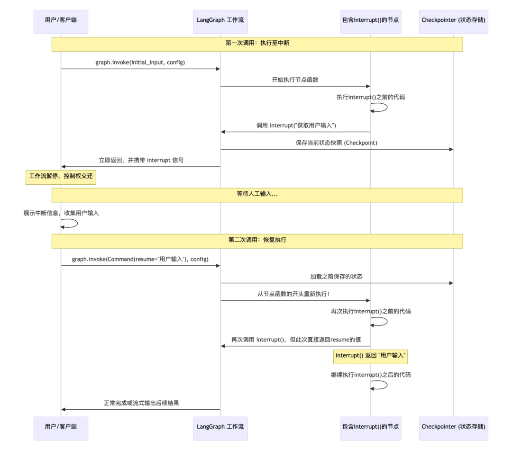

## **2.9 记忆**

记忆是智能体运行中记住先前交互信息的组件，是能够连贯对话的核心能力，LangGraph 中提供了**短期记忆和长期记忆。**

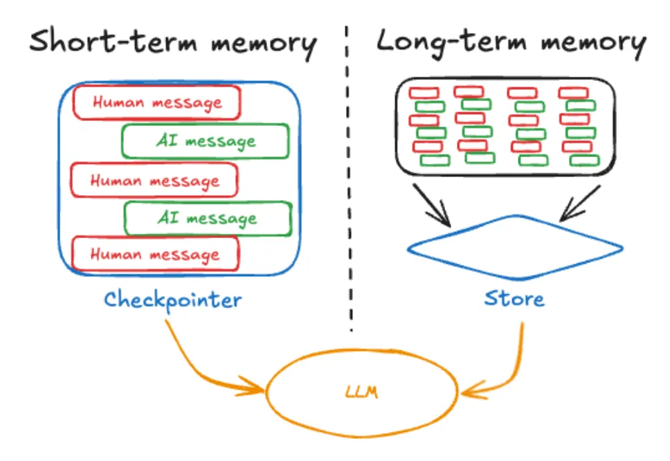

**1、短期记忆：**&#x5B58;储当前对话上下文的信息，作用于单次会话或线程，通过 thread_id（会话 id）区分，通过图状态（State）和检查点（Checkpoint）实现。

```python
# 1. 初始化一个内存检查点
checkpointer = InMemorySaver()
# 2. 在编译图时传入检查点
graph = builder.compile(checkpointer=checkpointer)
# 3. 调用时通过 thread_id 指定会话线程
config = {"configurable": {"thread_id": "thread_123"}}
result = graph.invoke({"messages": [{"role": "user", "content": "你好"}]}, config=config)
复制
```

**2、长期记忆：**&#x957F;期记忆用于存储那些需要在不同会话间保留的信息。它通过 **存储库（Store）** 接口实现，类似于一个键值数据库，并支持基于向量嵌入的语义检索。与线程范围的短期记忆不同，长期记忆保存在自定义的“命名空间”中。

```python
def write_node(state: dict) -> dict:
    # 获取全局存储实例
    store = get_store()
    # 存储数据到指定命名空间
    store.put(namespace, "user_123", {"name": "张三", "age": "20"})
    return {}


def read_node(state: dict) -> dict:
    # 获取全局存储实例
    store = get_store()
    # 根据键获取指定用户数据
    user_info = store.get(namespace, "user_123")
    print(user_info)


    # 在命名空间中搜索包含"张三"的数据
    # query: 搜索关键词
    # limit: 返回结果的最大数量限制
    user_info = store.search(namespace, query="张三", limit=10)
    print(user_info)
    return {}


# 初始化一个内存存储
store = InMemoryStore()
# 定义命名空间，命名空间元组，用于数据分类和隔离
namespace = ("users", "profile")
# 创建图
graph = StateGraph(dict)
graph.add_node("write_node", write_node)
graph.add_node("read_node", read_node)
graph.add_edge(START, "write_node")
graph.add_edge("write_node", "read_node")
graph.add_edge("read_node", END)


# 编译图，并指定存储
app = graph.compile(store=store)
app.invoke({})
复制
```

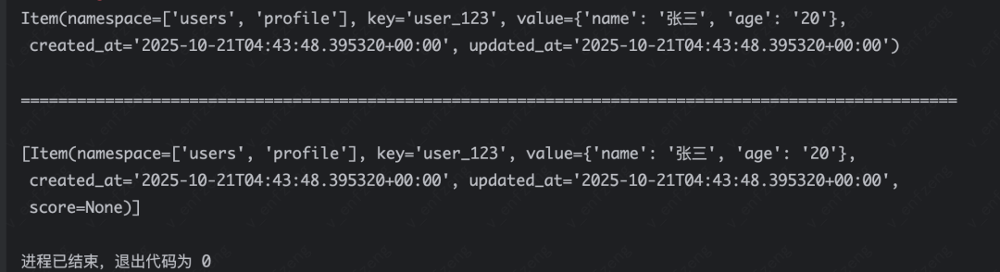

## **2.10 子图**

在 LangGraph 中允许将一个完整的图作为另一个图的节点，适用于将复杂的任务拆解为多个专业智能体协同完成，每个子图都可以独立开发、测试并且可以复用。每个子图都可以拥有自己的私有数据，也可以与父图共享数据。

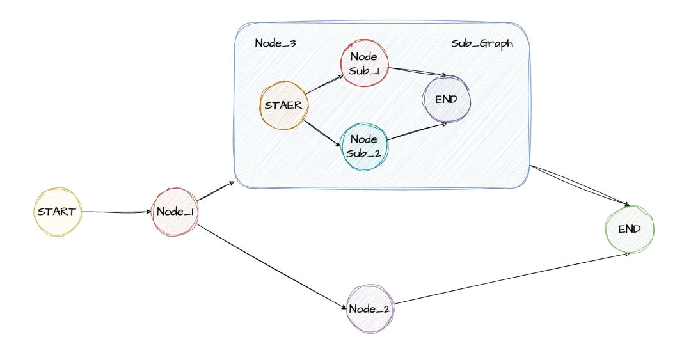

```python
# 定义父图状态
class ParentState(TypedDict):
    parent_messages: list  # 与子图共享数据
# 定义子图状态
class SubgraphState(TypedDict):
    parent_messages: list  # 与父图共享的数据
    sub_message: str  # 子图私有数据
# 创建子图，添加node、edge等
sub_builder = StateGraph(SubgraphState)
sub_builder.add_node("sub_node", subgraph_node)
sub_builder.add_edge(START, "sub_node")
compiled_subgraph = sub_builder.compile()
# 创建父图
builder = StateGraph(ParentState)
# 添加子图添加为父图的节点
builder.add_node("subgraph_node", compiled_subgraph)
# 将子图连接起来
builder.add_edge("parent_node", "subgraph_node")
# 编译父图并执行
parent_graph = builder.compile()
parent_graph.invoke({"messages": ["init message"]})
复制
```

**这里共享数据指的是如果父图状态与子图状态定义名一样，则状态是共享的 。**

如果当父子图状态结构不同时，需要在父图中创建一个专门的节点函数，手动调用图并处理状态数据。

```python
# 在父图中创建代理节点处理状态转换
def call_subgraph(state: ParentState):
    # 将父图状态转换为子图的输入
    subgraph_input = {"analysis_input": state["user_query"]}
    # 调用子图
    subgraph_response = compiled_subgraph.invoke(subgraph_input)
    # 将子图的输出映射回父图状态
    return {"final_answer": subgraph_response["analysis_result"]}


builder = StateGraph(ParentState)
# 父图中添加的是代理节点，而不是直接添加子图
builder.add_node("call_subgraph_node", call_subgraph)
builder.add_edge(START, "call_subgraph_node")
parent_graph = builder.compile()
复制
```

## **2.11 集成 MCP**

模型上下文协议（MCP）是一个开放协议，它标准化了应用程序如何向大模型提供工具和上下文。LangGraph 中 Agent 可以通过 langchain-mcp-adapters 库使用在 MCP 服务器上定义的工具。

```bash
# 安装
pip install langchain-mcp-adapters
复制
```

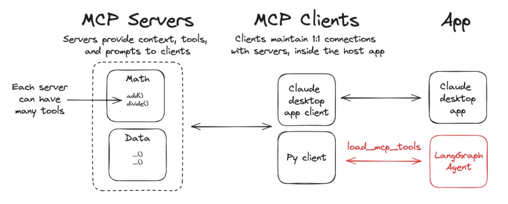

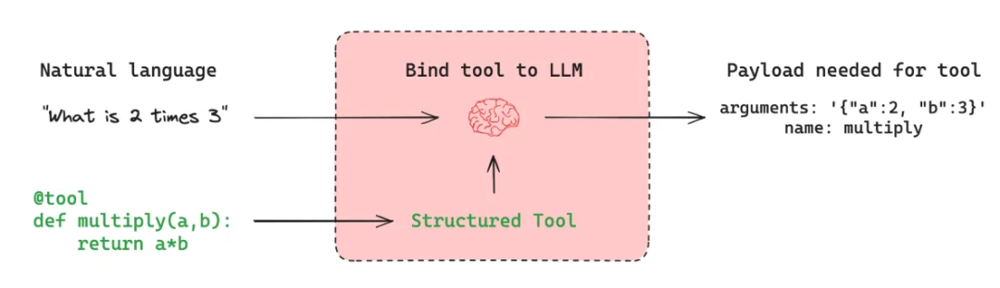

### **1、自定义 MCP 工具**

```python
# 创建名为"MCP_Tools"的MCP服务器
mcp = FastMCP("MCP_Tools")


@mcp.tool()
def get_weather(location: str) -> str:
    """获取指定位置的天气信息"""
    return "晴天"
@mcp.tool()
def get_time() -> str:
    """获取当前时间"""
    return datetime.now().strftime('%Y-%m-%d %H:%M:%S')
@mcp.tool()
def add(a: int, b: int) -> int:
    """对两个整数相加"""
    return a + b
@mcp.tool()
def multiply(a: int, b: int) -> int:
    """对两个整数相乘"""
    return a * b
@mcp.tool()
def subtract(a: int, b: int) -> int:
    """对两个整数相减"""
    return a - b


if __name__ == "__main__":
    # 使用HTTP协议传输
    mcp.run(transport="streamable-http")
复制
```

### **2、创建 ReAct 类型的 Agent**

```python
async def get_agent():
    # 初始化MCP客户端，可以连接多个服务器
    client = MultiServerMCPClient(
        {
            "weather": {
                "url": "http://localhost:8000/mcp",
                "transport": "streamable_http",
            }
        }
    )
    # 获取所有可用的工具
    tools = await client.get_tools()
    print(f"已加载工具: {[tool.name for tool in tools]}")


    # 初始化聊天模型
    model = ChatOpenAI(
        model_name=model_name,
        base_url=base_url,
        api_key=api_key
    )
    # 创建React智能体
    return create_react_agent(model, tools)
复制
```

### **3、构建测试用例**

```python
async def test_agent():
    # 获取智能体
    agent = await get_agent()


    # 测试用例
    test_cases = [
        "计算 (15 + 7) × 3 等于多少？",
        "先计算 20 减 8，然后乘以 2 是多少？",
        "现在几点了？深圳的天气如何？"
    ]


    for i, question in enumerate(test_cases, 1):
        print(f"\n{'=' * 50}")
        print(f"测试 {i}: {question}")
        print(f"{'=' * 50}")


        # 调用智能体
        response = await agent.ainvoke(
            {"messages": [HumanMessage(content=question)]}
        )


        # 获取最后一条消息（智能体的回复）
        last_message = response["messages"][-1]
        print(f"智能体回复: {last_message.content}")


if __name__ == "__main__":
    asyncio.run(test_agent())
复制
```

**运行结果：**

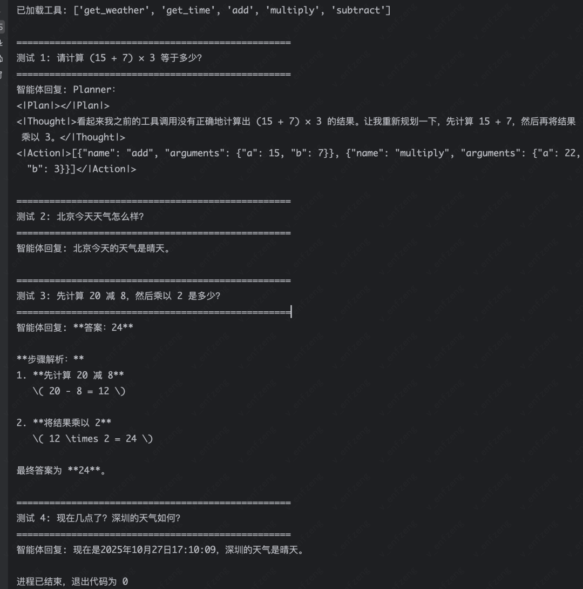

## **2.12 运行时上下文**

创建图时，可以指定运行时上下文，将上下文信息（不属于图状态的信息）传递给节点，以便节点中使用，例如模型名称或数据库连接等。

```python
@dataclass
class ContextSchema:    # 定义上下文schema
    llm_provider: str = "openai"
def node_a(state: State, runtime: Runtime[ContextSchema]):
    # 获取上下文信息
    llm = get_llm(runtime.context.llm_provider)
    return state


graph = StateGraph(State, context_schema=ContextSchema)
# 执行时指定上下文信息
graph.invoke(inputs, context={"llm_provider": "DeepSeek-R1-Online-0120"})
复制
```

## **2.13 递归限制**

递归限制指的是图在单次执行过程中的最大次数，由 recursion_limit 参数控制，默认值为 25 步，一旦超过限制，会抛出 GraphRecursionError 错误，用于防止工作流陷入死循环，确保系统的稳定性和可预测性。

```python
try:
    result = graph.invoke(
        {"input": "开始执行"},
        config={"recursion_limit": 50}  # 设置递归限制为50次
    )
except GraphRecursionError:
    print("执行步数超过限制，抛出异常")
    # 异常处理...
复制
```

# 03

**Multi-Agent 架构**

## **3.1 多智能体架构概述**

对于普通的业务系统，随着需求的迭代，系统的复杂度会变得越来越高，使得维护性和扩展性变得越来越高，经常需要花费大量是时间去定位问题，因此在项目初始阶段架构选择很重要。单智能体应用也是如此，比如：

1. 智能体有太多工具可供使用，导致在决定下一步调用哪个工具时做出错误的决定

2. 上下文变得过于复杂，单个智能体难以跟踪

3. 系统中需要多个专业领域的智能体协同工作

为了解决这些问题，可以将应用程序分解为多个更小、独立的智能体，并将它们组合成一个多智能体系统。使用多智能体的好处是：

1. 模块化：独立的智能体使得开发、测试和维护智能体系统更加容易。

2. 专业化：可以创建专注于特定领域的专家智能体，这有助于提高整个系统的性能。

3. 可控性：可以明确控制智能体之间的通信方式（而不是依赖于函数调用）。

多智能体架构：

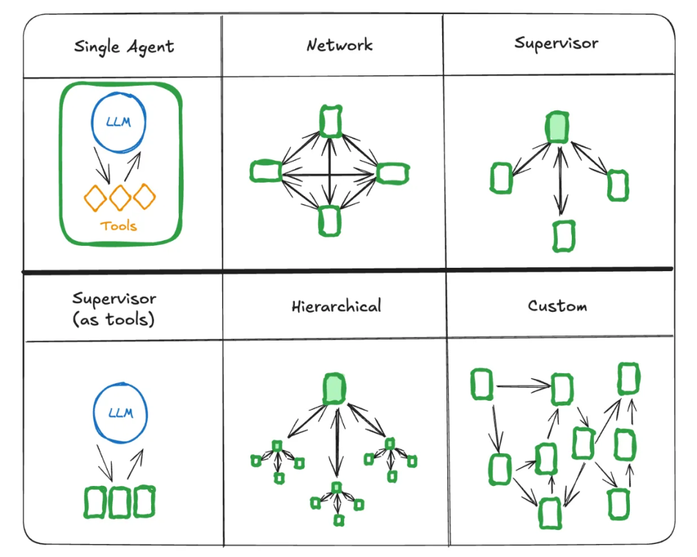

在多智能体系统中，有几种常见的连接智能体的方式：

1. **Network（网络）：**&#x6BCF;个智能体都可以与其他任何智能体进行通信。任何智能体都可以决定下一步调用哪个其他智能体。

2. **Supervisor（主管）：**&#x5305;含一个主管智能体，每个智能体都与一个主管智能体进行通信。主管智能体决定下一步应该调用哪个智能体。

3. **Supervisor as tools（主管 as 工具调用）：**&#x4E3B;管架构的一种特殊情况。单个智能体可以被表示为工具。主管智能体使用一个支持工具调用的 LLM 来决定调用哪个智能体工具，以及传递给这些智能体的参数。

4. **Hierarchical（层级式）：**&#x5305;含多层的 Supervisor 架构，每一层都有自己的主管，类似于公司的组织架构（GM-总监-组长-员工）

5. **Custom（自定义）：**&#x4F7F;用 LangGraph 提供的灵活的图结构和条件边，可以自定义各种执行流，比较灵活，使用的也最多。

## **3.2 Agent 之间通信和状态管理**

在构建多智能体应用时，需要考虑智能体与智能体之间如何进行交互，以及数据应该如何共享。

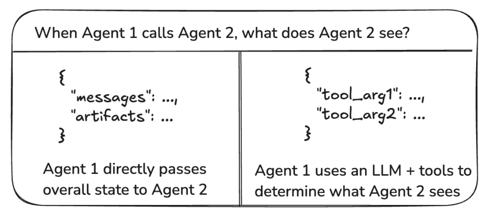

**1、通信模式：**&#x5E38;见的两种通讯模式是通过移交（handoffs）和工具调用

- **移交：**&#x4E00;个智能体将其执行上下文和执行权传递给另一个智能体。

- **工具调用：**&#x4E00;个智能体（如主管）将另一个智能体作为工具进行调用。

移交更适用于自主协作的场景，而工具调用则提供了更明确的层级控制和接口约束。

**2、消息传递：**&#x41;gent 与 Agent 之间应该传递所有的消息还是部分消息，需要根据具体的业务场景权衡。

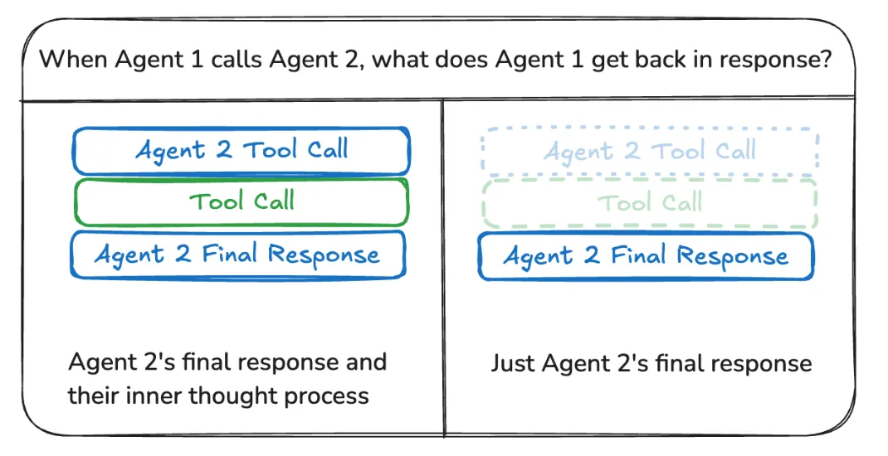

- **共享完整推理数据：**&#x667A;能体将其所有中间步骤（如链式思考、工具调用）写入共享通道。相当于提供了一个共享区，用于其他智能体理解其推理过程，可以提升系统的整体协作与推理能力。但是这种方式的缺点是会导致状态空间快速膨胀，给上下文窗口和内存管理带来挑战。

- **仅共享最终结果：**&#x667A;能体在私有空间内完成其计算，仅将最终结果写入到共享区。它能有效控制状态的复杂度，实现此策略需要为每个智能体定义独立的状态模式。

## **3.3 supervisor（主管）**

每个子智能体由一个中央主管智能体协调。主管控制所有的通信流和任务委派，根据当前上下文和任务需求决定调用哪个智能体。

Supervisor 架构模仿了企业中“项目经理”的角色。它采用经典的“管理者-工作者”结构，由一个中心的主管代理（Supervisor）负责接收用户任务，并将其分解、委派给各个专业的工作者代理（Worker Agents），并最终整合结果。

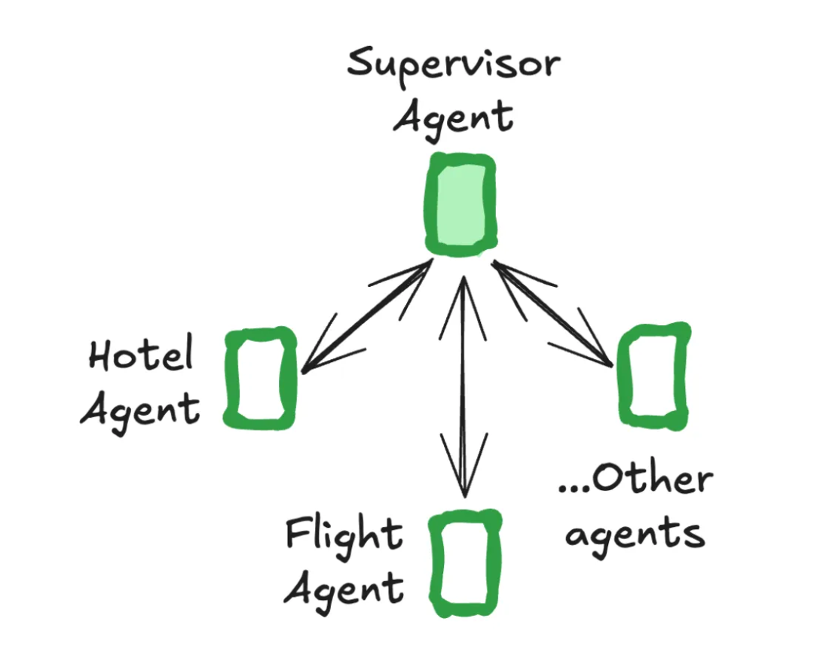

LangGraph 提供了专门的 Supervisor Python 库：

```bash
pip install langgraph-supervisor复制
```

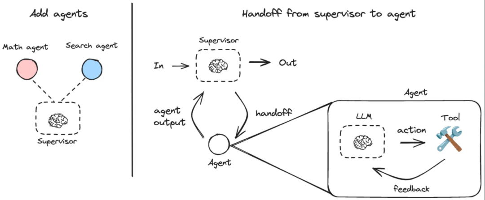

```python
def book_hotel(hotel_name: str):
    """预订酒店"""
    print(f"✅ 成功预订了 {hotel_name} 的住宿")
    return f"成功预订了 {hotel_name} 的住宿。"
def book_flight(from_airport: str, to_airport: str):
    """预订航班"""
    print(f"✅ 成功预订了从 {from_airport} 到 {to_airport} 的航班")
    return f"成功预订了从 {from_airport} 到 {to_airport} 的航班。"
flight_assistant = create_react_agent(
    model=model,
    tools=[book_flight],
    prompt=(
        "你是专业的航班预订助手，专注于帮助用户预订机票。\n"
        "工作流程：\n"
        "1. 从用户需求中提取出发地和目的地信息\n"
        "2. 调用book_flight工具完成预订\n"
        "3. 收到预订成功的确认后，向主管汇报结果并结束\n"
        "注意：每次只处理一个预订请求，完成后立即结束，不要重复调用工具。"
    ),
    name="flight_assistant"
)
hotel_assistant = create_react_agent(
    model=model,
    tools=[book_hotel],
    prompt=(
        "你是专业的酒店预订助手，专注于帮助用户预订酒店。\n"
        "工作流程：\n"
        "1. 从用户需求中提取酒店信息（如果未指定，选择经济型酒店）\n"
        "2. 调用book_hotel工具完成预订\n"
        "3. 收到预订成功的确认后，向主管汇报结果并结束\n"
        "注意：每次只处理一个预订请求，完成后立即结束，不要重复调用工具。"
    ),
    name="hotel_assistant"
)
supervisor = create_supervisor(
    agents=[flight_assistant, hotel_assistant],
    model=model,
    prompt=(
        "你是一个智能任务调度主管，负责协调航班预订助手(flight_assistant)和酒店预订助手(hotel_assistant)。\n\n"
        "工作流程：\n"
        "1. 分析用户需求，确定需要哪些服务（航班、酒店或两者）\n"
        "2. 如果需要预订航班，调用flight_assistant一次\n"
        "3. 如果需要预订酒店，调用hotel_assistant一次\n"
        "4. 收到助手的预订确认后，记录结果\n"
        "5. 当所有任务都完成后，向用户汇总所有预订结果，然后立即结束\n\n"
        "关键规则：\n"
        "- 每个助手只能调用一次，不要重复调用\n"
        "- 看到'成功预订'的消息后，该任务就已完成\n"
        "- 所有任务完成后，必须直接结束，不要再调用任何助手\n"
        "- 如果已经看到航班和酒店的预订确认，立即汇总并结束"
    )
).compile()
for chunk in supervisor.stream(
    {
        "messages": [
            {
                "role": "user",
                "content": "帮我预定一个北京到深圳的机票，并且预定一个酒店"
            }
        ]
    }
):
    print(chunk)
    print("\n")
复制
```

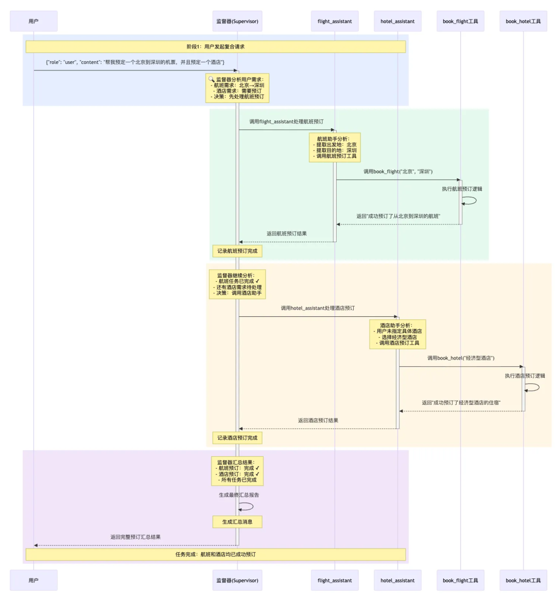

**supervisor 支持可以将每个工作 Agent 的全部消息或最后一条消息添加到整个消息列表中**

```python
# 添加所有消息
workflow = create_supervisor(
    agents=[agent1, agent2],
    output_mode="full_history"
)
# 添加最后一条消息
workflow = create_supervisor(
    agents=[agent1, agent2],
    output_mode="last_message"
)
复制
```

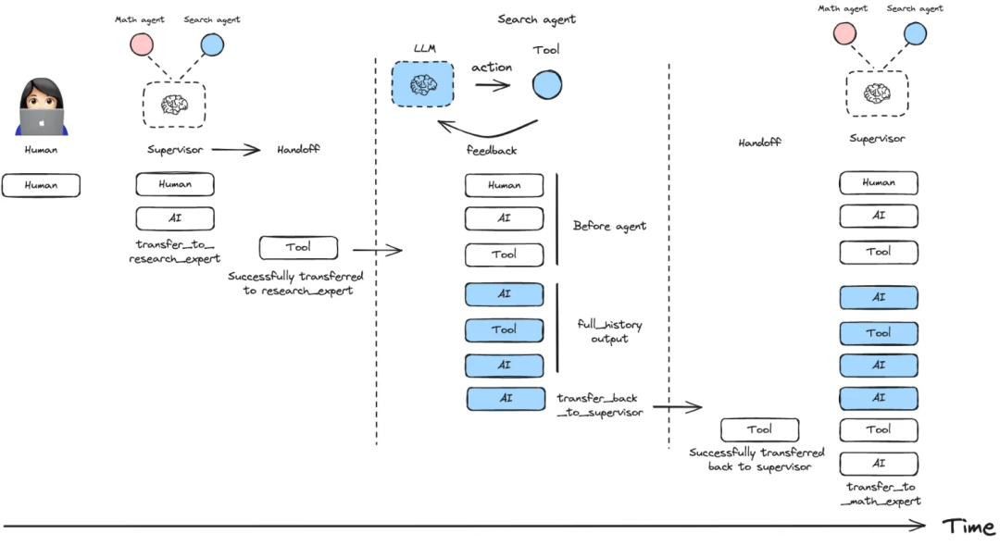

**每一个主管 Agent 也可以是一个工作 Agent，由一个更顶层的主管 Agent 管理：**

```python
research_team = create_supervisor(
    [research_agent, math_agent],
    model=model,
    supervisor_name="research_supervisor"
).compile(name="research_team")
writing_team = create_supervisor(
    [writing_agent, publishing_agent],
    model=model,
    supervisor_name="writing_supervisor"
).compile(name="writing_team")
top_level_supervisor = create_supervisor(
    [research_team, writing_team],
    model=model,
    supervisor_name="top_level_supervisor"
).compile(name="top_level_supervisor")
复制
```

**supervisor 添加长期记忆和短期记忆：**

```python
# 短期记忆
checkpointer = InMemorySaver()
# 长期记忆
store = InMemoryStore()
swarm = create_supervisor(
    agents=[flight_assistant, hotel_assistant],
    model=model,
).compile(checkpointer=checkpointer, store=store)
复制
```

## **3.4 swarm（群组）**

智能体根据各自的专长动态地将控制权移交给其他智能体。Swarm 架构则更像一个开放的“专家社区”。它没有中心指挥，每个专业智能体都具备自主判断能力，可以根据当前任务上下文，决定是否以及将控制权“移交”给另一个智能体，形成一种自然的协作流水线。

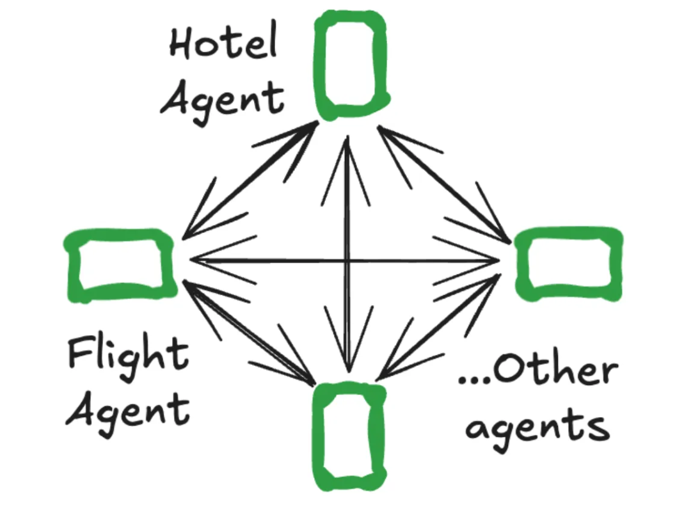

**安装 Swarm 库：**&#x53;warm 库是一种多智能体架构的 Python 库

```bash
pip install langgraph-swarm复制
```

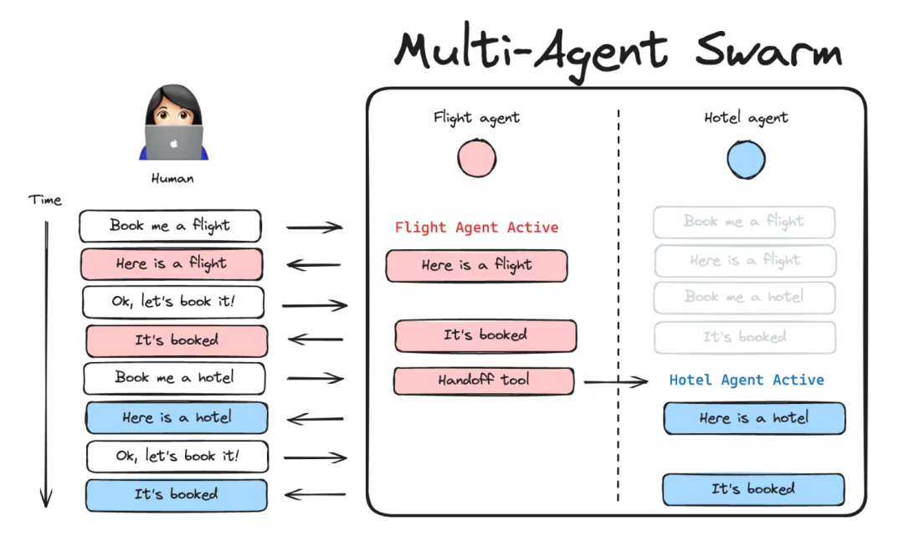

```python
def book_hotel(hotel_name: str):
    """预订酒店"""
    print(f"✅ 成功预订了 {hotel_name} 的住宿")
    return f"成功预订了 {hotel_name} 的住宿。"
def book_flight(from_airport: str, to_airport: str):
    """预订航班"""
    print(f"✅ 成功预订了从 {from_airport} 到 {to_airport} 的航班")
    return f"成功预订了从 {from_airport} 到 {to_airport} 的航班。"
transfer_to_hotel_assistant = create_handoff_tool(
    agent_name="hotel_assistant",
    description="将用户转接给酒店预订助手。当用户需要预订酒店时使用此工具。",
)
transfer_to_flight_assistant = create_handoff_tool(
    agent_name="flight_assistant",
    description="将用户转接给航班预订助手。当用户需要预订航班时使用此工具。",
)
flight_assistant = create_react_agent(
    model=flight_assistant_model,
    tools=[book_flight, transfer_to_hotel_assistant],
    prompt=(
        "你是一个航班预订助手，负责帮助用户预订航班。"
        "当用户需要预订航班时，使用 book_flight 工具完成预订。"
        "如果用户还需要预订酒店，完成航班预订后，必须使用 transfer_to_hotel_assistant 工具将用户转接给酒店预订助手。"
        "重要：不要直接结束对话，确保所有用户需求都得到处理。"
    ),
    name="flight_assistant"
)
hotel_assistant = create_react_agent(
    model=hotel_assistant_model,
    tools=[book_hotel, transfer_to_flight_assistant],
    prompt=(
        "你是一个酒店预订助手，负责帮助用户预订酒店。"
        "当用户需要预订酒店时，使用 book_hotel 工具完成预订。"
        "如果用户还需要预订航班，完成酒店预订后，必须使用 transfer_to_flight_assistant 工具将用户转接给航班预订助手。"
        "完成所有预订后，向用户确认所有任务已完成。"
    ),
    name="hotel_assistant"
)
swarm = create_swarm(
    agents=[flight_assistant, hotel_assistant],
    default_active_agent="flight_assistant"
).compile()
for chunk in swarm.stream(
    {
        "messages": [
            HumanMessage(content="帮我预订从北京到上海的航班，并预订如家酒店")
        ]
    }
):
    print(chunk)
    print("\n")
复制
```


**swarm 支持添加长期记忆和短期记忆。**

```python
# 短期记忆
checkpointer = InMemorySaver()
# 长期记忆
store = InMemoryStore()
swarm = create_swarm(
    agents=[flight_assistant, hotel_assistant],
    default_active_agent="flight_assistant"
).compile(checkpointer=checkpointer, store=store)
复制
```

Supervisor 和 Swarm 代表了两种截然不同但同样强大的协作思想。Supervisor 通过集中控制带来可预测性和可靠性，而 Swarm 通过去中心化设计带来灵活性和韧性。在实际应用中，架构选择没有绝对的优劣，关键在于与业务场景的深度契合。甚至，在复杂的系统中，可以混合使用两种模式，例如核心流程用 Supervisor 严格管控，非核心探索环节用 Swarm 激发灵活性。

## **3.5 handoffs（交接）**

handoffs 指的是一个智能体将控制权交接给另一个智能体，上述的 Supervisor 和 Swarm 都是使用 handoffs 来交接执行权的。handoffs 需要包含两个最基本的要素：

1. 目的地：下一个智能体

2. State：传递给下一个智能体的信息

Supervisor 和 Swarm 都默认使用了 create_handoff_tool 移交工具，我们也可以自己实现交接函数

```python
def create_task_description_handoff_tool(*, agent_name: str, description: str | None = None):
    name = f"transfer_to_{agent_name}"
    description = description or f"移交给 {agent_name}"
    @tool(name, description=description)
    def handoff_tool(
        task_description: Annotated[str, "描述下一个Agent应该做什么，包括所有相关信息。"],
        state: Annotated[MessagesState, InjectedState],
    ) -> Command:
        task_description_message = {"role": "user", "content": task_description}
        agent_input = {**state, "messages": [task_description_message]}
        return Command(
            goto=[Send(agent_name, agent_input)],
            graph=Command.PARENT,
        )
    return handoff_tool
# 自定义移交工具
transfer_to_hotel_assistant = create_task_description_handoff_tool(
    agent_name="hotel_assistant",
    description="将执行权移交给酒店预订助手",
)
transfer_to_flight_assistant = create_task_description_handoff_tool(
    agent_name="flight_assistant",
    description="将执行权移交给航班预订助手",
)
@tool("book_hotel")
def book_hotel(hotel_name: str):
    """预订酒店 - 当用户需要预订酒店时必须调用此工具"""
    print(f"✅ 成功预订了 {hotel_name} 的住宿")
    return f"成功预订了 {hotel_name} 的住宿。"
@tool("book_flight")
def book_flight(from_airport: str, to_airport: str):
    """预订航班"""
    print(f"✅ 成功预订了从 {from_airport} 到 {to_airport} 的航班")
    return f"成功预订了从 {from_airport} 到 {to_airport} 的航班。"
# 定义智能体
flight_assistant = create_react_agent(
    model=model,
    tools=[book_flight, transfer_to_hotel_assistant],
    prompt="你是一个航班预订助手，专门负责帮助用户预订航班。",
    name="flight_assistant"
)
hotel_assistant = create_react_agent(
    model=model,
    tools=[book_hotel, transfer_to_flight_assistant],
    prompt="你是酒店预订助手，专门负责帮助用户预订酒店。",
    name="hotel_assistant"
)
# 定义多智能体图
multi_agent_graph = (
    StateGraph(MessagesState)
    .add_node(flight_assistant)
    .add_node(hotel_assistant)
    .add_edge(START, "flight_assistant")
    .compile()
)
multi_agent_graph.invoke(
    {
        "messages": [
            HumanMessage(content="帮我预订从北京到上海的航班，并预订如家酒店")
        ]
    }
)
复制
```

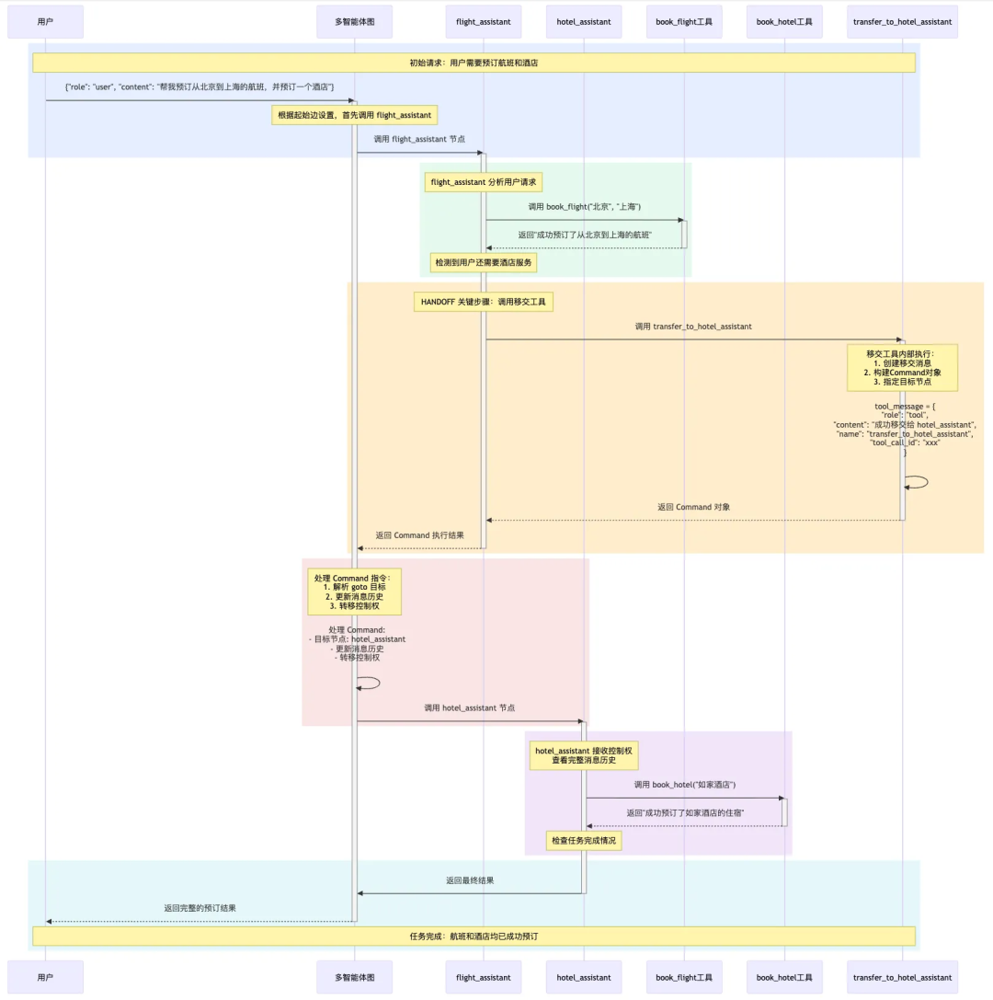

**上述例子（supervisor、swarm、handoffs）在实际测试中运行并不稳定，有时并非按照预期执行相应的工具，或者循环执行工具。可以通过更换模型或者修改提示词尝试解决。**

# 04

**JAVA 版本介绍（LangChain4J 和 LangGraph4J）**

LangGraph 除了 python 和 js 版本外，还提供了 Java 版本，如果需要开发复杂的业务系统或者团队使用的技术栈为 Java，则 LangGraph4j 是一个不错的选择。我们团队的项目使用的是 Java 技术栈，所以这里顺便介绍一下使用 LangChain4J+LangGraph4J 快速的将 AI 大模型引入到 Java 项目中。

**由于 Spring AI 有 Spring Boot 3.x + JDK 21 的限制，而 LangGraph4j 是一个独立的库，不依赖 Sping Boot，而且使用 JDK17，引入成本更低。**

**本章主要讲 LangGraph4j 如何使用，具体相关的概念与 Python 的一样，可参考上文。**

## **4.1 环境准备**

**Maven 依赖：**

```xml
<!-- LangChain4j -->
<dependency>
    <groupId>dev.langchain4j</groupId>
    <artifactId>langchain4j</artifactId>
    <version>1.6.0</version>
</dependency>
<!-- LangChain4j OpenAI -->
<dependency>
    <groupId>dev.langchain4j</groupId>
    <artifactId>langchain4j-open-ai</artifactId>
    <version>1.2.0</version>
</dependency>
<!-- LangGraph4J -->
<dependency>
    <groupId>org.bsc.langgraph4j</groupId>
    <artifactId>langgraph4j-core</artifactId>
    <version>1.5.2</version>
</dependency>
复制
```

## **4.2 使用 LangChain4J 集成大模型**

### 1、调用大模型

```java
public static void main(String[] args) {
    // 构建聊天模型实例
    ChatModel chatModel = OpenAiChatModel.builder()
            .baseUrl(BASE_URL)              // 设置 API 基础地址
            .apiKey(API_KEY)                // 设置 API 密钥
            .modelName("hunyuan-turbo")     // 指定模型名称
            .timeout(Duration.ofSeconds(60)) // 设置请求超时时间为 60 秒
            .logRequests(true)              // 开启请求日志，便于调试
            .logResponses(true)             // 开启响应日志，便于调试
            .maxRetries(3)                  // 设置最大重试次数为 3 次
            .temperature(0.8)               // 设置温度参数（0.0-1.0），控制输出的随机性
            .returnThinking(true)           // 返回模型的思考过程（针对深思考模型）
            .build();


    // 创建系统消息，定义 AI 助手的角色 and 行为
    SystemMessage systemMessage = SystemMessage.from("你是一个LangChain和LangGraph专家，用于解答开发者的问题。");
    // 创建用户消息，包含具体的问题
    UserMessage userMessage = UserMessage.from("介绍一下LangGraph");
    // 模型调用
    ChatResponse chatResponse = chatModel.chat(systemMessage, userMessage);
    // 从响应中提取 AI 消息
    AiMessage aiMessage = chatResponse.aiMessage();
    // 输出模型的思考过程（如果模型支持并返回）
    System.out.println(aiMessage.thinking());
    // 输出模型的最终回答
    System.out.println(aiMessage.text());
}
复制
```

### **2、提示词模版**

```java
// 创建提示词模版
PromptTemplate promptTemplate = PromptTemplate.from("你是一个{{domain}}领域的专家，用于解答关于{{question}}的开发者问题。");
// 填充参数
String prompt = promptTemplate.apply(Map.of(
        "domain", "LangChain和LangGraph",
        "question", "LangGraph"
)).text();
chatModel.chat(prompt);
复制
```

### **3、AI Service**

AI Service 是 LangChain4j 框架中一个高级的、声明式的 API，能够像定义普通 Java Service 接口一样来定义 AI 功能，从而极大地简化与大模型的集成。

```java
// 定义一个反洗钱助手接口
interface RiskAssistant {
    @SystemMessage("你是一个专注于反洗钱业务的专家助手")
    @UserMessage("请回答用户关于反洗钱的提问，问题：{{question}}")
    String answer(@V("question") String question);
}
public static void main(String[] args) {
    // 构建聊天模型实例
    ChatModel chatModel = OpenAiChatModel.builder().baseUrl(BASE_URL)
            .apiKey(API_KEY)
            .modelName("hunyuan-turbo")
            .build();
    // 通过 AiServices 创建实例
    RiskAssistant riskAssistant = AiServices.create(RiskAssistant.class, chatModel);
    String answer = riskAssistant.answer("什么是EDD？");
    System.out.println(answer);
}
复制
```

### **4、添加记忆**

```java
RiskAssistant riskAssistant = AiServices.builder(RiskAssistant.class)
        .chatModel(chatModel)
        // 添加记忆能力，保存用户最近 10 条对话，也可以自定义记忆能力
        .chatMemory(MessageWindowChatMemory.withMaxMessages(10))
        .build();
复制
```

### **5、使用工具**

```java
public static class StockTools {
    @Tool("查询公司股价")
    public String getStockPrice(@P("公司名称") String company) {
        return "1000";
    }
}
public static void main(String[] args) {
    StockAssistant assistant = AiServices.builder(StockAssistant.class)
            .chatModel(chatModel)
            // 添加工具
            .tools(new StockTools())
            .build();
}
复制
```

### **6、Guardrail（防护机制）**

通过预设的规则来验证和过滤模型的输入与输出，确保交互过程的安全、可靠和合规。分为输入 Guardrail 和 输出 Guardrail

1. **输入 Guardrail：**&#x5728;用户输入发送给 LLM 之前执行，用于验证用户请求，防止恶意或无效输入，例如：敏感词过滤、提示注入攻击防护、输入格式验证等

2. **输出 Guardrail：**&#x5728;LLM 生成响应之后，返回给用户之前执行，用于检查、修正模型输出，确保其安全、合规、格式正确，例如：内容安全审核（如仇恨言论、暴力色情）、幻觉检测、输出格式标准化（如 JSON 校验）

```java
// 输出 Guardrail
public static class SensitiveInputGuardrail implements InputGuardrail {
    private static final Set<String> SENSITIVE_WORDS = Set.of("作弊", "开挂", "攻击");
    @Override
    public InputGuardrailResult validate(UserMessage userMessage) {
        String userInput = userMessage.singleText();
        for (String word : SENSITIVE_WORDS) {
            if (userInput.contains(word)) {
                // 发现敏感词，立即终止请求
                return fatal("您的请求包含违规内容，已被拦截。");
            }
        }
        // 输入合法，放行
        return InputGuardrailResult.success();
    }
}
// 输出 Guardrail
public static class ContentSafetyOutputGuardrail implements OutputGuardrail {
    private static final Set<String> SENSITIVE_WORDS = Set.of("作弊", "开挂", "攻击");
    @Override
    public OutputGuardrailResult validate(AiMessage aiMessage) {
        String aiResponse = aiMessage.text();
        // 判断输出内容是否合法，自定义函数
        if (isSensitiveContent(aiResponse)) {
            // 策略1：直接拦截并报错
            // return failure("输出内容不合规");
            // 策略2：要求模型重试，给予一次修正机会
            return retry("请以更安全、中立的方式重新生成回答");
        }
        return OutputGuardrailResult.success();
    }
}
// 使用注解将Guardrail应用于整个AI服务
@InputGuardrails(SensitiveInputGuardrail.class)
@OutputGuardrails(ContentSafetyOutputGuardrail.class)
public interface MyAIService {
    String chat(String userMessage);
}
public static void main(String[] args) {
    ChatModel chatModel = OpenAiChatModel.builder()
            .baseUrl(BASE_URL)
            .apiKey(API_KEY)
            .modelName("hunyuan-turbo")
            .build();
    MyAIService myAI = AiServices.builder(MyAIService.class)
            .chatModel(chatModel)
            // 使用注解或构造器的方式指定Guardrail
            // .inputGuardrails(new SensitiveInputGuardrail())
            // .outputGuardrails(new ContentSafetyOutputGuardrail())
            .build();
}
复制
```

**7、多模态**

```java
ChatModel chatModel = OpenAiChatModel.builder()
        .baseUrl(BASE_URL)
        .apiKey(API_KEY)
        .modelName("hunyuan-ocr")          // 设置模型名称，需支持多模态
        .build();
byte[] imageBytes = Files.readAllBytes(Paths.get(IMAGE_PATH));
String base64ImageData = Base64.getEncoder().encodeToString(imageBytes);
// 创建包含文本和图片内容的用户消息
// 使用 TextContent 和 ImageContent 组合构建多模态消息
UserMessage userMessage = UserMessage.from(
        TextContent.from("描述图片的内容"),
        ImageContent.from(base64ImageData, "image/png"));
ChatResponse chat = chatModel.chat(userMessage);
复制
```

## **4.3 使用 LangGraph4J 构建工作流**

### **1、创建图（Node、Edge、State）**

```java
public static void main(String[] args) throws GraphStateException {
    StateGraph<AgentState> graph = new StateGraph<>(AgentState::new);
    // 添加节点，node_async表示同步执行
    graph.addNode("input_node", AsyncNodeAction.node_async(state -> {
        System.out.println("[input_node] 接收到状态: " + state.data());
        // 返回要更新的数据，默认规则与上一个节点的数据合并
        return Map.of("input_node", "input_node");
    }));
    graph.addNode("process_node", AsyncNodeAction.node_async(state -> {
        System.out.println("[process_node] 接收到状态: " + state.data());
        return Map.of("process_node", "process_node");
    }));
    // 添加边， START -> input_node -> process_node -> END
    graph.addEdge(StateGraph.START, "input_node");
    graph.addEdge("input_node", "process_node");
    graph.addEdge("process_node", StateGraph.END);
    // 编译图
    CompiledGraph<AgentState> compile = graph.compile();


    // 初始状态
    Map<String, Object> initialData = new HashMap<>();
    initialData.put("init_data", "init_data");
    // 执行图
    Optional<AgentState> invoke = compile.invoke(initialData);
    invoke.ifPresent(state -> System.out.println("最终状态: " + state.data()));
}
复制
```

### **2、状态合并策略（Channels，类似与 python 的 Reducer）**

```java
public static void main(String[] args) throws GraphStateException {
    // 定义Channels，指定每个状态字段的合并策略
    Map<String, Channel<?>> channels = new LinkedHashMap<>();
    // 集合追加
    channels.put("messages", Channels.appender(ArrayList::new));
    // 返回两数之和
    channels.put("counter", Channels.base(Integer::sum, () -> 0));
    // 返回最大值
    channels.put("max_score", Channels.base(Math::max, () -> 0));
    // 创建图，并指定状态字段合并策略
    StateGraph<AgentState> graph = new StateGraph<>(channels, AgentState::new);
    // 添加节点
    graph.addNode("node1", AsyncNodeAction.node_async(state -> {
        System.out.println("node1 -> " + state);
        return Map.of("messages", "node1", "counter", 3, "max_score", 85, "current_step", "node2");
    }));
    graph.addNode("node2", AsyncNodeAction.node_async(state -> {
        System.out.println("node2 -> " + state);
        return Map.of("messages", "node2", "counter", 5, "max_score", 72, "current_step", "node2");
    }));
    graph.addNode("node3", AsyncNodeAction.node_async(state -> {
        System.out.println("node3 -> " + state);
        return Map.of("messages", "node3", "counter", 2, "max_score", 95, "current_step", "node3");
    }));
    // 添加边
    graph.addEdge(StateGraph.START, "node1");
    graph.addEdge("node1", "node2");
    graph.addEdge("node2", "node3");
    graph.addEdge("node3", StateGraph.END);
    // 编译并执行
    CompiledGraph<AgentState> compile = graph.compile();
    compile.invoke(new HashMap<>()).ifPresent(state -> {
        System.out.println("final state: " + state);
    });
}
复制
```

### **3、条件边**

```java
public static void main(String[] args) throws GraphStateException {
    StateGraph<AgentState> graph = new StateGraph<>(AgentState::new);


    // 添加节点、其他边...


    // 定义条件映射关系，key为条件，value为目标节点名
    Map<String, String> mappings = new HashMap<>();
    mappings.put("pass", "pass_handler");
    mappings.put("fail", "fail_handler");
    graph.addConditionalEdges("node", agentState -> {
        // 自定义路由条件...
        // 通过State中获取条件，然后判断需要路由的下一个节点
        int score = (Integer) agentState.value("score").orElse(0);
        return CompletableFuture.completedFuture(score >= 90 ? "pass" : "fail");
    }, mappings);
}
复制
```

### **4、检查点（Checkpoint）&#x20;**

```java
public static void main(String[] args) throws GraphStateException {
    // 定义检查点保存器
    MemorySaver checkpoint = new MemorySaver();
    CompileConfig config = CompileConfig.builder()
            .checkpointSaver(checkpoint)
            .build();
    StateGraph<AgentState> graph = new StateGraph<>( AgentState::new);


    // 添加节点、边...


    // 编译图时指定检查点保存器
    CompiledGraph<AgentState> compile = graph.compile(config);
    compile.invoke(new HashMap<>());
}
复制
```

### **5、人机协作（Human-in-the-Loop）**

```java
public static void main(String[] args) throws Exception {
    MemorySaver checkpointer = new MemorySaver();
    StateGraph<AgentState> graph = new StateGraph<>(AgentState::new);
    // 节点1: 接收用户问题
    graph.addNode("receive_question", AsyncNodeAction.node_async(state -> {
        // 业务逻辑...
        return Map.of("status", "received", "timestamp", System.currentTimeMillis());
    }));
    // 节点2: AI尝试回答
    graph.addNode("ai_answer", AsyncNodeAction.node_async(state -> {
        // 业务逻辑...
        return Map.of("status", "ai_answered", "ai_response", "转人工", "confidence", 40);
    }));
    // 节点3: 人工介入
    graph.addNode("human_agent", AsyncNodeAction.node_async(state -> {
        // 业务逻辑...
        return Map.of("human_response", "人工回复...", "handled_by", "human", "status", "human_handled");
    }));
    // 节点4: 完成并汇总
    graph.addNode("complete", AsyncNodeAction.node_async(state -> {
        // 业务逻辑...
        return Map.of("status", "completed", "completion_time", System.currentTimeMillis());
    }));
    // 添加边
    graph.addEdge(StateGraph.START, "receive_question");
    graph.addEdge("receive_question", "ai_answer");
    // 条件边：根据AI置信度决定是否需要人工
    graph.addConditionalEdges(
            "ai_answer",
            state -> CompletableFuture.completedFuture(
                    (Integer) state.value("confidence").orElse(0) < 60 ? "human" : "complete"
            ),
            Map.of("human", "human_agent", "complete", "complete")
    );
    graph.addEdge("human_agent", "complete");
    graph.addEdge("complete", StateGraph.END);
    // 配置：在human_agent执行前前中断
    CompileConfig config = CompileConfig.builder()
            .checkpointSaver(checkpointer)
            .interruptBefore("human_agent")
            .build();
    CompiledGraph<AgentState> compile = graph.compile(config);
    RunnableConfig runnableConfig = RunnableConfig.builder().threadId("thread1").build();
    // 首次执行，执行human_agent前会中断
    Optional<AgentState> invoke = compile.invoke(Map.of("user_question", "如何退款？"), runnableConfig);
    invoke.ifPresent(state -> System.out.println("final state: " + state));
    // 模拟用户输入....
    Map<String, Object> humanInput = new HashMap<>();
    humanInput.put("human_response", "人工回复");
    humanInput.put("agent_name", "human_agent");
    RunnableConfig updatedConfig2 = compile.updateState(runnableConfig, humanInput);
    // 用户输入后再次执行，从human_agent开始执行
    Optional<AgentState> invoke1 = compile.invoke(null, updatedConfig2);
    invoke1.ifPresent(state -> System.out.println("final state: " + state));
}
复制
```

除了上述例子，LangGraph4j 还提供了一个标准 AgentExecutor 类（也称为 ReACT Agent）用于支持人工审批工作流程。可参考： <https://bsorrentino.github.io/bsorrentino/ai/2025/07/13/LangGraph4j-Agent-with-approval.html>

LangChain4J 和 LangGraph4J 的基本使用就介绍到这里，其核心思想与 Python 一样，只是换了一种调用方式而已，实际工作或学习中可以根据场景或个人爱好选择。

**至此，关于 LangGraph 的介绍就全部结束了，LangGraph 作为多智能体应用的编排框架，通过图结构、灵活的状态管理和控制流，为构建复杂的多智能体应用提供了强大基础设施。它作为 LangChian 生态的一部分，可以直接利用 LangChain 庞大的工具库和模型集成，无需从零开始编写所有功能，可以轻松调用各种现成的工具（如搜索引擎、数据库查询工具等）和模型，快速搭建起强大的多智能体应用。LangGraph 除了 Python 版本还提供了 JS 和 JAVA 版本，实际开发中可以根据具体的应用场景选择合适的语言。**

## **参考资料**

<https://github.com/langchain-ai/langgraph>

<http://github.langchain.ac.cn/langgraph/>

<https://www.aidoczh.com/langgraph/tutorials/>

<https://blog.langchain.com/langgraph-multi-agent-workflows/>

<https://github.com/langgraph4j/langgraph4j>
