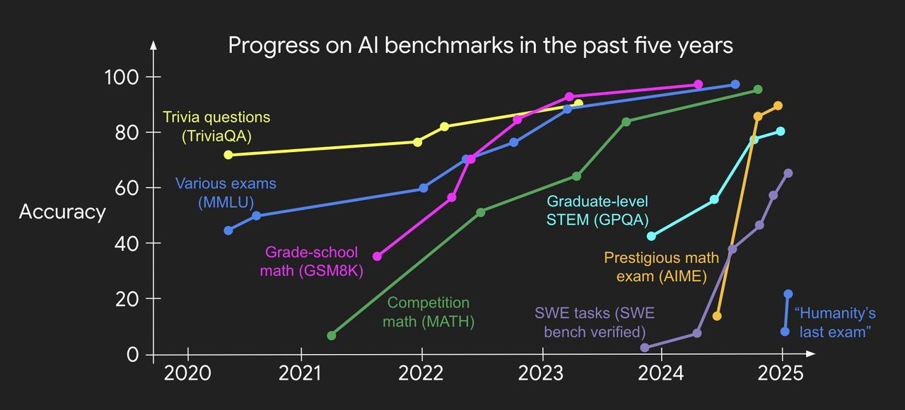

# 2025 AI Engineering Reading List 论文

## Section 1: Frontier LLMs

1. **[GPT1](https://cdn.openai.com/research-covers/language-unsupervised/language_understanding_paper.pdf), [GPT2](https://cdn.openai.com/better-language-models/language_models_are_unsupervised_multitask_learners.pdf), [GPT3](https://arxiv.org/abs/2005.14165), [Codex](https://arxiv.org/abs/2107.03374), [InstructGPT](https://arxiv.org/abs/2203.02155), [GPT4](https://arxiv.org/abs/2303.08774) papers**. Self explanatory. [**GPT3.5**](https://openai.com/index/chatgpt/), [**4o**](https://openai.com/index/hello-gpt-4o/), [**o1**](https://openai.com/index/introducing-openai-o1-preview/), **[o3](https://openai.com/index/deliberative-alignment/), [GPT4.5](https://www.interconnects.ai/p/gpt-45-not-a-frontier-model)** have launch events and system cards[(2)](https://www.latent.space/p/2025-papers#footnote-2-153615976) instead.

2. **[Claude 3](https://www-cdn.anthropic.com/de8ba9b01c9ab7cbabf5c33b80b7bbc618857627/Model_Card_Claude_3.pdf) / [4](https://www-cdn.anthropic.com/4263b940cabb546aa0e3283f35b686f4f3b2ff47.pdf?s=09) and [Gemini 1](https://arxiv.org/abs/2312.11805) / [2.5](https://storage.googleapis.com/deepmind-media/gemini/gemini_v2_5_report.pdf)** to understand the leading labs. You should also know [Claude 3.5 Sonnet](https://www.latent.space/p/claude-sonnet) and [Gemini 2.0 Flash](https://blog.google/technology/google-deepmind/google-gemini-ai-update-december-2024/#gemini-2-0-flash)/[Flash Thinking](https://ai.google.dev/gemini-api/docs/thinking-mode). Also [Gemma 2](https://arxiv.org/abs/2408.00118) & [3](https://storage.googleapis.com/deepmind-media/gemma/Gemma3Report.pdf#page=20.92) (you can read the [PyTorch re-implementation](https://news.ycombinator.com/item?id=44962059)).

3. **[LLaMA 1](https://arxiv.org/abs/2302.13971), [Llama 2](https://arxiv.org/abs/2307.09288), [Llama 3](https://arxiv.org/abs/2407.21783)** **papers&#x20;**&#x74;o understand the leading open models. You can also view [Mistral 7B](https://arxiv.org/abs/2310.06825), [Mixtral](https://arxiv.org/abs/2401.04088) and [Pixtral](https://arxiv.org/abs/2410.07073) as a branch on the Llama family tree. More recently China models have overtaken: [Kimi K-2](https://moonshotai.github.io/Kimi-K2/) and [Qwen 3](https://arxiv.org/abs/2505.09388).

4. **DeepSeek [V1](https://arxiv.org/abs/2401.02954), [Coder](https://arxiv.org/abs/2401.14196), [Math](https://arxiv.org/abs/2402.03300)&#x20;**(esp [GRPO](https://www.interconnects.ai/p/papers-im-reading-base-model-rl-grpo))**, [MoE](https://arxiv.org/abs/2401.06066), [V2](https://arxiv.org/abs/2405.04434),[ V3](https://github.com/deepseek-ai/DeepSeek-V3), [R1](https://huggingface.co/deepseek-ai/DeepSeek-R1-Distill-Llama-70B) papers**.

5. **Post Training Survey Papers** like [this MBZUAI one](https://youtu.be/XCgWoLu-zK8), [this one](https://x.com/zainhasan6/status/1899541155924046006?s=46), and others.

You can both use and learn a lot from other LLMs, this is a vast topic. Bonus picks:

- In particular, BERTs are underrated as workhorse classification models - see [ModernBERT](https://buttondown.com/ainews/archive/ainews-modernbert-small-new-retrieverclassifier/) / [NeoBERT](https://arxiv.org/abs/2502.19587) for the state of the art, and [ColBERT for applications](https://www.answer.ai/posts/colbert-pooling.html).

- (1.5hr video) [Compare architectures](https://x.com/rasbt/status/1965798055141429523?s=46) of the various open models from [Ahead of AI](https://open.substack.com/pub/sebastianraschka).

- Honorable mentions of LLMs to know: AI2 ([Olmo](https://arxiv.org/abs/2402.00838), [Molmo](https://arxiv.org/abs/2409.17146), [OlmOE](https://arxiv.org/abs/2409.02060), [Tülu](https://allenai.org/blog/tulu-3-technical) 3, [Olmo 2](https://x.com/soldni/status/1875266934943649808?s=46)), [Grok](https://github.com/xai-org/grok-1) (esp [Grok 3](https://x.ai/news/grok-3)), [Amazon Nova](https://buttondown.com/ainews/archive/ainews-olympus-has-dropped-aka-amazon-nova/), [Yi](https://www.wired.com/story/chinese-startup-01-ai-is-winning-the-open-source-ai-race/), [Reka](https://www.latent.space/p/yitay), [Cohere](https://cohere.com/command), [Nemotron](https://buttondown.com/ainews/archive/ainews-to-be-named-2748/), [Microsoft Phi](https://arxiv.org/abs/2412.08905), [HuggingFace SmolLM](https://www.latent.space/p/2024-open-models) (esp [SmolLM 3](https://huggingface.co/blog/smollm3)), [Apple Intelligence](https://arxiv.org/abs/2407.21075) - mostly lower in ranking or lack papers.

- Research to know: If time allows, we recommend the **Scaling Laws** literature: [Kaplan](http://arxiv.org/abs/2001.08361), [Chinchilla](https://arxiv.org/abs/2203.15556), [Emergence](https://arxiv.org/abs/2206.07682) / [Mirage](https://arxiv.org/abs/2304.15004), [Post-Chinchilla laws](https://arxiv.org/abs/2401.00448).[(3)](https://www.latent.space/p/2025-papers#footnote-3-153615976) As of July 2025, [Kimi K-2/Moonshot](https://moonshotai.github.io/Kimi-K2/) and [Muon](https://arxiv.org/abs/2502.16982) is also strongly recommended.

- In 2025, the frontier (o1, [o3](https://en.wikipedia.org/wiki/OpenAI_o3), [R1](https://api-docs.deepseek.com/news/news1120), [QwQ](https://qwenlm.github.io/blog/qwq-32b-preview/)/[QVQ](https://qwenlm.github.io/blog/qvq-72b-preview/), [f1](https://fireworks.ai/blog/fireworks-compound-ai-system-f1)) will be very much dominated by **reasoning models**, where [Sebastian Raschka](https://magazine.sebastianraschka.com/p/understanding-reasoning-llms) currently has the best literature review. The basic knowledge is [Let’s Verify Step By Step](https://arxiv.org/abs/2305.20050)[(4)](https://www.latent.space/p/2025-papers#footnote-4-153615976), [s1](https://arxiv.org/abs/2501.19393), [STaR](https://www.youtube.com/watch?v=Y5-FeaFOEFM) ([core to xAI](https://x.com/shaneguML/status/1944558999342661963)), and [Noam Brown’s talks/podcasts](https://www.youtube.com/live/Gr_eYXdHFis). Most practical knowledge is [accumulated by outsiders](https://hn.algolia.com/?dateRange=all&page=0&prefix=false&query=o1&sort=byPopularity&type=story) ([LS talk](https://www.youtube.com/watch?v=skT89EvIjrc&t=68s)) and tweets.

-

## Section 2: Benchmarks and Evals

1. **[MMLU](https://arxiv.org/abs/2009.03300) paper** - the main **knowledge** benchmark, next to [**GPQA**](https://arxiv.org/abs/2311.12022) and [BIG-Bench](https://arxiv.org/abs/2206.04615). In 2025 frontier labs use [**MMLU Pro**](https://arxiv.org/abs/2406.01574), **[GPQA Diamond](https://arxiv.org/abs/2311.12022), and [BIG-Bench Hard](https://arxiv.org/abs/2210.09261).**

2. [**MRCR**](https://arxiv.org/html/2409.12640v2)[(5)](https://www.latent.space/p/2025-papers#footnote-5-153615976)**&#x20;paper** - evaluating **long context**, [used by OpenAI](https://www.latent.space/p/quasar) over [MuSR](https://arxiv.org/abs/2310.16049), [LongBench](https://arxiv.org/abs/2412.15204), [BABILong](https://arxiv.org/abs/2406.10149), and [RULER](https://www.latent.space/p/gradient). Fixing the overused [Needle in a Haystack](https://github.com/gkamradt/LLMTest_NeedleInAHaystack).

3. **[MATH ](https://arxiv.org/abs/2103.03874)paper** - a compilation of **math competition problems**. Frontier labs focus on [FrontierMath](https://arxiv.org/abs/2411.04872), [AMO](https://x.com/jack_w_rae/status/1924897579122491523) and subsets of MATH: MATH level 5, [AIME](https://www.kaggle.com/datasets/hemishveeraboina/aime-problem-set-1983-2024), [AMC10/AMC12](https://github.com/ryanrudes/amc).

4. **[IFEval](https://arxiv.org/abs/2311.07911) paper&#x20;**- the leading **instruction following&#x20;**&#x65;val. See also [Facebook’s](https://github.com/facebookresearch/Multi-IF) [Multi-IF](https://arxiv.org/abs/2410.15553), [COLLIE](https://collie-benchmark.github.io/) and [Scale MultiChallenge](https://arxiv.org/abs/2501.17399), which has now overtaken [MT-Bench](https://huggingface.co/spaces/lmsys/mt-bench).

5. **[ARC AGI](https://arcprize.org/arc) challenge** - a famous **abstract reasoning** “IQ test” benchmark that has lasted far longer than many quickly saturated benchmarks.

This is a moving and [often gamed](https://x.com/kalomaze/status/1923983739299955064) target - [May 2025 update](https://x.com/scaling01/status/1919092778648408363) here. We covered many of these in [Benchmarks 101](https://www.latent.space/p/benchmarks-101) and [Benchmarks 201](https://www.latent.space/p/benchmarks-201), while our [Carlini](https://www.latent.space/p/carlini), [LMArena](https://www.latent.space/p/lmarena) ([warning](https://x.com/karpathy/status/1917546757929722115)!), and [Braintrust](https://www.latent.space/p/braintrust) covered private, arena, and product evals (read [LLM-as-Judge](https://hamel.dev/blog/posts/llm-judge/) - and [Rubrics](https://x.com/iscienceluvr/status/1948235609190867054?s=46) -and[ Applied LLMs essay](https://applied-llms.org/#evaluation-monitoring)). Benchmarks are linked to [Datasets](https://www.latent.space/p/datasets-101).

The bigger picture is that benchmarks saturate increasingly quickly, and there is a sense that [the whole approach is getting dated](https://ysymyth.github.io/The-Second-Half/) and [new approaches are needed](https://research.trychroma.com/generative-benchmarking).

## Section 3: Prompting, ICL & Chain of Thought

> **\*Note**: The GPT3 paper (“Language Models are Few-Shot Learners”) should already have introduced In-Context Learning (ICL) - a close cousin of prompting. We also consider [prompt injections](https://www.latent.space/i/93381455/what-is-prompt-injection) required knowledge — [Lilian Weng](https://lilianweng.github.io/posts/2023-10-25-adv-attack-llm/), [Simon W](https://simonwillison.net/series/prompt-injection/).\*

1. [**The Prompt Report**](https://arxiv.org/abs/2406.06608) **paper** - a survey of prompting papers ([podcast](https://www.latent.space/p/learn-prompting)).

2. **[Chain-of-Thought](https://arxiv.org/abs/2201.11903) paper&#x20;**- one of multiple claimants to popularizing **Chain of Thought**, along with [**Scratchpads**](https://arxiv.org/abs/2112.00114) and [**Let’s Think Step By Step**](https://arxiv.org/abs/2205.11916)

3. **[Tree of Thought](https://arxiv.org/abs/2305.10601) paper** -**&#x20;**&#x69;ntroducing **lookaheads** and **backtracking** ([podcast](https://www.latent.space/p/shunyu))

4. **[Prompt Tuning](https://aclanthology.org/2021.emnlp-main.243/) paper -** you may not need prompts - if you can do [Prefix-Tuning](https://arxiv.org/abs/2101.00190), [adjust decoding](https://arxiv.org/abs/2402.10200) (say [via entropy](https://github.com/xjdr-alt/entropix)), or [representation engineering](https://vgel.me/posts/representation-engineering/)

5. **[Automatic Prompt Engineering](https://arxiv.org/abs/2211.01910) paper** - it is increasingly obvious that **humans are terrible zero-shot prompters** and _prompting itself&#x20;_&#x63;an be enhanced by LLMs. The most notable implementation of this is in the [DSPy paper](https://arxiv.org/abs/2310.03714)/framework.

More survey papers on [reasoning](https://x.com/denny_zhou/status/1948499173986201915) ([slides](https://dennyzhou.github.io/LLM-Reasoning-Stanford-CS-25.pdf)). Prompting and [Context Engineering](https://www.dbreunig.com/2025/07/24/why-the-term-context-engineering-matters.html) is one area where reading disparate papers may not be as useful as having more practical guides - we recommend [Lilian Weng](https://lilianweng.github.io/posts/2023-03-15-prompt-engineering/), [Eugene Yan](https://eugeneyan.com/writing/prompting/), and [Anthropic’s Prompt Engineering Tutorial](https://github.com/anthropics/prompt-eng-interactive-tutorial) and [AI Engineer Workshop](https://www.youtube.com/watch?v=hkhDdcM5V94).

## Section 4: Retrieval Augmented Generation

1. **[Introduction to Information Retrieval](https://nlp.stanford.edu/IR-book/information-retrieval-book.html)&#x20;**- a bit unfair to recommend a book, but we are trying to make the point that RAG is an IR problem and [IR has a 60 year history](https://en.wikipedia.org/wiki/Information_retrieval#History) that includes [TF-IDF](https://en.wikipedia.org/wiki/Tf%E2%80%93idf), [BM25](https://en.wikipedia.org/wiki/Okapi_BM25), [FAISS](https://github.com/facebookresearch/faiss), [HNSW](https://arxiv.org/abs/1603.09320) and other “boring” techniques.

2. **2020 [Meta RAG](https://arxiv.org/abs/2005.11401) paper** - which coined the term. The original authors have started Contextual and have [coined RAG 2.0](https://contextual.ai/introducing-rag2/). Modern “table stakes” for RAG — [HyDE](https://docs.llamaindex.ai/en/stable/optimizing/advanced_retrieval/query_transformations/), [chunking](https://research.trychroma.com/evaluating-chunking), [rerankers](https://cohere.com/blog/rerank-3pt5), [multimodal data](https://www.youtube.com/watch?v=i2vBaFzCEJw) are [better](https://www.youtube.com/watch?v=TRjq7t2Ms5I&t=152s) [presented](https://www.youtube.com/watch?v=FDEmbYPgG-s) [elsewhere](https://www.youtube.com/watch?v=DId2KP8Ykz4).

3. **[MTEB](https://arxiv.org/abs/2210.07316) paper&#x20;**- [known overfitting](https://news.ycombinator.com/item?id=42504379) that [its author considers it dead](https://x.com/Nils_Reimers/status/1870812625505849849), but still de-facto benchmark. Many embeddings have papers - pick your poison - [SentenceTransformers](https://huggingface.co/sentence-transformers/all-MiniLM-L6-v2), [**OpenAI**, **Nomic Embed, Jina v3, cde-small-v1**](https://www.youtube.com/watch?v=VIqXNRsRRQo)**,&#x20;**[ModernBERT Embed](https://x.com/zach_nussbaum/status/1873813021786767699?s=46&t=tMWvmS3OL3Ssg0b9lKvp4Q) - with [Matryoshka embeddings](https://huggingface.co/blog/matryoshka) increasingly standard.

4. **[GraphRAG](https://arxiv.org/pdf/2404.16130) paper** - [Microsoft’s](https://www.microsoft.com/en-us/research/blog/graphrag-unlocking-llm-discovery-on-narrative-private-data/?utm_source=ainews&utm_medium=email&utm_campaign=ainews-graphrag) take on adding knowledge graphs to RAG, [now open sourced](https://buttondown.com/ainews/archive/ainews-graphrag/). One of the [most popular trends in RAG](https://www.youtube.com/watch?v=knDDGYHnnSI) in 2024, alongside of [ColBERT](https://github.com/stanford-futuredata/ColBERT)/ColPali/ColQwen (more in the Vision section).

5. **[RAGAS](https://arxiv.org/abs/2309.15217) paper -&#x20;**&#x74;he simple RAG eval [recommended by OpenAI](https://x.com/swyx/status/1724490887147978793). See als&#x6F;**&#x20;[Nvidia FACTS framework](https://arxiv.org/abs/2407.07858v1)&#x20;**&#x61;nd **[Extrinsic Hallucinations in LLMs](https://lilianweng.github.io/posts/2024-07-07-hallucination/)&#x20;**- Lilian Weng’s survey of causes/evals for hallucinations (see also [Jason Wei on recall vs precision](https://x.com/_jasonwei/status/1871285864690815053)).

RAG is the bread and butter of AI Engineering at work in 2024, so there are a LOT of industry resources and practical experience you will be expected to have. [LlamaIndex](https://docs.llamaindex.ai/en/stable/understanding/rag/) ([course](https://www.deeplearning.ai/short-courses/building-evaluating-advanced-rag/)) and [LangChain](https://python.langchain.com/docs/tutorials/rag/) ([video](https://www.youtube.com/watch?v=wd7TZ4w1mSw)) have perhaps invested the most in educational resources. You should also be familiar with the perennial [RAG vs Long Context](https://arxiv.org/abs/2407.16833) debate.

## Section 5: Agents

1. **[SWE-Bench](https://arxiv.org/abs/2310.06770)&#x20;**([our pod](https://www.latent.space/p/iclr-2024-benchmarks-agents?utm_source=publication-search#%C2%A7section-b-benchmarks)) & [SWE-Lancer](https://openai.com/index/swe-lancer/) - after [adoption by Anthropic](https://www.latent.space/p/claude-sonnet), Devin and [OpenAI](https://openai.com/index/introducing-swe-bench-verified/), probably the highest profile agent benchmark[(6)](https://www.latent.space/p/2025-papers#footnote-6-153615976) today (vs [WebArena](https://github.com/web-arena-x/webarena) or [SWE-Gym](https://x.com/jiayi_pirate/status/1871249410128322856)). Technically a coding benchmark, but more a test of agents than raw LLMs. See also [SWE-Agent](https://arxiv.org/abs/2405.15793), [SWE-Bench Multimodal](https://arxiv.org/abs/2410.03859) and the [Konwinski Prize](https://kprize.ai/). For Tool-Agent-User interaction there is [TauBench](https://arxiv.org/abs/2406.12045) for Airlines and Retail and [GAIA](https://arxiv.org/abs/2311.12983).

2. **[ReAct](https://arxiv.org/abs/2210.03629) paper&#x20;**([our podcast](https://www.latent.space/p/shunyu)) - ReAct started a long line of research on **tool using and function calling LLMs,&#x20;**&#x69;ncluding [Gorilla](https://gorilla.cs.berkeley.edu/) and the [BFCL Leaderboard](https://gorilla.cs.berkeley.edu/leaderboard.html). Of historical interest - [Toolformer](https://arxiv.org/abs/2302.04761) and [HuggingGPT](https://arxiv.org/abs/2303.17580).

3. **[MemGPT](https://arxiv.org/abs/2310.08560) paper** - one of [many notable approaches](https://x.com/swyx/status/1915128966203236571) to emulating long running agent memory, adopted by [ChatGPT](https://openai.com/index/memory-and-new-controls-for-chatgpt/) and [LangGraph](https://langchain-ai.github.io/langgraph/concepts/memory/#episodic-memory). Versions of these are reinvented in every agent system from [MetaGPT](https://arxiv.org/abs/2308.00352) to [AutoGen](https://arxiv.org/abs/2308.08155) to [Smallville](https://github.com/joonspk-research/generative_agents).

4. **[Voyager](https://arxiv.org/abs/2305.16291) paper** - Nvidia’s take on 3 [cognitive architecture](https://arxiv.org/abs/2309.02427) components (**curriculum, skill library, sandbox**) to improve performance. More abstractly, skill library/curriculum can be abstracted as a form of [Agent Workflow Memory](https://arxiv.org/abs/2409.07429).

5. **Anthropic on [Building Effective Agents](https://www.anthropic.com/research/building-effective-agents)&#x20;**([talk version](https://x.com/aiDotEngineer/status/1908230651985485955)) - just a great state-of-2024 recap that focuses on the importance of **chaining**, **routing, parallelization, orchestration, evaluation, and optimization.** See also [Lilian Weng’s Agents](https://lilianweng.github.io/posts/2023-06-23-agent/) (ex OpenAI), [Shunyu Yao on LLM Agents](https://www.latent.space/p/shunyu) (now at OpenAI) and [Chip Huyen’s Agents](https://huyenchip.com//2025/01/07/agents.html).

We covered many of [the 2024 SOTA agent designs at NeurIPS](https://www.latent.space/p/2024-agents), and you can find more readings in [the UC Berkeley LLM Agents MOOC](https://llmagents-learning.org/f24). Note that we skipped bikeshedding agent definitions, but if you really need one, you could [use mine](https://www.youtube.com/watch?v=wnsZ7DuqYp0).

## Section 6: Code Generation

1. **[The Stack paper](https://arxiv.org/abs/2211.15533)&#x20;**- the original open dataset twin of The Pile focused on code, starting a great lineage of open codegen work from [The Stack v2](https://huggingface.co/datasets/bigcode/the-stack-v2) to [StarCoder](https://arxiv.org/abs/2402.19173).

2. **Open Code Model papers** - choose from [DeepSeek-Coder](https://arxiv.org/abs/2401.14196), [Qwen2.5-Coder](https://arxiv.org/abs/2409.12186), or [CodeLlama](https://ai.meta.com/research/publications/code-llama-open-foundation-models-for-code/). Many regard [3.5 Sonnet as the best code model](https://www.latent.space/p/claude-sonnet) but it has no paper.

3. [**HumanEval/Codex paper**](https://arxiv.org/abs/2107.03374) - This is a saturated benchmark, but is required knowledge for the code domain. SWE-Bench is more famous for coding now, but is expensive/evals agents rather than models. Modern replacements include [Aider](https://aider.chat/docs/leaderboards/), [Codeforces](https://arxiv.org/abs/2312.02143), [IOI](https://arxiv.org/pdf/2502.06807v1), [BigCodeBench](https://huggingface.co/spaces/bigcode/bigcodebench-leaderboard), [LiveCodeBench](https://livecodebench.github.io/) and [SciCode](https://buttondown.com/ainews/archive/ainews-to-be-named-5745/).

4. **[AlphaCodeium paper](https://arxiv.org/abs/2401.08500)&#x20;**- Google published [AlphaCode](https://news.ycombinator.com/item?id=34020025) and [AlphaCode2](https://x.com/RemiLeblond/status/1732419456272318614) which did very well on programming problems, but here is one way **Flow Engineering&#x20;**&#x63;an add a lot more performance to any given base model.

5. **[CriticGPT](https://criticgpt.org/criticgpt-openai/) paper** - LLMs are [known](https://arxiv.org/abs/2412.15004v1) to generate code that can have security issues. OpenAI trained CriticGPT to spot them, and Anthropic [uses SAEs to identify LLM features](https://transformer-circuits.pub/2024/scaling-monosemanticity/index.html#safety-relevant-code) that cause this, but it is a problem you should be aware of.

CodeGen is another field where much of the frontier has moved from research to industry and [practical engineering advice on codegen](https://www.youtube.com/watch?v=Ve-akpov78Q) and [code agents like Devin](https://www.youtube.com/watch?v=T7NWjoD_OuY&t=8s) are only found in industry blogposts and talks rather than research papers.

## Section 7: Vision

- **Non-LLM Vision work** is still important: e.g. the **[YOLO](https://arxiv.org/abs/1506.02640) paper&#x20;**(now [up to v11](https://github.com/ultralytics/ultralytics), but [mind the lineage](https://news.ycombinator.com/item?id=42352342)), but increasingly transformers like [DETRs Beat YOLOs](https://arxiv.org/abs/2304.08069) too.

- **[CLIP](https://arxiv.org/abs/2103.00020) paper&#x20;**- the first successful [ViT](https://arxiv.org/abs/2010.11929) from Alec Radford. These days, superceded by [BLIP](https://arxiv.org/abs/2201.12086)/[BLIP2](https://arxiv.org/abs/2301.12597) or [SigLIP/PaliGemma](https://www.latent.space/i/152857207/part-vision), but still required to know.

- **[MMVP benchmark](https://arxiv.org/abs/2401.06209)&#x20;**([LS Live](https://www.latent.space/p/2024-vision))- quantifies issues with CLIP. Multimodal versions of MMLU ([MMMU](https://arxiv.org/abs/2311.16502)), and [SWE-Bench](https://arxiv.org/abs/2410.03859) do exist. See also [MathVista](https://github.com/lupantech/MathVista) and [CharXiv](https://charxiv.github.io/).

- **[Segment Anything Model ](https://arxiv.org/abs/2304.02643)and [SAM 2](https://arxiv.org/abs/2408.00714) paper** ([our pod](https://latent.space/p/sam2)) - the very successful image and video segmentation foundation model. Pair with [GroundingDINO](https://github.com/IDEA-Research/GroundingDINO).

- **Early fusion research**: Contra the cheap “late fusion” work like [LLaVA](https://arxiv.org/abs/2304.08485) ([our pod](https://www.latent.space/p/neurips-2023-papers)), early fusion covers Meta’s [Flamingo](https://huyenchip.com/2023/10/10/multimodal.html), [Chameleon](https://arxiv.org/abs/2405.09818), Apple’s [AIMv2](https://arxiv.org/abs/2411.14402), Reka [Core](https://arxiv.org/abs/2404.12387), et al. In reality there [are at least 4 streams of visual LM work](https://lilianweng.github.io/posts/2022-06-09-vlm/).

Much frontier VLM work these days is no longer published (the last we really got was [GPT4V system card](https://cdn.openai.com/papers/GPTV_System_Card.pdf) and [derivative papers](https://arxiv.org/abs/2309.17421)). We recommend having working experience with vision capabilities of 4o (including [finetuning 4o vision](https://blog.roboflow.com/gpt-4o-object-detection/)), Claude 3.5 Sonnet/Haiku, Gemini 2.0 Flash, and o1. Others: [Pixtral](https://mistral.ai/news/pixtral-large/), [Llama 3.2](https://buttondown.com/ainews/archive/ainews-llama-32-on-device-1b3b-and-multimodal/), [Moondream](https://www.youtube.com/watch?v=T7sxvrJLJ14), [QVQ](https://news.ycombinator.com/item?id=42505038).

OCR is an important subset workhorse functionality of vision, so you may wish to check out [Mistral OCR](https://news.ycombinator.com/item?id=43282905) and [VLM Run](https://news.ycombinator.com/item?id=43187209).

## Section 8: Voice

- **[Whisper](https://arxiv.org/abs/2212.04356) paper&#x20;**- the successful **ASR&#x20;**&#x6D;odel from Alec Radford. Whisper [v2](https://news.ycombinator.com/item?id=33884716), [v3](https://news.ycombinator.com/item?id=38166965) and [distil-whisper](https://github.com/huggingface/distil-whisper) and [v3 Turbo](https://amgadhasan.substack.com/p/demystifying-openais-new-whisper) are open weights but have no paper.

- **[AudioPaLM](http://audiopalm/) paper&#x20;**- our last look at Google’s voice thoughts before PaLM became Gemini. See also: Meta’s [Llama 3 explorations into speech](https://arxiv.org/abs/2407.21783).

- **[NaturalSpeech](https://arxiv.org/abs/2205.04421?utm_source=chatgpt.com) paper&#x20;**- one of a few leading **TTS** approaches. Recently [v3](https://arxiv.org/abs/2403.03100).

- **[Kyutai Moshi](http://moshi/) paper&#x20;**- an impressive full-duplex speech-text open weights model with [high profile demo](https://www.youtube.com/watch?v=hm2IJSKcYvo). See also [Hume OCTAVE](https://www.hume.ai/blog/introducing-octave).

- [**OpenAI Realtime API: The Missing Manual**](https://www.latent.space/p/realtime-api) - Again, frontier omnimodel work is not published, but we did our best to document the Realtime API.

We do recommend diversifying from the big labs here for now - try Daily, Livekit, Vapi, Assembly, Deepgram, Fireworks, Cartesia, Elevenlabs etc. See [the State of Voice 2024](https://www.cartesia.ai/blog/state-of-voice-ai-2024). While NotebookLM’s voice model is not public, [we got the deepest description of the modeling process](https://www.latent.space/p/notebooklm) that we know of. Historical interest: [wav2vec](https://arxiv.org/abs/2006.11477) (see Snipd pod)

With Gemini 2.0 also being natively voice and vision multimodal, the Voice and Vision modalities are on a clear path to merging in 2025 and beyond.

## Section 9: Image/Video Diffusion

- **[Latent Diffusion](https://arxiv.org/abs/2112.10752) paper** - effectively the Stable Diffusion paper. See also [SD2](https://stability.ai/news/stable-diffusion-v2-release), [SDXL](https://arxiv.org/abs/2307.01952), [SD3](https://arxiv.org/abs/2403.03206) papers. These days the team is working on [BFL Flux](https://github.com/black-forest-labs/flux) \[schnell|dev|pro].

- **[DALL-E](https://arxiv.org/abs/2102.12092) / [DALL-E-2](https://arxiv.org/abs/2204.06125) / [DALL-E-3](https://cdn.openai.com/papers/dall-e-3.pdf) paper&#x20;**- OpenAI’s image generation.

- **[Imagen](https://arxiv.org/abs/2205.11487) / [Imagen 2](https://deepmind.google/technologies/imagen-2/) / [Imagen 3](https://arxiv.org/abs/2408.07009) paper** - Google’s image gen.

- **[Consistency Models](https://arxiv.org/abs/2303.01469) paper** - this distillation work with [LCMs](https://arxiv.org/abs/2310.04378) spawned the [quick draw viral moment of Dec 2023](https://www.latent.space/p/tldraw). These days, updated with [sCMs](https://arxiv.org/abs/2410.11081) or [DMDs](https://github.com/Tongyi-MAI/Z-Image#user-content--decoupled-dmd-the-acceleration-magic-behind-z-image).

- **[Sora](https://openai.com/index/sora/) blogpost** - text to video - no paper of course beyond [the DiT paper](https://arxiv.org/abs/2212.09748) (same authors), but still the most significant launch of the year, with many [open weights competitors](https://artificialanalysis.ai/text-to-video/arena?tab=Leaderboard) like [OpenSora](https://arxiv.org/abs/2412.00131). [Lilian Weng survey here](https://lilianweng.github.io/posts/2024-04-12-diffusion-video/).

- [**Autoregressive image generation**](https://www.youtube.com/watch?v=yJ396Ksiv2s) is all the rage this year for [Gemini](https://developers.googleblog.com/en/experiment-with-gemini-20-flash-native-image-generation/), [4o](https://news.ycombinator.com/item?id=43474112#43475809), and [Llama’s](https://arxiv.org/abs/2406.06525) Native Image Gen.

- More Image/Video work is done in Startups now. See [Ideogram](https://www.reddit.com/r/singularity/comments/1exsq4d/introducing_ideogram_20_our_most_advanced/), [Recraft](https://www.recraft.ai/), [Reve Image](https://buttondown.com/ainews/archive/ainews-halfmoon-is-reve-image-a-new-sota-image/), Pika, Playground, [Genmo](https://github.com/genmoai/mochi) and Chinese models like Wan 2.1 and Kling.

We also highly recommend familiarity with **ComfyUI** ([we were first to interview](https://www.latent.space/p/comfyui)). [Text Diffusion](https://www.youtube.com/watch?v=1mG678f1ZYU&pp=ygUOdGV4dCBkaWZmdXNpb24%3D) ([Mercury/Inception](https://www.inceptionlabs.ai/blog/mercury-refreshed) is SOTA) and [Music Diffusion](https://arxiv.org/abs/2302.03917) are niche for now.

For historical interest: **[DALL-E](https://arxiv.org/abs/2102.12092) / [DALL-E-2](https://arxiv.org/abs/2204.06125) / [DALL-E-3](https://cdn.openai.com/papers/dall-e-3.pdf) paper&#x20;**- OpenAI’s image generation, and **[Imagen](https://arxiv.org/abs/2205.11487) / [Imagen 2](https://deepmind.google/technologies/imagen-2/) / [Imagen 3](https://arxiv.org/abs/2408.07009) paper** - Google’s image gen.

## Section 10: Finetuning

- **[LoRA](https://arxiv.org/abs/2106.09685)/[QLoRA](http://arxiv.org/abs/2305.14314) paper** - the de facto way to finetune models cheaply, whether on local models or with 4o ([confirmed on pod](https://www.latent.space/p/cosine)). [FSDP+QLoRA](https://www.answer.ai/posts/2024-03-06-fsdp-qlora.html) is educational.

- **[DPO](https://arxiv.org/abs/2305.18290) paper&#x20;**- the popular, if slightly inferior, alternative to [PPO](https://arxiv.org/abs/1707.06347), now supported by OpenAI as [Preference Finetuning](https://platform.openai.com/docs/guides/fine-tuning#preference).

- **[ReFT](https://arxiv.org/abs/2404.03592) paper** - instead of finetuning a few layers, focus on features instead.

- **[Orca 3/AgentInstruct](https://www.microsoft.com/en-us/research/blog/orca-agentinstruct-agentic-flows-can-be-effective-synthetic-data-generators/) paper** - see the [Synthetic Data picks at NeurIPS](https://www.latent.space/p/2024-syndata-smolmodels) but this is a great way to get finetue data.

- **RL/Reasoning Tuning papers** - [RL Finetuning for o1](https://www.interconnects.ai/p/openais-reinforcement-finetuning) is debated, but [Let’s Verify Step By Step](https://arxiv.org/abs/2305.20050) and [Noam Brown’s many public talks](https://x.com/swyx/status/1867990396762243324) give hints for how it works.

We recommend going thru [the Unsloth notebooks](https://github.com/unslothai/unsloth) and HuggingFace’s [How to fine-tune open LLMs](https://www.philschmid.de/fine-tune-llms-in-2025) for more on the full process. This is obviously an endlessly deep rabbit hole that, at the extreme, overlaps with the Research Scientist track
