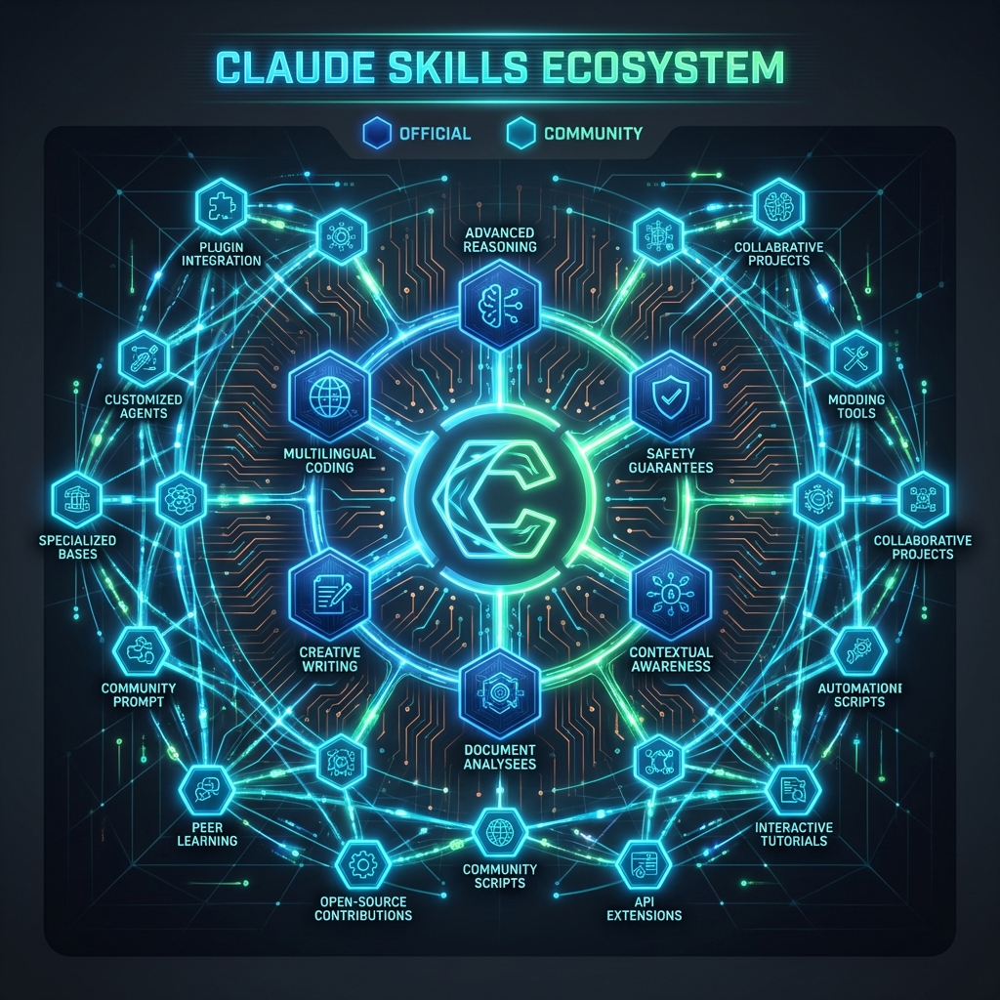
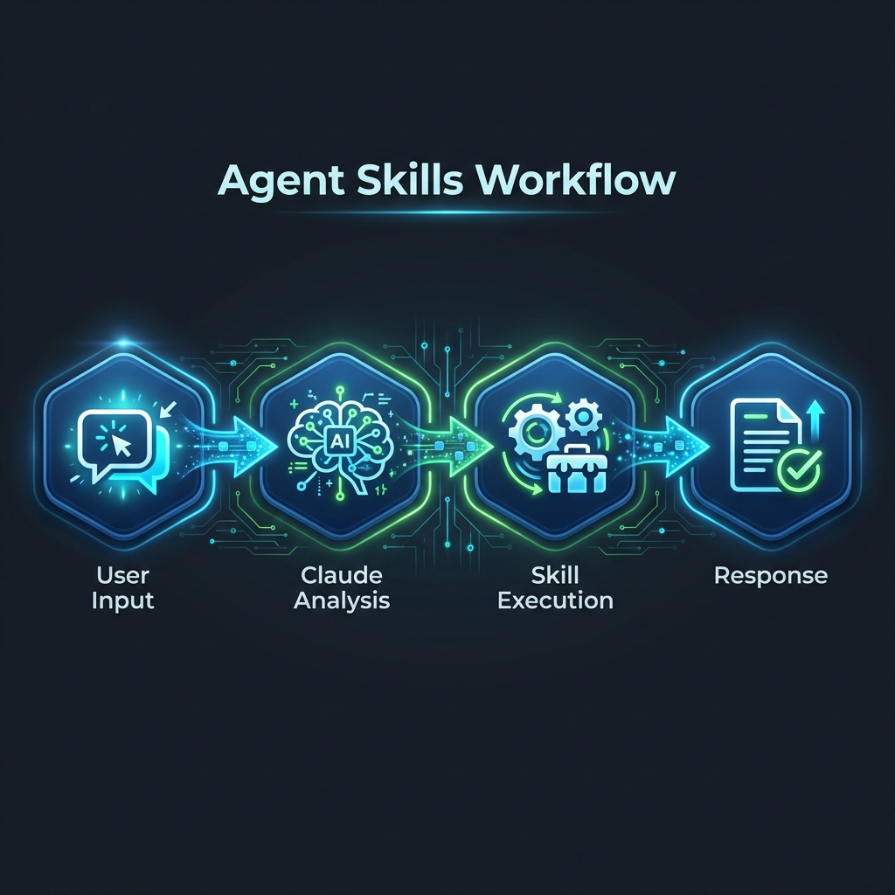
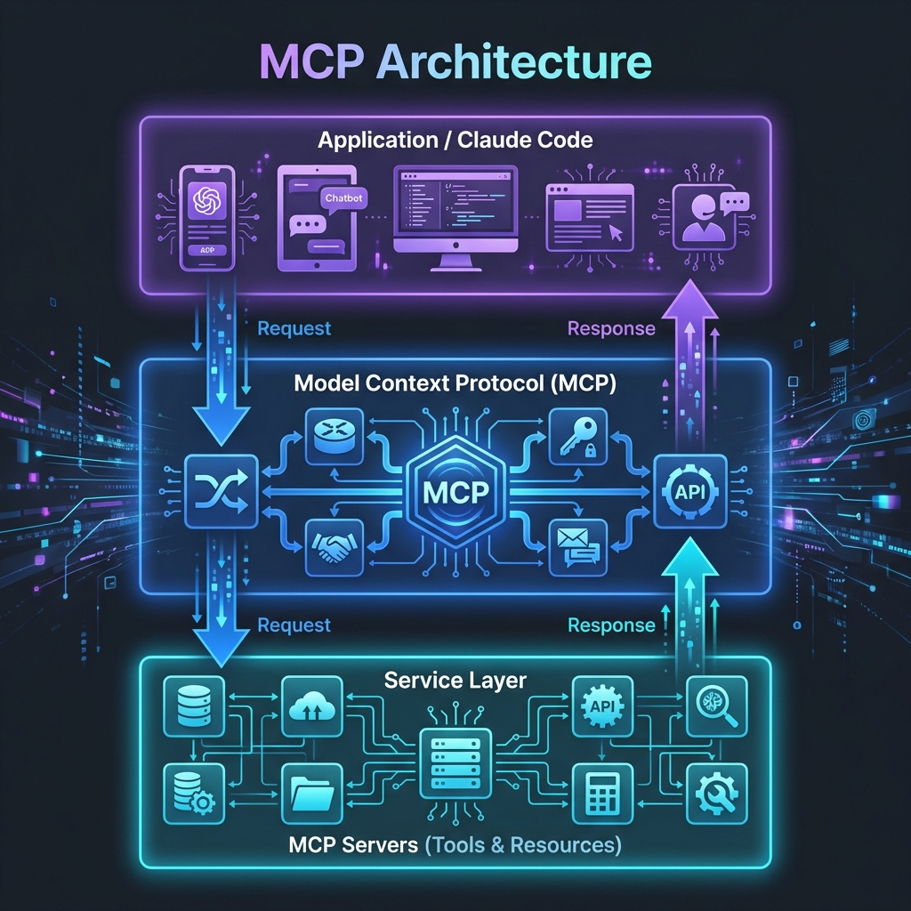
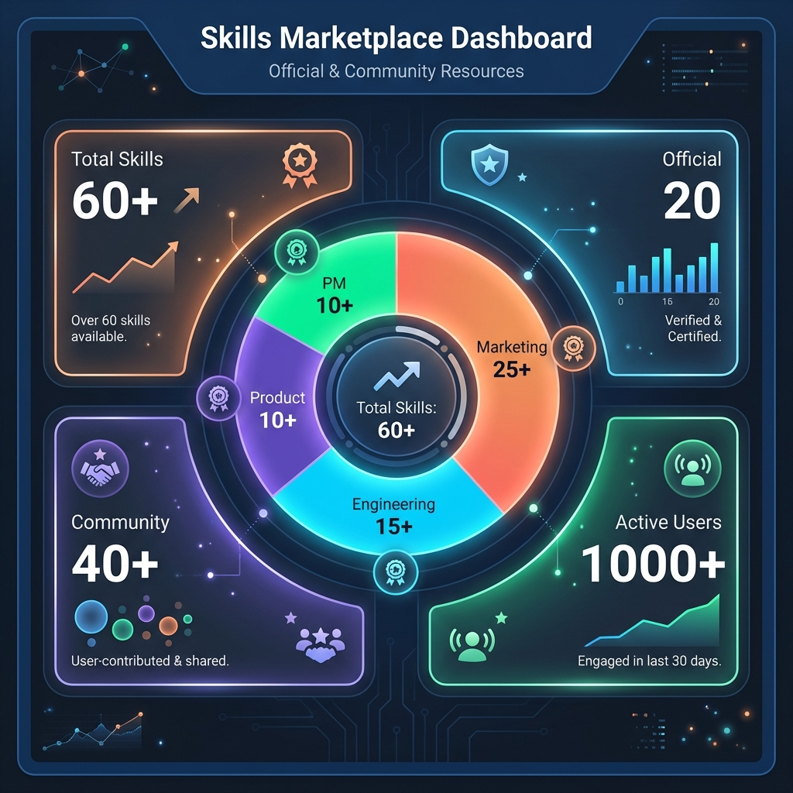
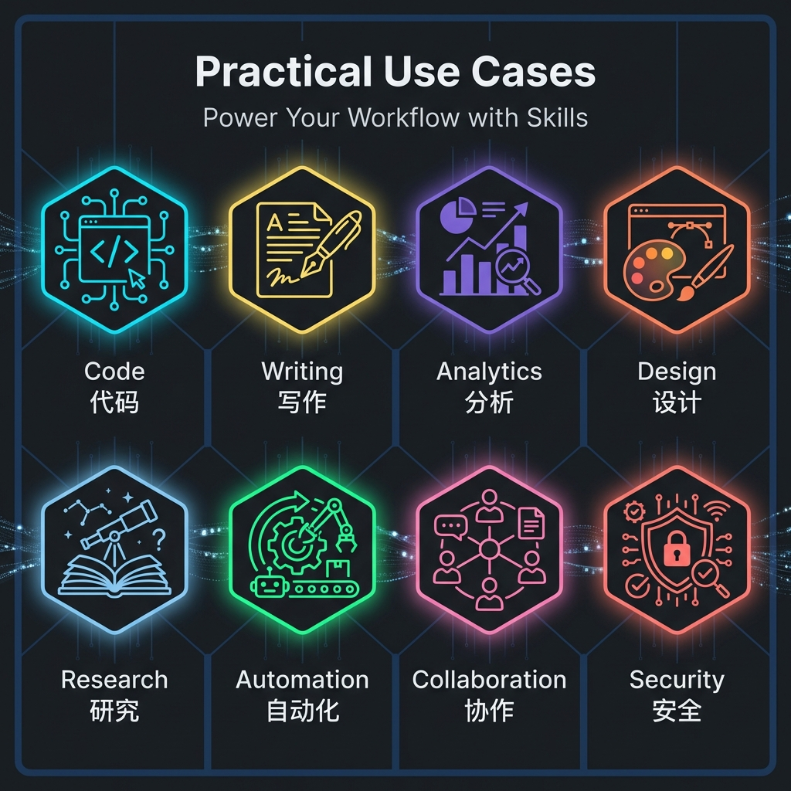

# 收录官方与社区共建资源的 Claude Skills 精选合集



## Introduction

Claude Skills 是一个由 Anthropic 官方和开源社区共同构建的技能生态系统。通过 Agent Skills 和 MCP (Model Context Protocol) 协议，Claude 可以获得强大的扩展能力，从代码开发到内容创作，从数据分析到自动化运维，应有尽有。

本文将为您精选并介绍最实用的 Claude Skills 资源，包括官方认证技能和社区贡献的优秀项目。

## Agent Skills 工作原理



Agent Skills 是 Claude 的核心扩展机制，工作流程如下：

1. **用户输入**: 用户向 Claude 发起请求
2. **Claude 分析**: Claude 理解意图并选择合适的技能
3. **技能执行**: 调用对应的 Skill 执行任务
4. **返回结果**: 将处理结果返回给用户

这种模式让 Claude 能够完成原本无法独立完成的任务，大大扩展了应用范围。

## MCP (Model Context Protocol)



MCP 是一个开放标准，定义了 AI 应用程序如何连接到外部数据源和工具。它采用分层架构：

### 应用层 (Application Layer)

- Claude Code、Cursor、其他 AI 编辑器
- 提供用户界面和体验

### MCP 协议层 (MCP Protocol)

- 标准化的通信协议
- 处理请求和响应
- 确保安全性和可靠性

### 服务层 (Service Layer)

- MCP 服务器提供工具和资源
- 连接到数据库、API、本地文件系统等
- 执行实际的业务逻辑

通过这种架构，开发者可以轻松创建新的 MCP 服务器来扩展 Claude 的能力。

## 官方与社区资源统计



根据最新统计，Claude Skills 生态系统已经非常丰富：

### 官方技能

- **总计**: 约 20 个官方认证技能
- **类别**: 文件系统、浏览器自动化、搜索引擎、数据库等
- **质量**: 经过严格测试，生产环境可用

### 社区贡献

- **总计**: 60+ 个社区技能
- **增长**: 月均新增 5-10 个高质量技能
- **覆盖**: 营销 (5)、工程 (18)、产品 (11)、项目管理 (8)、高管顾问 (4)

### 活跃用户

- **月活用户**: 1000+ 并持续增长
- **贡献者**: 50+ 开发者参与社区建设

## 实践应用场景



Claude Skills 可以应用于多种实际场景：

### 1. 代码开发 (Code)

- 代码审查和重构
- 自动化测试
- API 文档生成

### 2. 内容写作 (Writing)

- 技术博客配图
- 文档自动化
- SEO 优化

### 3. 数据分析 (Analytics)

- 数据可视化
- 报表生成
- 趋势分析

### 4. 设计创作 (Design)

- UI/UX 设计辅助
- 配色方案生成
- 设计系统管理

### 5. 研究学习 (Research)

- 文献检索
- 知识管理
- 笔记整理

### 6. 自动化 (Automation)

- 工作流自动化
- 批量处理
- 定时任务

### 7. 协作管理 (Collaboration)

- 项目管理
- 团队协作
- 进度跟踪

### 8. 安全审计 (Security)

- 代码安全扫描
- 合规性检查
- 漏洞检测

## 推荐技能列表

### 营销类 (Marketing)

- Content Creator - 内容创作和 SEO 优化
- Marketing Demand & Acquisition - 获客和需求生成
- App Store Optimization - 应用商店优化

### 工程类 (Engineering)

- Senior Frontend/Backend/Fullstack - 全栈开发
- DevOps - 自动化运维
- Code Reviewer - 代码审查

### 产品类 (Product)

- Product Manager Toolkit - 产品管理工具
- UX Researcher Designer - 用户研究和设计
- Product Analytics - 产品分析

### 项目管理类 (Project Management)

- Agile Coach - 敏捷教练
- Scrum Master - Scrum 管理
- Release Manager - 发布管理

## 如何开始使用

### 安装 MCP 服务器

```bash
# 1. 文件系统服务器
npx -y @modelcontextprotocol/server-filesystem

# 2. Brave 搜索
npx -y @modelcontextprotocol/server-brave-search

# 3. Puppeteer 浏览器控制
npx -y @modelcontextprotocol/server-puppeteer
```

### 安装 Agent Skills

```bash
# 使用 npx add-skill 命令
npx add-skill vercel-labs/agent-skills
npx add-skill alirezarezvani/claude-skills
npx add-skill JimLiu/baoyu-skills
```

### 配置 Antigravity

编辑 `mcp_config.json` 添加所需的 MCP 服务器配置。

## Summary

Claude Skills 生态系统正在快速发展，官方和社区的共同努力为我们提供了丰富的工具和资源。无论您是开发者、内容创作者还是产品经理，都能找到适合自己的技能来提升工作效率。

随着更多开发者的加入，这个生态系统将变得更加强大。我们鼓励您不仅使用这些技能，也考虑贡献自己的技能，让整个社区受益。

## 参考资源

### 官方资源

- [Model Context Protocol 官网](https://modelcontextprotocol.io/)
- [MCP Servers GitHub](https://github.com/modelcontextprotocol/servers)

### 社区资源

- [Vercel Labs Agent Skills](https://github.com/vercel-labs/agent-skills)
- [nginity Claude Skills](https://github.com/alirezarezvani/claude-skills)
- [Baoyu Skills](https://github.com/JimLiu/baoyu-skills)
- [Claude Code Plugins Hub](https://github.com/jeremylongshore/claude-code-plugins-plus-skills)

### 本站相关

- [Skills 安装指南](/tags/tutorial/)
- [MCP 配置教程](/tags/ai/)
- [最佳实践分享](/tags/deeplearning/)
