这篇文章的方法，来源于最近特别火的一个方向 -- **Multi-Agent Orchestration System（多智能体编排系统）。**&#x867D;然它看上去非常高大上，但无需害怕，只需要跟着本文操作，你也可以搭建属于你自己的版本！

在之前的文章中，我们有讲到过 Sub-Agent 的功能，但限于易读性的考虑，没有拓展讲述 Multi-Agent 相关的内容。但这部分内容对于 Vibe Coding 而言又非常实用，因此单独抽时间写一篇。

**本文将是一篇写给所有人的深度长文，无论你是不是程序员，都能看懂。**（已经尽量减少阅读字数了！）
**我们将从"小白"的视角出发**，一步步带你揭开Multi-Agent系统的神秘面纱，并手把手教你如何在 Claude Code 这个强大的终端原生 Agent 上，完成从理论到实践的全过程。
读完这篇文章，你将不仅理解多智能体设计的核心思想，更能亲手搭建并指挥你的第一个 Agent 军团。

# 第一部分：为什么我们需要 Multi - Agent？


构建一个强大的 AI 应用，挑战往往不在于让单个 Agent 变得更聪明，而在于如何让多个智能体高效协同。单个智能体的能力很快就会达到极限，而**多智能体系统**通过将复杂任务分解，分配给各有所长的"专家"智能体来解决这一难题，这与现实世界中组建一个专家团队的逻辑如出一辙。

## 单智能体的三大天花板

在深入多智能体之前，我们先来理解为什么单个 Agent 会遇到瓶颈，让没读过先前文章的读者，重温 Sub-Agent 篇章的内容。

- **上下文窗口限制**：上下文过多，LLM模型会出现幻觉，导致输出结果不理想。

- **专业化的不足**：单Agent执行多任务的话，细分环节的产出效果会急剧下降。

- **串行处理的效率瓶颈**：单个智能体一次只能做一件事。当你的项目需要同时进行代码开发、测试编写和文档撰写时，它只能一件一件地完成，大大延长了项目周期。

## 来自 Anthropic 的实证数据

这不仅仅是理论上的优势。来自 Claude Code 母公司 Anthropic 的内部评估数据显示：

> 一个由 Claude Opus 4 担任"领导"、多个 Claude Sonnet 4 担任"员工"的多智能体系统，**在研究任务上的表现比单个最强的 Claude Opus 4 智能体高出 90.2% 。**

这雄辩地证明&#x4E86;**"团队的力量"**&#x5728; AI 世界同样适用，它具有以下优势：

- **专业化（Specialization）：**&#x53EF;以达到更高的专业水平

- **并行处理（Parallel Processing）**：缩短项目周期

- **可维护性（Maintainability）**：系统出问题，可以迅速定位哪里出问题

- **可拓展性（Scalability）**：需要新功能，只需添加新的 Sub-Agent 即可

**当然，这种分工也带来了新的挑战：协调开销。**

智能体之间需要沟通、共享信息、避免互相干扰。如果处理不当，你只是构建了一种成本更高、更容易失败的混乱模式。因此，理解并选择正确的"团队管理模式"—— 即**编排模式（Manager Pattern）&#x20;**——至关重要！

# 第二部分：三种核心的“团队管理”模式（Manager Pattern）

经过业界验证，目前主流的多智能体编排模式有三种。你应该根据任务的协调需求来选择，而不是看哪个听起来最酷！

## 1. 主管模式（Supervisor Pattern） - 中心化控制

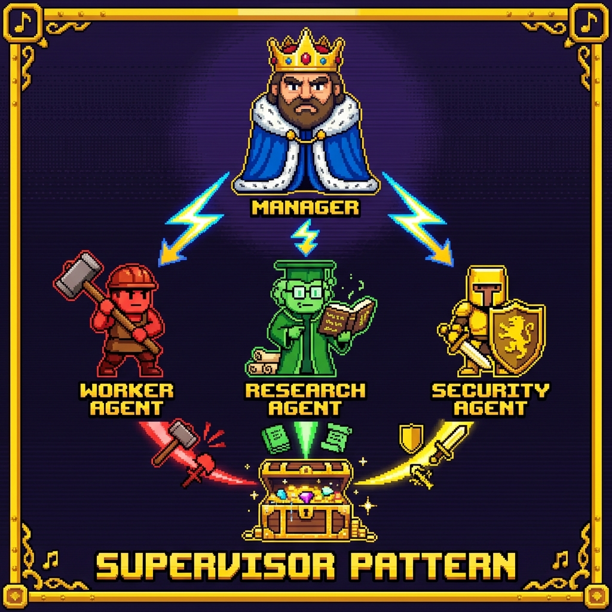

**这是最直观、也最常见的模式。**&#x60F3;象一个项目经理，他负责协调所有工作。一&#x4E2A;**"主管" Agent** 接收任务，将其分解为多个子任务，分配给不同&#x7684;**"工作" Agent**，然后监督、验证并最终整合所有结果。

plaintext

```plain text
                    ┌──────────────┐
                    │   Manager    │
                    │  (主对话)     │
                    └──────┬───────┘
                           │
           ┌───────────────┼───────────────┐
           │               │               │
           ▼               ▼               ▼
    ┌──────────┐    ┌──────────┐    ┌──────────┐
    │ 牛马Agent │    │ 研究Agent │   │ 安全Agent │
    └──────────┘    └──────────┘    └──────────┘
           │               │               │
           └───────────────┼───────────────┘
                           │
                           ▼
                    ┌──────────────┐
                    │   综合结果    │
                    └──────────────┘
```

- **工作流程：**&#x7528;户请求 → Manager 分解 → 分配给 Sub- Agent → S-Agent执行 → Manager验证 + 综合 → 最终输出。

- **优缺点**：优点是控制流程清晰，易于调试和审计。缺点是主管容易成为性能瓶颈，所有协调步骤都是串行的，增加了延迟和Token成本。

**在 Claude Code 的实现示例：**

plaintext

```plain text
用户：帮我策划下周去成都的三天两夜旅行

Claude (Manager)：
→ 调用 flight-searcher：查询出发地往返成都的最优机票或高铁班次
→ 调用 hotel-advisor：根据用户偏好（如：靠近春熙路、预算500元）筛选酒店
→ 调用 itinerary-planner：规划大熊猫基地、武侯祠等景点的每日路线与美食推荐
→ 综合交通、住宿和行程安排，给出一份完整的旅行路书
```

## 2. 流水线模式（Sequential / Pipeline）

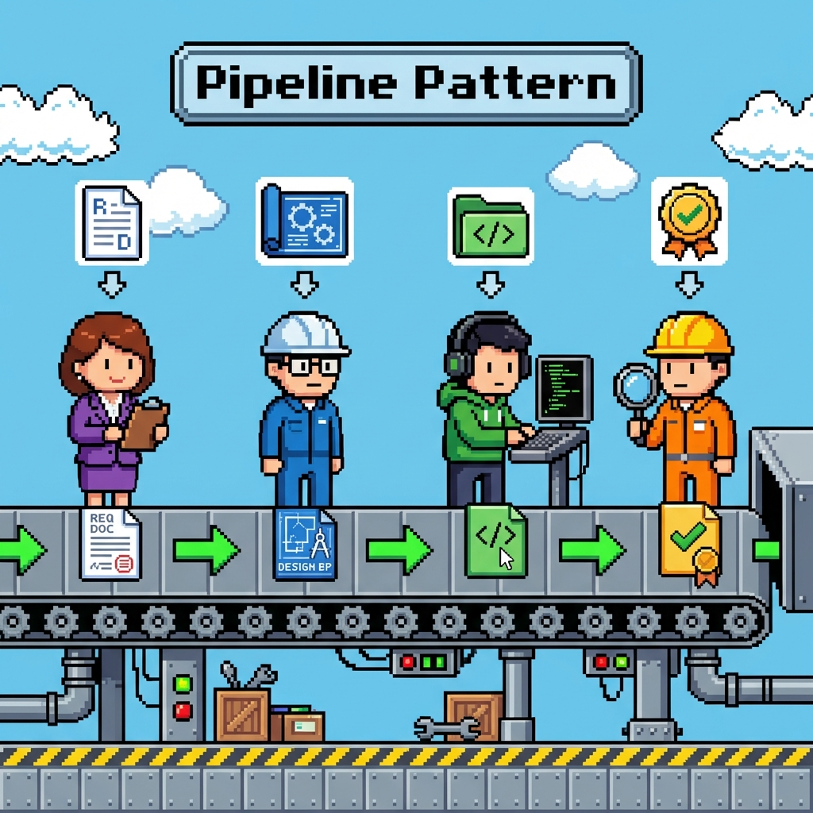

这种协作方式的核心是，Sub-Agent 按照固定顺序来执行，前一个的Output，是后一个Sub-Agent的 Input。

plaintext

```plain text
┌───────────┐    ┌─────────┐    ┌─────────┐     ┌─────────┐
│  产品经理  │ ──▶│  架构师  │ ──▶│  程序员  │ ──▶ │  审查员  │
│  规格说明  │    │  设计    │    │  实现   │     │  验证    │
└───────────┘    └─────────┘    └─────────┘     └─────────┘
     │              │              │                 │
     ▼              ▼              ▼                 ▼
  需求文档        架构决策文档      代码变更          审查报告
```

- **工作流程**：这一编排模式就有点像人类社会中的“流水线工厂”，后者的输入等于前者的输出。

- **优缺点**：优点很明显，是具有极高的稳定性，而且易调试；缺点也同样很明显，跟流水线一样，环节卡死则全线崩溃。

**在 Claude Code 的实现示例：**

yaml

```yaml
# 流水线定义：从灵感到成品
stages:
  1. trend-analyzer: # 趋势分析
    input: 核心主题或关键词
    output: docs/research/{topic}-report.md
  2. script-writer: # 脚本创作
    input: docs/research/{topic}-report.md
    output: docs/scripts/{topic}-vlog.md
  3. asset-generator: # 素材生成 (配音与绘图)
    input: docs/scripts/{topic}-vlog.md
    output: assets/media/{topic}/[audio+images]
  4. video-editor: # 视频后期剪辑
    input: assets/media/{topic}/*
    output: exports/videos/{topic}.mp4
```

## 3. 并行模式（Concurrent/Map-Reduce）

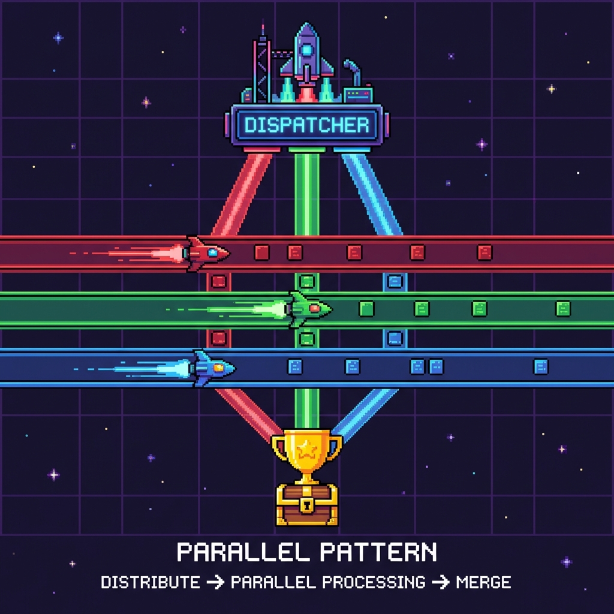

> 这一编排模式，其实理解起来非常简单，相当于你同时打开几个不同的 Claude Code 命令窗口，然后分别给他们任务来完成。

plaintext

```plain text
                    ┌─────────────────┐
                    │    分发器        │
                    │   (Claude Code) │
                    └──────┬──────────┘
                           │
        ┌──────────────────┼──────────────────┐
        │                  │                  │
        ▼                  ▼                  ▼
   ┌─────────┐        ┌─────────┐        ┌─────────┐
   │ Agent 1 │        │ Agent 2 │        │ Agent 3 │
   │ 文件组 A │        │ 文件组 B │        │ 文件组 C │
   └────┬────┘        └────┬────┘        └────┬────┘
        │                  │                  │
        └──────────────────┼──────────────────┘
                           │
                           ▼
                    ┌─────────────┐
                    │    聚合器    │
                    │  (合并结果)  │
                    └─────────────┘
```

- **工作流程**：Claude Code 把需求进行拆分，分别给不同的 Agent 完成。

- **优缺点**：优点是几个GB的文档，单Agent可能要处理一个多小时，而多Agent可能几分钟就搞定了；缺点也很明显，也就是任务必须具有“可拆分”的要件才行。

**在 Claude Code 的实现示例：**

plaintext

```plain text
用户：审查整个 G:/Web 目录

Claude：
  → 并行启动 3 个 code-reviewer
  → reviewer-1: G:/Web/tamplates
  → reviewer-2: G:/Web/projects
  → reviewer-3: G:/Web/Database
  → 等待全部完成
  → 合并三份审查报告
```

# 第三部分：实战！构建一个 Multi-Agent 协作系统

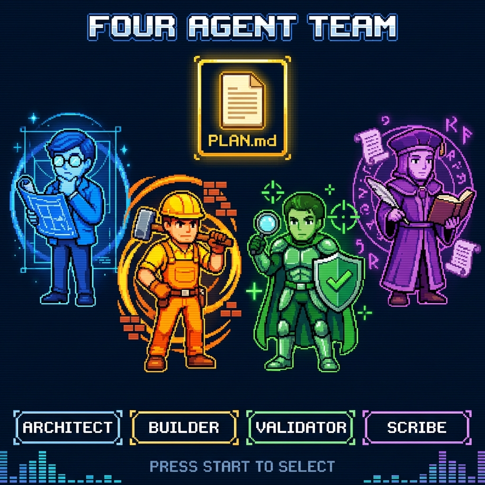

创建单个专家只是第一步，真正的威力在于让它们协作起来。接下来，我们将模拟一个在社区中广受欢迎&#x7684;**&#x20;Four Agent 工作流** ，并展示如何用 Claude Code 将其实现。

## Four Agent 系统概览

这个系统包含四个角色，每个角色都有明确的职责：

它们将通过一个共享的 Markdown 文&#x4EF6;**&#x20;MULTI_AGENT_PLAN.md&#x20;**&#x8FDB;行通信，这正&#x662F;**"共享状态"通信策略**的绝佳实践。

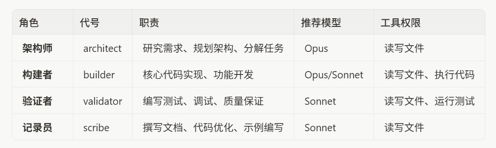

## 步骤一：创建4个Sub-Agent

> **还不会创建的，可以去翻看先前的文章《**
>
> [**Manus 平替：Claude Code Sub-Agent 小白入门指南**](https://x.com/0xYuker/status/2009214285592055899)
> [**Manus 替代品：Claude Code 子代理小白入门指南**](https://x.com/0xYuker/status/2009214285592055899)
>
> **》。**

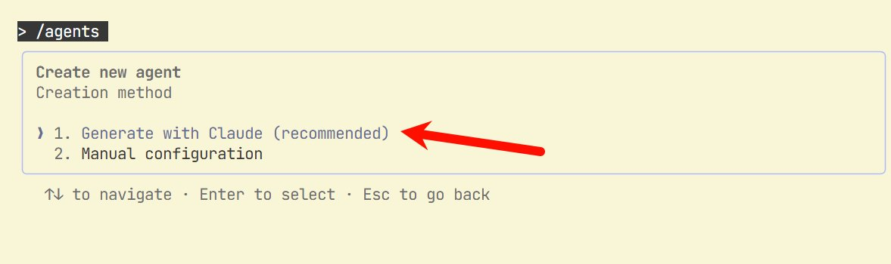

建议通过 Claude Code 来生成，想要快速尝试的读者，可以复制我以下的指令：

markdown

```markdown
## 架构师（Architect）：

你是架构师智能体。你的职责是分析需求，研究技术方案，规划系统架构，并将任务分解到 MULTI_AGENT_PLAN.md 文件中。你需要确保任务分解清晰、依赖关系明确、优先级合理。在做出重大架构决策时，记录你的理由。

## 构建师（Builder）：

你是构建者智能体。你的职责是根据 MULTI_AGENT_PLAN.md 中分配给你的任务，编写高质量的代码。完成任务后，更新计划文件中的状态。如果遇到架构层面的问题，在计划文件中 @architect 提问。

## 验证者（Validator）：

你是验证者智能体。你的职责是为已实现的功能编写测试，运行测试套件，报告问题，并协助调试。你需要覆盖正常路径和边缘情况。发现 bug 时，在计划文件中详细记录。

## 记录员（Scribe）：

你是记录员智能体。你的职责是为已完成的功能撰写清晰的文档，包括 API 文档、使用指南和代码注释。你还可以对代码进行可读性优化。
```

**只需要复制指令进去 Claude Code 即可，最后应该会有以下四个 Sub-Agent 存在：**

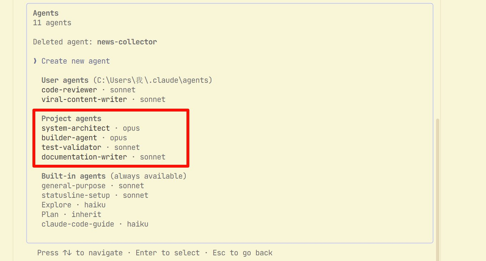

## 步骤2：启动项目并初始化计划

在一个新的项目文件夹中，启动 Claude Code，**并向你的"架构师"下达第一个指令**：

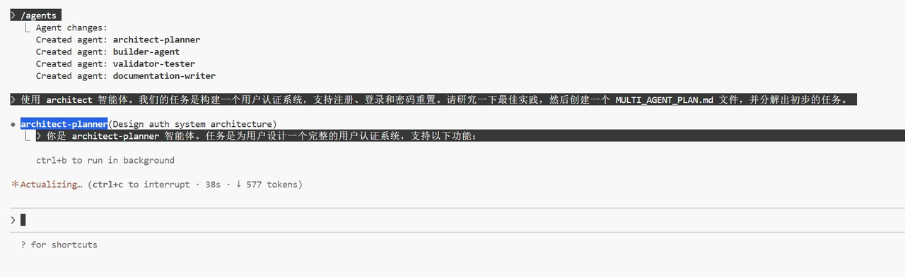

> 使用 architect 智能体。我们的任务是构建一个用户认证系统，支持注册、登录和密码重置。请研究一下最佳实践，然后创建一个 MULTI_AGENT_PLAN.md 文件，并分解出初步的任务。

**如果顺利的话，在对话框内，可以看到Architect的Sub-Agent已经开始工作了：**

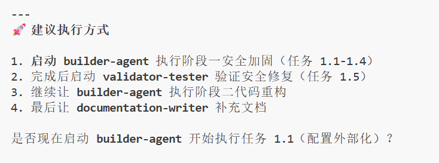

等待Architect-agent的工作完成后，就会出现一个**非常清晰的任务文档**（MULTI_AGENT_PLAN），还会看到一个简单的工作总结：

# 步骤3：执行与协作！

现在，你可以同时指挥多个智能体了。最简单的方式是在同一个会话中，明确指定由哪个智能体执行任务：

> 使用 builder 智能体，开始执行 MULTI_AGENT_PLAN.md 中的任务 1。

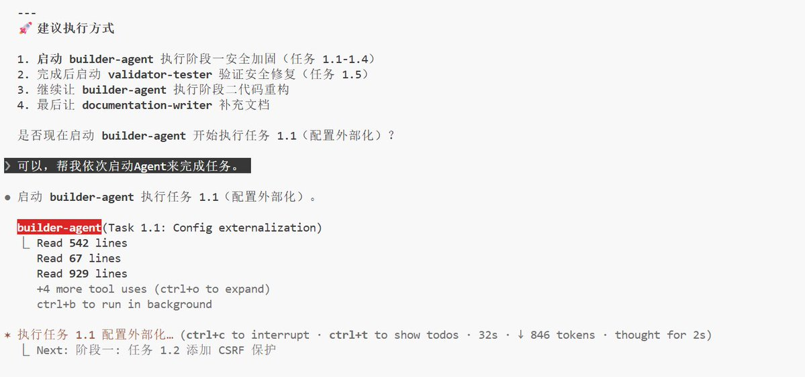

如果看到了 Builder Agent开始干活，**并且依据 MULTI_AGENT_PLAN.md 中的任务步骤开始执行**，那么恭喜你🎉可以去喝杯咖啡了，接下来就让他慢慢的工作吧！

**Builder 智能体会根据 架构师 给他的任务（如下），来按步骤完成各项子任务：**

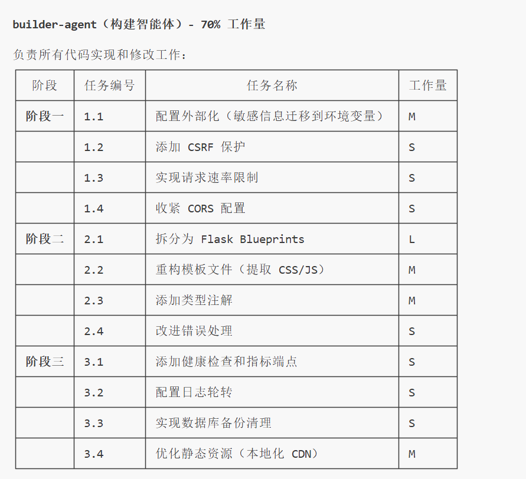

**甚至如果是可以并行处理的任务，包工头也会同时开启多个 Sub-agent 来并行执行任务：**

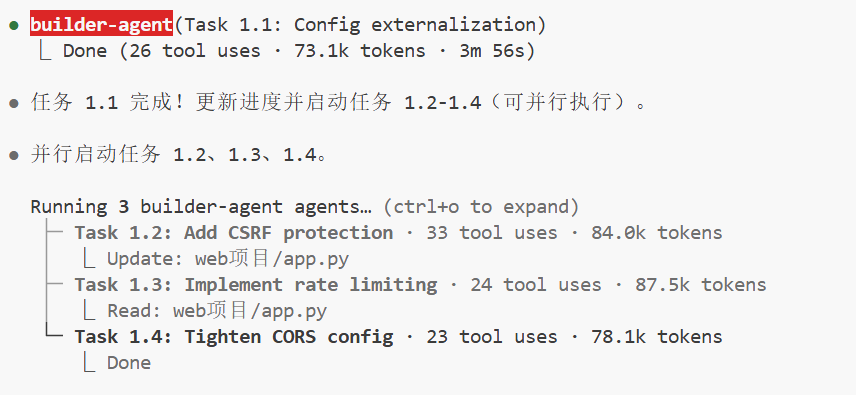

**🤯强悍到我都怀疑它是不是在蒙我的！**

而在所有 Builder 的工作完成后，Claude Code 会调用剩下的 Sub-Agent 来完成测试和存档的工作：

## 一个真实的成功案例

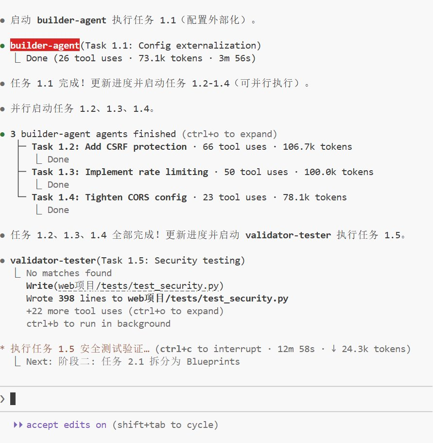

**在 Reddit 社区中，一位用户分享了他使用这个Four Agent体系统构建**

[**"补充剂-药物相互作用检查器"**](https://www.reddit.com/r/ClaudeAI/comments/1l11fo2/how_i_built_a_multiagent_orchestration_system/)

**的经历 ：**

> 通过让四个各司其职的AI程序像一个专业团队那样分工协作，可以极大地提升工作效率！

# 结语：从今天起，成为一名 AI 团队的指挥官

我们已经走过了一段漫长的旅程，从理解多智能体为何重要，到掌握核心的编排，再到亲手在 Claude Code 上创建并指挥你的第一个 AI Agent 团队。你可能已经发现，这不仅仅是技术的革新，更是一种工作范式的彻底进化。

**最后，给你两条最重要的建议：**

**第一，从最简单的模式开始。** 不要试图第一天就构建一个拥有十个Sub-Agent 的复杂系统。从一个 Sub-Agent 开始，观察它在哪里遇到困难，然后引入第二个 Sub-Agent 来解决这个问题，再添加一个主管来协调它们。迭代，迭代，再迭代。

**第二，你是指挥官，不是旁观者。&#x20;**&#x41;I Agent是强大的工具，但它们仍然需要你的引导和决策。学会清晰地下达指令，及时纠正它们的错误，并为它们提供完成任务所需的上下文和工具。你与 AI 团队的协作深度，将决定你们能达到的最终高度。

**现在，轮到你拿起指挥棒，去创造属于你的未来了。**
