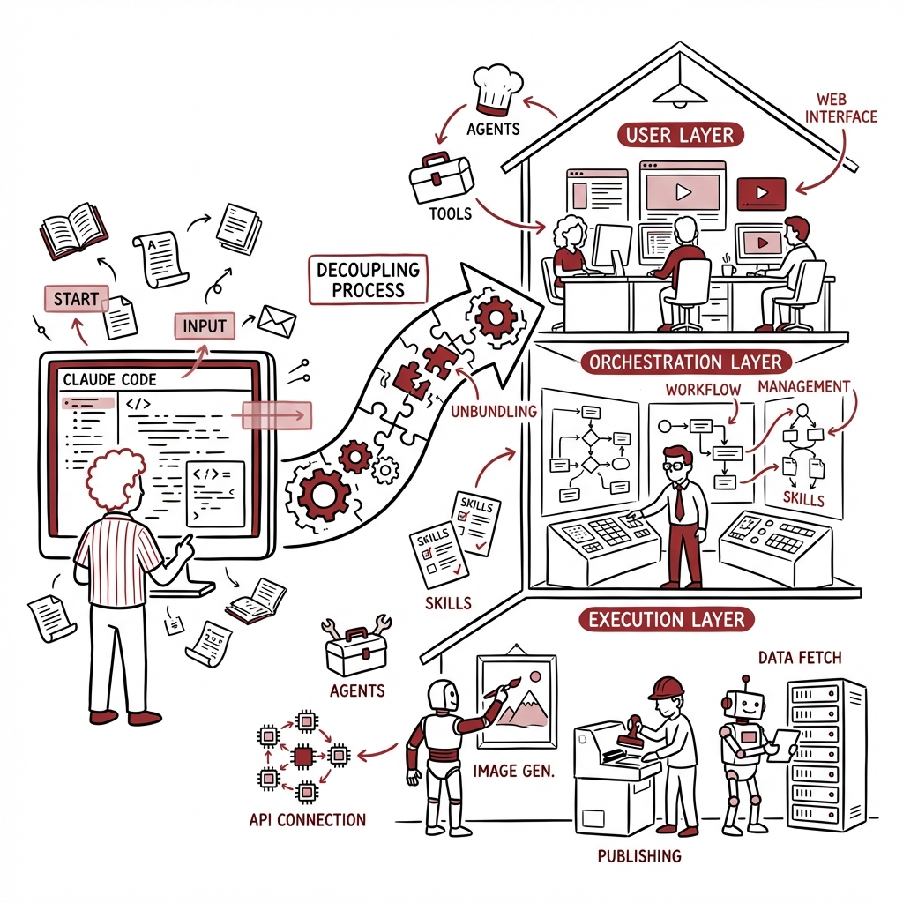
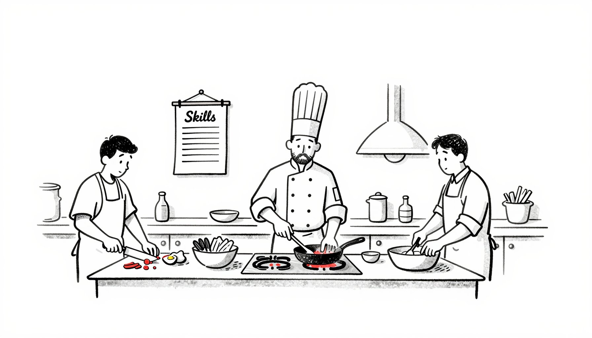
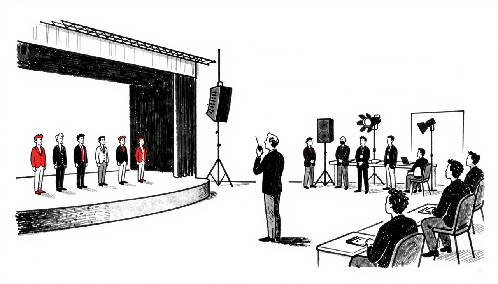
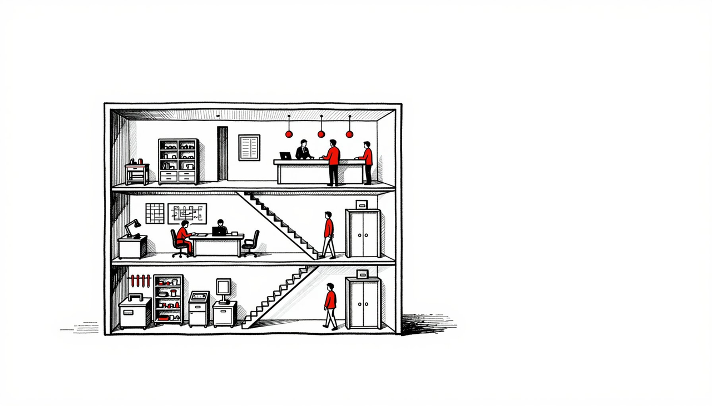
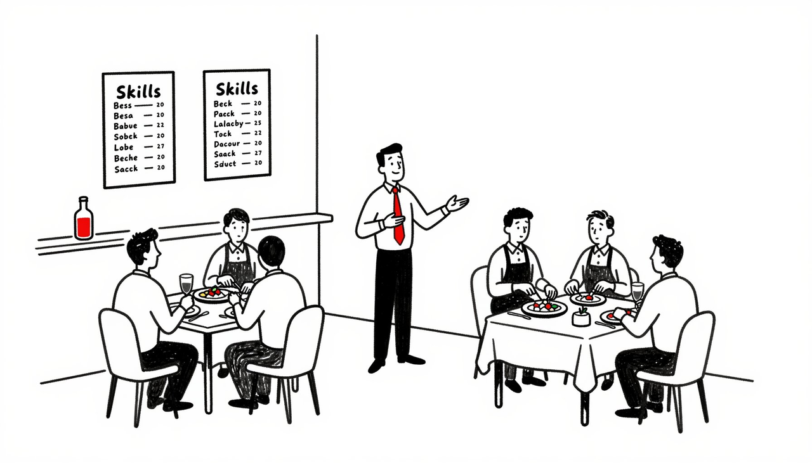
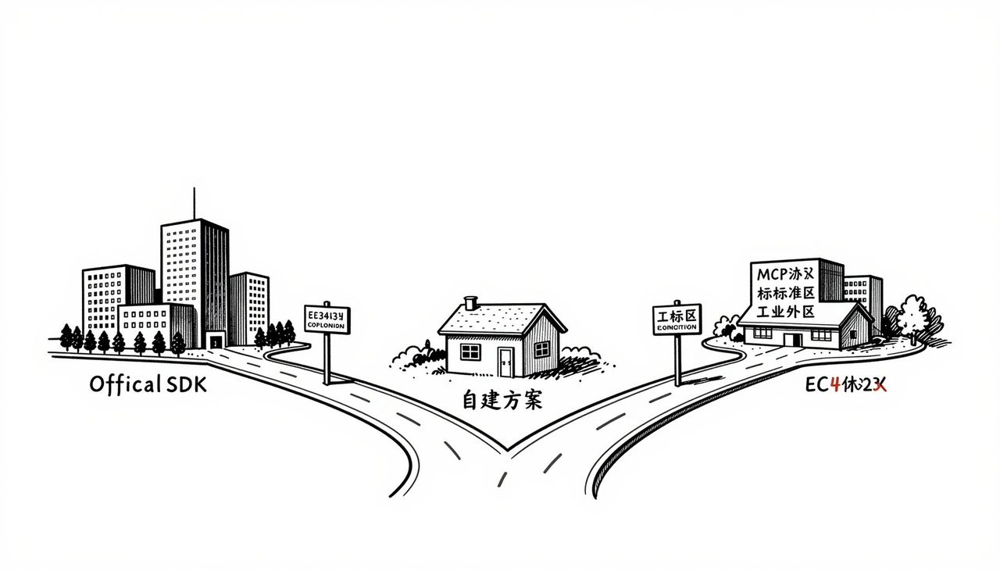
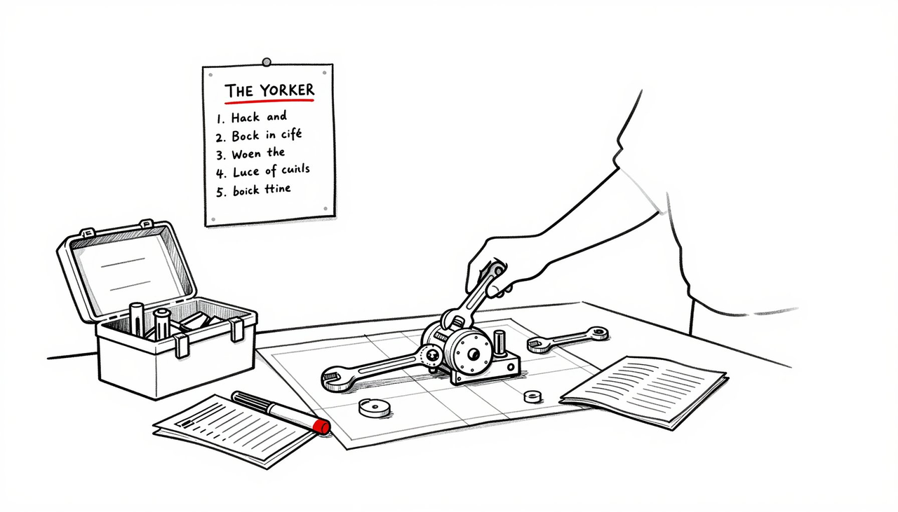

> **从 Claude Code 到 Web API 的解耦之旅**：左侧是我们熟悉的 Claude Code 环境——Skills、Agents、Subagents 在这里天衣无缝地协作。中间是解耦过程——将这些能力从封闭环境中"拆解"出来。右侧是目标架构——一个标准的三层体系：用户通过 Web 界面发起请求（用户层），主 Agent 根据 Skills 编排决策（编排层），Subagents 和 Tools 执行具体任务（执行层）。这篇文章将带你理解这个架构，并给出可落地的解耦方案。

# 第一部分：开篇

我在 Claude Code 中构建了一套完整的内容创作工具链：写文章、生成配图、制作播客、抓取网页内容、生成绘图提示词，甚至一键发布到公众号。这些 skills 在 Claude Code 环境中配合得天衣无缝——我只需要用自然语言描述需求，它们就能自动协同工作。

但这套能力有个致命局限：**它只能在我的 Claude Code 环境中运行**。我不可能让每个想用这些功能的人都去安装 Claude Code、配置 skills、学习命令行操作。更重要的是，如果我想实现自动化——比如定时抓取内容、批量生成文章、自动发布——总不能一直守着 Claude Code 手动操作吧？

真正的需求是：**让这些能力可以通过 Web 界面访问，可以通过 API 被其他系统调用，可以自动化运行，可以开放给更多人使用**。

这篇文章就是要解决这个问题。我会先带你理解 Claude Code 的 SDK 体系——Skills、Agents、Subagents 的本质和协作方式，然后给出具体可行的解耦方案，让你也能把自己的 skills 从 Claude Code 中解放出来，真正实现自动化和开放使用。

## 第二部分：理解 Claude Code 体系

Skills、Agents、Subagents 是什么？

要解耦 skills，首先要理解它们的本质。我用一个做菜的比喻来解释：

**Skills（技能）就像菜谱**。比如我用的 brainstorming skill，就像一份”头脑风暴菜谱”，上面写着：什么时候用这个菜谱（开始做新功能前）、具体步骤是什么（先问一个问题、再提几个方案、最后分段呈现设计）。重点是：Skills 不是代码，而是一份 Markdown 文档，就像菜谱是文字而不是食材。

举个实际例子：我的”写文章 skill”里写着：“先理解用户想写什么主题 → 问清楚目标读者是谁 → 提出 3 种文章结构 → 用户选择后，分段写作并逐段确认”。这就是一份”菜谱”。

**Agents（代理）就像请来的专业厨师**。比如 code-reviewer agent 就像一位专门负责品鉴的大厨，他有自己的评判标准、专业术语、沟通方式。你把做好的菜交给他，他会按照自己的专业标准给出反馈。Agent 和主 Claude 是分开的，就像主厨和品鉴师是两个人。

**Subagents（子代理）就像临时工**。比如你要做 10 道菜，每道菜都叫一个新的临时厨师来做，做完这道菜他就走了，下一道菜再叫一个新的。为什么这样？因为每个临时工只专注做一道菜，不会被之前的菜影响判断，也不会把上一道菜的调料带到下一道菜里。

**它们怎么配合？** 你（Claude Code 主实例）手里拿着菜谱（Skills），决定今天做什么菜。需要专业意见时，请来大厨（Agent）。需要批量做菜时，雇一堆临时工（Subagents），每人做一道。

## 第三部分：Claude Code 在背后做了什么？

为什么在 Claude Code 中”很简单”？

现在你可能会问：既然 Skills 只是 Markdown 文档，为什么它们在 Claude Code 中能自动工作，离开就不行了？

答案是：**Claude Code 在背后做了大量”脏活累活”**。

**第一件事：自动加载和触发**。你把 skill 文件放到 .claude/skills/ 目录，Claude Code 会自动扫描、解析、在合适的时机触发。就像你把菜谱放进菜谱架，厨房系统会自动识别”哦，今天要做新菜，应该先看看这份’准备工作菜谱’“。

举例：我的 brainstorming skill 文件开头写着 description: "You MUST use this before any creative work"，Claude Code 看到我要创建新功能，就自动把这份 skill 的内容注入到对话中。我不需要手动说”请使用 brainstorming skill”。

**第二件事：提供工具箱**。Claude Code 内置了一堆工具：读文件（Read）、写文件（Edit）、执行命令（Execute）、搜索代码（Grep）等等。我的”发布公众号 skill”能工作，是因为它可以调用这些工具——读取文章内容、调用发布 API、保存结果。

**第三件事：管理上下文**。所有 skills 共享同一个”工作台”：同样的文件系统、同样的 git 仓库、同样的对话历史。我的”写文章 skill”生成的内容，“生成配图 skill”可以直接读取，“发布公众号 skill”可以直接使用。就像所有厨师在同一个厨房工作，食材、调料、工具都共享。

## 第四部分：Claude Agent SDK 架构深度解析

Claude Agent SDK 是什么？

Claude Agent SDK 是 Anthropic 官方提供的 Agent 开发框架。它的核心理念很简单：**给 Claude 一台计算机**。

什么意思？就像程序员工作需要终端、文件系统、代码编辑器，Claude 也需要这些工具才能真正”干活”。SDK 就是提供这些能力的框架。

三层分工：谁负责什么？

整个系统分三层，每层干不同的事：

**第一层：用户层** - 这是你和系统交互的地方。可以是网页、可以是 API、可以是命令行。你在这里提需求，系统在这里给你结果。

**第二层：编排层** - 这是”大脑”。主 Agent 在这里工作，它的任务是：听懂你要什么、决定该调用哪些 skills、协调它们的执行顺序、管理整个过程的上下文（记住之前发生了什么）。Skills 也在这一层，它们是”工作手册”，告诉 Agent 该怎么做事。

**第三层：执行层** - 这是”手脚”。Subagents 在这里干具体的活：写文件、调用 API、生成图片、发布内容。Tools（工具函数）也在这里，它们是具体的能力。还有文件系统，作为工作空间存放中间结果。

**简单说**：用户层接需求，编排层做决策，执行层干活。就像你去餐厅点菜（用户层），经理安排厨师和流程（编排层），厨师做菜（执行层）。

## 第五部分：Skills、Agents、Subagents 的分工

为什么需要三个角色？

在 Claude Agent SDK 中，Skills、Agents、Subagents 各司其职，缺一不可。让我用一个完整的例子来说明。

**场景：你要写一篇文章并发布到公众号**

Skills：工作流程的定义者

Skills 是”剧本”，定义了整个工作应该怎么做。

比如你有一个”内容创作 skill”，它的剧本是这样的：

1. 先问用户：写什么主题？目标读者是谁？

2. 提出 3 种文章结构让用户选择

3. 分段写作，每段写完确认一次

4. 文章完成后，生成配图

5. 最后发布到公众号

**Skills 不干活，它只告诉 Agent”该做什么、按什么顺序做”**。就像菜谱告诉你先切菜、再炒菜、最后装盘，但菜谱本身不会动手。

Agent：决策和调度者

Agent 是”项目经理”，它拿着 Skills 这份剧本，负责执行和调度。

当你说”我要写一篇关于 AI 的文章”，主 Agent 会：

1. 理解你的需求

2. 找到”内容创作 skill”这份剧本

3. 按照剧本的步骤，开始工作

4. 决定什么时候该派发 Subagent 去干具体的活

5. 收集所有结果，最终交付给你

**Agent 做决策，但不亲自干重活**。就像项目经理规划任务、分配工作，但不会自己去写代码。

Subagents：具体任务的执行者

Subagents 是”临时工”，专门负责某一个具体任务。

在这个例子中，主 Agent 会派发多个 Subagents：

- **写作 Subagent**：负责写文章的某一段

- **配图 Subagent**：负责调用图片生成 API，生成配图

- **发布 Subagent**：负责调用公众号 API，完成发布

每个 Subagent 只关注自己的任务，完成后就消失。**为什么要这样？因为上下文隔离**。写作 Subagent 不需要知道配图的细节，配图 Subagent 不需要知道发布的逻辑。这样每个任务都是”干净”的，不会互相干扰。

三者的协作关系

**Skills 定义流程 → Agent 执行调度 → Subagents 完成任务**

用餐厅的例子：

- Skills = 菜谱（定义做菜流程）

- Agent = 主厨/经理（看菜谱、分配任务、协调流程）

- Subagents = 切菜工、炒菜工、装盘工（各干各的活）

**关键点**：这种分工让系统既灵活又可控。你可以随时修改 Skills（换菜谱），Agent 会按新流程执行。你可以增加新的 Tools 给 Subagents 用（添加新厨具）。整个系统是模块化的。

## 第六部分：解耦的挑战

离开 Claude Code 后，你需要自己做什么？

现在问题来了：如果你想把 skills 搬到 Web 或 API 环境，**Claude Code 帮你做的那些事，你都得自己做**。

具体来说四件事：

1. **Skill 加载和触发** - 读取 skill 文件，判断什么时候用哪个 skill

2. **工具函数** - 实现图片生成、公众号发布等具体功能

3. **上下文管理** - 让不同 skills 之间能传递数据和结果

4. **Agent 管理** - 派发和协调多个 AI 实例

听起来很复杂？确实如此。但好消息是：**有办法解决**。

## 第七部分：从架构看解耦方案

现在问题就清晰了

理解了 Claude Agent SDK 的架构和分工，“如何解耦”的答案就呼之欲出了。

**在 Claude Code 中**，这三层都是现成的：

- Skills 自动加载

- 主 Agent 就是 Claude Code 本身

- Subagents 可以随时派发

- 工具、文件系统、上下文管理都内置好了

**要解耦，就是要把这三层”搬出来”，在 Web/API 环境中重建**。

解耦的核心：重建编排层

关键在于**编排层**。执行层相对简单（调用 API、操作文件），用户层也好办（做个网页或 API 接口）。难的是编排层：如何让主 Agent 理解需求、选择 skills、协调执行？

**有三种方案：**

方案一：直接使用 Claude Agent SDK

最直接的方式：用 Anthropic 官方的 Agent SDK 来构建你的系统。

- 把你的 skills 改造成 SDK 能识别的格式

- 用 SDK 提供的 Agent 作为编排层

- 你的工具（生成图片、发布公众号）封装成 Tools 或 MCP Server

- 通过 API 或 Web 界面暴露给用户

**优点**：官方支持，功能完整，有 Subagents、上下文管理、工具调用等能力。 **缺点**：需要学习 SDK 的使用方式，有一定改造成本。

**适合场景**：skills 已经很成熟，想快速上线，追求长期稳定。

方案二：自建轻量级编排层

如果你的 skills 不太复杂，可以自己实现一个简化版的编排层。

- 用 Anthropic API 创建主 Agent

- 通过精心设计的 prompt，让它理解你的 skills 体系

- 主 Agent 根据用户需求，决定调用哪些工具（你的 skills）

- 工具调用通过 Anthropic 的 tool use 功能实现

**优点**：轻量、灵活、完全可控。 **缺点**：需要自己处理上下文管理、错误处理、Subagent 派发等复杂逻辑。

**适合场景**：快速验证想法，skills 还在迭代，需要高度灵活性。

方案三：基于 MCP 协议

把你的每个 skill 封装成独立的 MCP Server，用支持 MCP 的 Agent 来调用。

- 每个 skill 是一个 MCP Server（标准化接口）

- 主 Agent 通过 MCP 协议调用这些 skills

- 可以和其他支持 MCP 的系统互通

**优点**：标准化、可复用、生态丰富。 **缺点**：需要运行多个服务进程，架构相对重。

**适合场景**：构建开放生态，让其他人也能用你的 skills，追求标准化。

## 第八部分：方案一实施细节

第一步：理解你的 Skills 需要改造什么

你现在的 skills 是为 Claude Code 设计的 Markdown 文件。要用 Agent SDK，需要把它们转换成 SDK 能理解的格式。

**改造重点：**

1. **Skills 变成 System Prompt**：你的 skill 文件内容会成为 Agent 的 system prompt 的一部分，告诉 Agent 该如何工作。

2. **工具函数变成 Tools**：你的”生成图片”、“发布公众号”等能力，需要封装成 SDK 的 Tools 格式，让 Agent 可以调用。

3. **触发逻辑变成编排逻辑**：原来 Claude Code 自动触发 skills，现在你需要在主 Agent 的 prompt 中定义”什么情况下用哪个 skill”。

第二步：搭建基础架构

**你需要准备的环境：**

- 安装 Claude Agent SDK（Python 版本）

- 准备一个工作目录（作为 Agent 的文件系统）

- 配置 Anthropic API Key

- 搭建 Web 服务（如 FastAPI）作为用户接口

**核心组件：**

1. **主 Agent**：负责理解用户需求、选择 skills、协调执行

2. **Tools 注册表**：存放所有的工具函数（生成图片、发布公众号等）

3. **Skills 加载器**：读取你的 skill 文件，转换成 prompt

4. **上下文管理器**：保存对话历史和中间结果

第三步：改造你的 Skills

**原来的 skill 文件（Markdown）：**

---

name: article-writer

description: 帮助用户写文章

---

# 写文章流程

1. 询问主题和目标读者

2. 提出 3 种结构

3) 分段写作并确认

**改造后（作为 System Prompt 的一部分）：**

你需要把这个内容整合到主 Agent 的 system prompt 中，告诉它：“当用户要写文章时，按照这个流程工作”。

同时，把”生成图片”、“发布公众号”等操作封装成 Tools，让 Agent 可以调用。

第四步：封装工具函数

**你的每个能力都要变成一个 Tool：**

- **generate_image**：调用图片生成 API

- **publish_to_wechat**：调用公众号 API

- **fetch_url_content**：抓取网页内容

- **create_podcast**：生成播客

**Tool 的定义包括：**

- 名称和描述（让 Agent 知道这个工具是干什么的）

- 输入参数（需要什么信息）

- 执行逻辑（实际调用你的 API）

第五步：实现编排逻辑

**主 Agent 的核心 Prompt 设计：**

你需要告诉主 Agent：

- 你有哪些 skills 可用（写文章、生成图片、发布公众号等）

- 每个 skill 的使用场景和流程

- 如何组合使用这些 skills（比如：写完文章 → 生成配图 → 发布）

- 什么时候需要派发 Subagent

**关键点**：主 Agent 要能理解用户的意图，自动选择合适的 skills 组合。

第六步：处理 Subagents

**什么时候用 Subagent？**

- 任务可以并行（比如同时生成多张配图）

- 任务需要独立上下文（比如每篇文章的写作过程互不干扰）

- 任务需要专门的角色（比如专门的审稿 Subagent）

**如何派发：**

Agent SDK 支持创建 Subagent，你只需要定义 Subagent 的角色和任务，SDK 会处理上下文隔离和结果收集。

第七步：暴露 Web/API 接口

**用户通过 Web 或 API 访问：**

- 用户发送请求：“帮我写一篇关于 AI 的文章并发布到公众号”

- 你的 Web 服务接收请求，传递给主 Agent

- 主 Agent 执行整个流程（调用 skills、派发 Subagents、使用 Tools）

- 返回结果给用户

**关键点**：你需要管理会话状态，让用户可以多轮对话（比如 Agent 问”目标读者是谁”，用户回答后继续）。

实施难点和注意事项

**难点一：上下文管理**

- 多个 skills 之间如何传递数据？用文件系统作为中转。

- 对话历史如何保存？用 SDK 的上下文管理功能。

**难点二：错误处理**

- 工具调用失败怎么办？让 Agent 有重试和降级策略。

- Subagent 出错怎么办？主 Agent 需要能检测和处理。

**难点三：成本控制**

- 每次调用都会消耗 tokens，需要优化 prompt 长度。

- 使用 SDK 的 compact 功能，自动压缩历史对话。

## 第九部分：总结

从困惑到清晰

这篇文章从一个实际困惑出发：我在 Claude Code 中构建了丰富的 skills 生态，但如何让它们脱离 Claude Code 环境，实现自动化和开放使用？

答案的关键在于理解 Claude Agent SDK 的架构：

**三层架构**：用户层接收需求，编排层做决策，执行层干活。

**三个角色**：Skills 定义流程，Agent 执行调度，Subagents 完成任务。

理解了这些，解耦的路径就清晰了：**重建编排层，让主 Agent 能够在 Web/API 环境中调度你的 skills**。

三种方案的选择

**方案一（Claude Agent SDK）**：适合 skills 成熟、追求稳定的场景。改造成本有，但长期最可靠。

**方案二（自建轻量级）**：适合快速验证、灵活迭代的场景。开发自由度高，但需要自己处理复杂逻辑。

**方案三（MCP 协议）**：适合构建开放生态、追求标准化的场景。未来趋势，但架构相对重。

核心要点

无论选择哪种方案，核心都是：

1. **Skills 是知识**：定义工作流程和最佳实践

2. **Agent 是大脑**：理解需求、做决策、协调资源

3. **Tools 是手脚**：执行具体操作

4. **编排层是关键**：这是从 Claude Code 解耦的核心挑战
