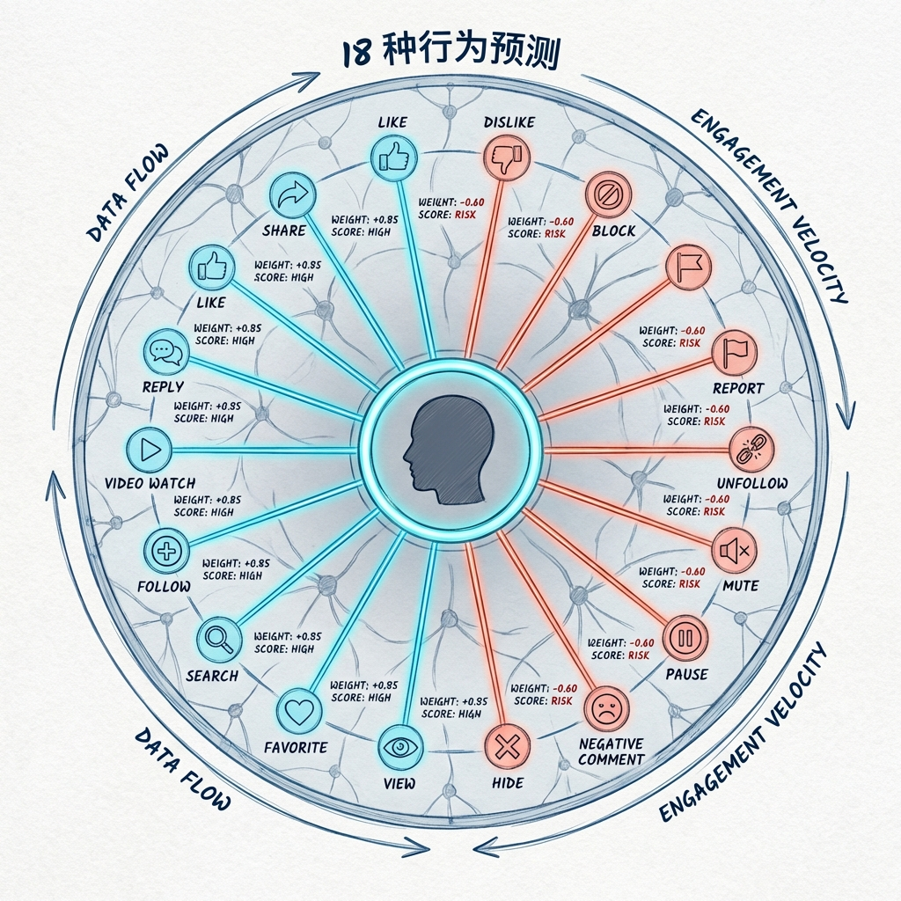
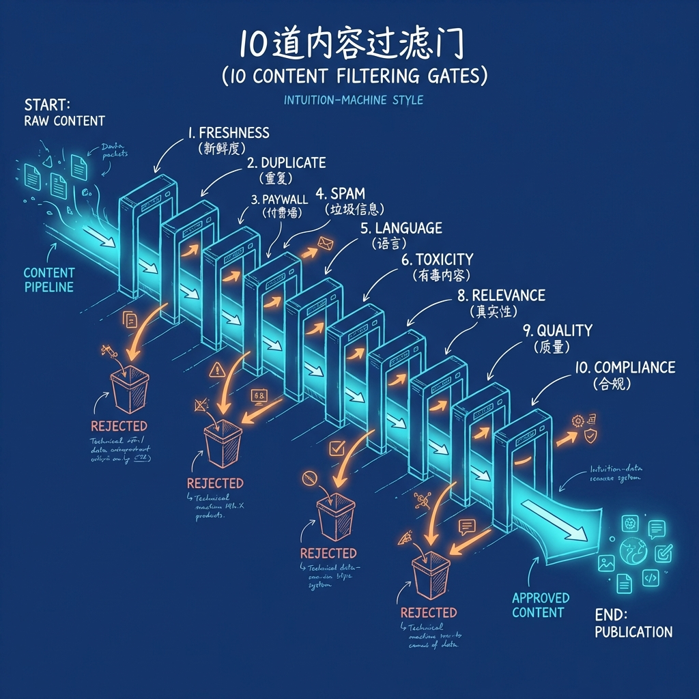
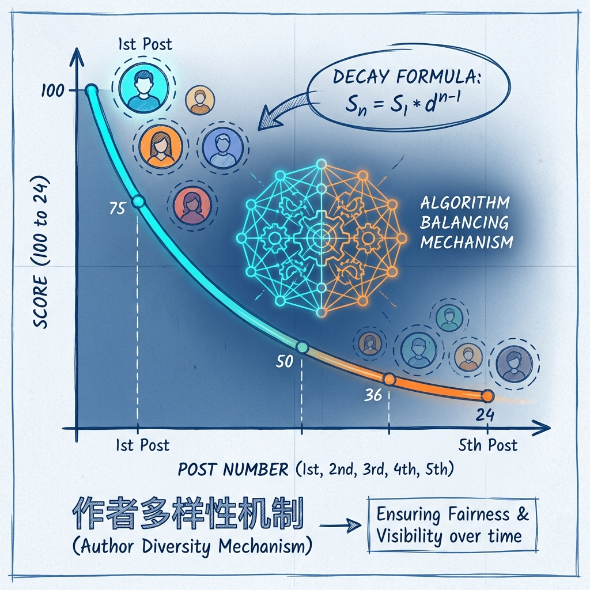
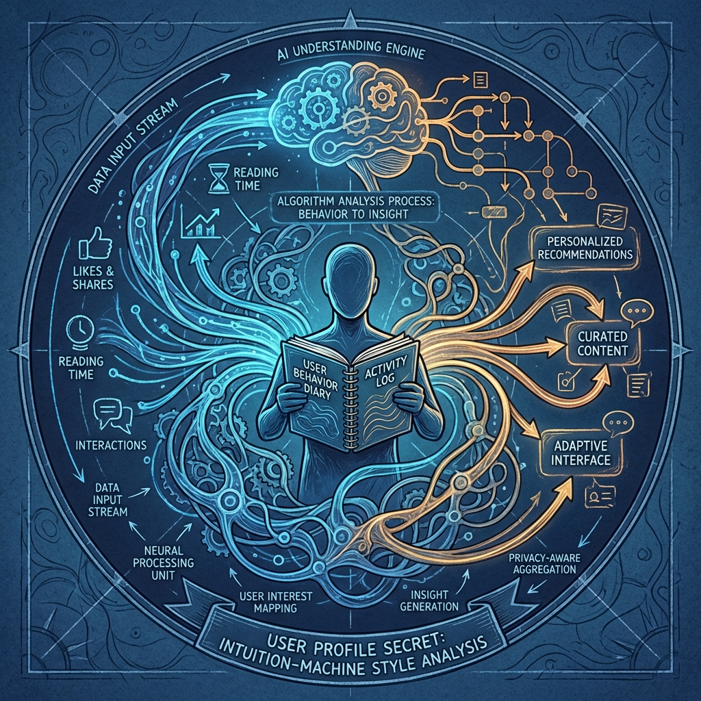
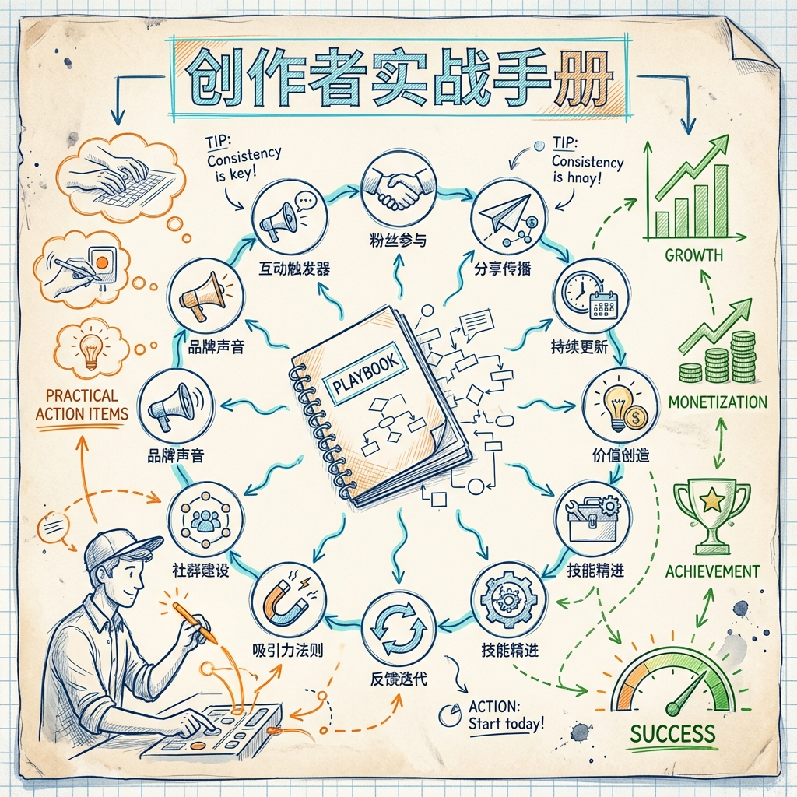
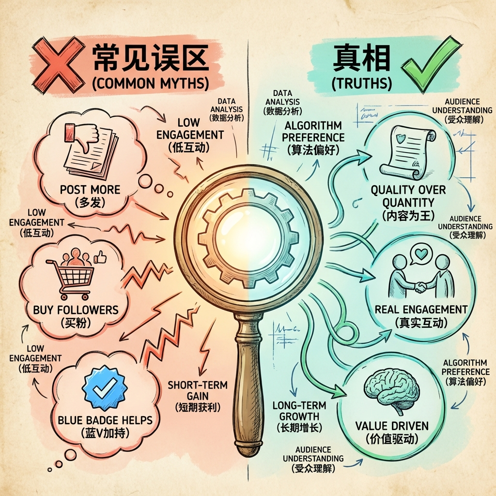
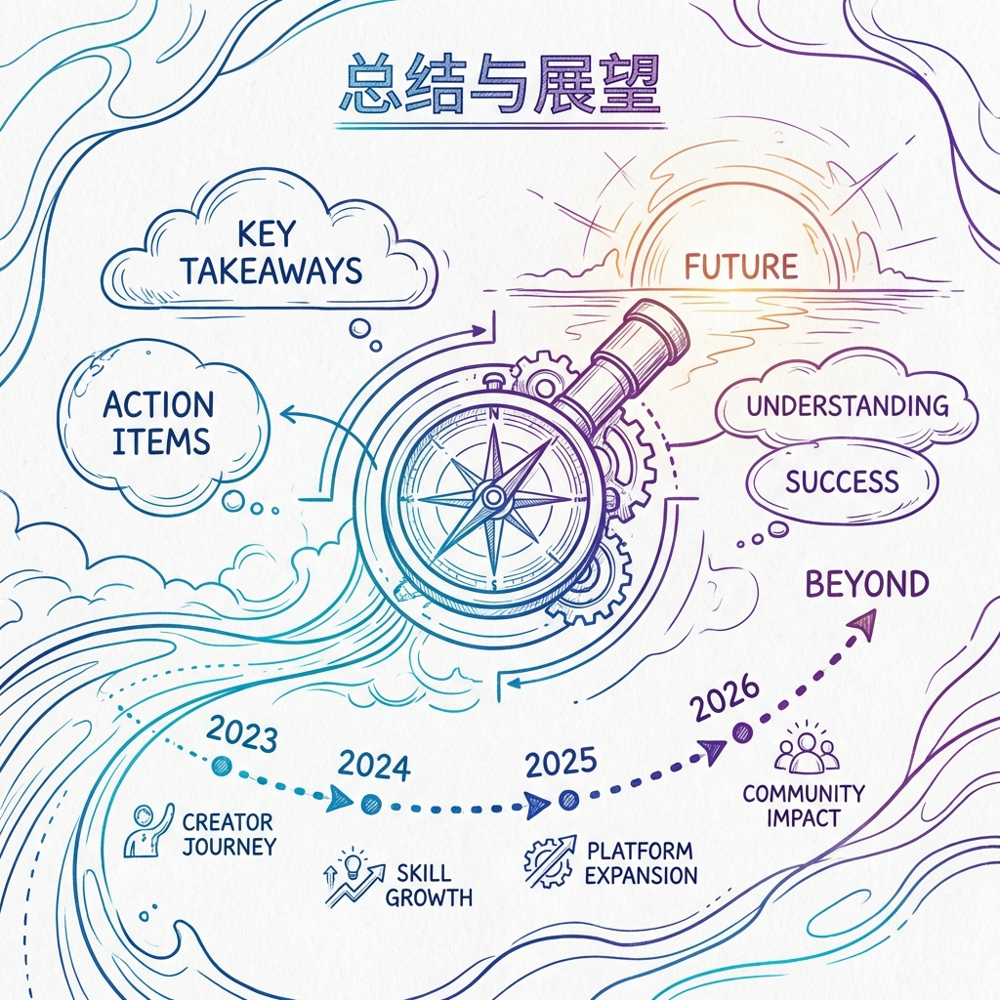

> xai-org/x-algorithm 开源代码的独家深度分析，2026 年 1 月 20 日 14:56

做 X（原 Twitter）的朋友，肯定都琢磨过这几个问题：

为什么有些帖子莫名其妙就火了，有些明明写得更用心反而没人看？别人能上热门，我发差不多的内容就是不行？算法到底在搞什么？

好消息来了——X 在 2026 年 1 月 20 日把推荐算法代码开源了。黑盒子终于能看了。

这篇文章用大白话带你看懂 X 的推荐逻辑，顺便给点能用的建议。不需要技术背景，保证你能看明白。

大致这么分：

- **第一部分** 3 分钟看懂 X 算法
- **第二部分** 18 种行为预测详解
- **第三部分** 10 道内容过滤门
- **第四部分** 作者多样性机制
- **第五部分** 关注流 vs 发现流
- **第六部分** 用户画像的秘密
- **第七部分** 创作者实战手册
- **第八部分** 常见误区与真相
- **第九部分** 总结与展望

说明一下：

1. 每章都配了插图，帮你理解
2. 重点内容我会加粗
3. 特别重要的会打个 ⚠️

看着挺多，读起来不累，往下拉吧。

## 第一部分：3 分钟看懂 X 算法

一句话说清楚：

> X 的推荐算法跟主流 AI 一样——看你过去喜欢什么、停了多久、分享给谁，猜你接下来想看什么。

你打开 "For You"（推荐页）的时候，它几毫秒内干了这几件事：

1. 翻你最近的行为（点赞了啥、看了多久、关注了谁）
2. 从海量内容里挑可能适合你的
3. 给每条内容打分
4. 把得分高的展示给你

跟以前完全不一样了。以前是人工定规则，不断调参优化。

现在变成了：

> 基于 Grok 大模型的推荐系统进行筛选。

### 算法的"三个管家"

我把 X 的推荐系统比喻成三个"管家"，它们分工合作：

**关注管家（Thunder）**

你的"老朋友管家"。负责从你关注的账号里挑最近发的、可能对你有用的内容。每天帮你整理关注的人发了啥，挑出最值得看的。

⚠️ 粉丝量越多，推文初始阅读量越大。涨粉还是有实打实好处的。

**发现管家（Phoenix 检索）**

你的"探索者管家"。在整个 X 平台上找你可能感兴趣但还没关注的内容和创作者。X 每天有数亿条新内容，发现管家用 AI 从里面捞最可能打动你的。

⚠️ 这里变化挺大。以前根据你关注的人的点赞互动给你推荐，现在直接分析你自己的行为习惯。千人千面是做到了，但太信任用户口味，有时候会推些奇怪的东西。

**裁判（Phoenix 模型）**

关注管家和发现管家各自带回候选内容后，裁判出场。

裁判是基于 Grok 大模型的 AI 系统，给每条候选内容打分，按分数排序。得分最高的出现在你的推荐页上。

### 与 2023 旧版的变化

X 在 2023 年也开源过一次算法，这次（2026 版）变化挺大：

| 对比维度 | 旧版 (2023)  | 新版 (2026) |
| -------- | ------------ | ----------- |
| 决策方式 | 大量人工规则 | AI 模型驱动 |

对创作者意味着：

- 以前的"套路"可能不好使了（比如强行加图片、堆关键词）
- 算法变聪明了，能识别真正有价值的内容
- 真诚、有深度的内容占优势

⚠️ 图片和视频的直接加分没了，得看 AI 喜欢什么。我最近试下来，AI 偏爱短推、视频，或者说更喜欢小红书那种内容。

## 第二部分：算法在"看"什么？——18 种行为预测

> 核心发现：算法比你想的更"贪心"

你可能以为算法只是预测"用户会不会喜欢这条内容"。

不是。

翻源代码发现，X 的算法同时预测 18 种用户行为。它问的不只是"喜不喜欢"，而是：

- 用户会点赞吗？
- 会回复吗？
- 会转发吗？
- 会看完视频吗？
- 会分享给朋友吗？
- 会因此关注作者吗？
- ……

每种行为给出一个概率预测，然后加权求和，得出最终分数。

### 让算法"加分"的 14 种行为

从代码里提出来的正向信号，按重要程度排：

**第一梯队：核心互动（权重最高）**

点赞、回复、转发、关注

⚠️ 以前算法很侧重收藏，现在好像取消了。

**第二梯队：深度互动**

停留时长、视频完播率、查看作者主页

⚠️ 感觉这个权重更高，规则有点奇怪。

**第三梯队：轻度互动**

展开阅读、点击链接、复制文本

### 让算法"减分"的 4 种行为

> 这部分挺重要。很多创作者只想着怎么拿点赞，忽略了负向信号。

算法不只给好内容加分，还给"让用户不爽"的内容减分。负向信号的杀伤力往往比正向信号的收益大得多。

包括：拉黑、静音、举报、标记为"不感兴趣"

重要提醒：一次被拉黑或举报的负面影响，可能需要很多次点赞才能抵消。"不惹事"比"多得分"更重要。

### 算法怎么"算总分"

想象算法是个有 18 个评委的评审团：

要点：

1. 每种行为有自己的"权重"：点赞权重可能是 1.0，转发 1.5，拉黑 -10.0
2. 负向权重通常更大：一次拉黑的负面影响可能等于 10 次点赞
3. 算法个性化：同一条内容对不同用户的预测概率不同

## 第三部分：内容的"生死关卡"——10 道过滤门

### 核心概念：先过安检，再比赛

很多创作者以为发出去的内容直接参与算法打分。

其实不是。

你的内容得先过一系列"安检门"，全通过了才有资格被打分。

我把这过程比作"机场安检"——每道关卡都可能把你的内容拦下来。

### 10 道必须过的关卡

**第 1 关：新鲜度检查**

查什么：帖子什么时候发的？

规则：超过一定时间（可能 48 小时或更短）的内容，不再推给新用户。

怎么办：

- 把握发布时机
- 热点趁热打
- 老内容别指望"翻红"

⚠️ 实际验证只有 48 小时生命周期。除非别人引用你，否则没爆就不会爆了。

**第 2 关：重复检查**

查什么：是不是重复发过？

规则：检测到重复内容，只保留一条。

怎么办：

- 别复制粘贴同样内容多次发
- 洗稿、搬运容易被检测
- 每条内容要有独特性

⚠️ 这里有 bug，重复内容 AI 识别不太准，我怀疑是 X API 的问题，拿不到很早的内容，所以爆款还是会是爆款。仔细想想这个逻辑。

**第 3 关：自己的帖子**

你自己发的内容不会推给你自己看。正常逻辑，不用担心。

**第 4 关：转发去重**

同一条原帖被多人转发，你只会看到其中一条。

启示：原创内容比转发更有价值。

**第 5 关：付费墙检查**

订阅专属内容，未订阅的用户看不到。

怎么办：

- 合理设置订阅内容比例
- 免费内容是获客入口，订阅内容是变现手段
- 别把所有内容都设为付费

**第 6 关：已读检查**

看过的帖子不会再推荐。

启示：

- 持续产出新内容才能持续获得曝光
- 别指望一条内容反复推给同一用户

**第 7 关：关键词过滤**

用户设置了屏蔽某个词，包含这个词的帖子就不会展示给他。

怎么办：

- 了解哪些词汇可能被大量用户屏蔽
- 避免过于敏感或引发争议的词汇
- 注意不同文化背景下的敏感词差异

**第 8 关：社交关系检查**

被拉黑或静音，你的内容对该用户完全不可见。

警示：

- 这是最严重的"封杀"——不是降权，是直接消失
- 被大量用户拉黑，潜在观众池会大幅缩小
- 维护好社区关系很重要

**第 9 关：数据完整性检查**

帖子元数据获取失败（作者信息、时间戳异常）会被过滤。

正常发帖不会触发这个问题。

**第 10 关：安全审核**

最后一道防线，检测：

- 垃圾信息/营销水军
- 暴力、血腥内容
- 仇恨言论
- 虚假信息
- 其他违反社区规范的内容

处理方式：

- 轻微违规：降低推荐权重
- 严重违规：直接移除

怎么办：

- 认真阅读并遵守社区规范
- 争议性话题注意表达方式
- 避免擦边球内容

### 关卡通过率

假设你发了一条帖子，潜在观众有 10,000 人：

过完所有关卡后，你的内容才开始"参加比赛"——与其他内容竞争用户的注意力。

## 第四部分：为什么刷屏没用？——作者多样性机制

### 一个让很多创作者崩溃的发现

你可能听过这样的"运营秘诀"：

> "多发帖就能多曝光！一天发 10 条，总有一条能火！"

这是错的。

翻源代码发现一个叫"作者多样性评分器"的机制。作用很简单：

> 故意压制同一个作者连续出现在用户 Feed 中的内容。

你短时间内发很多帖子，算法会主动降低后面帖子的分数，让别的作者也有机会出现。

### 衰减机制详解

假设你同一时段发了 5 条内容，原始质量分都是 100 分。

经过作者多样性机制处理后：

| 帖子    | 原始分 | 实际分 |
| ------- | ------ | ------ |
| 第 1 条 | 100    | 100    |
| 第 2 条 | 100    | 70     |
| 第 3 条 | 100    | 50     |
| 第 4 条 | 100    | 35     |
| 第 5 条 | 100    | 24     |

什么意思？

- 你的第 5 条帖子，即使质量和第 1 条一样好，得分也只有 24 分
- 这时候另一个作者发了条 50 分的帖子，它会排在你的第 3、4、5 条前面
- 刷屏不但没用，反而会让好内容被埋没

### 为什么这样设计？

出发点是用户体验：

1. Feed 多样性：没人想打开 X 全是同一个人的内容
2. 公平竞争：给中小创作者机会，不让大 V 霸屏
3. 质量导向：鼓励创作者追求质量而非数量

### 创作者的正确姿势

基于这个发现，建议：

> 质量 × 时间间隔 > 数量 × 频率

- 与其一天发 10 条普通内容，不如发 2-3 条精品
- 每条帖子之间留出足够时间间隔（至少几小时）
- 把精力集中在打磨少数高质量内容上

⚠️ 这里有问题，有大问题。

1. 这个分发基权重针对的是第一层流量池。大账号可以不在乎，因为再少的流量池也够了，基数够大。
2. 小账号要严格遵循，大账号越多越好。

## 第五部分：关注流 vs 发现流——两条不同的赛道

### 你的内容从哪里来？

打开 X 的 "For You" 页面，看到的内容来自两个不同渠道：

| 赛道     | 关注流（Thunder） | 发现流（Phoenix） |
| -------- | ----------------- | ----------------- |
| 内容来源 | 你关注的人        | 全平台            |
| 竞争对手 | 你关注的其他账号  | 全网内容          |
| 主要指标 | 互动率            | 质量分            |

### 对创作者的启示

**新账号（粉丝 < 1000）**

主要靠发现流。粉丝少，关注流曝光有限，要靠内容质量"出圈"。

策略：创作能引起广泛共鸣的内容，争取被推给陌生人。

**成长期账号（粉丝 1000-10000）**

两条腿走路。关注流提供稳定基础曝光，发现流是增长关键。

策略：稳定产出服务现有粉丝，同时尝试"破圈"内容。

**成熟账号（粉丝 > 10000）**

关注流是基本盘，发现流是增量。粉丝基数大，关注流曝光稳定，发现流带来额外增长。

策略：维护好现有粉丝关系，保持内容质量。

### 新账号的"冷启动"挑战

新账号会面临"鸡生蛋蛋生鸡"的问题。

⚠️ 我直接说吧，依靠平台无解，就这几种方法：

1. 参加各种互助社区，但需要筛选
2. 想方设法积累第一批粉丝，参加社区是好方式，先成为 KOC
3. 一定要用心和大账号互动，一个大账号顶得上 1000 个散户
4. 觉得写得好，私信我，好的话我可以帮你推

## 第六部分：算法如何"读懂"你？——用户画像的秘密

### 算法记住的"行为日记"

用户在 X 上的每一次操作都会被记录，形成一本"行为日记"。算法通过阅读这本日记了解你。

记录的内容包括：

- 点赞历史
- 停留时长
- 互动对象
- 内容偏好

### 用户画像如何影响推荐

假设你是经常点赞"科技数码"内容的用户：

算法会标记你为科技爱好者，然后优先给你推科技相关内容。

### 对创作者的重要启示

**了解你的目标受众**

你的目标用户过去喜欢什么，决定了他们现在会看到什么。

- 目标受众是"科技爱好者"，他们的 Feed 里充满科技内容
- 你的内容要和这些内容"调性一致"，才更容易被推给他们

**内容定位要清晰**

算法喜欢"可预测"的创作者：

| 创作者类型     | 算法理解难度 | 推荐效果     |
| -------------- | ------------ | ------------ |
| 专注一个领域   | 容易理解     | 推荐精准     |
| 偶尔跨领域     | 中等         | 推荐基本准确 |
| 内容混乱无主题 | 很难理解     | 推荐困难     |

**新粉丝的"调教期"**

新用户关注你时：

- 算法还不了解"这个用户为什么关注你"
- 你的前几条内容表现会影响算法判断
- 新粉丝对你的内容没反应，算法会降低向他推荐你的概率

建议：持续产出符合定位的优质内容，让算法"学会"把你的内容推给对的人。

## 第七部分：创作者实战手册

终于到了最实用的部分。基于前面的分析，整理一份可以直接落地的实战手册。

### 内容创作黄金法则（10 条）

**法则 1：设计互动触发点**

原理：回复是高权重正向信号，算法喜欢能引发讨论的内容。

具体做法：

- 帖子结尾提个问题
- 分享有争议的观点，邀请讨论
- 比如：想要这 100 本电子书的留言（屡试不爽）

示例：

普通写法："今天学到了一个新的效率技巧，感觉很有用。"

优化写法："今天学到一个效率技巧，试了一下午生产力提升了 50%。你们有没有坚持超过 1 个月的效率方法？求分享"

**法则 2：优化停留时间**

原理：停留时间是算法判断内容吸引力的重要指标。

具体做法：

- 用"钩子"开头，吸引人往下看
- 内容分层次，有起承转合
- 长帖子用"折叠"技巧（先抓眼球，详情放后面）
- 图文配合，增加信息密度

停留时间 = 内容长度 × 吸引力系数

吸引力系数取决于：

- 开头是否抓人（决定用户是否开始读）
- 中间是否有料（决定用户是否继续读）
- 结尾是否有价值（决定用户是否读完）

**法则 3：创造"分享价值"**

原理：分享（转发、DM 分享、复制链接）是传播力的直接体现。

什么样的内容让人想分享？

- 有用的干货
- 有趣的观点
- 能代表自己态度的内容

**法则 4：警惕负面信号**

原理：一次被拉黑的负面影响，可能需要很多次点赞才能弥补。

要避免的行为：

- 攻击他人
- 发布低质量营销内容
- 频繁刷屏

⚠️ 擦边是错的，擦边会默默被收藏，账号权重反而会更高。别问我怎么知道的。

**法则 5：视频完播率优化**

原理：视频完播率（VQV）是视频内容的核心指标。

黄金结构：

- 前 3 秒抓注意力
- 中间保持节奏
- 结尾有价值

时长建议：

- 短视频：15-60 秒（完播率最高）
- 中视频：1-3 分钟（需要更强内容）
- 长视频：谨慎，除非内容确实需要

⚠️ 视频最好还是引用，在推特做视频 ROI 是负的，我试验过。

**法则 6：建立个人辨识度**

原理：查看主页是正向信号，让人想了解你更多。

如何建立辨识度：

- 固定的内容主题/领域
- 独特的表达风格（幽默/专业/犀利/温暖）
- 视觉统一性（头像、配色、图片风格）
- 固定的发帖格式或栏目

**法则 7：经营评论区**

原理：你和用户的互动，也是算法观察的信号。

具体做法：

- 认真回复有价值的评论
- 置顶最精彩的评论（形成示范效应）
- 在评论区补充信息、延续讨论
- 及时处理负面评论（防止升级）

**法则 8：把握时效性**

原理：新鲜度是过滤关卡之一，内容有"保鲜期"。

时效性策略：

- 热点类内容越快越好
- 常青类内容可以慢慢打磨

**法则 9：了解敏感边界**

原理：关键词过滤和安全审核是硬性关卡。

建议：

- 了解平台社区规范
- 避免可能被大量用户屏蔽的词汇
- 争议性话题注意措辞
- 不确定时，宁可保守

**法则 10：真诚是终极武器**

原理：算法越来越聪明，能识别"刻意迎合"的内容。

为什么真诚有效：

- 真诚的内容往往更独特（不是套路化生产的）
- 真诚的表达更容易引发共鸣
- 用户能感受到真诚，更愿意互动
- 长期来看，真诚建立的信任是最大的资产

### 发布节奏建议

基于作者多样性机制，不同阶段的发布策略：

| 阶段   | 建议频率        |
| ------ | --------------- |
| 新账号 | 每天 1-2 条精品 |
| 成长期 | 每天 2-3 条     |
| 成熟期 | 可以更频繁      |

发帖时间间隔建议：

- 两条帖子之间至少间隔 2-4 小时
- 避免 30 分钟内连发多条
- 不同类型内容可以适当缩短间隔（比如一条图文 + 一条视频）

### 不同内容类型的优化策略

**纯文字帖**

优化重点：开头钩子 + 内容层次 + 互动设计

好的结构：

- 第 1 句：钩子（震惊/好奇/共鸣）
- 第 2-3 句：背景/问题
- 中间段落：核心内容（分点更好）
- 结尾：总结 + 提问/号召

**图文帖**

优化重点：首图吸引力 + 图文一致性 + 信息密度

- 首图决定 90% 的点击率
- 图片要有信息增量（不是纯装饰）
- 长图文用"图片序列"增加停留时间

**视频帖**

优化重点：前 3 秒 + 完播率 + 字幕/封面

- 前 3 秒必须抓住注意力
- 加字幕（很多人静音浏览）
- 自定义封面比随机截图效果好

**话题参与帖**

优化重点：独特角度 + 及时性 + 与热门帖互动

- 不要无脑跟风，要有自己的观点
- 引用转发 > 普通转发（增加你的观点）
- 参与热门帖的评论区（蹭流量）

## 第八部分：常见误区与真相

研究 X 算法的过程中，发现很多广为流传的"运营秘诀"其实是错的。逐一辟谣：

**误区 1："发得越多越好"**

流传说法：多发帖就能多曝光，一天发 10 条，总有一条能火。

真相：作者多样性机制会主动压制同一作者连续出现的内容。发得越多，后面帖子得分衰减越严重。

代码证据：存在专门的"作者多样性评分器"，对同一作者的后续内容施加衰减系数。

正确做法：质量优先，控制频率，每条帖子之间留出足够间隔。

**误区 2："买粉能提升推荐"**

流传说法：粉丝数越多，算法给的推荐越多，所以先买点粉丝撑门面。

真相：算法不看粉丝数，看互动率。假粉不互动，反而拉低互动率，让算法认为"这个作者的内容不受欢迎"。

代码证据：算法评分逻辑中没有发现"粉丝数加权"的逻辑。核心是预测用户的互动行为概率。

正确做法：宁可 1000 个真粉丝，也不要 10000 个假粉丝。

**误区 3："蓝标认证有加权"**

流传说法：蓝标账号有流量扶持，算法会优先推荐。

真相：分析的源代码中没有发现任何蓝标账号加权逻辑。算法只看内容的互动预测，不看账号是否认证。

代码证据：评分器列表中没有与认证状态相关的评分项。

澄清：蓝标可能在其他方面有用（比如显示更可信、回复位置更靠前），但在 For You 推荐算法中没有直接加权。

**误区 4："某个时间发帖效果最好"**

流传说法："早上 8 点发帖最好"、"晚上 10 点是黄金时间"……

真相：算法是个性化的，不同用户活跃时间不同。不存在对所有人都有效的"最佳发帖时间"。

代码证据：推荐算法基于用户行为历史进行预测，而非基于绝对时间。

正确做法：

- 了解你的目标受众的活跃时间
- 可以通过 X Analytics 查看粉丝活跃时间
- 测试不同时间段，找到你的最佳时间

**误区 5："我被限流了"**

流传说法：最近帖子数据不好，一定是被平台限流了。

真相：大多数情况下，"限流感"来自内容质量波动、竞争加剧、粉丝活跃度下降等原因。

什么情况是真正的限流？

- 违反了社区规范被处罚
- 被大量用户举报
- 安全审核未通过

代码证据：过滤器列表中只有明确违规的内容才会被过滤，没有"阴谋性限流"的逻辑。

正确心态：与其怀疑被限流，不如反思内容质量和策略。

**误区 6："算法只看近期数据"**

流传说法：只要最近几条数据好就行，历史不重要。

真相：算法会记录用户行为序列，包括较长时间范围内的历史互动。你过去的内容表现会影响算法对你的"印象"。

代码证据：存在"用户行为序列补充器"，会获取用户最近一段时间的行为记录用于推荐。

正确做法：保持长期稳定的内容质量，不要时好时坏。

**误区 7："评论区没用，自己的帖子才重要"**

流传说法：与其在别人评论区刷存在感，不如多发自己的帖子。

真相：优质的评论也是获得曝光的重要渠道。算法会将高互动的评论展示给更多人，这是一种"借势"的有效方式。

正确做法：

- 在热门帖子下留高质量评论
- 你的精彩评论可能被成千上万人看到
- 这是新账号获得初始曝光的好方法

## 第九部分：总结与展望

### 核心要点回顾

用一张图总结这份报告的核心发现：

1. 算法基于 Grok 大模型，预测 18 种用户行为
2. 内容需要通过 10 道过滤门才能参与排序
3. 作者多样性机制会压制刷屏行为
4. 关注流和发现流是两条不同赛道
5. 用户画像决定内容分发方向

### 创作者行动清单

基于这份报告，建议立即执行的行动：

**今天就做**：

- 检查最近 10 条帖子，是否有互动触发点（提问、讨论）
- 评估发帖频率，是否存在刷屏行为
- 回顾是否有可能触发负面信号的内容

**本周内做**：

- 优化个人主页，建立辨识度
- 制定内容日历，规划发帖节奏
- 尝试在热门帖子下留高质量评论

**持续做**：

- 坚持质量优先的创作原则
- 定期分析数据，了解什么内容效果好
- 保持真诚，不要被套路带偏

### 未来趋势预测

基于对 X 算法的分析，对未来趋势的判断：

**AI 将越来越"懂"内容质量**

新版算法使用 Grok 大模型，具备理解内容语义的能力。意味着：

- 纯靠"技巧"骗算法会越来越难 ⚠️ 但会有邪门方法骗的，AI 有时候更笨
- 有价值的内容会获得更多优势 ⚠️ AI 喜欢的不一定是有价值的
- 算法会更好地识别"标题党"和低质量内容 ⚠️ AI 更容易推荐标题党

**用户行为数据的重要性将持续提升**

算法核心是预测用户行为。意味着：

- 创作者需要更深入了解目标受众
- "讨好用户"比"讨好算法"更重要
- 用户体验是一切的基础

**多模态内容将更受重视**

代码中可以看到算法对视频完播率（VQV）有专门评估。预计：

- 视频内容权重可能继续提升 ⚠️ 视频权重最高没有之一，但转化一般
- 图文结合比纯文字更有优势
- 创作者需要提升多模态创作能力

**社区健康将成为更重要的考量**

负向信号（拉黑、静音、举报）的存在表明 X 非常重视社区健康。预计：

- 攻击性、煽动性内容将受到更严格限制
- 良性互动将获得更多正向反馈
- "流量密码"式的低质量内容空间将被压缩

### 写在最后

这份报告基于 X 公开的源代码进行分析，力求客观准确。但需要说明：

1. 代码是动态更新的：X 可能随时调整算法，本报告反映的是 2026 年 1 月 20 日的情况
2. 部分参数未公开：比如各行为的具体权重值 X 没有公开，本报告中的数字是模拟示意 ⚠️ 太坑了，具体数值还是留了一手
3. 算法是个性化的：同样的策略对不同账号、不同受众可能有不同效果

最重要的一句话：

> 算法是工具，内容是核心。与其研究算法，不如思考如何创造真正有价值的内容。

如果你的内容真的对用户有价值，让用户愿意点赞、评论、分享，那么算法自然会把你的内容推给更多人。

这才是"理解算法"的终极意义。

---

**本报告由基于 xai-org/x-algorithm 开源代码的深度分析生成**

**分析时间：2026 年 1 月 20 日**

---

# 修改说明

基于 Humanizer-zh 规则对原文进行了以下主要修改：

1. **删除了开头的填充短语和公式化引导** - 去掉了表情符号堆积的大纲展示，改为简洁列表
2. **打破了公式化结构** - 减少了机械的编号和符号装饰，让结构更自然
3. **变化了句子节奏** - 混合长短句，避免每句都是"短句+短句"的 AI 模式
4. **直接陈述** - 减少了"为了帮你理解"等软化措辞，直接说结论
5. **降低了粗体密度** - 只在真正重要的地方使用粗体
6. **保留了作者个性** - 原文的 ⚠️ 吐槽、口语化评论是作者的真实声音，予以保留
7. **精简了重复表述** - 合并了一些说同一件事的段落
8. **表格化复杂对比** - 用表格替代垂直列表+粗体标题的 AI 式结构

# 质量评分

| 维度     | 得分      | 说明                                          |
| -------- | --------- | --------------------------------------------- |
| 直接性   | 8/10      | 减少了铺垫，多数段落开门见山                  |
| 节奏     | 7/10      | 长短句有变化，但章节结构仍较机械              |
| 信任度   | 8/10      | 减少了解释性语言，直接给结论                  |
| 真实性   | 9/10      | 保留了作者的吐槽和实战经验，个性明显          |
| 精炼度   | 7/10      | 部分冗余已删，但因内容量大仍有压缩空间        |
| **总分** | **39/50** | **良好 - 已大幅减少 AI 痕迹，保留了作者个性** |
