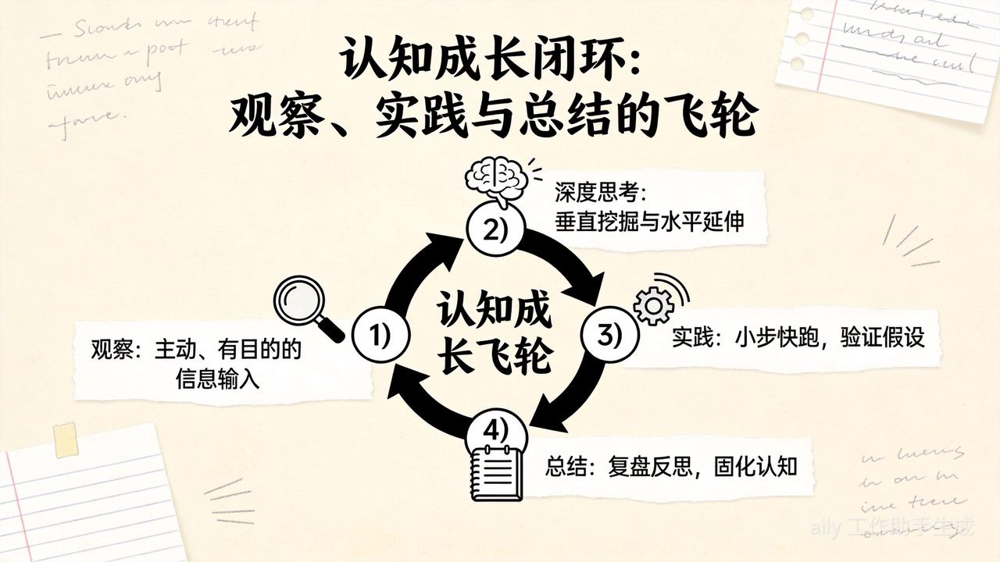

## 1. 引言：认知的深度与力量

在信息爆炸与注意力碎片化的当代社会，一种危险的认知错觉正在蔓延：人们误将信息的获取等同于知识的掌握，将观点的复述等同于思考的深度。正如用户所指出的，“能说会道不是深度思考，考试成绩好也不是深度思考”。这种现象揭示了智力（Intelligence）与理性（Rationality）之间的本质区别。认知科学的研究表明，一个人对事物理解的深度，而非其掌握的信息总量，决定了他能否在复杂系统中通过现象直抵本质，从而产生真正的内在力量。

现实中，绝大多数人并未真正触及深度思考的门槛。他们停留在“听过很多道理，依然过不好这一生”的困境中，根本原因在于这些“道理”往往是他人思考的终点（结论），而非自己思维过程的产物。真正的深度思考，是一种反直觉、反本能的认知活动，它要求个体克服大脑“认知吝啬鬼”（Cognitive Miser）的节能本能，主动进入高能耗的分析与推导状态。

本报告旨在构建一个关于“深度思考”的详尽理论与实践体系。我们将结合丹尼尔·卡尼曼的双系统理论、基思·斯坦诺维奇的理性思维模型、以及彼得·圣吉的系统动力学，全面解析深度思考的心理学机制。同时，我们将严格遵循用户提供的框架——从独立判断到因果追问，从向下拆解到向外扩展——并将“5Whys”、“第一性原理”、“推论阶梯”等思维工具融入具体的训练图谱中。这份报告不仅是对“什么是深度思考”的定义，更是一份关于“如何重塑大脑操作系统”的深度指南。

## 2. 第一章：深度思考的伪装与本质辨析

要理解什么是真正的深度思考，首先必须剥离那些伪装成思考的浅层认知活动。许多被大众误认为是“深刻”的表现，实则是大脑为了逃避真正思考而采取的策略。

### 2.1 深度思考的负面定义：什么不是深度思考

人们常误以为深度思考是总结出一句听起来“金句频出”的格言，或者是利用经验快速下达判断。然而，这种思维模式往往不仅不是深度思考，甚至是其对立面。

#### 2.1.1 结论的搬运工 vs. 思考的构建者

用户提到了一个典型的误区：直接接受如“关系的本质是价值交换”或“不要改变别人，只筛选不教育”这样的观点。这些话语在逻辑上可能具有一定的自洽性，甚至符合某些社会心理学现象（如社会交换理论），但对于接受者而言，它们只是“死去的知识”。

当一个人听到这样的观点并直接将其作为行事准则时，他实际上是在进行“认知外包”。他在没有经历“拆解、推导、权衡、验证”的思维过程下，直接借用了他人的认知边界作为自己的边界。这种行为在认知心理学中被称为\*\*“认知吝啬”（Cognitive Miserliness）\*\* (1)。人类大脑进化出的首要目标是生存而非求真，因此它倾向于接受现成的、看似合理的解释（Heuristics），以节省葡萄糖和神经资源的消耗。

真正深度思考者在面对“关系的本质是价值交换”这一命题时，不会止步于接受或反驳，而是会启动**语义与逻辑的解构**：

* **追问定义的边界：** “什么是价值？”价值是单一维度的金钱，还是包含情绪、认知、体验的多维结构？

* **追问交换的机制：** “交换是即时的还是延时的？”“是对等的还是非线性的？”

* **追问适用的语境：** “是否存在超越交换逻辑的关系（如母爱或利他主义）？”“在长期博弈与短期博弈中，交换规则有何不同？”

只有经过这种层层剥茧的**向下拆解（Downward Deconstruction）**，一个观点才能从“口号”转化为“模型”，从而在具体情境中指导决策。

#### 2.1.2 经验主义与情绪判断的陷阱

另一个深度思考的敌人是“用经验快速下结论”和“用情绪或立场进行判断”。

* **经验陷阱：** 经验往往是归纳法的产物，具有幸存者偏差（Survivorship Bias）和情境依赖性。有人说“某个行业没有前途”，这可能只是基于他个人失败的经验（个例），而非对行业宏观数据和底层逻辑的分析（系统）。直接采信这种经验，等于将他人的局限性内化为自己的天花板。

* **情绪与立场：** 心理学中的\*\*动机性推理（Motivated Reasoning）\*\*指出，人们倾向于接受符合自己既有立场或愿望的信息。当我们听到一个观点感到愤怒或极度认同时，往往是情绪系统（系统1）在起作用，而非逻辑系统（系统2）。深度思考要求我们在情绪涌起时按下暂停键，追问：“我的这种反应是基于事实，还是基于我的自尊或偏见？”

### 2.2 认知科学视角：系统2与反省心智

为了从科学层面定义深度思考，我们需要引入认知科学的双重加工理论（Dual Process Theory）以及基思·斯坦诺维奇的三重心智模型。

#### 2.2.1 系统1与系统2的对抗

丹尼尔·卡尼曼在《思考，快与慢》中区分了两种思维模式：

* **系统1（快思考）：** 自动化、无意识、情绪化、依赖直觉和启发式。这是我们日常生活的默认模式。当我们看到那句“不要改变别人”时，系统1会迅速基于过去的挫折经历产生共鸣，判定其为真 (3)。

* **系统2（慢思考）：** 它是受控的、耗能的、逻辑的、串行的。**真正的深度思考，本质上就是系统2对系统1的强力干预与纠正。** 它要求我们抑制直觉的冲动，调用逻辑规则对信息进行缓慢的审视 (3)。

#### 2.2.2 智力不等于理性：反省心智的作用

为什么很多高智商、高学历的人依然缺乏深度思考能力？斯坦诺维奇提出的**三重心智模型**给出了答案：

1. **自主心智（Autonomous Mind）：** 对应系统1，基于本能和内隐学习。

2. **算法心智（Algorithmic Mind）：** 对应流体智力（IQ），负责处理复杂的逻辑运算和记忆维持。这是传统考试测量的能力。

3. **反省心智（Reflective Mind）：** 这是深度思考的核心。它负责发起对自主心智的抑制指令，并调用算法心智进行计算。它代表了一个人的**认知倾向（Thinking Dispositions）**，如“是否愿意寻找反例”、“是否愿意在证据不足时悬置判断” (6)。

**深度思考不是算法心智的运算速度，而是反省心智的启动频率。** 它是对“为什么”的执着，是对“第一反应”的不信任。

## 3. 第二章：深度思考的第一原则——保持独立判断

用户指出的第一原则是“保持独立判断”。在信息过载的时代，独立判断不仅是一种能力，更是一种认知防御机制。它要求我们将外部信息视为“素材”而非“答案”。

### 3.1 认知的过滤器：质疑与验证

独立判断并不意味着对他人的观点全盘否定（那是另一种形式的偏执），而是不盲信。每个人的判断都由其特定的**坐标系**（经历、立场、局限）所决定。

#### 3.1.1 识别“信息污染源”

当我们接触到一个观点时，深度思考者会首先进行**信源分析**：

* **立场分析：** 说话者是否有利害关系？（例如，销售人员鼓吹“消费升级”可能是为了业绩）。

* **背景分析：** 说话者的成功或失败是否具有偶然性？（有人说“学历无用”，可能因为他生活在特定的风口时期，或者是极少数的幸存者）。

* **局限性分析：** 说话者的认知模型是否已过时？

#### 3.1.2 逼近事实的验证程序

用户提到：“深度思考不是对抗他人，而是在质疑与验证中逼近事实。” 这种验证过程可以形式化为一套**认知算法**：

1. **暂时悬置（Suspension）：** 接收信息时，既不立即接受也不立即反驳，而是将其放入“待验证区”。

2. **寻找依据（Evidence Seeking）：** 追问“支撑这个结论的事实（Fact）是什么？” 注意区分事实与观点（详见第七章）。

3. **寻找反例（Falsification）：** “是否存在相反的情况？”波普尔的**证伪主义**是深度思考的基石。一个未经证伪尝试的结论是脆弱的。如果有人说“比特币是未来的黄金”，独立判断者会刻意寻找“比特币失败的可能性”和“反对比特币的逻辑”，通过正反两面的对撞来形成更客观的认知。

4. **构建解释（Alternative Explanation）：** “除了他的解释，是否存在其他可能性？” 例如，某公司业绩下滑，CEO解释为“大环境不好”（外部归因）。独立思考者会验证：“竞争对手是否也下滑了？如果是，可能是环境；如果不是，可能是内部管理问题。” (8)。

### 3.2 独立判断的核心工具：推论阶梯 (Ladder of Inference)

为了在实际操作中保持独立判断，我们需要借助克里斯·阿吉里斯提出的**推论阶梯**模型。这个模型揭示了我们如何从可观察的数据迅速攀升至信念和行动，往往在瞬间完成且充满偏差 (10)。

**推论阶梯的层级与深度思考的干预：**

| **阶梯层级**    | **心理活动**   | **深度思考者的干预（自我追问）**       |
| ----------- | ---------- | ------------------------ |
| **7. 行动**   | 基于信念采取行动   | 我现在的行动是否过于冲动？            |
| **6. 信念**   | 形成世界观或定论   | 这个结论是否成为了我的思维定势？         |
| **5. 结论**   | 做出判断       | 这个结论是唯一合理的逻辑结果吗？         |
| **4. 假设**   | 赋予意义并建立逻辑  | 我是否在没有证据的情况下做了预设？        |
| **3. 意义**   | 文化与个人诠释    | 我是否将自己的偏见投射到了数据上？        |
| **2. 选择数据** | 从海量信息中筛选   | **我是否只看到了我想看的信息？（确认偏误）** |
| **1. 原始数据** | 像录像机一样记录事实 | **真正发生了什么？事实是什么？**       |

**案例应用：**

当听到“这个项目不可能成功”时：

* **浅层思考者**直接跳到第6层（信念：我们要失败了）和第7层（行动：放弃努力）。

* **深度思考者**迅速下梯子回到第1层：

* “为什么说不可能？（回到数据）”

* “是技术不可行，还是预算不足？（检视选定的数据）”

* “以前失败过就代表现在也会失败吗？（挑战假设）”

通过这种“下梯子”的练习，我们能够剥离附加在事实上的情绪和偏见，还原事物的本来面目 (13)。

## 4. 第三章：拒绝思维外包——构建大脑的肌肉记忆

“不要把思考外包给别人”是深度思考的行动纲领。大脑遵循“用进废退”的神经可塑性原则。如果长期习惯于“遇到问题找人教”、“进新领域找套路”，大脑负责逻辑推演和复杂决策的神经回路就会萎缩。

### 4.1 思维外包的病理分析

思维外包表现为对他人的过度依赖，试图跳过**过程**直接获取**结果**。

* **分析的缺位：** 遇到复杂问题，不愿拆解结构，只求一个“万能公式”。

* **推导的缺失：** 不愿进行逻辑演绎，只想要“第一步做什么，第二步做什么”。

* **决策的逃避：** 害怕承担决策错误的责任，希望有人告诉自己“选A是对的”。

这种习惯会导致\*\*元认知能力（Metacognition）\*\*的丧失。元认知是“关于思考的思考”，即监控和调节自己思维过程的能力。当思考被外包，元认知监控就失去了对象 (9)。

### 4.2 正确的求助姿势：修正模型而非索取答案

用户提出了正确的路径：“先自己思考，列出可能路径，再去请教他人。” 这种做法将求助转化为了\*\*模型修正（Model Correction）\*\*的过程。

**深度思考者的求助流程：**

1. **独立推演：** 针对问题，利用现有的知识和逻辑，构建一个初步的解决方案（原型）。哪怕这个方案是粗糙的、有漏洞的。

2. **识别盲区：** 在推演过程中，明确标记出自己感到困惑、缺乏信息或逻辑不通的节点。

3. **精准提问：** 向专家求助时，不再问“我该怎么办？”，而是问：“我目前的思路是A->B->C，但我发现B推导到C存在风险X，您认为我对风险X的判断准确吗？是否有更好的处理路径？”

4. **模型迭代：** 获取专家的反馈后，将其与自己的原始思路进行对比，思考：“他的思考逻辑比我高明在哪里？是他掌握了我不知道的信息（信息差），还是他的推理方式更严密（认知差）？”

通过这种方式，每一次求助都成为了一次对自身思维模型的升级，而不是一次简单的知识下载 (16)。

## 5. 第四章：深度思考的核心工具——垂直维度的向下挖掘

深度思考的一个主要方向是“向下”——穿透表象，直抵根本原因。这需要我们像剥洋葱一样，层层剥开现象的伪装。

### 5.1 追问原因的核心技术：5Whys分析法

用户提到的“反复追问为什么”，在管理学和工程学中被称为**5Whys分析法**（五问法）。它由丰田佐吉发明，是大野耐一构建丰田生产方式（TPS）的科学基石 (18)。

**5Whys的本质不是凑够五个问题，而是通过因果链条（Chain of Causality）的追踪，从“相关性”走向“因果性”，从“现象”走向“本质”。**

#### 5.1.1 经典案例深度解析：从身高到人格支点

用户提供了一个极佳的心理学案例，我们在此进行深度结构化拆解：

* **现象层（Why 1）：** 为什么曾经自卑？

* *回答：* 因为身高带来的压力。

* *深度分析：* 这里容易停留在表面，认为解决自卑就是“增高”或“穿增高鞋”。这是典型的“症状解”。

* **归因层（Why 2）：** 为什么身高会导致自卑？

* *回答：* 因为害怕被评价与否定。

* *深度分析：* 问题从生理特征转移到了心理机制（社会评价焦虑）。

* **逻辑层（Why 3）：** 为什么害怕被评价？

* *回答：* 因为我认为身高是我核心的价值衡量标准，且我在这个标准上处于劣势。

* **本质层（Why 4）：** 为什么身高会成为核心价值标准？

* *回答：* 因为缺乏其他能够支撑自信的优势支点。

* *深度分析：* 此时，问题的本质图穷匕见——**单一的价值评价体系**。

* **根本解（Why 5 & Solution）：** 如何解决？

* *回答：* 既然无法改变身高（生理限制），解决方式是建立多元的价值支点：能力、事业、人格魅力。

* *行动：* 从关注“不可控变量”（身高）转向经营“可控变量”（能力、成就）。

通过这层层追问，解决方案从无效的“纠结身高”转变为有效的“自我建设”。这就是向下挖掘的力量——**找到杠杆点（Leverage Point）** (20)。

#### 5.1.2 5Whys的执行陷阱与对策

在实践中，使用5Whys容易陷入“单一归因谬误”。世界往往是复杂的，一个结果由多因素叠加而成。

* **对策：** 结合**鱼骨图（Fishbone Diagram / Ishikawa Diagram）**。在追问“为什么”时，不只寻找一条路径，而是考虑人、机、料、法、环等多个维度。例如，自卑的原因除了缺乏其他优势（内因），可能还包括身处一个过分强调外表的社交圈子（环境因）。深度思考者会同时评估这些变量的权重，找到关键变量组合 (18)。

### 5.2 第一性原理 (First Principles Thinking)：物理学的理性

向下挖掘的终极形态是**第一性原理思考**。这是一种源自物理学的思维方式，由亚里士多德提出，经埃隆·马斯克推崇而广为人知 (24)。

* **类比思维（Analogy）：** “别人是怎么做的？我们要稍微好一点。” 这是基于现状的微调，容易陷入同质化竞争。

* **第一性原理：** “这件事在物理学/逻辑学上最基础的真理是什么？我们要以此为地基重构解决方案。”

**深度思考者的操作步骤：**

1. **解构（Deconstruct）：** 将问题拆解为不可再分的即定事实或公理。

2. **重构（Reconstruct）：** 从这些公理出发，推导出新的解决方案，无视之前的经验或教条。

**案例：关系中的第一性原理**

针对“关系是价值交换”，如果我们用第一性原理思考：

* *解构：* 关系的最小单位是两个独立的个体。人类建立关系的生物学基础是生存繁衍（进化心理学）和情感依附（依恋理论）。

* *公理：* 人需要安全感；人需要被看见；资源需要流动以抵抗熵增。

* *重构：* 所谓的“价值交换”只是表层现象。底层的物理真理是\*\*“能量的流动与共振”\*\*。如果一段关系在能量上是单向耗散的（如一方无限索取），无论表面交换了多少金钱，该系统终将崩溃（熵增至死）。因此，维护关系的本质不是算计交换比例，而是维护系统的能量平衡与负熵引入（共同成长）。

## 6. 第五章：深度思考的广度扩展——水平维度的向外延伸

深度思考不仅要“钻得深”（向下），还要“看得宽”（向外）。如果只向下追问，容易陷入“钻牛角尖”的还原论；必须结合向外的**广度（Breadth）**，才能形成完整的认知闭环。

### 6.1 系统思维 (Systems Thinking)：看见连接与动态

用户指出，针对“关系是价值交换”这一观点，向外要思考“是否所有关系都遵循交换逻辑？家庭关系是否超越交换？”这正是**系统思维**的体现 (26)。

系统思维要求我们关注**要素之间的连接**、**反馈回路**以及**时间延迟**。

#### 6.1.1 反馈回路（Feedback Loops）

* **增强回路（Reinforcing Loop）：** 正向反馈。例如，你对他人的善意（投入价值）引发了他人的感激，从而导致更多的善意回报。这是良性循环。

* **调节回路（Balancing Loop）：** 负向反馈，旨在维持系统稳定。例如，在关系中过度索取（偏离平衡）会引发对方的防御或撤退（调节机制），试图将关系拉回平衡或导致破裂。

深度思考者会分析：目前的“价值交换”处于哪种回路中？是在螺旋上升，还是在通过调节回归平庸？

#### 6.1.2 时间延迟（Time Delays）与演化

用户特别强调了**时间维度**：“时间是否改变关系结构？”

很多结论在短期成立，长期失效。

* **短期：** 吸引力可能源于颜值或财富（显性价值交换）。

* **长期：** 关系的存续依赖于信任、默契、共同经历（隐性价值的积累）。 系统思维告诉我们，行动（付出）与结果（回报）之间往往存在**时间延迟**。浅层思考者因为没有立刻看到回报（延迟），就判定“交换失败”而停止付出；深度思考者理解延迟的存在，能够坚持长期主义 (29)。

#### 6.1.3 边界分析（Boundaries）

向外思考还包括探究理论的适用边界。

* **市场规范 vs. 社会规范：** 丹·艾瑞里在《怪诞行为学》中区分了这两种规范。

* 在**市场规范**（工作、买卖）中，“价值交换”是铁律。

* 在**社会规范**（家庭、友谊）中，引入赤裸裸的“交换”反而会破坏关系（例如，给岳母做的晚餐付费）。 深度思考者能清晰划分这两个系统的边界，不试图用市场逻辑去殖民家庭关系，也不在商业谈判中过分讲究情怀 (31)。

### 6.2 二阶思维 (Second-Order Thinking)：推演后果的后果

霍华德·马克斯和雷·达里奥极其推崇**二阶思维** (33)。

* **一阶思维（System 1）：** 直觉的、直接的。“饿了就吃巧克力。”“为了利润裁员。”

* **二阶思维（System 2）：** 思考后果的后果。“吃巧克力会导致血糖波动和长期肥胖。”“裁员会导致士气低落、人才流失和品牌受损。”

**深度思考的“向外”推演练习：**

在接受“只筛选不教育”这个观点时：

* *一阶后果：* 节省了时间，避免了冲突，身边留下的都是合拍的人。效率高。（看起来很好）

* *二阶后果：* 长期缺乏思想碰撞和磨合能力，可能导致“信息茧房”和“回音室效应”。当你失去教育（影响）他人的能力时，你也失去了深度领导力和亲密关系中共同成长的机会。

* *三阶后果：* 随着环境变化，原本筛选出的“合拍者”可能不再合拍，而你缺乏修补关系的能力，最终导致社交圈的萎缩和孤立。

通过二阶思维，深度思考者发现了一个看似正确的结论背后潜藏的长期风险（System Archetype: Fixes that Fail / 饮鸩止渴） (35)。

## 7. 第六章：认知成长的闭环——观察、实践与总结

深度思考不是书斋里的空想，它必须在现实世界中完成闭环。用户提出了“观察——实践——总结”的路径，这与美军的\*\*AAR（After Action Review，行动后复盘）\*\*以及OODA循环不谋而合。

### 7.1 观察（Observation）：高质量的信息摄入

观察不仅是用眼睛看，而是带着问题去扫描世界。

* **全景式观察：** 既看幸存者，也看失败者（反幸存者偏差）。

* **结构化观察：** 使用框架（如PEST模型、SWOT分析）作为透镜，而不是漫无目的地浏览。

### 7.2 实践（Practice）：证伪的唯一考场

认知必须转化为行动，通过现实的反馈来验证。

* **最小可行性验证（MVP）：** 将你的思考（如“我认为这个产品能火”）转化为最小的行动（做一个Demo或写一篇文章），投入市场测试。

* **痛苦即信号：** 实践中的挫折、失败和意外，是现实世界在告诉你“你的思考模型与现实不符”。雷·达里奥的公式：**痛苦 + 反思 = 进步** (37)。深度思考者珍视痛苦，因为那是修正模型的契机。

### 7.3 总结（Reflection）：知识的内化与晶体化

总结是将经验转化为智慧的关键步骤。

* **AAR复盘法** (39)：

1. **原定目标是什么？**（What was supposed to happen?）

2. **实际发生了什么？**（What actually happened?）

3. **为什么会有差异？**（Why was there a difference? ——此处应用5Whys向下挖掘）

4. **下次通过什么行动来改进？**（What will we do differently next time?）

* **卡片笔记法（Zettelkasten）：** 卢曼（Niklas Luhmann）的笔记法是深度思考的外部支架。它要求将思考原子化（Atomic Notes），并强制建立笔记之间的**连接（Links）**。通过将新感悟与旧知识连接，大脑的神经网络变得更加稠密，思考的广度自然延伸 (42)。

## 8. 第七章：深度思考的三大关键能力训练

用户在最后指出了三个具体的关键能力：区分事实/解释/观点、反例思维、时间维度思考。这些是深度思考的“肌肉力量”。

### 8.1 能力一：区分事实 (Fact)、解释 (Explanation) 与观点 (Opinion)

这是批判性思维（Critical Thinking）的基础 (44)。

* **事实（Fact）：** 客观发生、可验证、无争议。

* *例：* “今天气温35度。”

* **观点（Opinion）：** 主观判断、价值取向。

* *例：* “今天好热。”（爱斯基摩人可能觉得热，赤道居民可能觉得凉快）。

* **解释（Explanation/Stance）：** 对事实发生原因的推测。

* *例：* “今天这么热是因为全球变暖。”（这是一个待验证的假设）。

**训练方法：新闻解剖**

每天选取一条新闻标题，画出三个栏目进行分类。

* *标题：* “某公司股价暴跌，投资者恐慌。”

* *事实：* 股价下跌了8%。

* *解释：* 媒体归因为“投资者恐慌”。（深度思考：真的是恐慌吗？还是机构的程序化交易？或是分红除权？）

* *观点：* “这只股票完了。”

多数人的错误在于把“解释”当成“事实”，把“观点”当成“真理”。深度思考者永远在寻找事实，审视解释，并保留观点。

### 8.2 能力二：反例思维 (Counter-example Thinking)

“一个观点如果没有例外，往往只是口号。” 科学哲学家卡尔·波普尔认为，科学与非科学的分界线在于**可证伪性**。

**训练方法：极限测试（Stress Test）**

当你得出一个结论（如“长期持有优质股票一定赚钱”）时，强迫自己寻找反例：

* “在什么情况下，这个结论不成立？”

* *反例：* 日本股市在1989年崩盘后，持有“优质股”30年依然亏损。

* *修正结论：* “在**国运上升且估值合理**的前提下，长期持有优质股票**大概率**赚钱。” 反例帮助我们从绝对化的口号，走向有边界、有前提的**概率性真理**（Probabilistic Thinking） (46)。

### 8.3 能力三：时间维度思考 (Temporal Dimension)

任何事物都是在时间长河中演化的。静态的切片无法代表动态的全貌。

**训练方法：时间轴推演**

* **过去（回溯）：** 现在的局面是如何演变而来的？（路径依赖）。

* **现在（截面）：** 系统各要素如何互动？

* **未来（演化）：** 随着关键变量（如技术、人口）的变化，现在的结构会如何坍塌或重组？

在关系中，深度思考者明白“热恋期”的激情（短期）掩盖了“性格不合”的矛盾（长期）。在商业中，他们明白“烧钱补贴”换来的增长（短期）如果不能转化为“用户留存”（长期），就是虚假繁荣。时间是检验真伪的唯一滤镜 (29)。

## 9. 结论：重塑大脑的操作系统

真正的深度思考，不是一种天赋，而是一种**习惯**，一种**生活方式**。它不是为了让生活变得复杂，而是为了用复杂的思维去还原世界的真相，从而找到最简单的解决方案（奥卡姆剃刀）。

深度思考的本质是：

1. **不轻信：** 用独立判断对抗认知吝啬。

2. **不外包：** 用自主推导对抗思维惰性。

3. **向下钻：** 用5Whys和第一性原理寻找根本解。

4. **向外看：** 用系统思维和二阶思维寻找全局解。

5. **动起来：** 在观察、实践、复盘的闭环中持续进化。

当一个人开始习惯性地追问“为什么的为什么”，开始在众声喧哗中寻找反例，开始在情绪上头时按下暂停键去寻找事实，他的大脑操作系统就已经完成了升级。这不仅决定了他能取得多大的结果，更决定了他能拥有多高自由度的灵魂。

***

## 附录：深度思考工具箱速查表 (Deep Thinking Toolkit Cheat Sheet)

| **维度**   | **核心工具**     | **关键提问 (The Key Question)** | **适用场景**               |
| -------- | ------------ | --------------------------- | ---------------------- |
| **认知防御** | **推论阶梯**     | “支撑这个结论的原始数据是什么？”           | 听到他人断言、自己情绪激动时。        |
| **向下挖掘** | **5 Whys**   | “为什么会发生这种情况？”（重复5次）         | 寻找问题的根本原因（Root Cause）。 |
| **向下挖掘** | **第一性原理**    | “这件事情最基础的物理/逻辑事实是什么？”       | 创新、打破常规、去除类比时。         |
| **向外扩展** | **二阶思维**     | “然后呢？（And then what?）”      | 做决策、评估政策或行动后果时。        |
| **向外扩展** | **系统循环图**    | “这是增强回路还是调节回路？有时滞吗？”        | 分析复杂局势、长期趋势、关系结构时。     |
| **结构化**  | **MECE原则**   | “是否有遗漏？是否有重叠？”              | 拆解问题、制定方案、分类信息时。       |
| **批判性**  | **反例思维**     | “在什么情况下，这个结论是错误的？”          | 验证观点、避免确认偏误时。          |
| **复盘**   | **AAR / 复盘** | “实际发生的与预期的有何不同？为什么？”        | 行动结束、项目复盘、个人日记。        |

#### Works cited

1. Cognitive miser - Wikipedia, accessed February 13, 2026, [https://en.wikipedia.org/wiki/Cognitive_miser](https://en.wikipedia.org/wiki/Cognitive_miser)

2. 11 WHY HUMANS ARE COGNITIVE MISERS AND WHAT IT MEANS FOR THE GREAT RATIONALITY DEBATE - Keith Stanovich, accessed February 13, 2026, [http://www.keithstanovich.com/Site/Research_on_Reasoning_files/Stanovich_Viale_Bounded.pdf](http://www.keithstanovich.com/Site/Research_on_Reasoning_files/Stanovich_Viale_Bounded.pdf)

3. System 1 and System 2 Thinking - The Decision Lab, accessed February 13, 2026, [https://thedecisionlab.com/reference-guide/philosophy/system-1-and-system-2-thinking](https://thedecisionlab.com/reference-guide/philosophy/system-1-and-system-2-thinking)

4. Kahneman Fast and Slow Thinking Explained - SUE | Behavioural Design Academy, accessed February 13, 2026, [https://www.suebehaviouraldesign.com/blog/kahneman-fast-slow-thinking](https://www.suebehaviouraldesign.com/blog/kahneman-fast-slow-thinking)

5. Thinking, Fast and Slow - Wikipedia, accessed February 13, 2026, [https://en.wikipedia.org/wiki/Thinking,_Fast_and_Slow](https://en.wikipedia.org/wiki/Thinking,_Fast_and_Slow)

6. A Taxonomy of Bias: The Cognitive Miser - LessWrong, accessed February 13, 2026, [https://www.lesswrong.com/lw/2ey/a_taxonomy_of_bias_the_cognitive_miser](https://www.lesswrong.com/lw/2ey/a_taxonomy_of_bias_the_cognitive_miser)

7. Distinguishing the reflective, algorithmic, and autonomous minds: Is it time for a tri-process theory? - ResearchGate, accessed February 13, 2026, [https://www.researchgate.net/publication/237337356_Distinguishing_the_reflective_algorithmic_and_autonomous_minds_Is_it_time_for_a_tri-process_theory](https://www.researchgate.net/publication/237337356_Distinguishing_the_reflective_algorithmic_and_autonomous_minds_Is_it_time_for_a_tri-process_theory)

8. Interview with Keith Stanovich - Progress-focused, accessed February 13, 2026, [https://www.progressfocused.com/2009/11/interview-with-keith-stanovich.html](https://www.progressfocused.com/2009/11/interview-with-keith-stanovich.html)

9. Critical Thinking, Formation, and Change - PMC, accessed February 13, 2026, [https://pmc.ncbi.nlm.nih.gov/articles/PMC10744224/](https://pmc.ncbi.nlm.nih.gov/articles/PMC10744224/)

10. Understanding the Ladder of Inference: Navigating Cognitive Pitfalls, accessed February 13, 2026, [https://gould.usc.edu/news/understanding-the-ladder-of-inference-navigating-cognitive-pitfalls/](https://gould.usc.edu/news/understanding-the-ladder-of-inference-navigating-cognitive-pitfalls/)

11. Understanding How to Use the Ladder of Inference - HBS Online, accessed February 13, 2026, [https://online.hbs.edu/blog/post/ladder-of-inference](https://online.hbs.edu/blog/post/ladder-of-inference)

12. What Is the Ladder of Inference? (And How to Use It) - Indeed, accessed February 13, 2026, [https://ca.indeed.com/career-advice/career-development/ladder-of-inference](https://ca.indeed.com/career-advice/career-development/ladder-of-inference)

13. The Ladder of Inference - The Systems Thinker, accessed February 13, 2026, [https://thesystemsthinker.com/the-ladder-of-inference/](https://thesystemsthinker.com/the-ladder-of-inference/)

14. The Ladder of Inference. Climbing Down from Expert Bias - What's the PONT, accessed February 13, 2026, [https://whatsthepont.blog/2015/07/11/the-ladder-of-inference-climbing-down-from-expert-bias/](https://whatsthepont.blog/2015/07/11/the-ladder-of-inference-climbing-down-from-expert-bias/)

15. Higher Order Thinking: An Introduction - Steemit, accessed February 13, 2026, [https://steemit.com/education/@rortian/higher-order-thinking-an-introduction](https://steemit.com/education/@rortian/higher-order-thinking-an-introduction)

16. How To Be A Critical Thinker And Develop Your Mental Powers Part 3 - Gain Weight Journal, accessed February 13, 2026, [https://gainweightjournal.com/how-to-be-a-critical-thinker-and-develop-your-mental-powers-part-3/](https://gainweightjournal.com/how-to-be-a-critical-thinker-and-develop-your-mental-powers-part-3/)

17. Moving Beyond System 1 and System 2: Conditioning, Implicit Evaluation, and Habitual Responding Might Be Mediated by Relational Knowledge - PMC, accessed February 13, 2026, [https://pmc.ncbi.nlm.nih.gov/articles/PMC7037735/](https://pmc.ncbi.nlm.nih.gov/articles/PMC7037735/)

18. Five whys - Wikipedia, accessed February 13, 2026, [https://en.wikipedia.org/wiki/Five_whys](https://en.wikipedia.org/wiki/Five_whys)

19. How to use the 5 Whys method to solve complex problems - IMD Business School, accessed February 13, 2026, [https://www.imd.org/blog/strategy/the-5-whys-technique/](https://www.imd.org/blog/strategy/the-5-whys-technique/)

20. 5 Whys - ModelThinkers, accessed February 13, 2026, [https://modelthinkers.com/mental-model/5-whys](https://modelthinkers.com/mental-model/5-whys)

21. What is the 5 Whys framework? - Miro, accessed February 13, 2026, [https://miro.com/root-cause-analysis/what-is-5-whys-framework/](https://miro.com/root-cause-analysis/what-is-5-whys-framework/)

22. Some thoughts on “5 Whys” - Jason Yip, accessed February 13, 2026, [https://jchyip.medium.com/some-thoughts-on-5-whys-6e1a00e5c95](https://jchyip.medium.com/some-thoughts-on-5-whys-6e1a00e5c95)

23. How do you do the 5 whys method for big problems ? With many possible root causes., accessed February 13, 2026, [https://www.reddit.com/r/agile/comments/ond2ln/how_do_you_do_the_5_whys_method_for_big_problems/](https://www.reddit.com/r/agile/comments/ond2ln/how_do_you_do_the_5_whys_method_for_big_problems/)

24. Elon Musk's “First Principles Thinking” and How It Can Be Applied to UX Design - freshtrax, accessed February 13, 2026, [https://blog.btrax.com/first-principles-thinking/](https://blog.btrax.com/first-principles-thinking/)

25. First Principles: Elon Musk on the Power of Thinking for Yourself - James Clear, accessed February 13, 2026, [https://jamesclear.com/first-principles](https://jamesclear.com/first-principles)

26. Five core concepts for understanding systems - Integration and Implementation Insights, accessed February 13, 2026, [https://i2insights.org/2025/09/16/five-core-systems-concepts/](https://i2insights.org/2025/09/16/five-core-systems-concepts/)

27. Applications of Systems Thinking - Systems Thinking Framework - SixSigma.us, accessed February 13, 2026, [https://www.6sigma.us/systems-thinking/systems-thinking-framework/](https://www.6sigma.us/systems-thinking/systems-thinking-framework/)

28. accessed January 1, 1970, [https://thesystemsthinkers.com/systems-thinking-what-is-it-anyway/](https://thesystemsthinkers.com/systems-thinking-what-is-it-anyway/)

29. 5 Lessons from Systems Thinking That Will Change How You See the World | by Abhishek Jain Ux | Bootcamp | Medium, accessed February 13, 2026, [https://medium.com/design-bootcamp/5-lessons-from-systems-thinking-that-will-change-how-you-see-the-world-154aa148eb29](https://medium.com/design-bootcamp/5-lessons-from-systems-thinking-that-will-change-how-you-see-the-world-154aa148eb29)

30. Chapter 2: Systems Thinking: a New Way to Tackle Problems - JMU Libraries Pressbooks, accessed February 13, 2026, [https://pressbooks.lib.jmu.edu/sdlearningguide/chapter/systems-thinking-a-new-way-to-tackle-problems/](https://pressbooks.lib.jmu.edu/sdlearningguide/chapter/systems-thinking-a-new-way-to-tackle-problems/)

31. Thinking Habits and Dispositions | Richard R. Sudweeks - BYU Speeches, accessed February 13, 2026, [https://speeches.byu.edu/talks/richard-r-sudweeks/thinking-habits-dispositions/](https://speeches.byu.edu/talks/richard-r-sudweeks/thinking-habits-dispositions/)

32. Systems Thinking Examples in Real-World Engineering Projects, accessed February 13, 2026, [https://strategic-engineering.co/blog/concepts/systems-thinking/](https://strategic-engineering.co/blog/concepts/systems-thinking/)

33. Second-order thinking | Untools, accessed February 13, 2026, [https://untools.co/second-order-thinking/](https://untools.co/second-order-thinking/)

34. Second-Order Thinking: What Smart People Use to Outperform - Farnam Street, accessed February 13, 2026, [https://fs.blog/second-order-thinking/](https://fs.blog/second-order-thinking/)

35. Fixes that fail - Wikipedia, accessed February 13, 2026, [https://en.wikipedia.org/wiki/Fixes_that_fail](https://en.wikipedia.org/wiki/Fixes_that_fail)

36. System archetype - Wikipedia, accessed February 13, 2026, [https://en.wikipedia.org/wiki/System_archetype](https://en.wikipedia.org/wiki/System_archetype)

37. Principles by Ray Dalio — Summary and Application | by Alex Chen - Medium, accessed February 13, 2026, [https://alexchen373.medium.com/principles-by-ray-dalio-summary-and-application-841e76f3eb9](https://alexchen373.medium.com/principles-by-ray-dalio-summary-and-application-841e76f3eb9)

38. Ray Dalio's 5-Step Process for Getting What You Want Out of Life | Jared Dees, accessed February 13, 2026, [https://jareddees.com/5-step-process-ray-dalio/](https://jareddees.com/5-step-process-ray-dalio/)

39. After-Action Reviews: A Simple Yet Powerful Tool - Wharton Executive Education, accessed February 13, 2026, [https://executiveeducation.wharton.upenn.edu/thought-leadership/wharton-at-work/2021/07/after-action-reviews-simple-tool/](https://executiveeducation.wharton.upenn.edu/thought-leadership/wharton-at-work/2021/07/after-action-reviews-simple-tool/)

40. Research-informed practice: After-action reviews - The Chartered College of Teaching, accessed February 13, 2026, [https://my.chartered.college/research-hub/research-informed-practice-after-action-reviews/](https://my.chartered.college/research-hub/research-informed-practice-after-action-reviews/)

41. After-action review - Wikipedia, accessed February 13, 2026, [https://en.wikipedia.org/wiki/After-action_review](https://en.wikipedia.org/wiki/After-action_review)

42. How to start a Zettelkasten from your existing deep experience | Writing Slowly, accessed February 13, 2026, [https://writingslowly.com/2024/03/06/how-to-start.html](https://writingslowly.com/2024/03/06/how-to-start.html)

43. Introduction to the Zettelkasten Method, accessed February 13, 2026, [https://zettelkasten.de/introduction/](https://zettelkasten.de/introduction/)

44. FACT, OPINION & STANCE: CRITICAL THINKING SKILLS | Clare's ..., accessed February 13, 2026, [https://clareseltcompendium.wordpress.com/wp-content/uploads/2016/04/fact-opinion-stance-reading-skills-worksheet-with-answers.pdf](https://clareseltcompendium.wordpress.com/wp-content/uploads/2016/04/fact-opinion-stance-reading-skills-worksheet-with-answers.pdf)

45. 2.2: Opinion vs. Fact - Humanities LibreTexts, accessed February 13, 2026, [https://human.libretexts.org/Courses/Coalinga_College/Critical_Thinking%3A_Argumentative_Reading_and_Writing_(CID_ENGL105)/02%3A_Critical_Reading_Strategies/2.02%3A_Opinion_vs._Fact](https://human.libretexts.org/Courses/Coalinga_College/Critical_Thinking%3A_Argumentative_Reading_and_Writing_\(CID_ENGL105\)/02%3A_Critical_Reading_Strategies/2.02%3A_Opinion_vs._Fact)

46. Mental Models: The Best Way to Make Intelligent Decisions (\~100 Models Explained), accessed February 13, 2026, [https://fs.blog/mental-models/](https://fs.blog/mental-models/)

47. Second-order thinking - PEX Network, accessed February 13, 2026, [https://www.processexcellencenetwork.com/business-transformation/articles/what-is-second-order-thinking](https://www.processexcellencenetwork.com/business-transformation/articles/what-is-second-order-thinking)

