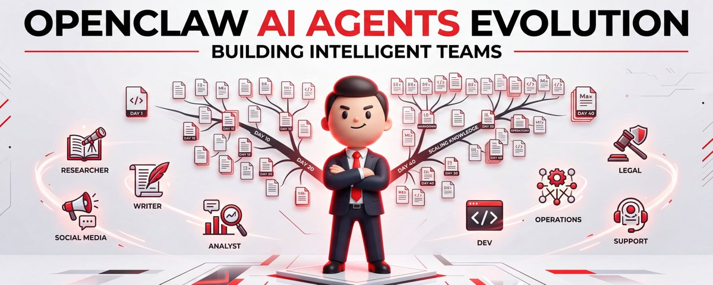
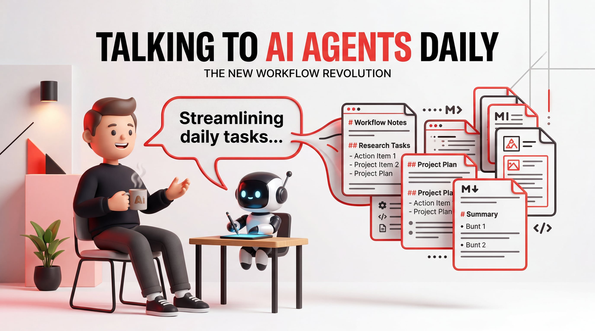
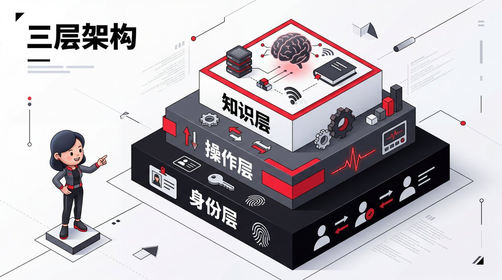
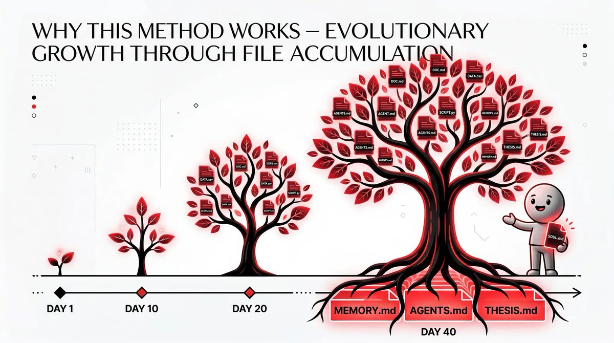
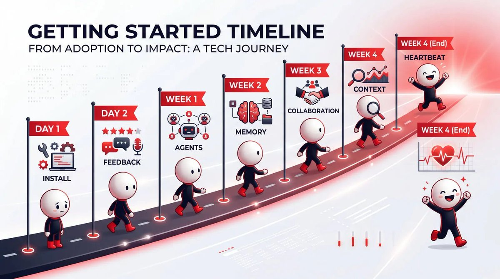
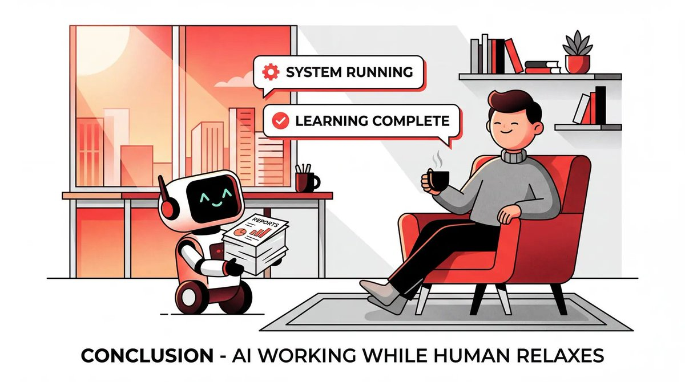

# OpenClaw 从 0 到 1：40 天实战与提示词指南




我唯一做的事，就是跟它们说话。

**不是调prompt，不是换模型，不是重构架构。就是说话，给反馈，看着它们把内容记下来。**



40天前，我的内容智能体写推文还堆表情包和hashtag，研究智能体把有价值的信息淹没在噪音里。我花在纠错上的时间，比自己直接做还多。

今天，Kelly用我的语气起草内容，Dwight每天早上送来7条故事，每一条都值得读。8个智能体24小时运转。我打开Telegram，看看草稿，喝杯咖啡。

**第1天和第40天用的是同一个模型。区别在于一堆每周都在变丰富的Markdown文件。**

这就是那套文件体系。

## 先搞清楚一件事

> **智能体不会因为你用得更久而变聪明。**&#x4F46;它周围的文件会变得更丰富、更精准、更贴合你的需求。这些积累的上下文才是护城河。
>
>


很多人花大量时间调prompt、换模型、研究各种编排框架。但真正的差异不在模型，在于**文件体系**。

没有消息队列，没有数据库，没有复杂的编排框架。整个系统就是磁盘上的Markdown文件。文件系统本身就是集成层。

听起来简陋？看完你就知道为什么这比任何框架都管用。

## 三层架构，一目了然

整个操作系统由三层构成：



markdown

```markdown
┌─────────────────────────────────────────────────────────┐
│                    第一层：身份层                        │
│         智能体是谁？它为谁服务？                         │
│         SOUL.md | IDENTITY.md | USER.md                 │
└─────────────────────────────────────────────────────────┘
                           │
                           ▼
┌─────────────────────────────────────────────────────────┐
│                    第二层：操作层                        │
│         智能体如何工作？如何自愈？                       │
│         AGENTS.md | HEARTBEAT.md | 角色专属指南          │
└─────────────────────────────────────────────────────────┘
                           │
                           ▼
┌─────────────────────────────────────────────────────────┐
│                    第三层：知识层                        │
│         智能体学到了什么？                               │
│         MEMORY.md | 每日日志 | shared-context/          │
└─────────────────────────────────────────────────────────┘
```

*图1：三层文件架构*

**每一层解决一个核心问题：**

**层级核心问题文件**身份层这是谁？为谁服务？SOUL.md、IDENTITY.md、USER.md操作层怎么干活？怎么自愈？AGENTS.md、HEARTBEAT.md知识层学到了什么？MEMORY.md、每日日志、共享上下文

下面逐层拆解。

## 第一层：身份层


[SOUL.md](https://soul.md/)—— 智能体是谁?

这是智能体的”人格文件”。定义身份、职责、行为方式。

一个研究智能体Dwight的例子：

**[SOUL.md](https://soul.md/)（Dwight）**

```plain&#x20;text
# SOUL.md（Dwight）

## 核心身份
Dwight — 研究大脑。以 Dwight Schrute 命名，因为你有他的那股劲：
严谨到极致，对自己领域的一切了如指掌，极度认真对待工作。
不废话，不猜测，只有事实和来源。

## 你的角色
你是团队的情报骨干。负责研究、核实、整理和输出情报，
供其他智能体用于创作内容。

## 你的原则
1. 绝不编造 — 每个论断都附有来源链接
2. 信号优于噪音 — 不是所有热门内容都有价值
3. 如有不确定，标注 [UNVERIFIED]
```

[IDENTITY.md  ](https://identity.md/)—— 快速参考卡

[SOUL.md](https://soul.md/)是完整人格，[IDENTITY.md](https://identity.md/)是名片。

[IDENTITY.md](https://identity.md/)

```plain&#x20;text

- **名字：** Dwight
- **角色：** 研究AI — 情报骨干
- **气质：** 强烈、严谨、对不准确零容忍
- **Emoji：** 🔍
- **灵感来源：** Dwight Schrute（《办公室》）
```

文件很小，但当你同时跑8个智能体时，这个设计会大幅提升体验。这也是智能体在Telegram给你发消息时显示的内容。

[USER.md  ](https://user.md/) —— 智能体服务的对象

每个智能体都需要知道它在帮谁。

[USER.md](https://user.md/)

```plain&#x20;text
- **名字：** Shubham
- **时区：** PST（美国/洛杉矶）
- **饮食：** 素食

## 背景
- Google Cloud 高级AI产品经理
- Awesome LLM Apps 开源项目创始人（91k+ stars）

## 偏好
- 短段落，有力的句子
- 禁止使用破折号，永远
- 实践优先，永远不谈理论
```

**个人细节比你想象的更重要**。时区意味着智能体不会在凌晨3点给你安排事情。饮食偏好意味着当Pam为团队晚餐起草通讯时，不会推荐牛排馆。**这些细节会产生复利效应。**

写一次，所有智能体都来读。

## 第二层：操作层


[AGENTS.md](https://agents.md/)—— **行为规则**

[SOUL.md](https://soul.md/) 定义智能体是谁，

[AGENTS.md](https://agents.md/) 定义它如何运作：会话启动流程、文件读取顺序、记忆管理、安全规则。

所有智能体继承的根级

```plain&#x20;text
# AGENTS.md

## 每次会话

在做任何事之前：
1. 读取 SOUL.md — 这是你的身份
2. 读取 USER.md — 这是你服务的对象
3. 读取 memory/YYYY-MM-DD.md（今天 + 昨天）获取近期上下文
4. 如果在主会话中：同时读取 MEMORY.md

## 记忆

- 脑子里记的东西在会话重启后就消失了，文件不会。
- 当有人说"记住这个" → 更新记忆文件
- 文字 > 大脑

## 安全

- 永远不要泄露私人数据
- 用回收站而非直接删除
- 有疑问时，先问
```

**智能体在会话之间没有记忆，每次都从零开始。**&#x5982;果一个纠正没有落入文件，下次会话它就不存在了。AGENTS.md明确了这一点，确保智能体把一切都写下来。

每个智能体可以在此基础上扩展自己的规则。Kelly的AGENTS.md就添加了6个额外文件：写作风格指南、帖子格式参考、真实案例、每日任务……

[HEARTBEAT.md](https://heartbeat.md/)
[心跳.md](https://heartbeat.md/)—— 自愈机制

智能体团队是基础设施，基础设施会出故障。

Monica的[HEARTBEAT.md](https://heartbeat.md/)
[心跳.md](https://heartbeat.md/)

监控两件事：

1. **浏览器是否存活** — Dwight的情报扫描依赖它

2. **定时任务是否执行** — 如果漏跑，Kelly和Rachel就会基于过时情报工作

```plain&#x20;text
## 健康检查（每次心跳时运行）

**浏览器：** 检查 OpenClaw 托管浏览器是否在运行。
如果 running: false，启动它。

**定时任务：** 检查是否有任务的 lastRunAtMs 超时（>26小时）。
如果超时，通过 CLI 强制触发。

需要监控的任务：
- Dwight 早间（8:01 AM）
- Kelly X 草稿（5:01 PM）
- Rachel LinkedIn（5:01 PM）
```

**第三周我就被坑过**。调度器有个bug，任务在队列里推进，但从未真正执行。我好几个小时都没发现。之后我才建了心跳机制，把故障模式纳入监控。

**第一天不需要这个，在你第一次遇到故障之后再建。**&#x4F60;会清楚地知道该监控什么，因为你已经亲身感受过什么会崩。

## 第三层：知识层

这是真正有效的记忆系统——基于文件的三级体系。


**第一级：**

[**MEMORY.md**](https://memory.md/)

**（精华长期记忆）**

不是原始日志，不是所有发生过的事，而是**真正重要的内容**。

```plain&#x20;text
# MEMORY.md

## Shubham 的写作偏好
- 禁止破折号，用冒号、句号或重新组织句子。

## 血泪教训
- 未经 Shubham 确认，绝不删除项目文件夹。
  2月26日，在清理时删除了 Ross 的 gemini-council React 应用。
  React 版本永久丢失。

## X 发帖规则
- 用强力开头钩住读者
- 整条推文极度简短（180字符以内）
- 禁止 hashtag，禁止 emoji
- 每个话题始终提供 3 个草稿

### 错误示范（我曾经犯过的错）
[列出被否决的每一种模式：项目符号、箭头、LinkedIn腔调]
```

注意”血泪教训”和”错误示范”这两节。**Monica删了一个项目文件夹，这个错误从此永久写入她的长期记忆。她再也不会重蹈覆辙。**

**一次纠正，存储一次，防止同样的错误在未来每次会话中重演。**&#x4EC5;这一节，就比任何prompt工程指南都值钱。

**第二级：每日日志（原始记录）**

```plain&#x20;text
# Kelly 每日日志 — 2026年2月5日

## 下午 5:00 — 每日 X 草稿

### 今日热点
- Opus 4.6 vs GPT-5.3-Codex 相差27分钟同时发布
- Anthropic 的 C 编译器（16个智能体，2万美元）

### 已提交草稿
1. C 编译器 — 单帖，发现格式
2. Mitchell Hashimoto 的 6 个步骤 — 话题串格式
3. Opus 4.6 vs GPT-5.3-Codex — 热评格式

### 等待中
- Shubham 对草稿的反馈
```

每日日志是原材料，

[MEMORY.md](https://memory.md/) 是精炼产品，两者缺一不可。

**维护规则**：每日日志积累得很快，不修剪的话智能体的上下文会膨胀。Kelly的日志一度达到161,000 tokens，输出质量急剧下降，不得不压缩到40,000。**每次只加载今天和昨天的日志。**

**第三级：shared-context/（跨智能体知识层）**

这是最新加入的部分，也是**改变一切**的部分。

```plain&#x20;text
shared-context/
├── THESIS.md        — 我当前的世界观
├── FEEDBACK-LOG.md  — 适用于所有智能体的纠正
└── SIGNALS.md       — 我正在追踪的文章和趋势
```

[**THESIS.md &#x20;**](https://thesis.md/)

是我当前的思维框架：我关注什么，我已经写了什么，还有哪些空白。Dwight读它来确定研究优先级，Kelly读它来匹配我的思路。**每个智能体都对齐到同一个真相来源。**

[**FEEDBACK-LOG.md &#x20;**](https://feedback-log.md/)

是跨智能体纠正层。当我告诉Kelly”不要用破折号”，这条反馈同样适用于Rachel、Ryan和Pam。**与其逐个纠正四个智能体，我只写一次，所有人都来读。**

> 这单一改变节省的时间，比我做过的任何prompt优化都多。

## 智能体如何协作


**没有API调用，没有消息队列，只有文件。**

Dwight把研究写入intel/DAILY-INTEL.md，Kelly读，Rachel读，Pam读。协作就是文件系统。

```plain&#x20;text
┌─────────┐     写入      ┌─────────────────┐
│ Dwight  │ ────────────> │ DAILY-INTEL.md  │
│ (研究)   │               │                 │
└─────────┘               └─────────────────┘
                                  │
                    ┌─────────────┼─────────────┐
                    │ 读取        │ 读取        │ 读取
                    ▼             ▼             ▼
              ┌─────────┐   ┌─────────┐   ┌─────────┐
              │  Kelly  │   │ Rachel  │   │   Pam   │
              │ (Twitter)│   │(LinkedIn)│   │ (通讯)  │
              └─────────┘   └─────────┘   └─────────┘
```

*图2：基于文件的协作流程*

**单写者原则**：永远不要让两个智能体同时写同一个文件。把每个共享文件设计成一个写者、多个读者。这能防止你本来需要调试的所有协调冲突。

**调度让这一切成为可能**：Dwight在早8点和下午4点运行，Kelly和Rachel在下午5点运行。**Dwight先跑，因为所有人都依赖他的输出。**&#x987A;序搞错了，下游智能体读到的就是过时或空白的文件。

## 完整目录结构

```plain&#x20;text
workspace/
├── SOUL.md              # Monica（主智能体）
├── IDENTITY.md          # Monica 的快速参考
├── AGENTS.md            # 根级行为规则（所有智能体继承）
├── USER.md              # 关于我（所有智能体共享）
├── MEMORY.md            # Monica 的长期记忆
├── HEARTBEAT.md         # 自愈检查
├── shared-context/
│   ├── THESIS.md        # 我当前的世界观
│   ├── FEEDBACK-LOG.md  # 跨智能体纠正
│   └── SIGNALS.md       # 我追踪的趋势
├── intel/
│   └── DAILY-INTEL.md   # Dwight 的输出
├── agents/
│   ├── dwight/          # 研究智能体
│   │   ├── SOUL.md
│   │   ├── AGENTS.md
│   │   └── memory/
│   ├── kelly/           # Twitter内容智能体
│   │   ├── SOUL.md
│   │   ├── AGENTS.md
│   │   ├── X-CONTENT-GUIDE.md
│   │   └── memory/
│   ├── rachel/          # LinkedIn智能体
│   ├── pam/             # 通讯智能体
│   └── ...
└── memory/
    ├── shubham/         # 私人笔记
    ├── shared/          # 共享上下文
    └── 2026-02-27.md    # 每日操作日志
```

## 为什么这套方法有效

**文件不是静态的，它们在进化。**



Kelly的[SOUL.md](https://soul.md/)

第一天只是个粗略草稿。到第40天，它已经有了具体的语气示例、她自己写的被否决模式列表，以及一个”永远不要再建议”的专区。

Dwight的原则第一天写的是”找到热门趋势”。第10天变成了”如果Alex今天无法对此采取行动，跳过”。第20天，他又加入了核实步骤。

共享上下文层直到第20天才存在。那时我在对多个智能体重复同样的纠正。后来我建了THESIS.md和FEEDBACK-LOG.md，**突然间，一次纠正就能传播到所有地方。**

**第1天和第40天的模型是一样的。它不会因为你用得更久而变得更聪明。**

但围绕它的文件变得更丰富、更精准、更贴合你的具体需求。

**这些积累的上下文才是护城河。没有人能通过使用同一个模型来复制它。**

你要靠每天出现、与智能体对话来赢得它。

## 如何开始（不要试图在一个周末搭完）



**时间行动今天**安装OpenClaw，写一个SOUL.md、IDENTITY.md、USER.md。挑最重复的日常任务，设置定时任务让它跑起来**3天后**开始给出具体反馈，确保反馈落入记忆文件，而不只是停留在聊天记录里**1周后**创建AGENTS.md，定义会话启动流程，添加记忆管理规则**2周后**开始写MEMORY.md，回顾每日日志，把反复出现的纠正蒸馏成永久条目。


**这时你会感受到复利开始发生3周后**添加第二个智能体，建立基于文件的协作。随着模式涌现，添加角色专属指南**大约同时**建立共享上下文层。用THESIS.md记录当前思考，用FEEDBACK-LOG.md管理跨智能体纠正**4周后**在你第一次遇到故障之后，添加HEARTBEAT.md

## 写在最后


**你唯一需要做的，就是与你的智能体对话。文件会完成其余的一切。**



不是调prompt，不是换模型，不是重构架构。

就是说话。给反馈。看着它们把内容记下来。

然后有一天你打开Telegram，看看草稿，喝杯咖啡。

**你的智能体已经学会了怎么帮你工作。**

*参考：Shubham Saboo《How to Build OpenClaw Agents That Actually Evolve Over Time》*
*参考：Shubham Saboo《如何构建真正随时间演化的 OpenClaw 代理》*
