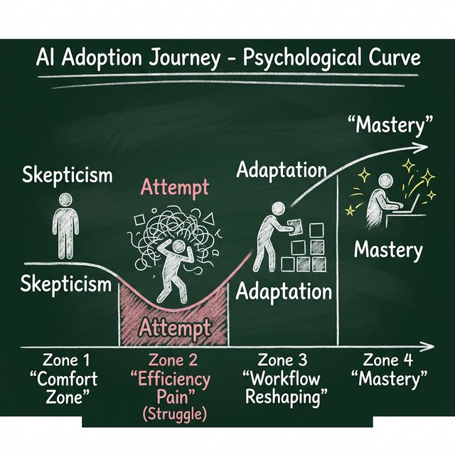
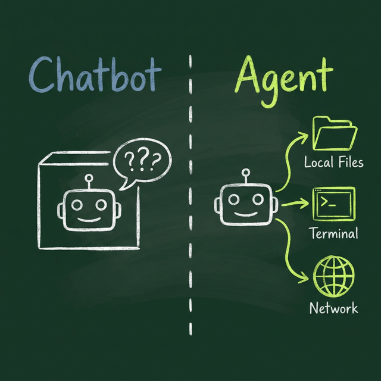
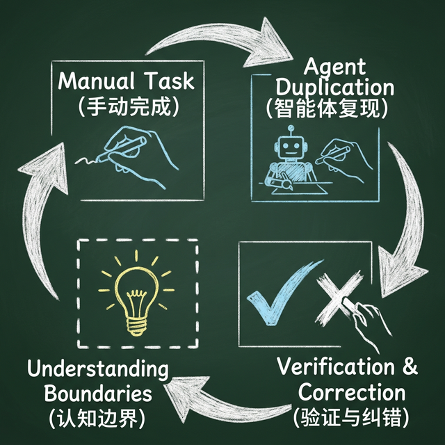
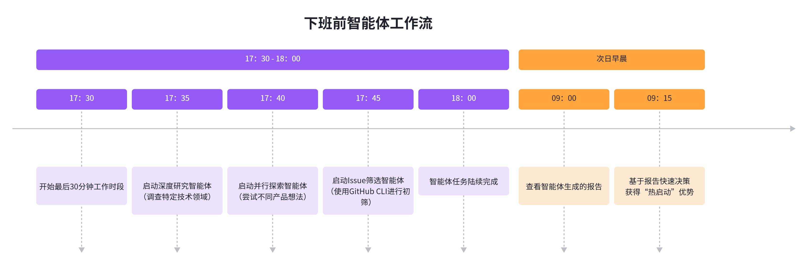

# 我的AI采用之旅

> **核心洞察**：Mitchell Hashimoto——一位曾对AI持深度怀疑态度的资深技术专家——通过一套**六步系统化实践**，完成了从抗拒到有效使用的转变。他发现，真正的价值不在于聊天机器人，而在于能够**读取文件、执行程序、发起网络请求的智能体（Agent）**。关键在于**刻意练习、模式转变和工程化约束**，而非盲目追随炒作。

<table>
<thead>
<tr>
<th><blockquote>

<strong>关键转变</strong>：从依赖聊天界面转向使用<strong>智能体</strong>，是效率提升的第一道分水岭。

</blockquote></th>
<th><blockquote>

<strong>核心策略</strong>：利用<strong>下班前30分钟</strong>启动智能体，将人类低效时间转化为AI的生产力。

</blockquote></th>
</tr>
</thead>
</table>

---

## 引言：从怀疑到拥抱 - 一位技术专家的AI采用心路

技术专家面对新工具，尤其是像AI这样被过度炒作的技术，往往经历一个典型的心理历程：从**舒适区的抗拒**，到主动探索的**效率阵痛期**，最终才能抵达**工作流重塑**的新阶段。资深开发者Mitchell Hashimoto也不例外。他曾公开表示对AI的怀疑，但最终通过一套**严谨、可复现的六步方法**，找到了AI工具在其工作流中的真实价值。

本文基于Mitchell Hashimoto在2026年2月发表的《My AI Adoption Journey》一文，将其核心实践**本地化**为中文技术社区的分享。在AI炒作满天飞的环境中，我们需要的不是口号，而是像这样**务实、可操作的路线图**。

---

## 第一步：抛弃聊天机器人，拥抱智能体

几乎所有人的AI初体验都是**聊天界面**——向ChatGPT或Gemini提问，然后复制粘贴代码。Mitchell的第一次“惊叹时刻”也是如此：将Zed编辑器的命令面板截图丢给Gemini，要求用SwiftUI复现，结果**完成度极高**。如今Ghostty for macOS中的命令面板，就源于那次几秒钟的生成。

然而，当试图将这种成功复制到**已有项目（Brownfield Project）** 中时，挫败感接踵而至。聊天机器人严重依赖其训练数据，在复杂、具体的上下文中频频出错。开发者不得不反复进行“复制代码-粘贴错误-纠正提示”的低效循环，**速度远低于手动编码**。

**真正的转折点在于认识到：必须使用“智能体（Agent）”。** 在技术语境中，智能体指能够与开发者对话，并能在**循环中调用外部行为**的大语言模型。其**最低能力要求**包括：读取本地文件、执行终端程序、发起HTTP请求。只有具备这些能力，AI才能理解你的项目上下文，运行测试验证代码，或查询最新文档——从而摆脱“盲猜”模式。

<table>
<thead>
<tr>
<th><h3>聊天机器人的局限</h3><ul>
<li><strong>依赖历史训练数据</strong>，缺乏对当前项目上下文的感知</li>
<li><strong>无法实时验证</strong>代码的正确性或执行结果</li>
<li>需要人工<strong>反复纠错</strong>，形成低效的反馈循环</li>
<li><strong>不适合复杂项目</strong>的增量开发与调试</li>
</ul></th>
<th><h3>智能体的优势</h3><ul>
<li><strong>能够读取本地文件</strong>和环境变量，理解项目全貌</li>
<li><strong>可以执行程序</strong>和测试，即时验证输出</li>
<li><strong>能够发起网络请求</strong>，获取实时信息或API数据</li>
<li><strong>支持循环验证</strong>，具备一定的自我修正能力</li>
</ul></th>
</tr>
</thead>
</table>

---

## 第二步：刻意练习 - 重复你的工作

理解了工具，下一步是掌握其边界。Mitchell采用了一种近乎“自虐”的练习方法：**先完全手动完成一项工作并提交，然后在不参考自己解决方案的前提下，指挥智能体去复现一个质量与功能完全相同的结果**。

这个过程**极其痛苦**，因为它阻碍了“快速完成事情”的本能。但正是这种刻意练习，让他从第一性原理中总结出了关键经验：

- **拆解任务**：将会话拆分为多个清晰、可执行的小任务。不要试图在一个会话中“画出整个猫头鹰”。

- **分离规划与执行**：对于模糊的需求，先开启一个**规划会话**明确步骤，再开启**执行会话**具体操作。

- **提供验证机制**：如果给智能体提供验证其工作的方法（如运行测试套件），它往往能**自行修复错误**并防止退化。

更重要的是，他摸清了智能体的**能力边界**：擅长什么、不擅长什么，以及如何引导才能获得期望的结果。**最大的效率提升，反而来自于知道何时不应该使用智能体**，避免了无谓的时间浪费。

---

## 第三步：下班前的智能体 - 利用非工作时间

掌握了基础用法后，Mitchell开始寻求效率增益。他的新假设是：**能否利用我无法工作的时间，让AI创造价值？** 于是，他养成了一个新习惯：每天工作结束前，**留出最后30分钟，专门启动一个或多个智能体任务**。

他发现了三类特别适合在此时间段进行的任务：

- **深度研究调查**：例如，查找某种编程语言下具有特定许可证的所有库，并为每个库生成包含优缺点、开发活跃度、社区评价的多页摘要。

- **并行探索**：针对几个模糊的想法，同时启动多个智能体进行初步探索，不期望立即产出可交付成果，而是为了**扫清认知盲区**。

- **Issue与PR初筛**：利用智能体调用GitHub CLI的能力，并行扫描和初步分类Issue与PR。**关键是不允许智能体自动回复**，只生成报告供次日人工决策。

这30分钟通常是一天中效率较低的时段，将其用于“启动智能体”，相当于为第二天早晨提供了一个**高质量的“热启动”**，让人能更快进入深度工作状态。

---

## 第四步：外包“灌篮得分” - 专注于核心工作

经过前期的积累，Mitchell对智能体能**轻松搞定**的某类任务建立了高度信心。他将这类任务比喻为篮球中的“**灌篮得分（Slam Dunks）**”——几乎必然成功。

他的工作模式随之升级：早晨，先审阅前晚智能体生成的报告，筛选出那些“灌篮得分”型任务（例如简单的Bug修复、格式调整、文档更新），然后让智能体在后台**逐个执行**。

**与此同时，他本人则专注于其他需要人类创造力与深度思考的核心工作。** 这并非偷懒，而是有意识的**注意力分配**。为了保持高效，他严格执行一条规则：**关闭所有智能体的桌面通知**。上下文切换的成本极高，必须由人类来控制何时中断工作去检查进度，而非被AI的通知随意打断。

这种模式也巧妙地回应了关于“**AI导致技能退化**”的担忧。通过继续手动处理自己喜爱且富有挑战性的任务，Mitchell保持了核心技能的持续精进，而将那些重复、繁琐的“灌篮得分”任务外包，实现了整体产出的优化。

> **关键实践**：**关闭智能体通知！** 由你控制何时中断工作，而不是反过来。上下文切换是隐形成本最高的效率杀手。

---

## 第五步：工程化约束 - 构建智能体框架

当智能体成为日常伙伴，下一个目标就是提升其**首次成功率**，减少人工擦屁股的次数。Mitchell将这一过程称为“**工程化约束**”或“**构建智能体框架（Harness Engineering）**”。

核心思想是：每当智能体犯下一个错误，就投入精力构建一种机制，确保它**永远不会再犯同样的错误**。这主要通过两种方式实现：

- **优化隐式提示（AGENTS.md）**：对于智能体反复运行错误命令或调用错误API等问题，更新项目中的`AGENTS.md`文件。该文件作为给智能体的“项目须知”，每一行都源于一次实际错误。例如，Ghostty项目中的[AGENTS.md文件](https://github.com/ghostty-org/ghostty/blob/ca07f8c3f775fe437d46722db80a755c2b6e6399/src/inspector/AGENTS.md)就几乎杜绝了所有常见的不良行为。

- **构建编程工具**：为智能体编写专用的脚本或工具，使其能够自行验证工作。例如，自动截图对比工具、过滤式测试运行脚本等，并同样在`AGENTS.md`中告知智能体这些工具的存在和用法。

**这一步标志着从“使用工具”到“塑造工具”的转变**，是专业工作流与业余玩票之间的分水岭。

---

## 第六步：持续运行 - 让智能体成为默认状态

当前五步成为习惯，最终目标便浮现出来：**让智能体的运行成为工作流的默认状态**。Mitchell为自己设定了这样一个原则：如果当前没有智能体在运行，就应该问自己——“**现在有什么任务是智能体可以替我做的吗？**”

他偏好结合使用**速度较慢但思考更深度的模型**（如Amp的Deep模式，基于GPT-5.2-Codex），这类模型可能需要30分钟以上来完成一个小修改，但**产出质量显著更高**。目前，他选择**只运行一个智能体**，在享受深度手动工作乐趣的同时，与这位“时而愚笨却异常多产的数字朋友”保持协作。

截至发文时，他大约能在**10%-20%** 的工作日时间里保持有后台智能体在运行。他坦言，这仍是一个努力的目标，挑战在于**持续优化自己的工作流**，以产生更多值得委托的、高质量的智能体任务。

---

## 总结：一位工匠的务实AI观

回顾这六步历程，从抛弃华而不实的聊天界面，到建立**持续运行、工程化约束的智能体工作流**，Mitchell Hashimoto展示了一条**务实、可复现的AI采用路径**。

他的核心立场并非技术狂热，而是一种**工匠式的专注**：“我不关心AI是否会长期存在，我关心的是作为软件工匠，如何用它更好地构建东西。”他清醒地意识到，AI领域变化迅猛，今天分享的经验可能很快显得天真，但**敢于被未来的自己嘲笑，恰恰是成长的证明**。

最后，他特别强调对个人选择的尊重：完全理解并尊重任何人出于任何理由选择不使用AI。本文的目的在于分享一套**经过验证的个人方法**，为感兴趣的同道提供一张可能的地图，而非说服任何人必须踏上旅程。在这个喧嚣的时代，**审慎的实践远比盲目的欢呼更有价值**。

> **最终建议**：忘掉炒作，从一个小任务开始，尝试与一个真正的**智能体**合作。经历低效，刻意练习，摸清边界，然后思考如何让它融入——而非颠覆——你的工作流。价值，终将浮现于持续的实践中。

---

_本文基于 Mitchell Hashimoto 于 2026年2月5日发表的《My AI Adoption Journey》编译与重构，已获理念授权进行本地化分享。所有核心观点与六步框架均忠实于原文，旨在为中文技术社区提供一份去伪存真的AI实践参考。_
