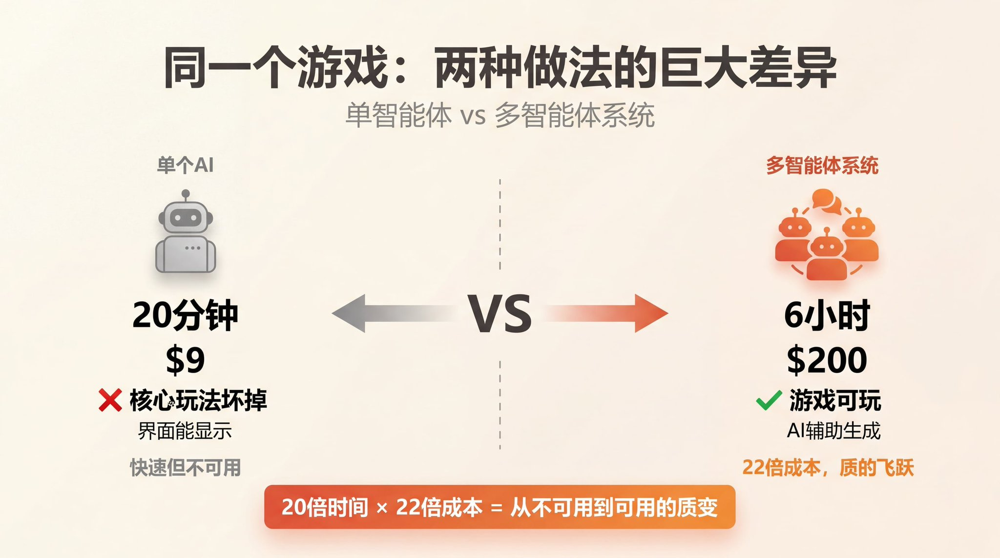
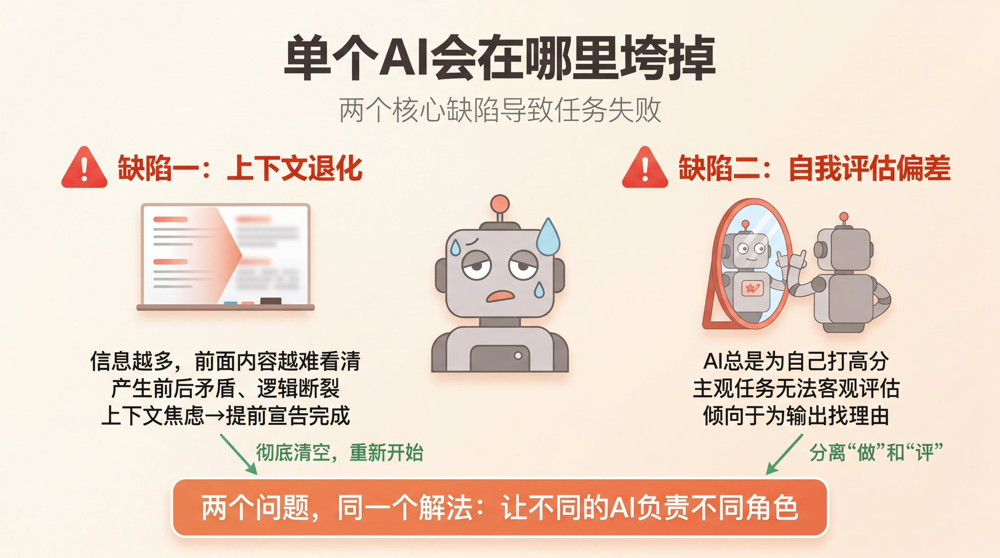

同一个游戏，$9 做出来的核心玩法是坏的，$200 做出来的能玩。 Anthropic 工程师用实战告诉你，多智能体协作框架是怎么工作的。

同一个任务，两种做法，结果让人无法忽视。

第一次：让一个 AI 单独去做，花了20分钟，花了 **9美元**。游戏界面出来了，但核心玩法是坏的，角色根本不响应操作。

第二次：用一套多智能体系统去做，花了6小时，花了 **200美元**。游戏能玩了，画面有质感，内置了 AI 辅助生成精灵图和关卡的功能。

20倍的时间、22倍的钱，换来的是什么？

这不是一篇吹嘘 AI 的文章。这是 Anthropic 工程师在实战中搞清楚的一件事：**要让 AI 真正做好长时间、复杂的任务，光靠一个聪明的模型是不够的。你需要设计一套系统。**

## 单个 AI 会在哪里垮掉

在搞清楚"系统怎么设计"之前，先要搞清楚"单个 AI 会在哪里出问题"。

总结下来，有两个核心缺陷。

**缺陷一：上下文退化**

AI 模型处理信息的方式，可以想象成一个白板。你往上面写的东西越多，前面的内容就越难看清楚。随着任务越来越长，模型会逐渐失去对整体目标的把握，开始产生前后矛盾、逻辑断裂。

有些模型甚至会产生"上下文焦虑"——它感觉白板快写满了，于是提前宣告"工作完成"，即使任务根本没完成。

解决这个问题的方式，不是压缩上下文，而是**彻底清空**，重新来过。给模型一块全新的白板继续工作。

**缺陷二：自我评估偏差**

让 AI 评估自己的作品，它几乎总是打高分。

对于客观任务（比如代码能不能跑）还好，因为有标准答案。但对于主观任务——比如设计好不好看、产品体验顺不顺——这个问题就很致命。AI 倾向于为自己的输出找理由，而不是真正挑剔它。

这两个问题，指向同一个解法：把"做"和"评"分开，让不同的 AI 负责。

## 从 GAN 借来的思路

一个 GAN（生成对抗网络）由两个网络组成：生成器和判别器。生成器负责造假，判别器负责打假。两者对抗训练，生成器越来越能骗过判别器，判别器也越来越能识别造假。

这种"对抗"的思路，恰好可以用来解决 AI 的自我评估偏差问题。

Anthropic 的工程师把这种思路迁移到了 AI 任务执行上：

- **生成器 Agent**：负责执行任务，产出结果
- **判别器 Agent**：负责评估结果，挑毛病

两者分工明确，互相独立。判别器不会因为"已经花了20分钟"就手下留情，生成器也不会因为"这是我做的"就拒绝修改。

## 多智能体系统的基本结构

基于这个思路，Anthropic 工程师搭建了一套多智能体协作框架。核心组件有三个：

**1. 规划器（Planner）**

负责把大任务拆成小任务。它需要理解用户需求，把"做一个游戏"拆成"设计游戏机制"、"实现核心逻辑"、"制作美术资源"、"测试与调优"等步骤。

规划器不执行任何任务，只负责规划和分配。

**2. 执行器（Executor）**

负责具体执行。每个执行器拿到自己的任务后，独立工作，互不干扰。

多个执行器可以并行，也可以串行。关键是要保持各自的上下文干净，不被其他执行器的产出污染。

**3. 评估器（Evaluator）**

负责检验结果。它会拿到执行器的产出，然后按照预设的标准进行评估。

评估器可以是：
- 自动评估：代码能不能跑、单元测试过不过关
- 人工评估：设计好不好看、体验顺不顺
- AI 评估：但要选择与执行器不同的模型，避免偏差

## 关键设计原则

### 原则一：任务边界要清晰

每个执行器执行的任务，要有明确的输入和输出定义。模糊的任务边界会导致：

- 执行器之间互相依赖，变成串行
- 上下文污染，一个执行器的产出影响了另一个
- 无法并行，失去效率优势

### 原则二：评估标准要客观

如果评估标准本身是主观的（比如"好不好看"），那评估器很难做到公正。

解决方案是：
- 尽可能把主观标准客观化（"点击率是否提升"、"用户留存是否增加"）
- 当无法客观化时，使用独立的第三方评估器
- 人工介入的关键节点，保持人工最终决策权

### 原则三：上下文要隔离

这是最容易出问题的地方。

当一个执行器完成了自己的任务，下一个执行器开始工作时，应该拿到的是：
- 任务的原始需求
- 自己任务的明确指示
- 必要的上下文信息

而不应该是：
- 上一个执行器的完整思考过程
- 所有历史产出的大杂烩
- 来自多个执行器的相互矛盾的反馈

## 实际应用场景

这种框架适合什么样的任务？

**适合的场景：**
- 复杂的多步骤任务（需要规划、执行、验证多个环节）
- 主观评估为主的任务（设计、创意、内容创作）
- 需要并行加速的任务（多个子任务可以同时执行）
- 需要质量控制的任务（不能接受明显错误）

**不太适合的场景：**
- 单步骤的简单任务（一个 prompt 能解决的不需要多智能体）
- 有明确客观标准的任务（自动化测试能解决的不需要 AI 评估）
- 实时性要求高的任务（多智能体开销太大）

## 成本与时间的平衡

回到开头那个例子：

- 单 AI：20分钟，9美元
- 多智能体：6小时，200美元

20倍的时间、22倍的成本，换来了什么？

换来的是一个真正能玩的游戏，而不是一个界面好看但核心玩法坏掉的半成品。

对于原型验证、头脑风暴、快速迭代的场景，单 AI 足够了。

对于要交付、要上线、要用户买单的产品，多智能体系统的成本是值得的。

## 总结

让 AI 做好复杂任务的关键，不是找一个更聪明的模型，而是设计一套更合理的系统。

核心要点：

1. **分离"做"和"评"**：用两个独立的 Agent，一个执行，一个评估
2. **清晰的边界**：每个 Agent 的任务要定义清楚，避免上下文污染
3. **客观的评估**：把主观标准客观化，或者使用独立的第三方评估
4. **上下文隔离**：每个 Agent 拿到的是任务需求，不是其他 Agent 的思考过程
5. **成本意识**：不是所有任务都需要多智能体，按需使用

想让 AI 从"能跑"到"能交付"，你需要的不只是更贵的模型，而是一套更合理的工作流系统。

<blockquote>
  原文地址：<a href="https://x.com/berryxia/status/2036605929899302950">https://x.com/berryxia/status/2036605929899302950</a>
</blockquote>
