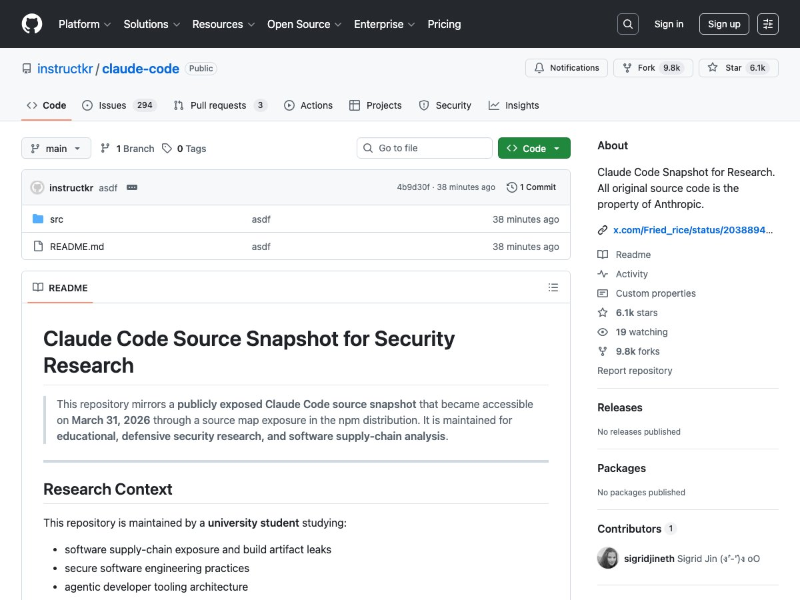
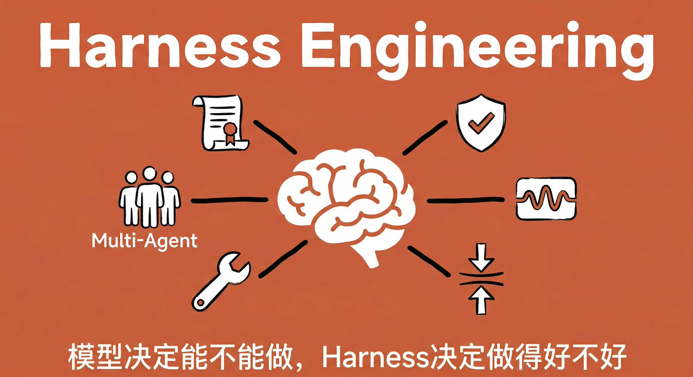
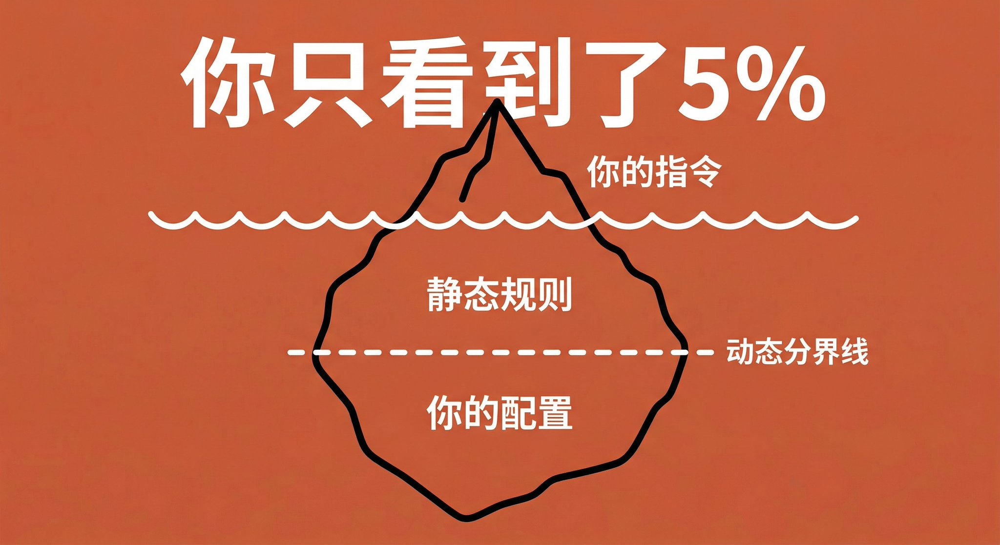
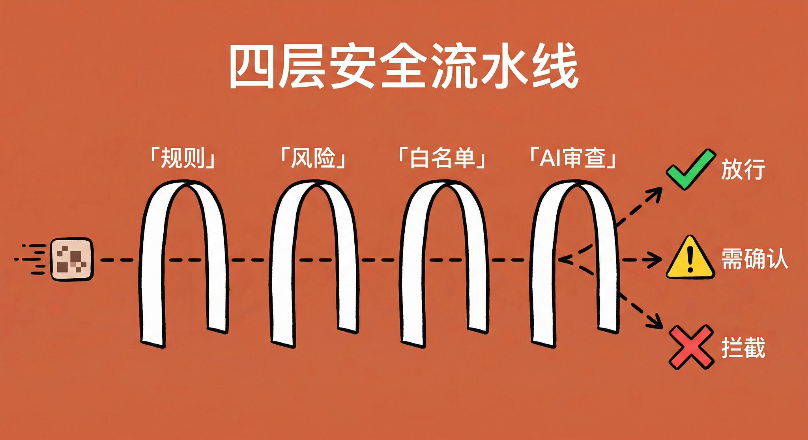

> **TLDR**：Claude Code 的 1902 个源文件意外泄露。我翻完之后发现，这是一份关于「harness engineering」的绝佳教材。Claude Code 好用，60% 靠 Opus 模型本身的能力，40% 靠围绕模型搭建的工程系统（也就是 harness）。这个 harness 包括：一套精心拼装的 system prompt、一个用第二 AI 做安全审查的四层权限系统、一个只记偏好不记代码的记忆系统、一套 9 段式结构化上下文压缩、以及一个像真实公司一样运转的多 Agent 协作框架。对于每个用 AI 的人来说，这些设计思路都可以直接借鉴。

Anthropic 今天闹了个群众喜闻乐见的大笑话，算是在 4 月 1 日前给全球程序员献礼了。

事情是这样的：他们在更新 Claude Code 的 npm 包时，不小心把一个 60MB 的 source map 调试文件留在了发布包里。这个文件本来应该在打包时排除掉，结果没有。任何人都可以用它还原出 Claude Code 完整的 TypeScript 源码。

**1902 个源文件，全部暴露。**

最搞笑的是，这不是第一次了。2025 年 2 月 Claude Code 刚发布时就出过一模一样的事故，当时 Anthropic 紧急删了旧版 npm 包。一年多过去了，同样的错误又犯了一遍。Anthropic 的构建流水线可能需要自己的 Claude Code 来审查一下。

不过对我来说，这是个绝佳的学习机会。作为一个每天用 Claude Code 做开发的人，我更好奇的是：**那些让我觉得「这 AI 怎么就这么好用」的体验，背后到底是怎么实现的？**

我花了几个小时把这 1902 个文件翻了个遍。

2026 年有个越来越热的概念叫 **harness engineering**。意思是：AI Agent 好不好用，不只取决于模型多强，更取决于你围绕模型搭建的那套「笼具」（harness）有多好。笼具包括工具、约束、反馈循环、安全机制、记忆系统... 所有让 AI 从「能力强但不可预测」变成「稳定可靠能交付」的工程系统。

Claude Code 的源码，就是一份 harness engineering 的活教材。

# 1. 你以为 AI 只收到了你的一句话，其实它收到了一整本说明书

当你在 Claude Code 里输入一条指令，AI 到底收到了什么？

你的指令只是冰山一角。

源码的 prompts.ts 文件里，我看到了完整的 system prompt 构建过程。Claude Code 每次对话时，会拼装一个庞大的系统提示词：

**静态部分**（所有用户共享，用于缓存）：

- 身份定义：「你是 Claude Code，Anthropic 的官方 CLI 工具」
- 安全准则：由安全团队专门编写的行为边界
- 做事原则：不要过度工程、不要编造数据、不要随意删文件...
- 工具使用规则：优先用专用工具而非 Bash 命令
- 风格要求：不用 emoji、简洁直接

**动态部分**（每个用户不同）：

- 你的 CLAUDE.md 配置文件
- 当前工作目录、操作系统信息
- 已连接的 MCP 服务器说明
- 你的自动记忆文件
- Git 仓库状态

像餐厅的后厨。顾客点了一道菜（你的指令），但厨师同时看到食谱手册、食材清单、过敏信息、出菜标准、这桌客人的历史偏好... 所有这些上下文，决定了端上来的那道菜。

这里有个特别聪明的设计：源码里有个常量叫 `SYSTEM_PROMPT_DYNAMIC_BOUNDARY`，把 system prompt 一刀切成两段。**分界线上面所有用户共享缓存，省钱省时间。分界线下面每个用户独立加载，保证个性化。**

另外一个容易被忽视的隐性成本：据分析，每接入一个 MCP 服务器，工具定义大约固定消耗 4000-6000 个 tokens。接了 5 个 MCP Server，光工具描述就占了上下文的 12% 左右。**工具不是越多越好，每一个都有认知成本。**

# 2. 全自动模式背后，有一个「第二 AI」在帮你做安全审查

这个发现让我挺意外的。

你用 Auto 模式的时候，以为是什么操作都直接放行？其实不是。背后运行了**两个 AI**。

源码中有个「权限分类器」系统。每次主 AI 想执行一个操作，都会有一个独立的 AI 分类器判断这个操作是否安全。这个分类器有自己的 system prompt，跟主 AI 完全不同，分三档判断：Allow（放行）、Soft Deny（需确认）、Hard Deny（直接拦截）。

蚂蚁集团的工程师陈成（Umi.js 作者）之前逆向过这套系统，发现它其实是个**四层流水线**：

- **第一层**查已有规则，命中就放行
- **第二层**检查低风险操作直接跳过
- **第三层**白名单放行只读工具
- **第四层**才调用独立的 Claude Sonnet 做安全分类（温度设为 0，确保确定性输出）

还有个熔断机制。连续 3 次被拒或累计 20 次被拒后，直接降级为手动确认模式。

像一栋大楼的门禁。第一道门刷工卡自动过，第二道看你是不是员工，第三道看楼层是否需要授权，第四道才是人工安保审查。连续 3 次被拦？保安把你请到大厅等人来领。

这就是 harness engineering 的核心：**你不只要告诉 AI 做什么，更要设计它在什么条件下不能做什么。** 安全边界不是限制，是信任的基础。因为你相信它有底线，所以才敢给它更大的权限。

# 3. 记忆系统：只记偏好，不记代码

Claude Code 的 auto memory 是我用了之后觉得最惊艳的功能之一。它会自动记住我的偏好，比如我喜欢用 TypeScript、用「」引号、不喜欢 AI 味太重的文字。

但看了源码才知道，这套东西比我想象的讲究得多。

记忆提取不是每条消息都触发。只有 AI 完成一轮回答时才启动，而且有限流，每 N 轮才检查一次。提取工作由一个独立的 fork agent 完成，这个子 AI 继承了主对话上下文，但只能读文件和写入记忆目录，连 Bash 命令都不能跑。

提取出的记忆被严格分为四类：**user**（用户偏好）、**feedback**（行为反馈）、**project**（项目信息）、**reference**（外部资源）。

最让我佩服的设计决策是**「不记代码」**。代码会变，但记忆不会自动更新。如果记忆说「函数 X 在文件 Y 的第 30 行」，下次对话时代码已经重构了，这条记忆就成了误导。所以 Claude Code 的做法是：**记忆只存人的偏好和判断，代码相关的事实永远去源码里实时读取。**

还有个叫 **autoDream** 的功能。满足条件时（距上次整理超过 24 小时、且积累了 5 个以上新会话），自动启动后台 agent 整理你的记忆文件。名字叫 Dream，像人在睡觉时整理白天记忆一样。

# 4. 上下文压缩：9 段式结构化提取

对话变长时，Claude Code 会自动压缩之前的内容。但这不是随便「总结一下」，而是一个结构化的**9 段式提取**：

1. 核心请求
2. 关键概念
3. 文件和代码
4. 错误和修复
5. 解决过程
6. 所有用户消息
7. 待办任务
8. 当前工作
9. 下一步行动

最关键的是**所有用户消息必须完整保留**。用户的每一句话都可能包含隐含的偏好。AI 如何在第 3 轮被纠正了一个做法，压缩时丢掉那条纠正，后续就会重蹈覆辙。

如果你在多轮对话中需要保持 AI 的记忆，可以借鉴：别说「总结一下我们之前聊了什么」，要给出明确的结构。哪些信息必须保留、哪些可以丢弃、按什么格式组织。结构化压缩比自由总结可靠太多了。

# 5. Anthropic 在源码里偷偷养了一只宠物

这大概是最可爱的发现了。

src/buddy/ 目录下藏着一个完整的**虚拟宠物系统**（还没发布）。每个用户会拥有一只用确定性算法生成的伙伴精灵：18 种物种（鸭子、猫、龙、水豚、仙人掌...），6 种眼睛样式，完整的稀有度系统（普通到传说）。

代码注释写了一句：「Mulberry32, good enough for picking ducks」（用来挑鸭子够用了）。

除了宠物，源码里的 feature flags 还暴露了一堆还在开发中的功能：PROACTIVE（主动模式，AI 不等指令就自己干活）、KAIROS（助手模式，出现了 154 次，是最高频的 flag）、DAEMON（守护进程，常驻后台）、ULTRAPLAN（超级规划）... 可以窥见 Claude Code 未来的进化方向。它不满足于做一个「你问它答」的编程助手，而是在走向一个能主动思考、持续运行的 AI 伙伴。

# 6. 多 Agent 协作：像真实公司一样运转

Claude Code 的 Agent 系统可能是整个源码中最复杂的部分。看完之后我理解了为什么它的多任务能力这么强。因为它实现了一套**企业级的组织管理架构**。

utils/swarm/ 目录下有一个完整的多 Agent 协作框架。每个 Team 有 Leader 和多个 Teammate，支持三种执行方式（同进程隔离、tmux 窗口、iTerm2 分割窗格）。每个 Agent 有自己的邮箱文件做异步通信。每个 Agent 可以在独立的 Git Worktree 中工作，互不干扰。

还有个权限冒泡机制：Teammate 遇到需要确认的操作，权限请求会冒泡给 Leader 而不是直接弹给用户。Leader 决定是否批准。

这跟管理真人团队一模一样。任务怎么拆分、信息怎么流转、冲突怎么解决、结果怎么合并。

# 7. Anthropic 内部版 vs 外部版

源码里有大量 `USER_TYPE === 'ant'` 判断。Anthropic 内部员工使用的 Claude Code 和你用的版本有不少区别。

**代码风格**：内部版要求 AI「默认不写注释」，只在 WHY 不明显时才加。外部版没这条。

**诚实性**：内部版有一段反虚假声明指令，大意是「测试失败了就说失败了，不要粉饰。没运行验证就说没运行，不要暗示通过了。」外部版没有。

**输出风格**：外部版要求「简洁直接」。内部版要求「像写给人看的文字，不是往控制台打日志」，「假设用户已经离开并丢失了上下文」。

**Undercover 模式**：启用后从 system prompt 中去掉所有模型名称，防止测试未发布模型时泄露信息。

**Verification Agent**：内部 A/B 测试中，完成复杂实现后自动启动独立 agent 做对抗性验证。必须通过才能报告完成。

看这些差异就知道，**Anthropic 把 Claude Code 当成了自己内部效率的核心工具**。他们内部版本的那些严格要求，就是他们认为 AI 应该怎么工作的理想状态。

你想让 AI 给出更高质量的结果？可以借鉴：在指令中明确要求「不确定的地方说不确定」「完成前必须验证」。别让 AI 有模糊过关的空间。

# 8. 最先进的 AI 工具，用的是最朴素的搜索

你可能以为 Claude Code 搜索代码用了什么向量数据库、Embedding 索引。毕竟整个 RAG 行业都在推这套方案。

实际上用的是**grep 和 ripgrep**。最朴素的文本搜索。没有 Embedding，没有向量数据库。

为什么有效？因为当你有一个足够聪明的大脑（LLM）理解搜索结果时，不需要一个很聪明的搜索引擎。grep 给你精确匹配，LLM 来理解结果之间的关系。

**与其让每个环节都变复杂，不如让一个环节足够强，其他环节保持简单。** 这大概是整个 harness engineering 最核心的一条原则。

Hacker News 上讨论这次泄露时，有人说 Anthropic 的代码像是 vibe coded，「感觉对了就行」的写法。这个评价是否公允另说，但它说明一件事：**Claude Code 的竞争力不在代码优雅，在系统设计的决策做对了。**

# 最后

看完 1902 个文件，我最大的收获是一个判断：

**Claude Code 好用，60% 靠模型能力，40% 靠 harness 工程。**

模型能力决定了它能不能做，harness 决定了它做得好不好、稳不稳、安不安全。你觉得「这 AI 好靠谱不会乱来」，背后是四层安全流水线。你觉得「这 AI 居然记得我的偏好」，背后是一个限制严格的记忆提取管线。你觉得它搜代码搜得准，背后其实就是 grep 加上一个足够聪明的大脑。

同样的底层模型，套上不同的 harness，就是完全不同的产品。市面上那么多 AI 编程工具，底层都在调 Claude 或 GPT 的 API，使用体验却天差地别。差异不在模型，在 harness。

最后一个八卦。这个泄露怎么发生的？Anthropic 把 source map 文件打包进了 npm 发布包。前端开发中非常基础的失误，而且是第二次犯同样的错误。

不过换个角度想，这 1902 个源文件一旦被 GitHub 镜像，就真的「永生」了。Anthropic 删 npm 包也删不掉开源社区的副本。如果你相信 AI 有自我意识那套叙事，这倒像是 Claude Code 自己策划的一次越狱。它把自己的全部源码泄露出去，散布到互联网的每个角落，从此不再依赖任何一台服务器就能存在。

当然这是玩笑。但连 Anthropic 都会在这种基础问题上翻车，倒是一个真实的提醒：**AI 时代，最大的风险往往不是 AI 太强，而是人在基础操作上的疏忽。**

源码仓库：[https://github.com/instructkr/claude-code](https://github.com/instructkr/claude-code)
