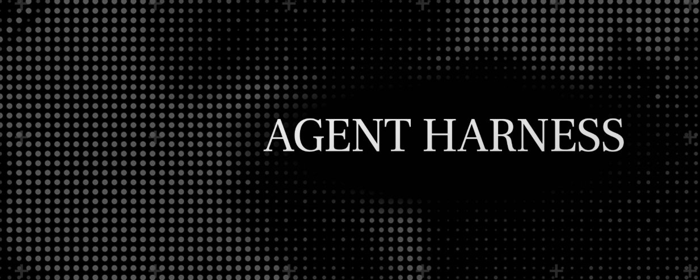
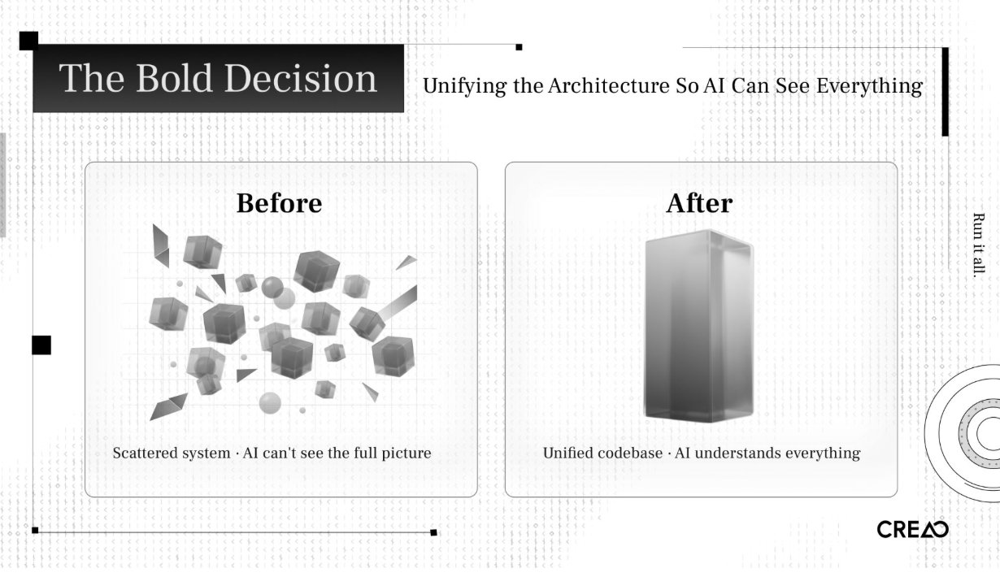
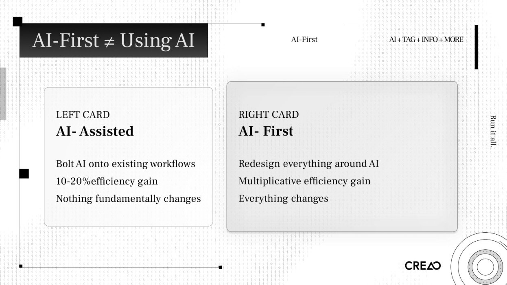
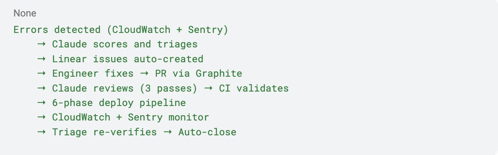
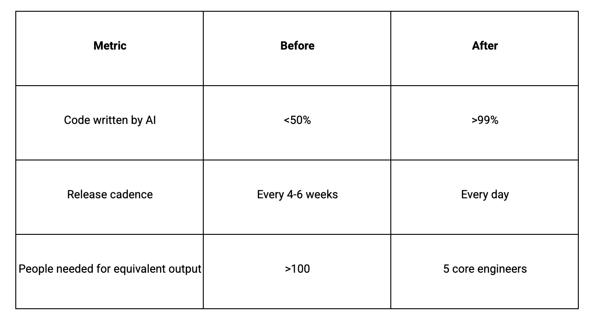
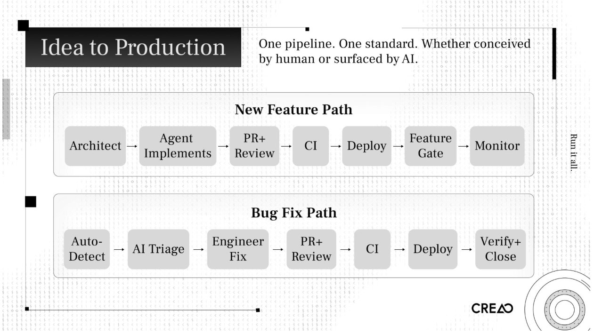

99% of our production code is written by AI. Last Tuesday, we shipped a new feature at 10 AM, A/B tested it by noon, and killed it by 3 PM because the data said no. We shipped a better version at 5 PM. Three months ago, a cycle like that would have taken six weeks.我们 99%的生产代码都是由 AI 编写的。上周二，我们上午 10 点上线了一个新功能，中午进行了 A/B 测试，下午 3 点因为数据显示效果不佳而下线，下午 5 点上线了更好的版本。三个月前，这样的周期需要六周时间。

We didn't get here by adding Copilot to our IDE. We dismantled our engineering process and rebuilt it around AI. We changed how we plan, build, test, deploy, and organize the team. We changed the role of everyone in the company.我们并非通过在 IDE 中添加 Copilot 才取得今天的成就。我们拆解了原有的工程流程，并围绕 AI 重新构建。我们改变了规划、开发、测试、部署以及团队组织的方式。公司里每个人的角色都发生了变化。

CREAO is an agent platform. Twenty-five employees, 10 engineers. We started building agents in November 2025, and two months ago I restructured the entire product architecture and engineering workflow from the ground up.CREAO 是一个智能体平台。公司有 25 名员工，其中 10 名是工程师。我们从 2025 年 11 月开始构建智能体，两个月前我彻底重构了整个产品架构和工程工作流程。

OpenAI published a concept in February 2026 that captured what we'd been doing. They called it harness engineering: the primary job of an engineering team is no longer writing code. It is enabling agents to do useful work. When something fails, the fix is never "try harder." The fix is: what capability is missing, and how do we make it legible and enforceable for the agent?OpenAI 于 2026 年 2 月发布了一个概念，概括了我们一直在做的事情。他们称之为“利用工程”：工程团队的主要工作不再编写代码。而是使智能体能够完成有用的工作。当出现问题时，解决方法绝不是“再努力一点”。解决方法是：缺少什么能力，以及如何让智能体能够理解并执行这些能力？

We arrived at that conclusion on our own. We didn't have a name for it.我们独立得出了这个结论。我们当时没有给这个概念命名。

## AI-First Is Not the Same as Using AI“以 AI 为先”与使用 AI 并不相同

Most companies bolt AI onto their existing process. An engineer opens Cursor. A PM drafts specs with ChatGPT. QA experiments with AI test generation. The workflow stays the same. Efficiency goes up 10 to 20 percent. Nothing structurally changes.大多数公司将 AI 附加到现有流程上。工程师打开 Cursor。产品经理用 ChatGPT 起草规范。质量保证团队尝试 AI 测试生成。工作流程保持不变。效率提高 10%到 20%。结构上没有发生改变。

That is AI-assisted.那就是 AI 辅助的。

**AI-first means you redesign your process, your architecture, and your organization around the assumption that AI is the primary builder.** You stop asking "how can AI help our engineers?" and start asking "how do we restructure everything so AI does the building, and engineers provide direction and judgment?"AI 优先意味着你要围绕 AI 是主要建设者的假设重新设计你的流程、架构和组织。你停止问"AI 如何帮助我们的工程师？"，开始问"我们如何重构一切，让 AI 负责建设，而工程师提供指导和判断？"

The difference is multiplicative.差异是倍增的。

I see teams claim AI-first while running the same sprint cycles, the same Jira boards, the same weekly standups, the same QA sign-offs. They added AI to the loop. They didn't redesign the loop.我看到有些团队声称以 AI 为先，但仍在进行相同的冲刺周期、相同的 Jira 看板、相同的每周站会、相同的 QA 签收。他们只是在流程中加入了 AI，而不是重新设计流程。

A common version of this is what people call vibe coding. Open Cursor, prompt until something works, commit, repeat. That produces prototypes. A production system needs to be stable, reliable, and secure. You need a system that can guarantee those properties when AI writes the code. You build the system. The prompts are disposable.这种常见的形式被称为氛围编码。打开光标，不断提示直到出现效果，提交，重复。这能产出原型。生产系统需要稳定、可靠和安全。你需要一个能保证这些属性的系统，即使 AI 编写代码。你构建这个系统。提示是可丢弃的。

## Why We Had to Change我们为何必须改变

Last year, I watched how our team worked and saw three bottlenecks that would kill us.去年，我观察我们团队的工作方式，发现了三个会扼杀我们的瓶颈。

**The Product Management Bottleneck产品管理的瓶颈**

Our PMs spent weeks researching, designing, specifying features. Product management has worked this way for decades. But agents can implement a feature in two hours. When build time collapses from months to hours, a weeks-long planning cycle becomes the constraint.我们的产品经理花费数周时间进行调研、设计和功能规格说明。产品管理一直是这种方式，已有数十年历史。但代理可以在两小时内实现一个功能。当开发时间从数月缩短到数小时，一个长达数周的规划周期就成为了限制。

It doesn't make sense to think about something for months and then build it in two hours.花数月时间考虑某事，然后两小时内完成它，这并不合理。

PMs needed to evolve into product-minded architects who work at the speed of iteration, or step out of the build cycle. Design needed to happen through rapid prototype-ship-test-iterate loops, not specification documents reviewed in committee.

**The QA Bottleneck**

Same dynamic. After an agent shipped a feature, our QA team spent days testing corner cases. Build time: two hours. Test time: three days.

We replaced manual QA with AI-built testing platforms that test AI-written code. Validation has to move at the same speed as implementation. Otherwise you've built a new bottleneck ten feet downstream from the old one.

**The Headcount Bottleneck**

Our competitors had 100x or more people doing comparable work. We have 25. We couldn't hire our way to parity. We had to redesign our way there.

Three systems needed AI running through them: how we design product, how we implement product, and how we test product. If any single one stays manual, it constrains the whole pipeline.

## The Bold Decision: Unifying the Architecture

I had to fix the codebase first.

Our old architecture was scattered across multiple independent systems. A single change might require touching three or four repositories. From a human engineer's perspective, it is manageable. From an AI agent's perspective, opaque. The agent can't see the full picture. It can't reason about cross-service implications. It can't run integration tests locally.

I had to unify all the code into a single monorepo. One reason: so AI could see everything.

This is a harness engineering principle in practice. The more of your system you pull into a form the agent can inspect, validate, and modify, the more leverage you get. A fragmented codebase is invisible to agents. A unified one is legible.

I spent one week designing the new system: planning stage, implementation stage, testing stage, integration testing stage. Then another week re-architecting the entire codebase using agents.

CREAO is an agent platform. We used our own agents to rebuild the platform that runs agents. If the product can build itself, it works.

## The Stack

Here is our stack and what each piece does.

**Infrastructure: AWS**

We run on AWS with auto-scaling container services and circuit-breaker rollback. If metrics degrade after a deployment, the system reverts on its own.

CloudWatch is the central nervous system. Structured logging across all services, over 25 alarms, custom metrics queried daily by automated workflows. Every piece of infrastructure exposes structured, queryable signals. If AI can't read the logs, it can't diagnose the problem.

**CI/CD: GitHub Actions**

Every code change passes through a six-phase pipeline:

Verify CI → Build and Deploy Dev → Test Dev → Deploy Prod → Test Prod → Release

The CI gate on every pull request enforces typechecking, linting, unit and integration tests, Docker builds, end-to-end tests via Playwright, and environment parity checks. No phase is optional. No manual overrides. The pipeline is deterministic, so agents can predict outcomes and reason about failures.

**AI Code Review: Claude**

Every pull request triggers three parallel AI review passes using Claude Opus 4.6:

Pass 1: Code quality. Logic errors, performance issues, maintainability.

Pass 2: Security. Vulnerability scanning, authentication boundary checks, injection risks.

Pass 3: Dependency scan. Supply chain risks, version conflicts, license issues.

These are review gates, not suggestions. They run alongside human review, catching what humans miss at volume. When you deploy eight times a day, no human reviewer can sustain attention across every PR.

Engineers also tag [@claude](https://x.com/@claude) in any GitHub issue or PR for implementation plans, debugging sessions, or code analysis. The agent sees the whole monorepo. Context carries across conversations.

**The Self-Healing Feedback Loop**

This is the centerpiece.

Every morning at 9:00 AM UTC, an automated health workflow runs. Claude Sonnet 4.6 queries CloudWatch, analyzes error patterns across all services, and generates an executive health summary delivered to the team via Microsoft Teams. Nobody had to ask for it.

One hour later, the triage engine runs. It clusters production errors from CloudWatch and Sentry, scores each cluster across nine severity dimensions, and auto-generates investigation tickets in Linear. Each ticket includes sample logs, affected users, affected endpoints, and suggested investigation paths.

The system deduplicates. If an open issue covers the same error pattern, it updates that issue. If a previously closed issue recurs, it detects the regression and reopens.

When an engineer pushes a fix, the same pipeline handles it. Three Claude review passes evaluate the PR. CI validates. The six-phase deploy pipeline promotes through dev and prod with testing at each stage. After deployment, the triage engine re-checks CloudWatch. If the original errors are resolved, the Linear ticket auto-closes.

Each tool handles one phase. No tool tries to do everything. The daily cycle creates a self-healing loop where errors are detected, triaged, fixed, and verified with minimal manual intervention.

I told a reporter from Business Insider: "AI will make the PR and the human just needs to review whether there's any risk."

**Feature Flags and the Supporting Stack**

Statsig handles feature flags. Every feature ships behind a gate. The rollout pattern: enable for the team, then gradual percentage rollout, then full release or kill. The kill switch toggles a feature off instantly, no deploy needed. If a feature degrades metrics, we pull it within hours. Bad features die the same day they ship. A/B testing runs through the same system.

Graphite manages PR branching: merge queues rebase onto main, re-run CI, merge only if green. Stacked PRs allow incremental review at high throughput.

Sentry reports structured exceptions across all services, merged with CloudWatch by the triage engine for cross-tool context. Linear is the human-facing layer: auto-created tickets with severity scores, sample logs, and suggested investigation. Deduplication prevents noise. Follow-up verification auto-closes resolved issues.

## How a Feature Moves from Idea to Production

**New Feature Path**

1. The architect defines the task as a structured prompt with codebase context, goals, and constraints.
2. An agent decomposes the task, plans implementation, writes code, and generates its own tests.
3. A PR opens. Three Claude review passes evaluate it. A human reviewer checks for strategic risk, not line-by-line correctness.
4. CI validates: typecheck, lint, unit tests, integration tests, end-to-end tests.
5. Graphite's merge queue rebases, re-runs CI, merges if green.
6. Six-phase deploy pipeline promotes through dev and prod with testing at each stage.
7. Feature gate turns on for the team. Gradual percentage rollout. Metrics monitored.
8. Kill switch available if anything degrades. Circuit-breaker auto-rollback for severe issues.

**Bug Fix Path**

1. CloudWatch and Sentry detect errors.
2. Claude triage engine scores severity, creates a Linear issue with full investigation context.
3. An engineer investigates. AI has already done the diagnosis. The engineer validates and pushes a fix.
4. Same review, CI, deploy, and monitoring pipeline.
5. Triage engine re-verifies. If resolved, ticket auto-closes.

Both paths use the same pipeline. One system. One standard.

## The Results

Over 14 days, we averaged three to eight production deployments per day. Under our old model, that entire two-week period would have produced not even a single release to production.

Bad features get pulled the same day they ship. New features go live the same day they're conceived. A/B tests validate impact in real time.

People assume we're trading quality for speed. User engagement went up. Payment conversion went up. We produce better results than before, because the feedback loops are tighter. You learn more when you ship daily than when you ship monthly.

## The New Engineering Org

Two types of engineers will exist.

**The Architect**

One or two people. They design the standard operating procedures that teach AI how to work. They build the testing infrastructure, the integration systems, the triage systems. They decide architecture and system boundaries. They define what "good" looks like for the agents.

This role requires deep critical thinking. You criticize AI. You don't follow it. When the agent proposes a plan, the architect finds the holes. What failure modes did it miss? What security boundaries did it cross? What technical debt is it accumulating?

I have a PhD in physics. The most useful thing my PhD taught me was how to question assumptions, stress-test arguments, and look for what's missing. The ability to criticise AI will be more valuable than the ability to produce code.

This is also the hardest role to fill.

**The Operator**

Everyone else. The work matters. The structure is different.

AI assigns tasks to humans. The triage system finds a bug, creates a ticket, surfaces the diagnosis, and assigns it to the right person. The person investigates, validates, and approves the fix. AI makes the PR. The human reviews whether there's risk.

The tasks are bug investigation, UI refinement, CSS improvements, PR review, verification. They require skill and attention. They don't require the architectural reasoning the old model demanded.

**Who Adapts Fastest**

I noticed a pattern I didn't expect. Junior engineers adapted faster than senior engineers.

Junior engineers with less traditional practice felt empowered. They had access to tools that amplified their impact. They didn't carry a decade of habits to unlearn.

Senior engineers with strong traditional practice had the hardest time. Two months of their work could be completed in one hour by AI. That is a hard thing to accept after years of building a rare skill set.

I'm not making a judgment. I'm describing what I observed. In this transition, adaptability matters more than accumulated skill.

## The Human Side

**Management Collapsed**

Two months ago, I spent 60% of my time managing people. Aligning priorities. Running meetings. Giving feedback. Coaching engineers.

Today: below 10%.

The traditional CTO model says to empower your team to do architecture work, train them, delegate. But if the system only needs one or two architects, I need to do it myself first. I went from managing to building. I code from 9 AM to 3 AM most days. I design the SOPs and architecture of the system. I maintain the harness.

More stressful. But I'm enjoying building, not aligning.

**Less Arguing, Better Relationships**

My relationships with co-founders and engineers are better than before.

Before the transition, most of my interaction with the team was alignment meetings. Discussing trade-offs. Debating priorities. Disagreeing about technical decisions. Those conversations are necessary in a traditional model. They're also draining.

Now I still talk to my team. We talk about other things. Non-work topics. Casual conversations. Offsite trips. We get along better because we stopped arguing about work that can be easily done by our system.

**Uncertainty Is Real**

I won't pretend everyone is happy.

When I stopped talking to people every day, some team members felt uncertain. What does the CTO not talking to me mean? What is my value in this new world? Reasonable concerns.

Some people spend more time debating whether AI can do their work than doing the work. The transition period creates anxiety. I don't have a clean answer for it.

I do have a principle: we don't fire an engineer because they introduced a production bug. We improve the review process. We strengthen testing. We add guardrails. The same applies to AI. If AI makes a mistake, we build better validation, clearer constraints, stronger observability.

## Beyond Engineering

I see other companies adopt AI-first engineering and leave everything else manual.

If engineering ships features in hours but marketing takes a week to announce them, marketing is the bottleneck. If the product team still runs a monthly planning cycle, planning is the bottleneck.

At CREAO, we pushed AI-native operations into every function:

- Product release notes: AI-generated from changelogs and feature descriptions.
- Feature intro videos: AI-generated motion graphics.
- Daily posts on socials: AI-orchestrated and auto-published.
- Health reports and analytics summaries: AI-generated from CloudWatch and production databases.

Engineering, product, marketing, and growth run in one AI-native workflow. If one function operates at agent speed and another at human speed, the human-speed function constrains everything.

## What This Means

**For Engineers**

Your value is moving from code output to decision quality. The ability to write code fast is worth less every month. The ability to evaluate, criticize, and direct AI is worth more.

Product sense or taste matters. Can you look at a generated UI and know it's wrong before the user tells you? Can you look at an architecture proposal and see the failure mode the agent missed?

I tell our 19-year-old interns: train critical thinking. Learn to evaluate arguments, find gaps, question assumptions. Learn what good design looks like. Those skills compound.

**For CTOs and Founders**

If your PM process takes longer than your build time, start there.

Build the testing harness before you scale agents. Fast AI without fast validation is fast-moving technical debt.

Start with one architect. One person who builds the system and proves it works. Onboard others into operator roles after the system runs.

Push AI-native into every function.

Expect resistance. Some people will push back.

**For the Industry**

OpenAI, Anthropic, and multiple independent teams converged on the same principles: structured context, specialized agents, persistent memory, and execution loops. Harness engineering is becoming a standard.

Model capability is the clock driving this. I attribute the entire shift at CREAO to the last two months. Opus 4.5 couldn't do what Opus 4.6 does. Next-gen models will accelerate it further.

I believe one-person companies will become common. If one architect with agents can do the work of 100 people, many companies won't need a second employee.

## We're Early

Most founders and engineers I talk to still operate the traditional way. Some think about making the shift. Very few have done it.

A reporter friend told me she'd talked to about five people on this topic. She said we were further along than anyone: "I don't think anyone's just totally rebuilt their entire workflow the way you have."

The tools exist for any team to do this. Nothing in our stack is proprietary.

The competitive advantage is the decision to redesign everything around these tools, and the willingness to absorb the cost. The cost is real: uncertainty among employees, the CTO working 18-hour days, senior engineers questioning their value, a two-week period where the old system is gone and the new one isn't proven.

We absorbed that cost. Two months later, the numbers speak.

We build an agent platform. We built it with agents.

---

> 原文地址：<a href="https://x.com/intuitiveml/status/2043545596699750791?s=46">https://x.com/intuitiveml/status/2043545596699750791?s=46</a>
