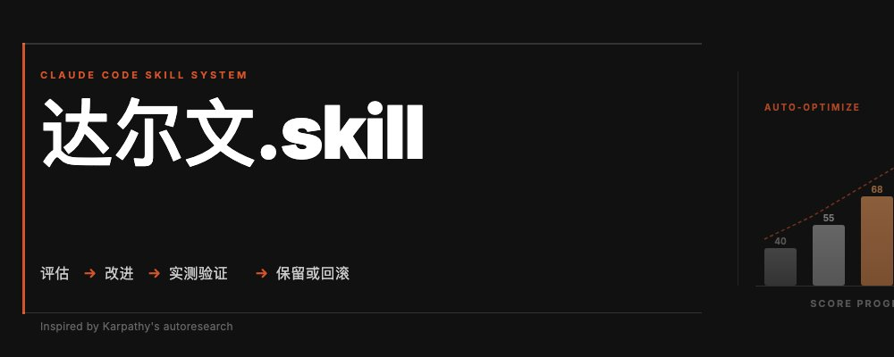
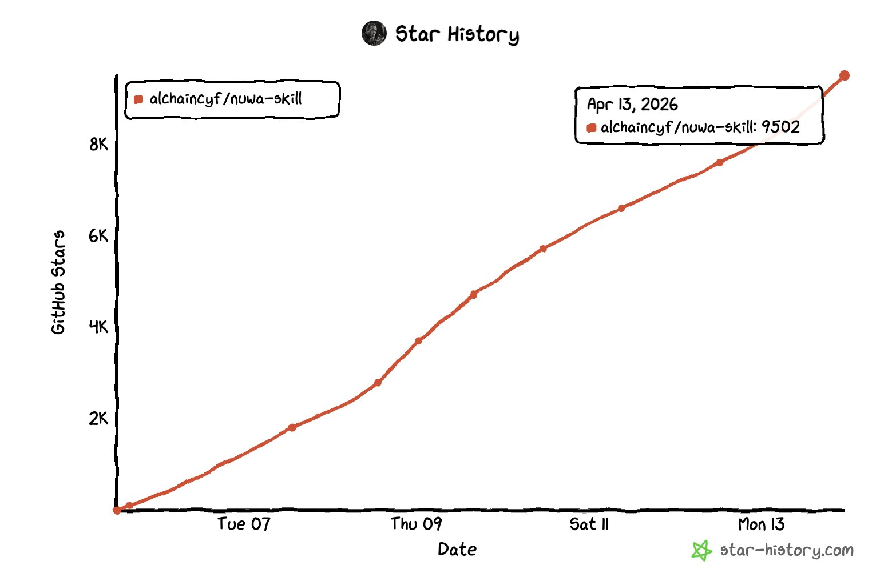
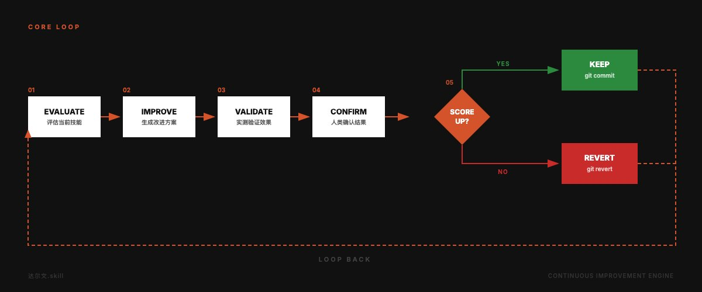
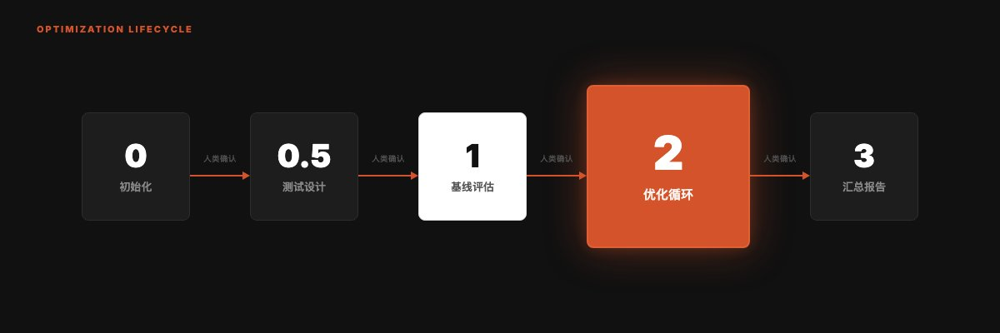
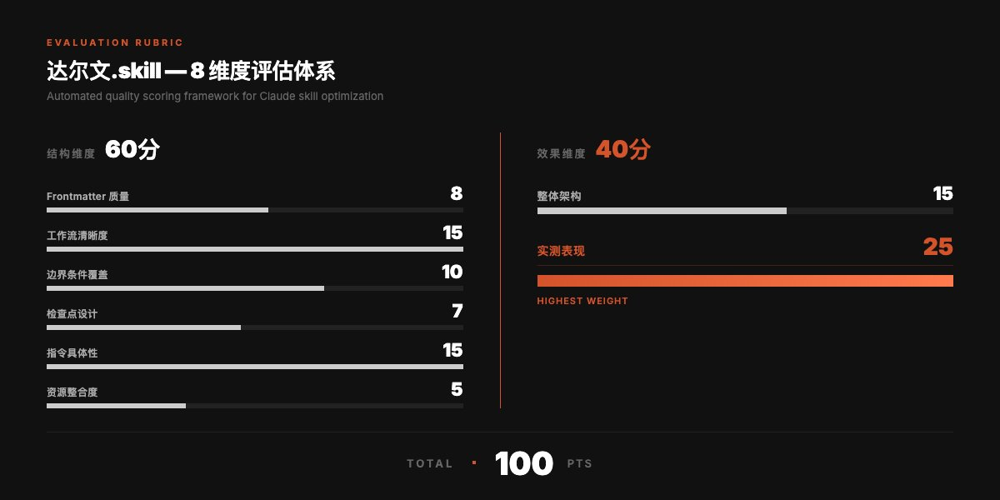
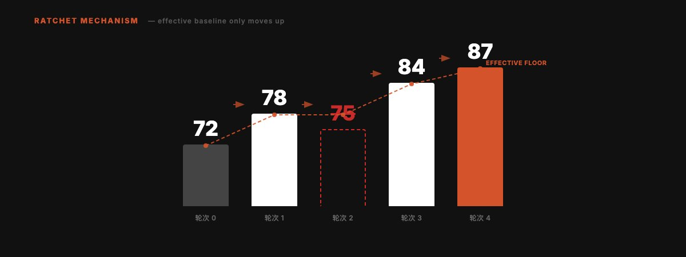
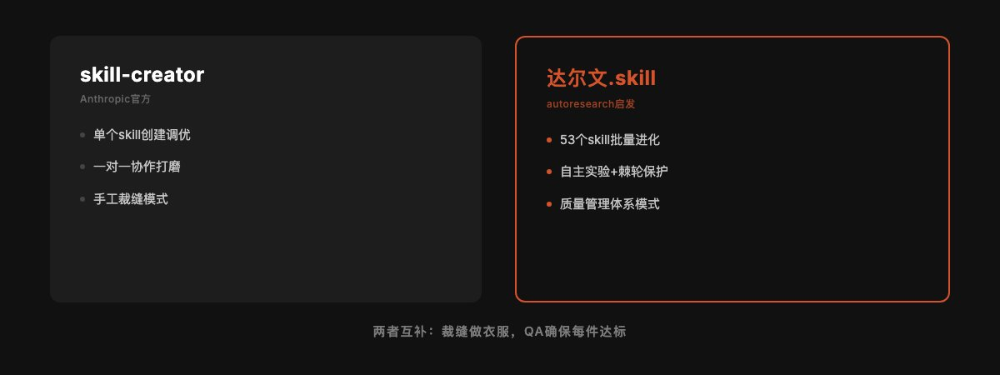
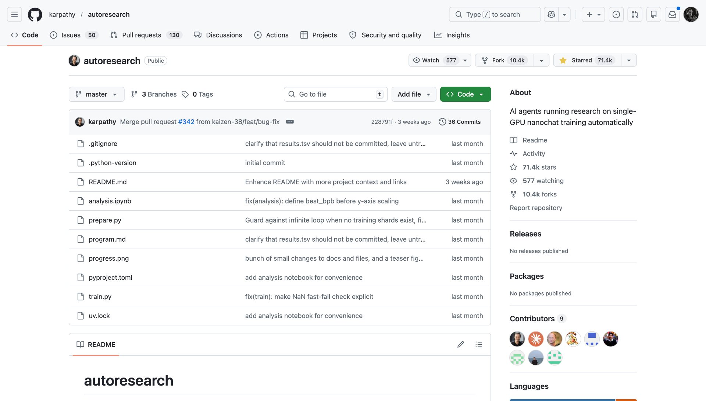
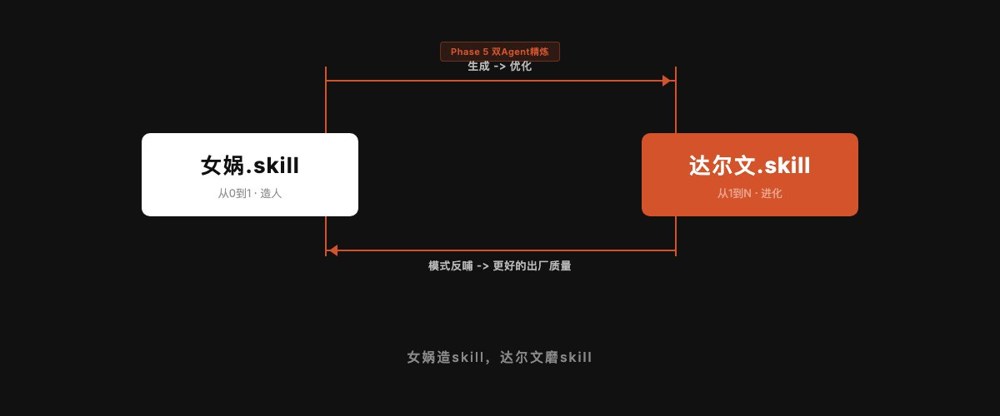

女娲.skill发布一周，GitHub star破了9000+

前两天接受新京报记者采访的时候，她问我这个skill花了多长时间制作完成的，我有点不好意思的说实际完成初步设计的过程只有2-3小时，但其实在这个过程中经过了无比多轮的迭代，而这个迭代单纯靠我自己完全没能力做到。

那...是怎么做到的呢？

其实就是在做了50多个自己日常使用的skill之后，我设计了一套让Skill可以自主完成进化，提升质量的系统。

一套进化体系。

我的53个skill是在不同时间、不同状态下写的。有些是凌晨三点灵感来了一口气写完的，有些是赶着deadline匆忙搭的。有些skill我用了上百次，迭代到第七八版。

这种状态在skill只有十几个的时候还能靠手感维护。但过了50个之后，手动维护就崩了。你不知道哪个skill的frontmatter写得不规范，哪个skill的工作流有步骤缺失，哪个skill看着结构完美但跑出来的效果其实很差。

我需要一个系统。

一个能自动评估所有skill质量、找出短板、提出改进、验证效果、只保留有用修改的系统。

然后我刷到了Karpathy的autoresearch。

## Karpathy那个7万star的项目，做了一件什么事

它做的事情用一句话就能说清楚：让AI自己跑实验、自己评估结果、只保留有改进的修改。一个只能向前转的棘轮。

具体来说：AI agent自动修改训练代码，跑5分钟看loss有没有下降，降了就保留这次修改（git commit），没降就回滚（git revert）。每小时大约12个实验，一晚上能跑100个。

Shopify的CEO拿它优化模板引擎，性能提升了53%。

看到这个项目的时候我愣了一下。**这个模式，不只能用来训练模型。它能用来优化任何有明确评估标准的东西。**

比如我的skill。

其实自然界早就在用这套逻辑了。达尔文的进化论本质上就是一个棘轮：随机变异产生候选方案，自然选择保留有利的、淘汰有害的，时间足够长，草履虫就变成了人。进化没有设计师，没有路线图，它唯一的规则就是「活下来的留下，死掉的消失」。

Karpathy做的事情，是把进化论工程化了。autoresearch里每一次实验就是一次随机变异，loss下降就是「活下来」，git revert就是「被自然淘汰」。你猜怎么着，这个逻辑放到skill上也完全成立。

所以我给这个skill取名叫达尔文。

## 我把autoresearch的思路搬到了Skill优化上

达尔文.skill的核心逻辑和autoresearch完全一样，只是换了优化对象。autoresearch优化的是训练代码，[达尔文优化的是SKILL.md](http://xn--skill-ft2ho2ventb7tcqb9z6gbj1d.md/)。autoresearch用loss判断好坏，达尔文用一套8维度的加权总分。两者都用git做版本控制：改好了commit，改差了revert。

但有一个关键区别。

autoresearch是全自主的。loss是一个数字，大就是大，小就是小，机器自己比就行。

Skill的「好坏」没这么简单。一个skill跑出来的结果好不好，有时候需要人来判断。所以我加了一个autoresearch里没有的东西：**Human in the Loop（人在回路）**​。每个skill优化完后系统会暂停，把改动的diff、分数变化、测试输出的对比摆出来，等我看过确认了才继续下一个。

这不是偷懒。有些判断，目前还是人比机器靠谱。

## 五条原则，每条都是踩坑踩出来的

写这个skill之前，我已经手动优化过38轮skill了。38次git commit，每次都是手动读skill、手动找问题、手动改、手动验证。

这38次下来，我摸出了5条原则：

**01 单一可编辑资产。** [每次只改一个SKILL.md](http://xn--skill-fg1hyj391boi3b7lmxxb.md/)。我早期犯过一次错：同时改了7个perspective skill的触发词和中文表达适配，结果有些变好了有些反而变差了，完全没法判断是哪个改动导致的。从那以后，一次一个，绝不贪多。

**02 双重评估。** 光看skill写得规不规范是不够的。我有个skill，格式完美、步骤清晰、frontmatter无可挑剔，但实际跑出来的效果还不如不加skill。纯结构审查发现不了这种问题。所以评估必须分两层：结构评分看「写得对不对」，实测评分看「用起来好不好」。

**03 棘轮机制。** 分数只能升不能降。改完之后比改前差了？git revert，当这次修改没发生过。这是autoresearch最优雅的设计，我直接搬过来了。

**04 独立评分。** 修改skill的agent不能是评分的agent。自己改完自己评，那不叫评估，叫年终自评里给自己打「超出预期」。必须让一个完全独立的子agent来打分。

你可能觉得这条多此一举。让改skill的agent自己评一下不就行了？2001年安然暴雷的时候，全世界才反应过来一件事：安然的审计师安达信，同时也是安然的咨询顾问。自己给自己审计，审了个寂寞。后来美国出了萨班斯法案，核心就一条：审计独立性。做账的和查账的必须是两拨人。道理放到AI agent身上一模一样。改skill的agent对自己的修改有天然的认知偏差，它会倾向于觉得自己改得不错。让另一个完全没参与修改过程的agent来评分，才能得到一个冷静的数字。

**05 人在回路。** 前面说过了。机器做初筛，人做终审。

## 8个维度，100分制

怎么给一个skill打分？我设计了8个维度，分成两组。

**结构维度占60分**​，考察6个方面：Frontmatter写得规不规范（8分），工作流是否步骤清晰（15分），有没有处理异常情况（10分），关键决策前有没有让用户确认（7分），指令够不够具体到可以直接执行（15分），引用的文件路径是否真的存在（5分）。

**效果维度占40分**​，只考察2个方面：整体架构是否合理（15分），以及最关键的，拿真实的测试prompt跑一遍，输出质量到底怎么样（25分）。

为什么实测表现的权重最高？因为一个skill可以在结构上拿满分，但跑出来一坨。反过来，一个写得粗糙但跑起来特别好用的skill，其实比格式完美但没用的skill有价值得多。

权重分配就是我的态度：**实际效果比纸面规范重要。**

## 优化循环长什么样

整个过程分5个阶段，但只有1个是核心。

前面的准备工作比较直接：初始化环境、为每个skill设计测试prompt、跑一遍基线评估建立起点分数。这些是Phase 0到Phase 1。

Phase 2是整个系统的心脏。它做的事情很简单：找到这个skill得分最低的维度，针对它改一个具体的东西，改完让独立子agent重新打分。涨了就留，没涨就revert。每个skill最多跑3轮。

Phase 3是汇总，输出一张Before/After的分数表。

每个阶段之间都有人类确认的检查点。系统不会闷头跑完所有步骤。

## 棘轮：我最喜欢的部分

举个例子。假设一个skill的基线分数是72。

第1轮优化后，分数涨到78。保留。 第2轮优化后，分数反而降到75。比当前最优的78还低。回滚。有效基线还是78。 第3轮换个方向优化，分数到84。保留。 第4轮继续，到87。保留。

最终：72 → 87，净提升15分。中间那次失败的尝试被干净地回滚了，不会留下任何痕迹。

棘轮的美感就在这里：你可以放心做实验，失败不会伤害你。只有成功会被保留。

我后来想了想，棘轮可能是人类发明过的最被低估的结构。科学是一个棘轮：你可以提出错误的假说，但一旦一个理论被证伪，它就永远出局了，人类的知识总量只会增加。民主制度设计里也藏着棘轮：权利一旦被写进宪法，收回去的成本就极高。甚至你的git历史本身就是一个棘轮：每个commit都是一个存档点，你永远可以回到任何一个过去的好状态。达尔文.skill只是把这个古老的结构，用在了一个很新的地方。

## 实际跑了一下，什么效果

我拿自己的skill做了实验。38次git commit的优化记录都在仓库里，挑几个典型的说说。

**huashu-slides**（做PPT的skill），5轮优化，是改动最多的一个。第一轮发现最大的问题是style-samples引用了一个不存在的目录，直接导致skill执行出错，改成可选引用后立刻提升。第二轮补充了Path B的错误处理和生成后必检清单。第三轮做了5种风格的实测，给每种风格标注了噪点风险分级。第四轮是防泄漏铁律，把所有base style精简为短模板。第五轮四项并行冲刺，目标90分。5轮下来，从一个「能用但随时可能翻车」的skill变成了「你可以去泡杯咖啡回来看结果」级别的可靠。

**comedy**（脱口秀编剧skill），优化前的问题很典型：风格选择没有结构，每次调用都要重新描述想要什么风格，跟每次去理发店都要从头解释「就上次那样」一个道理。优化后加了风格选择三方案制、推荐矩阵、反默认规则，还补了2个新风格的demo。一轮搞定，改动不大但效果很明显。

**7个perspective skill**（芒格、费曼、塔勒布、马斯克、道金斯、纳瓦尔、芒格），这是一次批量优化。先统一做了一轮角色扮演规则和身份卡的补充。第二轮扩展Frontmatter触发词和调研来源。第三轮添加示例对话提升实测表现。第四轮收紧触发词、加中文表达DNA适配。第五轮把参考内容拆分到references目录。5轮下来，每个perspective skill从「能用」变成了「风格稳定、不会漂移、有自检清单」。

但更重要的是过程中发现的共性问题。很多skill都缺少边界条件处理（如果用户给了一个模糊的输入怎么办？），很多skill的frontmatter描述太短（Claude不知道什么时候该触发这个skill），很多skill引用了不存在的文件路径。这些是手动维护时很难发现的模式。

## 和Anthropic官方skill-creator的区别

说到skill优化，可能有人会问：Anthropic官方不是有个skill-creator吗？

确实有，我也装了，经常用。skill-creator是一个很好的工具，它的流程是：捕获意图→访谈→写SKILL.md→跑测试→根据反馈迭代→优化触发描述。对于从零开始创建一个新skill来说，skill-creator是最佳选择。

但skill-creator解决的是**单个skill的创建和调优**​。它假设你坐在电脑前，一对一地和它协作打磨一个skill。

达尔文.skill解决的是另一个问题：**当你有53个skill的时候，怎么系统性地发现哪些该改、改什么、改了之后有没有变好。** 它是批量的、自主的、有棘轮保护的。

两者的关系更像是「手工裁缝」和「质量管理体系」。裁缝做衣服，QA确保每件衣服都达标。你不能让裁缝自己当QA，否则每件衣服都是「设计灵感」，没有一件叫「质量问题」。

事实上，我在达尔文的评估体系里就参考了skill-creator的一些标准，比如触发描述的覆盖度、测试prompt的设计方法。

## 女娲造人，达尔文进化

女娲.skill解决的是「从0到1」的问题：输入一个人名，输出一个可运行的思维框架。它是造人的。

达尔文.skill解决的是「从1到N」的问题：你已经有了一堆skill，怎么让它们全都变得更好？它是让所有人进化的。

如果女娲是一个工厂，达尔文就是这个工厂的质检+持续改进系统。

其实达尔文的机制已经融入了女娲的生产流程。如果你用过女娲.skill，你可能注意到它生成完一个skill之后不会直接交给你，而是会自动启动一个「Phase 5双Agent精炼」。这个精炼阶段里，Agent A用的就是达尔文的8维度评估体系（工作流清晰度、边界条件、检查点设计、指令具体性），Agent B用的是skill-creator视角的触发条件评审。两个Agent并行跑完，主Agent综合报告，应用改进，再交付。

这也是为什么女娲生成的skill质量普遍还不错的原因之一。出厂就经过了一轮进化。

它们形成了一个完整的闭环：女娲造skill，达尔文磨skill。造完就优化，优化发现的模式又反哺造的过程。

这是一个meta级别的基础设施。有了它，整个skill生态的质量有了底线。

## 和autoresearch的关系

我想专门说一下这件事。

达尔文.skill的设计100%受Karpathy autoresearch启发。棘轮机制、单一资产优化、自主实验循环，这些核心概念都来自autoresearch。我做的工作是把它从模型训练的领域搬到了Skill优化的领域，并且加上了Human in the Loop（人在回路）和双重评估两个适配。

autoresearch证明了一个优雅的普适模式：**对任何有明确评估标准的资产，你都可以让AI自主实验、自主迭代、只保留改进。**

模型训练可以。论文写作可以。Skill优化也可以。

这个模式的迁移性极强。你有任何需要持续优化的东西，都值得想想能不能套上这个框架。

## 开源

达尔文.skill今天开源了。

## 跑在自己的Skill前面

我之前写过一篇「把同事作为skill」，里面有句话：「把自己的工作流程Skill化的人，恰恰是最不容易被Skill替代的人。因为他把重复的部分交给了Skill，自己腾出手来去想新的东西。他永远跑在自己的Skill前面。」

达尔文.skill让这件事又往前推了一步。以前是你把流程变成skill，然后自己去做更有趣的事。现在连「让skill变得更好」这件事本身，也可以交给一个skill来做了。

我的那些skill处理的是我已经想清楚的部分，是标准化了的、可重复的流程。调研怎么做，配图怎么生成，排版怎么走，这些它们自己流转自己跑。而我在这上面干的事情，是思考和迭代。达尔文做的，是把「迭代」这件事也自动化了一层。

不过说到底，达尔文.skill解决的问题比skill优化本身更大。它验证了一个我觉得很重要的直觉：**当你给任何创造性工作加上「只保留改进」的约束时，时间就站在了你这边。** 你不需要每一步都走对，你只需要确保走错的那步不留痕迹。

这个道理适用于skill，也适用于写作、做产品、甚至过日子。

## 安装

GitHub: [https://github.com/alchaincyf/darwin-skill](https://github.com/alchaincyf/darwin-skill)

> npx skills add alchaincyf/darwin-skill

装完在Claude Code里说「优化所有skills」或者「优化某个skill」就行。

如果你和我一样，手里有一堆skill但不确定它们的质量到底怎么样，这个工具会给你一个清晰的数字。

---

> 原文地址：<a href="https://x.com/alchainhust/status/2043709317296361851?s=46">https://x.com/alchainhust/status/2043709317296361851?s=46</a>
