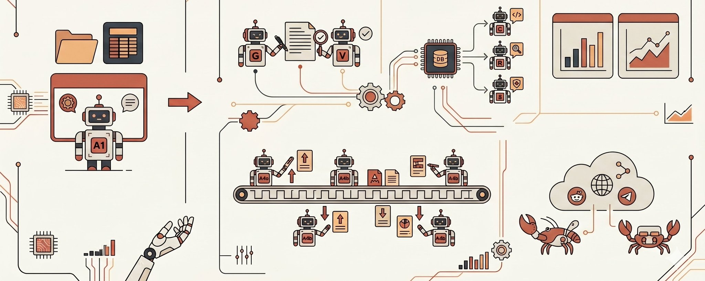

Anthropic上周发了一篇博文，标题不长，信息量极大。

核心观点只有一句话：**别上来就选最复杂的架构。从最简单的能跑通的模式开始，看它在哪里卡住，再升级。**

这篇文章拆解了五种多Agent协作的主流模式——每种怎么运作、什么时候用、会在哪里翻车。

如果你正在用龙虾、Hermes、Claude Code或者任何AI Agent工具，这篇文章直接决定了你该怎么组织你的Agent团队。

今天我把它翻译成普通人能听懂的话，加上我自己的理解和判断。

## 为什么需要"多Agent协作"

先回答一个最基本的问题：一个Agent不够吗？为什么要搞多个？

答案很简单：**一个Agent的脑容量有限。**

AI模型有一个叫"上下文窗口"的东西，你可以理解为它的"工作记忆"。往里面塞的信息越多，它的表现就越差——会忘事、会犯错、会把前面的指令跟后面的任务搞混。

当你的任务足够复杂——比如审查一整个代码库、做一份跨领域的研究报告、运营一个自动化客服系统——一个Agent根本装不下所有需要的背景信息。

解决办法就是拆：**让多个Agent各管一摊，每个人的脑子里只装自己那份工作需要的信息。**

但问题来了：多个Agent之间怎么协调？谁听谁的？信息怎么流动？出了问题找谁？

这就是这五种模式要解决的问题。

## 模式一：生成者+验证者——最简单，也最实用

**一句话理解：一个人干活，一个人检查。**

生成者接到任务，先出一版初稿。验证者拿着一套明确的标准去检查：事实对不对？格式对不对？是不是漏了什么？

检查没通过，就把具体的修改意见打回去。生成者改完再提交。这个循环反复进行，直到验证者说OK，或者达到预设的最大修改次数。

**最适合什么场景？**

一个AI写代码，另一个跑测试。一个AI写客户邮件，另一个检查事实准确性和品牌语气。一个AI生成报告，另一个做合规审查。

简单说，任何"出一次错的代价远大于多跑一轮检查"的场景。

**会在哪里翻车？**

Anthropic的原话特别犀利："团队最常犯的错误，是建好了循环机制，却没定义清楚'验证'到底意味着什么。这只会营造出一种'我们在做质量控制'的虚假繁荣。"

如果你只告诉验证者"帮我看看这东西好不好"，不给具体的检查标准，它就会变成一个闭着眼睛盖"合格"章的橡皮图章。

另外，如果生成者始终无法解决验证者提出的问题，系统就会陷入死循环——来回踢皮球。所以必须设最大循环次数，并准备好兜底方案（比如转人工）。

## 模式二：调度者+子Agent——"老板派活"模式

**一句话理解：一个老板，几个下属。老板拆任务、派活、收作业。**

调度者收到一个大任务，先想想怎么拆。然后把不同的部分分给不同的子Agent。子Agent们各自完成后交回结果，调度者再把碎片拼成完整的答案。

Claude Code用的就是这个模式。主Agent自己写代码，但需要在大型代码库里搜索时，就派子Agent去查，查完把结果送回来。主线工作不停，信息持续回流。

**最适合什么场景？**

任务拆解清晰、子任务之间互不依赖。比如代码审查：安全检查、测试覆盖、代码风格、架构一致性——四个方向互不干涉，各查各的，最后汇总。

**会在哪里翻车？**

调度者很容易变成信息瓶颈。

比如查安全的Agent发现了一个认证漏洞，这个漏洞恰好会影响查架构的Agent的分析。但这个信息必须先上报给调度者，再由调度者下发。关键细节很容易在被一次次"总结汇报"的过程中丢失。

Anthropic的建议是：**大多数刚起步的需求，先从这个模式开始。** 它能以最低的协调成本搞定最广泛的问题。先跑起来，看哪里卡住，再升级。

## 模式三：Agent团队——"长期项目组"

**一句话理解：不是临时拉人干活，而是组一个长期团队。**

跟调度者模式最大的区别在于**持久性**。调度者是为了一件小事临时叫出一个子Agent，干完就解散。但团队模式里，成员是长期存在的——它们在接手一个个任务的过程中不断积累经验，越干越熟练。

**最适合什么场景？**

大规模代码库迁移。每个团队成员负责迁移一个服务模块，自己处理依赖、改代码、修bug、做验证。它们在长期对付同一个模块的过程中，会慢慢摸透这个模块的脾气——依赖关系、测试规律、部署配置。这种积累下来的背景知识，是"用完即走"的调度模式给不了的。

**会在哪里翻车？**

"独立"是这个模式的生命线，也是软肋。

团队成员们闷头干活，彼此之间很难共享中间进度。如果A的工作会影响B，但他们俩都不知道，最后交上来的结果可能就打架了。

多人同时修改同一个文件更是灾难级问题。这要求在任务分配时划好"楚河汉界"，准备好冲突解决机制。

## 模式四：消息总线——"事件驱动的流水线"

**一句话理解：没有老板，只有一个公告栏。有活来了就贴上去，能干的人自己领走。**

Agent们只靠两个动作交流：发布和订阅。每个Agent订阅自己关心的话题，一个路由器把相关消息精准推给它们。

新来了一个Agent？订阅相关话题就能上岗，完全不需要改现有架构。

**最适合什么场景？**

自动化安全运营系统是完美案例。警报像雪片一样飞来，分诊Agent评估严重程度，把网络警报推给网络调查Agent，把账号警报推给身份分析Agent。调查过程中发现需要更多情报，情报收集Agent自动顶上。最后所有发现流向响应协调Agent拍板处理。

简单说：**事件驱动、流水线作业、团队还在不断扩编的场景。**

**会在哪里翻车？**

排查问题极其困难。当一个警报像多米诺骨牌一样触发了五个Agent的连锁反应，想搞清楚中间发生了什么，必须查非常详细的日志。

路由器分错类更致命——系统不报错，没死机，但就是什么也不干。这叫"静默崩溃"，是最难发现的故障模式。

## 模式五：共享状态——"一块大黑板"

**一句话理解：没有老板，没有流水线。所有人对着同一块黑板工作。**

前四种模式里，无论是调度者、协调者还是路由器，本质上都是信息的"中间商"。共享状态模式彻底干掉了中间商——所有Agent共同面对一个持久化的存储区（数据库、文件系统或文档），大家直接从中读取信息、写入结果。

**最适合什么场景？**

跨领域的综合研究。几个Agent分别负责翻学术论文、行业报告、专利文件和新闻动态。看论文的Agent发现了一位核心研究员，看行业的Agent立马就能去深挖这家公司。

信息不需要等中间人传话，直接上黑板，所有人实时可见。大家互相踩着对方的肩膀往上爬，黑板渐渐变成一个不断进化的知识库。

还有一个额外好处：**消除单点故障。** 某个Agent宕机了，其他人依然能对着黑板继续读写。但在调度模式或消息总线里，一旦指挥官或路由器罢工，整个系统全瘫痪。

**会在哪里翻车？**

最致命的是"反应式死循环"。Agent A写了一个发现，Agent B看到后写了补充，A看到补充后又回了一句……整个系统像两个机器人无限套娃聊天，疯狂烧Token却无法得出结论。

Anthropic的建议是在设计之初就设定"一票否决"的终止条件：固定时间预算、连续几轮没新发现就强制停止、或者指派一个裁判Agent随时判定答案是否已经够好了。

## 怎么选？一张决策表

Anthropic给了一个非常清晰的决策框架，我把它翻译成大白话：

**你最看重产出质量，而且"好不好"有明确标准？**→ 生成者+验证者

**任务可以清晰拆分，子任务短平快、互不依赖？**→ 调度者+子Agent（大多数人从这里开始）

**子任务需要长时间独立运行，且过程中需要积累经验？**→ Agent团队

**工作流由突发事件驱动，而且团队还在不断扩编？**→ 消息总线

**Agent之间需要频繁共享中间发现、互相借鉴？**→ 共享状态

**绝对不能有单点故障？**→ 共享状态

而在实际生产环境中，这些模式经常混搭使用。比如大方向用调度者+子Agent，某个需要高度协作的子任务里套共享状态。或者用消息总线来分发事件，每类事件末端挂一个Agent团队。

**这些模式是积木，不是非此即彼。**

## 我的几个判断

**第一，Anthropic同步发布了Managed Agents API。**

就在这篇博文发布的前后，Anthropic在4月10日推出了Managed Agents——一个托管式的Agent执行环境，帮你搞定沙箱、权限、状态管理和错误恢复。Notion、Rakuten、Sentry、Asana已经在用。

这意味着什么？Anthropic不只是在教你理论，它在同时提供基础设施。这篇五种模式的博文，本质上是Managed Agents的"使用说明书"。

**第二，"从最简单的开始"不是谦虚，是真理。**

Anthropic的原话是："对于绝大多数刚起步的需求，我们强烈建议从调度者+子Agent开始。"

LangChain的实践也验证了这一点：他们的编程Agent只改了Harness没换模型，排名从前30冲进前5。三个专注的Agent持续优于一个通才Agent工作三倍时间。

复杂不等于好。**够用就是最好的架构。**

**第三，真正的难点不是选模式，而是定义"好"的标准。**

生成者+验证者模式里，验证者的检查标准是什么？调度者模式里，子任务的边界怎么划？共享状态里，什么时候该停止？

这些问题没有技术答案。它们需要你对自己的业务有深刻的理解。

**AI能帮你执行，但"什么算做好了"这件事，只能你自己定义。**

这可能是整篇文章最重要的一句话。

## 最后

很多人看到"多Agent协作"就觉得跟自己没关系——"那是开发者的事"。

但如果你在用Claude Code的并行Agent、龙虾的多Agent系统、Hermes的子Agent功能、或者任何自动化工作流，你其实已经在用这些模式了——只是你可能不知道自己在用哪一种，也不知道它为什么有时候好用、有时候翻车。

理解这五种模式，能帮你回答一个实际问题：

**我的Agent为什么卡住了？我该怎么调整？**

这比任何具体的技术技巧都值钱。

---

> 原文地址：<a href="https://x.com/kkawsb/status/2043883512168886387?s=46">https://x.com/kkawsb/status/2043883512168886387?s=46</a>
