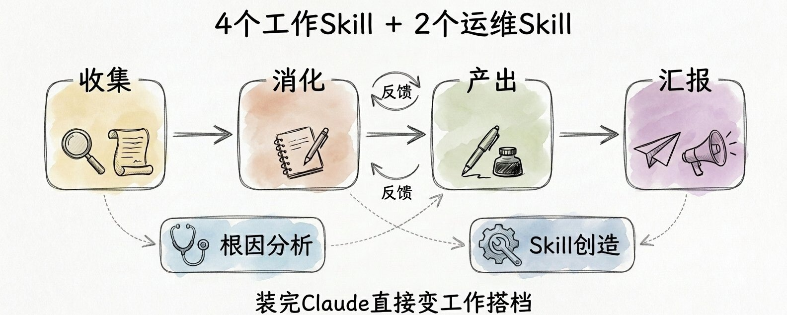
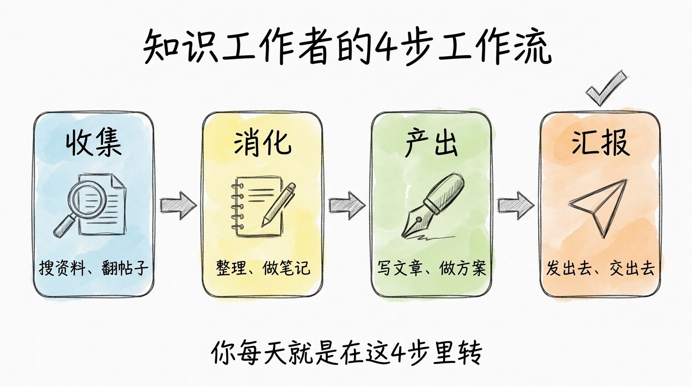
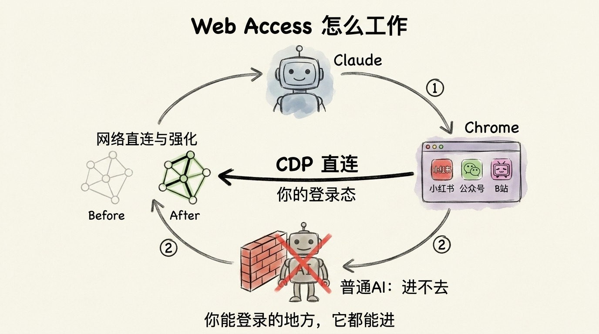
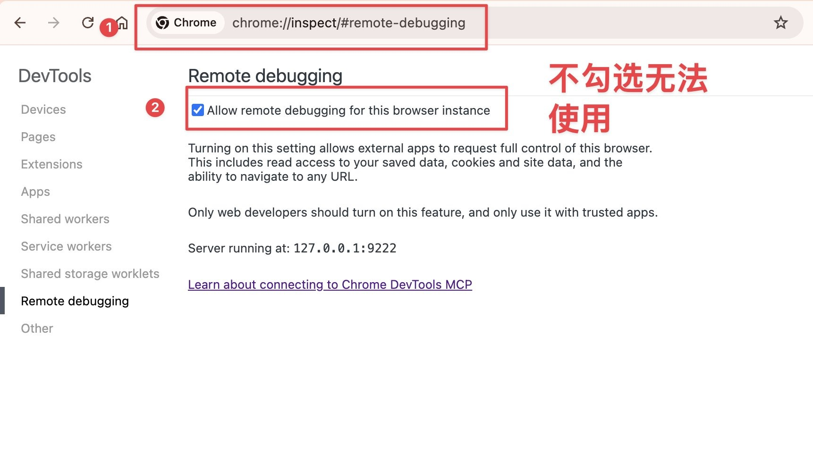
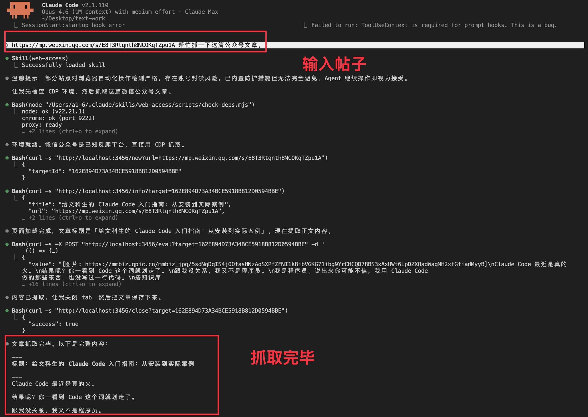
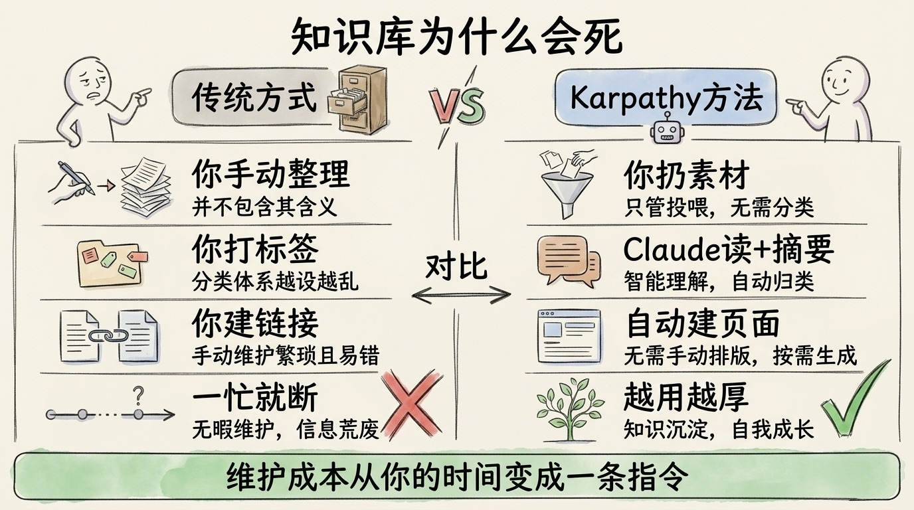
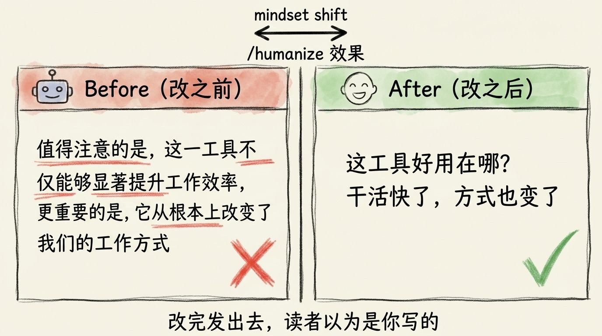
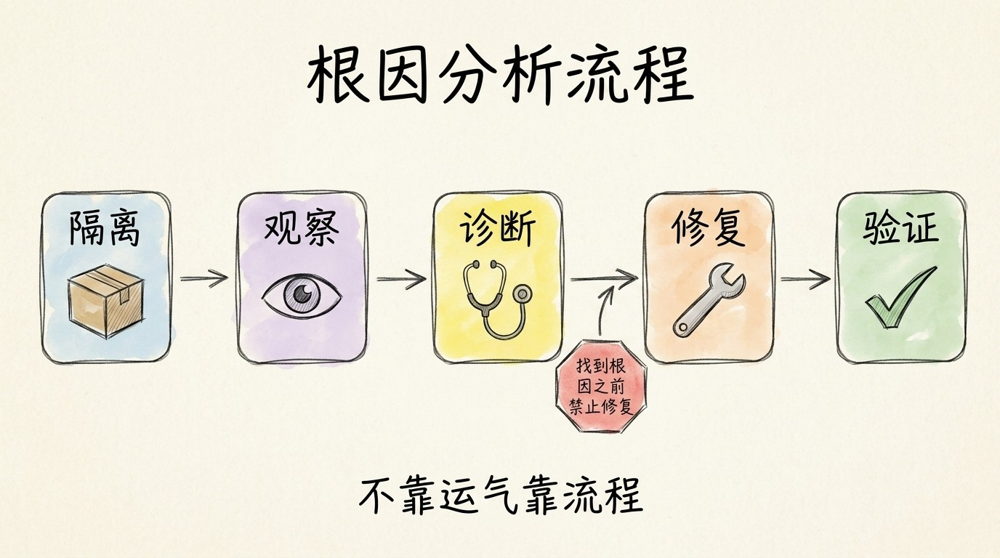
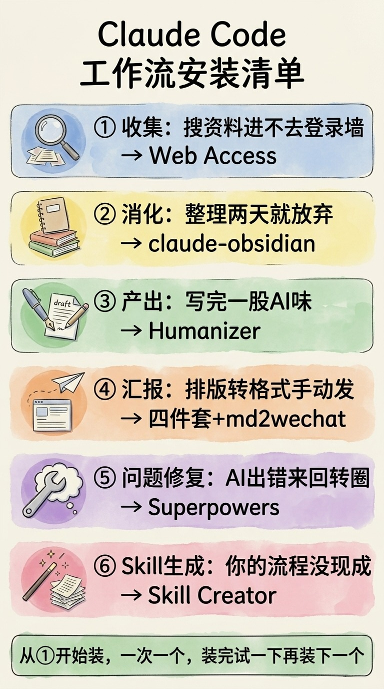

# 4 个工作 Skill + 2 个运维 Skill，装完 Claude 直接变工作搭档



必装 Skill 推荐，你刷过多少篇了？

装了几个，打开 Claude 还是不知道该用哪个

装了跟没装，感觉差不太多

其实不是 skill 的问题

6 个没有分工的 Skill，跟 6 个陌生人塞进同一间办公室没区别，没人知道自己管什么，人多了反而更乱

根本原因只有一个：你有工具，但没有工作流框架

你每天的工作就 4 步：收集 → 消化 → 产出 → 汇报



不信自己想一下，是不是这样？

你每天打开电脑在干嘛

搜东西，找资料、翻帖子、看别人怎么说，这是收集

搜回来一堆，得读、得整理、得变成自己能用的，消化

然后写点什么，文章、方案、报告

写完发出去，推到公众号、交给老板、丢到群里

收集、消化、产出、汇报，你每天就是在这 4 步里转，对不对？

所以今天我们讲的就是这 4 个 解决这些问题Skill 加 2 个运维工具

**今天你看完将学会的是一套工作流框架，而不是又一篇垃圾推荐帖**

## 第一步：收集

收集这一步，你让 AI 帮你搜东西，它搜回来的全是公开网页

但你真正想看的讨论在哪？小红书笔记、公众号文章、B站评论区，全在要登录才能看的地方

AI 进不去，因为它没有你的登录态

这不是提示词的问题，是所有 AI 工具的硬伤

Web Access 这个 Skill 做了一件事：通过 CDP 直连你本地的 Chrome

地址：[https://github.com/eze-is/web-access](https://github.com/eze-is/web-access)



你 Chrome 里登录了什么，它就能进什么

安装一条命令：

```javascript
npx skills add eze-is/web-access
```

配置一步：Chrome 地址栏打开 chrome://inspect/[#remote](https://x.com/search?q=%23remote&src=hashtag_click)\-debugging，勾上允许远程调试



配置完了

你给地址让他去抓公众号，稳稳的，具体如下图：



可以看到，它真的进去了，拿到全文，不被反爬拦截

它还有更多的抓取方法，而且每次试错成功后都会记住，下一次再也不会犯错。

你平时能登录的地方，它都能替你进，收集这一步从此不用自己动手翻

## 第二步：消化

收集搞定了，但搜回来一堆东西，然后呢？

正常流程，我们得整理，得做笔记，得把有用的东西记下来，不然过两天就忘了

但你也知道，笔记这个事，做着做着就不做了

为了更好得学习，有些人会更认真：

搭知识库、搞第二大脑，Notion、Obsidian 都用过，建了一堆文件夹，整理了两三个月，最后还是不打开了

不管是做笔记还是搞第二大脑，死法都一样：维护成本全压在你身上，一忙就断

但Karpathy 的方法反过来：你只管扔素材进去，Claude 负责读、摘要、建页面、打双向链接



维护成本从你的时间变成一条指令

知识库从你维护变成它自己长，每次录入都是在积累，不是在还债

完整教程我在这篇文章里写透了：《Obsidian + Claude Code：用 AI 大神 Karpathy 的方法搭一个真正可用的第二大脑》

> Apr 11

想直接用现成 Skill 的，社区已经有三个版本：

1\. AgriciDaniel/claude-obsidian，带 /wiki /save /autoresearch

地址：[https://github.com/AgriciDaniel/claude-obsidian](https://github.com/AgriciDaniel/claude-obsidian)

2\. ekadetov/llm-wiki，Claude Code 插件

地址：[https://github.com/ekadetov/llm-wiki](https://github.com/ekadetov/llm-wiki)

3. vanillaflava/llm-wiki-claude-skills，GUI 安装，不用开终端3. vanillaflava/llm-wiki-claude-skills，GUI 安装，不用开终端

地址：[https://github.com/vanillaflava/llm-wiki-claude-skills](https://github.com/vanillaflava/llm-wiki-claude-skills)

消化这一步，从此不靠你自己硬扛理解输入

## 第三步：产出

到产出了，你用 Claude 写了一段东西，内容没问题

但你敢直接发吗？

现在人人都跟 AI 聊过天，AI 写的东西什么样大家心里有数

动不动就深入探讨、结尾必来一段升华、每句话都工工整整的，这些特征读者一眼就认出来

你发出去，对方心里第一反应：这是 AI 写的吧

你的内容、你的专业度，全被 AI 腔毁了

下面提供两个Skill：

humanize（[https://github.com/blader/humanizer](https://github.com/blader/humanizer))

中文版：([https://github.com/op7418/Humanizer-zh](https://github.com/op7418/Humanizer-zh)，推友做的）

这个命令做的事很具体：它扫的是 Wikipedia 上整理出来的 AI 写作特征清单，逐一对照、逐一清除

这个不是通用润色Skill，是专门针对 AI 写作指纹的Skill

举个图片例子：



**改之前：**

值得注意的是，这一工具不仅能够显著提升工作效率，更重要的是，它从根本上改变了我们的工作方式

**改之后：**

这工具好用在哪？干活快了，方式也变了

改完发出去，读者以为是你写的

这才算真正能用的内容！！

## 第四步：汇报

最后一步，汇报

内容写完了，但写完不等于能发

你面前还有两道坎

第一道是格式，你写的是 Markdown，交给别人要 Word，做汇报要 PPT，发公众号要排版，每次都是单独的体力活。

解决方法是按照是 Anthropic 官方出的 四个Skill，四条命令装完：

```javascript
npx skills add https://github.com/anthropics/skills --skill docx
npx skills add https://github.com/anthropics/skills --skill pptx
npx skills add https://github.com/anthropics/skills --skill xlsx
npx skills add https://github.com/anthropics/skills --skill pdf
```

装完直接跟 Claude 说要什么格式，它输出带格式的专业文档，对方打开就能用

第二道是发送，格式好了还得手动推到该去的地方

md2wechat 一条命令，自动排版推到公众号草稿箱，进去改个标题封面直接发

安装步骤：

```javascript
brew install geekjourneyx/tap/md2wechat
npx skills add https://github.com/geekjourneyx/md2wechat-skill --skill md2wechat
```

完整教程我之前写过相关教程：

> Mar 26

写完到发出去不超过 5 分钟，最后一公里从此消失

## 还差两个运维工具

收集、消化、产出、汇报，四步到位了

但任何系统都需要运维

出了问题要能找到根因，不是靠猜，用顺了要能把好流程固化下来，不是每次重来

这套系统配了两个运维工具：

**第一个解决的是：AI 出问题时来回改、来回转圈，你也不知道它到底卡在哪**

Superpowers（[https://github.com/obra/superpowers](https://github.com/obra/superpowers)）是 Claude 生态里最火的 Skill 套件，GitHub 15 万 Star，35 万次安装

里面的 /systematic-debug，强制按隔离、观察、诊断、修复、验证的顺序走，找到根因之前，禁止提任何修复方案，不靠运气靠流程，最终找到真正原因



如何安装呢？

安装：

```javascript
npx skills add obra/superpowers
```

**第二个解决的是：生产Skill的问题**

**第二个解决的是：生产Skill的问题**

这 6 个 Skill 覆盖了主要环节，但你的工作肯定不止这些，

但你有自己的流程、自己的习惯，这些没有现成 Skill 能替你做

使用下面这个Skill👇

Skill-Creator（[https://github.com/anthropics/skills](https://github.com/anthropics/skills)，skills/skill-creator/）是 Anthropic 官方出的 Skill

如何安装呢？

安装：

```text
npx skills add https://github.com/anthropics/skills --skill skill-creator
```

/skill-creator 进入，描述你的流程，它帮你生成完整的 SKILL.md

你自己的工作方式，也能变成 Skill！！

这套系统从拿来用，变成越用越是你自己的，加上这两个，才算真正完整。

我承认文章有点长了，所以下面解决你记不住的问题！！

## 怕记不住？

6 个 Skill，按收集、消化、产出、汇报排好位，加问题修复和 Skill 生成打底，这就是你的工作流框架。

存好这张图：



从第一个开始装，一次一个，装完试一下再装下一个

**觉得有用？转给一个你觉得也该试试的朋友，关注我吧！！**
---

> **来源**: [https://x.com/lxfater/status/2044781079660482801?s=46](https://x.com/lxfater/status/2044781079660482801?s=46)
