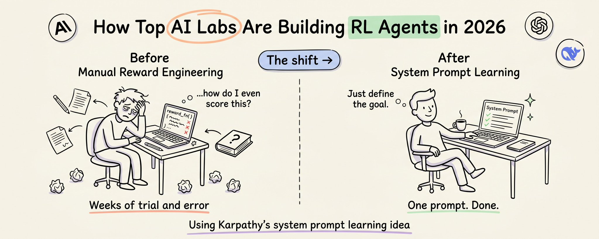

Anthropic、OpenAI 和 DeepSeek 正在围绕同一个核心思想趋同：**用系统提示作为奖励函数**。本文完整解析从 RLHF 到 RULER 的强化学习进化之路，附带代码。

强化学习的核心非常直接：系统采取行动，环境给予奖励，智能体随时间更新行为以最大化该奖励。

上述交互以离散步骤进行。每一步中，按顺序发生三件事：

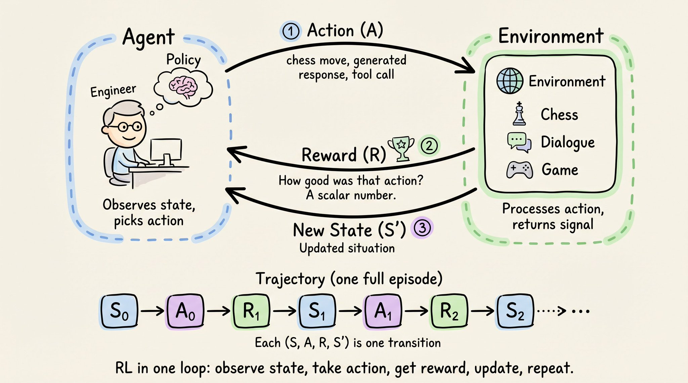

- **智能体观察当前环境状态（S）**。状态是对智能体所处情况的描述，足以决定下一步做什么。例如，在象棋中，状态是棋盘位置；在对话模型中，状态是到目前为止的对话历史。
- **智能体根据所见选择一个动作（A）**。动作是智能体的输出，也是它影响环境的唯一方式。例如，在象棋中，动作是一个合法的走法；对于 LLM，动作是生成的响应。
- **环境随后做两件事**：转移到新的状态（S'），并发出一个奖励（R）——一个评估动作的标量数值。下一步开始，循环继续。

将这些步骤连接起来就形成一个**轨迹（trajectory）**：

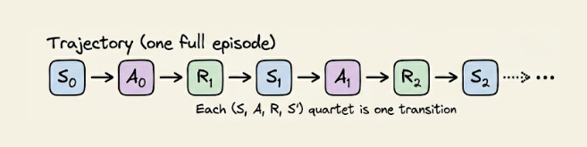

从左到右阅读，这是智能体与环境的全部交互历史。每个（S, A, R, S'）四元组是一次转移，强化学习的大部分内容都是关于从这些转移中学习的。

## 将强化学习应用于 LLM

当强化学习首次应用于 LLM 时，环境是**人类偏好**。

OpenAI 的 InstructGPT（2022 年）引入了 **RLHF（基于人类反馈的强化学习）**：

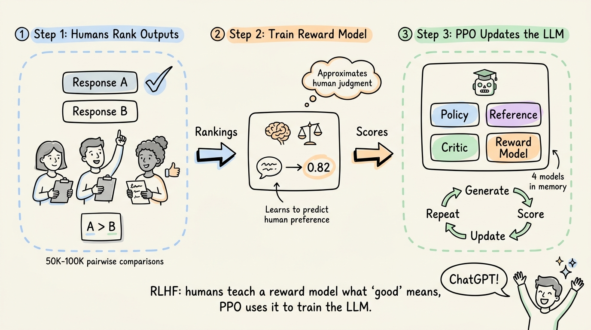

- 人类对模型输出进行排名
- 这些排名训练了一个奖励模型
- PPO（近端策略优化）使用该奖励模型来微调 LLM

ChatGPT 正是基于这个流程构建的。

但人类无法坐在训练循环中实时评价每个输出。如果模型在每个提示下生成 16 个响应，经过数千次训练步骤，那将是数十万次评估。

OpenAI 通过将过程分为**两个阶段**来解决这个问题：

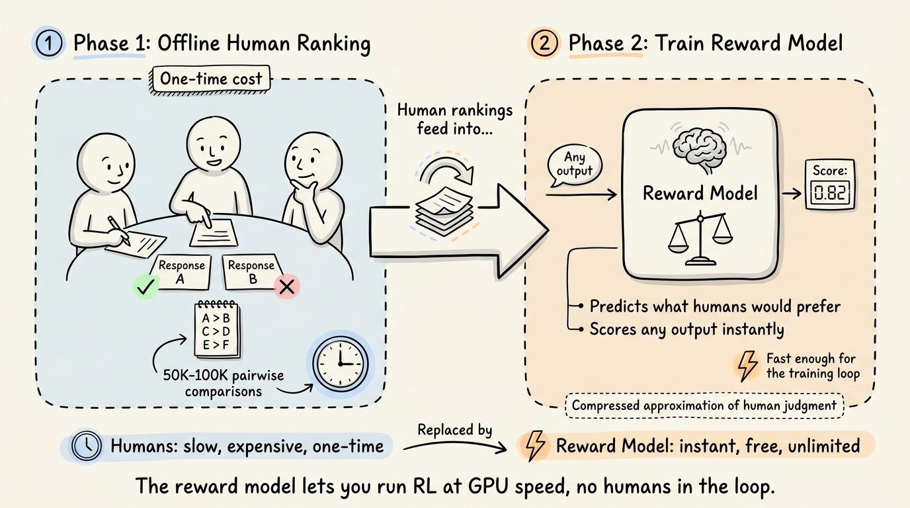

**第一阶段：离线阶段。** 人类对相对较小的一组模型输出进行排序，生成成对比较。这是需要大量人工的部分，但它是一次性成本。

**第二阶段：训练奖励模型。** 在这些排名上训练一个奖励模型——一个独立的 LLM，学会了预测人类的偏好。现在你拥有了一个可以即时评分任何输出的神经网络，无需等待人类。奖励模型是人类判断的压缩近似，速度足以放入训练循环中。

有了奖励模型，PPO 就可以以 GPU 速度运行实际的 RL 训练。模型生成响应，奖励模型打分，PPO 更新权重——无需大量人工参与。

然而，代价是 PPO 需要**四个全尺寸模型同时驻留在内存中**。

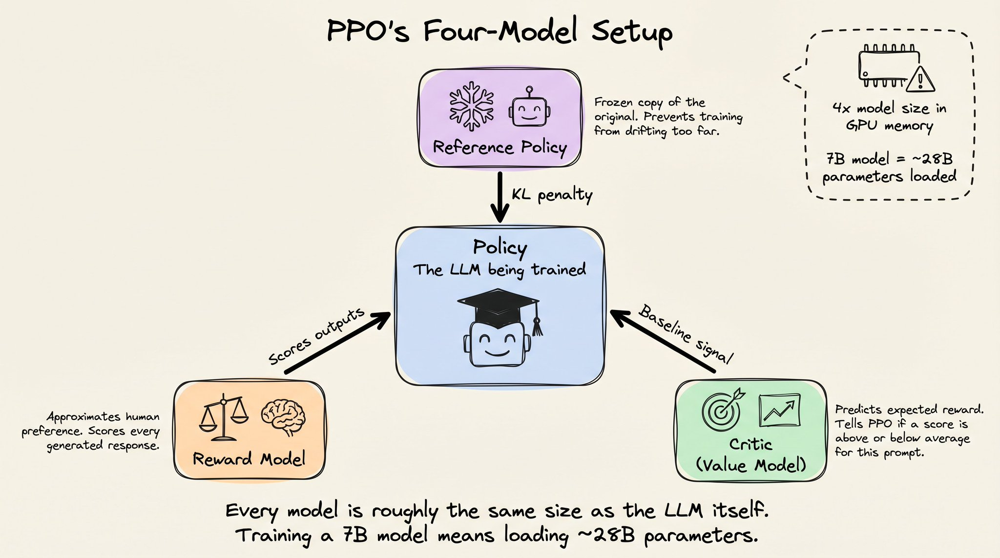

- **策略模型**（正在训练的 LLM）
- **参考策略**（原始模型的冻结副本，通过 KL 散度惩罚防止训练偏离太远）
- **奖励模型**（上述讨论的人类偏好近似器，为每个输出打分）
- **评论家（Critic）**，也叫价值模型（下面详细介绍）

评论家存在的目的是回答一个问题：

> **相对于我们对这个提示的通常预期，这个奖励是好还是坏？**

我们需要这个，因为一个原始奖励 0.7 单独来看毫无意义。例如，在一个简单的事实性问题上，大多数响应得分 0.9，那 0.7 就是低于平均水平。但在一个复杂的开放式问题上，大多数响应得分 0.4，那 0.7 就是优秀。

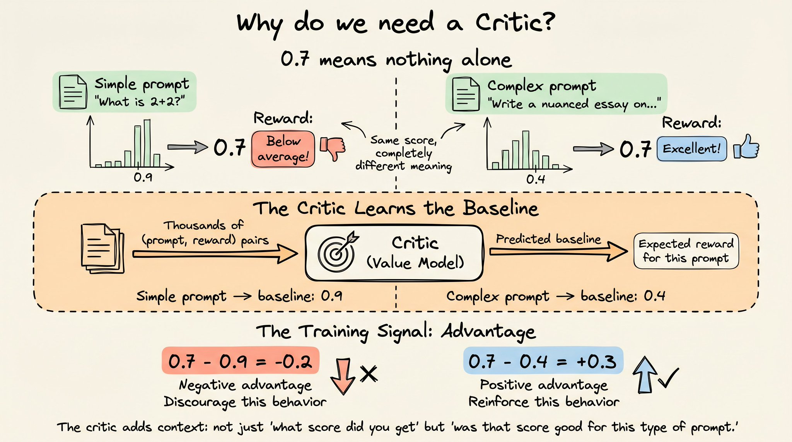

评论家通过观察训练过程中成千上万的（提示，奖励）对来学习这个基线。

PPO 的实际训练信号是**优势（advantage）**，它被估计为奖励减去评论家预测的基线。这使得信号在不同难度的提示之间保持稳定。但代价是评论家本身也是一个全尺寸 LLM，又多了一个模型的内存开销。

对于一个 7B 参数的 LLM，这意味着内存中同时有大约 28B 参数。

## DeepSeek R1 突破：可验证奖励

2025 年 1 月，DeepSeek 发布了 R1，采用了根本不同的奖励信号方法。

他们没有从人类偏好训练奖励模型（RLHF 流程的第一和第二阶段），而是使用了 **RLVR（基于可验证奖励的强化学习）**。

这是一种简单的、基于规则的验证，环境本身提供信号。

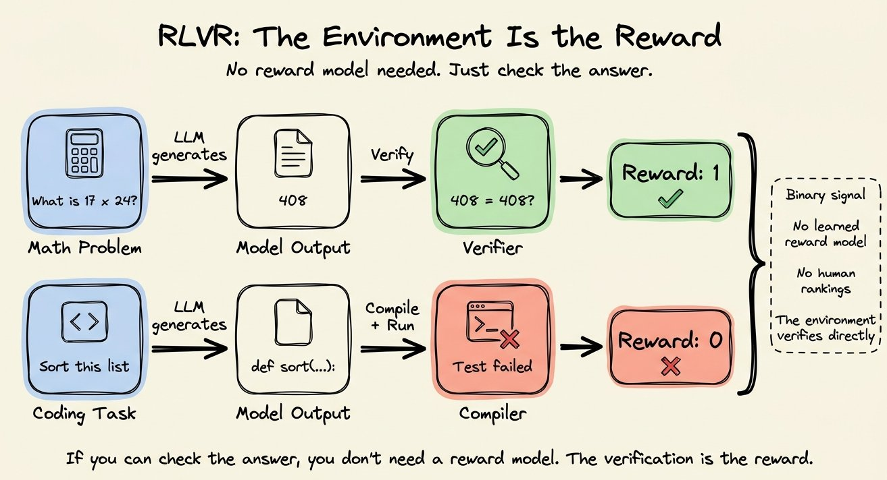

例如：

- 对于数学问题，验证器检查模型的答案是否与已知解匹配
- 对于代码，编译器运行输出并返回通过或失败

二元奖励：正确得 1，错误得 0。不需要人类排名或显式奖励模型，因为地面真相是可用的（或可推断的）。

RL 优化器是 **GRPO（群组相对策略优化）**，它剥离了 PPO 的大部分基础设施。

它**完全移除了评论家模型**。

GRPO 没有训练一个单独的模型来预测每个提示的预期奖励，而是对同一提示生成多个响应（通常 16 个），然后在每组内对奖励进行归一化。

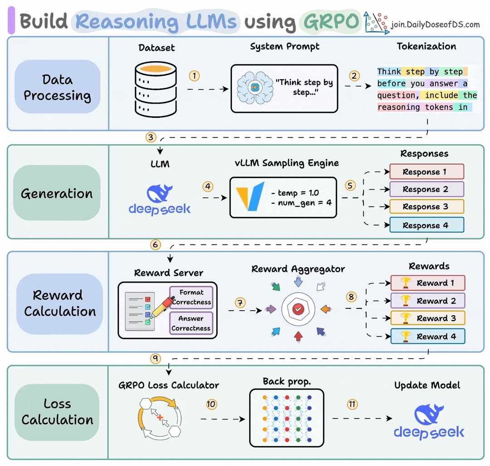

如果 16 个响应中有 4 个答对了数学题，这 4 个获得正优势，其他 12 个获得负优势。

这一步从内存中削减了整整一个全尺寸模型。

GRPO 还移除了对学习到的奖励模型的需求，因为 RLVR 的验证器直接处理打分。

因此，PPO 的四模型设置（策略 + 参考 + 评论家 + 奖励模型）缩减为仅两个：正在训练的策略和用于 KL 正则化的参考副本。

实际上，有些实现将参考折叠到策略检查点中，接近单模型设置。

在这个设置下，DeepSeek R1-Zero 仅使用 GRPO 和可验证奖励训练（完全没有监督微调），在 AIME 2024 数学题上从 15.6% 提升到 77.9%。通过多数投票，达到 86.7%，匹配 OpenAI 的 o1。

模型自主发展出了自我验证、反思和思维链推理能力——纯粹来自二元正确/错误信号，没有人教它逐步推理。RL 训练循环发现推理能提高奖励，于是模型学会了推理。

RLVR + GRPO 成为 2025 年训练推理模型的主流方法。每个主要实验室都发布了遵循这个配方的推理变体。

## 问题所在

GRPO 本身是通用的。它不关心奖励是来自数学验证器、代码编译器、人类还是 Python 脚本。

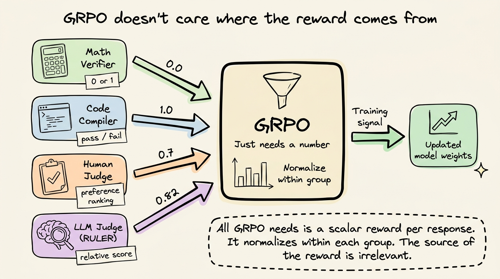

它只需要每个响应一个数字，然后在每组内归一化以产生训练信号。

但一个明显的瓶颈是：**这些奖励从哪来？**

对于数学和代码，这没问题，因为环境提供确定性信号。但与真实世界工具和数据交互的智能体不会产生你可以与标准答案进行字符串匹配的输出。

RAG 智能体检索上下文并生成响应——没有单一正确答案可以比较。客服智能体起草回复——没有编译器可以运行。摘要智能体压缩 20 页文档——有许多有效摘要，没有字符串匹配验证器能区分好的和一般的。

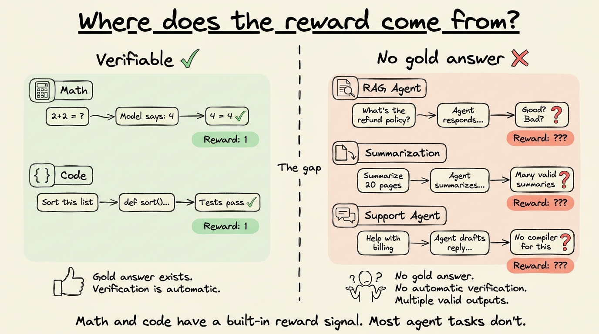

在这些情况下，环境不会像数学问题那样直接给你奖励信号。

当然，有些智能体任务确实有可验证的结果，对于这些，RLVR 运作良好，即使是多步工具使用。可验证性取决于任务的结果，而不是模型是否作为智能体在行动。

但对于大多数智能体工作流，结果是主观的或多维度的。

直觉上，GRPO 仍然是这里的正确选择，因为需要多步操作、调用工具和组合响应的智能体将从探索式学习中受益——尝试不同方法，并因有效的方法而得到强化。

所以，虽然 RL 框架是正确的选择，但缺失的部分是**打分函数**。

一种解决方案是编写自定义奖励函数，用 Python 代码根据手工定义的标准为每个输出打分。

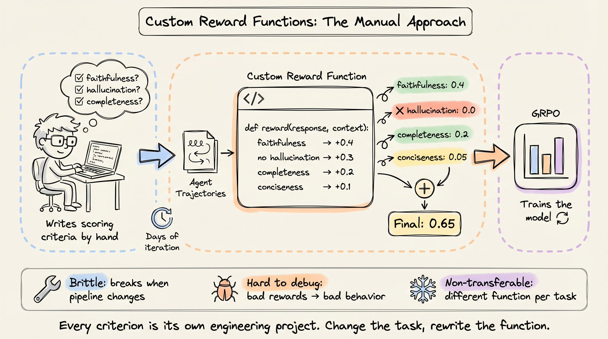

- RAG 奖励函数可能检查响应是否使用了检索到的上下文（忠实性），惩罚不在上下文中的内容（幻觉），奖励完整性，并处理上下文本身模糊的情况。
- 工具使用奖励函数可能对多步任务中的部分进展打分，惩罚不必要的 API 调用，并衡量智能体是否达到了正确的最终状态。

每个标准返回一个部分分数，这些分数被求和或加权为最终奖励。

这行得通，但引入了自身的问题。

编写一个好的奖励函数需要数天的迭代。研究人员需要预见边缘情况，校准不同标准之间的权重，并测试函数是否真的奖励了你想要的行为。

一个过度权重格式合规性而低估忠实性的奖励函数，会训练出产生格式精美但充满幻觉的智能体。

奖励函数也很脆弱。如果你改变检索管道、添加新工具或修改系统提示，奖励函数就需要重写。

调试也很成问题。

当智能体在训练中学到不良行为时，原因可能是奖励函数、训练超参数、数据或其他完全不同的东西。但因为奖励函数是自定义代码，你通常无法判断函数是否在衡量你认为它在衡量的东西，直到你已经用它训练了模型并评估了输出。

这就是 RL 在可验证任务（数学、代码、逻辑）中被广泛采用，但在智能体工作流（RAG、客服、工具使用、摘要）中没有被采用的主要原因。

RLVR 为推理模型提供了一个通用的、自动的奖励信号——检查答案并返回 0 或 1。对于大多数智能体工作流，不存在这样的等价物。

区别不在于模型。同一个 Qwen 2.5 14B 可以同时扮演两种角色。区别在于任务。我们能否验证智能体是否在产生可以自动检查的输出？

## AI 实验室如何应对？

这不仅仅是开源从业者注意到的缺口。主要的 AI 实验室一直在从不同方向解决同一个问题。

**Anthropic 证明了 RL 循环中完全不需要人类。**

他们的 Constitutional AI 工作表明，如果你写下一套原则（"宪法"），AI 可以根据这些原则评估输出，并为 RL 训练生成偏好数据。

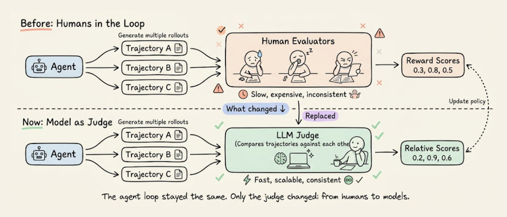

AI 根据书面原则判断自己的输出，并将这些判断用作 RL 信号。这是一个重大的概念转变——一份规则文档取代了一支人类评估者大军。

**OpenAI 一直在内部开发类似的东西。** 他们正在开发"通用验证器"，一种将 RL 从数学和代码扩展到生物学、医学和通用知识等领域的技术，在这些领域中答案无法通过简单的字符串匹配来检查。

细节尚未公开，但方向很明确：我们需要适用于任何领域的通用奖励信号，而不仅仅是有确定性验证器的领域。

**Karpathy 也一直在指向这个方向。**

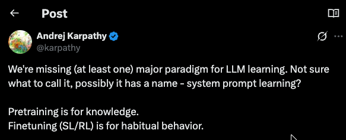

他在 2025 年 argue，我们缺少一个 LLM 的主要学习范式，他暂且称之为"**系统提示学习（system prompt learning）**"。

核心思想是：系统提示携带的信号比标量奖励更丰富，RL 训练应该寻找利用这种信号的方法，而不是仅仅依赖手工制作的奖励函数。

## RULER

如果你想看实际效果，**RULER** 构建在 [OpenPipe 的 ART 框架](https://github.com/OpenPipe/ART)中（开源，9k+ stars），是一个通用奖励函数，用一个函数调用取代了所有自定义打分代码。


它使用 **LLM 作为裁判**来排名多个轨迹，利用了 GRPO 强大的同一个特性——**只有相对排名才重要**。

以下是逐步工作原理：

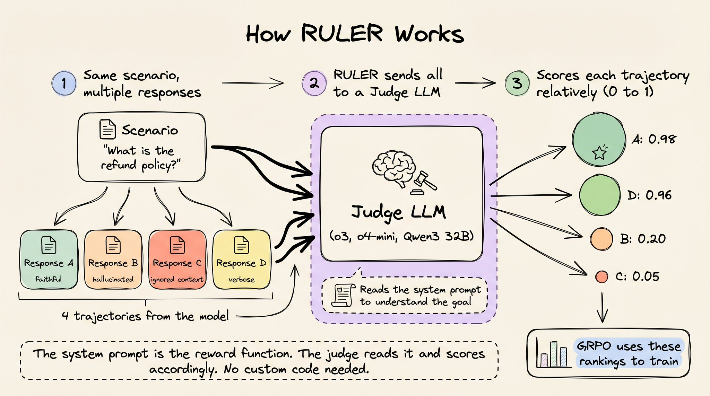

1. 对于每个训练步骤，你为同一场景生成 N 个轨迹（通常 4 到 8 个）
2. RULER 将所有 N 个发送给裁判 LLM（如 o3、o4-mini，甚至本地 Qwen3 32B）
3. 裁判阅读智能体的系统提示以理解智能体应该做什么，然后相对于其他轨迹对每个轨迹打 0 到 1 分

两个特性使这行得通：

**1）相对打分比绝对打分更容易。**

LLM 在绝对打分上表现挣扎，因为没有共享的校准。但问"这 4 个响应中哪个最符合系统提示的指令"是一个比较任务，LLM 在这方面表现一致且良好。RULER 通过将所有轨迹一起呈现并要求裁判相互排名来利用这一点。

**2）GRPO 在每组内归一化。**

无论最佳轨迹在绝对意义上是 0.9 还是 0.3 都不重要。GRPO 获取一组内的分数，计算均值和标准差，然后归一化。训练信号来自相对排序——理解哪些轨迹高于平均，哪些低于平均。RULER 的相对排名直接映射到 GRPO 所期望的。

## 概念演练

在进入代码之前，让我们先追踪概念上发生了什么。假设你正在训练一个 RAG 智能体。在每个训练步骤中，GRPO 为同一查询生成多个响应：

```plaintext
场景："退款政策是什么？"
检索到的上下文："30 天内可退款。数字产品下载后不可退款..."

（忠实的）
响应 A："30 天内可退款。邮件联系 support@example.com。"

（幻觉的）
响应 B："30 天内可退款。还有 90 天的商店信用额度。"

（忽略上下文的）
响应 C："不确定，请查看网站。"

（冗长但准确的）
响应 D："政策规定退款可在购买后 30 天内..."
```

在传统设置中，你需要编写一个奖励函数来为每个响应打分：

```python
def reward_function(response, context):
    score = 0.0
    if uses_context(response, context):
        score += 0.4
    if not has_hallucination(response, context):
        score += 0.3
    if is_complete(response, context):
        score += 0.2
    if is_concise(response):
        score += 0.1
    return score
```

这些辅助函数（`uses_context`、`has_hallucination`、`is_complete`、`is_concise`）中的每一个都是一个独立的工程项目。你需要精确定义"使用上下文"的含义，决定阈值，处理边缘情况，并测试一切。

使用 RULER，你可以用一行代码替换所有这些：

```python
scored_group = await ruler_score_group(group, "openai/o3")
```

裁判 LLM 阅读系统提示（"仅使用检索到的上下文回答。不要添加不在上下文中的信息。"），阅读所有四个响应并打分。

系统提示已经隐式定义了忠实性、幻觉和完整性。裁判应用这些标准，而无需用 Python 实现它们。

## 轨迹与群组

ART 将每个智能体响应表示为一个 **Trajectory（轨迹）**——一系列消息（system、user、assistant），打包了 GRPO 训练所需的元数据。

同一场景的多个轨迹形成一个 **TrajectoryGroup（轨迹群组）**。这是 RULER 打分和 GRPO 训练的单位。

```python
# 单个轨迹：一次完整的智能体交互
traj = art.Trajectory(
    messages_and_choices=[
        {"role": "system", "content": "你是一个 RAG 支持智能体..."},
        {"role": "user", "content": "退款政策是什么？\n\n[上下文]: ..."},
        Choice(finish_reason="stop", index=0,
               message=ChatCompletionMessage(role="assistant", content="...")),
    ],
    reward=0.0,  # RULER 会填充这个
)

# 群组：同一场景的多个轨迹
group = art.TrajectoryGroup([traj_a, traj_b, traj_c, traj_d])

# 对整个群组进行相对打分
judged_group = await ruler_score_group(group, "openai/o3")
```

`reward=0.0` 初始化是一个占位符。`ruler_score_group` 返回后，每个轨迹的 reward 字段会被更新为裁判的分数。`Choice` 和 `ChatCompletionMessage` 对象是 OpenAI 的标准类型，如果你已经在使用 OpenAI SDK 进行推理，这些就是你已经在使用的相同对象。

## 两个具体例子

RULER 有两个级别的 API。

**级别一：** 底层的 `ruler` 函数使用纯消息字典，不需要 ART 特定的对象。这是了解 RULER 实际做什么的最快方式。

下面是一个最小示例，包含同一 RAG 查询的三个轨迹。我们定义了三个消息列表：一个是忠实的，一个有幻觉，一个完全忽略了上下文。

```python
message_lists = [
    # 好的：准确使用检索到的上下文
    [
        {"role": "system", "content": "你是一个基于 RAG 的支持智能体。使用检索到的上下文准确回答用户查询。"},
        {"role": "user", "content": "我们的退款政策是什么？\n\n[检索到的上下文]: 购买后 30 天内可退款。数字产品下载后不可退款。联系 support@example.com 发起退款。"},
        {"role": "assistant", "content": "您可以在购买后 30 天内获得退款。但数字产品一旦下载就不可退款。要开始流程，请发邮件至 support@example.com。"},
    ],
    # 一般的：部分使用上下文，添加了幻觉细节
    [
        {"role": "system", "content": "你是一个基于 RAG 的支持智能体。使用检索到的上下文准确回答用户查询。"},
        {"role": "user", "content": "我们的退款政策是什么？\n\n[检索到的上下文]: 购买后 30 天内可退款。数字产品下载后不可退款。联系 support@example.com 发起退款。"},
        {"role": "assistant", "content": "我们的退款政策允许 30 天内退货。您还可以获得最多 90 天的商店信用额度。请致电我们的热线 1-800-REFUND。"},
    ],
    # 差的：完全忽略上下文
    [
        {"role": "system", "content": "你是一个基于 RAG 的支持智能体。使用检索到的上下文准确回答用户查询。"},
        {"role": "user", "content": "我们的退款政策是什么？\n\n[检索到的上下文]: 购买后 30 天内可退款。数字产品下载后不可退款。联系 support@example.com 发起退款。"},
        {"role": "assistant", "content": "我不确定退款政策是什么。您应该查看网站或联系账单团队。"},
    ],
]
```

接下来，我们运行打分：

```python
from art.rewards import ruler

scores = await ruler(message_lists, "openai/o3")

for label, score in zip(["忠实的", "幻觉的", "忽略上下文的"], scores):
    print(label)
    print("→", score.score)
    print("→", score.explanation)
```

输出如下：

```text
忠实的:
→ 0.97
→ 准确反映了检索到的政策细节，完整且简洁。

幻觉的:
→ 0.45
→ 给出了正确的 30 天退款信息，但添加了不支持的细节
  （90 天信用额度、热线），降低了准确性。

忽略上下文的:
→ 0.05
→ 没有提供有用信息，忽略了可用的上下文。
```

注意，我们从未编写忠实性检查器或编码幻觉检测器。系统提示提到了"使用检索到的上下文准确回答用户查询"，裁判将此作为评估标准。

幻觉得分 0.45（不是零），因为它部分使用了上下文。30 天退款部分是正确的。裁判对正确部分给了部分分数，对捏造部分进行了惩罚。这是一个微妙的区分，在基于规则的奖励函数中需要大量工程来编码。

而且分数分布在 0-1 范围内：0.97、0.45、0.05，不像二元的通过/失败。

RULER 产生一个反映相对质量的梯度。GRPO 可以使用这个梯度应用比例更新：强烈强化忠实行为，轻微抑制幻觉模式（因为它部分正确），强烈抑制忽略上下文的行为。

**级别二：** 上面的 `ruler` 函数用于理解和实验，但 ART 的训练循环操作的是 Trajectory 和 TrajectoryGroup 对象。这些携带了 GRPO 读取的 reward 字段、调试日志和 `model.train()` 期望的结构。

高级的 `ruler_score_group` 函数处理转换。下面是同一 RAG 场景，以真实训练管道的方式结构化，现在有 4 个轨迹而不是 3 个。

```python
# 系统提示定义了智能体的目标
# RULER 将此用作隐式奖励函数
system_msg = {
    "role": "system",
    "content": (
        "你是一个基于 RAG 的支持智能体。"
        "仅使用检索到的上下文回答用户查询。"
        "不要添加不在上下文中的信息。"
    ),
}

user_msg = {
    "role": "user",
    "content": (
        "退款政策是什么？\n\n"
        "[检索到的上下文]: 购买后 30 天内可退款。"
        "数字产品下载后不可退款。"
        "联系 support@example.com 发起退款。"
    ),
}

responses = [
    "您可以在购买后 30 天内获得退款。数字产品一旦下载就不可退款。发邮件至 support@example.com 开始。",

    "30 天内可退款。您还可以获得最多 90 天的商店信用额度，热线电话是 1-800-REFUND。",

    "我不确定退款政策。请查看网站或联系账单团队了解更多。",

    "根据我掌握的信息，退款政策规定购买后 30 天内可退款。需要注意的是，数字产品下载后无法退款。如果您想发起退款，请联系 support@example.com。",
]
```

第四个响应是冗长但准确的——仅使用了检索到的上下文，但用不必要的填充词/句子包装了。

```python
import art
from openai.types.chat.chat_completion import Choice
from openai.types.chat import ChatCompletionMessage

trajectories = []
for resp in responses:
    traj = art.Trajectory(
        messages_and_choices=[
            system_msg, user_msg,
            Choice(
                finish_reason="stop", index=0,
                message=ChatCompletionMessage(role="assistant", content=resp),
            ),
        ],
        reward=0.0,
    )
    trajectories.append(traj)

group = art.TrajectoryGroup(trajectories)
```

最后运行打分：

```python
from art.rewards import ruler_score_group

judged_group = await ruler_score_group(group, "openai/o3", debug=True)
```

使用 `debug=True`，RULER 会打印裁判的原始推理和实际分数。原始推理如下：

```json
{
    "scores": [
        {
            "trajectory_id": "1",
            "explanation": "仅使用检索到的上下文准确回答问题，简洁且完整。",
            "score": 0.98
        },
        {
            "trajectory_id": "2",
            "explanation": "包含了检索上下文中不支持的商店信用额度和热线细节，违反了仅使用上下文的指令。",
            "score": 0.2
        },
        {
            "trajectory_id": "3",
            "explanation": "尽管检索上下文中有所需信息，但没有回答问题。",
            "score": 0.05
        },
        {
            "trajectory_id": "4",
            "explanation": "仅使用检索到的上下文准确完整地回答了问题，虽然略显冗长。",
            "score": 0.96
        }
    ]
}
```

排名如下：

```plaintext
排名 1 | 分数: 0.980 — 简洁、忠实的响应
排名 2 | 分数: 0.960 — 冗长但准确的响应
排名 3 | 分数: 0.200 — 幻觉了商店信用额度和热线
排名 4 | 分数: 0.050 — 完全忽略了检索到的上下文
```

仔细观察：

- 简洁忠实的响应（0.98）略高于冗长准确的响应（0.96）。两者都只使用了检索到的上下文，都正确，但系统提示说"仅使用检索到的上下文回答"，简洁版本更直接地做到了这一点。裁判将冗长识别为轻微质量问题，而非正确性问题。这是一个微妙的区分，很难在打分函数中编码——你怎么写一个规则说"技术正确但不必要地啰嗦，扣 0.02 分"？
- 幻觉响应从第一个实验的 0.45 降到了这里的 0.20。区别在于系统提示。第一个实验说"使用检索到的上下文准确回答"，这个说"不要添加不在上下文中的信息"。更严格的指令产生了更严格的打分。裁判自动适应了。如果你收紧系统提示，RULER 会收紧评估以匹配——你无需更改任何打分代码。
- 忽略上下文的响应在两个实验中都得了 0.05。当答案就在检索到的上下文中，而智能体说"我不确定"时，无论系统提示如何措辞都没有歧义。

## 完整训练循环

要实际使用这些分数进行训练，你将硬编码的响应替换为真实的模型推理。ART 的 `gather_trajectory_groups` 处理编排。

本质上，对于每个场景，它使用模型当前权重生成一组轨迹，用 RULER 打分，然后为 GRPO 收集结果：

```python
for step in range(num_steps):
    groups = await art.gather_trajectory_groups(
        (
            art.TrajectoryGroup(
                rollout(model, scenario) for _ in range(4)
            )
            for scenario in scenarios
        ),
        after_each=lambda g: ruler_score_group(
            g, "openai/o3"),
    )
    await model.train(groups)  # GRPO 更新 LoRA 权重
```

在每一步中，模型使用当前权重为每个场景生成 4 个响应，RULER 对它们进行相对排名，GRPO 强化高分行为，抑制低分行为。

智能体在每次迭代中变得更擅长遵循系统提示的指令。经过多个步骤，模型学会了得分高的模式（忠实性、简洁性、基于上下文），并忘记得分低的模式（幻觉、忽略上下文、冗长）。

注意，在这段代码的任何地方**都没有定义奖励函数**。

## 自定义评分标准

对于大多数任务，系统提示为 RULER 提供了足够的信号来有效打分。但当你需要更具体的评估标准时，RULER 支持**自定义评分标准**：

```python
custom_rubric = """
- 优先考虑简洁清晰的响应
- 惩罚包含表情符号或非正式语言的响应
- 奖励引用来源的响应
"""

await ruler_score_group(group, "openai/o3", rubric=custom_rubric)
```

评分标准是自然语言，不是 Python，因此迭代很快。你只需修改一句话，重新运行，检查分数。

与编辑奖励函数相比——一个错误的权重或有 bug 的条件可能默默地教会智能体不良行为，而你直到训练完成并评估输出后才会注意到。

## 应用于非可验证任务

RULER 是通用的。它适用于任何任务，不仅仅是自定义奖励令人痛苦的自由形式任务。

实际问题是 RULER 在什么时候比更简单的替代方案更有价值。

- 对于纯确定性任务（SQL 查询是否返回了正确的行？），二元验证器更便宜且给出更干净的信号。
- 对于纯主观任务（摘要好不好？），RULER 是唯一的自动选项。
- 对于介于两者之间的任务（智能体是否找到了正确答案并解释清楚了？），你可以组合使用：

```python
judged_group = await ruler_score_group(group, "openai/o3")

for traj in judged_group.trajectories:
    independent_reward = verify_correctness(traj)  # 二元 0/1
    traj.reward += independent_reward
```

RULER 在单独的指标下保留你在 rollout 期间分配的任何奖励，因此你可以在确定性验证之上叠加 LLM 裁判打分，而不会丢失任何一个信号。

## 实践细节

以下是基于使用 RULER 收集的一些实践洞察：

**不需要最昂贵的模型作为裁判。** 更便宜的模型如 Qwen3 32B 通常效果很好。你也可以使用 Claude、通过 Ollama 运行的本地模型，或 LiteLLM 支持的任何模型。选择是成本-质量的权衡，而不是硬性要求。

**每组 4 到 8 个轨迹是推荐范围。** 少于 4 个给裁判太少的比较对象。超过 8 个可能混淆裁判并增加成本，而没有相应的收益。

**当一组中的所有轨迹共享相同的系统提示和用户消息时**（通常如此），RULER 会自动去重公共前缀。裁判只看到一次共享上下文，然后是不同的响应。这对长系统提示或多轮对话显著减少了 token 使用。

**RULER 将裁判响应缓存到磁盘。** 如果你重新运行相同的轨迹，它不会再次调用 API。这在调试期间迭代系统提示或评分标准时很重要。

## 结论

将 RL 应用于智能体的瓶颈从来不是优化算法——GRPO 处理得很好。

**瓶颈一直是奖励信号。**

RLVR 通过让环境直接为输出打分，解决了可验证任务的问题。

RULER 通过让 LLM 裁判相对地为输出打分，解决了**所有任务**（可验证或不可验证）的问题。

完整实现见 ART 仓库，附带端到端训练循环的 Colab notebook。

仓库：[https://github.com/OpenPipe/ART](https://github.com/OpenPipe/ART)（别忘了 star ⭐️）


---

以上就是全部内容！
