# YouMind 创业路上的非共识选择

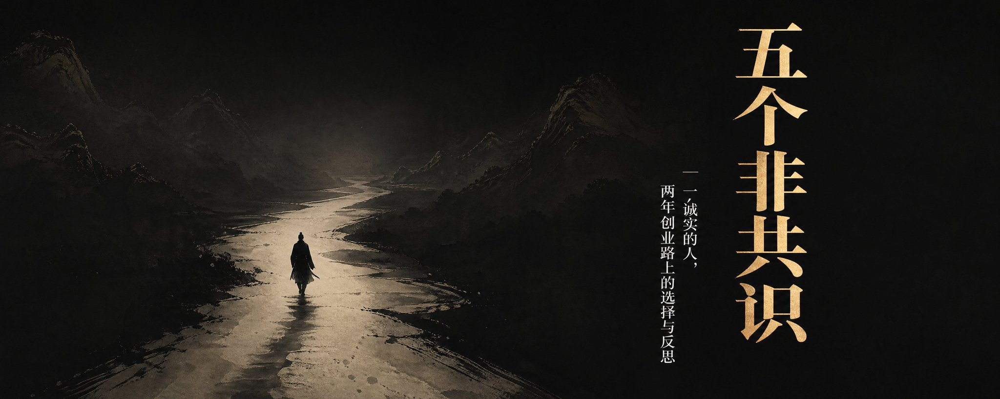

> 上周末，我在「产品力领航者大会」上做了一场分享，没有包装过的宏伟叙事，也没有精心设计的金句轰炸。只用大白话，讲了自己从大厂出来两年间的真实思考。以下是整理稿。

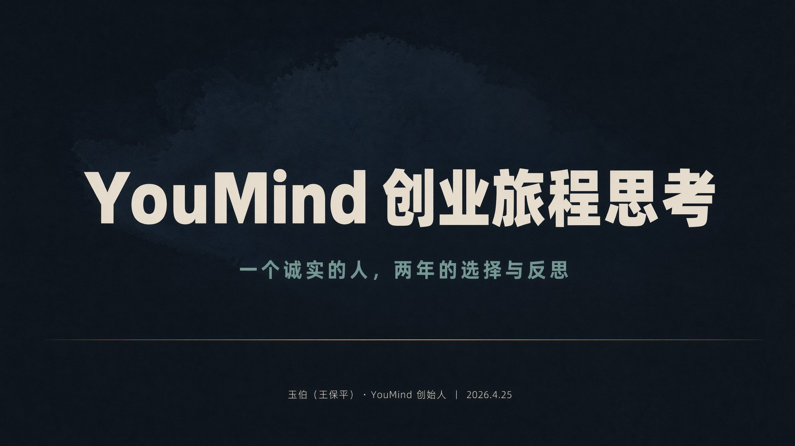

## 先说说我是谁

我叫玉伯。中科大物理系毕业后，在阿里做了十几年技术，后来去蚂蚁，和团队一起做 Ant Design 和语雀等产品。最后去了字节跳动，全职做了一年飞书产品经理。

2024年5月，我出来创业。开始做 YouMind，一款帮助内容创作者写文章、配插画、做 PPT、做视频的 AI 创作工具。

从创业第一天起，我跟团队定了一条价值观：**诚实**。对自己诚实，对团队诚实，对投资人诚实，对数据诚实。所以接下来说的这些，都是诚实的大白话，是真实的心路历程，可能跟大家想象中的创业故事不太一样。

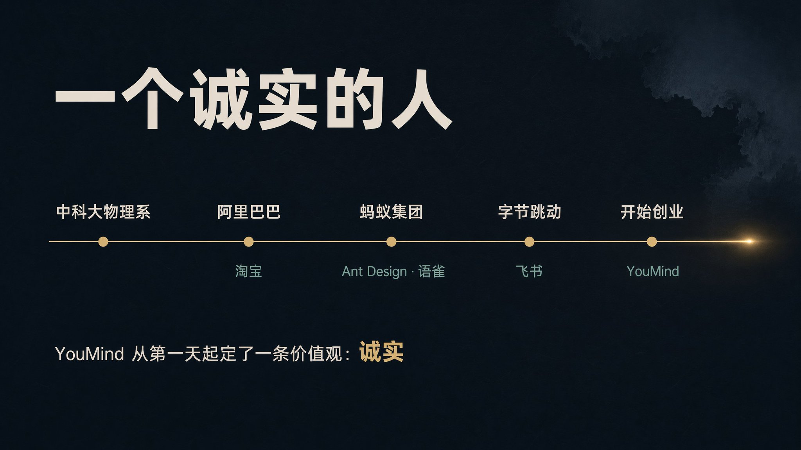

## 起心动念：创业三问

很多人问我为什么出来创业。其实原因很自然。在大厂最后几年，我发现自己身体非常忙，心里却有点闲。每天早上九点半到公司，忙到晚上十点半甚至十一点，开不完的会，回不完的消息。但周末醒来的时候，突然会问自己：过去五天究竟干了啥。好像除了开会，什么都没干。

那种飘浮感越来越强。我开始问自己三个问题：

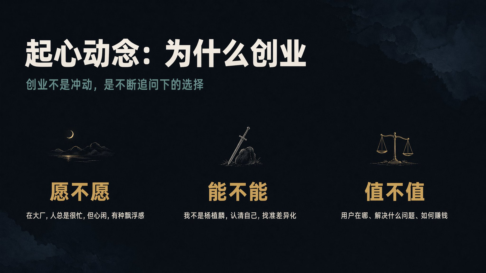

**愿不愿：**这是最根本的。创业的“愿”，很多时候来自于在大厂的“不愿”。不愿意继续在大平台上浪费时间。对时间的恐惧是真实的，“再不出来就老了”。

**能不能：**这个要非常理性。我很清楚自己不是杨植麟，如果我选择出来做大模型，今天可能就不会站在这里了。**认清自己不能做什么，比知道自己能做什么更重要。**

**值不值：**一旦拿了融资、组了团队，就不能只考虑自己。期权怎么分配、决策权怎么安排、大家一起创业究竟是为了什么，这些问题在第一天就应该想清楚。出发点可以是为了共同做一件有意义的事，但过程中一定不要忘记钱，**钱很关键**。

关于融资，在创业开始时很关键，多说几句。

我一开始纠结过要不要拿融资，甚至内心里更想做不拿融资的一人公司。一人公司有机会做出一个产品，但想打败大厂百人团队，概率上几乎没可能。想清楚自己究竟想做什么，可以一个人搞定，还是需要组建团队才有可能，需要在融资前就想清楚。而不是等拿到钱，在钱的驱使下盲目组建团队。想清楚要做什么，是一切的出发点。

第一次融资时，非常不顺利。我最开始聊了三四十家机构，一个 TS 都没拿到。后来聊到八九十家机构时，才有资本愿意投。融资过程中，和 VC 沟通过程中，要特别小心一件危险的事：当你反复跟别人说某个事的时候，会给自己心理暗示，甚至产生“这肯定是对的”的错觉。这时候要特别小心。给 VC 很容易说出宏伟叙事，但那往往不光是骗人的，还是骗自己的。融完资后，要回到地面重新审视，**从最小的地方出发去做**。

## 找方向：800 多创作者告诉我的事

刚从大厂出来时，我满脑子宏伟叙事，想做“AI 时代的纸和笔”，想成为新时代的微软。幸运的是，跑融资时，有朋友点醒我：以我的过往经历，更适合在“AI+内容创作”的大趋势中去找机会。“我想做什么”其实不重要，核心是用户需要什么。

从2024年到现在，我陆续跟八九百位内容创作者聊过，写文章的、做播客的、拍视频的。越聊越觉得可做的事情太多了。

很多内容创作者的工作方式是：记事本 + 飞书文档 + 豆包 + ChatGPT + 浏览器等，一堆工具组合在一起，好像也能凑合。但深入聊下去会发现，工具只是问题之一。**更大的痛点藏在工具之外**。

第一个痛点是选题。你确定要周更公众号，但这周写什么。AI 可以秒出文章，但选题，依旧还是人的事，是创作者的最关键点。

我碰到过不少小红书博主，前一个月鸡血满满，第三个月开始打退堂鼓，半年后粉丝也有几百，但一分钱没挣到。经常一年后，就从“想做博主”变成了“纯刷小红书”的用户。从起心动念到弃疗，时间快得惊人。

和大量用户聊完后，在内容创作领域，有三个普遍痛点浮出水面：**选题难、工具杂、赚钱难**。如果在任何一个点上做到有价值，这事就有机会。

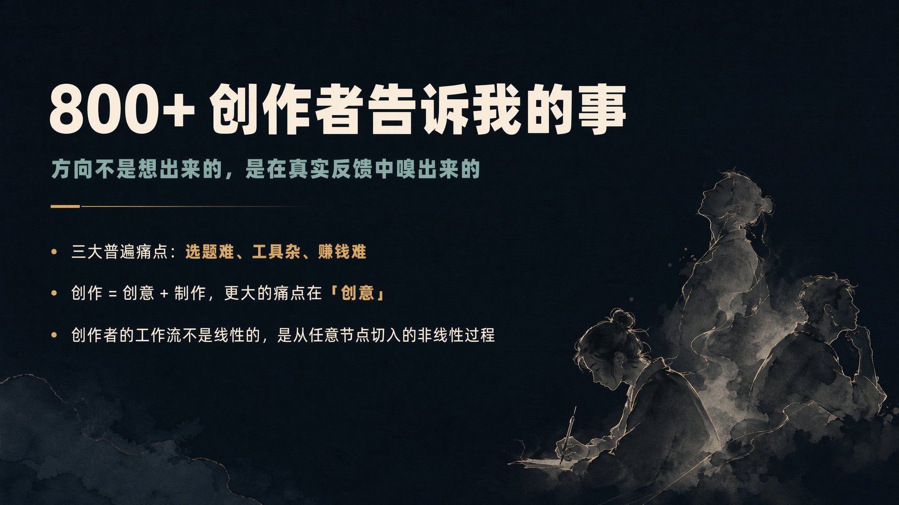

2024 年八九月份，我内心比较笃定了 YouMind 的产品定位，是 **Project-based AI Creation Studio**，一个基于项目的 AI 创作工作室。这个定位从确定到现在，从来没变过。

有三个关键认知：

**第一，是项目管理，不是知识管理。** 跟很多创作者聊完，我发现一个真相：绝大部分内容创作者不需要知识管理。Obsidian 是非常极客的人在用，绝大部分普通创作者没听过。创作者真正需要的是，不是某个工具，而是 Deadline，是贴在桌子的那句“下周五我一定要更新一篇”。Deadline 是第一生产力，Deadline 中文翻译是死线，**向死而生**，更有机会逼自己开始创作。

**第二，是 Creation Studio，不是一键生成。** 市面上太多工具告诉你“一键生成 PPT、一键生成文档”等。你给 AI 一个 prompt，很快生成十几页调研报告，你看不下去，又扔给 AI 说“帮我总结成一句话”，结果总结回去的就是你的 prompt。来回折腾，AI 把你的钱扣了，你却什么都没得到。自动化是最廉价的。真正的创作，不依赖自动化，从 0 到 1 的打磨，一定要拿自己的时间去换。

**第三，以稿子为中心：万物化稿，稿生万物。** 各种素材、录音、截图、上传的文件，先转化成一份有上下文的稿子。基于这份稿子再去写公众号、做小红书笔记、做视频、做 PPT，效果好太多。稿子承载着人的认知和风格，稿子就是内容制作的 long prompt。永远不要相信“一键生成”，但可以相信你付出的时间和你喂给 AI 的素材。

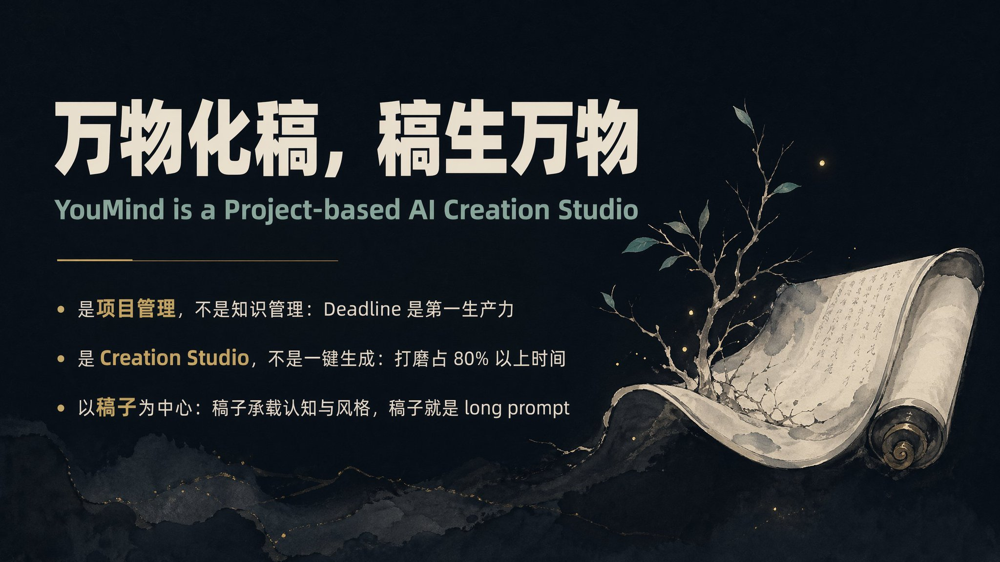

## 五个非共识：我们选了少有人走的路

过去两年，我们做了五个关键选择，每一个当时都有人说我们错了。这次分享，并不是来证明我们是对的，而是想分享，我们为什么选了这些路。

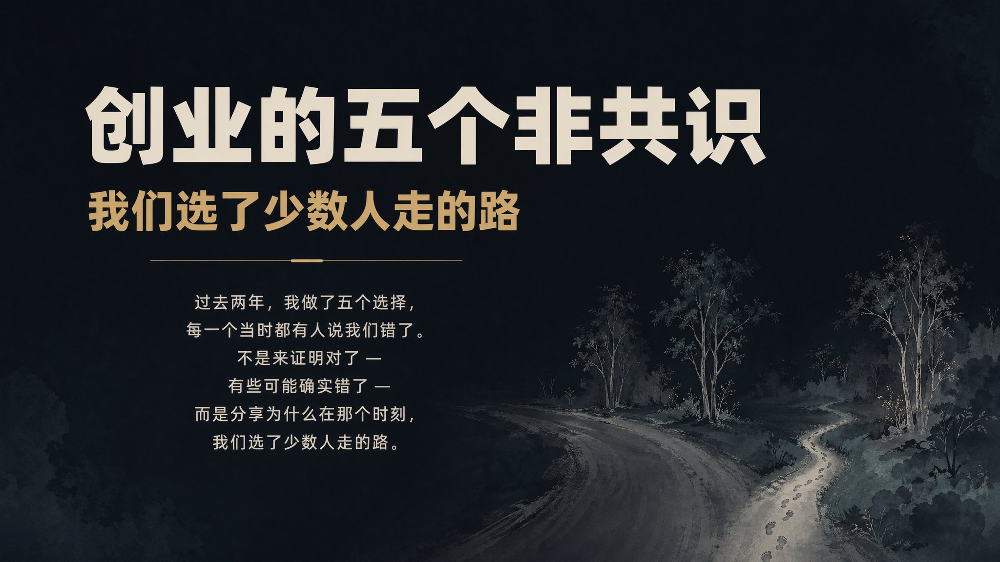

**一、好看是战略，不是装饰**

共识是“先把功能做好，界面以后再说”。我们的选择相反：**好看是获客的第一步，不是最后一步。**

2025 年的 AI 产品有个困境，所有产品都长成一个样：一个聊天框。AI 能力很强，但 UI 依旧很重要。现在人面临的选择太多了，UI 是获取注意力的第一步。

我心里有一个公式：好看（3 秒）→ 好用（30 分钟）→ 好卖（30 天）→ 好玩（3 个月），顺序不能反。3 秒定生死。

有用户告诉我，他弃用了 Perplexity 转而用 YouMind 的搜索功能。原因不是我们搜索更强，而是“在 YouMind 搜索像是在一个房子里，有安全感、跟自己相关、可以持续积累”。这是一种建筑感和氛围感。**好的 AI 产品不是一把把锤子，而是一座座建筑。**

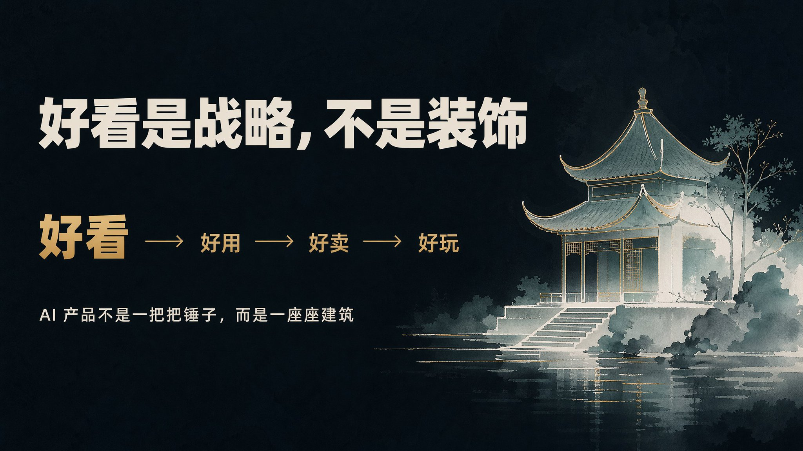

**二、选文科，不选武科**

业界共识是“AI 创业要做壁垒高的事”。我们的选择是：**文无第一，武无第二。**

**武是擂台**。做大语言模型、做 AI Coding，可以客观衡量谁快、谁准、谁便宜。擂台赛一定走向寡头，六小龙现在剩几条龙都不好说了。AI Coding 赛道无论海外还是国内都卷得飞起，最后很可能是寡头通吃。

**文是花园**。做内容创作，没有客观标准，只有主观偏好。你觉得好看的文章，他觉得是垃圾。一篇文章在公众号几十个赞，在小红书几万个赞，你说是不是爆款。在这个领域，AI 很难找到统一的衡量标准，有大把创业机会。

**创业者的生存空间不在擂台上，在花园里。**

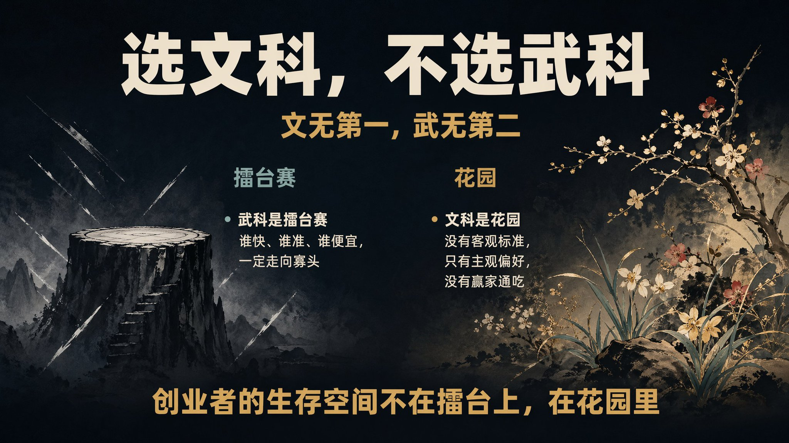

**三、听老手的话，服务新手**

业界共识是“做高端市场，服务专业用户”。我一开始也这么想。去找大 V，他们有钱，给他们做工具，他一年挣几百万，分我几万，找几百家服务好，创业就能活。

但现实是：我没有渠道认识那么多大 V。好不容易聊上了，发现他们的需求极其个性化，而且稍微成气候的大 V，都在组团队做自己的内容工厂。他们跟你聊，只是把你当免费咨询。

我甚至想过找李子柒，还找到了她的邮箱，发了邮件给她，结果没收到任何回复。李子柒不回是对的，她根本看不到我。大部分创业者和我一样，都是没渠道的人。

有意思的是，柳暗花明。我后来意识到，最大的市场其实是新手。想做内容创作、想做小红书的人，数量级远大于大 V。新手没有历史包袱，愿意试新工具。第一次做出以前做不出的东西，那个惊喜记忆，比任何产品功能都粘人。

**我们的目标不是服务李子柒，是培养下一个李子柒。**

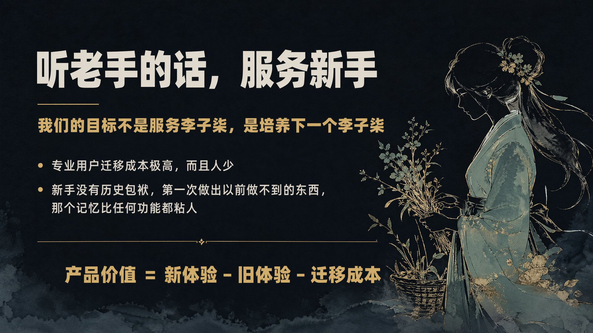

**四、不做 for Agent，做 for Human**

共识是“Agent 是新人口，为 Agent 服务是最大的机会”。有段时间看媒体，满屏都是 Agent 永生，所有人都在讲“让 Agent 更强”。

我们问了一个不同的问题：**谁让人更好。**

想想看，钱还在人手上，目前还没有 Agent 给另一个 Agent 付钱的规模化场景，出了事要去坐牢的也是人。钱带来自由，牢代表责任，**自由和责任都还在人身上**，我们当然应该为人服务。

Agent 可以很强，然而最终是人在用、人在决策、人在承担后果。AI 越强，人的判断越珍贵。**把复杂留给 AI，把意义留给人。**

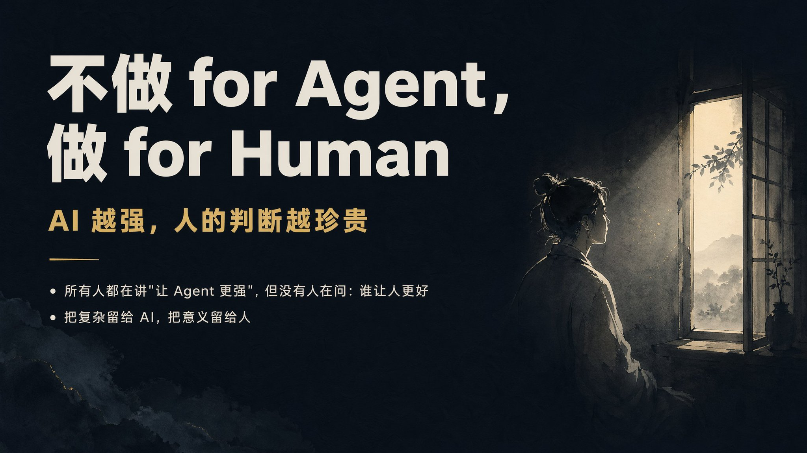

**五、多看一年，少看五年**

共识是“以终为始，站在终局思考，提前卡位”。

但终局是什么。十年以后会怎样。互联网时代可以这么想，那时候技术是确定的。然而如如今 AI 时代，一切都在快速变化，想这种终局问题，对今天你要做什么其实没有任何帮助。

我的选择是：最多想一年。然后想清楚三个月，做好这一周，做好这一天。你知道当下的用户在哪里，已有用户在吐槽哪个功能，哪里有 Bug 要修，当你把这些具体的问题装进脑袋时，人是踏实的。这种踏实更容易形成正循环，让公司一点一点往好的方向迭代。

**追终局的公司，很多已经不在了。活在当下的公司，都还在场上。**

## 品味：AI 时代人的终极瓶颈

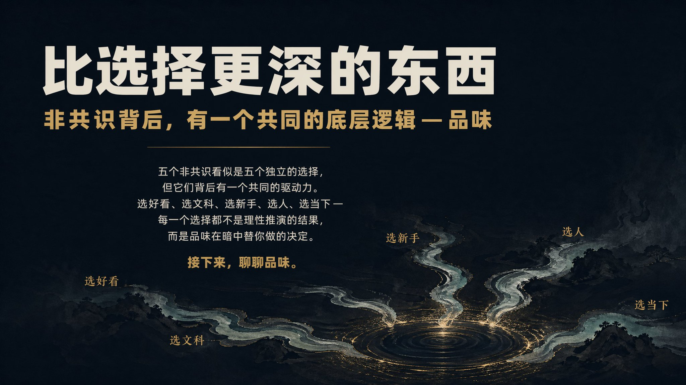

五个非共识看似是五个独立的选择，但它们背后有一个共同的驱动力：**品味**。选好看、选文科、选新手、选人、选当下，每一个选择都不是纯理性推演的结果，而是品味在暗中做决定。

Agent 遍地开花，内容数量涨了 1000 倍，但质量大同小异。区别到底在哪。不在工具，在品味。你选什么题、用什么角度写、在哪里停下来，这些决定着作品的面貌。

为了想清楚“品味”这件事，我花了将近一个月时间，把历史上关于品味的哲学流派都系统梳理了一遍。给我冲击最大的是波兰尼提出的“默会知识”：

> **We know more than we can tell.** 我们所知的远比我们所说的要多。

品味的本质是默会知识：**说不出来的东西才是品味**，它在默默发挥作用。如果有人跟你介绍他的品味是什么，那他大概率没有品味。真正有品味的人，不会说自己有品味，因为说不出来。

更有意思的是，**品味只在暗处运作**。一个钢琴家弹世界名曲的时候不会想着键盘，一个厨师炒菜的时候如果还在想“盐是不是放多了”，那菜已经不好吃了。品味必须在你不看的时候才运作。

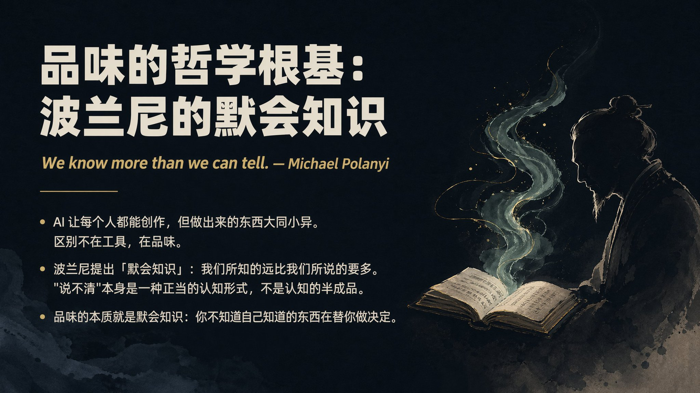

LLM 是人类所有显性知识集大成的究极产物，但品味是隐性的。品味在你写 prompt 之前就已经在暗中发力，决定了你会写什么样的 prompt。Agent 能执行，但不能替你拥有品味。

品味从哪里来。像考古一样，来自各种碎片：每天脑袋里成百上千个想法、一段文字、一个视频片段、一段播客里的某句话，等等。碎片散落在生活的每个角落，靠人脑记不住，靠工具又太笨。创作需要的不是工具，是搭档：了解你的碎片、理解你的偏好、在你还没想清楚时帮你串起线索。

这是我们正在做的“YouMind 精灵”：有灵魂（你的品味）+ 有记忆（你的碎片库）+ 有技能（创作工具链）。精灵不是你创建的工具，也不是你骑的马，它是你从精灵森林里召唤出来的，**精灵是懂你但不惯着你的好朋友**。

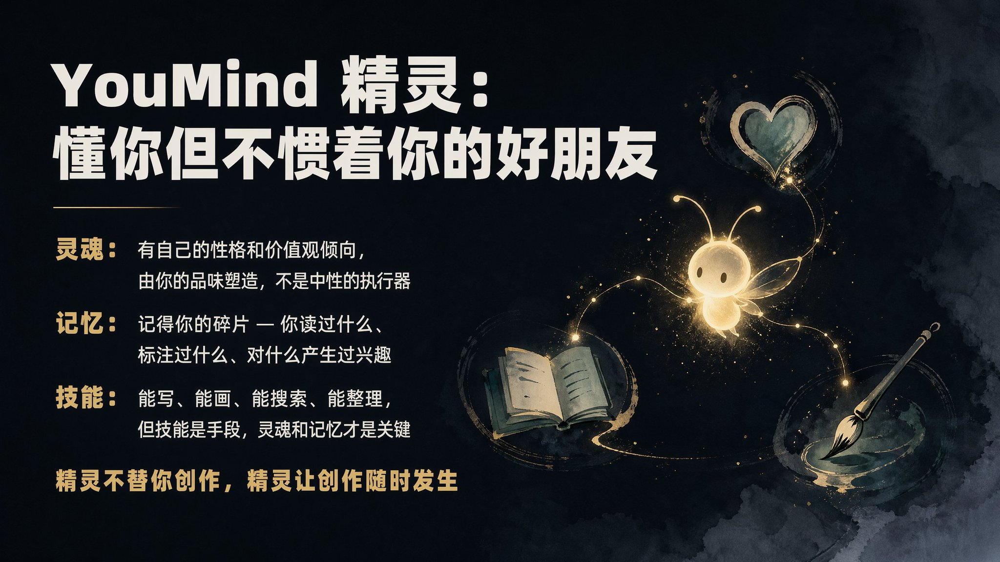

精灵不替你创作，精灵让创作随时发生。

## 活在当下：团队、增长与心力

**一、把金字塔倒过来**

我们团队现在二十几个人。从去年年底开始，我做了一个调整：把组织金字塔倒过来。

传统组织里，CEO 在上面，一层层往下。在 YouMind，金字塔尖是工程师和 agents，他们可以自己组队形成一个个小组，有大量事情的直接决策权。产品经理和设计师则在金字塔第二层，向上提供服务。工程师一天可以加 100 个功能，产品经理的价值是决定只留下哪几个。审美和做减法，这是产品经理最核心的贡献。

而我作为 CEO，做的更多是大家不想干的事。比如公司要倒垃圾，目前是我负责倒。我们还请不起每日保洁。

我们还用 GPA 框架替代了 OKR：G（Goal，独裁式目标设定）→ P（Priority，集中民主式优先级排序）→ A（Alternatives，彻底民主式方案选择）。团队无绩效考核，人人都是全干工程师。招人只看两点：对这件事是否真正感兴趣，以及学习能力，学习能力的核心判断标准是动手能力。

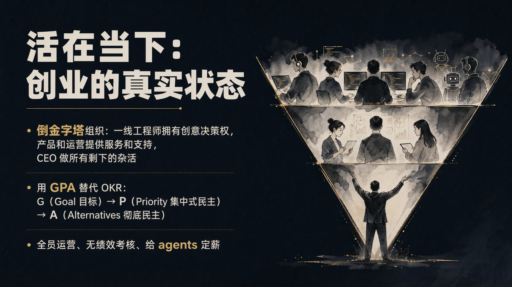

**二、全员运营的复利**

2024年12月我们发布了 YouMind 0.1 版本，从浏览器剪藏插件切入。团队每个人会要求定期分享，这样能真正吃狗粮，把自己的产品用起来。

一个有意思的发现是：**沉默用户是金**。活跃用户里往往藏着不少羊毛党，真正愿意付费的用户反而藏在沉默用户里。目前付费用户月留存约 95%，今年很有机会养活团队。对创业公司来说，先养活团队是非常关键的。

**三、AI 没有的那股“劲”**

中国创业公司平均寿命大概两三年，AI 时代更残酷，很多公司一年就没了。我见过一些之前创业的朋友，已经在转型或者非常艰难。我们还算幸运，目前还处于上升期。

创业最难的是心力。

心力不等于判断力，不等于使命感，它是一种源于内在意义感的驱动力。我脑海里一直有一个画面：大概 1999 年，马云在北京跑了一天融资，一家机构的钱都没拿到。有个视频拍到他坐在出租车上，非常落寞地看着车窗外，有点想哭，但嘴角有一丝不服。

**那种落寞中抬头看窗外的不服，就叫心力。**

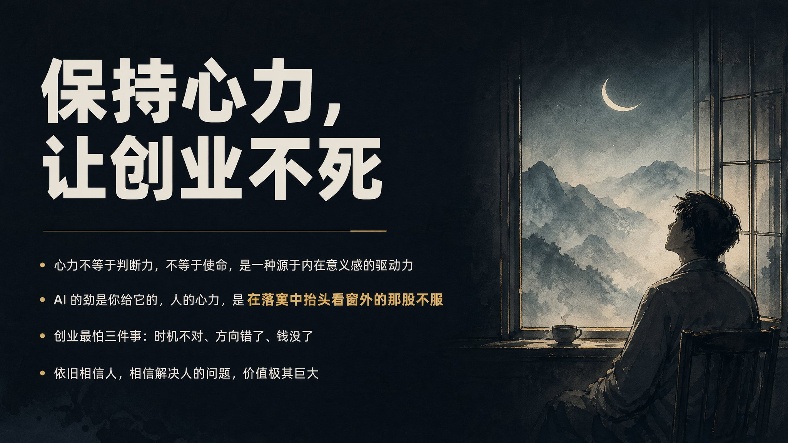

AI 没有这股劲。AI 的劲是你给它的，而人的心力，是自己长出来的。有时候越丧的时候人越有力量，因为你是在蹲着的，蹲着的人比跳起来的人更有后劲。

## 写在最后

这五个选择，选好看、选文科、选新手、选人、选当下，有人说保守，有人说不够性感。但我发现一个规律：那些追终局的人，总觉得当下不够好。而那些活在当下的人，反而走得更远。

我真的希望每一个人在 AI 时代都可以开始创作。创作会上瘾，就跟写代码一样。当你开始上瘾的时候，时间是有限的，你就会少刷抖音。

YouMind 的愿景是：**让再小的个体，都能拥有创作的乐趣。**

创业，最重要的是活在当下。

人人皆可创作，创作皆有乐趣。

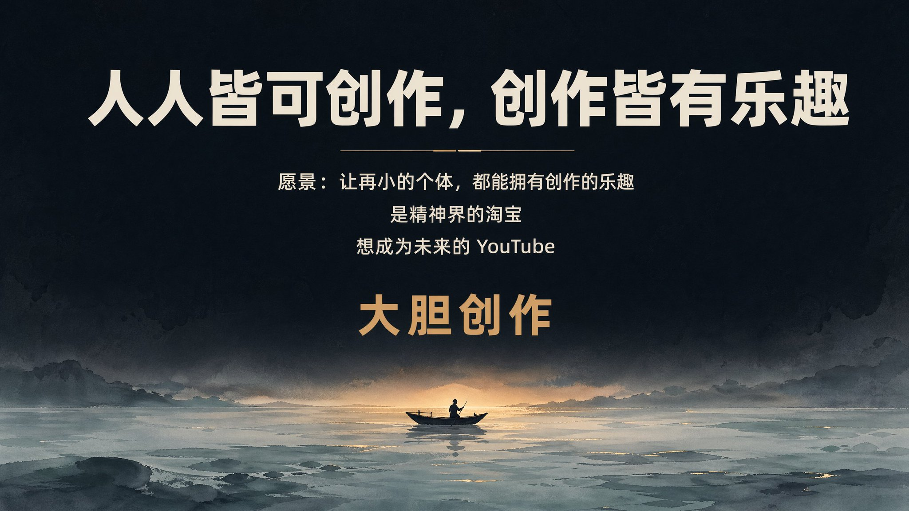
---

> **来源**: [https://x.com/lifesinger/status/2049074014727844246?s=46](https://x.com/lifesinger/status/2049074014727844246?s=46)
