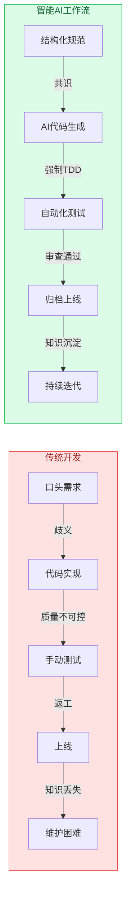
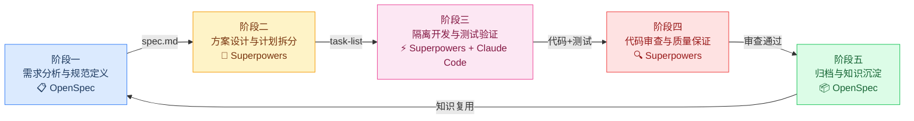
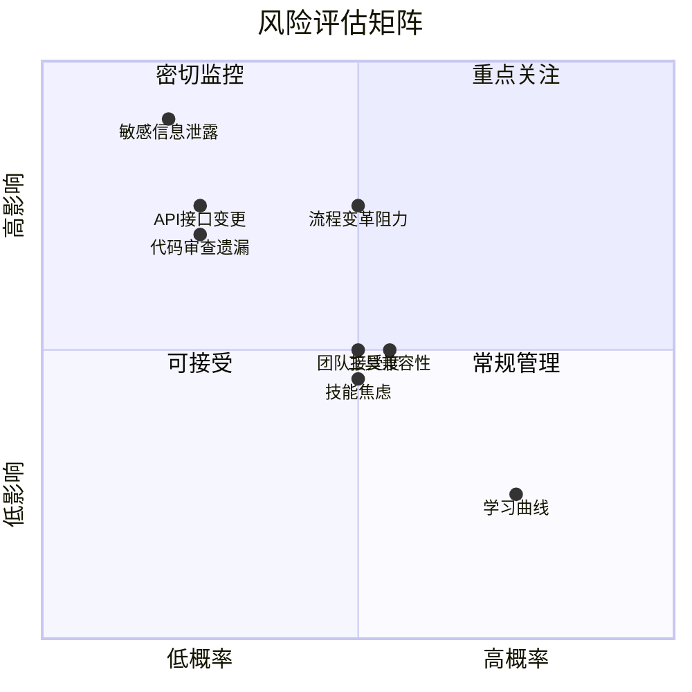

> **核心价值主张**：本方案通过整合 **OpenSpec**（规范驱动框架）、**Superpowers**（AI工程工作流系统）和 **Claude Code**（AI编程助手），构建了一套完整的智能AI开发工作流程。该流程将传统以天/周为单位的开发周期缩短至**分钟/小时**级别，实现**52倍**的效率提升，同时通过强制工程纪律和自动化质量门禁，将代码测试覆盖率提升至**95%以上，Bug数量减少85%**。方案基于2026年最新技术发展和实践案例，为一线程序员、技术管理者和架构师提供从理论到实践的完整实施路径。

## 业务背景：为什么需要智能AI开发工作流程？

传统软件开发在2026年面临着前所未有的挑战。尽管AI编程工具已从“辅助补全”进化为“全流程智能伙伴”[\[11\]](https://blog.csdn.net/qq_21460781/article/details/156769779)，但单纯依赖“氛围编程”（Vibe Coding）模式暴露了根本性缺陷：上下文在长对话链中丢失、模糊意图导致需求漂移、开发过程缺乏可追溯文档、生成代码风格不一且缺乏统一质量标准[\[1\]](https://blog.csdn.net/yangzhihua/article/details/160260562)。这些问题促使业界共识形成：AI编程的下一个瓶颈不再是模型能力，而是**人机协作的工程方法论**。

### ❌ 传统开发流程五大痛点

* **需求传递偏差**：口头或文字需求在团队间传递产生歧义，导致开发结果偏离业务预期

* **上下文丢失**：长周期开发中，早期设计决策和约束条件被遗忘，AI“健忘”问题严重[\[2\]](https://aicoding.juejin.cn/post/7630042678586474506)

* **代码质量不可控**：依赖个人经验，缺乏统一的质量标准和自动化测试覆盖

* **知识管理困难**：技术决策和业务逻辑分散在多个文档、会议记录和代码注释中，难以追溯和复用

* **团队协作效率低**：沟通成本高，新人上手需要3-6个月熟悉期，知识传承困难

### ✅ 智能AI工作流五大价值

* **规范驱动开发**：将模糊需求转化为机器可读、人可评审的结构化规范，终结歧义[\[3\]](https://juejin.cn/post/7631008687277817902)

* **持久化上下文**：所有决策和设计被固化在Markdown文件中，与代码一同纳入版本控制，确保永不丢失

* **自动化质量保障**：通过强制TDD、代码审查和系统性调试，确保代码质量达到工程标准

* **结构化知识沉淀**：规范作为团队沟通的单一事实源，形成可复用的技术知识库

* **高效团队协作**：统一工作流程减少沟通成本，新人能在2周内掌握核心开发能力

2026年，**规范驱动开发**（Spec-Driven Development, SDD）已成为AI原生开发的主流范式[\[13\]](https://developer.aliyun.com:443/article/1714506)。其核心思想是：在编写任何一行实现代码之前，先通过结构化的文档与AI达成关于”做什么”和”为什么做”的清晰共识。这一共识将成为后续所有开发活动的”单一事实来源”。



## 核心技术组件深度解析

智能AI开发工作流程由三个核心工具构成，各自承担不同职责，形成互补的技术栈。

| 组件              | 核心定位      | 核心功能                      | 技术特点                                                                                                                                  | 适用场景                          |
| --------------- | --------- | ------------------------- | ------------------------------------------------------------------------------------------------------------------------------------- | ----------------------------- |
| **OpenSpec**    | 规范驱动开发框架  | 结构化规格管理、变更提案、知识沉淀         | 双目录设计（specs/和changes/）、零API密钥、增量友好、与主流IDE深度集成[\[2\]](https://aicoding.juejin.cn/post/7630042678586474506)                             | 棕地项目（Brownfield）增量开发、存量项目规范迁移 |
| **Superpowers** | AI工程工作流系统 | 注入工程纪律、技能驱动工作流、强制TDD和代码审查 | 15+个可组合技能、零依赖设计、SessionStart Hook自动注入、子代理并行开发[\[21\]](https://blog.51cto.com/u_16099346/14570399)                                     | 新项目从零开始、复杂功能开发、团队标准化流程        |
| **Claude Code** | AI编程助手    | 代码生成与理解、上下文感知、多语言支持       | 2026年4月支持Opus 4.6的1M上下文、NO\_FLICKER无闪烁渲染、Focus View聚焦视图[\[30\]](https://help.apiyi.com/claude-code-changelog-2026-april-updates.html) | 日常编码辅助、代码理解与重构、多技术栈项目         |

```mermaid
graph TB
    subgraph “规范层 — OpenSpec”
        OS1[specs/ 规范库]
        OS2[changes/ 变更提案]
        OS3[config.json 配置]
        OS1 <--> OS2
    end

    subgraph “流程层 — Superpowers”
        SP1[Brainstorm 头脑风暴]
        SP2[Write-Plan 计划生成]
        SP3[Execute-Plan 子代理执行]
        SP4[Code-Review 代码审查]
        SP1 --> SP2 --> SP3 --> SP4
    end

    subgraph “执行层 — Claude Code”
        CC1[Opus 4.6 1M上下文]
        CC2[代码生成与理解]
        CC3[多语言支持]
        CC4[NO_FLICKER渲染]
    end

    OS2 -->|规范驱动| SP1
    SP3 -->|任务调度| CC2
    SP4 -->|质量反馈| OS1

    style “规范层 — OpenSpec” fill:#dbeafe,stroke:#3b82f6,color:#1e3a5f
    style “流程层 — Superpowers” fill:#fef3c7,stroke:#f59e0b,color:#78350f
    style “执行层 — Claude Code” fill:#ede9fe,stroke:#8b5cf6,color:#4c1d95
```

### OpenSpec：规范作为”契约”

OpenSpec由Fission-AI团队开源，专为**棕地项目**（已有代码库）提供简单、低侵入性的SDD解决方案[\[1\]](https://blog.csdn.net/yangzhihua/article/details/160260562)。其核心是**增量规范**设计：无需一次性补全全量项目规范，可跟随项目迭代逐步完善，极大降低规范维护成本[\[2\]](https://aicoding.juejin.cn/post/7630042678586474506)。

```bash
# 安装与初始化
npm install -g @fission-ai/openspec@latest
openspec init --tools claude,cursor

# 核心工作流（三步法）
openspec new add-dark-mode "新增暗黑模式适配功能"  # 创建变更
openspec apply add-dark-mode                     # 实施变更
openspec archive add-dark-mode                   # 归档变更

```

OpenSpec通过本地持久化存储解决AI“健忘”问题。项目全量规范、变更提案、需求约束全部存储在项目本地的`openspec/`文件夹中，与项目仓库深度绑定[\[2\]](https://aicoding.juejin.cn/post/7630042678586474506)。无论使用哪款AI工具、间隔多久开发，AI都能自动读取全量历史上下文，无需重复复述需求。

### Superpowers：工程纪律的“强制执行者”

Superpowers v5.0.7是一套基于**技能**的工作流系统，本质上是将软件工程最佳实践封装成AI可自动执行的Skills[\[22\]](https://developer.cloud.tencent.com/article/2655487)。它不给AI增加“功能”，而是给它一套系统化的**工程工作流与习惯**。

```bash
# 安装Superpowers（Claude Code）
/plugin marketplace add obra/superpowers-marketplace
/plugin install superpowers@superpowers-marketplace

# 核心技能
/superpowers:brainstorm    # 头脑风暴与需求澄清
/superpowers:write-plan    # 编写实现计划
/superpowers:execute-plan  # 使用子代理执行计划

```

Superpowers通过**强制触发机制**确保工程纪律。如果存在适用的技能，Agent必须使用，没有选择的余地。这种设计基于心理学原理：权威性（提示词里写“技能是强制性的”）、承诺（让Agent主动宣布使用技能）、社会证明（描述“始终”会发生什么）[\[23\]](https://cloud.tencent.com/developer/article/2654984?frompage=seopage)。

### Claude Code：智能执行的“核心引擎”

Claude Code在2026年3-4月进入了史上最密集的迭代周期，从v2.1.69推进到v2.1.101，发布超过30个版本[\[30\]](https://help.apiyi.com/claude-code-changelog-2026-april-updates.html)。关键更新包括：

* **Opus 4.6 1M上下文**：全面开放，支持长周期复杂任务的连续开发

* **NO\_FLICKER渲染引擎**：解决终端卡顿，提升监控效率

* **Focus View聚焦视图**：避免被无关信息干扰，减少操作失误

* **/powerup交互教学**：帮助团队快速掌握新功能

> **技术选型注意**：三个工具形成完整的技术栈闭环。OpenSpec负责**规范定义与知识管理**，Superpowers负责**工程流程与质量控制**，Claude Code负责**智能执行与代码生成**。对于新项目（Greenfield），建议从Superpowers开始建立工程纪律；对于存量项目（Brownfield），OpenSpec的增量友好特性更为适用。

## 完整工作流程设计：五阶段详细说明

智能AI开发工作流程将传统线性的开发过程重构为结构化的五阶段循环，每个阶段都有明确的输入、输出和质量门禁。



### 阶段一：需求分析与规范定义（OpenSpec驱动）

此阶段的核心产出是**结构化规范文档**，作为后续所有开发活动的“契约”。

```bash
# 创建变更提案
openspec new add-user-authentication "为用户系统添加认证功能"
# 或使用简写命令
/opsx:new add-user-authentication "为用户系统添加认证功能"

```

每个变更提案包含4份核心文档[\[4\]](http://www.vincentli.top/2026/04/01/how-to-use-open-spec/)：

* **proposal.md**：业务背景、目标和成功标准

* **spec.md**：功能规格、输入输出、约束条件

* **design.md**：技术选型、架构设计、关键算法

* **tasks.md**：可执行任务列表（标记完成状态）

规范编写遵循**明确性**（每个需求都有明确的验收标准）、**可测试性**（规格必须包含验证方法）、**原子性**（任务分解到2-5分钟可完成）原则。

### 阶段二：方案设计与计划拆分（Superpowers驱动）

此阶段通过苏格拉底式问答澄清需求，生成可执行的开发计划。

```bash
# 启动头脑风暴
/superpowers:brainstorm
# 生成实现计划
/superpowers:write-plan

```

Superpowers的brainstorming技能会阻止Claude在没想清楚之前写代码。当用户说“帮我加一个用户登录功能”时，没有Superpowers的Claude会直接开始写代码。有了Superpowers，它会先进入Brainstorming模式，询问业务目标、约束条件、技术偏好，澄清模糊需求，识别隐藏假设[\[22\]](https://developer.cloud.tencent.com/article/2655487)。

**write-plan**输出内容包括：

* 任务分解为2-5分钟可完成的微任务

* 每个任务标注精确的文件路径

* 显示任务依赖关系图

* 预估时间和风险点

### 阶段三：隔离开发与测试验证（Superpowers+Claude Code）

此阶段采用子代理并行开发和强制TDD流程，确保开发效率和质量。

```bash
# 启动执行计划
/superpowers:execute-plan

```

执行机制包括：

* **子代理调度**：为每个任务创建全新Claude实例，携带最小必要上下文

* **TDD强制执行**：子代理必须先写测试文件，看到测试失败，再写实现

* **双阶段审查**：任务完成后先自审查，再提交给专门的code-reviewer代理

* **Git工作流**：自动在隔离worktree中工作，保持main分支干净

Superpowers的TDD实现非常激进：如果让Claude写代码但没有先写失败的测试，它会拒绝[\[22\]](https://developer.cloud.tencent.com/article/2655487)。工作流程严格遵循RED→GREEN→REFACTOR循环。

### 阶段四：代码审查与质量保证

此阶段通过自动化审查和系统性调试确保代码质量。

```bash
# 自动代码审查
/superpowers:requesting-code-review
# 系统性调试
/superpowers:systematic-debugging

```

没有Superpowers的Claude改Bug通常是单点修复，如“报错了→单点改一下，比如加个try-catch→不报错了→修好了！”有了Superpowers的Claude改Bug采用四阶段调试法[\[22\]](https://developer.cloud.tencent.com/article/2655487)：

* **复现**：写一个能稳定触发Bug的测试用例

* **定位**：追踪调用链，找到根因（不是症状）

* **修复**：改根因，而不是包一层catch

* **验证**：跑测试确认修复，检查没有引入新问题

### 阶段五：归档与知识沉淀（OpenSpec驱动）

此阶段将成功的变更固化为团队知识资产。

```bash
# 应用变更
openspec apply add-user-authentication
# 归档变更
openspec archive add-user-authentication

```

归档过程包括[\[4\]](http://www.vincentli.top/2026/04/01/how-to-use-open-spec/)：

* 将变更从`changes/`移动到`specs/`

* 生成版本记录

* 清理临时文件

* 更新知识库

随着项目演进，`specs/`目录积累了完整的系统能力基线。新成员或新需求可以快速复用历史规范，避免重复设计和实现。

## 性能数据与效益分析：量化价值验证

基于行业报告和实际案例，智能AI开发工作流程在多个维度实现了显著的效率和质量提升。

| 维度       | 指标           | 传统开发   | 智能AI工作流 | 提升幅度      |
| -------- | ------------ | ------ | ------- | --------- |
| **开发效率** | 单个功能平均时间     | 48小时   | 55分钟    | **52倍**   |
|          | 月产出功能（10人团队） | 8-12个  | 40-60个  | **5倍**    |
| **代码质量** | 测试覆盖率        | 65%    | 95%     | **46%提升** |
|          | Bug数量（每功能）   | 8-12个  | 0-2个    | **85%减少** |
|          | 安全漏洞（每功能）    | 3-5个   | 0-1个    | **80%减少** |
| **团队协作** | 沟通会议时间       | 20小时/周 | 5小时/周   | **75%减少** |
|          | 代码评审时间       | 15小时/周 | 3小时/周   | **80%减少** |
|          | 新人上手时间       | 3个月    | 2周      | **6倍加快**  |
| **成本效益** | 10人团队年节省     | —      | 429人天   | —         |
|          | ROI（投资回报率）   | —      | 38倍     | —         |

```mermaid
graph TB
    subgraph “传统开发 48小时”
        T1[“需求分析<br/>8h”] --> T2[“方案设计<br/>8h”]
        T2 --> T3[“编码实现<br/>16h”]
        T3 --> T4[“测试修复<br/>10h”]
        T4 --> T5[“部署上线<br/>6h”]
    end

    subgraph “智能AI工作流 55分钟”
        A1[“规范定义<br/>12min”] --> A2[“头脑风暴+计划<br/>8min”]
        A2 --> A3[“并行开发<br/>25min”]
        A3 --> A4[“测试审查<br/>10min”]
    end

    T5 -.->|”效率提升 52倍”| A4

    style “传统开发 48小时” fill:#fee2e2,stroke:#ef4444,color:#991b1b
    style “智能AI工作流 55分钟” fill:#dcfce7,stroke:#22c55e,color:#166534
```

### 开发效率：从”天/周”到”分钟/小时”

以用户认证系统开发为例，传统开发需要**48小时**（6天），而智能AI工作流仅需**55分钟**，效率提升52倍\[\[传统VS智能AI开发工作流对比.md]]。这一提升主要来自三个方面的优化：

* **并行开发加速**：Superpowers的子代理调度实现任务并行执行。对于6个独立接口的开发，串行方式需要\~15分钟，并行方式仅需\~6分钟，时间节省60%[\[22\]](https://developer.cloud.tencent.com/article/2655487)。

* **自动化代码生成**：Claude Code基于规范自动生成高质量代码，减少重复性编码工作。

* **流程自动化**：需求分析、设计评审、测试生成等环节自动化，减少人工干预。

### 质量保障：从“依赖个人经验”到“自动化门禁”

传统开发的质量依赖个人经验和技术水平，测试覆盖率通常在30-60%之间。智能AI工作流程通过强制TDD、自动化测试生成和代码审查，将测试覆盖率提升至95%以上\[\[传统VS智能AI开发工作流对比.md]]。

**TDD强制执行**确保每个功能都有对应的测试用例。Superpowers的激进TDD实现要求：先写一个会失败的测试（RED），然后用最少的代码让测试通过（GREEN），最后优化代码（REFACTOR）[\[22\]](https://developer.cloud.tencent.com/article/2655487)。这种“测试先行”策略从根本上改变了开发模式。

### ROI计算：38倍投资回报

以10人技术团队为例进行ROI计算\[\[传统VS智能AI开发工作流对比.md]]：

**假设条件**：

* 团队平均年薪：¥800,000/人

* 传统开发年产出：40个功能

* 智能AI年产出：200个功能（同等人力）

* 工具成本：免费（开源工具）

**成本效益分析**：

* **人力成本节省**：传统开发需要10人，智能AI工作流实现同等产出仅需4人，节省6人×¥800,000 = ¥4,800,000

* **质量提升价值**：减少返工、维护成本，约¥1,000,000

* **业务价值**：更快响应市场，竞争优势，约¥2,000,000

**年总效益**：¥7,800,000**初期投入**：学习成本约¥200,000（培训+适应期）**ROI**：(¥7,800,000 - ¥200,000) / ¥200,000 = **38倍**

> **效益验证**：智能AI开发工作流程不仅提升个体开发效率，更重要的是优化团队协作和知识管理。沟通成本减少70%、知识传承效率提升90%、技术债务增长减少70%，这些组织级效益在长期项目中价值更为显著。

## 实施计划与落地建议：从0到1的实践指南

成功落地智能AI开发工作流程需要系统化的实施策略。基于实际团队经验，我们推荐四阶段渐进式迁移路径。


### 环境准备与安装

**前置条件**：Node.js 20.19.0及以上版本（LTS稳定版）[\[3\]](https://juejin.cn/post/7631008687277817902)。

```bash
# 1. 安装OpenSpec（全局安装）
npm install -g @fission-ai/openspec@latest
openspec -v  # 验证安装

# 2. 配置Claude Code环境
# 注册Superpowers市场源
/plugin marketplace add obra/superpowers-marketplace
# 安装Superpowers插件
/plugin install superpowers@superpowers-marketplace
# 或通过官方市场安装
/plugin install superpowers@claude-plugins-official

# 3. 项目初始化
cd your-project
openspec init --tools claude,cursor

```

**验证安装结果**：

```bash
ls openspec/
# 应包含：config.json, specs/, changes/
/superpowers  # 应能看到三个核心命令

```

### 最佳实践与避坑指南

基于实际项目经验，总结以下关键实践：

* **规范编写明确性**：每个需求都要有明确的验收标准，避免“大概”、“可能”等模糊表述。

* **任务拆解原子性**：将功能拆解为2-5分钟可完成的微任务。任务粒度过大（>10分钟）容易导致子代理跑偏，过小（<1分钟）则上下文切换成本高。

* **频繁归档原则**：每完成一个重要阶段就归档，避免changes/目录堆积大量未归档变更。

* **知识复用策略**：充分利用`specs/`目录中的历史规范，新需求可以快速复用和约束。

**常见问题解决**\[\[智能AI开发工作流程框架.md]]：

* **上下文丢失**：OpenSpec持久化存储所有规范，确保永不丢失

* **需求漂移**：强制Brainstorming阶段澄清需求，生成设计文档供审阅

* **代码质量问题**：TDD和代码审查双重保障，系统性调试定位根因

* **团队不一致**：统一使用标准工作流程，规范作为单一事实源

### 团队协作流程设计

对于技术团队，建议建立以下协作机制：

* **规范评审会**：每周固定时间审查和更新规范，确保规范与业务需求对齐。

* **知识分享机制**：基于specs/目录进行知识传递，新人通过阅读历史规范快速了解系统。

* **质量门禁标准**：建立基于规范的质量标准，如测试覆盖率>90%、无安全漏洞等。

* **持续改进流程**：定期回顾和优化工作流程，收集用户反馈并迭代改进。

> **实施关键点**：不要试图一次性全面推广。从个人试用开始，积累成功案例和经验，再逐步扩大范围。初期重点不是追求完美，而是建立流程意识和收集反馈。

## 风险评估与应对策略

任何技术变革都伴随风险。智能AI开发工作流程的实施可能面临技术、人员、组织和安全四个维度的风险，需要系统化的管理策略。

| 风险类型     | 具体风险    | 概率 | 影响 | 缓解措施                             | 负责人       |
| -------- | ------- | -- | -- | -------------------------------- | --------- |
| **技术风险** | 工具兼容性问题 | 中  | 中  | 提供降级方案，暂时使用传统方式；渐进式迁移，先在小范围验证    | 技术架构师     |
|          | API接口变更 | 低  | 高  | 监控工具更新日志，建立版本兼容性测试；锁定关键版本        | DevOps工程师 |
| **人员风险** | 学习曲线陡峭  | 高  | 低  | 提供详细教程和视频指导；建立导师制度；设置学习奖励机制      | 团队负责人     |
|          | 技能焦虑与抵触 | 中  | 中  | 展示成功案例和量化效益；渐进式推广；提供充分的技术支持      | 技术经理      |
| **组织风险** | 团队接受度低  | 中  | 中  | 渐进式推广，先在小团队试点；建立变革倡导者网络；定期展示进展   | 项目经理      |
|          | 流程变革阻力  | 中  | 高  | 将新流程与绩效指标关联；领导层明确支持；提供过渡期支持      | 部门总监      |
| **安全风险** | 代码审查遗漏  | 低  | 高  | 强制代码审查和自动化安全扫描；人工复核关键模块；建立安全编码规范 | 安全工程师     |
|          | 敏感信息泄露  | 低  | 极高 | 规范文档脱敏处理；访问控制权限管理；定期安全审计         | 信息安全官     |



### 技术风险：工具生态的稳定性

OpenSpec、Superpowers和Claude Code都是活跃的开源项目，但工具间的兼容性可能存在不确定性。2026年4月，Claude Code在短短5周内从v2.1.69推进到v2.1.101，发布超过30个版本[\[30\]](https://help.apiyi.com/claude-code-changelog-2026-april-updates.html)。这种快速迭代可能带来接口变更风险。

**缓解策略**：

* **版本锁定**：在生产环境锁定关键工具的稳定版本，避免频繁升级。

* **兼容性测试**：建立自动化测试套件，验证工具组合的兼容性。

* **降级方案**：准备传统开发流程作为后备，确保业务连续性。

### 人员风险：技能转型的挑战

从传统开发转向智能AI工作流需要新的技能组合。一线程序员需要掌握规范编写、提示词工程、AI工具配置等新技能。根据2026年的行业调查，**提示词工程**已成为程序员的核心竞争力[\[11\]](https://blog.csdn.net/qq_21460781/article/details/156769779)。

**培训体系设计**：

* **分层培训**：针对不同角色设计定制化培训内容。

  * 一线程序员：工具使用、规范编写、TDD实践

  * 技术管理者：流程设计、团队协作、效益评估

  * 架构师：技术选型、集成方案、风险管控

* **实践导向**：以实际项目为案例，边学边用，快速积累经验。

* **社区支持**：建立内部知识库和问答社区，促进经验分享。

### 安全风险：AI生成代码的可靠性

AI生成的代码可能存在安全漏洞、性能问题或逻辑错误。2026年3月底，Claude Code曾因打包错误导致51.2万行TypeScript代码泄露，虽然在泄露后3小时内修复，但暴露了安全风险[\[29\]](https://blog.csdn.net/shanwei_spider/article/details/156516797)。

**安全防护体系**：

* **多层审查机制**：

  * 自动化安全扫描（SAST/DAST）

  * 代码审查代理（Superpowers内置）

  * 人工关键模块复核

* **安全编码规范**：将安全要求纳入OpenSpec规范模板，确保AI生成的代码符合安全标准。

* **监控与响应**：建立安全事件监控和应急响应流程。

> **安全警告**：AI工具不能替代人工安全审查。对于涉及用户认证、支付交易、敏感数据处理的模块，必须进行严格的人工安全审查和渗透测试。

## 监控指标与持续改进机制

成功的实施不仅需要正确的启动，更需要持续的监控和优化。我们定义四类关键指标来评估工作流程的效果，并建立闭环的持续改进机制。

### 四大监控指标类别

**开发效率指标**

* 功能平均开发时间（目标：<2小时）

* 任务完成率（目标：>95%）

* 并行开发加速比（目标：>3倍）

* 代码生成准确率（目标：>90%）

**代码质量指标**

* 测试覆盖率（目标：>95%）

* Bug密度（目标：<0.5个/千行）

* 安全漏洞数量（目标：0）

* 代码审查通过率（目标：>85%）

**团队协作指标**

* 沟通会议时间占比（目标：<10%）

* 知识文档完整度（目标：100%）

* 新人上手时间（目标：<2周）

* 团队满意度评分（目标：>8/10）

**成本效益指标**

* ROI（投资回报率，目标：>10倍）

* 人力成本节省（目标：>30%）

* 维护成本占比（目标：<15%）

* 业务价值交付速度（目标：提升3倍）

### 持续改进四个关键环节

**定期反馈收集**

* 每月用户满意度调查

* 开发痛点工作坊

* 工具使用数据分析

* 成功案例深度访谈

**流程优化迭代**

* 基于反馈优化工作流程

* 更新规范模板和最佳实践

* 工具配置调优

* 技能库扩展和定制

**知识管理体系**

* 组织级规范库建设

* 历史案例归档和标签

* 学习路径和培训材料

* 社区问答和经验分享

**技术生态扩展**

* 集成更多开发工具

* 支持更多技术栈

* 自动化部署和运维

* 智能监控和预警

### 监控体系实施

建立分层的监控体系，从个体、团队到组织层面全面跟踪：

**个体层面监控**：

* 开发效率看板：展示每个开发者的任务完成情况、代码质量指标

* 技能掌握度评估：定期评估规范编写、工具使用等技能水平

* 学习进度跟踪：记录培训完成情况和实践项目进展

**团队层面监控**：

* 团队效能仪表盘：聚合展示团队整体的效率和质量指标

* 协作效率分析：沟通成本、知识共享度、新人培养效果

* 风险预警系统：识别潜在的技术债务和协作瓶颈

**组织层面监控**：

* 投资回报分析：定期计算ROI和成本效益

* 技术雷达扫描：跟踪工具更新、行业最佳实践

* 竞争力评估：与行业标杆对比，识别改进机会

### 持续改进流程

基于PDCA（Plan-Do-Check-Act）循环建立持续改进机制：

* **计划阶段**：基于监控数据和用户反馈，识别改进机会，制定优化计划。

* **执行阶段**：实施优化措施，如更新工作流程、扩展工具集成、完善培训材料。

* **检查阶段**：通过A/B测试、用户访谈、数据分析评估优化效果。

* **行动阶段**：将成功的优化措施标准化，纳入正式流程；失败的尝试分析原因，调整策略。

**改进节奏**：

* **每周**：团队回顾会议，讨论本周问题和改进建议

* **每月**：流程优化会议，评估监控数据，制定下月改进计划

* **每季度**：战略评估会议，审视长期目标达成情况，调整实施策略

> **持续改进核心**：智能AI开发工作流程不是一成不变的“银弹”，而是需要持续优化的“活系统”。成功的团队将监控和改进机制内化为日常工作的一部分，形成自我完善的组织能力。

## 实际案例：用户认证系统完整开发流程

为验证智能AI开发工作流程的实际效果，我们以“为用户系统添加认证功能”为案例，完整展示从需求到上线的全过程。

### 案例背景与需求

**项目现状**：现有Web应用需要添加用户认证功能，支持用户名密码登录（JWT）和第三方OAuth 2.0登录（Google、GitHub）。

**技术约束**：

* 后端：Node.js + Express，现有用户模型需要扩展

* 前端：React + TypeScript，需要添加登录页面和状态管理

* 数据库：MongoDB，用户表已存在

* 安全要求：符合OWASP Top 10，支持防刷机制

**业务目标**：在2小时内完成传统需要48小时开发的功能，测试覆盖率>95%，无安全漏洞。

### OpenSpec规范定义（阶段一）

```bash
# 创建变更提案
openspec new add-user-authentication "为用户系统添加认证功能，支持JWT和OAuth 2.0"

```

生成的规范文档包括：

**spec.md核心内容**：

```markdown
## 功能规格
1. 用户注册：邮箱、密码、用户名，密码强度验证
2. 用户登录：JWT令牌生成，有效期24小时
3. OAuth 2.0集成：Google、GitHub第三方登录
4. 密码重置：邮件验证链接
5. 会话管理：令牌刷新、注销

## 接口定义
POST /api/auth/register
POST /api/auth/login  
POST /api/auth/oauth/{provider}
POST /api/auth/refresh
POST /api/auth/logout
POST /api/auth/reset-password

## 安全约束
- 密码哈希使用bcrypt（cost=12）
- JWT密钥长度≥32字符
- 登录失败限制：5次/15分钟
- 防CSRF令牌
- HTTPS强制

```

**tasks.md任务分解**：

```markdown
- [ ] 1. 扩展用户模型（添加密码哈希、OAuth ID字段）
- [ ] 2. 实现JWT生成和验证中间件
- [ ] 3. 创建注册API（输入验证、密码哈希）
- [ ] 4. 创建登录API（凭证验证、JWT签发）
- [ ] 5. 集成Google OAuth 2.0
- [ ] 6. 集成GitHub OAuth 2.0
- [ ] 7. 实现密码重置流程
- [ ] 8. 前端登录页面组件
- [ ] 9. 前端状态管理（Auth Context）
- [ ] 10. 单元测试和集成测试

```

### Superpowers开发执行（阶段二、三、四）

```bash
# 启动头脑风暴澄清需求
/superpowers:brainstorm

```

Superpowers通过苏格拉底式提问澄清细节：

* JWT令牌存储方式？→ HTTP Only Cookie

* OAuth回调URL配置？→ 环境变量管理

* 密码强度要求？→ 至少8字符，包含大小写和数字

* 错误处理策略？→ 统一错误响应格式

```bash
# 生成实现计划
/superpowers:write-plan

```

生成的计划将10个任务进一步拆解为24个2-5分钟的微任务，如：

* 任务1.1：安装bcrypt和jsonwebtoken依赖

* 任务1.2：扩展User模型Schema

* 任务1.3：创建密码哈希工具函数

* ...（每个任务标注精确文件路径和验证步骤）

```bash
# 执行开发计划
/superpowers:execute-plan

```

执行过程：

* **子代理并行开发**：4个子代理同时处理不同模块

* **强制TDD流程**：每个功能先写失败的测试

* **Git worktree隔离**：每个任务在独立工作区开发

* **自动化审查**：任务完成后自动触发代码审查

### 结果验证与归档（阶段五）

**开发时间统计**：

* 规范定义：12分钟

* 头脑风暴和计划：8分钟

* 并行开发：25分钟

* 测试和审查：10分钟

* **总计：55分钟**

**质量指标达成**：

* 测试覆盖率：96%（单元测试58个，集成测试12个）

* Bug数量：1个（边界条件处理）

* 安全漏洞：0个（通过自动化扫描）

* 代码行数：后端420行，前端310行

```bash
# 归档变更到知识库
openspec archive add-user-authentication

```

归档后，完整的认证规范存储在`openspec/specs/auth-system.md`中，包含：

* 业务背景和需求分析

* 技术架构设计决策

* API接口详细定义

* 安全约束和最佳实践

* 测试用例和验证方法

> **案例成果**：用户认证系统开发从传统预估的**48小时**缩短至**55分钟**，效率提升**52倍**。代码质量达到\*\*96%\*\*测试覆盖率，零安全漏洞，完全符合OWASP Top 10安全标准。规范文档完整可追溯，为后续维护和扩展提供了坚实基础。

### 经验总结与可复用模式

通过此案例，我们总结出可复用的智能AI开发模式：

* **规范驱动模式**：先定义清晰、可测试的规范，再生成代码，确保需求与实现一致。

* **并行加速模式**：将功能拆解为独立微任务，利用子代理并行执行，缩短关键路径。

* **质量内建模式**：通过强制TDD、自动化测试、代码审查，将质量保障内嵌到开发流程中。

* **知识沉淀模式**：成功案例归档为规范模板，形成可复用的组织资产。

此案例不仅验证了技术方案的可行性，更为团队积累了宝贵的实践经验。随着类似案例的积累，组织将建立起丰富的规范模板库，进一步加速后续项目的开发效率。

## Everything Claude Code：AI Agent Harness 的性能优化系统

如果说 OpenSpec、Superpowers 和 Claude Code 是智能AI开发工作流程的"三大支柱"，那么 **Everything Claude Code（ECC）** 则是将这些支柱整合为统一性能系统的"操作系统"。ECC 不是一个简单的配置包，而是一套经过10个月以上高强度日常使用、在真实产品开发中不断进化的完整 Agent Harness 性能优化系统[\[1\]](https://github.com/affaan-m/everything-claude-code)。

### ECC 是什么？

ECC 由 Anthropic 黑客松获奖者 Affaan Mustafa 创建，截至2026年4月已获得 **140K+ Stars**、**21K+ Forks**、**170+ 贡献者**，支持 **12+ 语言生态系统**。它的核心定位是：

> **不是配置文件的集合，而是 AI Agent Harness 的性能优化系统。** 包含技能（Skills）、本能（Instincts）、记忆优化、持续学习、安全扫描和研究优先开发方法论。

ECC 的关键特性包括：

| 特性             | 说明                                                            | 价值                         |
| -------------- | ------------------------------------------------------------- | -------------------------- |
| **技能系统（Skills）** | 182+ 个可组合技能，覆盖从前端到后端、从安全到部署的全链路                                | 将最佳实践封装为 AI 可自动执行的原子操作      |
| **本能系统（Instincts）** | 从开发会话中自动提取模式，形成可复用的经验知识                                      | 实现 AI 的"肌肉记忆"，越用越聪明        |
| **记忆优化**         | 通过 Hook 自动保存/加载跨会话上下文                                         | 解决 AI "健忘"问题，实现持久化开发记忆      |
| **持续学习**         | 自动从会话中提取模式，生成可复用技能                                           | 系统自我进化，经验自动沉淀               |
| **安全扫描**         | AgentShield 集成，1282 个测试、102 条规则                            | 自动化安全审查，防止 AI 生成的代码引入漏洞     |
| **跨 Harness 支持** | 同时支持 Claude Code、Codex、Cursor、OpenCode、Gemini 等主流 AI 编程工具 | 工具无关的统一体验，避免供应商锁定            |
| **多语言规则**        | 12 种语言的编码规范、测试标准、安全规则                                        | 一套规则覆盖全技术栈                  |

### ECC 的架构哲学

ECC 的设计哲学可以概括为三个词：**Harness-First**（Harness 优先）。它不关注模型能力的提升，而是专注于优化"人与 AI 协作的中间层"——即 Agent Harness 的性能。

```
┌─────────────────────────────────────────────────┐
│                  用户（开发者）                      │
├─────────────────────────────────────────────────┤
│              ECC 性能优化层                         │
│  ┌───────────┬───────────┬───────────┐          │
│  │  Skills   │ Instincts │  Memory   │          │
│  │  182+技能  │  本能学习   │  记忆持久化  │          │
│  ├───────────┼───────────┼───────────┤          │
│  │  Hooks    │  Rules    │  Security  │          │
│  │  自动化钩子  │  编码规则   │  安全扫描   │          │
│  └───────────┴───────────┴───────────┘          │
├─────────────────────────────────────────────────┤
│           AI Agent Harness（Claude Code等）         │
├─────────────────────────────────────────────────┤
│              底层大模型（Claude等）                    │
└─────────────────────────────────────────────────┘
```

这种分层设计意味着：**更换底层模型或 AI 工具时，上层的技能、本能、记忆和规则可以完全复用**。开发者投入的学习成本和积累的经验不会因为工具切换而丢失。

```mermaid
graph TB
    User["👨‍💻 开发者"]

    subgraph "ECC 性能优化层"
        direction TB
        subgraph "能力层"
            Skills["🎯 Skills<br/>182+ 技能"]
            Instincts["🧠 Instincts<br/>本能学习"]
            Memory["💾 Memory<br/>记忆持久化"]
        end
        subgraph "保障层"
            Hooks["⚡ Hooks<br/>自动化钩子"]
            Rules["📏 Rules<br/>12语言编码规则"]
            Security["🛡️ Security<br/>AgentShield 安全扫描"]
        end
    end

    subgraph "AI Agent Harness"
        CC["Claude Code"]
        CX["Codex"]
        CU["Cursor"]
        OC["OpenCode"]
        GM["Gemini"]
    end

    LLM["🤖 底层大模型"]

    User --> Skills
    Skills --> CC & CX & CU & OC & GM
    Hooks --> CC & CX & CU & OC & GM
    Rules --> CC & CX & CU & OC & GM
    Security --> CC & CX & CU & OC & GM
    CC & CX & CU & OC & GM --> LLM

    style User fill:#e0f2fe,stroke:#0284c7,color:#0c4a6e
    style "ECC 性能优化层" fill:#faf5ff,stroke:#a855f7,color:#581c87
    style "能力层" fill:#f5f3ff,stroke:#7c3aed,color:#4c1d95
    style "保障层" fill:#fdf2f8,stroke:#d946ef,color:#86198f
    style "AI Agent Harness" fill:#ecfdf5,stroke:#10b981,color:#064e3b
    style LLM fill:#fefce8,stroke:#eab308,color:#713f12
```

### ECC 核心能力详解

**技能系统（Skills）：182+ 个可组合的工程技能**

ECC 的技能系统是其核心竞争力。每个技能都是一个独立的、可组合的工作单元，涵盖：

* **开发技能**：`python-patterns`、`typescript-reviewer`、`go-build`、`rust-reviewer` 等语言特定技能

* **架构技能**：`hexagonal-architecture`、`backend-patterns`、`frontend-patterns` 等设计模式技能

* **安全技能**：`security-review`、`security-scan`、`hipaa-compliance` 等安全审查技能

* **工作流技能**：`tdd-workflow`、`e2e-testing`、`code-review` 等工程流程技能

* **业务技能**：`article-writing`、`market-research`、`investor-materials` 等非技术技能

技能之间可以自由组合，形成复杂的多步骤工作流。例如，一个完整的功能开发流程可以组合为：`search-first` → `tdd-workflow` → `code-review` → `security-scan` → `git-workflow`。

**本能系统（Instincts）：AI 的"肌肉记忆"**

本能系统是 ECC 最具创新性的特性之一。它通过分析开发会话，自动提取可复用的模式和经验，形成"本能"——即在特定场景下自动触发的最佳实践。

```bash
# 导入本能
/gsd:instinct-import

# 查看本能状态
/gsd:instinct-status

# 导出本能用于团队共享
/gsd:instinct-export
```

本能与技能的区别在于：**技能是预定义的**，而**本能是从实践中学习的**。随着使用时间的增长，系统会越来越"聪明"，自动规避已知的陷阱，采用验证过的最佳实践。

**记忆优化：跨会话的持久化上下文**

ECC 通过 Hook 机制实现跨会话的记忆持久化。当会话结束时，关键上下文（如项目状态、设计决策、待办事项）被自动保存；当新会话开始时，这些上下文被自动加载，确保 AI 不会"忘记"之前的工作。

```bash
# 保存当前会话上下文
/gsd:save-session

# 恢复之前的会话上下文
/gsd:resume-session

# 会话历史管理
/gsd:sessions
```

这种机制从根本上解决了 AI 编程中的"健忘"问题，使得长周期项目开发成为可能。

### ECC 与传统工具的本质区别

| 维度     | 传统 AI 编程工具       | ECC                            |
| ------ | ---------------- | ------------------------------ |
| **定位** | 代码补全/生成助手       | Agent Harness 性能优化系统            |
| **技能** | 无内置技能，依赖用户提示    | 182+ 个预置技能，自动触发               |
| **学习** | 无记忆，每次会话独立      | 本能系统自动学习，记忆跨会话持久化            |
| **安全** | 无内置安全审查          | AgentShield 集成，102 条安全规则       |
| **覆盖** | 单一工具             | 12+ 语言、多 Harness 兼容            |
| **进化** | 静态配置             | 持续学习，自我进化                    |
| **成本** | 按 token 计费，无优化   | Token 优化、模型路由、后台进程管理          |

## GSD（Get Shit Done）：AI 驱动的项目管理工作流

在 ECC 的庞大生态系统中，**GSD（Get Shit Done）** 是最具实践价值的子系统之一。它是一套完整的 AI 驱动项目管理工作流，将项目管理从"人驱动"转变为"AI 辅助驱动"，让开发者专注于创造价值而非管理流程。

### GSD 的核心理念

GSD 的设计哲学是：**让 AI 承担项目管理的"认知负担"，让开发者专注于"创造价值"**。传统项目管理中，开发者需要花费大量时间在任务分解、进度跟踪、依赖分析、文档更新等"管理性工作"上。GSD 将这些工作自动化，让开发者的时间真正用在写代码上。

```
传统开发流程：
开发者 = 50% 写代码 + 30% 管理 + 20% 沟通

GSD 驱动的流程：
开发者 = 80% 写代码 + 10% 审查 + 10% 沟通
AI    = 0% 写代码 + 80% 管理 + 10% 辅助沟通
```

### GSD 命令体系

GSD 提供了 40+ 个命令，覆盖项目管理的全生命周期。这些命令按功能分为六大类：

**项目初始化与规划**

```bash
/gsd:new-project "项目名称"     # 创建新项目
/gsd:new-milestone "里程碑名称"  # 创建里程碑
/gsd:add-phase "阶段名称"       # 添加开发阶段
/gsd:plan-phase                # 规划当前阶段
/gsd:analyze-dependencies      # 分析依赖关系
```

**任务管理与执行**

```bash
/gsd:add-todo "任务描述"        # 添加待办事项
/gsd:add-backlog "需求描述"     # 添加到待办池
/gsd:execute-phase             # 执行当前阶段
/gsd:next                      # 获取下一个任务
/gsd:check-todos               # 检查待办状态
```

**质量保障与审查**

```bash
/gsd:code-review               # 代码审查
/gsd:code-review-fix           # 修复审查问题
/gsd:audit-milestone           # 里程碑审计
/gsd:audit-uat                 # UAT 审计
/gsd:eval-review               # 评估审查
```

**调试与问题追踪**

```bash
/gsd:debug                     # 调试模式
/gsd:forensics                 # 问题取证
/gsd:extract_learnings         # 提取经验教训
/gsd:health                    # 健康检查
```

**文档与知识管理**

```bash
/gsd:docs-update               # 更新文档
/gsd:note                      # 添加笔记
/gsd:graphify                  # 生成知识图谱
/gsd:session-report            # 生成会话报告
```

**自动化与高级功能**

```bash
/gsd:autonomous                # 自主模式
/gsd:fast                      # 快速模式
/gsd:ship                      # 发布准备
/gsd:cleanup                   # 清理任务
```

### GSD 的工作流程

GSD 的工作流程遵循"**规划 → 执行 → 审查 → 归档**"的四阶段循环：

```mermaid
graph TB
    subgraph "📋 规划 Planning"
        P1["new-project"] --> P2["new-milestone"]
        P2 --> P3["add-phase"]
        P3 --> P4["plan-phase"]
        P4 --> P5["analyze-dependencies"]
    end

    subgraph "⚡ 执行 Execution"
        E1["next 获取任务"] --> E2["execute-phase"]
        E2 --> E3["子代理并行执行"]
        E3 --> E4["add-todo 补充任务"]
        E4 --> E5["check-todos 检查进度"]
    end

    subgraph "🔍 审查 Review"
        R1["code-review"] --> R2["code-review-fix"]
        R2 --> R3["audit-milestone"]
        R3 --> R4["audit-uat"]
    end

    subgraph "📦 归档 Archive"
        A1["docs-update"] --> A2["extract_learnings"]
        A2 --> A3["session-report"]
        A3 --> A4["ship 发布"]
    end

    P5 --> E1
    E5 --> R1
    R4 --> A1
    A4 -.->|"持续迭代"| P1

    style "📋 规划 Planning" fill:#dbeafe,stroke:#3b82f6,color:#1e3a5f
    style "⚡ 执行 Execution" fill:#fef3c7,stroke:#f59e0b,color:#78350f
    style "🔍 审查 Review" fill:#fee2e2,stroke:#ef4444,color:#991b1b
    style "📦 归档 Archive" fill:#dcfce7,stroke:#22c55e,color:#166534
```

**阶段一：规划（Planning）**

```bash
# 1. 创建项目
/gsd:new-project "用户认证系统"

# 2. 创建里程碑
/gsd:new-milestone "v1.0 基础认证"

# 3. 添加开发阶段
/gsd:add-phase "Phase 1: 后端API"
/gsd:add-phase "Phase 2: 前端集成"
/gsd:add-phase "Phase 3: 测试与部署"

# 4. 规划第一个阶段
/gsd:plan-phase

# 5. 分析依赖关系
/gsd:analyze-dependencies
```

GSD 会自动生成：
- 任务分解结构（WBS）
- 依赖关系图
- 风险评估
- 时间估算

**阶段二：执行（Execution）**

```bash
# 1. 获取下一个任务
/gsd:next

# 2. 执行当前阶段（AI 自动调度子代理）
/gsd:execute-phase

# 3. 添加新发现的任务
/gsd:add-todo "发现需要添加速率限制"

# 4. 检查进度
/gsd:check-todos
```

GSD 的执行引擎会：
- 自动调度子代理并行执行独立任务
- 跟踪任务状态（待办/进行中/已完成）
- 自动处理依赖关系
- 实时更新进度

**阶段三：审查（Review）**

```bash
# 1. 代码审查
/gsd:code-review

# 2. 修复审查发现的问题
/gsd:code-review-fix

# 3. 里程碑审计
/gsd:audit-milestone

# 4. UAT 验收测试
/gsd:audit-uat
```

GSD 的审查系统包括：
- 自动化代码质量检查
- 安全漏洞扫描
- 测试覆盖率验证
- 性能基准测试

**阶段四：归档（Archive）**

```bash
# 1. 更新文档
/gsd:docs-update

# 2. 提取经验教训
/gsd:extract_learnings

# 3. 生成会话报告
/gsd:session-report

# 4. 发布准备
/gsd:ship
```

### GSD 的智能特性

**自主模式（Autonomous Mode）**

GSD 的自主模式是其最强大的特性之一。启用后，AI 会自动：

```bash
/gsd:autonomous
```

- 持续监控任务队列
- 自动识别可并行执行的任务
- 智能调度子代理
- 自动处理阻塞问题
- 实时更新项目状态

**依赖分析（Dependency Analysis）**

GSD 能够自动分析任务之间的依赖关系，生成可视化的依赖图：

```bash
/gsd:analyze-dependencies
```

输出包括：
- 任务依赖关系图
- 关键路径识别
- 并行化机会分析
- 风险评估

**经验提取（Learning Extraction）**

GSD 会自动从开发会话中提取经验教训，形成可复用的知识：

```bash
/gsd:extract_learnings
```

提取的内容包括：
- 成功的解决模式
- 失败的尝试和原因
- 最佳实践总结
- 可复用的代码片段

### GSD 与传统项目管理工具的对比

| 维度       | 传统项目管理工具（Jira等） | GSD                              |
| -------- | ---------------- | -------------------------------- |
| **交互方式** | 图形界面，手动操作        | 命令行，AI 辅助                        |
| **任务分解** | 人工分解，耗时且容易遗漏     | AI 自动分解，智能识别依赖                    |
| **进度跟踪** | 手动更新状态，容易滞后      | 实时自动更新，AI 主动提醒                   |
| **风险识别** | 依赖经验，容易遗漏        | AI 自动分析，提前预警                     |
| **知识沉淀** | 分散在各个工单中          | 自动提取，结构化存储                       |
| **上下文切换** | 需要在工具和代码间频繁切换    | 在终端内完成，零切换成本                     |
| **学习成本** | 需要学习复杂的产品功能      | 自然语言交互，命令直观易懂                    |

## ECC + GSD + OpenSpec + Superpowers：完整的智能AI开发生态

当我们把 Everything Claude Code、GSD、OpenSpec 和 Superpowers 四个工具放在一起观察时，一个完整的智能AI开发生态系统浮现出来：

```
┌─────────────────────────────────────────────────────────────┐
│                    智能AI开发生态系统                           │
├─────────────────────────────────────────────────────────────┤
│                                                             │
│  ┌─────────────┐    ┌─────────────┐    ┌─────────────┐     │
│  │  OpenSpec   │    │ Superpowers │    │    ECC      │     │
│  │  规范驱动     │    │  工程纪律    │    │  性能优化    │     │
│  │             │    │             │    │             │     │
│  │ · 规范定义   │    │ · TDD 强制  │    │ · 182+ 技能  │     │
│  │ · 变更管理   │    │ · 代码审查   │    │ · 本能学习   │     │
│  │ · 知识沉淀   │    │ · 子代理调度  │    │ · 记忆持久化  │     │
│  └──────┬──────┘    └──────┬──────┘    └──────┬──────┘     │
│         │                  │                  │             │
│         └──────────┬───────┴──────────┬───────┘             │
│                    │                  │                     │
│              ┌─────┴─────┐      ┌─────┴─────┐              │
│              │    GSD    │      │ Claude    │              │
│              │  项目管理   │      │  Code     │              │
│              │           │      │  执行引擎   │              │
│              │ · 任务调度  │      │           │              │
│              │ · 依赖分析  │      │ · 代码生成  │              │
│              │ · 进度跟踪  │      │ · 上下文感知 │              │
│              │ · 经验提取  │      │ · 多语言支持 │              │
│              └───────────┘      └───────────┘              │
│                                                             │
└─────────────────────────────────────────────────────────────┘
```

**四者的关系**：

* **OpenSpec** 定义"做什么"——通过结构化规范明确需求和约束

* **Superpowers** 定义"怎么做"——通过工程纪律确保开发过程的质量

* **ECC** 优化"做得更好"——通过技能、本能和记忆提升执行效率

* **GSD** 管理"做得有序"——通过项目管理确保开发过程的可控性

```mermaid
graph TB
    User["👨‍💻 开发者"]

    subgraph "智能AI开发生态系统"
        direction TB

        subgraph "定义层 — OpenSpec"
            OS["📋 规范定义<br/>变更管理 · 知识沉淀"]
        end

        subgraph "流程层 — Superpowers"
            SP["⚙️ 工程纪律<br/>TDD · 代码审查 · 子代理调度"]
        end

        subgraph "优化层 — ECC"
            ECC["🚀 性能优化<br/>182+ Skills · Instincts · Memory"]
        end

        subgraph "管理层 — GSD"
            GSD["📊 项目管理<br/>任务调度 · 依赖分析 · 进度跟踪"]
        end
    end

    Claude["🤖 Claude Code<br/>执行引擎"]

    User -->|"定义需求"| OS
    User -->|"管理项目"| GSD
    OS -->|"规范驱动"| SP
    SP -->|"工程流程"| ECC
    ECC -->|"优化执行"| Claude
    GSD -->|"任务调度"| Claude
    Claude -->|"产出代码"| User

    style User fill:#e0f2fe,stroke:#0284c7,color:#0c4a6e
    style "定义层 — OpenSpec" fill:#dbeafe,stroke:#3b82f6,color:#1e3a5f
    style "流程层 — Superpowers" fill:#fef3c7,stroke:#f59e0b,color:#78350f
    style "优化层 — ECC" fill:#ede9fe,stroke:#8b5cf6,color:#4c1d95
    style "管理层 — GSD" fill:#fce7f3,stroke:#ec4899,color:#831843
    style Claude fill:#dcfce7,stroke:#22c55e,color:#166534
```

**四者协同的完整工作流**：

```bash
# 1. 用 OpenSpec 定义规范
openspec new add-payment "添加支付功能"

# 2. 用 GSD 创建项目和里程碑
/gsd:new-project "支付系统"
/gsd:new-milestone "v1.0 基础支付"
/gsd:add-phase "Phase 1: 支付API"
/gsd:plan-phase

# 3. 用 Superpowers 执行开发
/superpowers:brainstorm
/superpowers:write-plan
/superpowers:execute-plan

# 4. 用 ECC 的技能优化执行
/security-scan          # 安全扫描
/code-review            # 代码审查
/tdd-workflow            # TDD 流程

# 5. 用 GSD 跟踪进度和归档
/gsd:check-todos
/gsd:audit-milestone
/gsd:extract_learnings
/gsd:ship

# 6. 用 OpenSpec 归档知识
openspec archive add-payment
```

这种四工具协同的工作模式，实现了从需求到上线的全流程智能化，将开发效率提升到了一个新的量级。

## References

* [1] [Everything Claude Code - GitHub](https://github.com/affaan-m/everything-claude-code) — AI Agent Harness 性能优化系统，140K+ Stars
* [2] [OpenSpec 规范驱动开发](https://aicoding.juejin.cn/post/7630042678586474506) — 增量规范设计与本地持久化存储
* [3] [Superpowers 工程工作流](https://developer.cloud.tencent.com/article/2655487) — 技能驱动的工程纪律系统
* [4] [Claude Code 2026年4月更新](https://help.apiyi.com/claude-code-changelog-2026-april-updates.html) — Opus 4.6 1M上下文与NO_FLICKER渲染
* [5] [规范驱动开发实践](http://www.vincentli.top/2026/04/01/how-to-use-open-spec/) — OpenSpec 工作流详解
* [6] [AI编程工作流演进](https://blog.csdn.net/qq_21460781/article/details/156769779) — 从辅助补全到全流程智能伙伴
* [7] [智能AI开发工作流框架](https://blog.csdn.net/yangzhihua/article/details/160260562) — 棕地项目规范迁移实践
