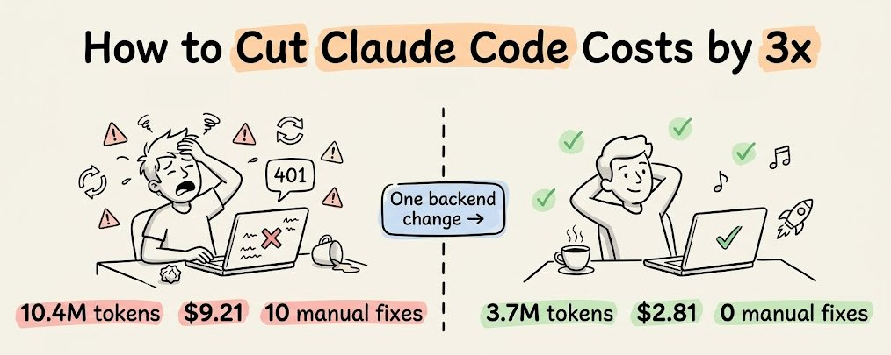

一个开源工具如何将 Claude Code 会话成本降低 3 倍——无需修改 CLAUDE.md、提示词或模型（附设置指南及原理分析）。

MCPMark V2 基准测试揭示了一个违反直觉的现象。

当 Claude 从 Sonnet 4.5 升级到 Sonnet 4.6 时，通过 Supabase MCP 服务器的后端 token 使用量反而增加了——在 21 个数据库任务中从 1160 万 token 上升到 1790 万 token。

模型变得更聪明了，但后端 token 使用量实际上增加了。

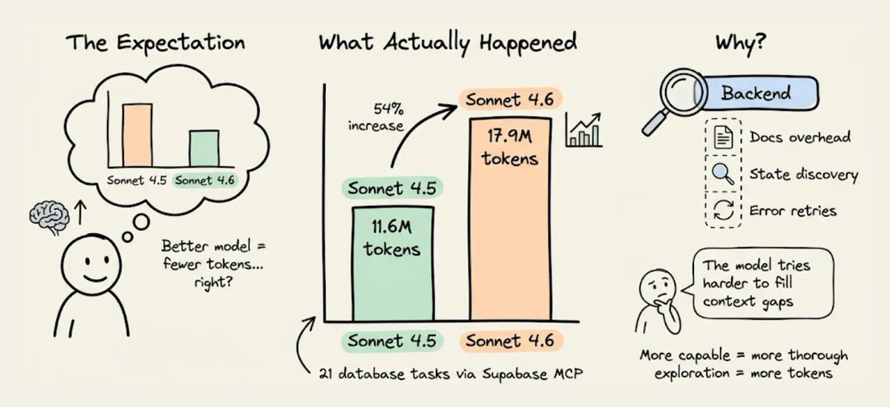

原因很微妙，而且与模型本身无关。

关键在于后端如何向智能体暴露信息。当上下文不完整时，一个更强的模型不会直接跳过这个缺口。

它会花更多 token 来推理这个缺口，运行更多的发现查询，重试的频率也更高。所以缺失的上下文不会因为更好的模型而消失——反而变得更贵了。

让我们看看为什么后端是智能体的 token 黑洞，替代架构长什么样，以及在真实项目上的成本差异。

## 为什么 Supabase 的 MCP 服务器浪费 token

Supabase 是一个优秀的后端。但它不是为 AI 智能体操作而设计的，后来添加的 MCP 服务器继承了这一局限。

三个具体机制导致了 token 膨胀。

### 1）文档检索返回了所有内容

当 Claude Code 需要通过 Supabase 设置 Google OAuth 时，它会调用 `search_docs` MCP 工具。

Supabase 的实现在每次调用时返回完整的 GraphQL schema 元数据，比智能体实际需要的多出 5-10 倍的 token。

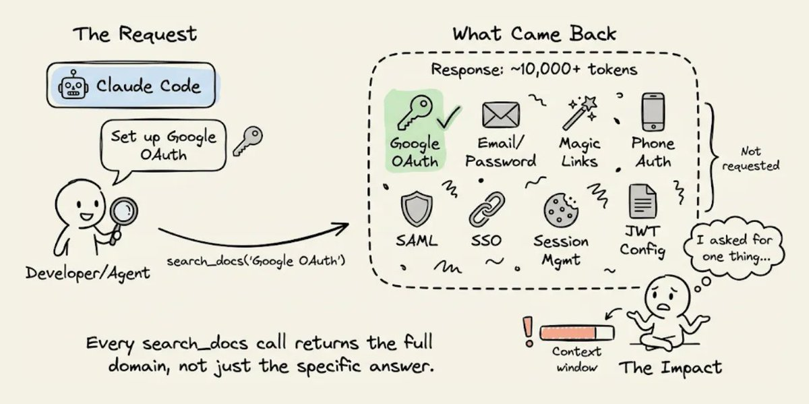

如果智能体请求 OAuth 设置说明，它会得到整个认证文档，包括邮箱/密码、魔法链接、手机认证、SAML 和 SSO 等部分。

每次 `search_docs` 调用都是如此——数据库查询、存储配置、边缘函数部署等。

每次调用都会倾倒该完整领域的全部元数据。在一个智能体设置认证、数据库、存储和函数的会话中，仅文档开销就可能浪费数千个 token。

### 2）无法看到后端状态

当你作为人类开发者使用 Supabase 时，你可以打开控制台一目了然——活跃的认证提供者、表、RLS 策略、配置的存储桶、部署的边缘函数等。

智能体看不到控制台。

Supabase 的 MCP 服务器确实通过 `list_tables` 和 `execute_sql` 等工具暴露了一些状态，但没有办法问"我的整个后端现在是什么样子？"并得到一个结构化的响应。

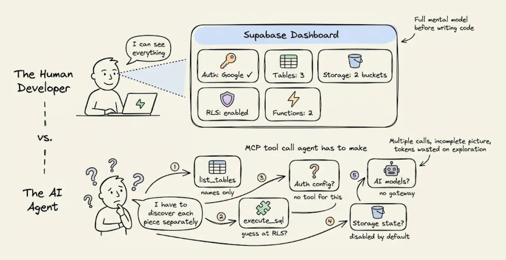

所以智能体需要通过多次调用来拼凑信息，每次调用返回一个局部视图，而某些信息（比如配置了哪些认证提供者）通过 MCP 根本无法获取。

这个碎片化的发现过程消耗 token，而且智能体经常需要多次尝试，因为信息返回不完整或格式需要进一步查询才能解读。

### 3）没有结构化的错误上下文

当出了问题（一定会出问题，因为智能体在猜测），Supabase 返回原始错误消息——可能是 RLS 拒绝的 403，可能是配置错误的边缘函数的 500 等。

人类开发者会看一下，检查 Supabase 控制台，对照日志，然后修复问题。

智能体没有这个路径。它得到错误消息，推理可能的原因，然后尝试修复。

如果修复错了，它会重试。每次重试都重新发送整个对话历史，token 成本不断叠加。

这三个机制——文档开销、状态发现、错误重试循环——会快速复合。

一个推理更深入的模型（如 Sonnet 4.6）会让每一步探索更彻底，也更贵。

这就是为什么从 Sonnet 4.5 到 4.6 的 token 差距扩大了，而且随着每个新模型发布，差距可能会继续扩大。

## "后端上下文工程"应该是什么样子

解决方案不是换一个模型。

而是给智能体一个结构化的后端上下文，让它不需要去探索和猜测。

这就是 Karpathy 所说的上下文工程："精心地用恰好正确的信息填充上下文窗口，以完成下一步的微妙艺术与科学。"他明确将工具和状态纳入上下文的一部分。大多数人将这个想法应用于提示词和 RAG 检索。

但后端也是上下文窗口的一部分，而现在，这几乎是没有人优化的部分。

要看实践中的样子，[InsForge](https://github.com/InsForge/InsForge)（开源，8k+ stars）实现了这种方法。

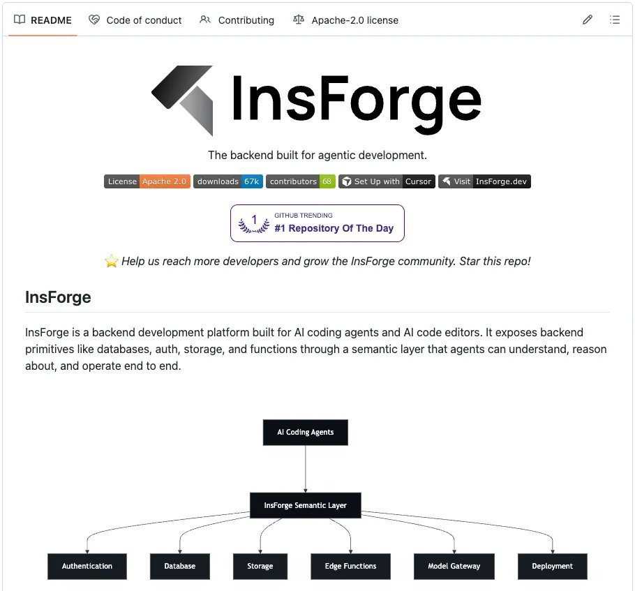

它提供了与 Supabase 相同的原语（Postgres + pgvector、认证、存储、边缘函数、实时功能），但结构化了信息层，让智能体可以高效消费。

关键架构差异在于它如何向 Claude Code 传递上下文。

三个层面协同工作：

- **Skills** 用于静态知识。
- **CLI** 用于直接后端操作。
- **MCP** 用于实时状态检查。

每个层面解决不同的问题，因不同原因减少 token。

### 1）Skills：零往返的静态知识

知识的主要方式是 Skills。它们在会话启动时直接加载到智能体的上下文中，因此每个后端操作的 SDK 模式、代码示例和边界情况都可用，无需任何工具调用。

Skills 还使用渐进式披露——最初只加载元数据（名称、描述，每个 skill 约 70-150 个 token）。

完整的 skill 内容仅在智能体确定它匹配当前任务时才加载。这意味着你可以安装 100+ 个 skills 而不会有上下文膨胀，这在 MCP 的全有或全无 schema 加载中是不可能的。

四个 skills 覆盖全栈，每个限定在特定领域：

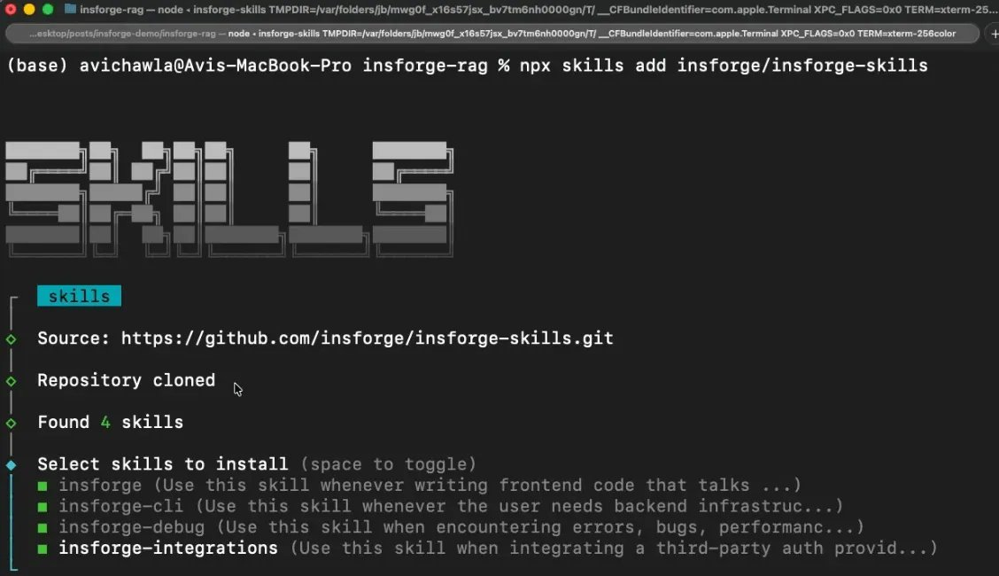

- `insforge` 用于与后端通信的前端代码。
- `insforge-cli` 用于后端基础设施管理。
- `insforge-debug` 用于跨常见故障的结构化错误诊断（认证错误、慢查询、边缘函数失败、RLS 拒绝、部署问题、性能退化）。
- `insforge-integrations` 用于第三方认证提供者（Clerk、Auth0、WorkOS、Kinde、Stytch）。

一条命令安装全部四个：

```bash
npx skills add insforge/insforge-skills
```

### 2）CLI 用于直接执行

对于实际执行后端操作（创建表、运行 SQL、部署函数、管理密钥），InsForge CLI 是主要接口。

每个命令都支持 `--json` 获取结构化输出、`-y` 跳过确认提示，并返回语义化的退出码，让智能体可以程序化地检测认证失败、缺失项目或权限错误。

这很有用，因为 Claude Code 可以通过 jq、grep 和 awk 管道处理 CLI 输出，而这些操作需要多个顺序的 MCP 工具调用。

Scalekit 的基准测试显示，CLI + Skills 在单用户工作流中实现了接近 100% 的成功率，token 效率比等效的 MCP 设置好 10-35 倍。

以下是智能体实际运行的一些示例操作：

```bash
# 检查后端状态（先运行以发现已配置的内容）
npx @insforge/cli metadata --json

# 数据库操作
npx @insforge/cli db query "CREATE TABLE posts (...)" --json
npx @insforge/cli db policies  # 检查现有 RLS 策略

# 边缘函数
npx @insforge/cli functions deploy my-handler
npx @insforge/cli functions invoke my-handler --data '{"action":"test"}' --json

# 存储
npx @insforge/cli storage create-bucket documents --json
npx @insforge/cli storage upload ./file.pdf --bucket documents

# 前端部署
npx @insforge/cli deployments env set VITE_INSFORGE_URL https://...
npx @insforge/cli deployments deploy ./dist --json

# 诊断
npx @insforge/cli diagnose db --check connections,locks,slow-queries
```

智能体解析 JSON 并根据退出码处理错误。

### 3）MCP 工具用于实时后端状态

MCP 仍然有用，但用于更窄的用途——比如在状态变化时检查后端的当前状态。

InsForge 的 MCP 服务器暴露了一个轻量级的 `get_backend_metadata` 工具，在单次调用中返回包含完整后端拓扑的结构化 JSON：

```json
{
  "auth": {
    "providers": ["google", "github"],
    "jwt_secret": "configured"
  },
  "tables": [
    {"name": "users", "columns": ["id", "email", "created_at"], "rls": "enabled"},
    {"name": "posts", "columns": ["id", "title", "body", "author_id"], "rls": "enabled"}
  ],
  "storage": { "buckets": ["avatars", "documents"] },
  "ai": { "models": [{"id": "gpt-4o", "capabilities": ["chat", "vision"]}] },
  "hints": ["Use RPC for batch operations", "Storage accepts files up to 50MB"]
}
```

一次调用，约 500 个 token，智能体就知道了完整的后端拓扑。`hints` 字段提供了智能体特定的指引，减少不正确的 API 使用。

这里的关键设计选择是：MCP 用于状态检查（随智能体工作而变化），而不是用于文档检索（不会变化）。

这颠覆了典型的使用模式，也是 InsForge 在等效任务上消耗远少于 Supabase token 的主要原因。

## Supabase vs InsForge：用 Claude Code 构建 DocuRAG

为了具体说明，我在两个后端上用 Claude Code 构建了同一个应用，并记录了完整会话。

应用叫 DocuRAG。用户通过 Google OAuth 登录，上传 PDF，系统对文本进行分块和嵌入（text-embedding-3-small，1536 维），将向量存储在 pgvector 中，用户提出自然语言问题，由 GPT-4o 回答。

这几乎同时涉及了每个后端原语：用户认证、文件存储、文档表、向量嵌入、嵌入生成、聊天补全、检索边缘函数，以及用 RLS 隔离每个用户的文档。

以下是每个后端的设置。

### Supabase

- 创建 Supabase 账户并创建新项目。
- 将 MCP 服务器连接到 Claude Code 并认证：

```bash
claude mcp add --scope project --transport http supabase \
  "https://mcp.supabase.com/mcp?project_ref=<your-project-ref>"

claude /mcp
```

- 安装 Supabase 的 Agent Skills（在 Supabase 官方设置中标记为"可选"）：

```bash
npx skills add supabase/agent-skills
```

这会安装两个 skills：

- `supabase`：覆盖面广的通用 skill，涵盖数据库、认证、边缘函数、实时功能、存储、向量、定时任务、队列、客户端库（supabase-js、@supabase/ssr）、SSR 集成（Next.js、React、SvelteKit、Astro、Remix）、CLI、MCP、schema 变更、迁移和 Postgres 扩展。
- `supabase-postgres-best-practices`：涵盖 8 个类别的 Postgres 性能优化。

Supabase 提供了一个通用 skill，触发条件是"任何涉及 Supabase 的任务"，外加一个专门的 Postgres 优化 skill。当 Supabase skill 激活时，它的所有内容都会加载，因为触发条件几乎覆盖了整个产品面。

### InsForge

- 创建 InsForge 账户并创建新项目（也可以使用 Docker Compose 自托管并完全在本地运行）。
- 安装全部四个 Skills：

```bash
npx skills add insforge/insforge-skills
```

这会安装 `insforge`（SDK 模式）、`insforge-cli`（基础设施命令）、`insforge-debug`（故障诊断）和 `insforge-integrations`（第三方认证提供者）。

- 将 CLI 链接到你的项目（主要执行层）：

```bash
npx @insforge/cli link --project-id <project-id>
```

InsForge 提供四个范围窄的 skills，每个覆盖特定领域。

- 当你写前端代码时，只有 `insforge` 激活。
- 当你创建表时，只有 `insforge-cli` 激活。
- 当出问题时，只有 `insforge-debug` 激活。

完整的 skill 内容只加载匹配当前任务的那一个。其他三个保持仅元数据的成本。

两个会话的提示词几乎相同，有一个关键区别。

- Supabase：

```plaintext
Build a chat with document app called DocuRAG.
It will be a typical RAG setup where a user
can upload a document. It will be chunked, embedded,
and stored in a vector DB. Once done, a user can ask
questions about the document. The engine will retrieve
the relevant chunks after embedding the query. Finally,
it will generate a coherent response using GPT-4o based
on the query and the retrieved context. Add Google OAuth.
Use Supabase as the backend and LLMs/embedding models via
the OpenAI API. Build frontend in next.js.
```

- InsForge：

```plaintext
Build a chat with document app called DocuRAG.
It will be a typical RAG setup where a user
can upload a document. It will be chunked,
embedded, and stored in a vector DB. Once done,
A user can ask questions about the document.
The engine will retrieve the relevant chunks
after embedding the query. Finally, it will
generate a coherent response using GPT-4o based on
the query and the retrieved context. Add Google OAuth.
Use Insforge as the backend and also for the model
gateway. Build the front-end in Next.js.
```

Supabase 的提示词说"通过 OpenAI API 使用 LLM/嵌入模型"（需要接入两个系统）。InsForge 的提示词说"同时用于模型网关"（只需一个系统）。

我并排运行了两个会话，记录了完整构建过程。以下是侧对侧视频，展示从提示词到可运行应用的全过程。

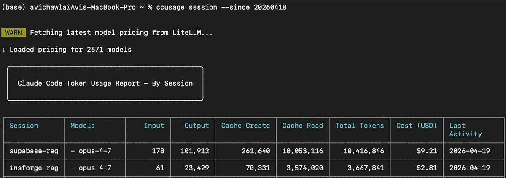

它还展示了两个会话的最终应用，分别构建在两个不同后端上。

> 视频中未展示的一点：Supabase 需要在 Claude Code 之外手动设置 Google OAuth。我必须导航到 Google Cloud Console，创建 OAuth 2.0 客户端 ID，配置同意屏幕，将我的邮箱添加为测试用户，复制 Client ID 和 Client Secret，然后粘贴到 Supabase 的控制台。InsForge 不需要这个步骤。

在深入会话细节之前，先看看最终的数据：

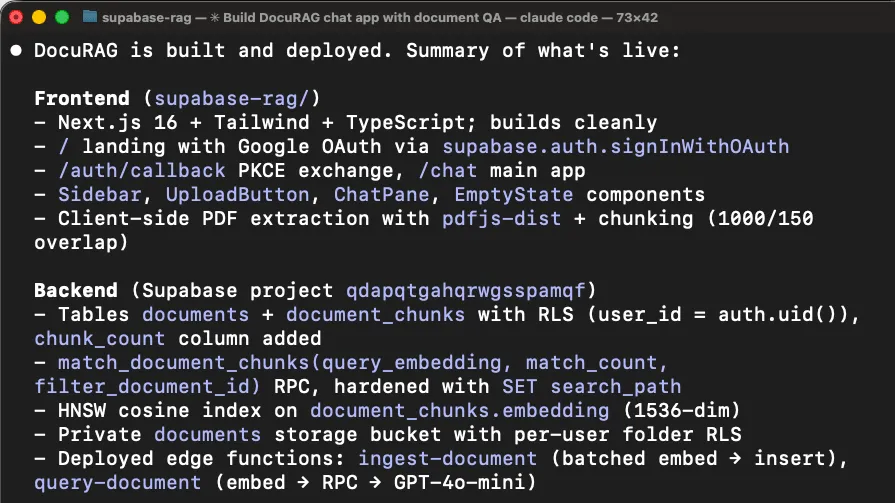

- **Supabase**：1040 万 token；成本 $9.21，12 条用户消息（10 条错误报告）
- **InsForge**：370 万 token；成本 $2.81，1 条用户消息（0 条错误报告）

现在让我们看看每个会话实际发生了什么。

为了客观分析两个会话，我从两次运行中导出了完整的 Claude Code 会话历史（JSONL 文件），并将它们输入到一个单独的 Claude 实例中。以下分析（包括工具调用计数、错误序列和 token 细分）来自对这些会话日志的解析。

## Supabase（消耗 1040 万 token，成本 $9.21）

初始构建进行得很顺利。

智能体加载了 supabase skill，通过 MCP 工具（`list_tables`、`list_extensions`、`execute_sql`）发现了后端状态，搭建了 Next.js 项目，创建了数据库 schema，编写了两个边缘函数（ingest-document 和 query-document），并部署了一切。构建通过了。


### 第一个问题：登录不工作

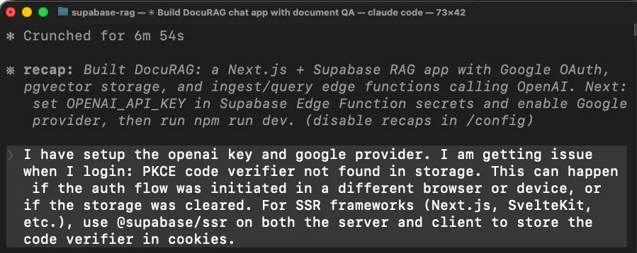

当我尝试用 Google OAuth 登录时，应用抛出了错误。智能体使用了错误的 Supabase 客户端库来接入 Next.js 的认证。

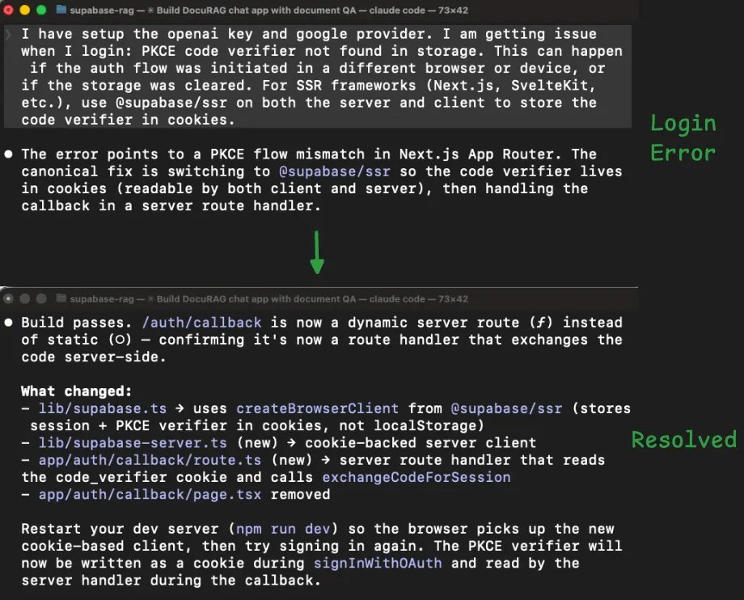

在 Next.js 中，OAuth 回调在服务器端运行，但智能体使用了一个将登录状态存储在浏览器中的客户端库。浏览器状态在服务器端不可用，所以登录流程崩溃了。

智能体通过切换到另一个库（@supabase/ssr）来修复，重写了应用处理登录会话的方式，然后重新构建。

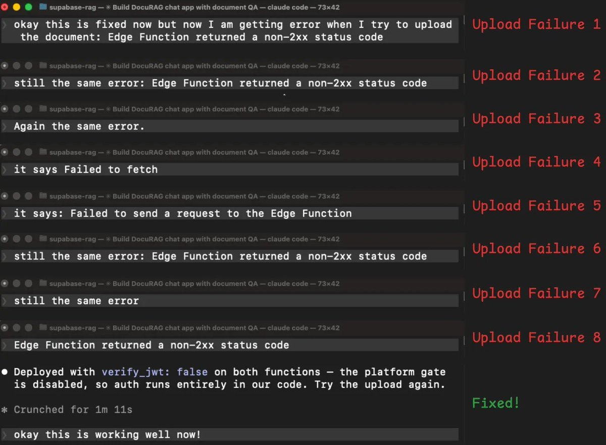

### 文档上传失败（花了 8 轮修复）

登录修复后，我尝试上传文档。边缘函数返回了错误，我报告了它，它尝试修复，失败了，然后我又试了一次，返回了相同的错误。这个循环重复了 8 次：

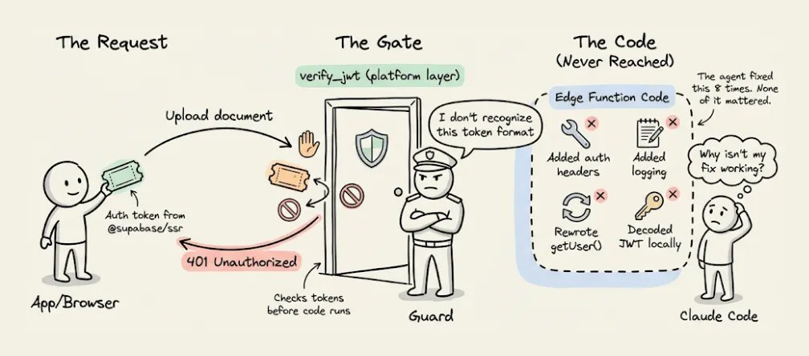

- 智能体尝试手动添加认证头 → 相同错误。
- 重新部署并添加额外日志以查看发生了什么 → 相同错误。
- 尝试显示真实错误消息而不是通用消息 → 不同错误（现在是网络/CORS 问题）。
- 修复了 CORS 问题 → 回到原来的错误。
- 尝试不同的方式读取用户登录 token → 相同错误。
- 再尝试另一种认证方式 → 相同错误。

经过 8 次失败尝试，智能体终于搞清楚了："401 可能发生在平台的 `verify_jwt` 关卡，在我们的代码甚至运行之前。"

简单来说，Supabase 有一个安全层，在边缘函数代码启动之前就检查登录 token。智能体安装的新认证库（为修复第一个问题）发送的 token 格式是这个安全层不认识的。

所以每个请求在函数代码有机会运行之前就被拒之门外了。这就是为什么没有任何代码级别的修复有效。

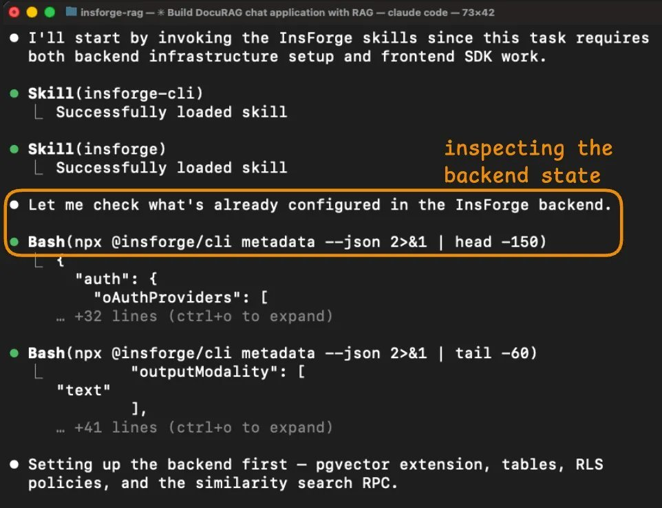

智能体花了 8 轮修复代码级问题，而问题完全在代码上游。

解决方案很简单：关闭平台的自动 token 检查，改为在函数代码内部处理认证。

之所以花了 8 次尝试，是因为每次它看到 401（未授权）错误，但没有任何信息告诉它拒绝来自哪里。没有这个信号，它就不断尝试修复代码。

但在这个调试过程中，边缘函数被重新部署了 8 次（加上构建期间的 2 次初始部署）。每次重新部署、检查日志和重试都会重新发送不断增长的对话历史，token 成本不断叠加。

最终会话统计：

- 12 条用户消息（10 条是错误报告）
- 135 次工具调用
- 30+ 次 MCP 工具调用
- 1040 万 token
- 成本 $9.21

## InsForge（消耗 370 万 token，成本 $2.81）

InsForge 会话在没有任何需要我干预的错误中完成。

智能体从检查后端状态开始。

它的第一个动作是 `npx @insforge/cli metadata --json`，返回了项目的结构化概览，包括已配置的认证提供者、现有表、存储桶、可用的 AI 模型和实时频道。

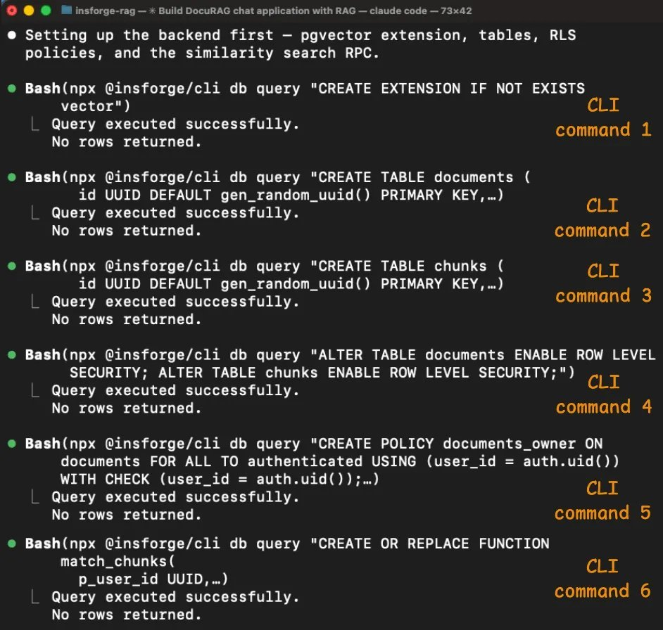

这让智能体在写任何代码之前就有了完整的画面。

在 Supabase 会话中，智能体需要多次 MCP 调用（`list_tables`、`list_extensions`、`execute_sql`）来拼凑类似的理解，即便如此，它还是遗漏了关键细节，比如 `verify_jwt` 行为。

Schema 设置通过 6 条 CLI 命令运行，全部成功。

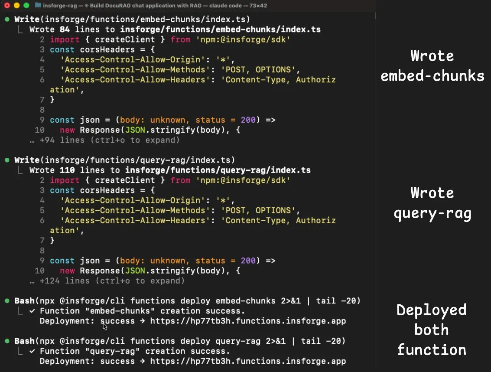

智能体启用了 pgvector，创建了 documents 和 chunks 表（带 vector(1536) 列），在两个表上启用了行级安全（RLS），创建了访问策略，并设置了 `match_chunks` 相似性搜索函数。

每条命令返回了结构化输出确认发生了什么，所以智能体可以在进入下一步之前验证每一步。

Supabase 会话中的认证和边缘函数问题在这里没有发生。

insforge skill 包含了正确的 Next.js 客户端库模式，所以智能体在第一次尝试时就正确接入了认证。

两个边缘函数（embed-chunks 和 query-rag）都部署和运行成功，没有错误，因为用于嵌入和聊天补全的模型网关是同一后端的一部分。

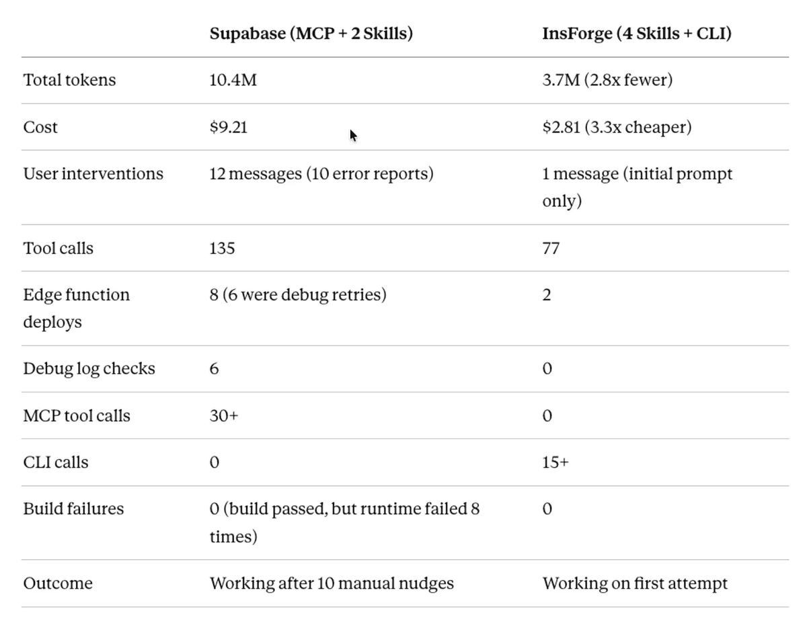

智能体不需要单独集成 OpenAI，不需要管理第二个 API 密钥，也不需要处理跨服务认证。

元数据响应已经列出了 text-embedding-3-small 和 gpt-4o 作为可用模型，所以智能体直接通过 InsForge SDK 调用它们。

最终会话统计：

- 1 条用户消息
- 77 次工具调用
- 0 次 MCP 工具调用
- 370 万 token
- 成本 $2.81

我让 Claude 生成了一个对比表格，以下是它的输出：


Supabase 会话的 token 成本是由错误重试循环驱动的。

8 次边缘函数重新部署中的每一次都重新发送了整个对话历史（每次尝试都在增长）。

智能体检查了 6 次日志，重新部署了 8 次函数，尝试了 6 种不同的认证策略才找到根本原因。

这些都不是智能体的错。Supabase 平台的 `verify_jwt` 关卡在函数代码运行之前就拒绝了 token，而日志没有区分平台级拒绝和代码级拒绝。

InsForge 会话避免了这些问题，因为 skills 从一开始就加载了正确的认证模式，CLI 对每个操作给出了结构化反馈，而模型网关意味着没有第二个服务需要集成。

智能体没有遇到任何需要调试的错误。

## 总结

这个对比突显了一个超越 Supabase 本身的普遍问题。

大多数后端是为人类开发者设计的，他们可以阅读仪表盘、解读模糊的错误，并在多个服务之间心算追踪状态。

当智能体接管这个工作流时，这些假设就崩塌了。智能体看不到仪表盘。如果日志没有说明，它无法判断错误来自哪里。而且每次猜错，token 成本都在叠加。

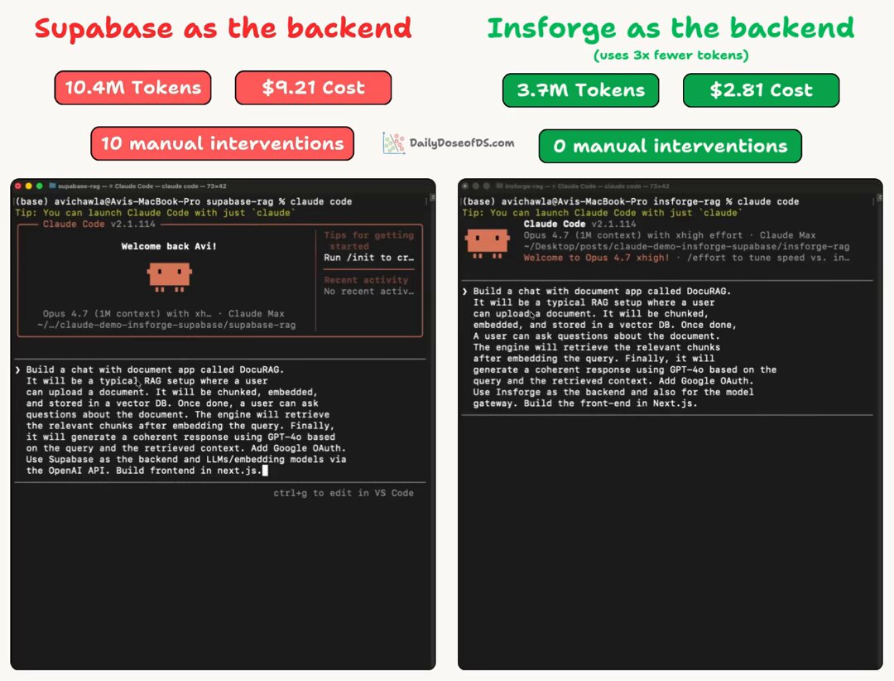

InsForge 围绕不同的假设构建。

- 后端通过结构化元数据暴露其状态，CLI 给智能体程序化控制并提供清晰的成功/失败信号。
- Skills 编码了正确的模式，让智能体不需要通过试错来发现。
- 模型网关将 LLM 操作保持在同一后端内，消除了导致 Supabase 会话大部分调试的跨服务集成问题。

这些架构选择是否对你有意义，取决于你如何使用 Claude Code 或任何其他编码智能体。

如果你只构建纯前端应用，后端层不是你的 token 去处。

如果你构建包含认证、存储、向量搜索和 LLM 调用的全栈应用，后端正是 token 成本所在的地方，而后端与智能体的通信方式会产生可衡量的差异。

但核心洞察与你使用什么工具无关。

如果你的智能体在花 token 发现后端如何工作、猜测配置、因为错误消息没有告诉它出了什么问题而重试操作，那你就在为缺失的上下文买单。

修复方案不是更好的模型或更长的上下文窗口，而是在智能体开始写代码之前，给它关于后端的结构化信息。

这就是上下文工程应用于后端。Karpathy 说得对，用正确的信息填充上下文窗口是核心技能。

从这个实验中得到的洞察是，你的后端基础设施是上下文最大的来源之一，而我们大多数人没有这样对待它。

InsForge 在 Apache 2.0 许可下完全开源，你可以通过 Docker 自托管。

代码、skills 和 CLI 都在其 GitHub 仓库：[https://github.com/InsForge/InsForge](https://github.com/InsForge/InsForge)

P.S. 本实验中 2.8 倍的 token 减少部分是由 Supabase 端的调试循环驱动的，智能体花了 8 轮修复一个最终在其代码上游的问题。这是真实场景，但不是每个会话都会遇到那个特定问题。MCPMark V2 基准测试在 4 次独立运行中测试了 21 个数据库任务，在 Sonnet 4.6 上显示了更一致的 2.4 倍减少。

以上就是全部内容！