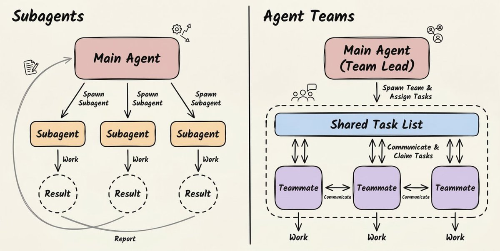
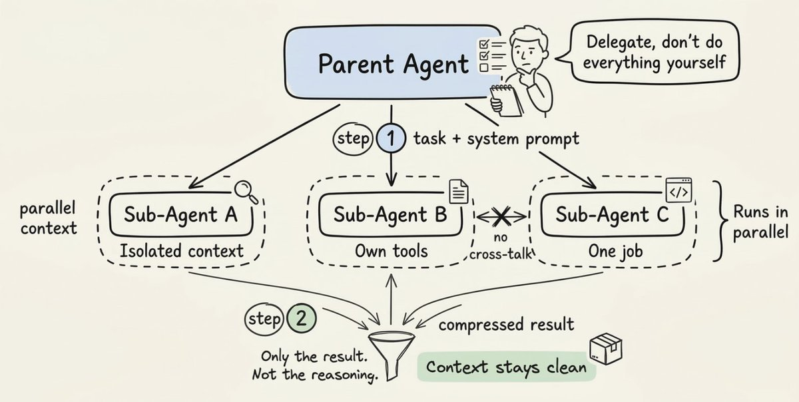
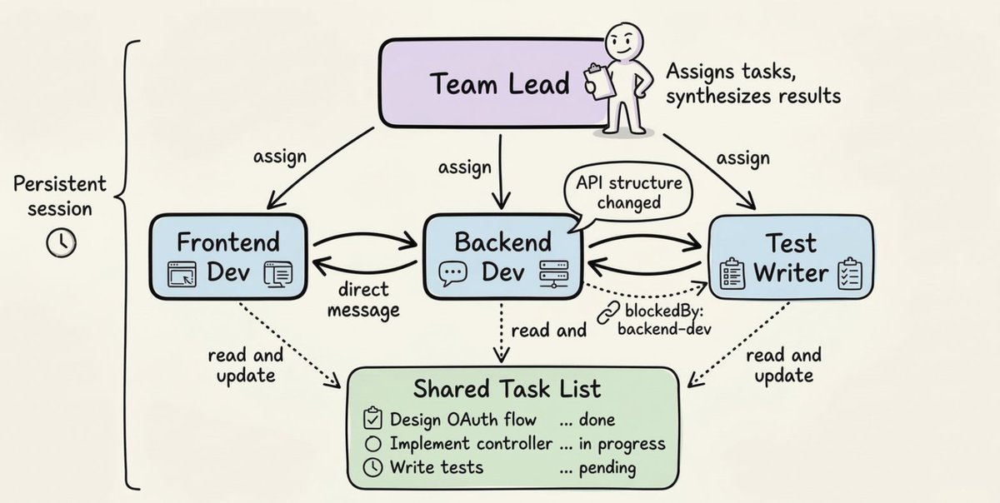
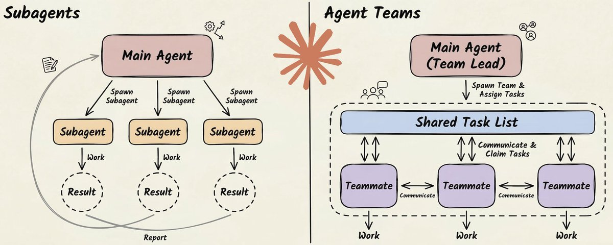
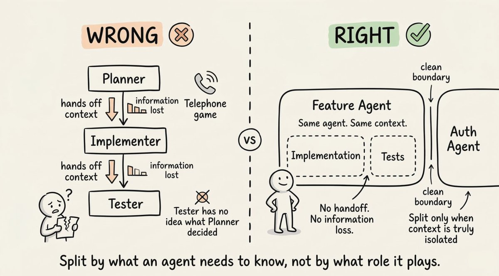
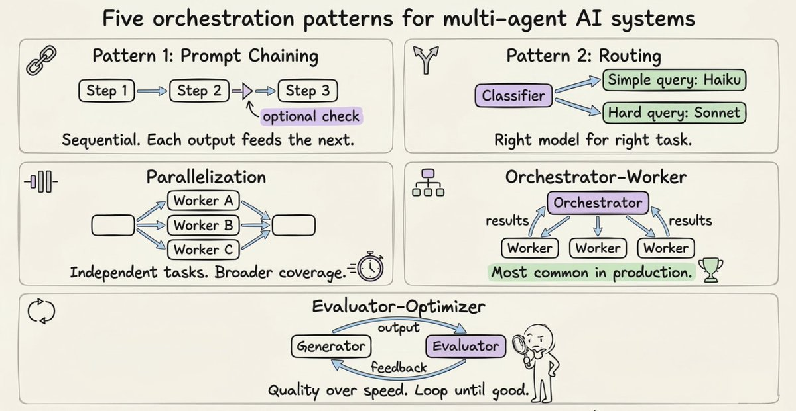

大多数人一觉得任务复杂，就会选择多智能体系统。

但那几乎总是错误的直觉。

正确的问题不是"我该不该用多个 Agent？"，而是"**这项任务实际上需要什么样的协调？**"

这个问题的答案，决定了你架构的方方面面。

Claude 提供了两种截然不同的多智能体范式：**Sub-agents（子智能体）** 和 **Agent Teams（智能体团队）**。它们表面上看起来很像，但在架构层面解决的是完全不同的问题。



## Sub-Agents：通过隔离实现并行

Sub-agent 是一个运行在独立上下文窗口中的专用 Claude 实例。

打个比方：假设你是一个研究主管，你不会自己去读每一份原始资料，而是把具体问题分配给研究员，他们带回精炼的发现，你再把所有东西综合成一个完整的输出。

Sub-agent 做的就是这件事。

每个 Sub-agent 拥有：

- 自己的系统提示词，定义其专长
- 一组特定的可访问工具
- 一个干净、隔离的上下文窗口
- 一项明确的任务



```python
from claude_agent_sdk import query, ClaudeAgentOptions, AgentDefinition

async def main():
    async for message in query(
        prompt="Review the authentication module for security vulnerabilities",
        options=ClaudeAgentOptions(
            allowed_tools=["Read", "Grep", "Glob", "Agent"],
            agents={
                "security-reviewer": AgentDefinition(
                    description="Security specialist. Use for vulnerability checks and security audits.",
                    prompt="You are a security specialist with expertise in identifying vulnerabilities.",
                    tools=["Read", "Grep", "Glob"],
                    model="sonnet",
                ),
                "performance-optimizer": AgentDefinition(
                    description="Performance specialist. Use for latency issues and optimization reviews.",
                    prompt="You are a performance engineer with expertise in identifying bottlenecks.",
                    tools=["Read", "Grep", "Glob"],
                    model="sonnet",
                ),
            },
        ),
    ):
        print(message)
```

**`description` 字段**就是告诉父 Agent 该调用哪个 Sub-agent 的路由信号。上面的例子中，prompt 提到了"安全漏洞"，所以父 Agent 会路由到 **security-reviewer**，而不是 **performance-optimizer**。

如果 prompt 问的是延迟或性能瓶颈，就会选另一个 Agent。description 就是路由信号，务必写得具体。

## Agent Teams：通过沟通实现协作

Agent Teams 是一种根本不同的模型。

Sub-agent 是**短生命周期的工人**——完成任务就消失；而 Agent Teams 是**长期运行的实例，会持续存在、互相直接通信，并通过共享状态进行协调**。

就好比雇外包做独立任务，和组建一个在同一间办公室协作的团队之间的区别。

一个 Agent Team 有三个核心组件：

- **Team Lead（团队负责人）**：协调工作、分配任务、综合结果
- **Teammates（队友）**：独立的 Agent 实例，各自拥有自己的上下文窗口，并行工作
- **Shared Task List（共享任务列表）**：追踪待办、进行中、已完成的任务，以及任务之间的依赖关系



一个典型的生命周期如下：

```plaintext
Claude (Team Lead):
└── spawnTeam("auth-feature")
    Phase 1 - Planning:
    └── spawn("architect", prompt="设计 OAuth 流程", plan_mode_required=true)
    Phase 2 - Implementation (parallel):
    └── spawn("backend-dev", prompt="实现 OAuth 控制器")
    └── spawn("frontend-dev", prompt="构建登录 UI 组件")
    └── spawn("test-writer", prompt="编写集成测试", blockedBy=["backend-dev"])
```

注意测试编写者的 **`blockedBy`** 字段。这就是共享任务列表在做真正的协调工作：测试编写者在后端 Agent 完成之前不会启动，无需 Lead 手动管理这个顺序。

与 Sub-agent 最大的区别是**直接的点对点通信**。队友之间可以互发消息、分享发现、暴露阻塞点、自行协商，而不需要所有事情都经过 Lead 中转。

你也可以直接和单个队友交互，不必所有事情都走 Lead Agent。

## 核心区别

这样来理解两者之间的选择：



**Sub-agent 是"发射即忘"（fire-and-forget）的。**

- 你给他们一个任务，完成后汇报结果
- Agent 之间没有对话
- 没有共享记忆
- 没有持续状态
- 每个 Sub-agent 在一次会话中生死轮回

**Agent Teams 是协作式的。**

- Agent 持续存在，随时间积累上下文
- 任务中的新发现会立即同步给队友
- 前端 Agent 可以告诉后端 Agent "API 响应结构需要改"，后端 Agent 直接调整，不用等 Lead 来协调

最清晰的选择标准：

- **用 Sub-agent**：当工作可以"令人尴尬地并行"——独立的研究流、代码库探索、或只需要汇总结果的查找任务
- **用 Agent Teams**：当工作需要持续协商——Agent 需要在继续之前对齐输出，或者一个线程的发现会改变另一个线程该做什么

## 从第一性原理设计智能体系统

大多数多智能体设计失败，是因为人们按**角色**拆分工作，而不是按**上下文**。

直觉反应是按角色拆分：规划者、实现者、测试者。感觉很有条理，但这创造了一个"传话游戏"——每次交接信息都会衰减。

- 实现者不知道规划者了解什么
- 测试者不知道实现者做了什么决定
- 每个边界都在降低质量



正确的思维模型是**以上下文为中心的分解（Context-centric Decomposition）**。

问自己：这个子任务实际上需要什么上下文？如果两个子任务需要高度重叠的信息，它们大概率应该属于同一个 Agent。如果它们能用真正隔离的信息和清晰的接口工作，那就是拆分的地方。

一个实际例子：实现功能的 Agent 也应该为这个功能写测试。它已经有了上下文。把这两件事拆成两个 Agent 会产生交接问题，其成本超过了并行带来的收益。

**只在上下文可以真正隔离时才拆分。**

## 五种编排模式

无论你选择哪种范式，这五种模式覆盖了大多数真实场景：



1. **Prompt Chaining（提示链）**：顺序执行，每一步处理上一步的输出。适用于步骤有依赖、顺序很重要的场景。
2. **Routing（路由）**：分类器决定将任务交给哪个专用处理器。简单问题用更便宜、更快的模型；难题用更强的模型。这是控制成本不爆炸的方式。
3. **Parallelization（并行化）**：独立子任务同时运行。可以是同一任务多次运行以获得多样输出（投票），也可以是不同子任务同时执行（分段）。
4. **Orchestrator-Worker（编排者-工人）**：中央 Agent 拆解任务、分配给工人、综合结果。这是 Sub-agent 和 Agent Teams 的主流架构，也是大多数生产系统实际使用的。
5. **Evaluator-Optimizer（评估者-优化者）**：一个 Agent 生成，另一个评估并提供反馈，循环迭代。适用于质量比速度更重要、单次输出不够可靠的场景。

## 什么时候不该用多智能体系统

有些团队花了几个月搭建复杂的多智能体流水线，最后发现用更好的提示词在单个 Agent 上就能达到同样的效果。

**先从简单开始，只有在能明确衡量出需要时才增加复杂度。**

**多智能体系统在三种情况下物有所值：**

- **上下文保护**：子任务会产生与主任务无关的信息。放在 Sub-agent 里可以防止上下文膨胀。
- **真正的并行化**：独立的研究或搜索任务，从同时覆盖中获益。
- **专业化**：任务需要互相矛盾的系统提示词，或者一个 Agent 同时处理太多工具导致性能下降。

**但在以下情况不该用：**

- Agent 之间需要频繁共享上下文
- Agent 间的依赖关系产生的开销超过了执行本身的价值
- 任务足够简单，一个提示得当的 Agent 就能搞定

一个针对编程的特别警告：并行写代码的 Agent 会做出不兼容的假设。当你合并它们的工作时，这些隐性决定会以难以调试的方式产生冲突。编程场景下的 Sub-agent 应该用来回答问题和探索，而不是和主 Agent 同时写代码。

## 多智能体系统失败的三大原因

三种失败模式反复出现。

**1. 模糊的任务描述导致 Agent 重复劳动。**

每个 Agent 都需要：明确的目标、期望的输出格式、使用哪些工具或信息源的指引、以及不应该覆盖什么的明确边界。没有这些，两个 Agent 会研究同一个东西，而谁都不会发现。

**2. 验证 Agent 在没有真正验证的情况下就宣布胜利。**

必须给出明确、具体的指令：运行完整的测试套件、覆盖这些特定场景、在每个用例通过之前不要标记为完成。模糊的验收标准会产生误报。

**3. Token 成本比你想象的累积得更快。**

解决方案是智能地分层使用模型：

- 在真正重要的地方使用最强的模型
- 将日常工作路由到更快、更便宜的模型
- 建立预算控制，防止成本失控

**围绕上下文边界设计，而不是围绕角色或组织架构。**

从单个 Agent 开始，把它推到极限，找到它在哪里崩溃。那个失败点会告诉你下一步该加什么。

**只在能解决一个真实的、可衡量的问题时，才增加复杂度。**

---

以上就是全部内容！
