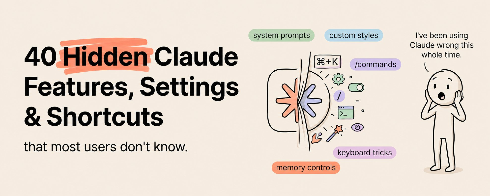

我在 Claude 的每个界面上都花了数百小时。

收藏本文 :)

这些是没人提起但每个人都应该使用的功能。

Claude 有三个界面——Chat、Cowork 和 Code。大多数人只用一个。几乎没人把三个都探索过。而即便在他们用的那个界面里，大多数人可能只用到了 20% 的功能。

结果就是数百万人花钱买了工具，却只用了一小部分能力。

以下是埋藏在 Claude 生态系统中的 40 个功能、设置和快捷键，一旦发现就会改变你的工作方式。

## Claude Chat——隐藏的力量

**01. 风格（Styles）**：进入设置 → 风格。Claude 有预设的沟通风格可以切换：简洁、解释型、正式等。你也可以创建自定义风格。打造一个匹配你表达习惯的风格，每次对话就会自动以正确的语气开始。

**02. 项目（Projects）**：大多数人完全错过了这个。项目允许你创建持久化的工作空间，每个项目有自己的指令和文件。项目内的每次对话都会自动继承上下文。不用每次都粘贴上下文文件，创建一个项目，设置一次就好。

**03. 项目知识库（Project Knowledge）**：在任何项目中，上传参考文档。Claude 会在每次对话开始时读取它们。你的品牌指南、产品文档、写作范例。始终加载，永不遗忘。

**04. 自定义指令（系统提示词）**：在项目设置中，你可以编写自定义指令，作为每次对话的系统提示词。"你是我的内容策略师。始终用我的品牌语气回复。永远不要使用这些词：\[列表\]。始终按以下格式输出：\[格式\]。"这会在每条消息背后静默运行。

**05. Artifacts**：当 Claude 生成代码、文档或可视化输出时，它们会在一个独立面板中渲染。你可以独立于对话迭代 Artifacts。编辑、优化、下载，不会丢失聊天上下文。

**06. 记忆（Memory）**：Claude 现在可以跨对话记住事情。它会学习你的偏好、你的项目和你的沟通风格。你可以在设置 → 记忆中查看和编辑 Claude 记住的内容。像管理新员工入职笔记一样管理它。

**07. 深度研究（Deep Research）**：对任何查询开启深度研究，Claude 会进行扩展搜索，阅读数十个来源，然后生成一份综合研究报告。就像一个初级分析师花了 2 小时做研究，但 2 分钟就交付了。

**08. 文件上传智能**：你可以直接在聊天中上传 PDF、图片、电子表格、CSV、代码文件和文档。Claude 不只是存储它们——它会阅读并理解它们。上传一份 50 页的报告，问第 37 页的具体问题。上传一个电子表格，要求做趋势分析。

**09. 图像分析**：上传任何图片，Claude 都能以惊人的细节看到它。错误截图、白板照片、图表、示意图、手写笔记、收据、名片。只要有视觉信息，Claude 就能提取和解读。

**10. Canvas**：Claude 可以直接在聊天中生成可视化、图表和交互式组件。要求一个流程图、对比表、组织架构图、简单计算器。它们会内联渲染并且是可交互的。

**11. LaTeX 渲染**：对于处理数学、统计或技术内容的人，Claude 能漂亮地渲染 LaTeX 公式。要求公式、推导或统计输出，它们会正确格式化显示。

**12. 对话分支**：编辑任何之前的 message，Claude 会从那个点重新生成回复，创建一个新分支。这让你可以探索不同的方案，而不会丢失原始对话线程。

## Claude Code——强力功能

**13. [CLAUDE.md](http://claude.md/) 层级**：大多数人只有一个 [CLAUDE.md](http://claude.md/)。高级用户有三层。用户级（~/.claude/CLAUDE.md）用于个人偏好。项目级（.claude/CLAUDE.md）用于团队标准。目录级用于模块特定规则。它们层叠生效，最具体的层级优先。

**14. 路径特定规则**：在 .claude/rules/ 中创建带有 YAML 前置元数据的文件，指定 glob 模式。一个带有 `paths: ["**/*.test.*"]` 的规则会自动应用到代码库中的每个测试文件。不同文件类型不同标准，不会污染你的主 [CLAUDE.md](http://claude.md/)。

**15. 计划模式（Shift+Tab）**：在复杂任务前切换到计划模式。Claude 会创建分步计划，展示给你审批，只有在你同意后才执行。任何涉及多文件的任务都必不可少。这是干净执行和调试混乱之间的区别。

**16. /compact**：当上下文变长时压缩对话。Claude 保留重要细节但释放上下文窗口空间。当 Claude 开始重复犯错或忘记之前的决定时使用。

**17. /memory**：精确显示 Claude Code 在本次会话中加载了哪些记忆文件。如果 Claude 行为不一致，运行这个检查正确的上下文是否真的在生效。

**18. 自定义斜杠命令**：在 .claude/commands/（个人）或 ~/.claude/commands/（全局）中构建可复用命令。一个 /review 命令运行你的代码审查清单。一个 /test 命令按你的模式生成测试。十分钟创建，长期节省数小时。

**19. Git 集成**：Claude Code 有原生的 git 感知。它可以提交、推送、创建分支，甚至根据它做的修改写提交信息。"用描述性信息提交所有内容"真的能用。

**20. 多文件编辑**：Claude Code 可以在单次操作中读取和编辑多个文件。在整个代码库中重命名函数。更新每个引用它的文件中的导入路径。重构组件并更新所有使用它的文件。

**21. 测试生成**：把 Claude Code 指向任何函数或模块。"为这个写全面的测试。"它会生成遵循你项目测试规范的测试文件（如果你在 [CLAUDE.md](http://claude.md/) 或路径规则中设置了的话），包括边界情况和错误场景。

**22. -p 标志**：以非交互式、无头模式运行 Claude Code。CI/CD 流水线必备。没有它，你的 CI 任务会永远挂起等待用户输入。有了它，Claude 自主运行并返回结构化输出。

**23. --output-format json**：结合 --json-schema，Claude Code 返回机器可解析的结构化输出。你的 CI 流水线可以自动解析结果并作为内联 PR 评论发布。

**24. 独立审查实例**：写代码的同一个 Claude Code 会话在审查时会对自己的决定有偏见。始终使用单独的、全新的会话进行代码审查。Claude 认证架构师考试明确测试了这个概念。

## Claude Cowork——隐藏功能

**25. 子代理并行处理**：当 Cowork 收到大型任务时，它可以启动多个同时工作的子代理。告诉它处理 20 个文件，它会分配给 4-5 个并行运行的子代理。顺序需要 30 分钟的工作 6 分钟就完成了。

**26. /schedule**：设置定期任务。每日简报。每周清理。每月财务处理。你的电脑需要开着且 Claude Desktop 保持打开，但任务会无人值守运行。如果笔记本在运行期间休眠了，重新打开时会自动运行。

**27. 连接器链**：在单个工作流中组合多个连接器。"读取我的 Gmail，检查日历，从 Drive 拉取相关文件，创建一个会议准备文档。"四个连接器，一个指令，零切换标签。

**28. 插件市场**：[claude.com/plugins](http://claude.com/plugins) 上的验证插件为你提供针对特定角色的预构建能力。产品管理。市场营销。财务。法务。每个插件都添加了针对该功能的斜杠命令和技能。

**29. 文件夹指令**：在任何文件夹中放置一个包含指令的 markdown 文件。当 Cowork 处理该文件夹中的文件时，它会先读取这些指令。不同项目不同规则。不同客户不同格式。自动上下文切换。

**30. 沙盒安全**：Cowork 执行的所有操作都在沙盒化的 Linux 虚拟机中运行。它无法访问你明确授权的文件夹之外的文件。你控制爆炸半径。这就是为什么 Cowork 可以安全用于生产工作。

**31. 浏览器桥**：当 Chrome 中的 Claude 和 Cowork 一起安装时，两者协同工作。Cowork 可以将网页研究委托给 Chrome，在本地处理结果，然后继续工作流。两全其美。

**32. 会话历史**：每个 Cowork 会话都有完整日志，记录了执行了哪些操作、修改了哪些文件、输出是什么。审查任何过去的会话，精确了解发生了什么。调试失败的自动化任务必备。

**33. Token 用量感知**：Cowork 任务消耗的 token 是普通聊天的 3-5 倍。将相关任务批量放入单个会话。表述要具体以避免来回澄清。在非高峰时段安排重型任务，据说吞吐量更高。

**34. 插件链**：在单个工作流中组合多个插件。你的研究插件喂给分析插件，再喂给报告插件。多步骤、多能力的工作流，一个命令触发。

## 平台级设置

**35. 用量仪表盘**：检查你的 token 消耗和使用模式。如果你在撞限制，这里会显示你的 token 去了哪里，方便你优化。

**36. 模型选择**：不同任务适合不同模型。Haiku 更快更便宜，适合简单任务。Sonnet 平衡速度和质量。Opus 能力最强，适合复杂推理。匹配模型和任务。

**37. API 访问**：你的 Claude 订阅包含 API 额度。构建自定义集成，将 Claude 连接到你自己的工具，或自动化标准界面不支持的工作流。

**38. 团队共享（团队/企业版）**：与团队共享项目、技能和配置。每个人都获得相同的上下文、相同的标准和相同的能力。整个组织保持一致。

**39. 数据隐私控制**：你可以选择退出对话用于训练。检查设置 → 隐私。对于敏感的业务工作，确认你的数据处理偏好设置正确。

**40. 键盘快捷键**：Ctrl+/ 显示所有可用快捷键。Ctrl+Shift+O 打开新对话。Ctrl+Shift+C 复制最后一条回复。这些小效率在每天数百次交互中会累积。

## TL;DR

**40 个功能。全都摆在明面上。99% 的用户可能只知道 10 个。**

Claude 不是一个工具。它是三个界面（Chat、Code、Cowork），每个都有大多数用户从未探索过的功能层。发现这些功能的人不只是节省时间——他们在一个完全不同的层次上运作。

挑选与你工作最相关的 5 个功能。今天就试试。每一个都会解锁你不知道可能的工作流。

这份清单花了数百小时的探索来整理。如果它节省了你的时间，你知道该怎么做。

我定期发布类似内容——AI 工具、功能、工作流，以及我实际使用的东西。没有废话。

**关注我** [@eng\_khairallah1](https://x.com/@eng_khairallah1) **获取更多自动化架构、工作流设计和商业 AI 手册。**

<blockquote>
  原文地址：<a href="https://x.com/eng_khairallah1/status/2050869463252455584">https://x.com/eng_khairallah1/status/2050869463252455584</a>
</blockquote>
