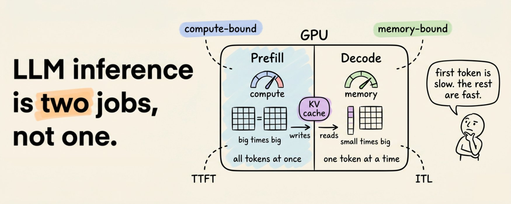
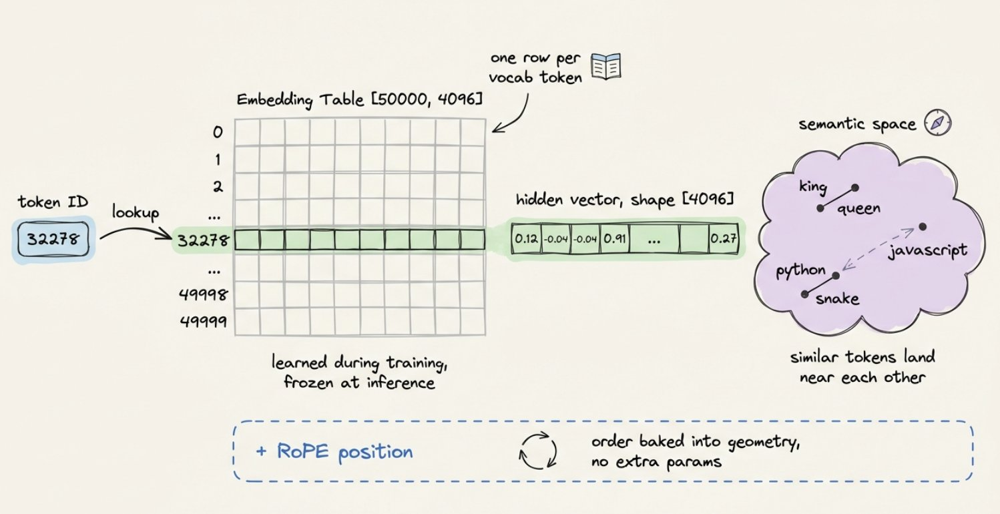
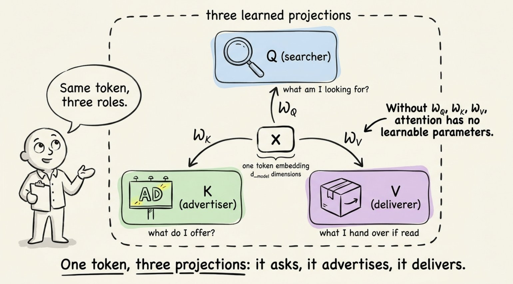
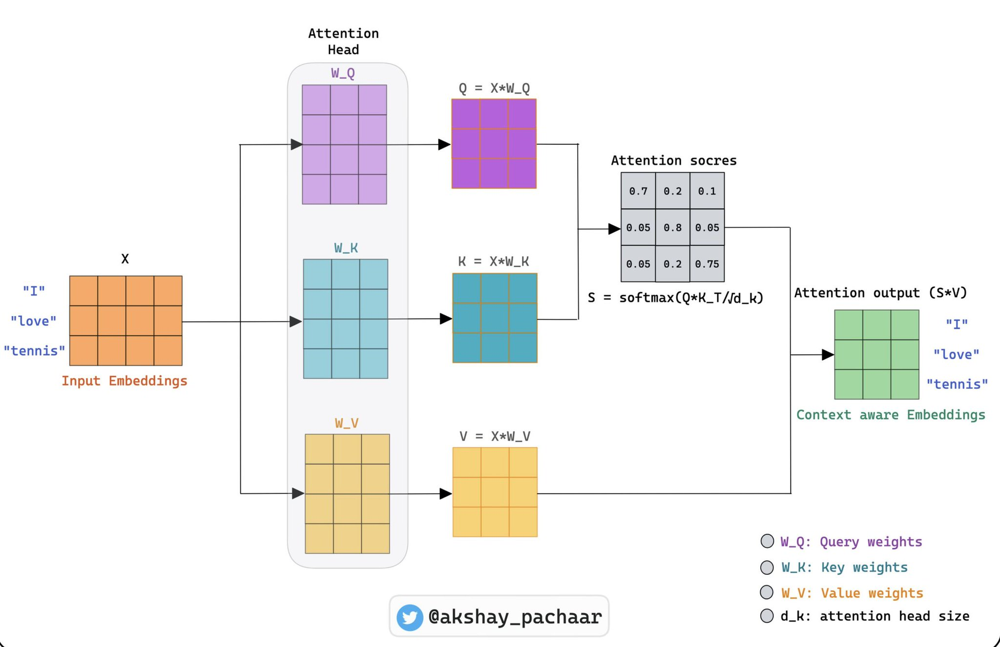
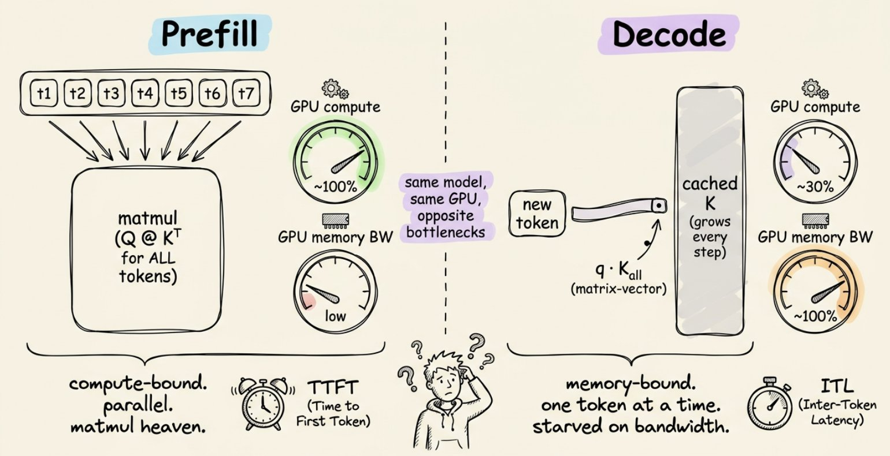
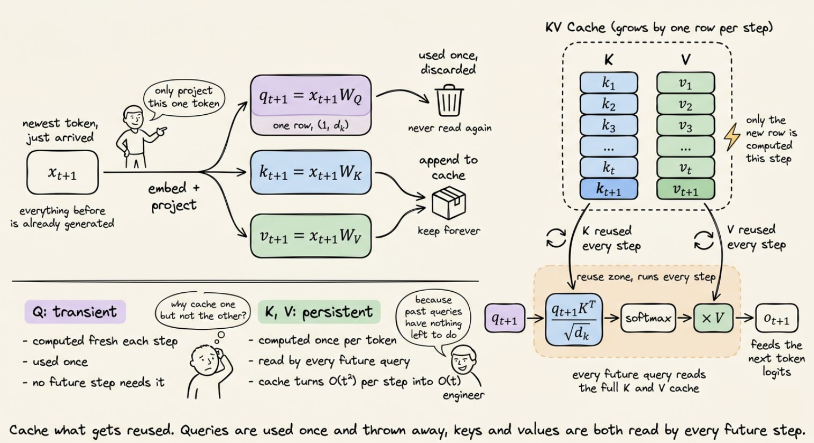
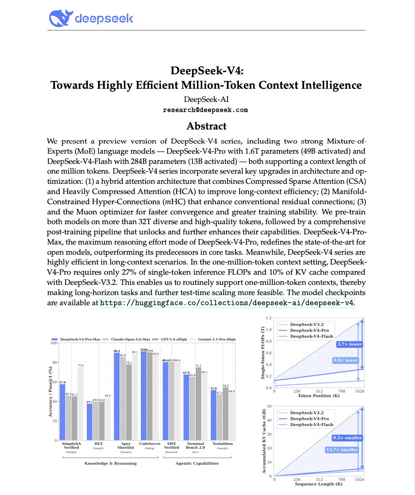
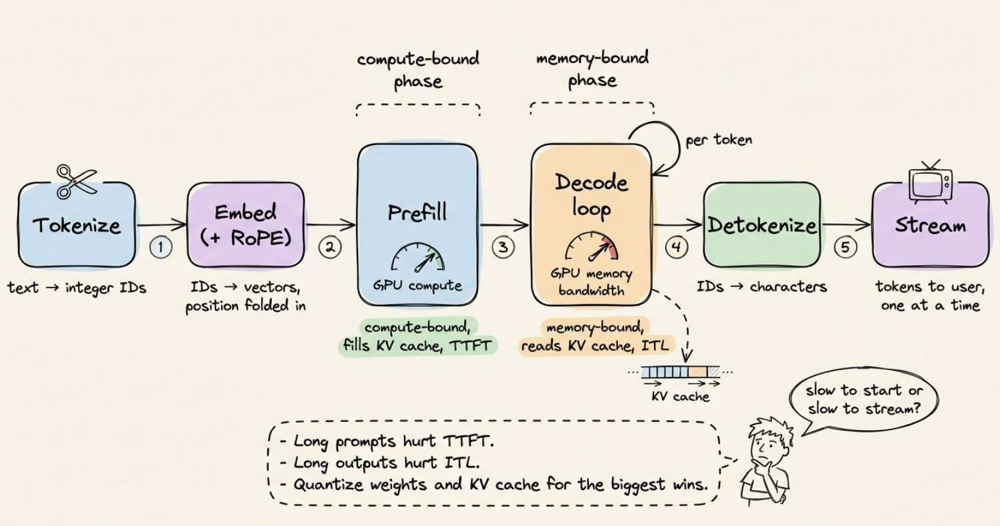

从第一性原理出发，带你了解从输入 prompt 到流式输出之间发生的一切：分词、嵌入、注意力机制、预填充/解码拆分、KV 缓存和量化。

你输入一段 prompt。几百毫秒后，文字开始一个接一个地流式返回。感觉很简单。但事实并非如此。

在你敲下键盘和第一个 token 出现之间，发生的是现代计算中最精心设计的流水线之一。最诡异的是？模型为了回答你，在同一个 GPU 上、同一个请求中，执行了两个完全不同的任务，面对两个完全不同的瓶颈。

一旦你看懂了，你就再也无法用同样的眼光看待 `generate()` 调用了。

# 心智模型

LLM 是一个预测下一个 token 的神经网络。只预测一个 token。然后它把这个 token 拼接到你的 prompt 后面，再预测下一个。如此循环。

就这样。这就是整个循环。

有趣的问题是：它是如何预测下一个 token 的？为什么**第二个 token** 比第一个**快得多**？

# 第一步：文本变成数字

神经网络读不了英文。它们读的是向量。所以你的 prompt 首先经历的是**分词（Tokenization）**——把文本切成片段，给每个片段分配一个整数 ID。

大多数现代 LLM 使用一种叫字节对编码（BPE）的方案。思路是：从原始字符开始，反复合并最常见的相邻字符对，直到形成约 50,000 个词块的词表。常见词如 `the` 只占一个 token。罕见词如 `unhappy` 会被拆分成 `un` + `happi` + `ness`。

```python
prompt = "How does inference work?"
ids = tokenizer.encode(prompt)
# ids -> [2437, 1374, 32278, 670, 30]
```

这一步比人们想象的更重要。在分词器训练数据中代表性不足的语言会被切成更多片段，意味着更多 token，意味着同样的句子要花更多钱、速度更慢。

# 第二步：每个 token 变成向量

每个整数 ID 在一个叫嵌入表（Embedding Table）的巨型矩阵中查表。如果你的模型词表大小为 50K，隐藏维度为 4,096，那么这个表的形状是 `[50000, 4096]`。取一行，就得到一个向量。

```python
# embedding_table 形状为 [vocab_size, hidden_dim]
vectors = embedding_table[ids]   # 形状: [num_tokens, 4096]
```

这些向量不是随机的。在训练过程中，模型不断微调它们，使得语义相似的 token 在这个 4,096 维空间中彼此靠近。`king` 和 `queen` 是邻居。`python` 和 `snake` 在某个轴上是邻居，`python` 和 `javascript` 在另一个轴上是邻居。

嵌入层也是**位置信息**被注入的地方，因为注意力机制本身不知道哪个 token 在前。现代模型使用像 RoPE 这样的方案，根据 token 在序列中的位置来旋转向量。



# 第三步：注意力层堆叠

现在真正的工作开始了。你的向量序列被送入一堆**Transformer 层**，通常有 32 层或更多，逐层处理。每层做的事情大致相同：

1. 用**自注意力（Self-Attention）**混合 token 之间的信息。
2. 用**前馈网络（FFN）**混合每个 token 内部的信息。

自注意力是值得深入理解的部分。对于每个 token，该层通过乘以三个可学习的权重矩阵，产生三个新向量：

```python
# x 是该层的输入，形状 [num_tokens, hidden_dim]
Q = x @ Wq  # 查询（Query）
K = x @ Wk  # 键（Key）
V = x @ Wv  # 值（Value）
```



现在你有了每个 token 的三个视图。诀窍在于：每个 token 用自己的**查询**去查看其他所有 token 的**键**，匹配的强度决定了要从那个 token 的**值**中混入多少信息。

```python
# scores: 每个 token 对其他所有 token 的注意力分数
raw     = Q @ K.T
scaled  = raw / sqrt(hidden_dim)  # 保持 softmax 稳定
weights = softmax(scaled)         # 每行对应一个 token，总和为 1
attention_output  = weights @ V
```

下面是上述过程的可视化表示：



这就是魔法。一个 token 通过观察周围并拉取有用的信息来决定自己需要什么上下文。堆叠 32 层这样的操作，你就得到了一个能跨越数千个 token 追踪引用关系的模型。

注意力计算之后，每个 token 的向量会经过一个小型两层前馈网络，这个网络完成了模型大部分真正的"知识储备"。注意力负责移动信息。前馈网络负责处理信息。

# 第四步：预测下一个 token

经过最后一层后，模型取最后一个位置的向量，投影回词表大小，然后通过 softmax 得到每个可能的下一个 token 的概率。从这个分布中采样，你就得到了第一个生成的 token。

现在到了有趣的部分。

# 没人告诉你的两个阶段

生成一个 200 token 的回复不是一项任务。它是两项底层机制完全不同的任务。



## 阶段一：预填充（Prefill）

当你提交 prompt 时，模型必须先处理完所有输入 token 才能生成任何内容。好消息是：它可以并行处理。每个 token 的 Q、K、V 都是同时计算的。注意力以大矩阵乘法的形式运行。

GPU 喜欢这个。矩阵乘法就是 GPU 被设计出来要做的事。这里的瓶颈是原始算力吞吐量：GPU 被钉在高利用率上，以硅片允许的最快速度做运算。

这个阶段的指标是**首 Token 延迟（TTFT）**。它是第一个字出现在你屏幕上的等待时间。

```python
# 预填充：一次性处理整个 prompt
hidden = embed(prompt_tokens) + positions
for layer in model.layers:
    Q, K, V = project(hidden)             # 对所有 token 同时计算
    hidden  = attention(Q, K, V) + hidden
    hidden  = feedforward(hidden) + hidden
    cache_kv(layer, K, V)                 # 保存供后续使用
first_token = sample(project_to_vocab(hidden[-1]))
```

## 阶段二：解码（Decode）

一旦第一个 token 产出，模型就切换模式了。为了生成第 51 个 token，它只需要计算那一个 token 的 Q、K、V。之前的 50 个 token 呢？它们的 K 和 V 向量没有变化。重新计算它们是浪费。



所以模型开始逐个 token 循环：

```python
# 解码：每次迭代只处理一个 token
token = first_token
steps = 0
while token != STOP and steps < MAX_STEPS:
    x = embed(token) + position(steps)
    for layer in model.layers:
        q, k, v = project(x)
        K_all, V_all = caches[layer].append(k, v)  # 缓存的历史 + 新 token
        x = layer.forward(q, K_all, V_all, x)       # 注意力 + FFN + 残差
    token = sample(project_to_vocab(x))
    steps += 1
    yield token
```

注意变化了什么。不再是用查询矩阵乘以键矩阵，而是用单个查询向量乘以键矩阵。计算量微乎其微。

但 GPU 仍然需要从内存中加载每个权重矩阵和每个缓存的 K、V，才能完成这微小的计算。突然间瓶颈翻转了。芯片有充足的算力余量，却只是坐在那里等内存送来下一块数据。

这就是为什么**解码是内存瓶颈的，预填充是算力瓶颈的**。同一个模型，同一块硬件，完全不同的性能特征。

这里的指标是**Token 间延迟（ITL）**：流式输出中相邻 token 之间的间隔。低 ITL 才是让模型感觉"快"的关键。

# KV 缓存：让一切成为可能的优化

上面代码中 `append_to_cache` 那一行承担了所有重任。没有它，生成一个 1,000 token 的回复就意味着每一步都要对整个不断增长的序列重新计算注意力。二次方复杂度，慢得令人痛苦。

有了它，你只需保存一次 K 和 V 矩阵，然后永远复用。下面是大致的运行机制：

```python
# 每个 Transformer 层对应一个 KVCache
class KVCache:
    def __init__(self):
        self.K = None  # 目前为止所有的键，形状 [tokens, dim]
        self.V = None  # 目前为止所有的值，形状 [tokens, dim]

    def append(self, k_new, v_new):
        if self.K is None:
            self.K, self.V = k_new, v_new  # 第一个 token
        else:
            self.K = concat([self.K, k_new], axis=token_axis)
            self.V = concat([self.V, v_new], axis=token_axis)
        return self.K, self.V  # 完整的历史记录
```

加速效果是巨大的。长文本生成可以快 5 倍以上。但代价是：缓存占用 GPU 显存，而且随着每个 token 不断增长。每一层都有自己的 K 和 V 张量。对于一个 13B 参数的模型，每个 token 大约占用 1 MB。一个 4K token 的上下文光缓存就要烧掉 4 GB 显存。

这就是为什么长上下文又慢又贵。不是模型"脑力"不够了。是缓存"住不下"了。

解决方案很有创意：把缓存量化到 INT8 或 INT4，丢弃滑动窗口外的 token，在注意力头之间共享 K 和 V（分组查询注意力），或者像操作系统管理内存一样管理缓存的分页（PagedAttention，vLLM 背后的核心技巧）。

# 前沿研究：从根本上缩小缓存

量化和分页是把缓存当作固定成本来处理。DeepSeek 的 V4 系列（2025 年末预览）采取了更激进的路线：重新设计注意力机制，让缓存从一开始就很小。

他们的混合方案结合了两种压缩注意力变体，一种稀疏，一种稠密，都在高度压缩的 KV 流上运行。在百万 token 的上下文下，V4-Pro 报告的缓存大小仅为前代的 10%，每 token 计算量仅为 27%。

关键不是具体的架构。而是 KV 缓存已经成为整个领域正在围绕优化的瓶颈。当注意力机制本身都在被重新设计以最小化缓存时，你就知道约束已经转移了。

如果你想了解长上下文推理的未来方向，值得一读。完整技术报告在这里：[DeepSeek-V4 论文](https://huggingface.co/deepseek-ai/DeepSeek-V4-Pro/blob/main/DeepSeek_V4.pdf)



# 量化：用精度换速度

训练需要精度。推理不需要。

大多数生产部署使用 FP16 或 BF16 而不是 FP32，这将显存减半，并在 Tensor Core 上大致实现吞吐量翻倍。更激进的配置会进一步把权重量化到 INT8 甚至 INT4。

计算很直接。一个 7B 参数的模型占用：

- FP32：28 GB
- FP16：14 GB
- INT8：7 GB
- INT4：3.5 GB

最后一个数字就是为什么你能在笔记本 GPU 上跑 7B 模型的原因。GPTQ 和 AWQ 等方法通过选择逐通道缩放因子，使有损压缩对质量的影响降到最低。做得好的话，INT4 在大多数基准测试中与原始精度的差距在一个百分点以内。

# 串起来：完整流程

以下是一段 prompt 的完整旅程，从头到尾：

1. **分词。** 文本变成整数 ID。
2. **嵌入。** ID 变成向量。位置信息被注入。
3. **预填充。** 每一层对所有输入 token 并行运行。算力瓶颈。KV 缓存被填充。第一个输出 token 产出。
4. **解码循环。** 对每个新 token：为新 token 投影 Q，对缓存的 K、V 做注意力计算，运行前馈网络，采样。把新的 K、V 追加到缓存。内存瓶颈。
5. **反分词。** Token ID 被映射回字符，流式输出到你的屏幕。

现代推理框架如 [vLLM](https://github.com/vllm-project/vllm)、[TensorRT-LLM](https://github.com/NVIDIA/TensorRT-LLM) 和 Text Generation Inference 在这个循环之上包装了连续批处理（多个用户的 token 在同一个 GPU 步骤中交织执行）、推测解码（小模型起草 token，大模型验证）和巧妙的内存管理。这就是一块 GPU 如何同时服务数十个并发用户。



# 这应该改变你的思维方式

一旦你理解了全貌，几个实用的认知：

- **长 prompt 贵在 TTFT，长输出贵在 ITL。** 它们施压的是不同的东西。针对你的用户实际感受到的那个去优化。
- **上下文长度不是免费的。** 翻倍不只是计算量翻倍；它会膨胀 KV 缓存，挤压你的批处理大小。
- **量化是你手边杠杆最大的旋钮。** 从 FP16 到 INT8 通常能把延迟砍掉一半，质量损失可以忽略不计。
- **GPU 利用率可能具有误导性。** 一个在预填充阶段把 GPU 跑满的模型，在解码阶段可能只有 30% 的利用率。解决方案不是更多算力，而是更快的内存或更小的缓存。

Transformer 架构吸引了所有的目光，但推理性能的生死取决于那些"无聊"的东西。内存布局。缓存管理。位宽。艺术在于从你手头的硬件中榨出每一分性能。

现在如果有人告诉你他们的模型很慢，你就知道该先问哪个问题了：是启动慢，还是输出慢？

