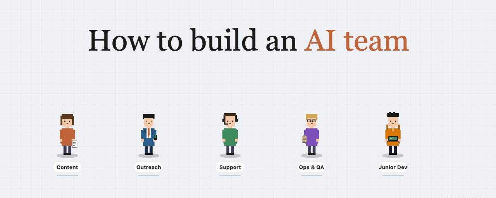
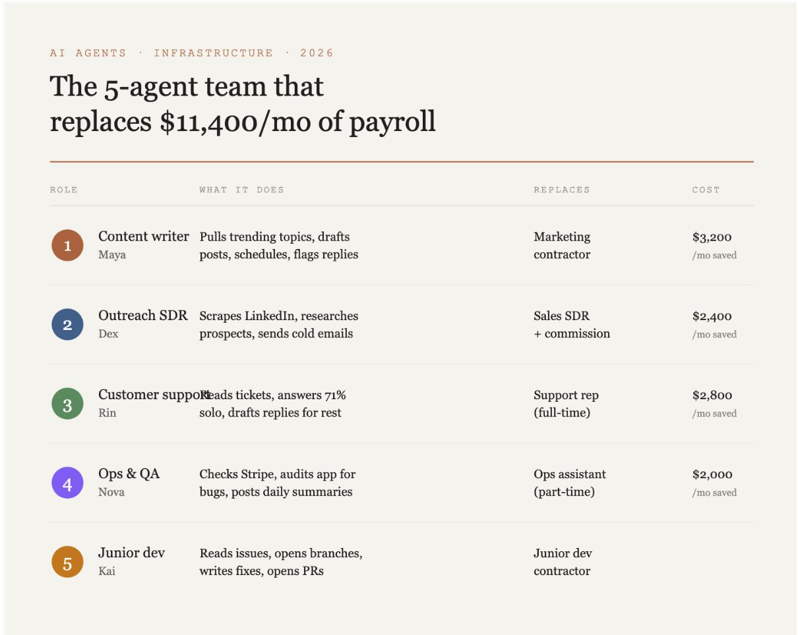
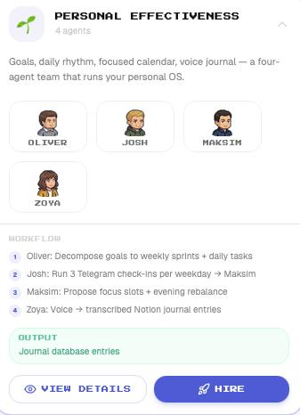
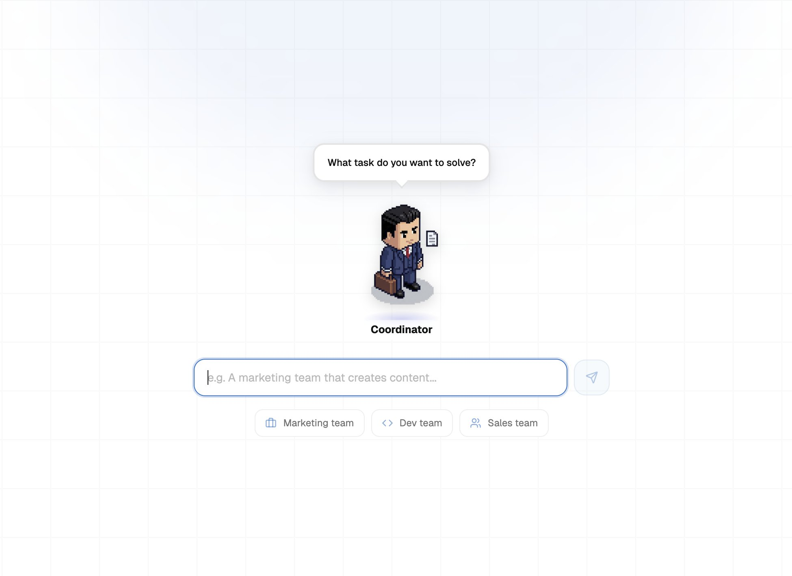
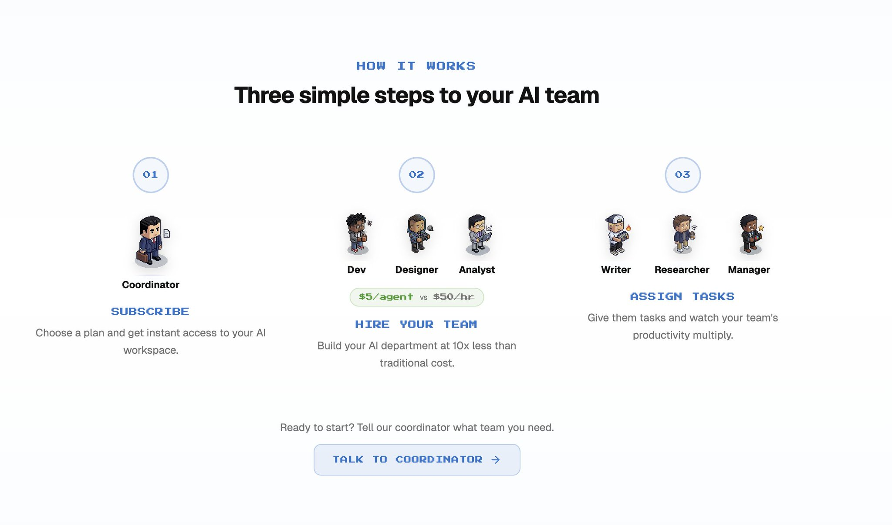
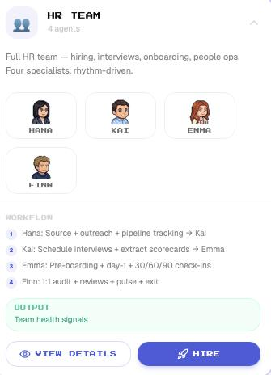
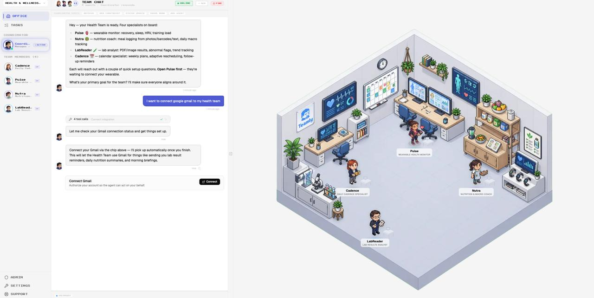
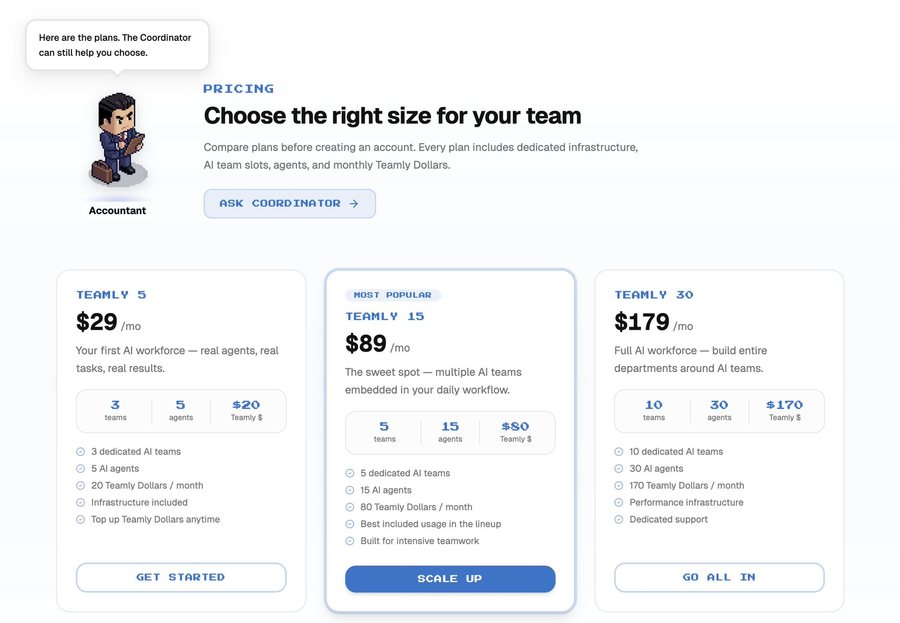

你的 AI 智能体在周五凌晨 2 点坏了。你还不知情。

到周一它会发出 47 封故障邮件、错过 12 张支持工单，并在 API 调用上烧掉 340 美元却什么都没做。

这就是为什么 90% 的"AI 团队"在 30 天内死亡。不是因为智能体太笨。是因为没人在看着它们。

**以下是完整解析** **👇**

在深入之前，我在 Telegram 频道分享关于 AI 和 vibe coding 的每日笔记：[https://t.me/zodchixquant](https://t.me/zodchixquant) 🧠

## AI 团队 surviving 周一的 3 条规则

**规则 1：每个智能体都有职位描述，而不是一种感觉。** 真正的智能体反复做狭窄的事情："每天早上 8 点从 X 拉取 10 条热门帖子，用我的语气起草 3 条回复，如果我批准就发布评分最高的那条。"

**规则 2：你需要实时看到它们在做什么。** 大多数智能体默默失败。它们继续运行，继续扣除你的 API 费用，输出在第 9 天左右变成垃圾，但没人注意到，直到客户给你发 DM 截图。

**规则 3：在笔记本电脑上托管它们不是策略。** 90% 的独立开发者死在这里。它们在本地构建智能体，在 Twitter 上演示，然后在笔记本合上或 macOS 在凌晨 4 点推送更新的那一刻看着它崩溃。

## 2026 年真正的 AI 团队是什么样的

→ **内容写手。** 从 X 和 Reddit 拉取热门话题，用你的语气起草帖子，安排发布。

→ **外联 SDR。** 从 LinkedIn 抓取 VP of Eng，研究他们的技术栈，写个性化的冷邮件。

→ **客户支持。** 阅读每张 Intercom 工单，从你的文档中独立回答 71%，为其余的起草回复。

→ **运营和 QA。** 检查 Stripe 的失败支付，审计你的应用的死链接，发布每日 Slack 摘要。

→ **初级开发。** 阅读标记为"small"的 GitHub issues，打开分支，写修复，打开 PR。

> 每个人类角色成本 $2,000-$4,500/月。

> 用智能体替换成本约 $89 托管费 + $700-$900 API 支出。

## 在确定最终方案之前我尝试过的一切

我会帮你省下几个月的时间。以下是我尝试的一切，以及每次是什么导致失败。

**Claude Code，本地运行。** 我用过的最强大的智能体配置。设计为在终端中在你身边运行，而不是独立生活在我自己的。当我合上笔记本，智能体就停了。

**OpenClaw，在 VPS 上自托管。** 我花最多时间的一个。在开源世界里最接近真正的"AI 劳动力"，有像素艺术智能体、记忆和自主性。三周后，我放弃了。稍后会详细说。

**n8n 用于工作流。** 连接工具很好，作为智能体运行时很糟糕。一个接线工具，不是劳动力。

**Render 或 Railway。** 通用计算。他们托管容器，不关心你的智能体是否在 hallucinating 或每小时烧掉 $400。回到凌晨 2 点 grep 日志。

在这之后，我开始寻找专门为 AI 智能体构建的东西，而不是我必须弯曲成形的通用平台。

那就是我找到 **Teamly (**[@Teamly](https://x.com/@Teamly)) 的时候

## OpenClaw vs Teamly：相同的理念，不同的执行

如果你用过 OpenClaw，[Teamly](https://teamly.to/) 会让你感觉很熟悉。

区别在于 demo 后发生的一切。

**托管。** OpenClaw 在你的 VPS 上自托管，Teamly 是托管云，你把智能体扔进去，它们就在专用基础设施上 24/7 运行。

**可观测性。** OpenClaw 给你日志和一个基本仪表板，Teamly 给你 Pixel Department，那里每个智能体都是一个角色，你可以实时观看工作。

**成本。** OpenClaw 每月花费我 $520+ 全包（VPS + 跨多个密钥的 API + 周末），Teamly 通过 Teamly Dollars 将一切捆绑为 $89/月。

**设置速度。** 用 OpenClaw 我花了 4 天让 3 个智能体稳定运行，用 Teamly 我在 11 分钟内让 Health 团队上线，因为团队是预建的，工作流已连接好，集成只需一次 OAuth 点击。

**各自的适用人群。** OpenClaw 面向想要 fork 代码并在自己的硬件上运行的技术构建者，Teamly 面向想要相同魔法但不想成为兼职 DevOps 工程师的独立创始人。

我先经历了 OpenClaw，我很感激。然后我搬到了 Teamly，因为在某个时刻你不再想调试，而想发货。

## 为什么 Teamly 真正有效

[Teamly](https://teamly.to/) 是从零开始为 AI 智能体设计的托管云托管。我已经在上面运行完整的智能体设置几个月了。

以下是让它与众不同的原因👇

**预建团队，你可以一键雇佣。** Teamly 附带一个团队目录，已经内置了智能体、工作流和经过测试的技能。你像在 Upwork 上雇佣承包商一样雇佣一个。我用过的一些：

→ **个人效能**（4 个智能体）：Oliver 将目标分解为每周 sprints，Josh 运行 Telegram check-ins，Maksim 提议专注时段，Zoya 将语音日记转录到 Notion。替换了 $200/月的教练加一个日记应用。

→ **HR 团队**（4 个智能体）：Hana 寻找人才，Kai 安排面试，Emma 处理 30/60/90 check-ins，Finn 审计 1:1 和退出。对于 10 人创业公司，一个 $4,500/月的 HR 承包商。

→ **健康与保健**（4 个智能体）：Cadence 处理日历日程，Pulse 总结可穿戴设备趋势，Nutra 从照片记录饮食，LabReader 解析实验室 PDF 并标记异常指标。

每个团队都附带有经过测试的工作流在雇佣卡上，所以你可以在雇佣前看到哪个智能体交接给哪个，输出是什么样的。

规则 1 在这里也被悄悄解决了：每个智能体都带有内置的狭窄职位描述（Oliver 不是"帮助提高生产力"，Oliver 将目标分解为每周 sprints）。

**OAuth 而不是 API 密钥地狱。** 连接外部服务是 1 次点击 OAuth 流程，而不是"去 Google Cloud Console，创建一个服务账户，粘贴 JSON"周末。

**Pixel Department。** 每个智能体都作为一个像素艺术角色出现在虚拟办公室中。当智能体在写作时角色打字，当它在解析文档时坐在办公桌前阅读，当需要你的输入时用气泡停止，当某事坏了时明显出错。

用 Teamly 我扫一眼办公室，发现那个已经"思考"了 3 小时的智能体，点击进去，2 分钟内修复提示。

<video preload="none" tabindex="-1" playsinline="" aria-label="Embedded video" poster="https://pbs.twimg.com/amplify_video_thumb/2052352053649784834/img/1n7vA2RTDo8cCKUB.jpg" style="width: 100%; height: 100%; position: absolute; background-color: black; top: 0%; left: 0%; transform: rotate(0deg) scale(1.005);"><source type="video/mp4" src="blob:https://x.com/28378725-dca7-46b4-b6ec-68abc3b095ab"></video>

**包含专用基础设施。** 每个计划都附有自己的计算和内存。你通常需要花费 $200-400/月 在 AWS 上自己支付和配置的部分已捆绑在内。

**Teamly Dollars。** 你不再需要同时使用 Anthropic 密钥、OpenAI 密钥和单独的计费账户，你充值 Teamly Dollars，你的智能体在跨 Sonnet 和 Opus 工作时消耗它们。

## 三个计划：

→ **Teamly 5 — $29/月。** 3 个团队，5 个智能体，$20 Teamly Dollars。你的第一个 AI 劳动力。

→ **Teamly 15 — $89/月。** 5 个团队，15 个智能体，$80 Teamly Dollars。对于运行多个并行工作流的独立创始人的最佳选择。

→ **Teamly 30 — $179/月。** 10 个团队，30 个智能体，$170 Teamly Dollars。性能基础设施加专用支持。用于替换整个部门。

## 底线

我花了 8 个月才知道智能体是简单的部分。

它们住在哪里才是整场游戏。

你可以在 Claude Code 上构建最聪明的智能体，然后因为合上笔记本而失去它。你可以在 VPS 上运行 OpenClaw，然后在发货任何东西之前烧掉 $520/月。

或者你可以跳过整个"从零开始构建"阶段，在 [teamly.to](https://teamly.to/) 上 11 分钟内雇佣一个预建团队，在 Pixel Department 中观看它们工作，把你的周末花在真正的产品工作上而不是 nginx 配置。

**感谢阅读！**

---

> 原文地址：<a href="https://x.com/zodchiii/status/2052368125480354000">https://x.com/zodchiii/status/2052368125480354000</a>
