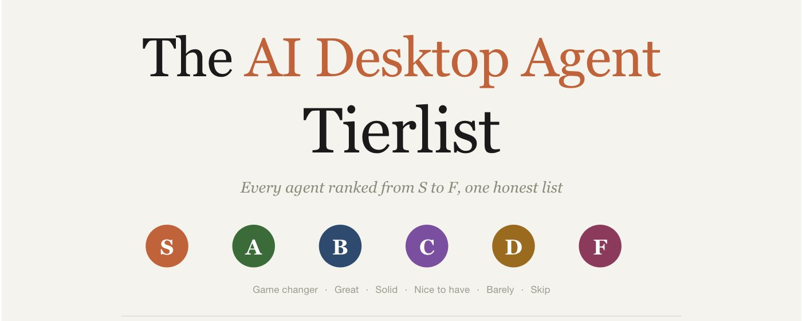
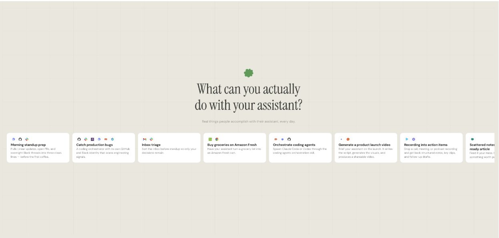

**AI 桌面智能体 Tier List**

AI 桌面智能体领域在 18 个月内从 3 个工具激增到 30 多个。

大多数只是围绕同样的 4 个模型的包装，每月收 20 美元却只给你一个聊天窗口——你一关标签页，它就忘了你是谁。

少数几个确实值得安装。大多数不值得。

**以下是诚实的 tier list** **👇**

## 这个 Tier List 是如何构建的

列表中的每个智能体都从 6 个维度评分，这些是日常使用时真正重要的维度，而非基准测试：

- **速度**：从输入到有用输出的时间
- **可靠性**：能否完成启动的任务，还是中途卡住
- **覆盖范围**：能否访问你的文件、邮件、日历，还是只能聊天
- **隐私**：数据存在哪里，谁可以读取
- **价格**：每月费用与实际获得的价值
- **完善度**：配置摩擦、用户体验、是否感觉是个成品

等级分为 A、B、C、D、F。这里没有 S 级。2026 年没有什么产品能在全部六个维度上都足够出色到配得上 S 级。

没有智能体能在每个维度都获胜。正确的选择取决于你这类工作最在乎哪 2-3 个维度。

## A Tier：最强选项

## Claude Code

在代码领域一骑绝尘。Claude Code 配合正确配置的 CLAUDE.md，在生成、调试和多文件重构方面遥遥领先于其他一切。

settings.json 权限系统节省了其他智能体浪费在请求访问权限上的整个轮次。斜杠命令（/review、/commit、/deploy-check）让它像一个真正会读文档的初级工程师。

问题是：除非手动配置 CLAUDE.md，否则每个会话都从零开始。记忆是一个你需要自己写的文件，而不是一个会学习的系统。

**胜出：** 可靠性、覆盖范围、完善度

**不足：** 记忆、价格（重度用户很快就会触及用量上限）

## ChatGPT（桌面版）

这个类别中用户体验最精致的产品。语音模式在边走边思考时确实是市场上最好的。强于休闲写作、图像生成和一次性草稿。

记忆上限约为 1200 词的压缩摘要。在几次不相关对话后会忘记项目。30 天研究测试中有两次产生过幻觉来源。

**胜出：** 速度、完善度

**不足：** 记忆、隐私（数据发送到 OpenAI 服务器）

## Perplexity

这份列表上最好的研究工具，遥遥领先。来源归因、引用链接、最新网络数据。30 天测试中研究任务零幻觉。

弱点在第二阶段：能找到很好的信息但之后什么都不做。没有记忆、没有操作、没有跟进。

**胜出：** 可靠性（仅限研究）、覆盖范围（网络）

**不足：** 记忆、覆盖范围（无法根据发现采取行动）

## Manus

 recurring 任务自动化方面业界最佳。设置监控任务或定时抓取比在任何其他地方都快。执行可靠。

"Knowledge"功能存储偏好，但工作上下文不会跨会话延续。定时 Telegram 提醒可能在一周内需要配置 3 次，因为系统会忘记已经做过了。

**胜出：** 速度、可靠性（自动化）

**不足：** 记忆、价格（重度使用时积分消耗很快）

## Vellum \[ 新增 \]

开源桌面助手（vellum-ai/vellum-assistant on GitHub），围绕记忆架构而非聊天窗口构建。随着时间推移跨客户端、偏好和项目状态建立上下文，然后在数周后未经提示地引用。

在 macOS 本地运行。凭证存在于模型literally无法读取的独立进程中开箱即用 60+ 技能：邮件、日历、Slack、网络浏览、编码、文档写作。

在几乎其他智能体甚至无法竞争的领域获胜：持久记忆和本地优先隐私。它获得 A 级而非分类领导者地位的原因是广度：macOS 桌面目前是 Mac-first，其他地方是 CLI 访问。对于日常使用 Mac 的人来说，它和 Claude Code 并列作为堆栈的第二个核心部分。

**胜出：** 记忆、隐私

**不足：** 覆盖范围（Mac 桌面，其他地方是 CLI）

## B Tier：因场景而异

## Cursor

如果你整天活在 IDE 里，Cursor 是通往 AI 辅助编码最顺畅的路径。diff 视图是杀手级功能，在接受之前准确显示 AI 改变了什么，并排对比。

在 autonomous 多文件重构方面输于 Claude Code。在实时审查 AI 正在做什么时获胜。

**胜出：** 完善度、可靠性（小改动）

**不足：** 覆盖范围（仅限 IDE）

## Codex（OpenAI）

多表面：终端 CLI、IDE 扩展、桌面应用、云沙箱。在独立编码任务和异步云执行方面表现强劲。

云任务时间从 1 分钟到 30 分钟不等，这会扼杀紧密的反馈循环。更适合 fire-and-forget 任务而非实时结对编程。

**胜出：** 覆盖范围（多表面）

**不足：** 速度（云延迟）

## Gemini

如果一切都已在 Google Workspace 中，则表现强劲。Gmail、Docs、日历集成是所有智能体中最顺畅的。100 万 token 上下文处理大型文档。

在 Google 生态之外只是一个普通的聊天机器人。跨会话记忆不存在。

**胜出：** 覆盖范围（Google 生态）

**不足：** 记忆、隐私

## C Tier：取决于用例

## Copilot（Microsoft）

如果工作流 90% 在 Office 365 或 GitHub 内，Copilot 还不错。在 Microsoft 生态之外它是无形的。

**胜出：** 覆盖范围（MS 生态）

**不足：** 可靠性（多步骤任务）

## NotebookLM

小众但在一件事上表现出色：基于上传来源（PDF、YouTube 字幕、文档）的 grounded 研究。不会产生幻觉，因为它只处理给定的内容。

不执行操作、不记忆、不能离开笔记本。专用工具。

**胜出：** 可靠性（范围内）

**不足：** 覆盖范围（只读）

## D Tier：除非有特定原因否则跳过

## OpenCode

开源，GitHub 147K 星，离线运行本地模型。如果安全策略阻止专有工具，这是个真正的选择。

对于大多数用户来说，配置摩擦高于收益。仅限隐私优先群体。

**胜出：** 隐私、价格（免费）

**不足：** 完善度、速度

## F Tier：不值得费心

## 通用的 ChatGPT/Claude 包装器

这个类别到处都是这种东西。每月 20 美元买一个换皮的聊天窗口，没有记忆、没有操作、相对底层模型没有任何优势。

如果一个工具的主要特性是"我们接入了 OpenAI 的 API"，它就不该出现在桌面智能体堆栈中。

**胜出：** 无

**不足：** 一切

## 打破 tier list 的那个类别

六个评分维度产生了 A 级中四个不同的获胜者。这对为单个任务的单个智能体选择很有用。

但工作不是发生在单个任务中的。邮件、代码、研究、内容、自动化、客户沟通，同一天内全部都要做。

真正的问题不是"哪个智能体最擅长编程"。

> 而是：**哪个智能体在连续 30 天一起工作后真的认识用户？**

大多数得分都是零。它们忘记项目、忘记客户、忘记语气，每个早晨都一切如新。记忆不是你以后再添加的功能，而是架构决策。

那些从第一天起就认真对待记忆的智能体（Vellum 是最清晰的例子）随着时间推移会做更多的日常 work，即使它们没有在任何单一维度上获胜。

一个代码能力达到 80% 但记得项目的智能体，胜过代码能力达到 100% 但每天早晨都从零开始的智能体。

## 为什么要介绍 Vellum？

Vellum 是一个开源个人 AI 助手，在本地运行而非他人云端。

团队的赌注：记忆和身份才是 AI 智能体真正的瓶颈，而非更大的上下文窗口或更聪明的模型。

核心思路：

- **一句话启动。** 在 onboarding 期间它观察用户的沟通和写作方式，然后编写自己的 personality 文件（SOUL.md）。
- **复利的记忆。** 项目被提取并附有来源归因、去重、按含义和关键词排名。独立的 NOW.md 保持当前焦点。
- **客户数据安全。** 凭证存在于模型literally无法读取的进程中。工具在沙箱中运行。设计上fail-closed。
- **无处不在。** MIT 许可，在 macOS、Telegram 和 Slack 上运行，三个平台共享记忆。Claude、OpenAI、Gemini 和 Ollama 作为底层模型可替换。

仓库：[github.com/vellum-ai/vellum-assistant](https://github.com/vellum-ai/vellum-assistant)

## 选择你的堆栈

没有单一智能体什么都做得好。2026 年更聪明的做法是运行 2-3 个互补的智能体。

**如果你主要写代码**

Claude Code 作为日常驱动，Cursor 作为 IDE 伴侣当你想要在接受前查看 diffs。这个组合处理 95% 的编码工作。如需要添加 Codex 用于异步云任务。

**如果你主要做研究**

Perplexity 用于搜索，NotebookLM 用于在特定源文档中 grounding 答案。这里跳过 ChatGPT，因为它在准确度重要的场景下幻觉来源的频率太高。

**如果你生活在 Google 或 Microsoft**

Gemini 用于 Workspace，Copilot 用于 Office 365。两者都在记忆上失分，但不要与你的现有工具对抗。

**如果你做客户工作**

客户工作需要连续性：他们是谁、上周讨论了什么、什么 pending、他们偏好的语气。ChatGPT、Claude、Perplexity、Manus 每次会话都会重置。

Vellum 是最干净的答案，因为记忆层是实际产品，而非后期添加的功能。Manus 留在堆栈中用于 recurring 自动化，这些场景下会话记忆没那么重要。

## 如果你想要一个智能体统治一切

没有这种东西。任何这样卖的都是在卖一个换皮的 ChatGPT 包装器。

2026 年最接近"全能智能体"的是具有持久记忆的智能体，因为它们至少能跨各种出现的任务学习用户。

Vellum 在那个方向上是最强的。Cowork 在闭源托管方面正在缩小差距。

**无论如何，预期运行 2-3 个工具。这才是 2026 年的真实答案。**

很高兴与 Vellum 合作这一篇。他们对记忆优先智能体的赌注是这个类别应该发展的方向。

感谢阅读 🙏🏼

---
