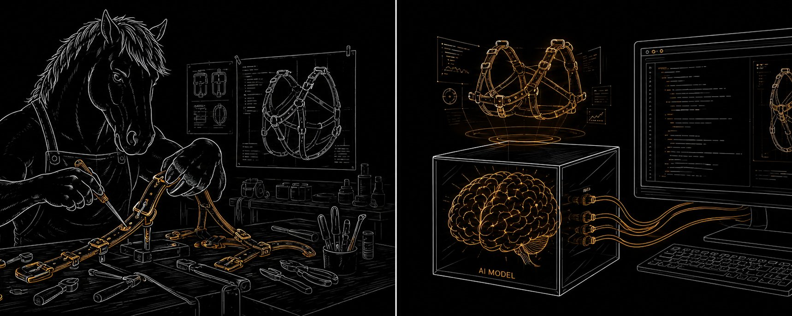
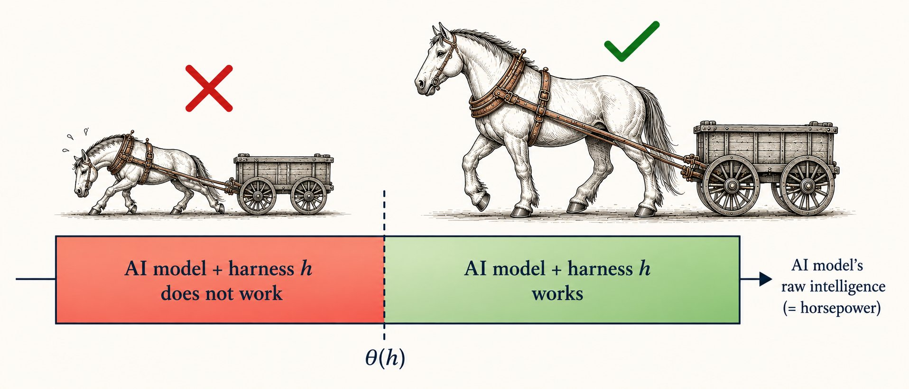
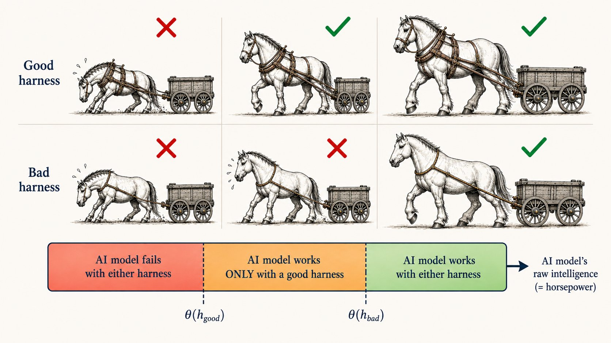
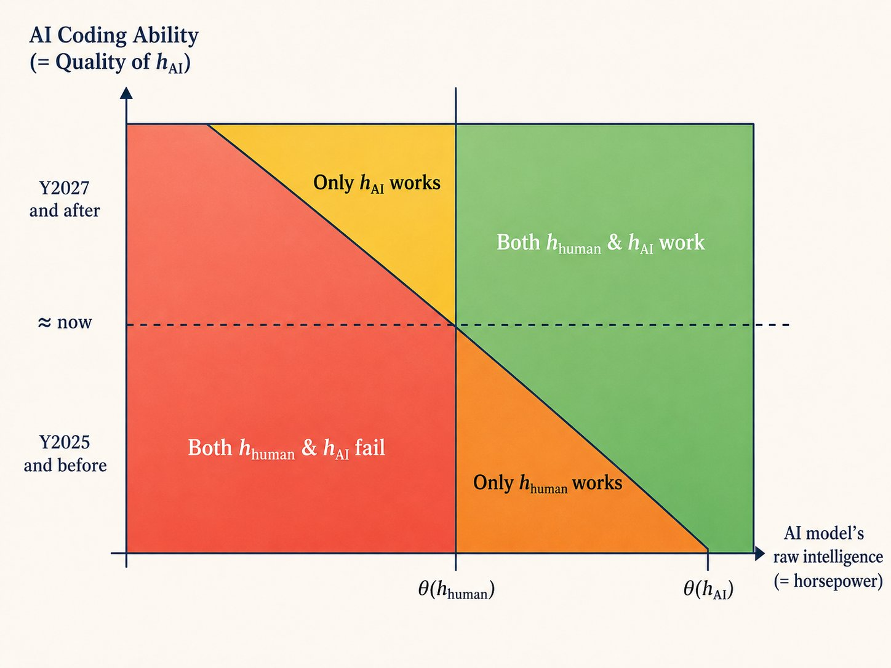

# 为什么我们应该停止为 AI Agent 手工设计 Harness

（如果你对"马车的类比"不熟悉，请先阅读[我最近的文章](https://x.com/Kangwook_Lee/status/2051296616989315118)）

在本文中，我想解释为什么所有人都应该**停止**手工为 AI Agent 设计 Harness。

> **简而言之：** 最好的 Harness 可能不再需要人类来设计，而是 Agent 自我工程化的结果。如果我们继续为 AI Agent 手工设计 Harness，我们将成为瓶颈。

让我来解释原因。

## Harness 创建了一个阈值

让我先提出一种思考 Harness 与模型关系的新方式。

大多数人的观点是"固定模型，改变 Harness"。

我提出的观点是"固定 Harness，改变模型容量"。

对于一个固定任务，Harness 在模型的原始智能上创建一个单一的阈值。

如果模型比这个阈值更聪明，它就能用这个 Harness 解决任务。如果模型低于阈值，它就无法解决。

我们把这个阈值称为 θ(h)，相对于 Harness h 来定义。

下图展示了这个想法。

## 三种 Regime 框架

在比较两种 Harness 时，这个视角变得非常有用。

一个是好的 Harness（h\_good）。一个是坏的 Harness（h\_bad）。

好的 Harness 使任务更容易，因此创建了更低的阈值。

坏的 Harness 对同样的任务要求更聪明的模型，因此创建了更高的阈值。

这自然产生了三种 regime。

**第一种 regime。** 处于这个 regime 的模型无论用哪种 Harness 都无法解决任务。

**第二种 regime。** 处于这个 regime 的模型智能程度中等，它们能解决任务，但只能在使用好的 Harness 的情况下！

**第三种 regime。** 处于这个 regime 的模型足够聪明，无论用哪种 Harness 都能解决任务。

注意，Harness 质量在**中间 regime** 最为关键——当模型智能程度中等但还不够聪明时。这就是好的 Harness 发挥作用的时候。

我们称之为**三种 Regime 框架**。

## 人类设计的 Harness vs AI 设计的 Harness

让我们回到马车的类比。

马和 AI 之间有一个关键区别。

> 马无法自己制造挽具。AI 可以。

现在，考虑两种 Harness。

**h\_human**：人类制造的 Harness。**h\_ai**：AI 制造的 Harness。

在过去的几年里，情况是这样的：

> h\_good = h\_human，h\_bad = h\_ai

人类设计的 Harness 比 AI 生成的更好。

因此在三种 Regime 框架中，中间 regime 意味着："AI 模型只能在人类设计的 Harness 下工作。"

我们手工精心设计的 Agent 循环、工具使用模式、记忆结构、规划脚手架，确实优于 AI 自主生成的结果。构建一个好的 Agent 意味着构建一个好的 Harness。

就个人而言，我在那个时代花了很多时间为 AI Agent 设计 Harness。我设计了 SOTA 聊天机器人 Harness [\[ACL'23\]](https://arxiv.org/abs/2305.04533)、基于 VLM 的图像聚类 Agent [\[ICLR'24\]](https://arxiv.org/abs/2310.18297)、PUBG 游戏伴侣 Agent [\[blog\]](https://www.krafton.ai/blog/posts/2026-04-15-pubg_ally_nemotron/pubg-ally-nemotron-en.html) Ally，以及用于编程 Agent 的 Terminus-KIRA [\[blog\]](https://www.krafton.ai/blog/posts/2026-02-20-terminus_kira/terminus-en.html)。

有一段时间，这非常有趣。

**但前提正在改变**

AI 编程能力越来越强。调试越来越好。系统迭代越来越快。最终，在构建 Harness 方面也会比我们做得更好。

这颠覆了整个局面。

> h\_good = h\_ai，h\_bad = h\_human

这意味着什么？根据三种 Regime 框架，中间 regime 意味着："AI 模型只能在 AI 设计的 Harness 下工作。"

换句话说，如果我们继续使用"人类设计的 Harness"，我们将无法看到处于中间 regime 的模型的全部潜力。

事实上，我们最近的工作 [Meta Harness](https://yoonholee.com/meta-harness/)（由 [@yoonholeee](https://x.com/@yoonholeee) 主导）已经表明，AI 在中型模型的迭代 Harness 工程方面优于人类。

为了看到全貌，让我加入时间轴。

假设 AI 编程能力随时间单调增长。你会得到如下 2D 相图，我们正处在一次重要相变的临界点。

"黄色 regime"的出现为 [@a1zhang](https://x.com/@a1zhang) [@lateinteraction](https://x.com/@lateinteraction) 提出的[被埋没的天才假说](https://alexzhang13.github.io/blog/2026/mgh/)提供了另一种可能的解释。如果我们继续使用手工设计的 Harness，我们将无法看到底层 AI 模型的全部潜力。

## 结论

当模型足够强大时，Harness 质量几乎无关紧要。简单的 Agent 循环和正确的工具足以处理几乎任何事情。

当模型太弱时，Harness 质量也几乎无关紧要。再好的 Harness 也救不了它。

问题出在中间。当模型智能程度中等时。理论上能胜任，但缺乏适当的支持就会失败。这正是 Harness 质量起决定性作用的地方。

直到最近，那个好的 Harness 还必须来自人类。

现在不再是这样了。为了充分利用中间 regime 的模型，我们需要从 Harness 工程中退后一步。

**让聪明的马自己建造它们自己的挽具。**

---

> **来源**: [https://x.com/kangwook_lee/status/2052925157606568217?s=46](https://x.com/kangwook_lee/status/2052925157606568217?s=46)
