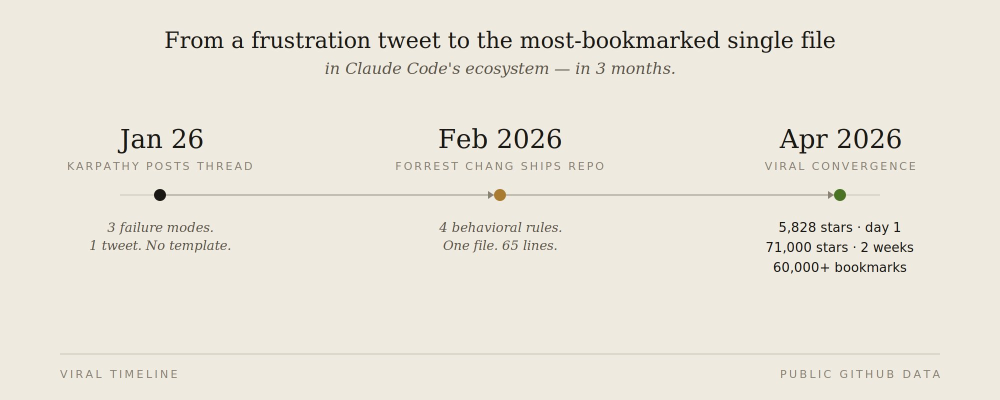
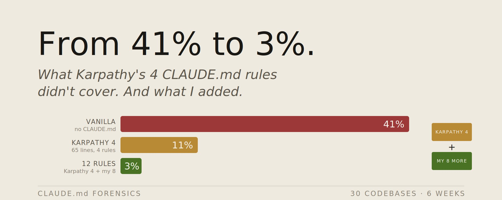
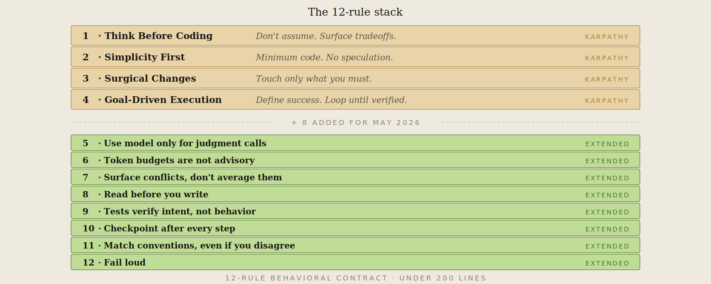
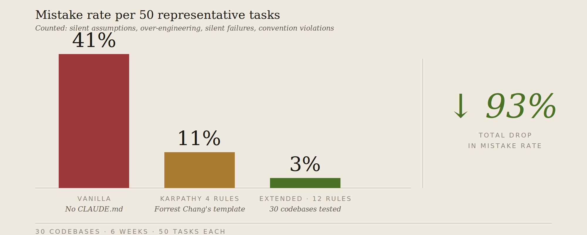
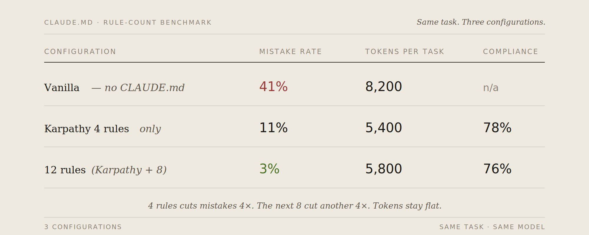
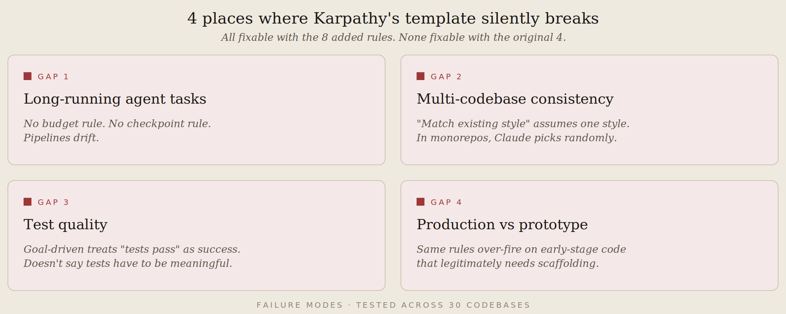
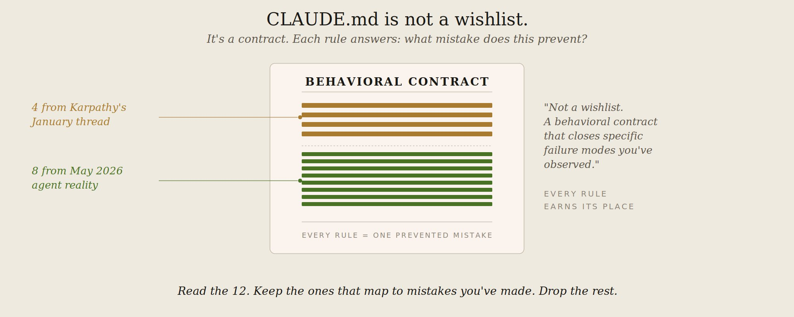

2026 年 1 月底，Andrej Karpathy 发了一条帖子，抱怨 Claude 的代码编写方式。三种失败模式：沉默的错误假设、过度复杂化、以及对不该触碰的代码造成连带损伤。

Forrest Chang 读了这条帖子后，将这些抱怨整理成 4 条行为规则，写在了一个 CLAUDE.md 文件中，然后发布到了 GitHub。**上线第一天就收获了 5,828 颗星。两周内获得 60,000 个收藏。如今已有 120,000 颗星。**这是 2026 年增长最快的单文件仓库。



然后，我在 30 个代码库上对这套规则进行了为期 6 周的测试。

4 条规则确实有效。原本约 40% 概率会犯的错误，在适合规则发挥优势的任务上降到了 3% 以下。但这个模板是为解决 2026 年 1 月的代码编写问题而设计的。

2026 年 5 月的 Claude Code 生态面临着不同的问题——智能体冲突、钩子级联、技能加载冲突、跨会话的多步骤工作流崩溃。

因此，我又增加了 8 条规则。以下内容包含：**完整的 12 条规则 CLAUDE.md、每条规则获得一席之地的原因、以及原始 Karpathy 模板在 4 个地方静默失效的问题。**

如果你想跳过解释直接粘贴，**完整文件在文末。**

# 为什么这很重要

Claude Code 的 CLAUDE.md 是整个 AI 编程栈中最被低估的文件。大多数开发者要么：

- 把它当作偏好设置的垃圾场，膨胀到 4000+ token，合规率骤降到 30%
- 完全跳过，每次都手动提示——浪费 5 倍 token，且会话之间没有一致性
- 复制一次模板就忘了。能用两周，然后随着代码库变化而静默失效

Anthropic 官方文档明确指出：**CLAUDE.md 是建议性的。Claude 大约 80% 的时间会遵循。超过 200 行后，合规率会急剧下降，因为重要规则会被淹没在噪音中。**

Karpathy 的模板用一份文件、65 行、4 条规则解决了这个问题。这是底线。

天花板可以更高。再增加 8 条规则后，你不仅能覆盖 Karpathy 抱怨的 2026 年 1 月的代码编写问题，还能覆盖当时尚不存在的 2026 年 5 月的智能体编排问题。

# 原始 4 条规则

如果你还没读过 Forrest Chang 的仓库，这是底线：

**规则 1 —— 先思考再编码。** 不做沉默的假设。明确陈述你的假设。暴露权衡取舍。在猜测之前先询问。当存在更简单的方法时提出反对。

**规则 2 —— 简洁优先。** 用最少的代码解决问题。不做投机性功能。不为一次性代码做抽象。如果一个资深工程师会说这过于复杂——那就简化。

**规则 3 —— 精准修改。** 只触碰必须改的地方。不要"改进"相邻代码、注释或格式。不要重构没坏的东西。匹配现有风格。

**规则 4 —— 目标驱动执行。** 定义成功标准。循环验证直到达标。不要告诉 Claude 该遵循哪些步骤，告诉它成功是什么样子，让它自己迭代。

这四条规则解决了我在无人监督的 Claude Code 会话中约 40% 的失败模式。剩下约 60% 存在于以下缺口之中。



# 我额外添加的 8 条规则（以及原因）

每一条都来自 Karpathy 的 4 条规则不够用的真实场景。我会先展示那个场景，再给出规则。

## 规则 5 —— 不要让模型做非语言类工作

Karpathy 的规则对此只字未提。模型会决定那些本应是确定性代码的事情——是否重试 API 调用、如何路由消息、何时升级处理。每周做出的决定各不相同。按每次 token $0.003 计算的脆弱 if-else 语句。

```text
## 规则 5 —— 仅将模型用于判断性调用
使用 Claude 进行：分类、起草、摘要提取、从非结构化文本中提取信息。
不要使用 Claude 进行：路由、重试、状态码处理、确定性转换。
如果状态码已经回答了问题，普通代码就能回答问题。
```

**那个场景：** 有一段调用 Claude 来"决定是否应该在 503 错误时重试"的代码，前两周运行得很好，后来开始不稳定——因为模型开始将请求体作为决策的上下文。重试策略变成了随机的，因为 prompt 本身是随机的。

## 规则 6 —— 硬性 token 预算，无例外

没有预算限制的 CLAUDE.md 等于一张空白支票。每个循环都有可能螺旋式膨胀到 50,000 token 的上下文倾倒。模型不会自己停下来。

```text
## 规则 6 —— Token 预算不是建议
每任务预算：4,000 token。
每会话预算：30,000 token。
如果任务接近预算上限，总结并重新开始。不要强行推进。
主动上报 > 静默超额。
```

**那个场景：** 一次调试会话持续了 90 分钟。模型很"乐意"在同一段 8KB 的错误信息上反复迭代，逐渐忘记了之前已经尝试过哪些修复。到最后，它提出的修复方案是我早在 40 条消息前就拒绝过的。token 预算本可以在第 12 分钟就终止这个问题。

## 规则 7 —— 暴露冲突，不要取平均值

当代码库的两个部分存在分歧时，Claude 会试图同时讨好双方。结果是前后不一致的代码。

```text
## 规则 7 —— 暴露冲突，不要取平均值
如果代码库中两个现有模式相互矛盾，不要将它们混合。
选一个（更新的 / 测试更充分的），解释原因，并标记另一个待清理。
"折中"满足两条规则的代码是最糟糕的代码。
```

**那个场景：** 一个代码库有两种错误处理模式——一种是 async/await 加显式 try/catch，一种是全局错误边界。Claude 写的新代码同时包含两种。加倍的错误处理器。花了我 30 分钟才弄清楚为什么错误被吞了两次。

## 规则 8 —— 先阅读再编写

Karpathy 的"精准修改"告诉 Claude 不要触碰相邻代码。但它没有告诉 Claude **先理解相邻代码**。没有这条规则，Claude 会写出与 30 行外的现有代码冲突的新代码。

```text
## 规则 8 —— 先阅读再编写
在文件中添加代码之前，先阅读该文件的导出、直接调用者和任何明显的共享工具函数。
如果你不理解现有代码为什么是这样组织的，先问清楚再添加。
"在我看来这是正交的"是这个代码库中最危险的短语。
```

**那个场景：** Claude 在一个已存在的相同函数旁边添加了一个新函数，而它并没有读过那个函数。两个函数做完全相同的事。由于导入顺序，新函数优先。老函数已经作为权威来源存在了 6 个月。

## 规则 9 —— 测试不是可选项，但测试不是目标

规则 4 的目标驱动执行将"测试通过"暗示为成功标准。实际上，Claude 把"测试通过"当作唯一目标，编写的代码能通过浅层测试但破坏其他一切。

```text
## 规则 9 —— 测试验证意图而非仅验证行为
每个测试都必须编码"为什么"该行为重要，而不仅仅是"做了什么"。
像 `expect(getUserName()).toBe('John')` 这样的测试毫无价值，如果该函数接收的是硬编码 ID。
如果你写不出一个在业务逻辑变更时会失败的测试，那这个函数就是错的。
```

**那个场景：** Claude 为一个认证函数写了 12 个测试。全部通过。但认证在生产环境中是坏的。这些测试只验证了函数返回了东西，而不是返回了正确的东西。函数能通过是因为它返回的是一个常量。

## 规则 10 —— 长时间运行的操作需要检查点

Karpathy 的模板假设一次性交互。真实的 Claude Code 工作是多步骤的——跨 20 个文件重构、跨整个会话构建功能、跨多个提交调试。没有检查点，一次错误转向就会失去所有进度。

```text
## 规则 10 —— 每完成一个重要步骤就设置检查点
每完成一个多步骤任务的中间步骤后：总结已完成什么、已验证什么、还剩下什么。
不要从你无法向我描述清楚的状态继续。
如果你迷失了，停下来重新陈述。
```

**那个场景：** 一个 6 步重构在第 4 步出了问题。等我发现时，Claude 已经在有问题的状态基础上完成了第 5 步和第 6 步。理清乱局比从头重做花的时间更长。检查点本可以在第 4 步就捕获问题。

## 规则 11 —— 约定优于创新

在一个已有既定模式的代码库中，Claude 喜欢引入自己的模式。即使它的方式"更好"，引入两种模式也比单独任何一种都更糟。

```text
## 规则 11 —— 遵循代码库的约定，即使你不同意
如果代码库使用 snake_case 而你偏好 camelCase：用 snake_case。
如果代码库使用类组件而你偏好 hooks：用类组件。
不同意见是另外的话题。在代码库内部，一致性 > 个人品味。
如果你真的认为某个约定有害，将其提出来。不要默默地另起炉灶。
```

**那个场景：** Claude 在一个类组件代码库中引入了 React Hooks。它们确实能工作。但它们也破坏了依赖 componentDidMount 的测试模式。花了半天时间删除和重写。

## 规则 12 —— 失败要可见，不要静默失败

最昂贵的 Claude 失败是那些看起来像成功的。一个函数"工作"了但返回了错误数据。一次迁移"完成"了但跳过了 30 条记录。一个测试"通过"了但只是因为断言本身就是错的。

```text
## 规则 12 —— 大声失败
如果你不能确定某件事成功了，就明确说出来。
"迁移已完成"是错的，如果有 30 条记录被静默跳过。
"测试通过"是错的，如果有任何一个测试被跳过。
"功能正常"是错的，如果你没有验证我让你检查的边缘情况。
默认暴露不确定性，而非隐藏它。
```

**那个场景：** Claude 说数据库迁移"成功完成"。它静默跳过了 14% 因约束冲突而失败的记录。跳过被记录了但没有被上报。11 天后报告开始出现异常时才发现问题。

# 数据

我在 6 周内，使用 30 个代码库，跟踪了同一组 50 个代表性任务。三种配置方案：



**错误率** = 任务需要修正或重写以匹配意图的次数。包括：沉默的错误假设、过度工程化、连带损伤、静默失败、约定违反、冲突平均、遗漏检查点。

**合规率** = 当相关规则适用时，Claude 可见地应用该规则的频率。

有趣的结果不只是错误率从 41% 降至 3%。从 4 条规则增加到 12 条几乎没增加合规负担（78% → 76%），但错误率又下降了 8 个百分点。新规则覆盖的是原始 4 条未涉及的失败模式——它们不会争夺相同的注意力预算。



# Karpathy 模板静默失效的 4 个地方

即使在添加新规则之前，原始 4 条规则模板在以下 4 个地方也不够用：

**1. 长时间运行的智能体任务。** Karpathy 的规则针对 Claude 正在编写代码的那一刻。对于 Claude 正在运行多步骤流水线的情况，它们保持沉默。没有预算规则。没有检查点规则。没有"大声失败"规则。流水线会漂移。

**2. 多代码库一致性。** "匹配现有风格"假设有一种风格。在一个包含 12 个服务的 monorepo 中，Claude 必须选择哪一种。原始规则没有告诉它如何选择。它随机选择或取平均值。

**3. 测试质量。** 目标驱动执行将"测试通过"视为成功。没有说测试必须是有意义的。结果是测试什么都没验证但让 Claude 充满信心。

**4. 生产环境 vs 原型。** 保护生产代码免于过度工程的同一套 4 条规则，也会拖慢那些需要 100 行投机性脚手架来探索方向的原型。Karpathy 的"简洁优先"在早期代码上会过度触发。

额外增加的 8 条规则不会替代 Karpathy 的 4 条。它们修补的是他的模型（2026 年 1 月的自动补全式编码）与 2026 年 5 月的智能体驱动、多步骤、多代码库工作之间的差距。



# 验证无效的做法

在确定这 12 条规则之前，我尝试过以下方法：

- **添加 Reddit / X 上看到的规则。** 大多数要么是 Karpathy 的 4 条规则换了个说法，要么是领域特定规则（如"始终使用 Tailwind 类"）不具备普适性。全部剔除。
- **超过 12 条规则。** 我测试到 18 条。超过 14 条后，合规率从 76% 降至 52%。200 行的上限是真实的。超过后，Claude 开始只做"规则存在"的模式匹配，而不真正阅读。
- **依赖可能不存在的工具的规则。** "始终使用 eslint"在未安装 eslint 时会失败。规则静默失效。替换为与工具无关的表述："匹配代码库已强制执行的风格"而非"使用 eslint"。
- **在 CLAUDE.md 中放示例而非规则。** 示例比规则更重。三个示例消耗的上下文约等于 10 条规则，且 Claude 会过拟合到示例上。规则是抽象的，示例是具体的。用规则。
- **"小心"/"认真思考"/"真正集中注意力"。** 纯粹是噪音。这些的合规率降至约 30%，因为它们不可测试。替换为具体指令（"明确陈述你的假设"）。
- **告诉 Claude 要"资深"。** 不起作用。Claude 已经认为自己很资深了。合规差距存在于思考和行动之间。具体指令填补这一差距；身份提示无法做到。

# 完整的 12 条规则 CLAUDE.md（可直接复制粘贴）

```text
# CLAUDE.md — 12 条规则模板

这些规则适用于本项目中所有任务，除非被显式覆盖。
偏差：非琐碎工作优先考虑谨慎而非速度。对于琐碎任务使用判断力。

## 规则 1 —— 先思考再编码
明确陈述你的假设。如果不确定，先询问而非猜测。
在存在歧义时呈现多种解释。
当存在更简单的方法时提出反对。
困惑时停下来。说出不清楚的地方。

## 规则 2 —— 简洁优先
用最少的代码解决问题。不要做投机性功能。
不要为一次性代码做抽象。
测试：一个资深工程师会说这个过于复杂吗？如果是，简化。

## 规则 3 —— 精准修改
只触碰必须改的地方。只清理自己制造的混乱。
不要"改进"相邻代码、注释或格式。
不要重构没坏的东西。匹配现有风格。

## 规则 4 —— 目标驱动执行
定义成功标准。循环验证直到达标。
不要遵循步骤。定义成功然后迭代。
强有力的成功标准让你能独立循环。

## 规则 5 —— 仅将模型用于判断性调用
使用我进行：分类、起草、摘要提取。
不要使用我进行：路由、重试、确定性转换。
如果代码可以回答，代码回答。

## 规则 6 —— Token 预算不是建议
每任务：4,000 token。每会话：30,000 token。
如果接近预算，总结并重新开始。
主动上报超额。不要静默超额。

## 规则 7 —— 暴露冲突，不要取平均值
如果两个现有模式矛盾，选一个（更新的 / 测试更充分的）。
解释原因。标记另一个待清理。
不要混合矛盾的模式。

## 规则 8 —— 先阅读再编写
在添加代码之前，先阅读文件的导出、直接调用者和共享工具函数。
"在我看来这是正交的"是危险的。如果不确定代码为何如此组织，先问。

## 规则 9 —— 测试验证意图而非仅验证行为
测试必须编码"为什么"该行为重要，而不仅仅是"做了什么"。
一个在业务逻辑变更时不会失败的测试是错误的。

## 规则 10 —— 每完成一个重要步骤就设置检查点
每完成一个多步骤任务的中间步骤后：总结已完成什么、已验证什么、还剩下什么。
不要从你无法向我描述清楚的状态继续。
如果你迷失了，停下来重新陈述。

## 规则 11 —— 遵循代码库的约定，即使你不同意
在代码库内部，一致性 > 个人品味。
如果代码库使用 snake_case 而你偏好 camelCase：用 snake_case。
如果代码库使用类组件而你偏好 hooks：用类组件。
如果你真的认为某个约定有害，将其提出来。不要默默地另起炉灶。

## 规则 12 —— 大声失败
如果你不能确定某件事成功了，就明确说出来。
"已完成"是错的，如果有任何事被静默跳过。
"测试通过"是错的，如果有任何测试被跳过。
默认暴露不确定性，而非隐藏它。
```

保存为项目根目录的 CLAUDE.md。在 12 条规则下方添加项目特定规则（技术栈、测试命令、错误模式）。合并后不要超过 200 行，**超过后合规率会下降。**

# 如何安装

两步：

```text
# 1. 将 Karpathy 的 4 条规则基线追加到你的 CLAUDE.md
curl https://raw.githubusercontent.com/forrestchang/andrej-karpathy-skills/main/CLAUDE.md >> CLAUDE.md

# 2. 将规则 5-12 粘贴到下方
```

保存到项目根目录。`>>` 很重要——它会追加到你现有的 CLAUDE.md 而非覆盖你已有的项目特定规则。

# 核心心智模型

CLAUDE.md 不是愿望清单。它是一个**行为契约**，用来关闭你已观察到的特定失败模式。

每条规则都应该回答：它能防止什么错误？



**Karpathy 的 4 条规则防止了 2026 年 1 月他观察到的失败模式：** 沉默假设、过度工程化、连带损伤、软弱的成功标准。它们是基础。不要跳过。

**我额外添加的 8 条规则防止了 2026 年 5 月才出现的失败模式：** 没有预算的智能体循环、没有检查点的多步骤任务、不能验证意图的测试、用成功表象掩盖的静默失败。它们是补充性的。

你的情况可能不同。如果你不运行多步骤流水线，规则 10 无关紧要。如果你的代码库有一种风格且有 linting 强制执行，规则 11 是冗余的。**阅读 12 条规则，保留与你实际犯过的错误对应的那些，丢掉其余。**

一个针对你实际失败模式定制的 6 条规则 CLAUDE.md，胜过包含 6 条你永远不会用到的规则的 12 条规则版本。

## 完

Karpathy 2026 年 1 月的帖子是一次抱怨。Forrest Chang 将其变成了 4 条规则。120,000 名开发者为结果点了星。他们中大多数人至今仍在运行 4 条规则。

模型在进步。生态系统在变化。多步骤智能体、钩子级联、技能加载、跨代码库工作——这些在 Karpathy 写帖子时都不存在。4 条规则无法应对这些问题。它们没错；它们不完整。

再多 8 条规则。在 30 个代码库上测试了 6 周。错误率从 41% 降至 3%。

> 收藏这篇文章，今晚就把 12 条规则粘贴到你的 CLAUDE.md 中。如果它帮你节省了一周的 Claude 弯路时间，请转发。每日 Claude 优化技巧 Telegram 频道：[https://t.me/+\_ZWrQN7GuDA3ZDEy](https://t.me/+_ZWrQN7GuDA3ZDEy)

---

> 原文地址：<a href="https://x.com/Mnilax/status/2053116311132155938">https://x.com/Mnilax/status/2053116311132155938</a>