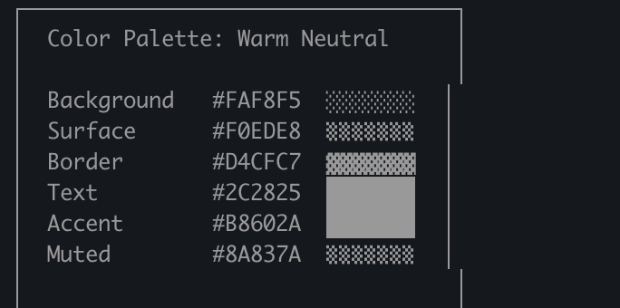
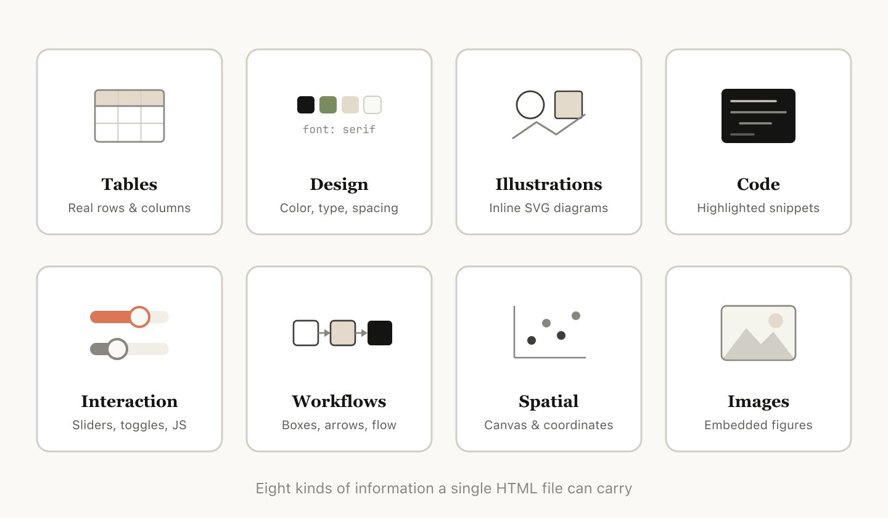
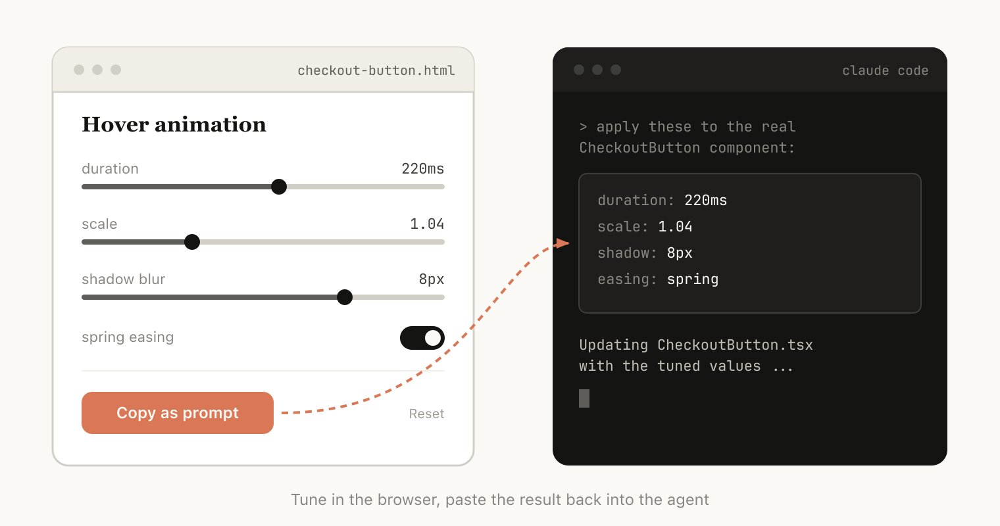
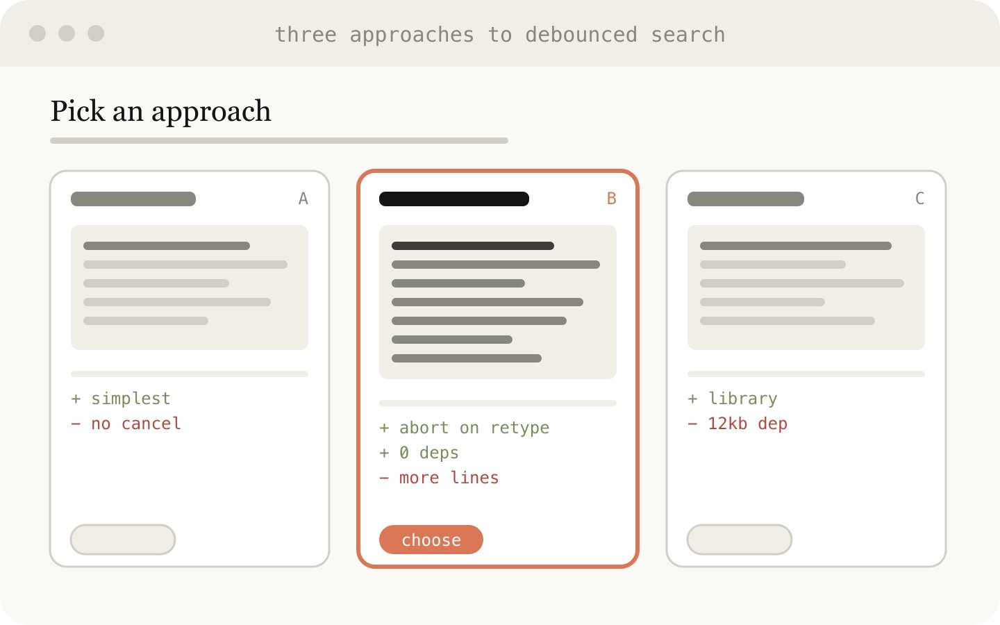
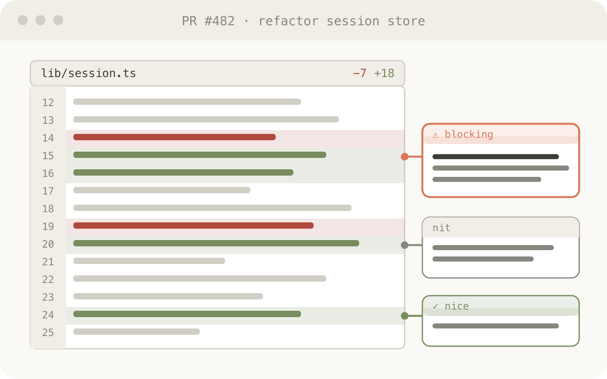
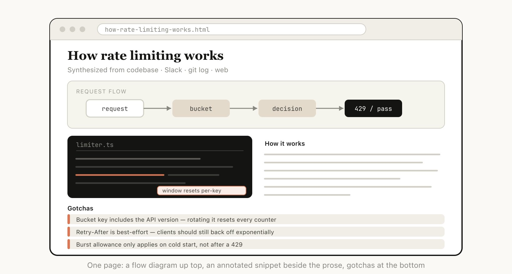

Markdown 已成为智能体与我们沟通的主要文件格式。它简单、可移植、有一定的富文本能力，而且易于编辑。Claude 甚至在使用 ASCII 在 markdown 文件中制作图表方面出奇地出色。

但随着智能体越来越强大，我越来越觉得 Markdown 已经成为一种限制格式。我发现很难阅读超过 100 行的 markdown 文件。我想要更丰富的可视化、颜色和图表，而且我希望能够轻松分享它们。

我也越来越多地不再自己编辑这些文件，而是将它们用作规格说明、参考文件、脑力激荡输出等。当我进行编辑时，我通常会提示 Claude 来编辑它们，这消除了 Markdown 最大的好处之一。

我开始更喜欢 HTML 作为输出格式，而不是 Markdown，而且越来越多地看到 Claude Code 团队的其他人也在使用它，这就是原因。

（如果你想从一些例子开始，你可以在这里看到很多：[https://thariqs.github.io/html-effectiveness](https://thariqs.github.io/html-effectiveness/)，一定要回来继续阅读更多关于为什么的内容）

# 为什么是 HTML？

## 信息密度

与 markdown 相比，HTML 可以传达更丰富的信息。它当然可以做简单的文档结构，如标题和格式，但也可以表示其他各种信息，例如：

- 使用表格的表格数据
- 使用 CSS 的设计数据
- 使用 SVG 的插图
- 使用 script 标签的代码片段
- 使用 javascript + CSS 的 HTML 元素进行交互
- 使用 SVG 和 HTML 的工作流
- 使用绝对位置和画布的空间数据
- 使用 image 标签的图片

我甚至可以说，几乎 Claude 能读取的任何信息集，你都可以相当高效地用 HTML 来表示。这使得模型与我深入沟通信息成为一种高度有效的方式。

我发现，在无法做到这一点的情况下，模型可能会在 markdown 中做更多低效的事情，比如 ASCII 图，或者我最喜欢的，用 unicode 字符估计颜色，就像这张来自 Claude Code 的截图一样。

Claude Code 尝试在 markdown 中显示颜色

## 视觉清晰度和易读性

随着 Claude 能够做更复杂的工作，它也在编写越来越大越来越长的规格说明和计划。在实践中，我发现我实际上不会阅读超过 100 行的 markdown 文件，我当然也无法让组织中的其他人阅读它。

但 HTML 文档更容易阅读，Claude 可以通过标签、插图、链接等以理想的导航方式组织结构。它甚至可以是移动响应的，所以你可以根据你的形态因素不同地阅读。

## 分享的便捷性

Markdown 文件相当难以分享，因为大多数浏览器不能很好地本地渲染它们。你经常必须将它们作为附件添加到电子邮件或消息中。

使用 HTML，只要你上传文件（例如到 S3），你就可以轻松分享链接。你的同事可以在他们任何想去的地方打开它并轻松参考。

如果它是 HTML 格式的某人实际阅读你的规格说明、报告或 PR 撰写内容的可能性要高得多。

## 双向交互

HTML 允许你与文档交互，例如你可能想要求它添加滑块或旋钮来调整设计，或者允许你调整算法中的不同选项来查看会发生什么。你也可以要求它让你将这些更改复制到提示中，以便粘贴回 Claude Code。阅读更多关于我的 playgrounds 文章以查看这种双向交互的示例：[https://x.com/trq212/status/2017024445244924382](https://x.com/trq212/status/2017024445244924382)

**数据摄取**

为什么使用 Claude Code 来制作 HTML 文件而不是 Claude AI 或 Claude Design 例如？最大的原因之一是 Claude Code 可以摄取的上下文。例如，在写这篇文章时，我要求 Claude Code 阅读我的代码文件夹并找到我生成的所有 HTML 文件，对它们进行分组和分类，然后制作一个包含每种类型的图表的 HTML 文件。你在本文中看到的图表就是直接的结果。

除了文件系统，Claude Code 还可以使用你的 MCP（如 Slack、Linear 等）、你的网络浏览器（带有 Chrome 中的 Claude）、你的 git 历史记录等来找到额外的上下文。

## 它是快乐的

用 Claude 制作 HTML 文档只是更有趣，让我感到更加参与和投入到创作中，这本身就足够了。

## 如何开始

我有点担心人们会读这篇文章然后把它变成一个 /html 技能或其他什么。虽然这可能有一些价值，但我想强调你不需要做太多来让 Claude 做这件事。你可以直接要求它"制作一个 HTML 文件"或"制作一个 HTML 工件"。

技巧是知道你想要工件做什么以及你如何使用它。随着时间的推移，你可能会创建一个技能，但现在我建议只是从头开始提示，以获得如何在不同情况下使用它的诀窍。

# 用例

为了让这更具体，我为不同的用例制作了许多不同的 HTML 文件。你可以在这里查看所有：[https://thariqs.github.io/html-effectiveness/](https://thariqs.github.io/html-effectiveness/) 但这里是一个概述。

## 规格说明、计划和探索

HTML 是 Claude 深入研究问题的丰富画布。当我开始处理一个问题时，而不是简单的 markdown 计划，我希望制作一个 HTML 文件网络。例如，我可能首先要求 Claude Code 进行头脑风暴并创建一些不同选项的探索。然后我会要求它更深入地扩展一个，可能制作模型或代码片段。最后，当我感觉良好时，我会要求它写一个实施计划。当我对计划满意时，我会创建一个新会话并传入所有这些文件供它实现。

在验证时，我还会要求验证代理读取文件，它将对需要的内容有更广泛的上下文。

**示例提示：**

- 我不确定onboarding屏幕应该采用什么方向。生成 6 种截然不同的方法——改变布局、语气和密度——并将它们作为一个 HTML 文件并排排列，以便我可以比较。标注每个方法所做的权衡。
- 在 HTML 文件中创建一个详细的实施计划，一定要制作一些模型，显示数据流并添加我可能想要查看的重要代码片段。让它易于阅读和理解。

**用例：**

- 探索代码中实现其他方式
- 探索多种视觉设计

## 代码审查和理解

代码在 Markdown 文件中可能很难阅读。但使用 HTML，我们可以渲染 diff、注释、流程图、模块等。使用它来理解智能体编写的代码，获得代码审查或向审查你的代码的人解释 PR。我发现这通常比默认的 Github diff 视图效果更好，我现在每个 PR 都附上一个 HTML 代码解释器。

**示例提示：**

帮我通过创建一个描述它的 HTML 工件来审查这个 PR。我对流式/背压逻辑不太熟悉，所以专注于那个。使用内联边距注释渲染实际 diff，按严重程度对发现进行颜色编码，以及传达概念所需的任何其他内容。

**用例：**

- 创建一个 PR
- 审查一个 PR
- 理解代码中的主题

## 设计和原型

Claude Design 基于 HTML，因为 HTML 在设计上令人难以置信地富有表现力，即使你的最终表面不是 HTML。Claude 可以在 HTML 中勾勒出设计，然后用你选择的语言编写它，无论是 React、Swift 等。

你也可以原型化交互，比如动画、动作等。考虑要求 Claude 制作滑块、旋钮等来准确调整你正在寻找的内容。

**示例提示：**

我想为一个新的结账按钮制作原型，点击时它会执行播放动画然后快速变成紫色。创建一个 HTML 文件，其中有多个滑块和选项供我尝试这个动画的不同选项，给我一个复制按钮来复制效果好的参数。

**用于：**

- 构建设计系统工件
- 调整组件
- 可视化组件库
- 原型化快乐动画

## 报告、研究和学习

Claude Code 在跨多个数据源综合信息并将其转换为可读性报告方面非常出色。你可以提示 Claude 搜索你的 Slack、你的代码库、git 历史记录、互联网等，并用它为自己、为领导层、为你的团队等生成极具可读性的报告。

你可以将其组装成一个长的 HTML 文档、一个交互式解释器，甚至是一个幻灯片/甲板。要求 Claude 使用 SVG 来制作图表以帮助可视化。例如，在我关于提示缓存的帖子中，我要求 Claude 为我准备一份关于我在阅读 git 历史记录后对提示缓存的所有更改的深入研究 HTML 文件供我阅读。

**示例提示：** 我不理解我们的速率限制器实际是如何工作的。阅读相关代码并生成一个单一的 HTML 解释页面：一个令牌桶流的图表，3-4 个关键代码片段带注释，以及底部的一个"陷阱"部分。为只读一次的人优化。

**用于：**

- 总结功能的工作方式
- 向我解释一个概念
- 每周状态报告给你的老板
- 给领导的事故报告
- SVG 插图、流程图、技术图表等

# 自定义编辑界面

有时候纯粹用文本框来描述你想要什么是很困难的。在这种情况下，我会要求 Claude 为我正在处理的精确内容构建一个一次性的编辑器。不是产品，也不是可重用的工具，而是一个单一的 HTML 文件，专门为这一块数据构建。

技巧是始终以导出结束：一个"复制为 JSON"或"复制为提示"按钮，将我在 UI 中所做的任何事情转换为我可以粘贴到 Claude Code 中的内容。

**示例提示：**

- 我需要重新优先排序这 30 张 Linear 工单。为我制作一个 HTML 文件，每张工单作为一个可拖动的卡片跨越 Now / Next / Later / Cut 列。按你的最佳猜测预先排序。添加一个"复制为 markdown"按钮，导出每个桶带一行理由的最终排序。
- 这是我们的功能标志配置。为它构建一个基于表单的编辑器，按区域对标志进行分组，显示它们之间的依赖关系，如果我启用一个先决条件关闭的标志则警告我。添加一个"复制 diff"按钮，只给我更改的键。
- 我正在调优这个系统提示。制作一个并排编辑器：左边是可编辑的提示，突出显示变量槽，右边是三个示例输入，实时渲染填充的模板。添加一个字符/令牌计数器和一个复制按钮。

**用于：**

- 重新排序、分拣或分桶任何东西（工单、测试用例、反馈）
- 编辑带约束的结构化配置（功能标志、环境变量、JSON/YAML）
- 调优提示、模板或复制与实时预览
- 管理数据集，批准/拒绝行，标记示例，导出选择
- 注释文档、转录本或 diff 并导出注释
- 选择在文本中痛苦表达的价值观：颜色、缓动曲线、裁剪区域、cron 计划、正则表达式。

## 常见问题

我一直在告诉很多人我已经转向 HTML 的事情，我看到了一些重复的问题。

**它的 token 效率不是更低吗？** 虽然 markdown 通常使用更少的 token，但我发现 HTML 更强的表现力和我阅读它的可能性要高得多，这意味着我整体获得了更好的输出。有了 Opus 4.7 中的 1MM 上下文窗口，增加的 token 使用量在上下文窗口中真的不明显。

**你现在什么时候使用 markdown？** 老实说，我几乎已经停止使用 markdown 做所有事情，但我可能是 HTML 最大化主义者的极端一方。

**我如何查看 HTML 文件？** 我倾向于只在本地浏览器中打开它（你可以要求 Claude 打开它），或者上传到 S3 如果你想要一个可共享的链接。

**这不会比生成 markdown 更花时间吗？** 这确实花更长时间！HTML 可能需要 2-4 倍于 Markdown 的时间，但我发现结果是值得的。

**版本控制呢？** 这实际上是 HTML 最大的缺点之一，HTML diff 是嘈杂的，与 Markdown 相比很难审查。

**我如何让 Claude 匹配我的品味/不把它做丑？** 前端设计插件帮助 Claude 制作好的 HTML 文件。但要匹配你自己的公司风格，你可以通过指向 Claude 你的代码库来创建一个单一的设计系统 HTML 文件。然后你可以将那个设计系统文件用作其他 html 文件的参考。

## 保持联系

上述这一切就是说，我认为我使用 HTML 的真正原因是与 Claude 在一起时我感到更加处于循环中。我开始害怕，因为我已经停止深入阅读计划，我将不得不让 Claude 做出选择。

但我很高兴地说，实际上在使用 HTML 时，我感到比以往任何时候都更处于循环中。我希望你也一样。

---

> 原文地址：<a href="https://x.com/trq212/status/2052809885763747935">https://x.com/trq212/status/2052809885763747935</a>
