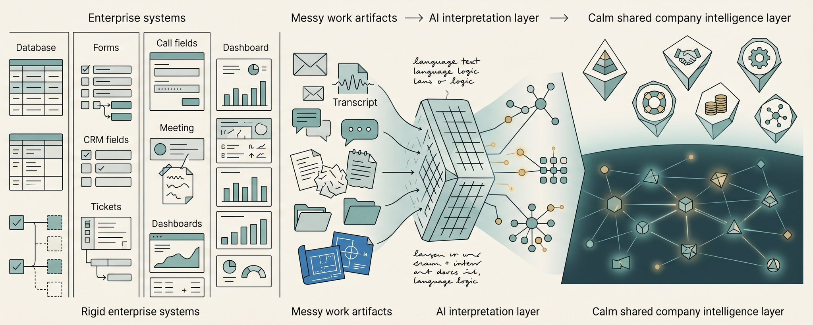

企业软件始终围绕一个承诺展开：告诉我什么是真实的。**系统记录（System of Record）** 是企业用来作为某一类业务数据权威来源的应用程序——客户、员工、产品、供应商、财务记录，或业务的某个切片。这个定义听起来枯燥，但它恰恰解释了企业软件为何变得如此碎片化。公司需要一个地方，让某个职能部门可以说：**这是官方版本**。

原因很简单。工作并非以软件可理解的形式到达。它以客户电话、投诉邮件、定价讨论、路线图会议、合同、支持线程、Slack 消息和无数个对话中的小决定的形式到来。非结构化数据没有预定义的格式或架构，很长一段时间内，其数量庞大且格式不统一，很难在常规业务软件中使用。

因此，人类将现实翻译成了字段。销售人员将一次对话转化为商机阶段、成交日期、下一步行动和预测类别。CRM 的建立正是为了管理客户互动——包括销售电话、服务互动、营销邮件、通话记录、购买历史和服务问题。产品团队将混乱的反馈转化为工单和优先级。支持团队将不满转化为严重程度、复发率和解决路径。

这是必要的。但同时也是有损的。**CRM 记录不是客户本人。工单不是项目。支持案例不是投诉。仪表盘不是公司。记录从来就不是现实本身，而是某个职能部门可用的现实版本。**

## 为什么记录变得碎片化

一封投诉邮件可以包含多个真相。对销售而言，这可能是续约风险。对客户成功团队而言，这可能是升级事件。对产品经理而言，这可能是路线图信号。对副总裁而言，这可能是某个运营流程正在崩溃的证据。邮件是相同的，事实也是相同的。但有用的真相因观看者的不同而变化。

这是人们在谈论"取代系统记录"时经常忽略的一点。碎片化不仅仅是供应商泛滥的结果，它源于真实的需求。销售、支持、产品、财务、法务和管理层各自需要为同一份底层工作提供不同的结构。

销售需要客户、利益相关者、阶段和承诺。支持需要严重程度、客户影响和解决路径。产品需要信号、回归、发布阻塞项和权衡。财务需要审批、周期和义务。每个系统记录都为某个职能部门提供了一个可用的本体论。

但公司本身并不存在于单一的本体论中。一次客户投诉可能演变为支持工单、续约风险、路线图变更、法务问题和管理层议题。但记录这些事情的系统通常将记忆分割开来。即使每个工具都在履行其职责，公司整体仍然感到支离破碎。

## 弱化版本

AI 正在改变这一架构底层的前提。软件不再只能依赖人类将混乱的工作翻译为字段。模型可以阅读投诉邮件、电话录音、Slack 线程、支持工单、CRM 备注、路线图文档和会议摘要。基础模型如今可以帮助解读非结构化数据，尽管这些数据仍然需要治理、分类、过滤、质量检查和去重。

这就是人们开始谈论**智能系统（Systems of Intelligence）**的原因。Alteryx 将它们描述为建立在系统记录之上的洞察层，Intuit 则将其描述为数据所在与工作发生之间的层。我喜欢这个说法，但通常的定义过于薄弱。

智能系统不应该仅仅坐在记录之上。它应该维护一个**公司现实的活的、结构化表示**：实体、关系、承诺、决策、来源、矛盾、权限和结果。多个本体论应该能够从这个状态中读取，而无需分割底层真相。这就是我所说的**公司大脑（Company Brain）**。

这与 CRM 中的副驾驶、支持系统中的摘要按钮、或项目文档上的聊天框不同。这些功能很有用，但它们保持了旧的重心不变。系统记录仍然是真相应该存在的地方，而 AI 变成了帮助更新它的助手。

## 公司大脑

公司大脑不是存储。存储持有事物本身。智能系统需要知道事物是什么以及为什么重要。这就是语义学与本体论之间的区别。

**语义学**告诉系统某物是什么。例如：这是一起关于可靠性的客户投诉。它提到了一个生产事故、一个受影响的账户、一个续约日期和支持承诺的变通方案。

**本体论**告诉系统从某个视角来看这为什么重要。对销售而言，这起投诉增加了大客户的续约风险。对产品而言，这是自 v2.3 以来的第三次同类回归。对管理层而言，这暗示了"行业领先的可靠性"定位与客户实际体验之间的差距。同一份工件可以通过多个有效视角来解读，而无需假装只有一种有用的真相。

这正是系统记录所苦苦挣扎的地方。它们通过为不同职能部门创建独立工具来保留视角。这帮助了每个职能部门的运作，但让整个公司更难被理解。智能系统应该在同一个共享基底上保留视角：**一个真相，多种视角**。

还有一个我预见到的错误：将模型本身当作大脑。将公司大脑想象成一个持续学习公司的大型模型，这种想法很诱人。我理解人们为什么想要这样。这听起来像是公司变成了一个持续自我更新的活模型。

但我认为这不是正确的架构。**将模型当作大脑，就像把 RAM 当作永久存储。** 在断电、上下文变化或有人需要检查答案为何改变之前，它看起来都有效。LLM 可以在上下文上进行推理、生成语言、提取结构和连接想法，但持久的公司真相需要一个可以被检查、纠正、版本化、授权和评估的状态层。

在用途上也存在错配。模型被训练为生成有用的上下文延续。公司状态有不同的任务：将正确的真相提供给正在扮演相应角色的正确人员或智能体。产品经理、销售人员、支持负责人、律师、副总裁和智能体不应该都接收到同一份工件的相同解读。

**推理与状态应当分离。** LLM 负责推理。公司大脑持有结构化状态。当两者配对时，模型可以针对公司的当前现实进行推理，而不是从被粘贴到 prompt 中的上下文临时拼凑。

## 会发生什么变化

这正是今天的系统记录将面临困难的地方。每个系统记录都在试图将 AI 附加到自身上，这是有道理的，因为 CRM、支持工具、项目管理工具、HR 系统和财务系统都拥有有价值的数据。但将 AI 添加到系统记录并不自动创造出智能系统。

大多数时候，AI 变成了现有产品形态中的一个速记员。它总结通话、填写字段、起草跟进内容、更新工单，或回答关于记录的问题。记录仍然是中心，AI 帮助填充它。但一个令人不安的问题是：当 AI 可以直接理解工作时，相同的记录结构是否仍然是正确的重心？

如果公司大脑已经从电话、邮件、支持问题、产品需求、合同条款和行动记录中了解了客户状态，那么 CRM 字段也许就没那么重要了。如果公司大脑已经知道了决策历史、负责人、依赖关系和客户后果，那么工单也许就没那么重要了。如果公司大脑能够在指标变动之前就揭示战略与执行之间的差距，那么仪表盘也许就没那么重要了。

一旦共享状态存在，产品体验就会发生变化。销售人员打开页面时看到的续约风险不再仅仅是"低参与度"，而是一个从未变成实际工作的支持承诺。产品经理看到三个看似无关的工单实际上是同一个可靠性回归。CEO 看到一项战略举措正在漂移，因为运营工作已经不再与管理层决策匹配。

一个显而易见的反对意见是：这可能会造成更大的数据混乱。如果系统仅仅是另一堆 AI 生成的摘要，确实会如此。公司大脑必须在基底层面进行治理：来源追溯、权限控制、质量检查、去重、访问控制和来源检验。这不是合规表演，而是让人们信任智能层并据此行动的前提。

系统记录不会一夜之间消失。企业不是那样运作的。它们将继续作为数据源、交易日志、合规工件和行动落地的地方。但它们将不再是智能的主要栖居之处。

下一个架构不是叫"公司大脑"的单一巨型应用来取代所有工具。那将以一种新形式重复同样的错误。公司大脑应该是**基础设施**。应用层位于其之上。CEO 界面、管理者界面、产品规划工具、支持人员、销售人员和财务工作流都可以使用相同的底层公司状态，各自通过自己的本体论和权限来访问。

这就是系统记录如何演变为智能系统的方式。旧系统成为数据源和行动落地的地方。智能则进入理解跨工具工作的共享层。

系统记录捕获了人们在软件中输入了什么。智能系统将理解公司实际上在做什么。**公司大脑是桥梁，也是新的基石。**

**来源：**

1. IBM，"什么是系统记录？" [https://www.ibm.com/think/topics/system-of-record](https://www.ibm.com/think/topics/system-of-record)
2. IBM，"什么是非结构化数据？" [https://www.ibm.com/think/topics/unstructured-data](https://www.ibm.com/think/topics/unstructured-data)
3. Salesforce，"什么是 CRM？" [https://www.salesforce.com/crm/what-is-crm/](https://www.salesforce.com/crm/what-is-crm/)
4. IBM，"AI 与非结构化数据的未来。" [https://www.ibm.com/think/insights/unstructured-data-trends](https://www.ibm.com/think/insights/unstructured-data-trends)
5. Alteryx，"什么是智能系统？" [https://www.alteryx.com/glossary/systems-of-intelligence/](https://www.alteryx.com/glossary/systems-of-intelligence/) 以及 Intuit，"理解智能系统。" [https://www.intuit.com/blog/innovative-thinking/systems-of-intelligence/](https://www.intuit.com/blog/innovative-thinking/systems-of-intelligence/)

在 [Sentra](https://www.sentra.app/)，我们正在构建一个只能被称为"公司大脑"的产品——一个共享的智能/记忆层，坐落于所有沟通渠道、知识库、行动和智能体轨迹之上，以理解组织中的每个人实际如何工作，以及工作实际上如何完成，构建整个公司的活世界模型，近乎实时。

---

> 原文地址：<a href="https://x.com/ashwingop/status/2053173547393331318">https://x.com/ashwingop/status/2053173547393331318</a>