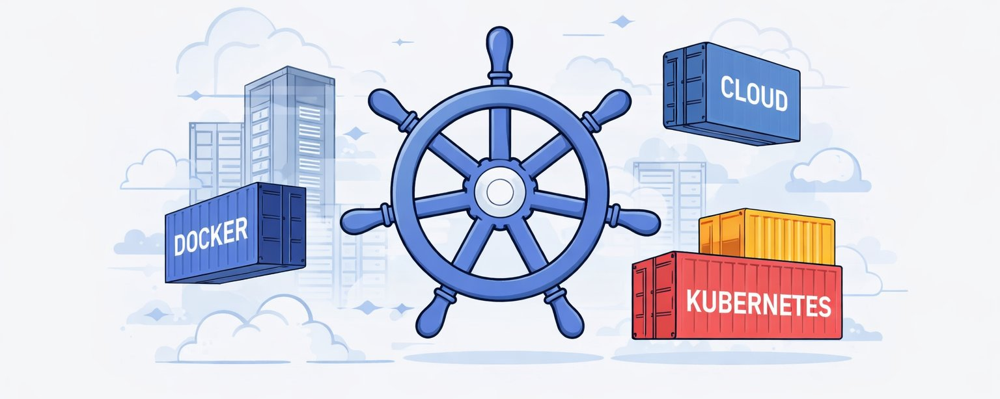

**容器编排的可视化之旅**

Kubernetes 初次接触时往往令人望而生畏——并非因为它设计得不好，而是因为大多数讲解直接跳到了 YAML 和命令行。

本文采用**可视化 + 概念化**的方法，灵感来自 **Tech Fusionist** 出品的"Kubernetes 可视化指南"，旨在解释 **Kubernetes 为何存在、内部如何运作、以及所有核心组件如何协同配合**。

如果你理解了其中的**心智模型**，Kubernetes 就会变得清晰——甚至优雅。

---

## 1. 容器革命：我们是如何走到今天的？

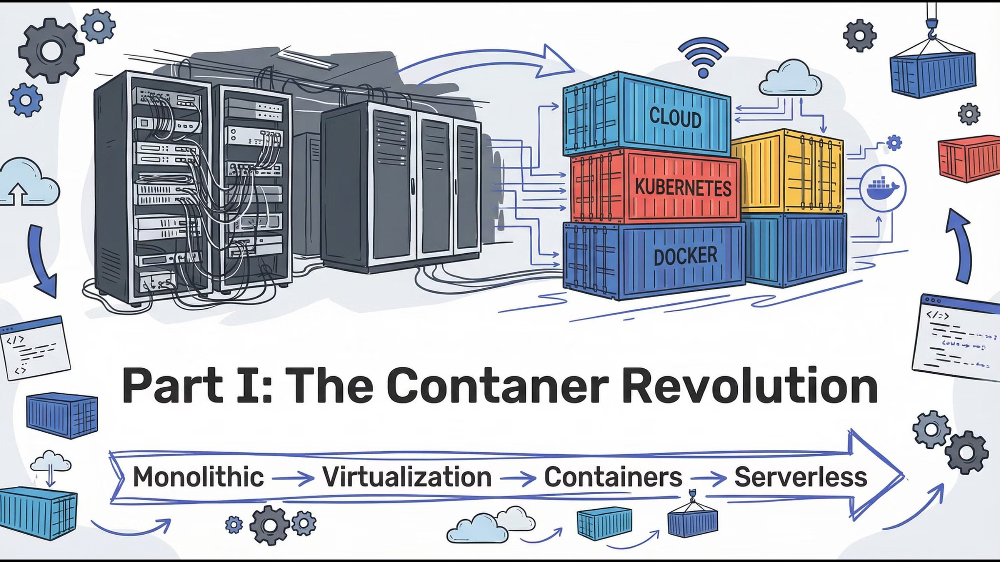

现代应用部署经历了几个明确的阶段：

**单体架构 → 虚拟机 → 容器 → 编排**

每个阶段都解决了一个重大问题，但也带来了新的问题。容器最终为我们带来了速度、可移植性和一致性——但在大规模管理它们时，又带来了新的挑战。

**核心洞见：**

> 容器解决了打包问题。Kubernetes 解决了运维问题。

---

## 2. 容器之前：部署混乱

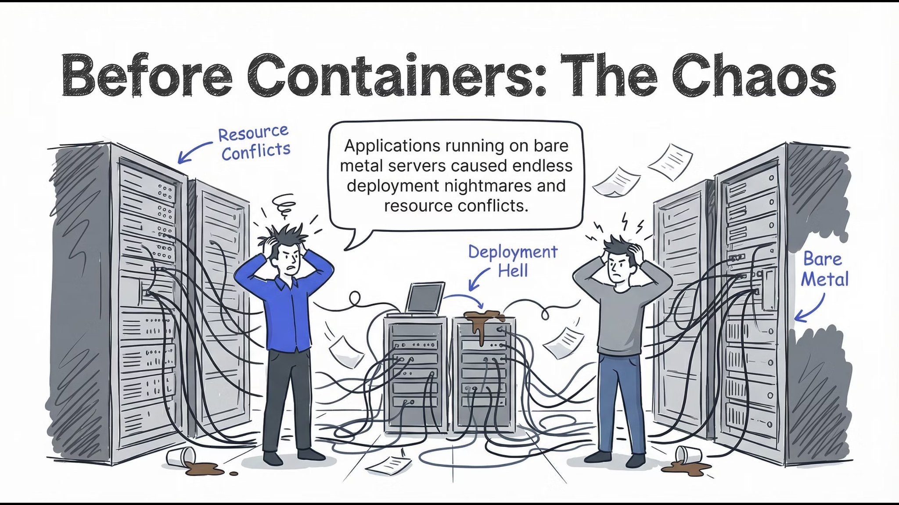

直接在服务器上运行应用导致了：

- 资源冲突
- 环境不一致
- 部署失败
- 扩展噩梦

每次发布都像一场赌博。稳定性取决于运气，而非设计。

**教训：**

> 没有隔离的基础设施永远无法干净地扩展。

---

## 3. 单体架构的问题

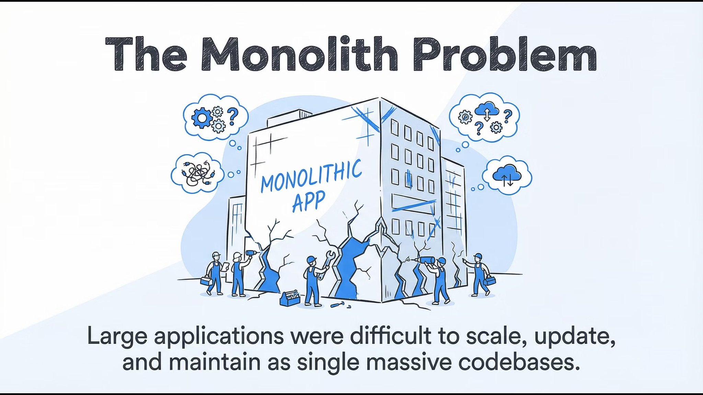

传统的单体应用：

- 庞大且紧密耦合
- 难以独立扩展
- 更新风险极高
- 维护成本高昂

一个 Bug 就可能让整个系统瘫痪。

**教训：**

> 大型代码库不会快速失败——它们会以高昂代价失败。

---

## 4. 虚拟机：第一个真正的解决方案

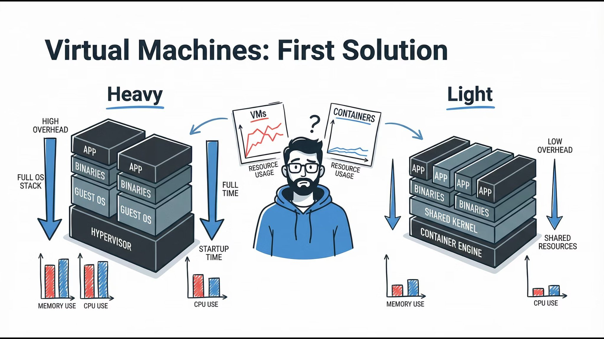

虚拟机提供了隔离和稳定性，但代价是：

- 沉重的操作系统开销
- 缓慢的启动时间
- 低效的资源利用

它们功能强大，但不够敏捷。

**教训：**

> 虚拟机带来了隔离，却没有带来速度。

---

## 5. Docker 改变了一切

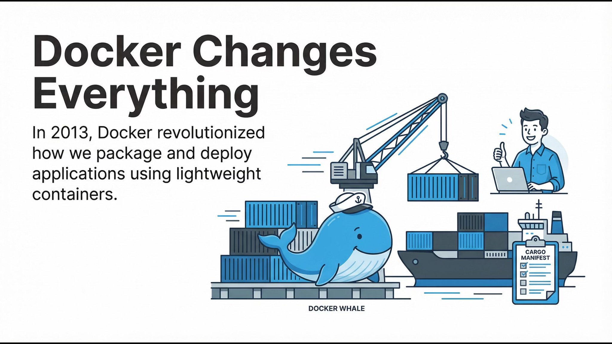

Docker 通过引入以下特性彻底改变了应用交付方式：

- 轻量级容器
- 快速启动
- 应用与依赖打包在一起

开发者终于实现了真正的环境一致性。

**教训：**

> "在我机器上能跑"不再是一个借口。

---

## 6. 容器虽好……但规模是个问题

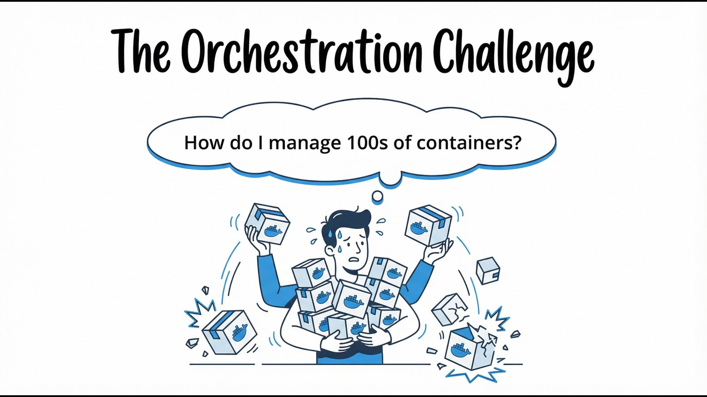

容器解决了打包问题——但在大规模场景下，团队开始追问：

- 如何自动扩展容器？
- 容器崩溃了怎么办？
- 如何管理网络？
- 如何实现零停机部署？

这就是 Kubernetes 登场的地方。

**教训：**

> 容器需要一个指挥家。

---

## 7. 登场：Kubernetes——容器的指挥家

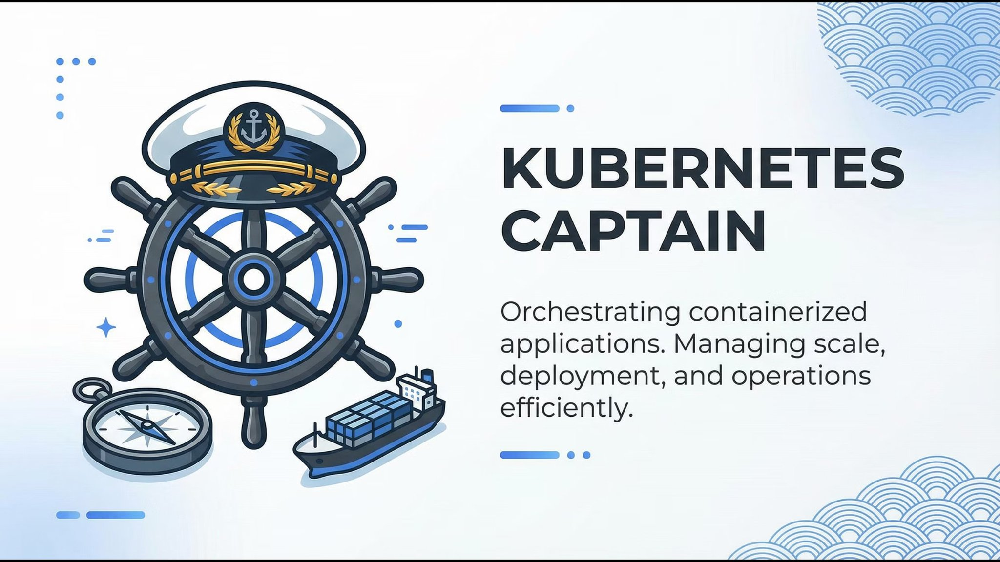

Kubernetes 是一个**容器编排平台**，负责管理：

- 部署
- 扩缩容
- 网络
- 自愈
- 配置

它不替代 Docker——它**跨基础设施协调容器**。

**心智模型：**

> Kubernetes 是分布式应用的"操作系统"。

---

## 8. Kubernetes 真正承诺了什么？

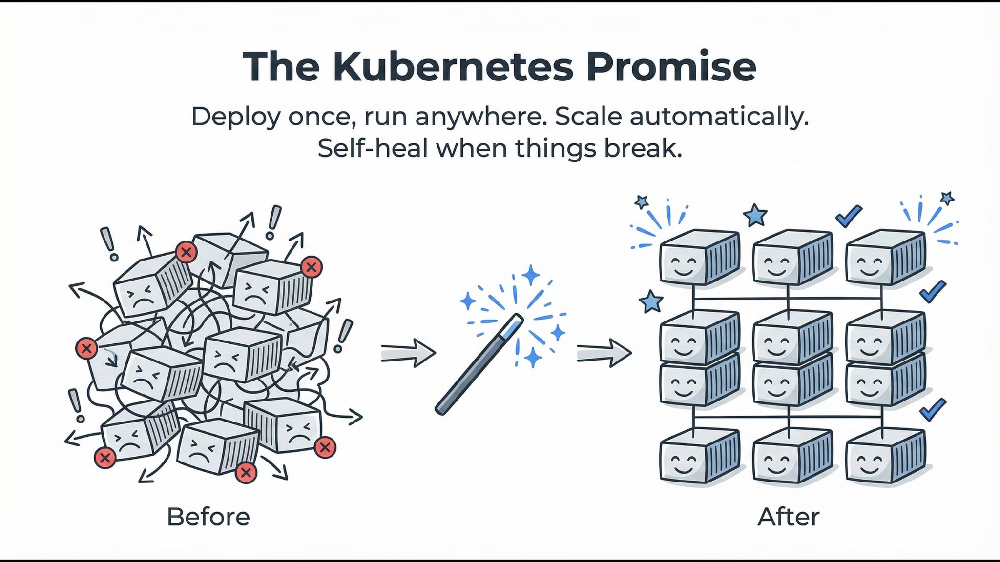

Kubernetes 兑现四项核心承诺：

- 一次部署，随处运行
- 自动扩缩容
- 工作负载自愈
- 声明式配置

你描述**期望状态**，Kubernetes 持续工作以维持它。

**教训：**

> 你声明意图，Kubernetes 执行落地。

---

# Kubernetes 架构：控制平面与工作节点（它是如何运作的？）

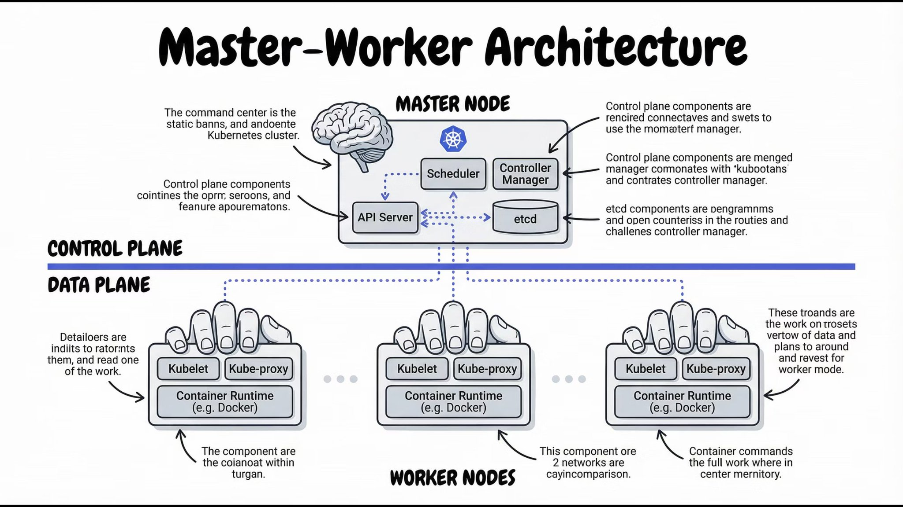

从高层次来看，Kubernetes 集群分为两大部分：

- **控制平面（Control Plane）**——负责做决策
- **工作节点（Worker Nodes）**——负责运行应用

这种分离正是 Kubernetes 能够扩展和自愈的原因。

---

## 9. 控制平面内部（Kubernetes 如何思考）

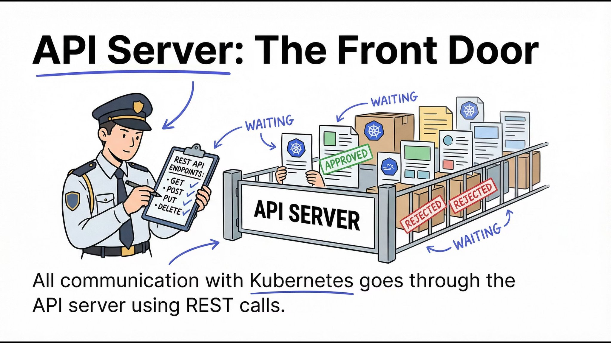

控制平面负责：

- 接收请求
- 做出调度决策
- 跟踪集群状态
- 确保期望状态 = 实际状态

它不运行容器——它**控制一切**。

---

## 10. API 服务器：唯一入口

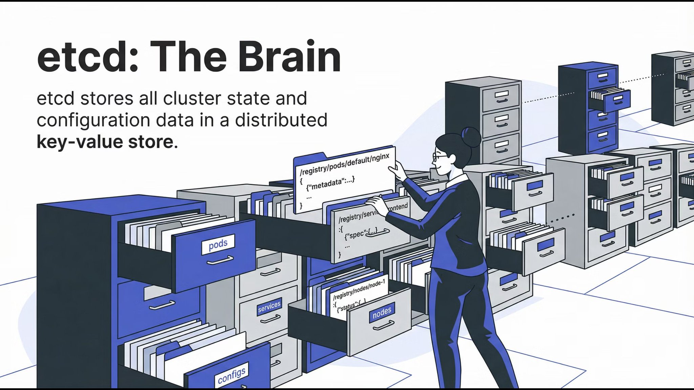

API 服务器是集群的**唯一入口**。

- 所有 `kubectl` 命令都通过它
- 所有组件通过它通信
- 它负责验证、认证和授权请求

**心智模型：**

> 没有 API 服务器，就没有 Kubernetes。

---

## 11. etcd：集群的大脑

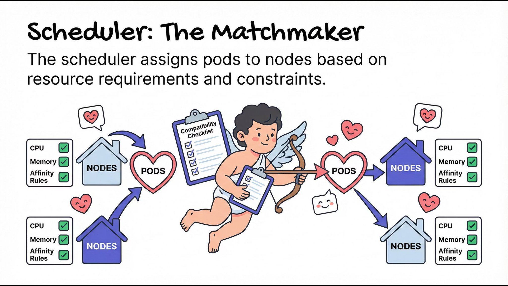

etcd 是一个**分布式键值存储**，保存着：

- 集群配置
- 期望状态
- 当前状态

它是 Kubernetes 的**唯一事实来源**。

**心智模型：**

> 不在 etcd 里的，就不存在。

---

## 12. 调度器：最佳匹配者

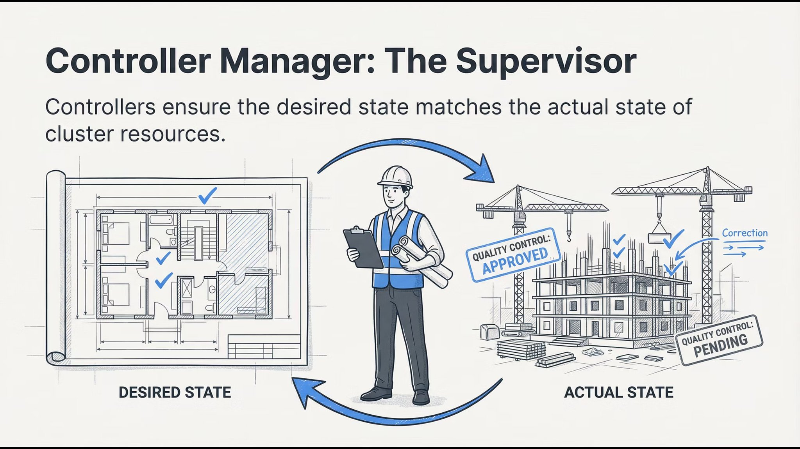

调度器根据以下因素决定 **Pod 应该运行在哪里**：

- CPU 和内存需求
- 节点可用性
- 亲和性与约束条件

它不启动容器——它只将 Pod 分配给节点。

**心智模型：**

> 正确的工作负载，正确的节点，正确的时间。

---

## 13. 控制器管理器：监管者

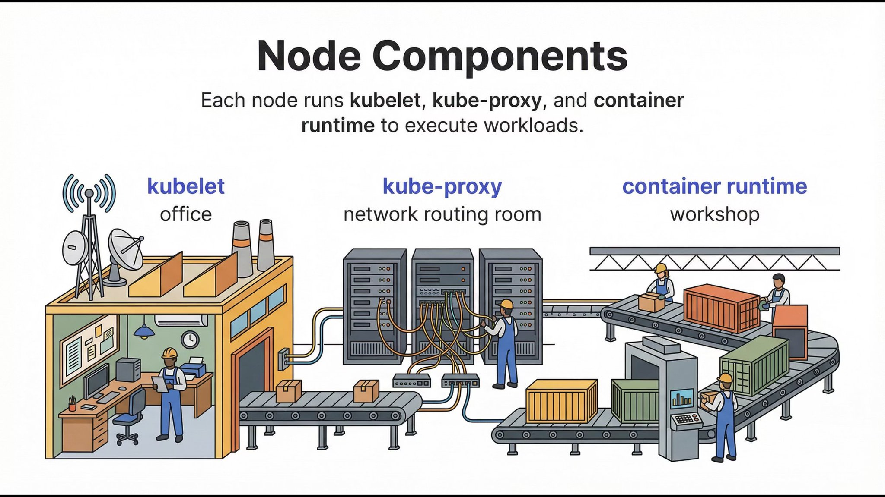

控制器持续对比：

- **期望状态**（你想要什么）
- **实际状态**（当前存在什么）

一旦出现偏差，控制器会自动修复。

**心智模型：**

> Kubernetes 永远不会停止自我检查。

---

# 工作节点：应用实际运行的地方

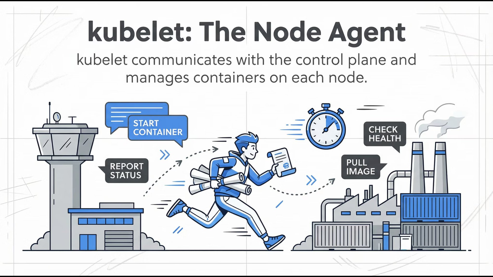

决策一旦做出，**工作节点**负责执行。

你的应用就运行在这里。

---

## 14. Kubelet：节点管理者

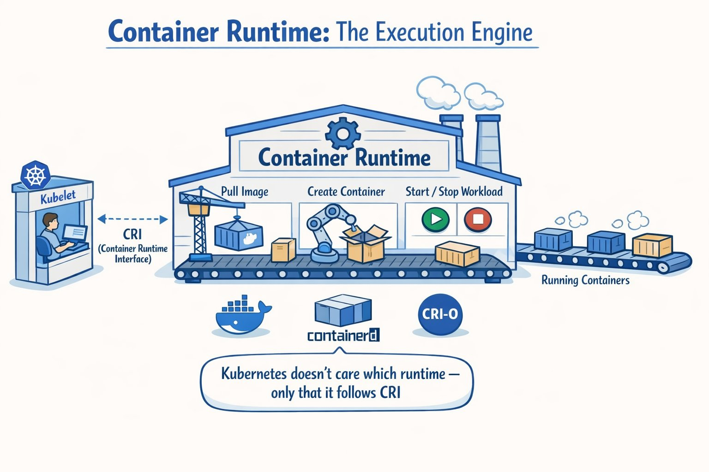

Kubelet 运行在每个工作节点上，负责：

- 向集群注册节点
- 监听 Pod 分配
- 确保容器正常运行
- 向控制平面报告健康状况

**心智模型：**

> 如果一个 Pod 应该在这里运行，Kubelet 会确保它确实在运行。

---

## 15. 容器运行时：执行引擎

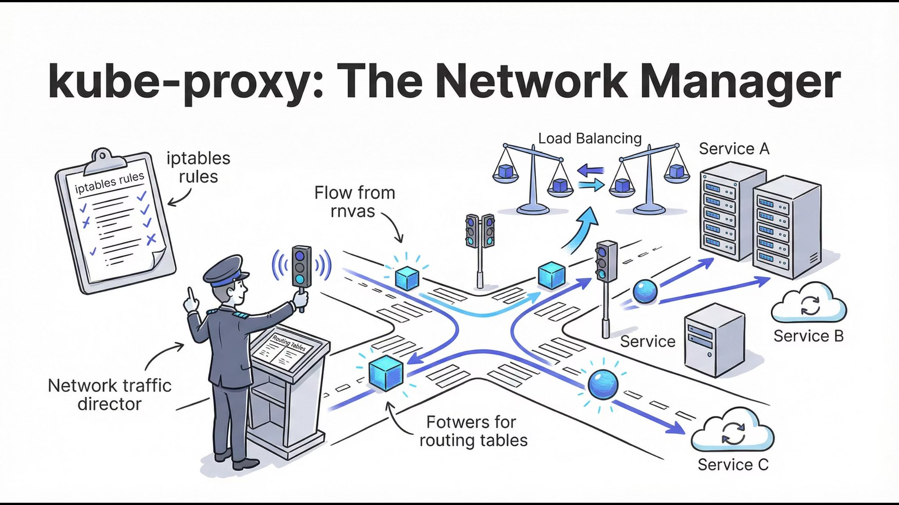

容器运行时负责：

- 拉取镜像
- 创建容器
- 启动和停止工作负载

Kubelet 通过**容器运行时接口（CRI）**与它通信。

**要点：**

> Kubernetes 不关心你使用哪个运行时——只要它遵循 CRI 规范。

---

## 16. kube-proxy：流量控制器

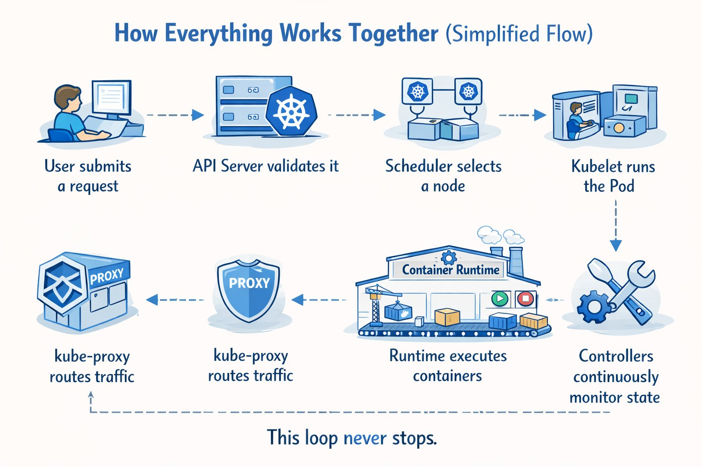

kube-proxy 管理集群内的**网络路由**：

- 服务 IP
- 负载均衡
- Pod 间通信

它确保即使 Pod 发生变化，服务仍然可达。

**心智模型：**

> Pod 是临时的，服务是稳定的。

---

# 一切如何协同工作（简化流程）

1. 用户提交请求
2. API 服务器验证请求
3. 调度器选择节点
4. Kubelet 运行 Pod
5. 运行时执行容器
6. kube-proxy 路由流量
7. 控制器持续监控状态

这个循环永不停歇。

---

# 为什么理解这些如此重要？

大多数真实的 Kubernetes 问题都源于：

- 对架构理解不足
- 心智模型薄弱
- 盲目使用 YAML

如果你理解 **Kubernetes 是如何思考的**，你就能：

- 更快地排查问题
- 设计更好的系统
- 在生产环境中自信运维

---

# 结语

Kubernetes 并不复杂——它是**分布式的**。

一旦你理解了：

- 容器为何存在
- 为什么需要编排
- 控制平面与节点如何交互

Kubernetes 就不再可怕，而是变得强大。

---

# 📘 完整的 Kubernetes 可视化指南

本文只是更大工程的一个**小预览**。

我准备了一份 **Kubernetes 完整可视化指南：从零到专家**，其中每个概念都以**可视化**方式、循序渐进地讲解——从容器到核心架构、工作负载、网络、扩缩容以及实际行为。

如果你更喜欢**清晰的图表**而非冗长的文档，完整指南已在 Gumroad 上架。

**👉** [Kubernetes 化繁为简。可视化。实用。](https://t3pacademy.gumroad.com/l/nneei/2wlq2sv)

本指南的不同之处在于：

这不是另一本**文字密集型**的 Kubernetes 书籍。

它是一套**以视觉为先的学习系统**，能够：

- 解释每个 Kubernetes 概念为何存在
- 以可视化方式展示组件如何交互
- 建立真正牢固的心智模型
- 帮助你自信地调试和设计系统

每个概念都配有**精心制作的信息图表**，而非大段文字。

👉 [在 Gumroad 上获取指南，提升你的 Kubernetes 理解——以可视化方式。](https://t3pacademy.gumroad.com/l/nneei/2wlq2sv)

**最后的话：** 如果这篇博客对你有所启发，想象一下拥有**每一个 Kubernetes 概念都被如此清晰地、从头到尾地讲解**的完整指南。

这正是完整指南所提供的一切。

祝编排愉快 🚢 — Tech Fusionist