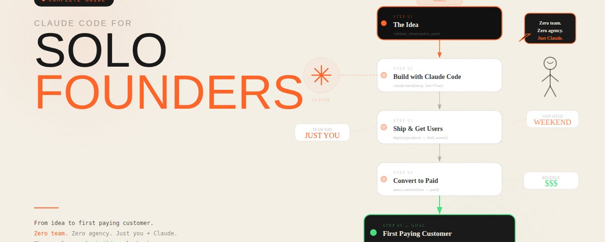

# Claude Code 独立创始人完全指南：从创意到第一个付费客户



大多数独立创始人花了六个月时间构建没人想要的东西。

不是因为他们不擅长构建。

而是因为他们优化了错误的东西。

他们把 80% 的时间花在代码上，20% 花在其他一切上。

在 2026 年，这个比例需要反过来。

Claude Code 已经让构建变成了最简单的部分。

困难的部分——也是真正决定你是否成功的部分——是代码之前和之后的一切。

创意验证。定位。能转化的落地页。前 10 个客户。告诉你下一步该构建什么的反馈循环。

本指南讲述的是如何使用 Claude Code 将独立创始人从创意到第一个付费客户的每个阶段压缩到一个曾经需要一年、现在只需 30 到 60 天的时间线中。

## 为什么独立创始人在 2026 年能赢

独立创始人的结构性优势从未如此之大。

六年前，独立创始人受到严重制约。

你可以构建产品，但需要设计师做前端。需要文案写落地页。需要增长人员做分发。需要运营人员处理行政开销。

每个技能缺口都需要学习或招聘。

学习需要几个月。招聘需要你可能没有的钱。

独立创始人总是在与团队对抗。

Claude Code 彻底改变了这个约束。

拥有 Claude Code 的独立创始人不需要学习前端设计就能交付出色的前端。他们描述想要什么，Claude Code 就构建什么。

他们不需要从零开始写文案。他们描述定位，Claude Code 就写出落地页。

他们不需要手动构建整个代码库。他们设计系统架构，Claude Code 就实现它。

独立创始人现在是导演，而不是专家。

你指挥。Claude Code 执行。

而指挥是构建中最高杠杆的技能，因为它需要 AI 无法复制的东西：品味、判断力和对你特定客户的理解。

## 第一阶段：在写一行代码之前验证创意

独立创始人最昂贵的错误是花六个月构建，然后发现没人想要他们构建的东西。

Claude Code 无法阻止这个错误。但 Claude Code 大幅加速了验证过程，让你在几天而不是几个月内发现真相。

**问题验证提示**

在写一行代码之前，运行这个提示：

> 我有一个商业创意：[用一段话描述你的创意]
>
> 扮演一个看过 10000 次路演的残酷风险投资人。你的工作不是鼓励。你的工作是找出这个创意失败的每一个原因。告诉我：
> 1. 这个创意不成功的三个最可能原因
> 2. 整个创意所依赖的可能错误的假设
> 3. 客户正在使用的我忽略的现有解决方案
> 4. 最有可能为此付费的客户群体
> 5. 这个创意最有机会成功的版本
>
> 具体一点。严厉一点。不要软化反馈。

仔细阅读输出。如果 Claude 识别出一个你无法立即用证据反驳的假设，那个假设需要在你构建任何东西之前进行测试。

**落地页测试**

验证需求最快的方式是在构建产品之前先构建一个落地页。

向 Claude Code 描述价值主张。告诉它客户是谁，他们有什么问题，你的解决方案做什么。要求它构建一个带有等候名单注册表单的完整落地页。

部署它。通过少量付费投放或在 X 上发布内容来引导流量。

如果你无法让 50 个人仅凭产品描述就给你电子邮件地址，那你要么没有解决真正的问题，要么描述方式有误。

两者都可以在你写一行产品代码之前修复。

**客户对话脚本**

在基于落地页注册决定创意是否有效之前，与 10 个注册的人交谈。

使用这个 Claude 提示来准备：

> 我正在为 [产品描述] 采访潜在客户。我关于他们问题的假设：[你的假设]
>
> 生成 10 个能揭示我的假设是否正确的问题，但不要引导受访者确认它。这些问题应该揭示：
> - 他们目前如何解决这个问题
> - 这个问题花了他们多少时间和金钱
> - 他们尝试过什么没用的方法
> - 完美的解决方案会是什么样子
> - 他们是否会为我的具体方法付费
>
> 永远不要问"你会使用这个产品吗"——这个问题会产生假阳性。问行为，而不是意图。

与 10 个真正的潜在客户对话，比在孤立中构建 6 个月更有价值。

## 第二阶段：一个周末构建 MVP

一旦验证完成，快速构建。

不是马虎的快。

是专注的快。只构建向第一个收费所需的东西。

**驱动一切的 CLAUDE.md**

整个项目中最重要的文件不是代码。

而是 CLAUDE.md。

在写第一个提示之前设置好：

```
# [项目名称] — CLAUDE.md

## 我们在构建什么
[用一句清晰的话描述产品]

## 客户
[具体描述目标客户和他们的问题]

## MVP 范围
[列出 MVP 需要做的事情。仅此而已。]

## 技术栈
[你选择的技术栈——保持简单]

## 不可妥协
- 每个功能必须服务于 MVP 范围。不允许范围蔓延。
- 只要生产就绪的代码。不需要之后需要修复的 hack。
- 每个新路由和组件必须有错误处理。
- 永远不要在没有加密的情况下存储敏感数据。

## 完成标准
[具体描述这个 MVP "完成"的样子]
```

MVP 范围是最重要的部分。写下来并用 Claude 严格执行。每次你想添加功能时问自己：这有助于我向第一个客户收费吗？如果答案是否定的，它就不在 MVP 中。

**周末构建时间表**

**周五晚上：架构和设置（2 小时）**

> 阅读我的 CLAUDE.md。根据描述的 MVP 范围，设计完整的应用架构。告诉我：
> - 完整的文件夹结构
> - 每个数据库表及其列
> - 每个 API 路由
> - 每个页面/组件
> - 正确的构建顺序
>
> 不要写任何代码。只给我架构。等我确认后再继续。

审查架构。提问。对任何对 MVP 来说似乎不必要的东西提出质疑。只在架构真正精简时才确认。

**周六上午：核心功能（4 小时）**

> 为 [你的主要用例] 构建核心用户流程。从以下开始：
> 1. 用户认证
> 2. [主要功能 1]
> 3. [主要功能 2]
>
> 按这个确切顺序构建。在进入下一个之前向我展示每个部分都能工作。不要添加上面未列出的任何东西。

**周六下午：数据库和集成（3 小时）**

> 按以下顺序添加集成：
> 1. [支付集成（如适用）]
> 2. [邮件（如适用）]
> 3. [任何其他关键集成]
>
> 对于每个集成：
> - 处理所有错误状态
> - 添加适当的日志记录
> - 测试正常路径和失败路径

**周六晚上：打磨和测试（2 小时）**

> 进行完整的生产就绪审查。检查：
> - 暴露的环境变量
> - 缺失的错误处理
> - 未处理的边界情况
> - 安全漏洞
> - 缺失的加载状态
>
> 列出发现的每个问题，按严重程度排序。现在修复所有关键问题。

**周日：落地页和部署（3 小时）**

落地页应该已经在验证阶段存在了。现在让它上线并连接到真正的产品。

> 为 [产品名称] 构建一个完整的落地页。
>
> 目标客户：[描述]
> 他们的问题：[描述]
> 我们的解决方案：[描述]
> 有效的证明：[描述任何证据]
> 价格：[你的价格]
>
> 包含：
> - 一个点明问题的标题
> - 三个具体的收益而非功能
> - 社会证明部分
> - 工作原理（3 步）
> - 带有明确 CTA 的定价
> - FAQ（5 个问题）
>
> 为需要被说服的怀疑者写这个。

到周日晚上，你有了一个可以工作的产品和一个上线的落地页。

这就是 MVP。

## 第三阶段：获取前 10 个付费客户

构建产品不是困难的部分。

获取前 10 个付费客户才是。

这也是大多数独立创始人停滞的地方，因为他们默认使用对零受众产品不起作用的策略。

在 X 上向 200 个粉丝发帖不起作用。

构建功能而不是销售不起作用。

以下是真正对第一批客户有效的三种方法。

**方法 1：直接外联法**

找出 50 个有你所解决问题的人。他们在你参与的社区中。他们在你的细分领域的 subreddits 中。他们在 X 上发帖抱怨他们的痛点。

使用这个提示来写外联消息：

> 为 [产品] 写冷外联消息，目标是 [描述客户]。
>
> 消息应该：
> - 以他们情况的具体细节开头
> - 用他们的语言点明他们的具体问题
> - 用一句话说明我们做什么
> - 问一个小问题来开始对话
>
> 不超过 75 个词。不要推销。第一条消息不要放链接。不要使用"希望这条消息找到你安好"或任何类似的开头。

发送 50 条消息。预计 5 到 10 条回复。预计从这些回复中获得 2 到 3 个客户。

重复直到你有 10 个客户。

**方法 2：社区专家法**

找到 3 个目标客户所在的社区。花 2 周回答问题并提供真正的价值，然后再提及你的产品。

当有人问你的产品能解决的问题时，免费完整地回答问题。然后在最后提到你构建了一个能自动完成这件事的人。

刚从你这里获得真正价值的人，尝试你产品的可能性比看到冷推销帖子的人高 10 倍。

**方法 3：公开构建法**

在 X 上发布你的构建过程。

不是推销帖子。是幕后内容。

你写的 CLAUDE.md 的截图。Claude Code 构建功能的短视频。你遇到的错误以及如何修复的。改变你构建方向的客户对话。

构建者吸引构建者。构建者成为他们尊重的构建者所构建产品的客户。

公开构建法需要更长时间才能产生收入，但能产生最持久的受众。

## 第四阶段：构建正确产品的反馈循环

你的前 10 个客户是你公司最有价值的资产。

不是他们的钱。是他们的反馈。

到达 100 个客户的产品总是与你为前 10 个客户构建的产品不同。这两个产品之间的差距完全由你从第一批客户那里学到的东西塑造。

**入职面试**

在注册后 48 小时内采访你的前 10 个客户中的每一个人。

> 我刚为 [产品] 获得了前 10 个客户。我需要采访每个人来了解：
> - 他们为什么真的注册了（通常与我认为的不同）
> - 他们希望实现什么
> - 入职过程中什么让他们困惑
> - 什么差点让他们没有注册
> - 他们会改变产品的什么
>
> 写出能揭示这些信息的 8 个问题。让问题感觉是对话式的，而不是临床式的。

通过视频进行这些面试。做笔记。在多次面试中寻找模式。

在 10 次面试中出现 5 次的洞察是一个产品决策。

在 10 次面试中出现 1 次的洞察可能是一个异常值。

**功能优先级系统**

在收集客户反馈后使用这个提示：

> 我有来自 [产品] 前 10 个客户的反馈。以下是他们告诉我的：
>
> [粘贴你的面试笔记]
>
> 扮演一个构建过 10 个成功产品的产品经理。告诉我：
> 1. 基于这些反馈我可以添加的最高杠杆功能
> 2. 客户请求但我不应该构建的功能及原因
> 3. 反馈揭示了谁是我真正的客户
> 4. 对现有产品会产生最大影响的改变
> 5. 基于这些反馈我应该停止做什么
>
> 具体一点。每个类别给我一个建议，而不是一个列表。

一个基于真实客户反馈添加的功能，抵得上 10 个基于创始人假设构建的功能。

**预测一切的留存指标**

对于大多数产品，最重要的早期指标是第 2 周留存率。

如果客户在第 2 周回来，你有了真正的东西。

如果他们没有在第 2 周回来，你有一个人们觉得有趣但不够有价值到继续使用的产品。

在第一天构建一个简单的跟踪系统：

> 为 [产品] 构建一个简单的留存跟踪系统。我需要知道：
> - 过去 30 天内注册的用户
> - 其中哪些在第 7 天后再次登录
> - 其中哪些在第 14 天后再次登录
> - 与返回用户 vs 流失用户相关的操作
>
> 使用 [你的技术栈] 并将每日留存报告发送到我的邮箱。

每天检查这个报告。当留存率下降时问为什么。当留存率高时问粘性用户做了什么不同的事情，并让所有用户更容易做到那个行为。

## 第五阶段：超越 10 个客户的扩展基础设施

一旦你有了 10 个付费客户且留存率健康，重点就从寻找客户转向构建能处理更多客户的系统。

**支持系统**

客户支持是开始增长时第一个崩溃的东西。

在你需要之前构建一个自动处理常规问题的支持系统：

> 为 [产品] 构建一个客户支持系统。它应该：
> - 读取收到的支持邮件
> - 将每个请求分类为：常规、自定义或升级
> - 为常规请求从 FAQ 生成草稿回复
> - 在 2 小时内标记自定义请求供我审查
> - 始终立即升级账单和取消请求
>
> 连接到：[你的邮箱]
> 使用：[你的技术栈]

**收入跟踪系统**

你需要知道你的数字。不是每月。是每天。

> 为 [产品] 构建一个每日收入仪表板。显示：
> - MRR（月经常性收入）
> - 今天的新 MRR
> - 本月流失的 MRR
> - 净 MRR 增长
> - 活跃客户数
> - 试用到付费的转化率
>
> 从 [Stripe 或支付处理器] 拉取数据
> 发送到：[邮箱或 Slack]

**内容引擎**

一旦你有了客户和留存信号，内容就变成了你的分发杠杆。

记录客户用产品做了什么。把它变成内容。描述客户成功故事的相同格式比任何推销帖子都能带来更多注册。

使用这个提示从客户面试生成内容创意：

> 我有来自前 10 个客户的面试笔记：
>
> [粘贴笔记]
>
> 基于以下内容生成 10 个内容创意：
> - 他们在找到我的产品之前的问题
> - 使用后得到的结果
> - 他们关于工作流程分享的洞察
> - 产品纠正的他们的误解
>
> 将每个创意框定为潜在客户无论是否购买都会觉得有价值的东西。

## 30 天时间线

**第 1-5 天**：验证阶段。落地页上线。发送 50 条外联消息。预约 10 次客户对话。

**第 6-10 天**：完成客户对话。根据学到的东西定义 MVP 范围。设计架构。

**第 11-14 天**：使用上面的周末构建时间表构建 MVP。

**第 15-20 天**：产品上线。向落地页等候名单软启动。目标获取第一批付费客户。

**第 21-25 天**：前 10 个客户入职。进行入职面试。设定功能优先级。

**第 26-30 天**：发布最高留存功能。启动内容引擎。收入跟踪系统上线。

**第 30 天**：第一批付费客户。真实的反馈。产品明显比两周前发布时更好。

## 唯一真正重要的事

本指南中的每个框架都回到同一个原则。

学习的速度胜过构建的速度。

在 2 周内发布产品并在接下来的 2 周内从 10 个真实客户那里学习的独立创始人，领先于在孤立中花了 6 个月构建的独立创始人。

Claude Code 不是通过让你成为更快的构建者来让你成为更好的创始人。

它是通过腾出时间去做真正决定成功的事情来让你成为更好的创始人。

与客户交谈。

深入理解问题。

做出定位决策。

基于真实信号迭代。

这些是区分成功的创始人和构建了技术上令人印象深刻但没人用的东西的创始人的技能。

使用 Claude Code 来压缩构建。

把节省的时间花在其他一切上。

这就是完整的指南。

关注 [@cyrilXBT](https://x.com/@cyrilXBT) 获取驱动这个过程每个阶段的确切 Claude Code 提示、CLAUDE.md 模板和客户面试脚本。

---

> **来源**: [https://x.com/cyrilXBT/status/2053674431705165957](https://x.com/cyrilXBT/status/2053674431705165957)
