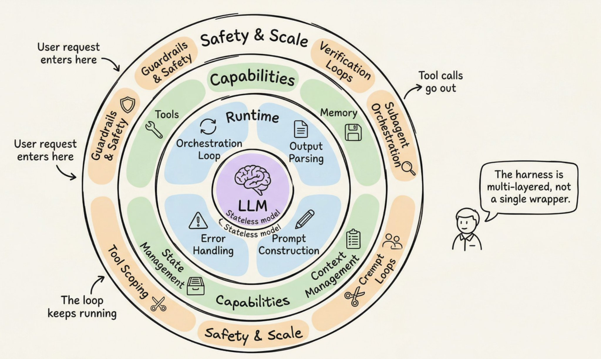
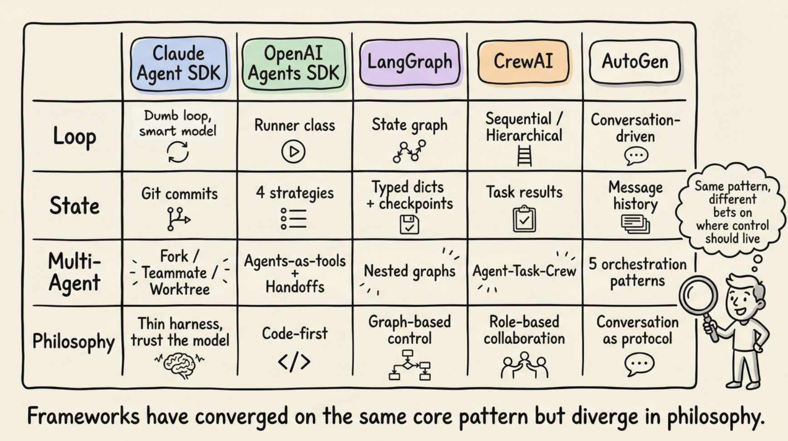
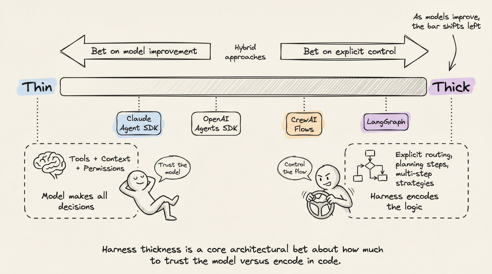

# 深度解析 Agent Harness

深入解析 Anthropic、OpenAI、Perplexity 和 LangChain 正在构建的 Agent 基础设施。涵盖编排循环、工具、记忆、上下文管理，以及将无状态 LLM 转变为强大 Agent 的一切要素。

你已经构建了一个聊天机器人。也许你已经接好了 ReAct 循环和几个工具。它在演示中运行良好。然后你尝试构建生产级的东西，一切都崩了：模型忘记了三步之前做过什么，工具调用静默失败，上下文窗口被垃圾填满。

问题不在模型本身，而在模型周围的一切。

LangChain 证明了这一点——他们只改变了包裹 LLM 的基础设施（相同的模型、相同的权重），就在 TerminalBench 2.0 上从 30 名开外跃升至第 5 名。另一个研究项目通过让 LLM 自身优化基础设施，达到了 76.4% 的通过率，超越了手工设计的系统。

这种基础设施现在有了名字：**Agent Harness**。

# 什么是 Agent Harness？

这个术语在 2026 年初被正式确定，但概念早已存在。Harness 是包裹 LLM 的完整软件基础设施：编排循环、工具、记忆、上下文管理、状态持久化、错误处理和护栏。Anthropic 的 Claude Code 文档简洁地指出：SDK 是"**驱动 Claude Code 的 Agent Harness**"。OpenAI 的 Codex 团队使用了相同的框架，明确将"**Agent**"和"**Harness**"等同起来，指代使 LLM 有用的**非模型基础设施**。

我非常喜欢 LangChain 的 Vivek Trivedy 给出的经典公式：**"如果你不是模型，那你就是 Harness。"**

这里有一个容易混淆的区别。"Agent"是涌现行为：用户交互的目标导向、工具使用、自我纠正的实体。Harness 是产生这种行为的机制。当有人说"我构建了一个 Agent"时，他们的意思是构建了一个 Harness 并将其指向一个模型。

Beren Millidge 在他 2023 年的文章《[脚手架式 LLM 作为自然语言计算机](https://www.beren.io/2023-04-11-Scaffolded-LLMs-natural-language-computers/)》中精确地做了这个类比。原始 LLM 是一个没有 RAM、没有磁盘、没有 I/O 的 CPU。上下文窗口充当 RAM（快速但有限）。外部数据库充当磁盘存储（大但慢）。工具集成充当设备驱动程序。Harness 就是操作系统。正如 Millidge 所写：**"我们重新发明了冯·诺依曼架构"**，因为它是任何计算系统的自然抽象。

# 三层工程体系

模型周围有三层同心的工程体系：

- **提示工程** 负责编写模型接收的指令。
- **上下文工程** 管理模型看到什么以及何时看到。
- **Harness 工程** 包含前两者，外加整个应用基础设施：工具编排、状态持久化、错误恢复、验证循环、安全执行和生命周期管理。

Harness 不是提示词的包装器。它是使自主 Agent 行为成为可能的完整系统。

# 生产级 Harness 的 12 个组件

综合 Anthropic、OpenAI、LangChain 和更广泛的实践者社区的经验，一个生产级 Agent Harness 有 12 个独立组件。让我们逐一解析。

## 1. 编排循环

这是心跳。它实现了思考-行动-观察（TAO）循环，也称为 ReAct 循环。循环运行：组装提示词、调用 LLM、解析输出、执行工具调用、将结果反馈、重复直到完成。

从机制上看，它通常只是一个 while 循环。**复杂性在于循环管理的一切，而非循环本身。** Anthropic 将其运行时描述为一个"笨循环"，所有智能都在模型中。Harness 只管理轮次。

## 2. 工具

工具是 Agent 的双手。它们被定义为 schema（名称、描述、参数类型）注入 LLM 的上下文中，以便模型知道可用的工具。工具层负责注册、schema 验证、参数提取、沙箱执行、结果捕获，以及将结果格式化回 LLM 可读的观察。

Claude Code 提供六大类工具：文件操作、搜索、执行、Web 访问、代码智能和子 Agent 生成。OpenAI 的 Agents SDK 支持函数工具（通过 `@function_tool`）、托管工具（WebSearch、CodeInterpreter、FileSearch）和 MCP 服务器工具。

## 3. 记忆

记忆在多个时间尺度上运作。**短期记忆** 是单次会话内的对话历史。**长期记忆** 跨会话持久化：Anthropic 使用 CLAUDE.md 项目文件和自动生成的 MEMORY.md 文件；LangGraph 使用命名空间组织的 JSON Store；OpenAI 支持基于 SQLite 或 Redis 的 Session。

Claude Code 实现了三层层级结构：轻量级索引（每个条目约 150 字符，始终加载）、按需拉取的详细主题文件，以及仅通过搜索访问的原始记录。一个关键设计原则：**Agent 将自己的记忆视为"提示"，在行动前会验证实际状态。**

## 4. 上下文管理

这是许多 Agent 静默失败的地方。核心问题是上下文腐烂：**当关键内容位于上下文窗口中间位置时，模型性能下降 30% 以上**（Chroma 研究，与斯坦福的"迷失在中间"发现一致）。即使是百万 token 的窗口，随着上下文增长也会出现指令遵循退化。

**生产环境策略包括：**

- **压缩**：接近限制时总结对话历史（Claude Code 保留架构决策和未解决的 bug，同时丢弃冗余的工具输出）
- **观察遮蔽**：JetBrains 的 Junie 隐藏旧的工具输出，同时保持工具调用可见
- **即时检索**：维护轻量级标识符并动态加载数据（Claude Code 使用 grep、glob、head、tail 而非加载完整文件）
- **子 Agent 委托**：每个子 Agent 广泛探索，但仅返回 1,000 到 2,000 token 的精简摘要

Anthropic 的上下文工程指南指出了目标：找到**最小的高信号 token 集合**，以最大化期望结果的可能性。

## 5. 提示词构建

这一步组装模型在每个步骤实际看到的内容。它是分层的：系统提示词、工具定义、记忆文件、对话历史和当前用户消息。

OpenAI 的 Codex 使用严格的优先级栈：服务器控制的系统消息（最高优先级）、工具定义、开发者指令、用户指令（级联的 AGENTS.md 文件，32 KiB 限制），然后是对话历史。

## 6. 输出解析

现代 Harness 依赖原生工具调用，模型返回结构化的 tool_calls 对象，而非需要解析的自由文本。Harness 检查：有工具调用吗？执行它们并循环。没有工具调用？那就是最终答案。

对于结构化输出，OpenAI 和 LangChain 都支持通过 Pydantic 模型进行 schema 约束响应。传统方法如 RetryWithErrorOutputParser（将原始提示词、失败的完成结果和解析错误反馈给模型）仍然可用于边缘情况。

## 7. 状态管理

LangGraph 将状态建模为通过图节点流动的类型化字典，使用 reducer 合并更新。检查点在超级步骤边界发生，支持中断后恢复和时间旅行调试。OpenAI 提供四种互斥策略：应用内存、SDK 会话、服务端 Conversations API，或轻量级的 previous_response_id 链式调用。Claude Code 采用了不同的方式：**git 提交作为检查点，进度文件作为结构化草稿本。**

## 8. 错误处理

这很重要：**一个 10 步流程，每步 99% 的成功率，端到端成功率仍只有约 90.4%。** 错误会快速累积。

LangGraph 区分四种错误类型：瞬时错误（退避重试）、LLM 可恢复错误（将错误作为 ToolMessage 返回，让模型自行调整）、用户可修复错误（中断等待人工输入）和意外错误（向上冒泡以便调试）。Anthropic 在工具处理器内捕获失败并将其作为错误结果返回，以保持循环运行。Stripe 的生产 Harness 将重试次数限制为两次。

## 9. 护栏与安全

OpenAI 的 SDK 实现了三个级别：输入护栏（在第一个 Agent 上运行）、输出护栏（在最终输出上运行）和工具护栏（在每次工具调用时运行）。"触发线"机制在触发时立即停止 Agent。

Anthropic 在架构上将权限执行与模型推理分离。模型决定尝试什么；工具系统决定允许什么。**Claude Code 独立管控约 40 个离散的工具能力**，分三个阶段：项目加载时的信任建立、每次工具调用前的权限检查、高风险操作的用户显式确认。

## 10. 验证循环

这是区分玩具演示和生产 Agent 的关键。Anthropic 推荐三种方法：基于规则的反馈（测试、linter、类型检查器）、视觉反馈（通过 Playwright 截取 UI 任务的截图）和 LLM 评判（由单独的子 Agent 评估输出）。

Claude Code 的创建者 Boris Cherny 指出，**给模型提供验证自身工作的方式可以将质量提升 2 到 3 倍**。

## 11. 子 Agent 编排

Claude Code 支持三种执行模型：Fork（父上下文的字节级副本）、Teammate（独立终端面板，基于文件的邮箱通信）和 Worktree（独立的 git worktree，每个 Agent 独立分支）。OpenAI 的 SDK 支持 Agent 即工具（专家处理有界子任务）和交接（专家完全接管）。LangGraph 将子 Agent 实现为嵌套状态图。

# 循环运转：逐步演练

了解了组件之后，让我们追踪它们在单个周期中如何协同工作。

**步骤 1（提示词组装）**：Harness 构建完整输入：系统提示词 + 工具 schema + 记忆文件 + 对话历史 + 当前用户消息。重要上下文被放置在提示词的开头和结尾（"迷失在中间"发现）。

**步骤 2（LLM 推理）**：组装好的提示词发送到模型 API。模型生成输出 token：文本、工具调用请求，或两者兼有。

**步骤 3（输出分类）**：如果模型生成了文本且没有工具调用，循环结束。如果请求了工具调用，进入执行阶段。如果请求了交接，更新当前 Agent 并重新开始。

**步骤 4（工具执行）**：对于每个工具调用，Harness 验证参数、检查权限、在沙箱环境中执行并捕获结果。只读操作可以并发执行；变更操作串行执行。

**步骤 5（结果打包）**：工具结果被格式化为 LLM 可读的消息。错误被捕获并作为错误结果返回，以便模型自我纠正。

**步骤 6（上下文更新）**：结果被追加到对话历史。如果接近上下文窗口限制，Harness 触发压缩。

**步骤 7（循环）**：返回步骤 1。重复直到终止。

**终止条件**是分层的：模型生成了不含工具调用的响应、超过最大轮次限制、token 预算耗尽、护栏触发线被触发、用户中断，或返回安全拒绝。一个简单问题可能需要 1 到 2 轮。一个复杂的重构任务可以在多轮中链接数十个工具调用。

[对于跨越多个上下文窗口的长时间运行任务，Anthropic 开发了两阶段的"Ralph 循环"模式](https://www.anthropic.com/research/long-running-Claude)：一个**初始化 Agent** 设置环境（初始化脚本、进度文件、功能列表、初始 git 提交），然后每个后续会话中的**编码 Agent** 读取 git 日志和进度文件来定位自身，选择最高优先级的未完成功能，进行开发，提交，并写入摘要。文件系统提供了跨上下文窗口的连续性。

# 真实框架如何实现这一模式

**Anthropic 的 Claude Agent SDK** 通过单一的 `query()` 函数暴露 Harness，该函数创建 Agent 循环并返回一个异步迭代器来流式传输消息。运行时是一个"笨循环"。所有智能都在模型中。Claude Code 使用收集-行动-验证循环：收集上下文（搜索文件、读取代码）、采取行动（编辑文件、运行命令）、验证结果（运行测试、检查输出）、重复。

**OpenAI 的 Agents SDK** 通过 Runner 类实现 Harness，支持三种模式：异步、同步和流式。SDK 是"代码优先"的：工作流逻辑用原生 Python 表达，而非图 DSL。Codex Harness 在此基础上扩展了三层架构：Codex Core（Agent 代码 + 运行时）、App Server（双向 JSON-RPC API）和客户端界面（CLI、VS Code、Web 应用）。所有界面共享同一个 Harness，这就是为什么"Codex 模型在 Codex 界面上比在通用聊天窗口中表现更好。"

**LangGraph** 将 Harness 建模为显式状态图。两个节点（llm_call 和 tool_node）通过条件边连接：如果有工具调用，路由到 tool_node；如果没有，路由到 END。LangGraph 从 LangChain 的 AgentExecutor 演变而来，后者在 v0.2 中被弃用，因为它难以扩展且缺乏多 Agent 支持。LangChain 的 **Deep Agents** 明确使用了"Agent Harness"这个术语：内置工具、规划（write_todos 工具）、用于上下文管理的文件系统、子 Agent 生成和持久化记忆。

**CrewAI** 实现了基于角色的多 Agent 架构：Agent（围绕 LLM 的 Harness，由角色、目标、背景故事和工具定义）、Task（工作单元）和 Crew（Agent 集合）。CrewAI 的 Flows 层添加了"在关键之处使用智能的确定性骨干"，管理路由和验证，同时 Crew 处理自主协作。

**AutoGen**（正在演变为 Microsoft Agent Framework）开创了对话驱动的编排。其三层架构（Core、AgentChat、Extensions）支持五种编排模式：顺序、并发（扇出/扇入）、群聊、交接和 magentic（管理 Agent 维护动态任务账本来协调专家）。

# 脚手架隐喻

脚手架隐喻不是装饰性的，它是精确的。建筑脚手架是临时基础设施，使工人能够建造他们无法触及的结构。它不做建造工作。但没有它，工人无法到达上层。

**关键洞察：当建筑完工时，脚手架会被拆除。** 随着模型改进，Harness 的复杂性应该降低。Manus 在六个月内重建了五次，每次重写都减少了复杂性。复杂的工具定义变成了通用 shell 执行。"管理 Agent"变成了简单的结构化交接。

这指向了**共进化原则**：模型现在在后训练中将特定的 Harness 纳入循环。Claude Code 的模型学会了使用它被训练时的特定 Harness。更改工具实现可能会因为这种紧密耦合而降低性能。

Harness 设计的"面向未来测试"：如果随着更强大的模型，性能提升而不需要增加 Harness 复杂性，则设计是合理的。

# 定义每个 Harness 的七个决策

**每个 Harness 架构师都面临七个选择：**

1. **单 Agent vs. 多 Agent。** Anthropic 和 OpenAI 都说：先最大化单个 Agent。多 Agent 系统会增加开销（额外的 LLM 调用用于路由、交接时的上下文丢失）。仅当工具过载超过约 10 个重叠工具或存在明显独立的任务域时才拆分。

2. **ReAct vs. 计划执行。** ReAct 在每一步交替推理和行动（灵活但每步成本更高）。计划执行将规划与执行分离。LLMCompiler 报告比顺序 ReAct **快 3.6 倍**。

3. **上下文窗口管理策略。** 五种生产方案：基于时间的清除、对话总结、观察遮蔽、结构化笔记和子 Agent 委托。ACON 研究显示，通过优先处理推理痕迹而非原始工具输出，**token 减少 26% 到 54%，同时保持 95% 以上的准确率**。

4. **验证循环设计。** 计算验证（测试、linter）提供确定性的基础事实。推理验证（LLM 评判）捕获语义问题但增加延迟。Martin Fowler 的 Thoughtworks 团队将其框架化为**引导器**（前馈，行动前引导）与**传感器**（反馈，行动后观察）。

5. **权限和安全架构。** 宽松模式（快速但有风险，自动批准大多数操作）与严格模式（安全但缓慢，每个操作都需要批准）。选择取决于部署环境。

6. **工具范围策略。** 更多工具通常意味着更差的性能。Vercel 从 v0 中**移除了 80% 的工具**反而获得了更好的结果。Claude Code 通过延迟加载实现了 **95% 的上下文缩减**。原则：暴露当前步骤所需的最小工具集。

7. **Harness 厚度。** 多少逻辑在 Harness 中，多少在模型中。Anthropic 押注薄 Harness 和模型改进。基于图的框架押注显式控制。Anthropic 会随着新模型版本内化该能力而定期从 Claude Code 的 Harness 中删除规划步骤。

# Harness 就是产品

两个使用相同模型的产品，仅因 Harness 设计不同就可能有截然不同的性能表现。TerminalBench 的证据很清楚：仅改变 Harness 就让 Agent 排名移动了 20 多位。

Harness 不是一个已解决的问题或商品化层。硬核工程就在这里：将上下文作为稀缺资源来管理、设计在故障累积前就能捕获它们的验证循环、构建提供连续性而不产生幻觉的内存系统，以及在构建多少脚手架与留给模型多少之间做出架构决策。

随着模型改进，这个领域正朝着更薄的 Harness 发展。但 Harness 本身不会消失。即使是最强大的模型，也需要某些东西来管理其上下文窗口、执行工具调用、持久化状态并验证其工作。

下次你的 Agent 失败时，不要怪模型。看看 Harness。

---

> 原文：[A deep dive into what Anthropic, OpenAI, Perplexity and LangChain are actually building](https://x.com/i/article/1931012876818665766)
