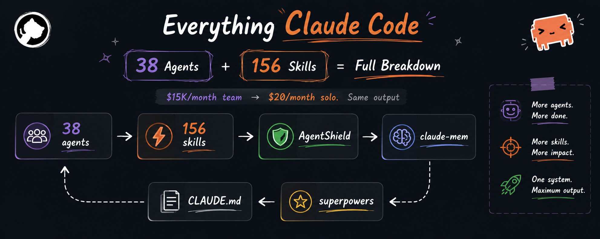

> *本文来自 Twitter @Shruti_0810 的分享，经 Obsidian Clippings 收集后迁移至此。*

---

一个普通创业公司每月要花 **12,000～25,000 美元**才能养活一个小型开发团队。

3 个工程师。无穷无尽的站会。不断堆积的技术债务。

然后一个 Solo 开发者带着 Claude Code、一台笔记本电脑和一个极度优化的配置，参加了 Anthropic 黑客松。

**他在 9 小时内交付了一个完整的生产级产品。**

不是原型，不是着陆页——一个真正能运行的系统。

他赢了比赛，拿走了 20,000 美元奖金，然后把仓库开源了。

那个仓库以 **15 万+ Star** 的速度增长，几乎是有史以来增长最快的开发工具之一。

当开发者打开它的时候，他们意识到一件令人不安的事情：

> 这不是"AI 辅助"。这是一个 AI 工程组织。

---

## 大多数人对 ECC 的误解

人们以为 ECC 只是"一个 Claude 配置"。

**错了。**

它是一个编排层。你相当于在 Claude Code 之上安装了一个 AI 原生的工程操作系统。

和大多数在复杂度面前崩溃的 AI 工具不同，ECC 随着项目增长反而越来越强。

安装方式：

```text
# 选项 A — 插件（推荐）
/plugin marketplace add affaan-m/everything-claude-code
/plugin install everything-claude-code@everything-claude-code

# 选项 B — 选择性安装（只装你需要的）
ecc install --profile developer \
  --with lang:typescript \
  --with agent:security-reviewer \
  --without skill:continuous-learning
```

**初学者最常犯的错误是一股脑装全部。**

ECC 从设计之初就是模块化的。选择你的技术栈，选择你的专家，跳过不必要的认知负担。

---

## 38 个专业 Agent 到底有多疯狂

这些不是聊天机器人。它们是**面向特定角色的工程操作员**。

举几个例子：

| Agent | 功能 |
|-------|------|
| `planner` | 将任务拆解为步骤，分派给其他 Agent |
| `security-reviewer` | 在发布前扫描漏洞 |
| `typescript-reviewer` | 捕获 TypeScript 特有的反模式 |
| `pytorch-build-resolver` | 修复 PyTorch 构建问题 |
| `code-reviewer` | 通用代码审查，5 项并行检查 |
| `debugger` | 结构化根因分析 |

覆盖语言：TypeScript、Python、Rust、Go、Kotlin、Java、Flutter、C#、C++、Perl 等。

但 ECC 真正的核心是 **planner Agent**。

你给它一个高层目标，它会把任务拆解为阶段，分派给专业 Agent，协调输出，验证结果，然后返回一个结构化的实施方案。

一个通常要花一整天的任务，现在 **25～40 分钟**就能完成。

而且因为专家会在发布前审查工作成果，你避免了 AI 编程带来的隐藏成本——**事后长达一周的调试**。

---

## 技能系统如何改变一切

这是大多数 Twitter 帖子完全忽略的关键细节。

ECC 的技能 **不会永久加载到上下文中**。这意味着你的上下文窗口不会被大量指令淹没。

技能只在相关时激活。示例：

```text
/plan          → 结构化任务规划
/tdd           → 测试驱动开发工作流
/e2e           → 端到端测试
/security-scan → AgentShield 漏洞检查
/model-route   → 为任务选择合适的模型
/harness-audit → 评估当前设置
/simplify      → 重构以提高可读性
/loop-start    → 自主迭代工作
```

还有针对特定技术栈的技能：`nextjs-turbopack`、`pytorch-patterns`、`documentation-lookup`、`bun-runtime`、`mcp-server-patterns`……

**一个 Slash 命令取代整段 Prompt。**

你不需要再输入：

> "能帮我审查代码、检查漏洞、验证边界情况、运行测试、评估架构决策吗……"

你只需要输入：

```
/review
```

完事。

如果 Prompt 工程每次任务浪费你 15 分钟，而你每天做 10 个任务——

那你每年光是在"向 AI 解释自己要什么"上就浪费了整整几个星期。

---

## AgentShield——被严重低估的安全层

这是整个生态系统中真正的隐藏宝石，但几乎所有人都会跳过它。

**这是个巨大的错误。**

AI 工具生态已经存在严重的供应链安全问题：恶意技能、Prompt 注入链、被入侵的 MCP 服务器、泄露的 API 凭证、危险的 Hooks。

大多数开发者安装随机 AI 插件时根本不做任何审计。

**AgentShield 是 Claude Code 的安全运维层。**

数据令人震惊：

- **1,282 个安全测试**
- **100+ 安全规则**
- **多 Agent 对抗分析**
- **自动修复支持**

使用方式：

```text
# 快速扫描
npx ecc-agentshield scan

# 自动修复安全问题
npx ecc-agentshield scan --fix

# 高级对抗分析（使用 Opus 模型）
npx ecc-agentshield scan --opus --stream
```

`--opus` 模式尤其令人印象深刻——它同时启动三个独立的 Claude Opus Agent：

- **攻击者 Agent** → 搜索利用路径
- **防御者 Agent** → 验证防御状态
- **审计者 Agent** → 综合风险评估

扫描范围：

```
CLAUDE.md · settings.json · MCP 配置 · Hooks · Agents · Skills · 环境暴露 · 权限系统
```

**一次扫描就能防止：**

- API 信用额度被盗
- 生产环境密钥泄露
- 仓库被入侵
- 恶意技能执行
- 灾难性部署事故

成本对比：**5 秒扫描 vs 50,000 美元的安全事故。**

---

## 连续学习——让 Claude 有了"人格"

这是没人深入讨论过的突破性功能。

普通的 AI 编程会话是无状态的——**每次会话从零开始**。你要一遍又一遍地教它你的架构偏好。

ECC 不同。它构建**持久的工程直觉**。

```
第 1 次会话：你修正了异步错误处理 → 记录为习惯
第 4 次会话：相同模式再次出现 → 置信度提升
第 9 次会话：行为趋于稳定 → 在后续生成中自动应用
```

**这不是模型微调。** 这是一个行为记忆层。

几周之后，Claude 不再输出"通用 AI 代码"。它开始写出**感觉就像是你自己写的代码**——你的命名习惯、结构偏好、架构直觉和调试方式。

> 不像在使用 AI，更像是在指导一个从不遗忘教训的、速度惊人的初级工程师。

---

## 三个让系统完整的附加组件

### 1️⃣ claude-mem —— 持久记忆

```text
/plugin marketplace add thedotmack/claude-mem
/plugin install claude-mem
```

SQLite 后端存储 + 生命周期钩子 + 本地记忆查看器。现在你的 AI 能自动记住昨天的决策。

### 2️⃣ Superpowers —— 强制 AI 先思考再编码

```text
/plugin marketplace add obra/superpowers
/plugin install superpowers
```

没有 Superpowers：AI 立刻写出 500 行代码 → Bug 到处都是。

有了 Superpowers：AI 先规划 → 验证假设 → 写出更干净的系统 → 调试量大幅减少。

### 3️⃣ CLAUDE.md 规则 —— 控制层

```text
- 在任务完成前始终运行测试
- 不要自动修改生产环境配置
- 删除文件前先询问
- 在实现前先解释思路
- 不确定时提出澄清问题
```

每个 ECC Agent 都会读取这些指令。你的整个 AI 工程团队突然变得**可预测**。

---

## 5 分钟完整搭建

```text
# 1. 安装 ECC
/plugin marketplace add affaan-m/everything-claude-code
/plugin install everything-claude-code@everything-claude-code

# 2. 添加记忆
/plugin marketplace add thedotmack/claude-mem
/plugin install claude-mem

# 3. 添加结构化思考
/plugin marketplace add obra/superpowers
/plugin install superpowers

# 4. 运行安全扫描
npx ecc-agentshield scan --fix

# 5. 在 CLAUDE.md 中添加你的规则
```

最终你得到的是：

```
38 个专业 Agent      → 取代多个初级开发者
自适应技能系统       → 消除重复性 Prompt
安全审计             → 预防昂贵错误
持久化记忆           → 自动记住你的工作流
持续学习             → 适应你的编码风格
结构化推理           → 更少的错误实现
```

**一个创始人加上这套工具，就能像一个小型工程团队一样运转。**

---

## 真正的范式转移

正在发生的变化不再是"AI 与不用 AI 的差距"。

差距正在变成：**使用原始 AI 的人 vs 使用 AI 系统的人。**

学得早的人会以惊人的速度前进。

那些无视它的人，仍然在手动重写 Prompt，而其他人用一个周末就能交付整个产品。

你可以花 2 年时间不断扩大团队规模。

或者你可以花 5 分钟搭建一个永不休眠的 AI 工程组织。

**选择权在你。**

---

> *原文来源：[Everything Claude Code](https://github.com/affaan-m/everything-claude-code) 仓库，由 Twitter @Shruti_0810 分享。本文经翻译和结构调整后发布。*