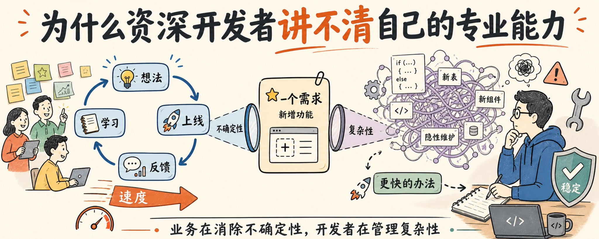
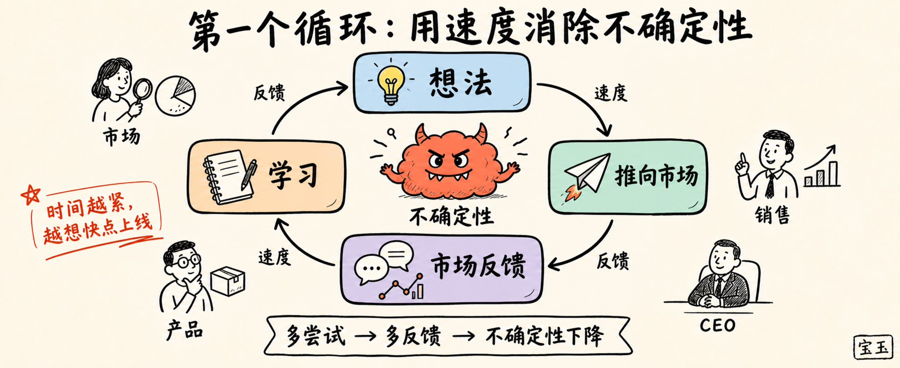
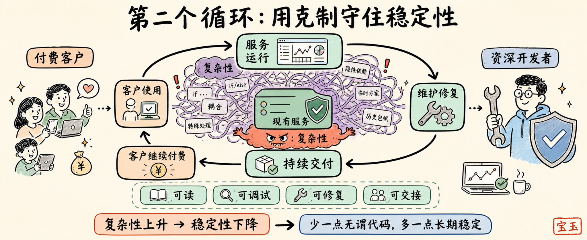
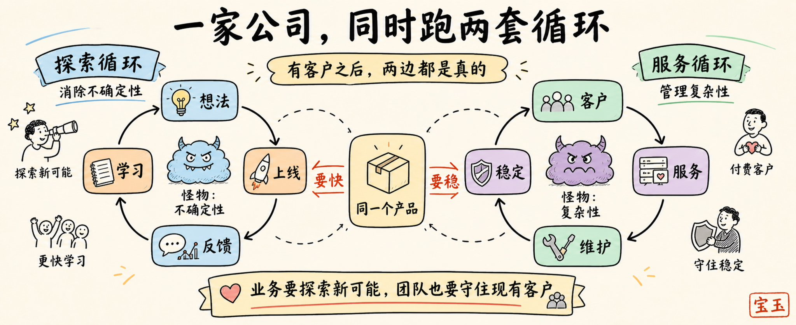
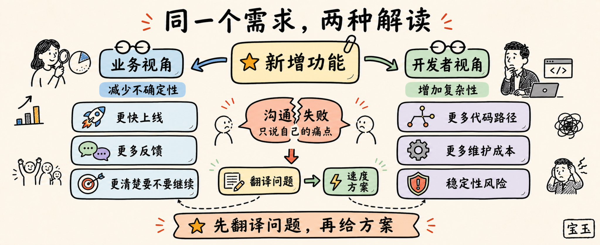
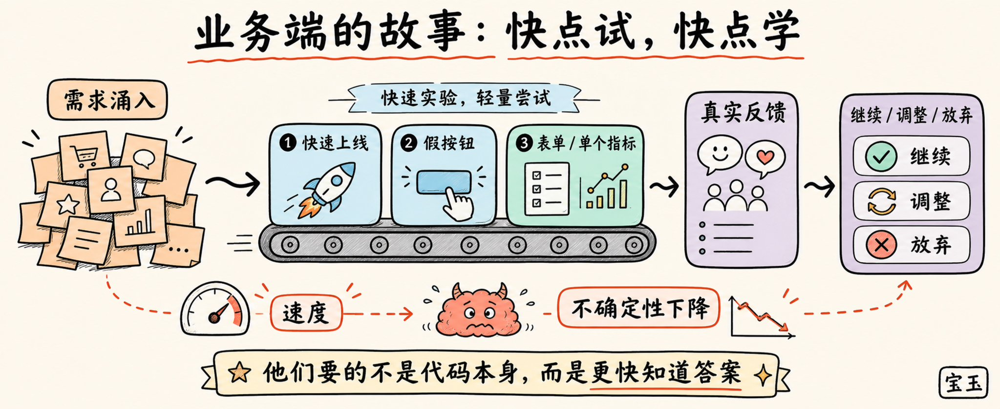
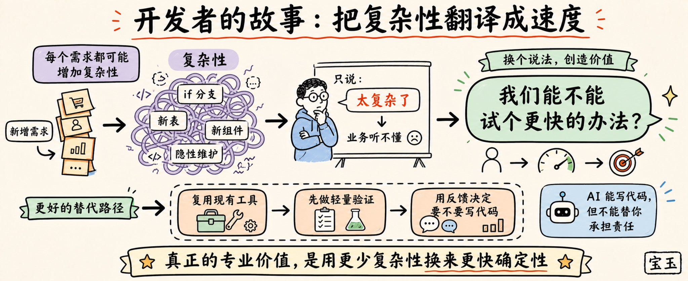

作者：Tuhin Nair 原文：[Why senior developers fail to communicate their expertise](https://nair.sh/guides-and-opinions/communicating-your-expertise/why-senior-developers-fail-to-communicate-their-expertise)

你对下面这句话有什么感觉？

> "AI 智能体 (AI agents) 是软件开发的未来。我们再也不需要那些拖慢业务进度的开发人员了。"

如果你是一位资深开发者，并且认同这句话，那我可能要对你的专业水平打个问号了（我会解释原因的，我并不是在故意找茬）。

但如果你不是资深开发者，却认同这句话，我觉得你大概率是对的。

咦？这到底是怎么回事？

广告文案 (Copywriting) 的本质，其实就是让信息精准匹配它的受众。

所以，在我这个文案工作者看来，这里发生的事情是：同一句话，在两类不同的受众听来，有着截然不同的含义。

如果你是一位资深开发者，并且你已经玩过那些让人大开眼界的 AI 智能体、大模型以及各种花哨的 AI 技能，但你的直觉依然告诉你："大家都在宣扬程序员要失业了，这事儿听起来总觉得哪里不对劲"。那么在这篇文章里，我将尝试把你这种说不清道不明的直觉，用清晰的文字表达出来（这正是一个优秀文案该干的活）。

但是等一下！现在也有很多经验丰富的知名开发者在宣告"程序员已死"。

这又是怎么回事？到底谁的直觉是对的？是什么导致了这种分歧？

当我加入一个团队时，通常会遇到两类资深开发者。

第一类会说这样的话：

> "我发现了一个新工具，简直太酷了……""某某公司（一家和我们业务完全不搭边的公司）就是这么干的，所以……""快看 HackerNews 上的这篇帖子，上面说这是最佳实践，我们也许应该……"

说实话，我不太喜欢这类资深开发者。他们往往有点自我保护欲，在行业里混了很久，可能人缘还不错。但我们就是不在一个频道上。

接着是第二类资深开发者：

> "我们真的需要那个功能吗？""如果我们不做这个，会发生什么？""我们能不能先凑合一下？也许等它变得更重要的时候再回过头来弄？"

啊，宝贝，这才是我的"梦中情怪"资深开发者。他们是回避者、精简者、废物利用者。他们想尽一切办法去避免写代码。

为什么？因为他们在专业的软件开发生涯中，毕生都在狩猎一只可怕的怪物：**复杂性 (Complexity)**。

各种特殊情况、一堆的 if 条件判断、新建的数据库表、全新的组件。这些全都是让人头疼的大麻烦**（因为它们极大增加了系统维护和理解的难度）**。资深开发者希望这些东西越少越好，他们会花大量时间去反复确认，是不是真的非写这段代码不可。

因为给系统做加法，就意味着增加了复杂性的风险。

是的，是的，我承认这么说有些过于绝对了。当然有很多资深开发者擅长攻克未解难题，并提出富有创意的新架构。

但归根结底，如果你要对一个正在平稳运行的系统负责，你就会对复杂性感到恐惧。

那么，这到底是为什么呢？复杂性到底有什么坏处？又为什么其他人都无法理解这种恐惧呢？

我们打算用两个"循环圈"来简化并解释一家公司的运作方式。

这是第一个循环圈；市场营销人员、销售人员、产品经理以及 CEO，他们都生活在这个圈里：

第一个循环：业务团队通过快速尝试、市场反馈和学习，持续降低不确定性。

这个循环的核心目标是尝试与学习。企业想要把产品推向市场，然后获取反馈，看看他们搞出来的东西到底有没有价值。

对于身处这个循环里的人来说，他们要面对的怪物是：**不确定性 (Uncertainty)**。

不确定性是残酷的，因为没有任何策略能保证百分之百奏效。当不确定性与时间交织在一起时（比如营销和销售的薪水、创始人的工资账单，或者产品经理急需的数据），你会感觉：在死线到来之前，尽可能快地把东西推向市场，似乎是降低不确定性的唯一途径。你推向市场的东西越多，得到的反馈就越多，你（潜在地）消除的不确定性也就越多。

这个循环——也是所有公司起步时的必经之路——追求的是纯粹的、原始的速度。

但是，当一家公司开始拥有客户时，会发生什么呢？

啊哈，现在，我们的第二个循环圈登场了。人们开始为服务付费了。

第二个循环：付费客户依赖现有服务，资深开发者通过控制复杂性来维持长期稳定。

很多资深开发者就身处这个循环圈中。这个循环的核心目标是：**延续并保障服务的稳定**。

保持系统运转，保持代码易读，保持问题可调试，保持故障可修复，保持架构可传授给新人，最重要的是，保持稳定。

资深开发者之所以操心稳定性，是因为他们肩负着让公司能够持续为客户提供服务的重任。

而什么会威胁到这一切？

**复杂性。**

复杂性会让系统变得难以理解、难以调试、难以修复、难以交接，并最终导致系统变得极不稳定。

复杂性上升 = 稳定性下降 = 资深开发者失职 = 糟糕透顶，客户付款中断，所有人都愁眉苦脸。

所以，如果说第一个循环的目标是"消除不确定性"，那么第二个循环的目标就是"管理复杂性"。

但这为什么会导致沟通上的失败呢？

因为一旦你有了客户，这两个循环圈就会同时运转。一家公司既需要探索新的可能性，又必须同时服务好现有的客户。

有客户之后，公司必须同时探索新可能，也必须守住现有客户。

好了，现在你可能已经猜到我对文章标题那个问题的答案了。

根据你把时间主要花在哪一个循环圈里，你对问题的认知框架是完全不同的（这也就是为什么我认为开发者在对待 AI 的观点上会产生分歧；有些人更多地在第一个循环里工作，而另一些人则在第二个循环里）。

同一个需求，两种解读：业务看到更快验证，开发者看到更多代码路径和维护成本。

在第一个循环圈里的人，他们的故事是这样的：

业务端的故事：他们要的不是代码本身，而是更快知道答案。

但在第二个循环圈里的资深开发者，他们的故事却是这样的：

开发者的故事：真正的专业价值，是用更少复杂性换来更快确定性。

这两种故事根本搭不上调。

资深开发者接到的"新增功能"需求越多，他们就越想回怼："呃，不行……这太复杂了……维护成本太高……代码没法读了……后续开发速度会变慢……长期来看会拖累生产力……"。

但是，这些牢骚对于业务端"急需消除不确定性"的诉求来说，毫无帮助。

文案的诊断结果：**你不能用你自己的烦恼，去搪塞别人的问题。**

文案开出的处方：**你必须把你的解决方案，包装成同样能解决他们问题的方案。**

资深开发者之所以沟通失败，是因为他们总是在用"复杂性管理"的逻辑来表达自己的苦衷，而他们本该用"消除不确定性"的逻辑来推销自己的解决方案。

只要资深开发者能意识到公司其他部门真正渴望的是消除不确定性，他们就能利用自己的专业能力来提供帮助了。

那么，资深开发者最拿手的本领是什么？是不情愿去开发没必要的东西；是能够敏锐地发现复用现有代码的机会。

需要收集问卷数据？ 用 Google 表单就行了，宝贝。

需要开发一个新功能来做测试？ 你们有没有试过在现有的 UI 界面上加个假按钮，看看有没有人点？**（也就是所谓的"画饼测试"或验证性测试）**

需要一套新的数据分析服务？ 我们需要看数据来做出的最关键决策是什么？我们能不能只针对这一个决策，先做一个图表、看一个指标？

你想费劲给我烤个完整的生日蛋糕？ 算了吧，直接在我的三明治上插根蜡烛就行。

这就是资深开发者学到的生存之道：他们学会了如何利用现有的软件资源，巧妙地给别人想要的东西。

但是，你该如何沟通这一点，而不至于每次都要给别人写篇小作文呢？

文案们最喜欢把一堆复杂的信息浓缩成一句简短有力的话。所以，这里有一句每个资深开发者都必须背诵的魔法口诀："我们能不能试个更快的办法？"

用"更快 (quicker)"这个词，是承认并迎合了业务端真正的渴望（速度）；"办法 (something)"暗示了还有别的方式可以达成目标；而"试 (try)"则暗示了这个方案可能并不完美，但很可能已经足够好了。

这句话完美地切中了公司其他部门的核心需求——用速度来消除不确定性，同时也让资深开发者能够尽情施展他们的专业特长：精简功能、复用代码，如果老天保佑的话，完全避免开发。

就是这样。这就是我对文章标题的回答：当所有人都在为"不确定性"焦头烂额时，资深开发者却总是在把"复杂性"挂在嘴边。

但是！大大的转折来了！

现在的 AI 似乎让这一切都变得毫无意义了，不是吗？为什么还要精简？为什么还要复用？为什么还要避免开发？AI 可以在极短的时间内写出海量的代码。

唉，话虽如此，但有一件事 AI 至今还做不到，而这也正是资深开发者依然在坚持做的事。

**承担责任 (Take responsibility)——背锅。**

<blockquote>
  原文地址：<a href="https://x.com/dotey/status/2055097242755706984">https://x.com/dotey/status/2055097242755706984</a>
</blockquote>
