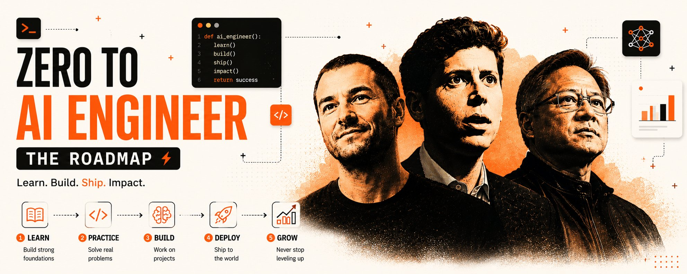

2026 年，大多数试图学习人工智能的人都陷入了同样的循环：购买昂贵的课程、收集证书、观看无休止的教程，但仍然不知道如何真正构建一些真实的东西。

真相出奇地简单。

互联网上最好的AI教育资源已经是免费的。

不是入门级的空谈，也不是"什么是 ChatGPT？"之类的视频。而是来自构建现代人工智能系统的公司——OpenAI、Anthropic、Google、NVIDIA、Microsoft——的真正工程知识，并结合开源代码库，其教学效果远胜大多数付费训练营。

几乎没有人会按正确的顺序使用这些资源。

这就是为什么人们在不了解Transformer的情况下就贸然使用代理，在不了解嵌入的情况下就尝试构建RAG应用程序，或者在不了解底层原理的情况下就复制粘贴LangChain教程。

这份路线图解决了这个问题。

不是提供"50 个你永远不会打开的资源"，而是提供一个实用的系统，旨在让完全的初学者在大约 14 周内构建生产级 AI 系统。

目标并非仅仅是成为人工智能工具的使用者，而是要理解现代人工智能的实际工作原理，如何利用它进行构建，以及如何部署能够解决实际问题的系统。

第一步是搭建合适的开发环境。安装 Python 3.11+、VS Code、GitHub、Obsidian 和 Ollama。Ollama 尤为重要，因为它允许你在本地运行强大的语言模型，这在后续处理语言学习模型 (LLM)、嵌入、量化和智能体时会变得极其宝贵。

工具：

- Python → [https://python.org/downloads](https://python.org/downloads)
- VS Code → [https://code.visualstudio.com](https://code.visualstudio.com/)
- GitHub → [https://github.com](https://github.com/)
- Obsidian → [https://obsidian.md](https://obsidian.md/)
- Ollama → [https://ollama.com](https://ollama.com/)

安装完成后，在以下平台创建免费账号：

- Anthropic Academy → [https://anthropic.skilljar.com](https://anthropic.skilljar.com/)
- OpenAI Academy → [https://academy.openai.com](https://academy.openai.com/)
- Google AI → [https://grow.google/ai](https://grow.google/ai)
- Coursera → [https://coursera.org](https://coursera.org/)

一个重要的技巧：在 Coursera 上，永远选择"Audit this course"。大多数人都没意识到完整的学习资料通常是免费的。

路线图从 AI 基础开始，因为理解 AI 词汇会改变一切。Google 的 AI Professional Certificate 是最好的起点之一，因为它会在不立即用数学压垮初学者的情况下解释 AI 工作流、提示工程和实际用例。

之后，Anthropic Academy 的"AI Fluency"课程提供了目前网上最清晰的现代 AI 系统解释之一。短小、实用，对于一个完全免费的课程来说，质量出奇地高。

接下来是第一个重要的 GitHub 仓库：[https://github.com/microsoft/generative-ai-for-beginners](https://github.com/microsoft/generative-ai-for-beginners)

这一个仓库本身就比许多付费 AI 课程都好。它涵盖了提示工程、Transformer、嵌入、聊天应用，以及大语言模型在生产系统中实际是如何工作的。

在这个阶段，目标是简单的：足够好地理解 tokens、嵌入、Transformer 和上下文窗口，能够用通俗英语解释它们。

下一个阶段是机器学习基础，这也是大多数人放弃的地方，因为教程不再感觉那么神奇，真正的工程开始了。

这也是初学者分化出未来 AI 工程师的节点。

这里最好的免费资源是：[https://github.com/microsoft/ML-For-Beginners](https://github.com/microsoft/ML-For-Beginners)

它以一种非常实用的方式教授回归、分类、聚类、模型评估、过拟合和梯度下降。

同时，Coursera 上的 IBM Machine Learning Professional Certificate 在 audit 模式下非常好：[https://coursera.org/professional-certificates/ibm-machine-learning](https://coursera.org/professional-certificates/ibm-machine-learning)

对于专门与 AI 相关的数学基础，这个仓库非常有价值：[https://github.com/mlabonne/llm-course](https://github.com/mlabonne/llm-course)

它不强制不必要的学术理论，而是专注于现代 ML 和 LLM 工作所需的精确线性代数、微积分和概率概念。

在这个阶段结束时，至少应该有一个机器学习项目推送到 GitHub。不是因为招聘人员在乎玩具项目，而是因为构建东西是理解模型为什么会失败的最快方式。

然后进入了完全改变人们对 AI 认知的阶段：深度学习。

Andrej Karpathy 的"Neural Networks: Zero to Hero"仍然是有史以来最伟大的 AI 学习资源之一：[https://karpathy.ai/zero-to-hero.html](https://karpathy.ai/zero-to-hero.html)

它不躲在框架后面，而是使用原始 Python 和数学从零开始教授神经网络。反向传播、激活函数、分词、Transformer、注意力机制——一切都变得可以理解，因为系统是一块一块构建的。

配套的 GitHub 仓库：[https://github.com/karpathy/nn-zero-to-hero](https://github.com/karpathy/nn-zero-to-hero)

在这个阶段，用 Ollama 运行本地模型非常有用：

ollama run llama3

在同时构建更小的 Transformer 系统时观察本地运行的 LLM，会在理论和真实世界的 AI 系统之间建立一座大多数课程从未提供的桥梁。

一旦深度学习基础清晰了，路线图就转向现代 LLM 工程。

在这里，RAG、微调、LoRA、QLoRA、量化、向量数据库和评估等概念开始变得有意义。

同样，最好的免费资源之一是：[https://github.com/mlabonne/llm-course](https://github.com/mlabonne/llm-course)

它可以说是 AI 世界目前最接近完整的开源 LLM 工程课程的东西。

同时，提示工程应该直接从构建前沿模型的公司学习：

OpenAI Academy：[https://academy.openai.com](https://academy.openai.com/)

Anthropic Prompt Engineering：[https://docs.anthropic.com](https://docs.anthropic.com/)

Anthropic 的文档特别有价值，因为它把提示工程当作一门工程学科来解释，而不是"魔法词汇"。

这个阶段的一个强力项目是使用 ChromaDB 或 LanceDB 在个人笔记上构建 RAG 系统。这创建一个由本地 AI 模型和嵌入驱动的可搜索第二大脑。

之后是 AI agents——这是目前改变行业最快的领域。

Microsoft 的免费课程：[https://github.com/microsoft/ai-agents-for-beginners](https://github.com/microsoft/ai-agents-for-beginners)

涵盖工具使用、编排、记忆系统、工作流和多智能体架构。

Anthropic 的 MCP（Model Context Protocol）课程同样重要，因为 MCP 正在迅速成为 AI 系统连接工具、API 和外部环境的标准方式：[https://anthropic.skilljar.com](https://anthropic.skilljar.com/)

这是项目变得真正令人印象深刻的阶段：

- 自主研究智能体
- AI 文件系统
- 浏览器智能体
- 工作流自动化
- 本地助手
- 记忆增强型 AI 系统

最后是部署、评估和作品集建设——这是大多数教程完全忽略的领域。

一个没有评估的已部署 AI 系统基本上是一台等待失败的幻觉机器。

这就是为什么 DeepEval、RAGAS 和 LLM-as-a-Judge 这样的工具如此重要。

项目最终应该使用以下方式部署：

- Hugging Face Spaces
- Gradio
- Streamlit
- Vercel

每个正经项目都应该包括：

- 评估
- 安全检查
- 架构图
- GitHub 文档
- 公开演示

因为在现代 AI 招聘中，GitHub 通常比简历更重要。

这份路线图最重要的地方是它避免了初学者犯的最大的错误：无休止地消费而不构建。

真正成为 AI 工程师的人不是那些收藏了 200 个教程的人。

他们是那些打开终端、搞坏东西、修复东西、部署项目，然后重复这个过程直到系统最终变得清晰的人。

目前，历史上最伟大的免费 AI 教育就在网上。

唯一真正的问题是，谁愿意深入去使用它。

---

> 原文地址：<a href="https://x.com/shruti_0810/status/2055676059480395990?s=46">https://x.com/shruti_0810/status/2055676059480395990?s=46</a>