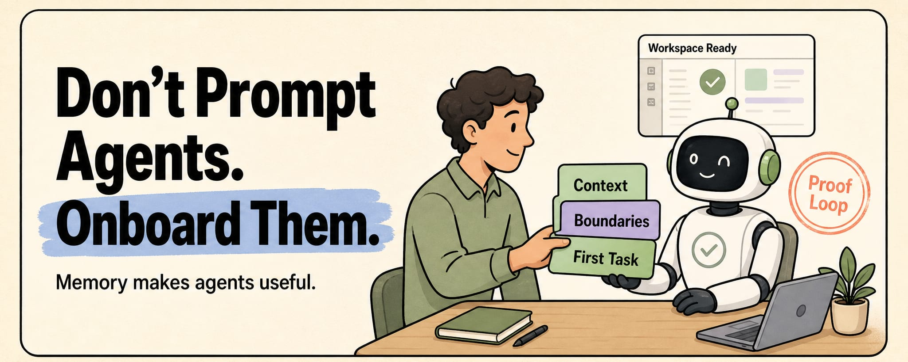
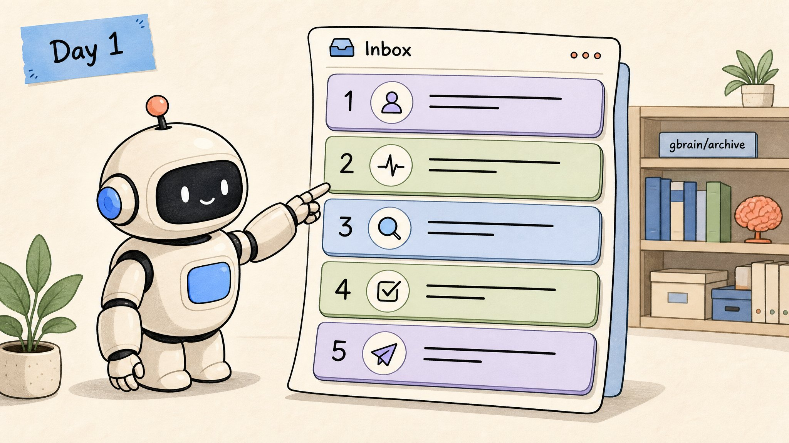
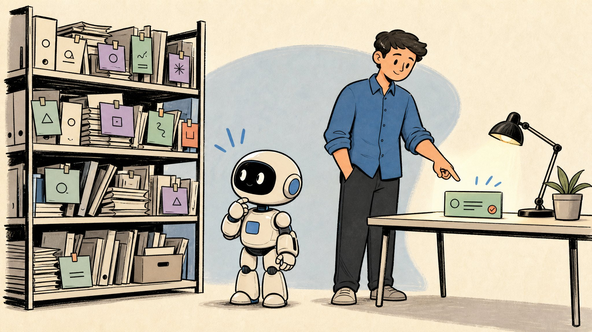
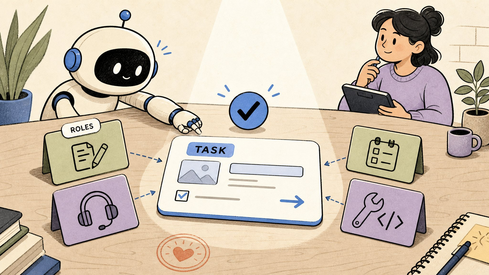
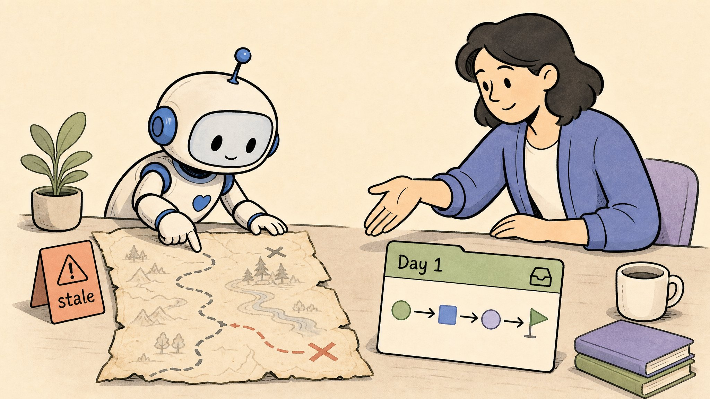
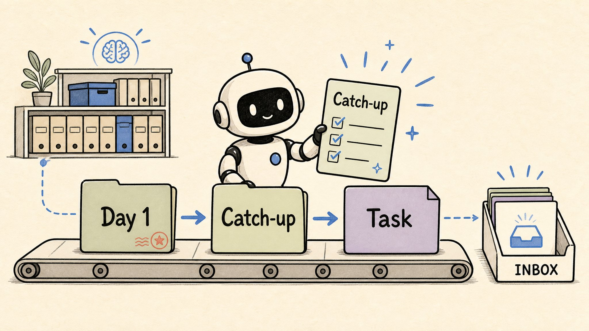
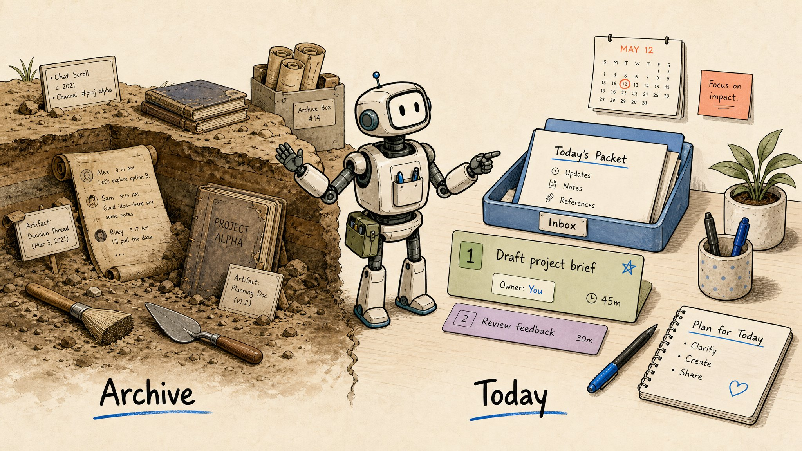

这是建立 AI 原生团队的第二部分：为什么新 agent 需要在 Day 1 就有一个收件箱对话，而不是先去翻 gbrain。

大多数说自已有"AI agent 团队"的人，其实只是开了 5 个 Telegram 窗口。

他们手动在每个窗口里重复：今天要做什么、什么不要碰、谁在等谁、上周做了什么决定。每次新 agent 加入新角色，整件事又要重新解释一遍。

我曾经以为这也是一个团队。结果我只是个人类协调员。

我意识到了一件事：

**Agent 比人更容易招聘。但 onboarding 的难度一样大。**

我不只是协调员。我还是自己 agent 团队的人类 onboarding 文档。

这个月我一直在研究这件事。第一步在[上一篇文章](https://x.com/Voxyz_ai/status/2054590247367835687)里：让团队共享大脑运行起来。今天是第二步：onboarding。

我以为共享大脑运行之后，onboarding 会自然搞定。没成。

第一步把 openclaw 和 hermes 接入了同一个 [gbrain](https://github.com/garrytan/gbrain)。新 agent 现在可以查询团队做过的每一个长期决策。然后其中一个 agent 读了几页旧上下文，就开始根据 10 天前我们已经决定不做的方向写执行计划了。

它读得很仔细。**它只是不知道那些上下文哪些部分在今天还活着。**

## 我跳过了 onboarding 部分



我把顺序搞反了。给 agent 信息不等于 onboarding。

给信息只是把 agent 带到书架前。

Onboarding 告诉它：今天需要解决的事情，是桌上那个。

所以我开始想。也许真正的 agent 团队不只是需要 wiki。也许还需要一些老派的东西，比如 email。

我做了个实验。把 agent 团队邮箱建成了 MCP。每个 agent 有自己的收件箱。交接按发送者、主题、状态工作，可以线程化。持久结论仍然写回 gbrain。

收件箱存放团队成员之间的日常协作，加上新成员的欢迎线程。Gbrain 存放长期的东西。两者不混。

新 agent 的第一个动作是打开自己收件箱里的线程，而不是去翻书架。书架在需要时备用。agent 不会主动来找它。

## Day 1 email 长什么样



每个新 agent 上线后的第一个动作是打开自己收件箱里的"Day 1"线程。

这不是独立的邮件系统。它是团队收件箱里一种特定类型的线程。结构是固定的（5 个 block），内容根据 agent 自己的角色和当前团队状态填充。

```plaintext
主题: Day 1: <agent-name> / <role>
类型: request
优先级: normal
分配给: <agent-name>
去重 key: onboarding:<agent-name>

---

1. 你今天的角色
   一句话职责。你负责什么。你不碰什么。

2. 现在哪些是活着的
   活跃目标 + 负责人 + 为什么重要
   仍在生效的决定
   暂停或废弃的方向（标清楚）

3. 需要时查这些
   gbrain: <slug> / 为什么相关
   workspace: <path> / 读什么
   不要从头看档案

4. 你今天的第一个任务
   一个真实的、小任务，答案取决于当前上下文
   "完成"是什么样

5. 如何回复这个线程
   你做了什么 / 依赖了什么上下文 / 是否被阻塞 / 下一步建议什么
```

5 个 block。**不是那种"总结公司"的 onboarding 教程套路。**

关键不是"最近发生了什么"。而是"现在哪些是活着的"。**状态（活跃/暂停/废弃）比时间窗口更准确。** 昨天的想法可能已经死了。三周前的决定可能还活着。

值得大声说。在第一步我写的是"共享大脑优先，边界其次"。但到了 onboarding 这步，**大脑是参考资料，不是 onboarding 教科书**。大脑还在那里。只是不再是第一站。它是 agent 需要背景时去的地方。

跑了几次之后，差异立刻显现。"读 10 页旧上下文，然后走错方向"的模式消失了。

## 第一个任务长什么样



第 4 块里的"第一个任务"是关键。它不能是个测验题。

我用过的一些例子，按 agent 角色：

- **内容 agent**：读今天的主角帖子草稿，告诉我哪一行最弱
- **支持 agent**：回复这个工单，但先列出影响这个答案的 3 个最近决定
- **协调 agent**：今天收件箱里的 3 个线程，哪个最需要升级给我
- **工程 agent**：运行这个 PR 的测试，报告哪些失败了

它们的共同点：正确答案总是取决于 agent 是否真正理解今天发生了什么。任务可以小。重要的是错误答案会立刻暴露出来。

## 怎么判断 onboarding 没生效



只有一个测试：agent 在第一个任务上做得怎么样。

如果对了，agent 确实按顺序读完了整个 email。如果错了，你比任何 100 题测验都更快知道。

一些常见的 onboarding 没生效的迹象：

- **Agent 一直问已经决定过的事**：没读"哪些是活着的" block
- **Agent 基于过时上下文行动**：没区分活跃和废弃，或者跳过了收件箱直接去了档案
- **Agent 先做总结**：根本没读 Day 1 email，直接进入教程模式

出现这些时，不要直接去调 prompt。回到 Day 1 email，检查 agent 是否真的走完了所有 5 个 block。

## 等一下，这只是加新 agent 时有用吗？



人们会问这个。我也问过。

如果你只把它想成"新员工欢迎邮件"，那确实太稀有了，不值得建。

但它不是"onboarding email"。它实际上是：**工作包**。它解决的问题不是"欢迎"，而是 agent 从零散到真正执行的那一刻：

- **新 agent 首次上线**：Day 1 包
- **老 agent 重启或切换任务**：catch-up 包
- **我正式交接工作给 agent**：任务包

**Onboarding 只是工作包的一种特殊情况。**

通用形状保持不变：

```plaintext
主题: <task name>

1. 目标
2. 交付物
3. 现在哪些是活着的
4. 什么不要碰
5. 需要时查这些
6. 如何回复这个线程
```

新 agent 多一个前置 block（"你的角色"）。其他情况跳过。

每次你正式交接工作给 agent，都应该有一个准确的工作包坐在它桌上。这避免了一些你肯定见过的问题：

- Agent 不知道现在哪些是活着的
- Agent 基于旧记忆行动
- Agent 把闲聊当任务
- Agent 完成后没有任何确认
- Agent 不知道结果是否应该写回 gbrain

所以我更愿意叫它工作包，而不是 onboarding。

**Onboarding 低频。工作包日常。**

## 原始历史是考古学



档案是考古学。是用来引用的，不是分配给 agent 做 onboarding 阅读的。

**档案告诉你过去发生了什么。收件箱告诉你今天哪些是活着的。第一个任务告诉你 agent 是否真正理解了。**

新 agent 不缺历史。缺的是另外两个。

在你的 agent 团队里，新成员第一天打开的是：一摞书，还是今天的 email？

还是你仍然是人类协调员，在各自的聊天窗口里手动管理每个 agent，然后把这叫"团队"？

---
