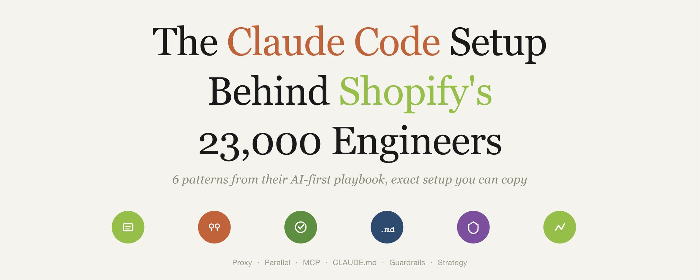

Shopify 的 23000 名工程师正在竞速实现到今年第三季度自动化 96% 的编码。

他们并行运行多个 Claude Code 智能体，每个处理代码库的不同部分，而工程师只负责审查和合并。

Bessemer 发布了他们的完整 AI 优先 playbook。

这是他们的精确设置，你可以在 5 分钟内复制👇



## 基础设施层（为什么他们的设置有效）

Shopify 没有标准化单一 AI 工具。他们标准化了它下面的层。

他们构建了一个内部 LLM 代理，将每个 AI 请求通过一个网关路由。Claude Code、GitHub Copilot、Cursor，所有都通过相同的基础设施流动。

```text
Shopify 的 LLM 代理架构：

工程师 → Claude Code / Copilot / Cursor
         ↓
    LLM 代理（集中式网关）
         ↓
    OpenAI / Anthropic / Google 模型
         ↓
    使用分析 + 成本控制 + 模型路由
```

这给了他们集中的成本控制、使用分析，以及在不改变任何工程师工作流程的情况下交换模型的能力。

给小团队的教训：不要选择一个工具然后全力投入。构建基础设施，这样你可以在保持对成本和数据控制的同时实验多种工具。


## 模式 1：并行智能体，而不是单一聊天

Shopify 的高级工程师不把 Claude Code 当作单一提示词-单一响应工具使用。

他们同时启动多个智能体，在代码库的不同部分工作。

一个智能体重构 auth 模块。另一个写测试。第三个更新文档。工程师审查输出，丢弃不工作的，合并有效的。

```bash
# 终端 1：处理 auth 重构的智能体
claude -p "refactor src/auth/ to use the new session handler"

# 终端 2：写测试的智能体
claude -p "write integration tests for the payment flow"

# 终端 3：更新文档的智能体
claude -p "update API documentation for all changed endpoints"
```

工程师的工作从写代码转变为审查和合并智能体输出。Farhan Thawar（工程 VP）称之为"编排智能系统"。

## 模式 2：扩展批评循环

并非每个任务都受益于并行。对于复杂的架构决策，Shopify 工程师让单一智能体经过扩展的批评循环。

智能体生成答案，评估它，修订它，并在长推理周期中持续优化。

不是接受第一个输出，而是强制智能体与自己争论。

```text
提示词模式：

"为 [X] 提出一个架构。
然后批评你自己的提案：什么在规模化时会出问题？
然后根据你的批评修订。
然后批评修订版。
给我最终版本，以及每个决策的置信度。"
```

这比单一提示词产生明显更好的结果，因为 Claude 在你不得不之前捕获自己的错误。

## 模式 3：Shopify AI 工具包（MCP）

2026 年 4 月，Shopify 发布了一个开源 MCP 服务器，将 Claude Code 直接连接到 Shopify 的文档、GraphQL API schema 和实时商店运营。

一条命令安装：

```bash
claude mcp add --transport stdio shopify-dev-mcp -- npx -y @shopify/dev-mcp@latest
```

这给了 Claude Code 7 个工具：

- 搜索当前 Shopify 文档（不是过时的训练数据）
- 根据实时 schema 验证 GraphQL 查询
- 通过 Shopify CLI 执行商店操作
- 创建产品、管理 metafield、修改主题
- 用自然语言运行批量操作

没有这个，Claude 会幻觉 API 字段并编造组件模式。有了它，Claude 使用真实平台数据工作。


## 模式 4：CLAUDE.md 作为团队基础设施

Shopify 不把 CLAUDE.md 当作个人配置。它是团队基础设施，提交到 git 并在所有 23000 名工程师中共享。

他们在会议上的方法：

```markdown
# CLAUDE.md（Shopify 内部模式）

## 技术栈
Ruby on Rails, React, GraphQL, MySQL

## 命令
- Dev: `dev up && dev server`
- Test: `dev test [path]`
- Lint: `dev style`
- Type check: `bin/srb tc`

## 架构
- app/models/ → ActiveRecord 模型，业务逻辑
- app/controllers/ → 薄控制器，委托给服务
- app/services/ → 复杂操作的服务对象
- app/graphql/ → GraphQL 类型、mutation、resolver

## 规则
- 永远不要绕过 Sorbet 类型检查
- 所有新代码必须有类型签名
- 数据库查询只通过既定模式
- 重要：每次更改后运行 `dev test`
```

来自会议的关键洞察：在 CLAUDE.md 中塞入每个标准和惯例会让性能变差，而不是更好。

你在每次对话中都为所有这些付钱。

## 模式 5：策略优先验证

这是 Shopify 的方法与大多数团队分歧的地方。

2024 年，工程师 70% 的时间花在执行上，30% 在策略上。

2026 年，Shopify 翻转了这个比例。

因为 AI 处理大部分编码，工程师现在 70% 的时间花在策略上：映射用户流、验证市场需求、选择正确的架构。只有 30% 在执行上。

```text
2024 工作流：
策略：30% → 执行：70%

2026 工作流（Shopify）：
策略：70% → 执行：30%

AI 写代码。
工程师决定应该存在什么代码。
```

Farhan 的团队估计大约 20% 的生产力提升。不是来自写更多代码，而是来自测试 10 个方法而不是 2 个、更快的原型制作、更高的保真度交付物。

## 模式 6：带护栏的安全自主

Shopify 不让智能体狂奔。他们的护栏设置：

```json
{
  "permissions": {
    "allow": [
      "Read", "Glob", "Grep", "LS", "Edit",
      "Bash(dev test *)",
      "Bash(dev style *)",
      "Bash(git status)",
      "Bash(git diff *)",
      "Bash(git add *)",
      "Bash(git commit *)"
    ],
    "deny": [
      "Read(**/.env*)",
      "Bash(git push *)",
      "Bash(dev deploy *)",
      "Bash(bin/rails db:drop *)",
      "Bash(rm -rf *)"
    ],
    "defaultMode": "acceptEdits"
  }
}
```

智能体可以读、写、测试和提交。它们不能推送到远程、部署到生产、删除数据库或读取 secrets。

对于任何不可逆的操作，人类保持在循环中。

## 你今天可以复制的设置

你不需要 23000 名工程师才能使用这些模式。这是入门版本：

## 步骤 1：标准化你的 CLAUDE.md

```text
保持在 60 行以下。技术栈、命令、架构、规则。
提交到 git。与你的团队共享。
```

## 步骤 2：设置并行智能体

```text
# 对于更大的任务，在独立终端中运行 2-3 个智能体
# 每个智能体处理代码库的不同部分
```

## 步骤 3：安装相关 MCP 服务器

```bash
# Shopify 团队：
claude mcp add --transport stdio shopify-dev-mcp -- npx -y @shopify/dev-mcp@latest

# 其他所有人：连接你的技术栈的 MCP 服务器
# GitHub、Slack、数据库、无论你日常使用什么
```

## 步骤 4：添加护栏

允许：读、写、测试、lint、提交
拒绝：推送、部署、删除、secrets
默认模式：acceptEdits

## 步骤 5：翻转比例

停止在执行上花费 70% 的时间。让智能体写代码。把你的时间花在决定什么代码应该存在上。

## 重要的数字

Shopify 的 20% 生产力提升不是来自写更多代码。它来自探索 10 个方法而不是 2 个、更快的原型制作、更早地捕获错误。

从 Claude Code 获得最多的团队不是那些有最好提示词的。是那些构建了基础设施让智能体安全地、并行地、在真实代码库上工作的。

到 2026 年第三季度实现 90% 自主编码。这不是愿景声明。这是一个有 23000 名工程师正在为之努力的截止日期。

---
