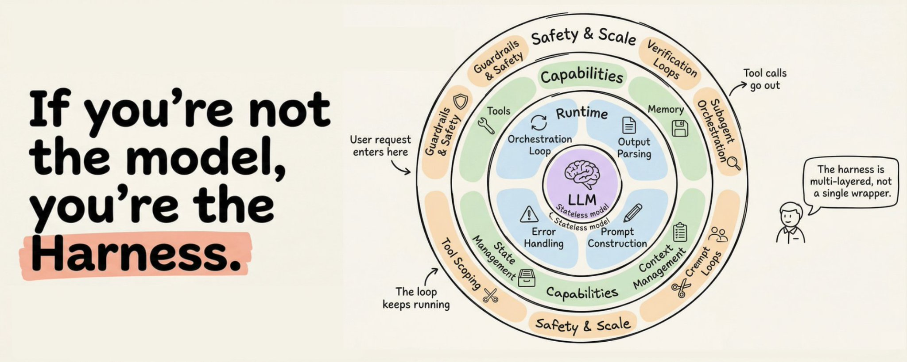
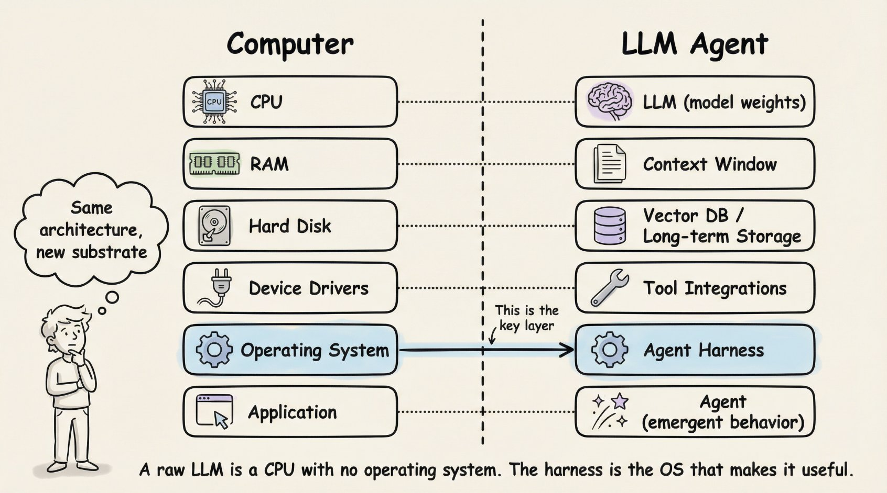
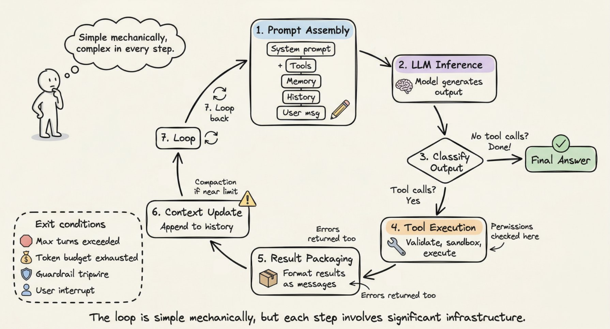
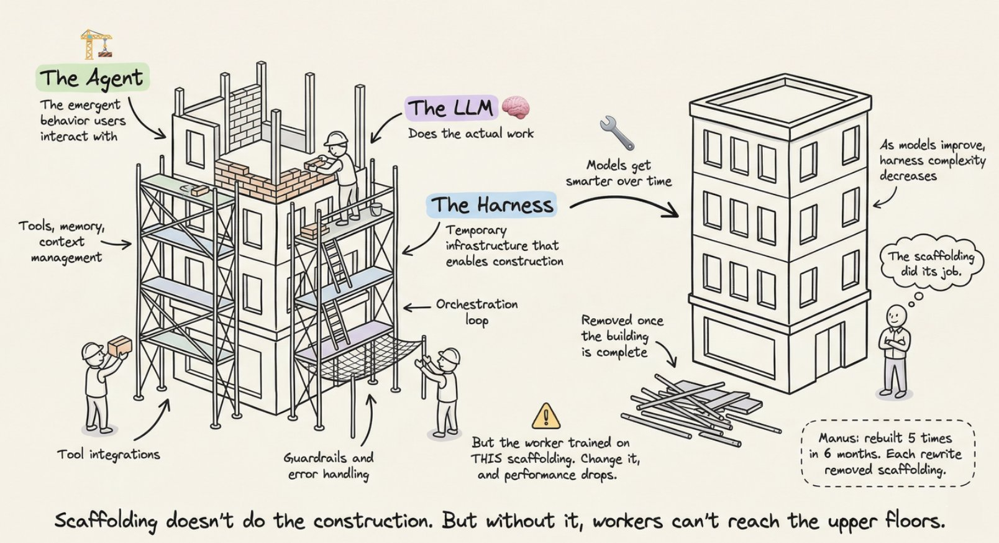
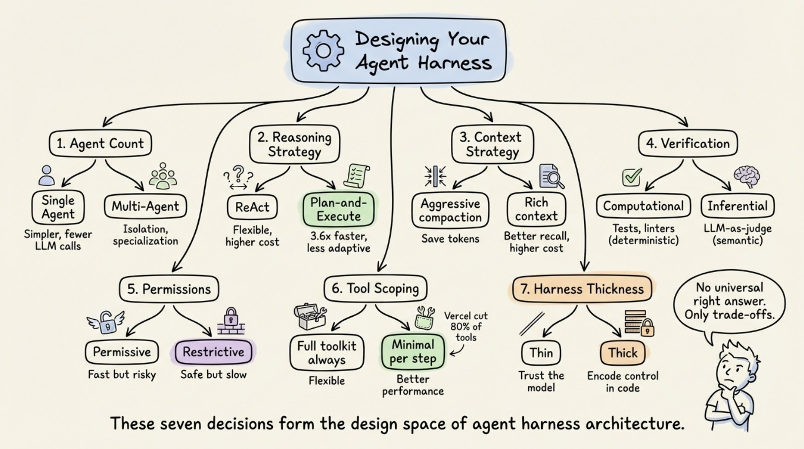

深入拆解 Anthropic、OpenAI、Perplexity 和 LangChain 实际在构建的东西。涵盖编排循环、工具、记忆、上下文管理，以及将无状态的 LLM 转变为有能力的 Agent 所需的一切基础设施。

你已经搭了一个聊天机器人。也许你还用几个工具接了一个 ReAct 循环。它在演示里效果不错。但当你尝试构建一个生产级别的系统时，问题就来了：模型忘记了三步之前做了什么，工具调用静默失败，上下文窗口充满了垃圾数据。

问题不在你的模型。在模型外围的一切。

LangChain 用同一个例子证明了这点：他们只更换了包装 LLM 的基础设施（同样的模型，同样的权重），就从 30 名开外跳到了 TerminalBench 2.0 的第五名。另一项研究项目让 LLM 优化基础设施本身，达到了 76.4% 的通过率，超越了手工设计的系统。

这个基础设施现在有了一个名字：**Agent Harness**。

# 什么是 Agent Harness？

这个术语在 2026 年初被正式定义，但概念早就存在了。Harness 是包装 LLM 的完整软件基础设施：编排循环、工具、记忆、上下文管理、状态持久化、错误处理和护栏。Anthropic 的 Claude Code 文档简单地说：SDK 是"**驱动 Claude Code 的 Agent Harness**"。OpenAI 的 Codex 团队使用同样的框架，明确将"**Agent**"和"**Harness**"等同起来，指的是使 LLM 有用的**非模型基础设施**。

我很喜欢 LangChain 的 Vivek Trivedy 提出的经典公式：**"如果你不是模型，你就是 Harness。"**

这里有一个容易混淆的区分。所谓的"Agent"是涌现行为：用户交互的目标导向、可使用工具、可自我修正的实体。Harness 是产生该行为的机械结构。当有人说"我构建了一个 Agent"，意思是他们构建了一个 Harness 并指向了一个模型。

Beren Millidge 在 2023 年的文章"[Scaffolded LLMs as Natural Language Computers](https://www.beren.io/2023-04-11-Scaffolded-LLMs-natural-language-computers/)"中把这个类比讲得很精确。一个原始的 LLM 是一台没有 RAM、没有磁盘、没有 I/O 的 CPU。上下文窗口充当 RAM（快但有限）。外部数据库功能如同磁盘存储（大但慢）。工具集成充当设备驱动程序。Harness 就是操作系统。正如 Millidge 写的：**"我们重新发明了冯·诺依曼架构"**，因为它是任何计算系统的天然抽象。

# 三层工程

三层同心圆工程环绕着模型：

- **提示工程** (Prompt Engineering) 制作模型接收的指令。
- **上下文工程** (Context Engineering) 管理模型看到什么、何时看到。
- **Harness 工程** (Harness Engineering) 包含以上两者，再加上整个应用基础设施：工具编排、状态持久化、错误恢复、验证循环、安全执行和生命周期管理。

Harness 不是提示的外层包装。它是使自主 Agent 行为成为可能的完整系统。

# 生产 Harness 的 12 个组件

综合 Anthropic、OpenAI、LangChain 和更广泛的实践者社区，一个生产级 Agent Harness 有 12 个独立组件。让我们逐一走过。

## 1. 编排循环 (Orchestration Loop)

这是心跳。它实现 Thought-Action-Observation（TAO）循环，也叫 ReAct 循环。循环运行：组装提示、调用 LLM、解析输出、执行任何工具调用、将结果反馈、重复直到完成。

机械地看，它通常就是一个 while 循环。**复杂性在于循环管理的一切，而不是循环本身**。Anthropic 将其运行时描述为一个"哑循环"，所有智能都在模型里。Harness 只管理回合。

## 2. 工具 (Tools)

工具是 Agent 的手。它们定义为模式（名称、描述、参数类型），注入到 LLM 的上下文中让模型知道有什么可用。工具层处理注册、模式验证、参数提取、沙盒执行、结果捕获，以及将结果格式化为 LLM 可读的观察。

Claude Code 提供六类工具：文件操作、搜索、执行、Web 访问、代码智能和子 Agent 衍生。OpenAI 的 Agents SDK 支持函数工具（通过 [@function_tool](https://x.com/@function_tool)）、托管工具（WebSearch、CodeInterpreter、FileSearch）和 MCP 服务器工具。

## 3. 记忆 (Memory)

记忆在多个时间尺度上运作。**短期记忆**是单会话内的对话历史。**长期记忆**跨会话持久化：Anthropic 使用 [CLAUDE.md](http://claude.md/) 项目文件和自动生成的 [MEMORY.md](http://memory.md/) 文件；LangGraph 使用命名空间组织的 JSON Store；OpenAI 支持以 SQLite 或 Redis 为后端的 Sessions。

Claude Code 实现了三层架构：轻量级索引（每个条目约 150 字符，始终加载）、按需拉取的详细主题文件，以及仅通过搜索访问的原始转录。一个关键设计原则：**Agent 将自己的记忆视为"提示"，在行动前验证实际状态**。

## 4. 上下文管理 (Context Management)

这是许多 Agent 静默失败的地方。核心问题是上下文腐烂：**当关键内容落在窗口中间位置时，模型性能下降超过 30%**（Chroma 研究，斯坦福的"Lost in the Middle"发现证实）。即使百万 token 的窗口也会因上下文增长而出现指令跟随退化。

**生产策略包括：**

- **压缩**：当接近限制时总结对话历史（Claude Code 保留架构决策和未解决的 bug，同时丢弃冗余的工具输出）
- **观察掩码**：JetBrains 的 Junie 隐藏旧的工具输出同时保持工具调用可见
- **即时检索**：维护轻量级标识符并动态加载数据（Claude Code 使用 grep、glob、head、tail 而不是加载完整文件）
- **子 Agent 委托**：每个子 Agent 广泛探索但只返回 1,000 到 2,000 token 的压缩摘要

Anthropic 的上下文工程指南指出了目标：找到**最小的可能高信号 token 集**，以最大化期望结果的概率。

## 5. 提示构建 (Prompt Construction)

这组装了模型在每一步实际看到的内容。它是分层的：系统提示、工具定义、记忆文件、对话历史和当前用户消息。

OpenAI 的 Codex 使用严格的优先级堆栈：服务器控制的系统消息（最高优先级）、工具定义、开发者指令、用户指令（级联的 [AGENTS.md](http://agents.md/) 文件，32 KiB 限制），然后是对话历史。

## 6. 输出解析 (Output Parsing)

现代 Harness 依赖原生工具调用，模型返回结构化的 tool_calls 对象而不是需要解析的自由文本。Harness 检查：有工具调用吗？执行并循环。没有工具调用？那就是最终答案。

对于结构化输出，OpenAI 和 LangChain 都支持通过 Pydantic 模型进行模式约束响应。遗留方法如 RetryWithErrorOutputParser（将原始提示、失败完成和解析错误反馈给模型）仍然可用于边缘情况。

## 7. 状态管理 (State Management)

LangGraph 将状态建模为流经图节点的类型化字典，带有合并更新的 reducer。检查点在超步骤边界进行，支持中断后恢复和时间穿越调试。OpenAI 提供四种互斥策略：应用内存、SDK 会话、服务端 Conversations API 或轻量级 previous_response_id 链接。Claude Code 采取不同方法：**用 git 提交作为检查点，用进度文件作为结构化草稿**。

## 8. 错误处理 (Error Handling)

这说明了为什么这很重要：一个 10 步过程，每步 99% 成功率，最终成功率只有约 90.4%。错误复合很快。

LangGraph 区分四种错误类型：瞬态（带退避重试）、LLM 可恢复（将错误作为 ToolMessage 返回让模型调整）、用户可修复（中断等待人工输入）和意外（向上冒泡供调试）。Anthropic 在工具处理器中捕获失败并将其作为错误结果返回以保持循环运行。Stripe 的生产 Harness 将重试次数上限设为两次。

## 9. 护栏与安全 (Guardrails and Safety)

OpenAI 的 SDK 实现了三层：输入护栏（首个 Agent 上运行）、输出护栏（最终输出上运行）和工具护栏（每次工具调用上运行）。"绊线"机制在触发时立即停止 Agent。

Anthropic 在架构上把权限执行与模型推理分开。模型决定尝试什么；工具系统决定允许什么。**Claude Code 独立 gate 约 40 个离散工具能力**，分三阶段：项目加载时建立信任、每次工具调用前权限检查、高风险操作的显式用户确认。

## 10. 验证循环 (Verification Loops)

这是区分玩具演示和生产 Agent 的关键。Anthropic 推荐三种方法：基于规则的反馈（测试、linter、类型检查器）、视觉反馈（通过 Playwright 截图用于 UI 任务）和 LLM 即裁判（单独的子 Agent 评估输出）。

Boris Cherny，Claude Code 的创造者，指出**给模型一种验证工作结果的方式可以将质量提高 2 到 3 倍**。

## 11. 子 Agent 编排 (Subagent Orchestration)

Claude Code 支持三种执行模型：Fork（父上下文的字节级副本）、Teammate（通过基于文件的邮箱通信的独立终端窗格）和 Worktree（自己的 git worktree，每个 Agent 隔离分支）。OpenAI 的 SDK 支持 Agent 即工具（专家处理有界子任务）和交接（专家完全控制）。LangGraph 将子 Agent 实现为嵌套状态图。

# 循环运作详解：逐步 walkthrough

现在你知道了组件，让我们追踪它们在单个周期中如何协同工作。

**第 1 步（提示组装）**：Harness 构建完整输入：系统提示 + 工具模式 + 记忆文件 + 对话历史 + 当前用户消息。重要上下文位于提示的开头和结尾（"Lost in the Middle" 发现）。

**第 2 步（LLM 推理）**：组装好的提示发送到模型 API。模型生成输出 token：文本、工具调用请求，或两者。

**第 3 步（输出分类）**：如果模型产生没有工具调用的文本，循环结束。如果请求了工具调用，执行。如果请求了交接，更新当前 Agent 并重新开始。

**第 4 步（工具执行）**：对于每个工具调用，Harness 验证参数、检查权限、在沙盒环境中执行并捕获结果。只读操作可以并发运行；变更操作串行运行。

**第 5 步（结果打包）**：工具结果格式化为 LLM 可读的消息。错误被捕获并作为错误结果返回，以便模型自我修正。

**第 6 步（上下文更新）**：结果追加到对话历史。如果接近上下文窗口限制，Harness 触发压缩。

**第 7 步（循环）**：返回第 1 步。重复直到终止。

**终止条件**是分层的：模型产生没有工具调用的响应、超过最大回合限制、token 预算耗尽、护栏绊线触发、用户中断，或返回安全拒绝。简单问题可能需要 1 到 2 步。复杂的重构任务可以链接数十个工具调用跨多步。

[对于跨越多个上下文窗口的长时间运行任务，Anthropic 开发了两阶段"Ralph Loop"模式](https://www.anthropic.com/research/long-running-Claude)：一个**初始化 Agent** 设置环境（初始化脚本、进度文件、功能列表、初始 git 提交），然后一个**编码 Agent** 在每个后续会话中读取 git 日志和进度文件来定位自己、选择最高优先级的未完成功能、工作、提交并写入摘要。文件系统在上下文窗口之间提供连续性。

# 真实框架如何实现这个模式

**Anthropic 的 Claude Agent SDK** 通过单个 query() 函数暴露 Harness，创建 Agent 循环并返回流式消息的异步迭代器。运行时是一个"哑循环"。所有智能都在模型里。Claude Code 使用 Gather-Act-Verify 循环：收集上下文（搜索文件、读取代码）、采取行动（编辑文件、运行命令）、验证结果（运行测试、检查输出），重复。

**OpenAI 的 Agents SDK** 通过 Runner 类实现 Harness，有三种模式：async、sync 和 streamed。SDK 是"code-first"：工作流逻辑以原生 Python 表达而不是图 DSL。Codex Harness 以三层架构扩展：Codex Core（Agent 代码 + 运行时）、App Server（双向 JSON-RPC API）和客户端表面（CLI、VS Code、Web 应用）。所有表面共享同一个 Harness，这就是为什么"Codex 模型在 Codex 表面上比在通用聊天窗口里感觉更好"。

**LangGraph** 将 Harness 建模为显式状态图。两个节点（llm_call 和 tool_node）通过条件边连接：如果有工具调用，路由到 tool_node；如果没有，路由到 END。LangGraph 从 LangChain 的 AgentExecutor 演化而来，在 v0.2 中因难以扩展和缺乏多 Agent 支持而被弃用。LangChain 的 **Deep Agents** 明确使用"Agent Harness"这个术语：内置工具、规划（write_todos 工具）、用于上下文管理的文件系统、子 Agent 衍生和持久记忆。

**CrewAI** 实现了基于角色的多 Agent 架构：Agent（围绕 LLM 的 Harness，由 role、goal、backstory 和 tools 定义）、Task（工作单元）和 Crew（Agent 集合）。CrewAI 的 Flows 层添加了"在重要的地方有智能的确定性骨干"，管理路由和验证，而 Crew 处理自主协作。

**AutoGen**（演变为 Microsoft Agent Framework）开创了对话驱动的编排。其三层架构（Core、AgentChat、Extensions）支持五种编排模式：顺序、并发（扇出/扇入）、群聊、交接和 magentic（管理器 Agent 维护协调专家的动态任务账本）。

# 脚手架隐喻

脚手架隐喻不是装饰性的。它是精确的。建筑脚手架是临时基础设施，使工人能够构建无法到达的结构。它不做建筑。但没有它，工人无法到达上层。

**关键洞察：建筑完成后脚手架被拆除。** 随着模型改进，Harness 复杂性应该降低。Manus 在六个月内重建了五次，每次重写都去除了复杂性。复杂的工具定义变成了通用 shell 执行。"管理 Agent"变成了简单的结构化交接。

这指向了**共同进化原则**：模型现在在训练时就与特定 Harness 在循环中。Claude Code 的模型学会了使用它所训练的特定 Harness。更换工具实现可以降低性能，因为这种紧密耦合。

Harness 设计的"未来验证测试"：如果性能随着更强大的模型提升而不增加 Harness 复杂性，设计就是合理的。

# 七个定义每个 Harness 的决策

**每个 Harness 架构师都面临七个选择：**

1. **单 Agent vs. 多 Agent。** Anthropic 和 OpenAI 都说：首先最大化单 Agent。多 Agent 系统增加开销（路由的额外 LLM 调用、交接期间的上下文丢失）。只在工具负载超过约 10 个重叠工具或存在明显分离的任务领域时才拆分。
2. **ReAct vs. 计划与执行。** ReAct 在每一步交错推理和行动（灵活但每步成本更高）。计划与执行将规划与执行分离。LLMCompiler 报告比顺序 ReAct **快 3.6 倍**。
3. **上下文窗口管理策略。** 五种生产方法：基于时间的清除、对话总结、观察掩码、结构化笔记和子 Agent 委托。ACON 研究显示**在保留 95%+ 准确率的同时减少 26 到 54% token**，通过优先处理推理跟踪而不是原始工具输出。
4. **验证循环设计。** 计算验证（测试、linter）提供确定性ground truth。推理验证（LLM 即裁判）捕获语义问题但增加延迟。Martin Fowler 的 Thoughtworks 团队将其框架为**指南**（前馈，行动前引导） versus **传感器**（反馈，行动后观察）。
5. **权限和安全架构。** 宽松（快但有风险，自动批准大多数操作）vs. 限制性（安全但慢，每次操作需要批准）。选择取决于部署上下文。
6. **工具范围策略。** 更多工具通常意味着更差性能。Vercel 从 v0 移除了 **80% 的工具**得到了更好的结果。Claude Code 通过延迟加载实现 **95% 上下文减少**。原则：只暴露当前步骤所需的最小工具集。
7. **Harness 厚度。** 多少逻辑在 Harness 中 vs. 模型中。Anthropic 赌在薄 Harness 和模型改进。基于图的框架赌在显式控制。Anthropic 定期从 Claude Code 的 Harness 中删除规划步骤，因为新模型版本已经内化了该能力。

# Harness 就是产品

两个使用相同模型的产品可以因 Harness 设计的不同而有截然不同的性能。TerminalBench 证据很清楚：只改变 Harness 就让 Agent 移动了 20+ 名排名。

Harness 不是已解决问题或商品层。这是困难工程所在的地方：将上下文作为稀缺资源管理、设计在失败复合前捕获失败的验证循环、构建提供连续性而不产生幻觉的记忆系统，以及在构建多少脚手架与留给模型多少之间做出架构赌注。

该领域正朝着随着模型改进而 Harness 变薄的方向发展。但 Harness 本身不会消失。即使最 capable 的模型也需要管理其上下文窗口、执行其工具调用、持久化其状态并验证其工作的东西。

下次你的 Agent 失败时，不要怪模型。看看 Harness。

---

完！