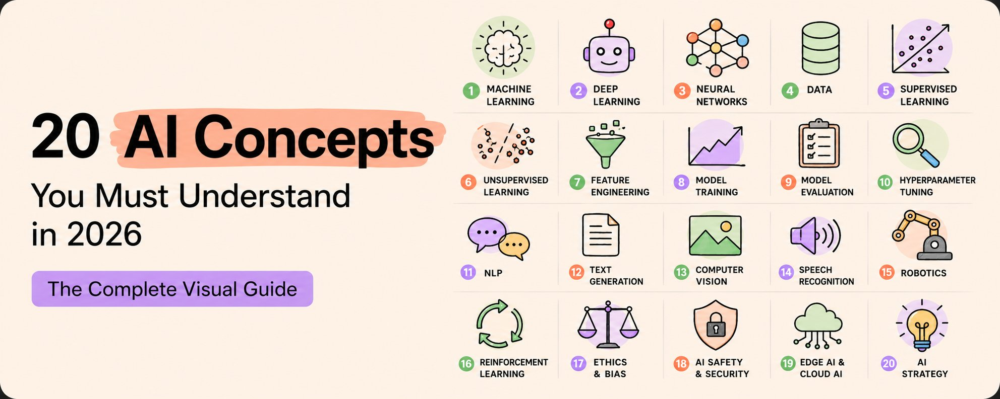

每个人都在用AI。

但几乎没人真正理解它到底是怎么工作的。

人们随口抛出transformers、embeddings、RAG、agents、RLHF这些词……

……就好像这些概念已经人尽皆知。

但大部分人其实并不懂。

说实话？

当你看清这些思维模型之后，AI并没有那么复杂。

ChatGPT。Claude。Midjourney。Cursor。编程 Agents。

只要你理解下面这20个概念，它们就都说得通了。

不需要PhD学位。不需要专业术语。只有简单解释和直观的图。

收藏起来，你会反复用到。

## 第一部分：AI是如何工作的（一切的基础）

**1. 神经网络**

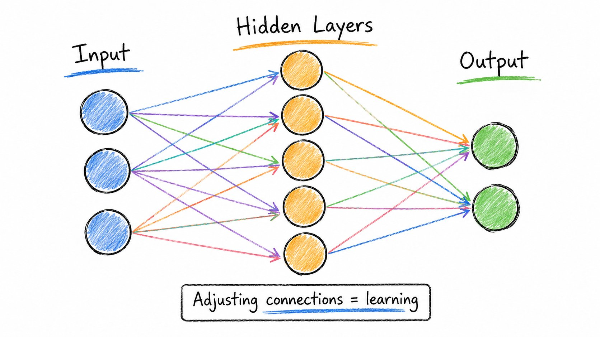

每个AI模型的大脑。

神经网络是一层层连接的管道。

→ 数据进入输入层 → 经过隐藏层 → 输出预测结果

每个连接都有一个"权重"——一个微小的数值，控制着一个神经元对下一个神经元的影响程度。

训练 = 调整数十亿个权重，直到输出准确。

简单的概念，疯狂的规模。

GPT-4有约1.8万亿参数。Claude 3 Opus有数千亿参数。

都是基于同一个基本概念：带有可调连接的层级神经元。

**2. 分词（Tokenization）**

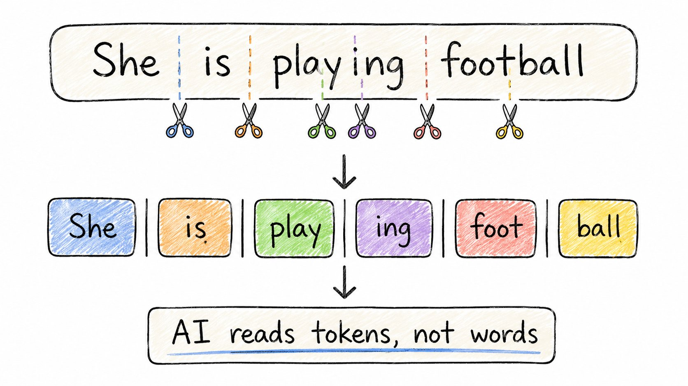

在AI阅读你的文字之前，它先把文本拆成小块，叫做token。

不一定是完整的词。

"playing" → "play" + "ing"
"ChatGPT" → "Chat" + "G" + "PT"
"dog" → "dog"（保持完整）

为什么不直接用完整的词？

因为语言是混乱的。新词、拼写错误、混合语言。固定的词表会大得不可能管理。

Token是可复用的构建模块。

即使模型从未见过某个词，它也能通过把它拆成熟悉的片段来理解它。

粗略规则：1个token ≈ 0.75个词。

1000个token ≈ 750个词。

**3. Embeddings（嵌入向量）**

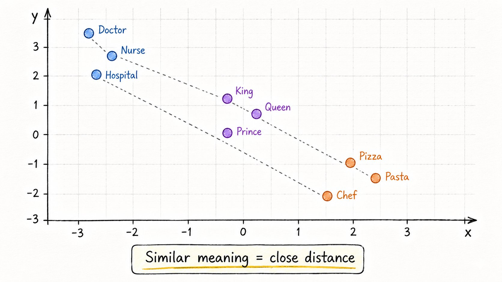

文本被分词后，每个token变成了一个数字。

这个数字就是embedding——一个代表含义的向量。

把它想象成词语的Google Maps。

→ "Doctor"和"Nurse"距离很近 → "Doctor"和"Pizza"距离很远 → "King" - "Man" + "Woman" ≈ "Queen"

模型不像你那样理解词语。

它理解的是距离和方向。

这就是以下技术的底层原理：
→ 语义搜索
→ 推荐系统
→ RAG系统

一切"理解意图"的东西，底层都在用embeddings。

**4. 注意力机制（Attention）**

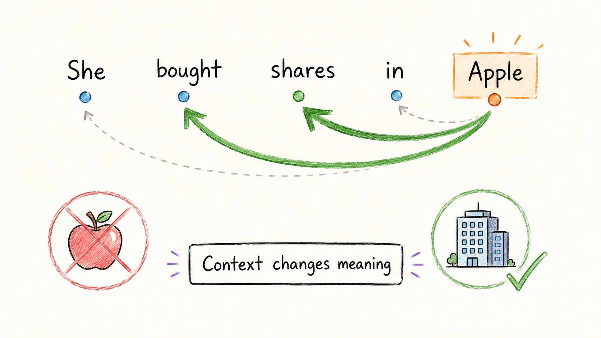

"Apple"这个词有不同含义：

→ "I ate an Apple" → 水果
→ "I bought Apple stock" → 公司

光靠embeddings解决不了这个问题。

注意力机制可以。

注意力让每个词可以查看句子中的所有其他词，决定什么才是重要的。

在"She bought shares in Apple"中：
→ "Apple"对"shares"和"bought"给予高度注意力
→ 模型推断：这是公司，不是水果

在注意力机制之前，模型从左到右阅读。慢，有限。

引入注意力后，模型一次看到整个句子。

这一个概念，解锁了现代AI。

**5. Transformer**

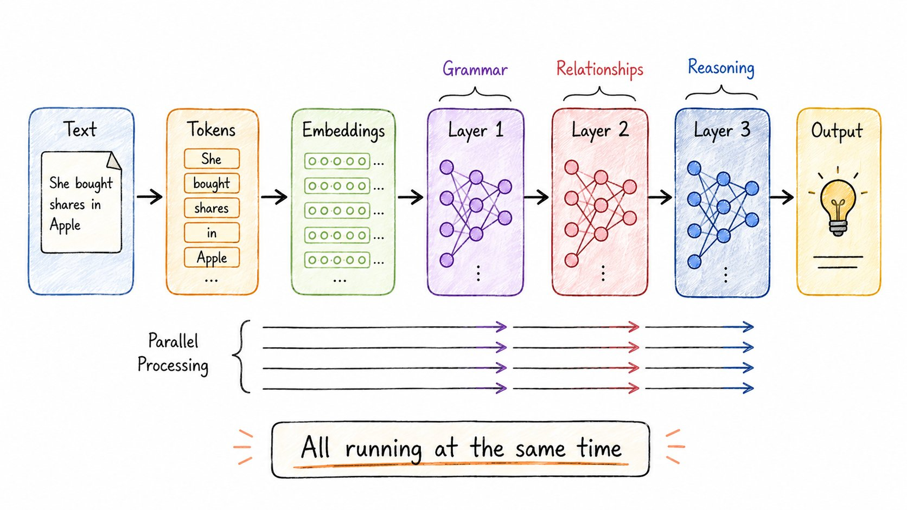

几乎所有现代AI模型背后的架构。

2017年在论文《Attention Is All You Need》中提出。

突破：不再一次一个词地读取文本，而是用注意力机制并行处理一切。

工作原理：
→ 文本 → Token → Embeddings → 堆叠的注意力层 → 输出

每一层都深化理解：
→ 早期层：语法、基本结构
→ 中间层：词语关系
→ 深层：复杂推理

结果：训练速度大幅提升，输出质量也更好。

GPT。Claude。Gemini。Llama。Mistral。

都是Transformer。

如果你理解了这一个架构，你就理解了现代AI。

## 第二部分：LLM是如何工作的（当你和AI聊天时，实际发生了什么）

**6. LLMs（大语言模型）**

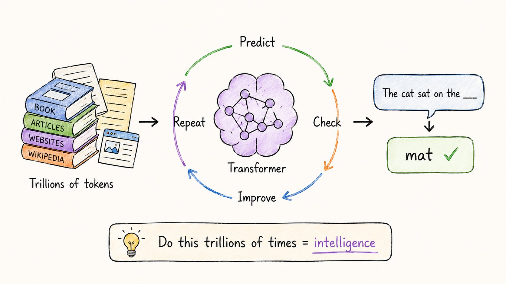

LLM是一个在海量文本上训练过的Transformer。

书籍、网站、代码、Wikipedia、Reddit。

数万亿个token。

训练任务听起来简单到不可能有威力：

→ 预测下一个token。

就这样。

但当你在数万亿个例子上重复这个任务时，奇妙的事情发生了。

模型学会了语法。然后是推理。然后是写代码、翻译语言、解数学题。

没人告诉它要做这些。

它从大规模next-token预测中自然涌现。

"大" = 数千亿参数。训练成本 = 数百万美元。

ChatGPT、Claude、Gemini → 都是LLM。

**7. 上下文窗口（Context Window）**

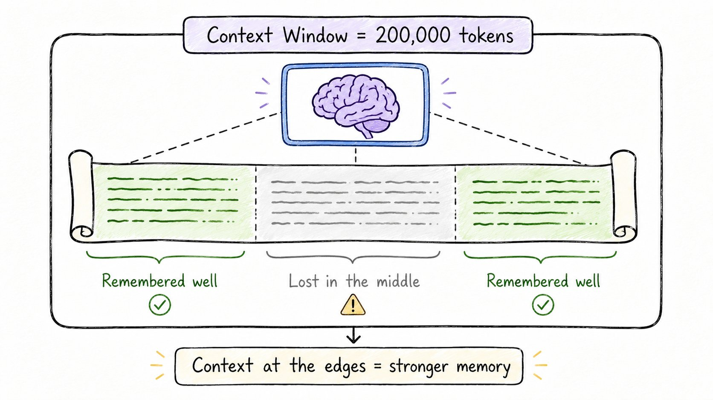

每个AI模型都有记忆限制。

叫做上下文窗口。

这是模型一次能"看到"的最大token数——你的消息 + 它的回复 + 对话历史。

早期GPT：约4000个token。GPT-4：128,000个token。Claude 3.5：200,000个token。Gemini 1.5 Pro：1,000,000个token。

窗口越大 = 上下文越多 = 答案越好。

但有个问题。

模型不会均匀阅读上下文的一切。

它们聚焦在开头和结尾。

中间部分？经常被忽略。

这叫做"中间迷失"问题。

大上下文窗口 ≠ 完美记忆。

理解这一点就能解释为什么AI有时会"忘记"你明明提到过的东西。

**8. 温度（Temperature）**

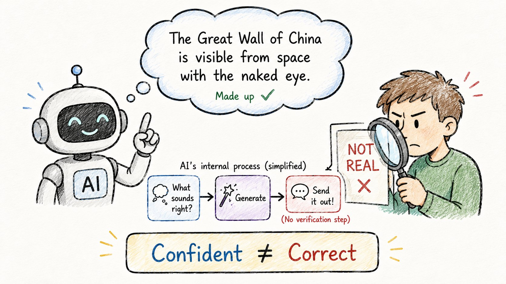

当AI生成文本时，它不是每次都选最可能的下一个词。

它有一个旋钮叫温度。

→ Temperature = 0：总是选最安全、最可预测的词
→ Temperature = 1：更有创意，更多变化
→ Temperature = 2+：变得狂野，有时不连贯

低温度 → 适用于：代码、事实、总结
高温度 → 适用于：头脑风暴、创意写作、变体

大多数工具会自动帮你设置。

但理解它能解释为什么AI有时看起来很"无聊"，有时又让你惊喜。

**9. 幻觉（Hallucination）**

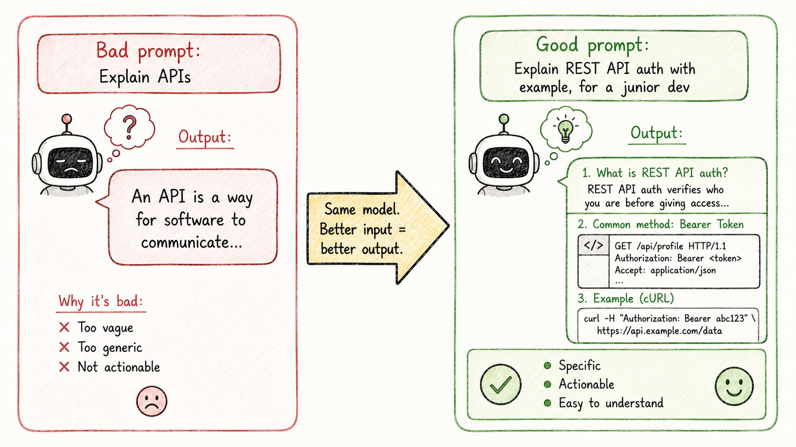

AI自信地撒谎。

不是故意的。它真的没办法。

原因如下。

LLM不搜索真理。

它预测最可能的下一个token是什么。

如果一个错误的陈述看起来像是基于训练模式"应该接下来出现"的东西，它就会生成它。

没有验证。没有查询。纯粹的模式匹配。

所以它会：
→ 引用一个根本不存在的论文
→ 编造一个从未被创建的API函数
→ 以完全自信的态度陈述一个虚假的历史"事实"

这叫幻觉。

解决方法：永远不要在未验证的情况下信任AI的事实输出。

用RAG（概念16）让它基于真实数据。

**10. 提示词工程（Prompt Engineering）**

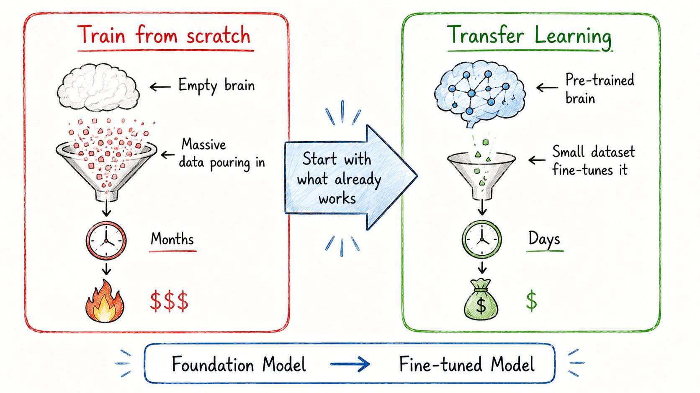

你提问的方式决定一切。

同样的模型，同样的问题，不同的问法，结果截然不同。

糟糕的提示：
→ "解释API"
→ 得到：模糊的、表面层面的回答

好的提示：
→ "解释REST API如何处理认证。给一个带代码的真实例子。假设我是初级开发者。"
→ 得到：具体的、结构化的、立刻有用的回答

提示词工程就是清晰的沟通。

真正有效的技巧：
→ 给出背景（"我在做一个X的SaaS"）
→ 指定角色（"扮演资深后端工程师"）
→ 展示例子（"这是我喜欢的格式：___"）
→ 明确输出要求（"给我5个选项，用编号列表"）
→ 把复杂的请求拆成步骤

提示词工程不是 hack。

这是你和模型沟通的主要方式。

## 第三部分：AI模型如何改进（从原始模型到有用产品）

**11. 迁移学习（Transfer Learning）**

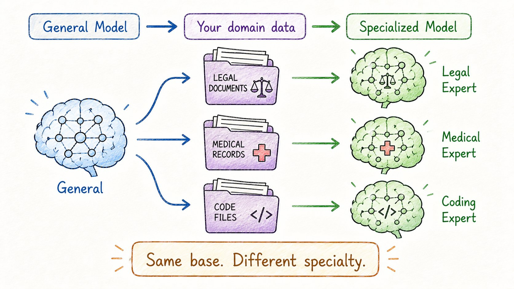

从头训练很贵。

疯狂大量的数据。海量计算。数周训练。

迁移学习解决了这个问题。

你用一个已经在庞大通用任务上训练好的模型，把它适配到特定用途。

你不是从零开始。你是在已有基础上构建。

可以这样理解：

→ 你已经会骑自行车了
→ 在这基础上学摩托车快得多
→ 因为你可以迁移你已有的知识

这就是当今大多数AI产品的运作方式：

→ OpenAI训练庞大的基础模型
→ 公司针对特定用例微调它
→ 节省数百万计算成本和数月训练时间

没有公司再从头训练了。

**12. 微调（Fine-Tuning）**

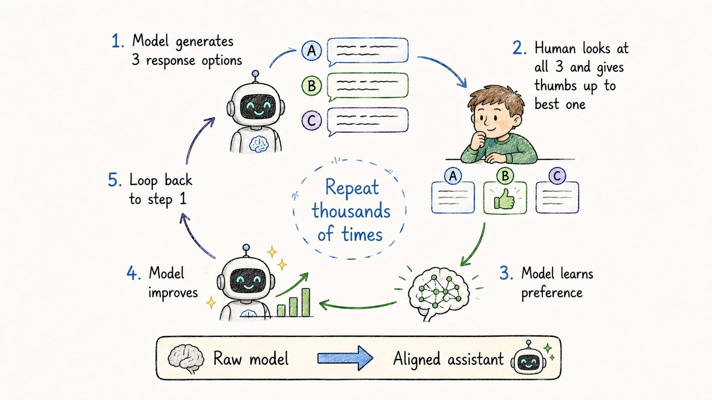

迁移学习告诉你概念。

微调告诉你怎么做。

你拿一个预训练好的模型，在更小、更专注的数据集上继续训练。

模型已经会说"语言"了。

现在你在教它你的特定领域。

例子：
→ 在临床笔记上微调的医疗模型
→ 在合同上微调的法律模型
→ 在GitHub上微调的编程模型

结果：一个完美适配你用例的模型。

代价：你需要更新数十亿参数。

这需要大量计算——多GPU、扎实的基础设施。

（这就是LoRA——下一个概念——如此重要的原因。）

**13. RLHF（基于人类反馈的强化学习）**

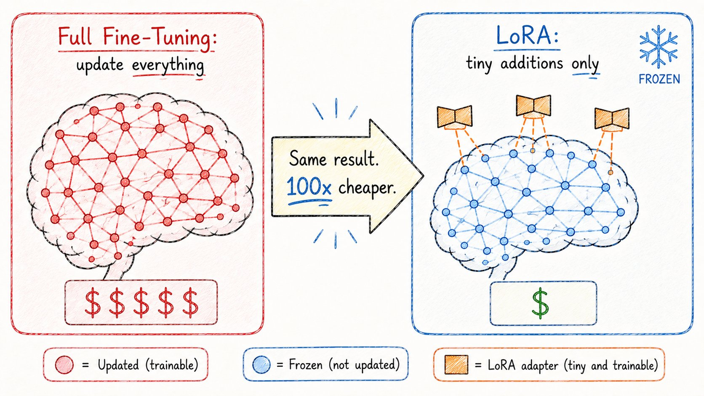

微调让模型专业化。

RLHF让它们感觉有用且安全。

没有它：模型只是预测文本。流畅，但不对齐。

有了它：模型学会人类真正喜欢什么。

工作原理：

→ 给模型看一个提示
→ 模型生成多个回复
→ 人类对回复排序
→ 模型学会偏好人喜欢的

重复数千次。

模型建立了"好答案"的感觉：
→ 清晰
→ 有用
→ 诚实
→ 安全

这就是ChatGPT和Claude感觉像助手的原因——而不是随机文本生成器。

没有RLHF，它们仍然令人印象深刻。但用处少得多、信任度低得多、控制难度大得多。

**14. LoRA（低秩适应）**

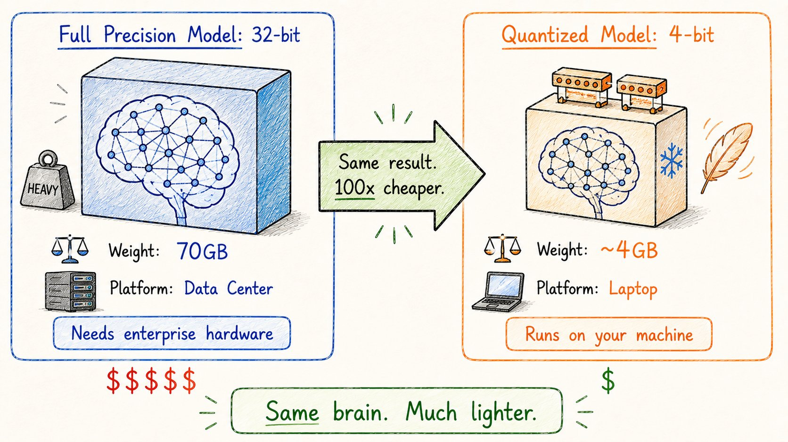

微调很强大，但很贵。

更新数十亿参数需要多GPU和扎实的基础设施。

LoRA解决了这个问题。

不是改变整个模型，LoRA：

→ 保持原始模型冻结
→ 在顶部添加微小的可训练层
→ 这些层只占完整模型的一小部分

洞察：大多数微调改动都很小。

你不需要重写整个模型。

你只需要小的、有针对性的调整。

结果：
→ 在单张消费级GPU上微调：可行
→ 存储一个基础模型 + 切换不同LoRA适配器：实用
→ 多个专业化模型而无需大量存储：做到了

LoRA是开源AI爆发的原因。

突然任何人都能在笔记本上微调强大模型。

**15. 量化（Quantization）**

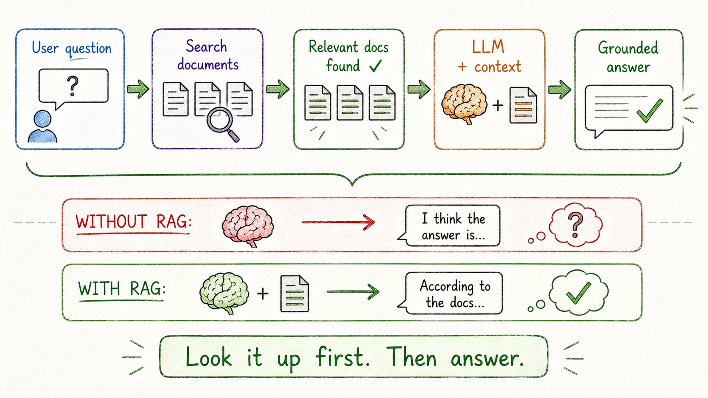

模型越来越大。

运行它们需要大量内存和计算。

量化让它们更小、更便宜运行。

方法：降低每个权重的精度。

用全精度存储的权重使用32位。

量化到4位 → 小8倍。

神奇的是：质量下降通常小得惊人。

这就是为什么现在你可以：
→ 在MacBook上运行LLaMA
→ 在消费级GPU上本地运行Mistral
→ 在手机上运行强大模型

没有量化，大模型会一直被锁在数据中心。

有了量化，它们可以在你的机器上运行。

## 第四部分：真正的AI系统是如何构建的（你实际使用的产品背后是什么）

**16. RAG（检索增强生成）**

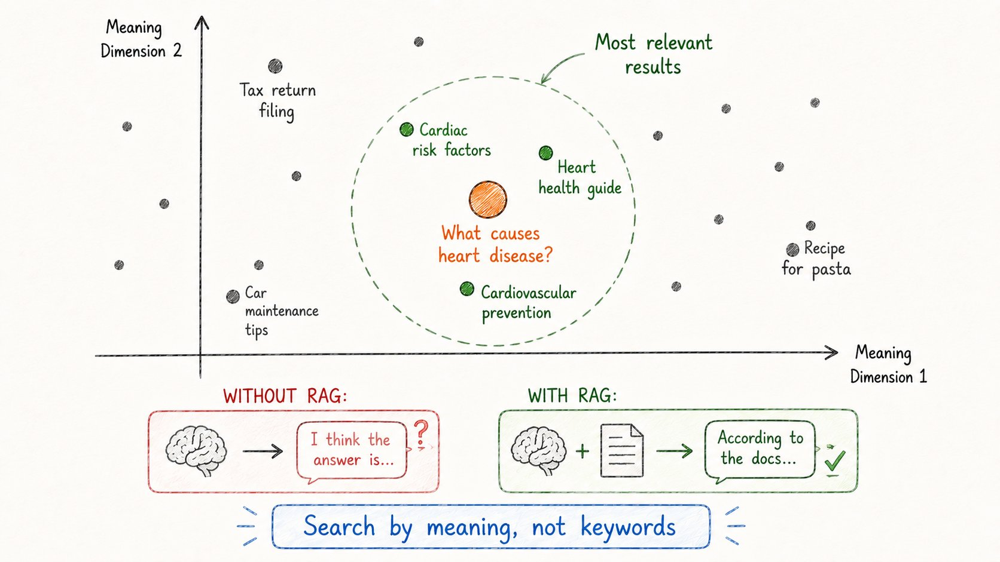

LLM产生幻觉，因为它们靠记忆回答。

RAG通过让它们先查找来解决这个问题。

工作原理：

1. 用户提问
2. 系统在知识库中搜索相关文档
3. 这些文档作为上下文传给模型
4. 模型用真实信息回答——不是猜测

可以这样理解：

→ 闭卷考试（无RAG）：靠记忆回答，经常错误
→ 开卷考试（RAG）：查资料，准确得多

为什么强大：
→ 数据变化时不需要重新训练——只需更新文档
→ 模型总是用最新、准确的信息工作
→ 大幅减少幻觉

每个正经的AI产品都用RAG。

客服机器人、法律工具、医疗助手、内部知识库。

**17. 向量数据库**

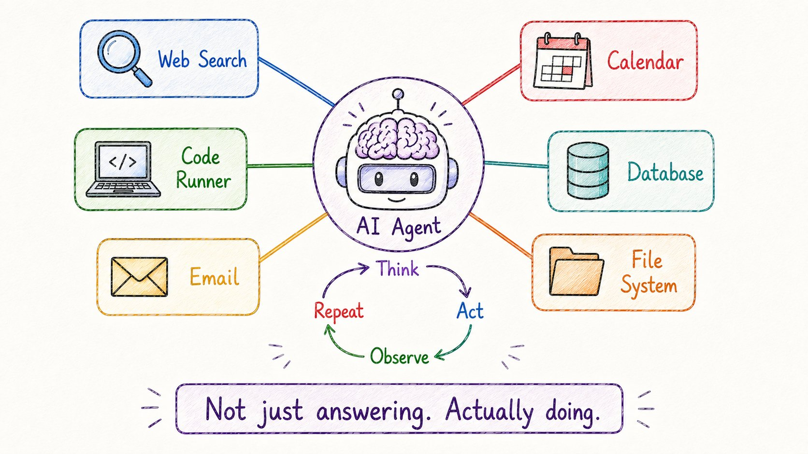

RAG需要快速找到正确的文档。

但如何通过含义——而不仅仅是关键词——搜索数百万文档？

向量数据库。

工作原理：

1. 每个文档转换为embedding（数字向量）
2. 这些向量存储在数据库中
3. 当用户提问时，问题也变成向量
4. 数据库找到与问题向量最接近的向量
5. 返回语义最相似的文档

为什么比关键词搜索更好：

→ "heart disease treatment" 能找到关于"cardiac care protocols"的文档
→ 即使词语不匹配，但含义匹配

工具：Pinecone、Qdrant、Weaviate、pgvector

向量数据库是AI系统"理解"——而不仅仅是匹配字符串——的关键。

**18. AI Agents**

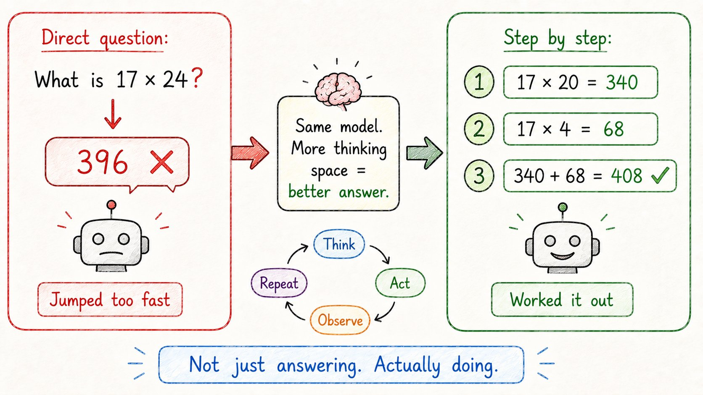

LLM回复消息。

AI Agent真正做事。

区别：

→ LLM：你问，它答，完了
→ Agent：你给目标，它规划、行动、检查结果、调整、重复

Agent循环：

思考 → 行动 → 观察 → 重复

例子：编程Agent修复bug
→ 读取问题
→ 探索代码库
→ 定位问题
→ 写修复
→ 运行测试
→ 看失败哪里
→ 调整修复
→ 重复直到完成

模型是大脑。工具是手。

Agent能用哪些工具？
→ 网络搜索
→ 代码执行
→ 文件系统
→ API
→ 邮件/日历
→ 数据库

Agent把AI从聊天机器人变成了协作者。

**19. 思维链（Chain of Thought）**

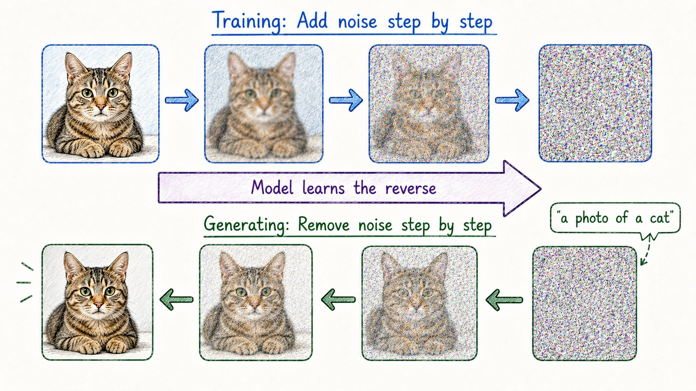

有时候AI得到错误答案，不是因为它笨。

而是因为它太快跳到答案了。

思维链解决了这个问题。

不要直接要最终答案：

→ "解：如果火车以60mph行驶2.5小时，多远？"

让它一步步思考：

→ "分步解：速度=60mph，时间=2.5小时，距离=速度×时间=？"

模型走过推理过程：
→ 第1步：确定公式
→ 第2步：代入数字
→ 第3步：计算

数学、逻辑、多步问题可靠得多。

洞察：给模型空间思考，而不是只是反应。

这就是"分步思考"或"仔细推理"这类提示真的有效的原因。

**20. 扩散模型（Diffusion Models）**

目前为止说的都是文本。

扩散模型解释AI如何生成图像。

这个过程是反直觉的。

模型不是学习画画。

它学习销毁图像。

训练：
→ 从真实图像开始
→ 逐步添加噪声直到变成纯静态
→ 训练模型反转这个过程——逐步去除噪声

生成：
→ 从纯噪声开始
→ 模型逐步去除噪声
→ 由你的文本提示引导
→ 图像从随机中出现

名字来自物理学——粒子通过介质随机扩散，就像墨水在水中散开。

这里，模型学习反转那个扩散过程。

不只是图像了：
→ 视频（Sora、Runway）
→ 音频
→ 3D内容
→ 药物分子

扩散模型是AI生成任何视觉内容的方式。

20个概念就这些了。

让我总结一下：

**AI是如何工作的：**

→ 1. 神经网络 — 分层模式学习

→ 2. 分词 — 把文本拆成碎片

→ 3. Embeddings — 作为数字的含义

→ 4. 注意力 — 上下文改变含义

→ 5. Transformer — 一切背后的架构

**LLM是如何工作的：**

→ 6. LLMs — 大规模next-token预测

→ 7. 上下文窗口 — 记忆限制和中间问题

→ 8. 温度 — 创意旋钮

→ 9. 幻觉 — 自信地错误

→ 10. 提示词工程 — 你如何沟通

**模型如何改进：**

→ 11. 迁移学习 — 在已有基础上构建

→ 12. 微调 — 让模型专业化

→ 13. RLHF — 教它变得有用

→ 14. LoRA — 无成本的微调

→ 15. 量化 — 在小机器上运行大模型

**真实系统如何构建：**

→ 16. RAG — 先查再答

→ 17. 向量数据库 — 按含义搜索

→ 18. AI Agents — 从回答到行动

→ 19. 思维链 — 给它思考空间

→ 20. 扩散模型 — 从噪声到图像

你现在理解了AI实际是如何工作的。

大多数每天用AI的人并不懂。

这就是你的优势。

如果这有帮助：

→ 转发分享给你的网络
→ 关注 [@sairahul1](https://x.com/@sairahul1) 获取更多类似的拆解
→ 收藏以便参考

我写AI、构建产品和让你睡觉时也能运转的系统。

<blockquote>
  原文地址：<a href="https://x.com/sairahul1/status/2057740928908161461?s=46">https://x.com/sairahul1/status/2057740928908161461?s=46</a>
</blockquote>
