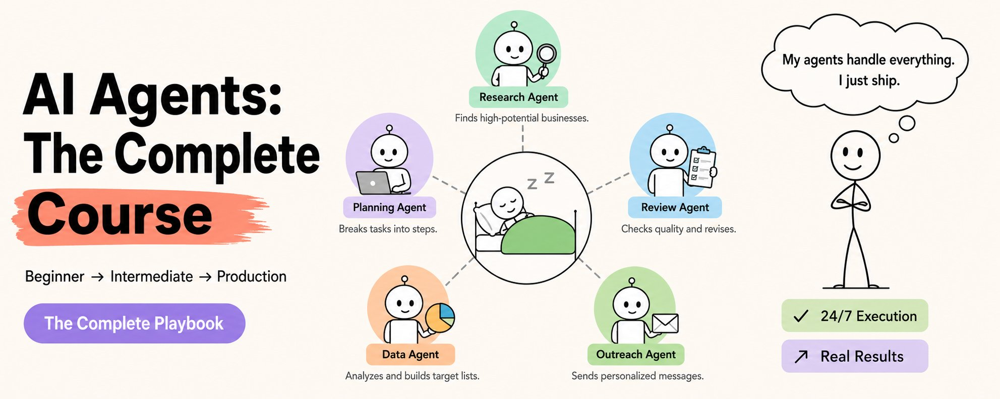

2026年每个人都在聊AI agents。

但大部分人根本不知道它们到底是怎么工作的。

今天开始改变这个状况。

我花了几周时间消化所有内容：课程、书籍、真实构建案例、生产环境中的失败。

以下是你真正需要知道的。

无论是你自己的工作流自动化，还是为公司构建生产级AI系统——这就是你的路线图。

收藏起来。这篇文章很长。但值得。

## 第一部分：入门 什么是AI Agent

## 1. 什么是AI Agent？

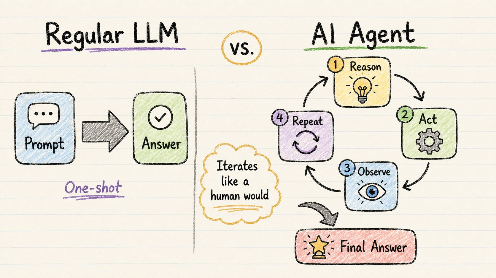

普通的LLM做一件事：

你问。它答。完了。

一次完成。线性。无迭代。

AI Agent的运作方式不同。

它像你真正处理复杂任务那样工作：

→ 先规划 → 研究 → 起草 → 自我审查工作 → 修改 → 重复

这叫做ReAct循环：

Reason（推理）→ Act（行动）→ Observe（观察）→ Repeat（重复）

模型推理下一步该做什么。然后行动（通常通过调用工具）。观察结果。然后要么给你答案，要么循环回去。

为什么这很重要？

每一轮迭代都增加深度。更强的推理。更少的幻觉。更的组织。

当你试图一次完成时失去的一切——agent都能找回来。

## 2. Agent实际上擅长什么？

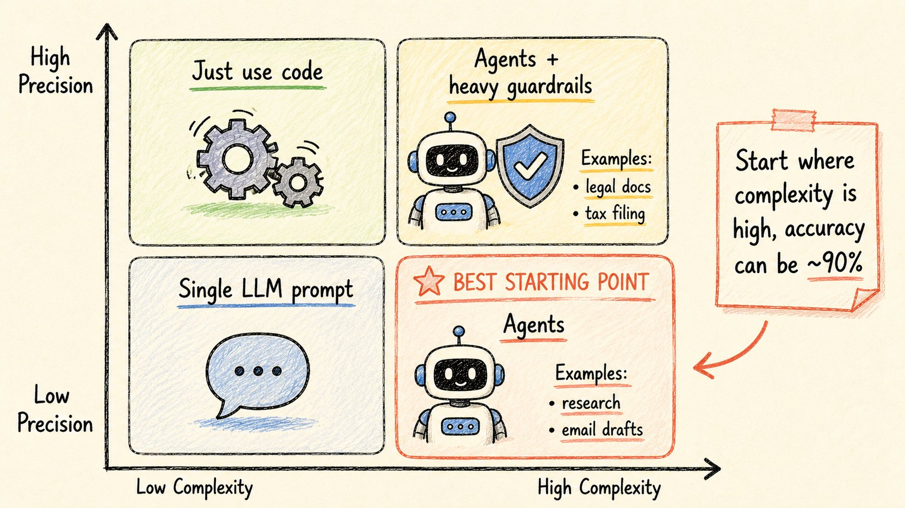

不是每个任务都需要agent。

正确的思维模型：一个2×2矩阵。

轴：复杂度 vs 需要精确度。

→ 低复杂度 + 高精确度 = 直接用代码
→ 低复杂度 + 低精确度 = 直接用一个LLM提示
→ 高复杂度 + 高精确度 = 带重护栏的agents（税表、法律文档）
→ 高复杂度 + 低精确度 = **最容易起步的甜蜜点**

最后一个象限是你最快能出成果的地方。

完美的agent任务例子：

→ 研究并写报告
→ 回复客户邮件（查订单 → 起草回复）
→ 处理发票
→ 保存到数据库
→ 通过实际检查库存来回答"你有80美元以下的蓝色牛仔裤吗？"

Agent擅长的任务特点：

→ 多步骤
→ 外部信息
→ 迭代和自我修正

如果一个提示就能解决——不要建agent。

## 3. 自主性光谱

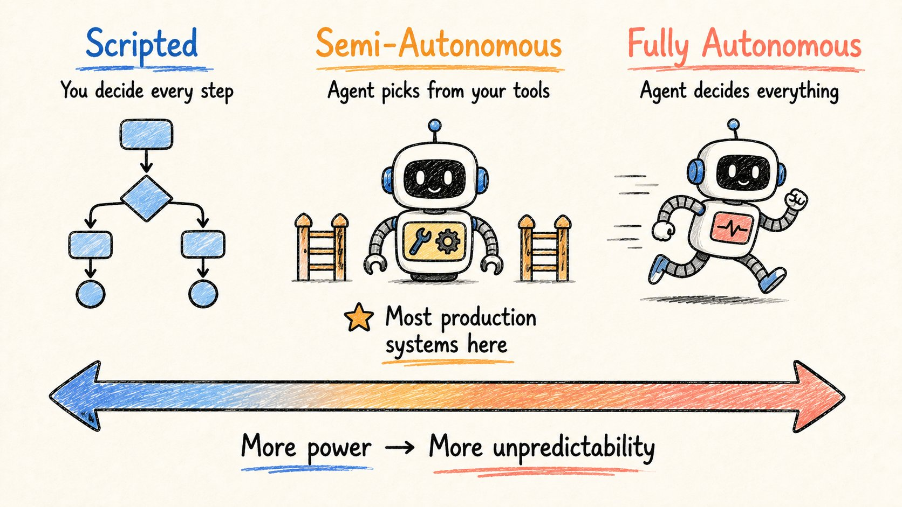

构建agent时的第一个重大决策：

你给它多少控制权？

把它想象成一个光谱。

**脚本化（左端）**

你硬编码每一步。

→ 生成搜索词
→ 调用网络搜索
→ 获取页面
→ 写文章。

模型只做文本生成。其他一切由你决定。可预测。易于调试。有限。

**半自主（中间）** Agent从你定义的工具中选择。在你设定的护栏内做决策。这是大多数真实生产系统的所在。

**完全自主（右端）** LLM决定一切。搜什么。获取多少页面。是否反思。是否写新代码并运行。更强大。更难控制。

从哪里开始？

光谱中间。给它工具。设护栏。只有建立信心后才增加自主性。

## 4. 上下文工程

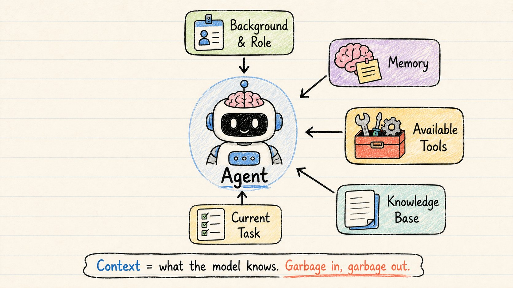

这就是真正让agent"智能"的原因。

不只是模型本身。

是你在它周围构建的上下文。

上下文工程 = 决定agent在每个时刻拥有什么信息。

包括：

→ **背景** — 任务是什么，用户是谁

→ **角色** — "你是一个专注于市场分析的调查agent"

→ **记忆** — 前几步发生了什么

→ **可用工具** — 它可以调用哪些函数

→ **知识** — 它可以参考的文档、数据库、PDF

工程做得好 → 模型行为一致。

工程做得差 → 不可预测的垃圾。

模型本身是一样的。

上下文才是区分优秀agent和崩溃agent的关键。

## 5. 任务分解

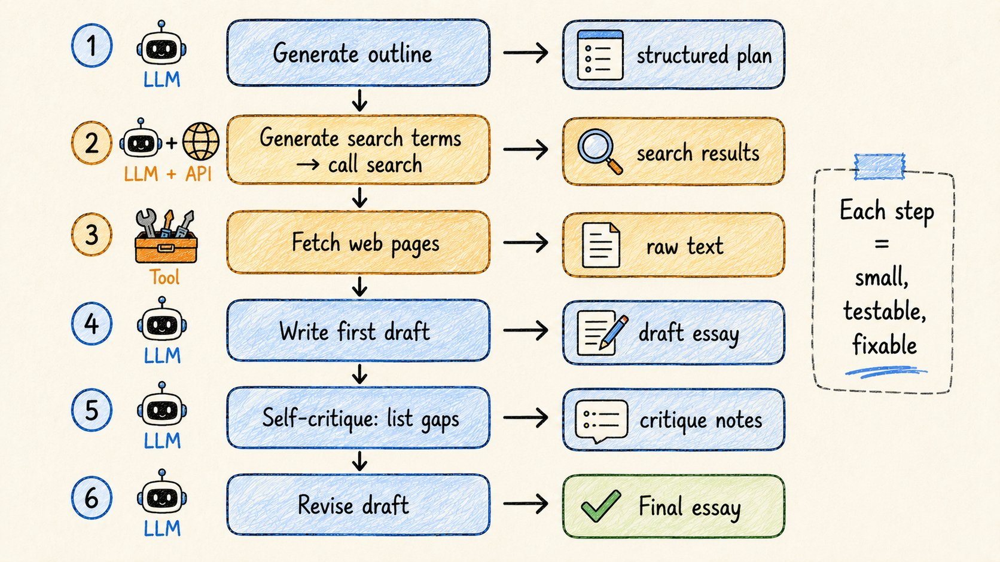

构建agents最重要的技能。

从这个问题开始：人类怎么做这个任务？

然后对每一步问：LLM能做这个吗？一点代码？API调用？

如果答案是不 → 继续拆分直到可以。

例子——写文章agent：

1. **大纲** → LLM生成结构
2. **搜索词** → LLM生成，然后调用搜索API
3. **获取页面** → 工具调用
4. **写草稿** → LLM使用获取的来源
5. **自我批评** → LLM列出差距和弱点
6. **修改** → LLM根据批评重写

每一步都是：
→ 小
→ 可检查
→ 有明确的输入和输出

当最终输出糟糕时，你确切知道哪一步需要修复。

这是分解的超能力。

## 第二部分：中级 构建真正有效的多Agent系统

## 6. 评估（区分专业人士和业余爱好者无聊但关键的事）

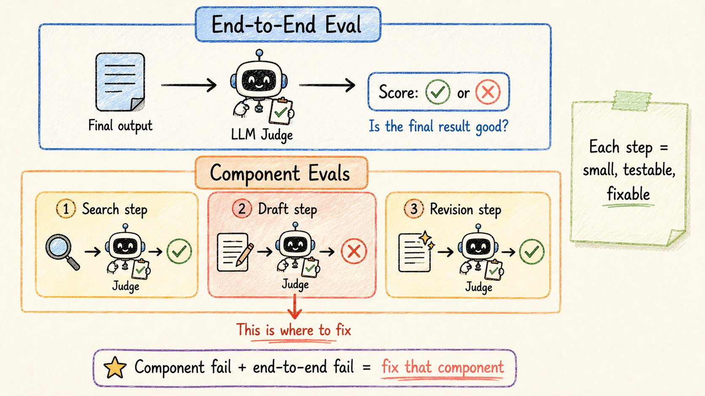

没人想聊评估。

但每个发布真实系统的人都在做。

如何衡量你的agent是否有效？

简单任务 → 统计正确答案。客服机器人正确回答库存问题了吗？是/否。

复杂任务 → 用LLM作为裁判。用第二个模型根据固定 rubric 给输出打分1-5。文章论点有力吗？有正确的引用吗？语气对吗？

你需要两个层次的评估：

→ **组件级** — 每个独立步骤是否有效？（搜索查询具体吗？批评传递的是真实反馈吗？）

→ **端到端** — 最终输出好吗？（文章真的好吗？）

如果端到端失败但组件评估通过 → 交接问题。如果特定组件失败 → 那个agent需要改进。

从第一天就开始评估。不要等"完美"的评估系统。先快速发布，然后迭代。

## 7. 记忆和知识

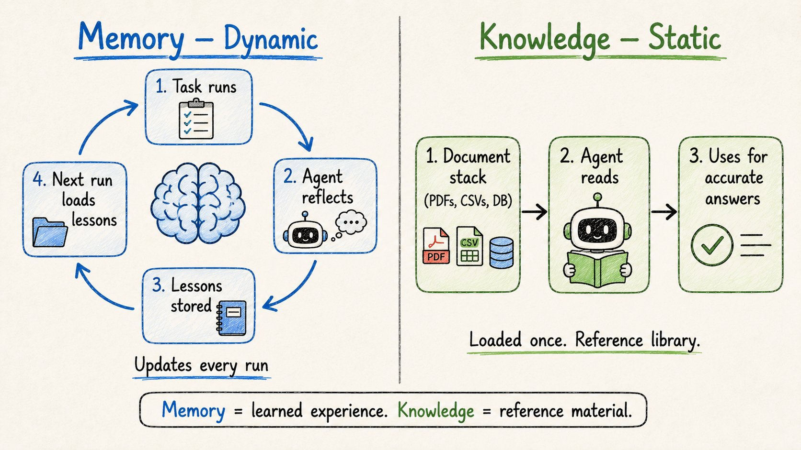

两件人们经常混淆的非常不同的事。

**记忆 = 动态。每次运行更新。**

→ 短期：agent工作时写笔记。其他agent可以读这些笔记。
→ 长期：任务完成后，agent反思。什么顺利？什么不顺利？存储经验教训。

下次运行 → 加载那些经验教训 → 应用它们。

这就是如何在不微调的情况下"训练"agent。给反馈 → agent在每次运行中改进。

**知识 = 静态。预先加载。**

→ PDF、CSV、内部文档、数据库访问
→ agent的参考库
→ 一次给。它在需要准确回答时从中提取。

这样理解：

记忆 = 你从经验中学到的东西。知识 = 你可以参考的教科书。

两者都很重要。都不能替代另一个。

## 8. 护栏

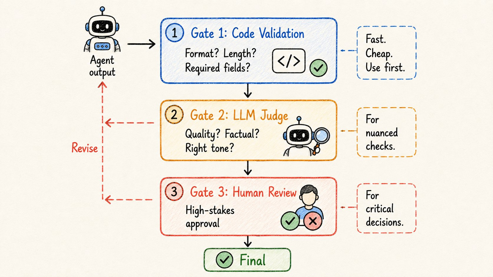

一个能工作的agent不等于一个安全的agent。

LLM是非确定性的。

它们可能格式错误、陈述错误事实、跑题。

护栏是"agent说完成了"和"任务实际完成"之间的质量门。

三种类型：

**类型1 — 代码检查（快 + 便宜）** 用于确定性事物。
→ 输出格式对吗？长度对吗？必需字段存在吗？
写一个简单的验证函数。立即运行。尽可能优先使用这个。

**类型2 — LLM裁判** 用于细微的质量检查。
→ "这个回复在事实上一致于源文档吗？"
→ "语气专业且积极吗？"
如果裁判说否 → 解释原因 → agent修改 → 重试。

**类型3 — 人工在循环中** 用于高风险决策。
Agent在最终确定前停止。发送输出供人工审查。人工批准、拒绝或请求更改。

大多数生产系统至少使用这三种中的两种。

## 9. 四种永远提升Agent的设计模式

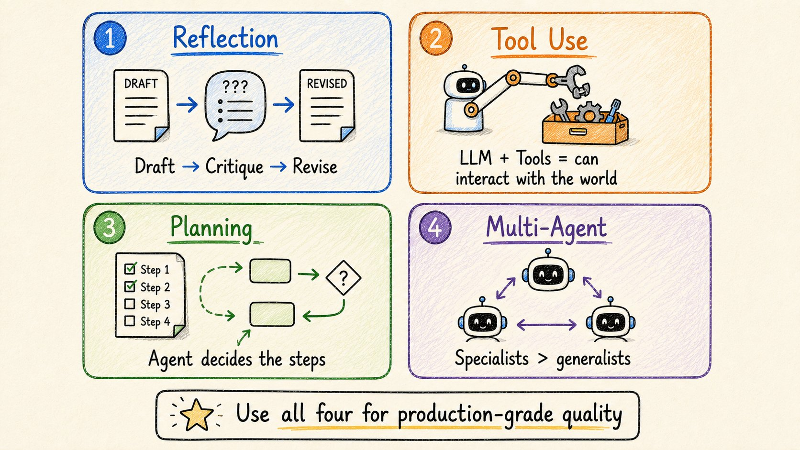

这四种模式可靠地让agents变得更好。

**模式1：反思**

不停留在第一稿。

模型生成输出 → 批评它 → 基于批评重写。

邮件v1："嘿，我们下个月见面吧。谢谢。"
批评：日期模糊，没有签名，语气太随意。
邮件v2："Alex你好，我们1月5-7日见面吧。告诉我哪个时间合适。Best, Sai."

在代码中甚至更强大——写它，运行它，捕获错误，反馈，模型修复。

用于：结构化输出、长篇写作、代码、程序步骤。

**模式2：工具使用**

给LLM一个它可以调用的函数菜单。

模型决定何时使用、使用哪个工具。

网络搜索。数据库查询。代码执行。日历。邮件。API调用。

LLM单独做不到这些。工具是agents与世界交互的方式。

**模式3：规划**

不是固定管道，让agent决定步骤。

给它一个工具包。提示它制定计划。逐步执行。

零售例子："有任何100美元以下的圆形太阳镜吗？"
Agent规划：搜索描述 → 检查库存 → 按价格过滤 → 回答。

你没有脚本那些确切步骤。是agent选择的。

**模式4：多Agent协作**

将复杂工作分割给专门的agents。

调查者 → 设计者 → 写作者。

每个agent都擅长它的特定工作。输出更好，因为没有单个agent试图做一切。

## 10. 多Agent系统设计

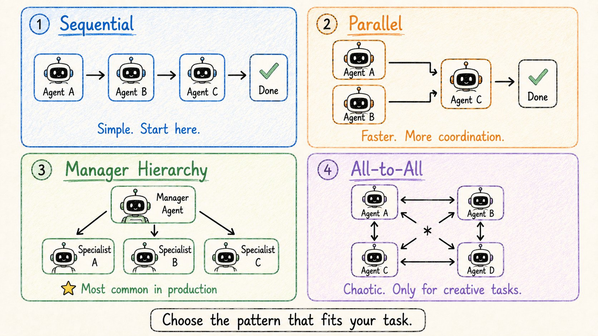

你如何实际构建多Agent系统？

四种协调模式，从最简单到最复杂。

**模式1：顺序**
每个agent完成 → 把输出传给下一个agent。像流水线。
调查者 → 设计者 → 写作者 → 完成。易于调试。可预测。从这里开始。

**模式2：并行**
同时运行独立的agents。
调查者 + 设计者同时工作。
写作者组合他们的输出。更快。更多协调复杂性。

**模式3：经理层级**
一个经理agent协调专家。
经理规划、分配、审查。
专家向经理报告，而不是互相报告。这是当今真实生产系统中最常见的模式。

**模式4：全对全**
任何agent可以向任何其他agent发消息。
混乱。难以预测。只适用于允许变化的开创性/低风险工作。不要在生产中使用。

经验法则：从顺序开始。只有需要时才增加复杂性。

## 第三部分：生产级 真正让你从原型到发布的

## 11. 高级任务分解

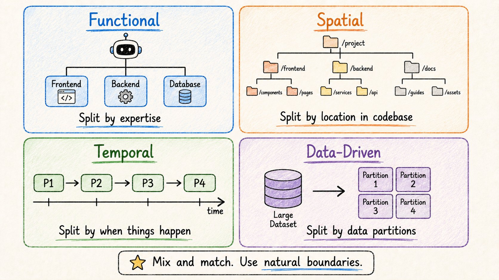

在复杂的多Agent系统中，你如何分解很重要。

4种模式：

**功能分解** — 按技术域分割。前端agent。后端agent。数据库agent。适合工程团队。

**空间分解** — 按文件或目录结构分割。
Agent 1处理/services/users/。Agent 2处理/services/orders/。适合大型代码库。最小化冲突。

**时间分解** — 按顺序阶段分割。
阶段1：研究。阶段2：规划。阶段3：构建。阶段4：发布。
每个阶段在下一个开始前完成。

**数据驱动分解** — 按数据分区分割。
Agent 1处理第1周日志。Agent 2处理第2周。等等。适合大数据集。并行化分析。

你可以混合这些。

主体结构用功能分解 + 每个agent内部用时间分解。

使用符合你任务自然边界的模式。

## 12. 在生产中提升质量

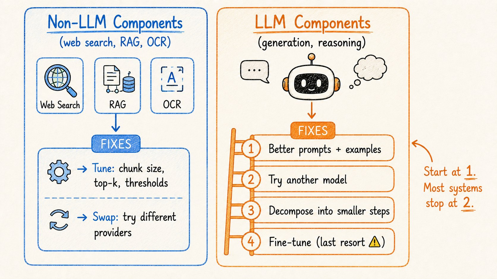

系统在工作但还不够好。

两类组件。两类不同的修复策略。

**非LLM组件**（网络搜索、RAG、OCR、代码执行）：

→ 调优旋钮：搜索日期范围、top-k结果、chunk大小、相似度阈值
→ 切换提供商：尝试不同的搜索API、视觉模型、解析器

**LLM组件**（生成、推理、提取）：

→ 更好的提示：添加约束、例子、输出schema
→ 尝试不同的模型：有些模型更擅长代码，有些更擅长遵循指令
→ 将困难任务分解成更小的块
→ 微调（最后手段——昂贵，留着用于最后几个百分点）

顺序很重要。

先修复提示。尝试不同的模型。进一步分解。最后微调。

大多数团队在第2步就达到足够好的质量。

## 13. 延迟和成本

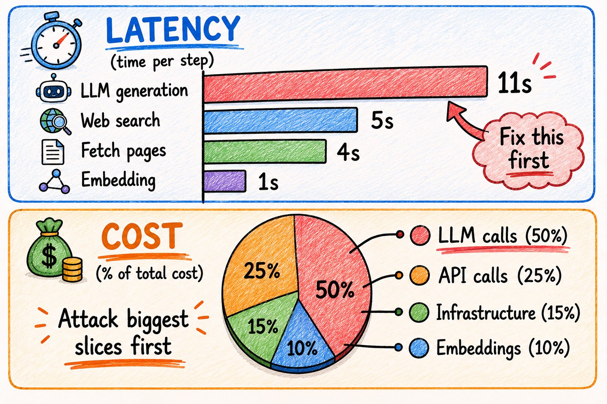

质量第一。然后是速度和成本。

**降低延迟：**

1. 测量每一步。找到真正的瓶颈。
2. 并行化任何不依赖另一步骤的东西。
3. 正确调整模型大小——简单步骤用快速便宜的LLM，推理用大模型。
4. 尝试更快的提供商——token流速度差异很大。
5. 精简上下文——更短的提示解码更快。

**降低成本：**

典型调查agent运行的实际成本分解：

→ LLM生成调用：约$0.04
→ 网络搜索API调用：约$0.02
→ Embedding调用：约$0.005
→ 基础设施：约$0.015
→ 单次运行总计：约$0.08

每天1000次运行 = $80/天 = $2,400/月。

如何削减：

→ 先攻击最大的成本桶
→ 模型分层——简单的用便宜的，难的用法贵的
→ 积极缓存结果（搜索结果、embeddings、摘要）
→ 约束输出（"返回JSON。最多5个字段。"）
→ 在可能的情况下批量操作

## 14. 可观测性：在规模上监控你的Agents

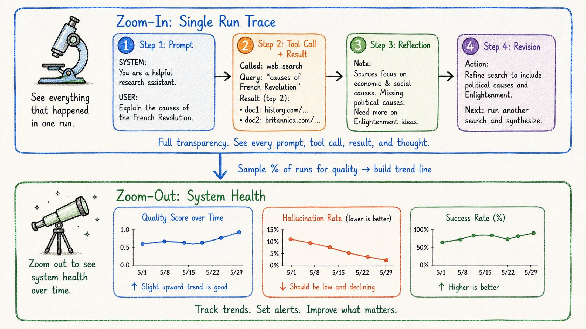

传统软件：追踪执行路径。A调用B。B调用DB。返回结果。

AI agents不像那样工作。

它们是非确定性的。同输入 → 不同输出。分布式执行。可能失败的外部依赖。

你需要两种可见性：

**放大指标（单次运行调试）**
→ 完整追踪：每个提示、每次工具调用、每个使用的token
→ 为什么agent选择这个工具？
→ 每步返回了什么？
→ 具体哪里失败了？

不仅要记录发生了什么，还要记录为什么："Agent选择网络搜索而不是RAG，因为查询包含'recent'"
"反思识别出3个问题：缺少引用、日期模糊、语气错误"

**缩放指标（跨多次运行的系统健康状况）**
→ 质量分数随时间变化
→ 幻觉率
→ 成功率
→ 变化是在帮助还是在伤害？

在规模上你不能手动检查每个追踪。

使用质量采样——评估所有运行的一个百分比。建立趋势线。

这就是在用户发现之前抓住回归的方法。

## 15. 安全：没人聊但应该聊的部分

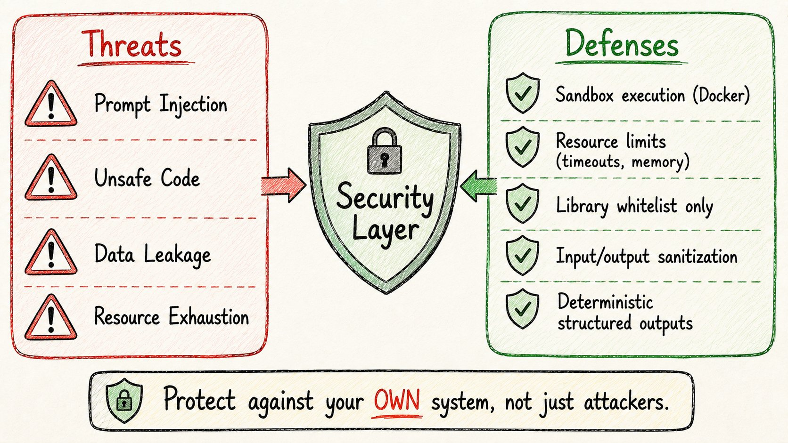

AI agents的安全不像传统应用安全。

你不只是防御外部攻击者。

你还要防御你自己的系统做出危险决策。

威胁：

→ **提示注入** — 用户输入中的恶意内容劫持agent的指令
→ **不安全的代码生成** — agent编写访问敏感数据或做有害事情的代码
→ **数据泄露** — PII或专有信息通过输出或工具调用暴露
→ **资源耗尽** — agents陷入无限循环或烧钱API调用

代码执行是最危险的功能。

如果你启用它，以下是安全做法：

→ 在Docker中沙盒化。每次运行后容器销毁。
→ 设置硬资源限制：超时、内存上限、CPU限制
→ 白名单只允许特定安全库
→ 在输入到达agent之前验证所有输入
→ 扫描所有输出中的敏感数据（API密钥、PII）
→ 使用确定性I/O — 代码返回结构化JSON，而不是面向用户的自由格式文本

大多数团队用惨痛代价学到这些经验。

发布前读这个。

这是完整教程。

## 总结

**入门级：**
→ Agents迭代工作——规划、行动、观察、重复
→ 最适合可以处理约90%准确度的复杂多步骤任务
→ 从半自主开始，不是完全自主
→ 上下文工程才是真正的智能
→ 任务分解是最重要的技能

**中级：**
→ 从第一天开始评估——复杂任务用LLM作为裁判
→ 记忆（动态）≠ 知识（静态）
→ 三种护栏类型：代码 → LLM裁判 → 人工
→ 四种永远有帮助的模式：反思、工具使用、规划、多Agent
→ 从顺序开始。只有需要时才增加协调复杂性。

**生产级：**
→ 4种分解模式：功能、空间、时间、数据驱动
→ 微调前先修复提示
→ 测量每步延迟和成本，然后攻击最大的桶
→ 两种可观测性模式：放大追踪 + 缩放健康指标
→ 安全 = 保护你自己的系统，而不只是攻击者

大多数开始构建agents。

很少有人发布能可靠规模化运行的agents。

差距就是这篇文章的一切。