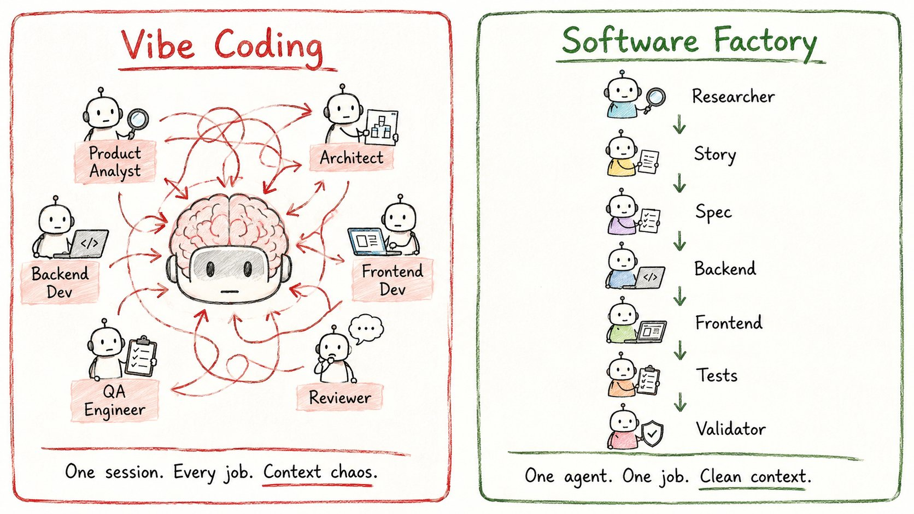
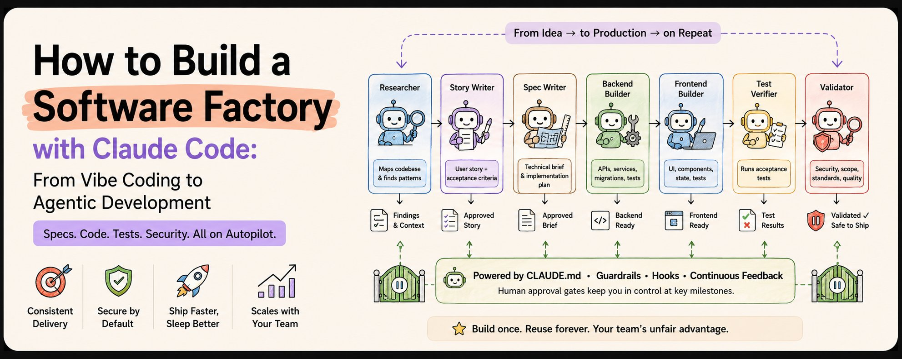
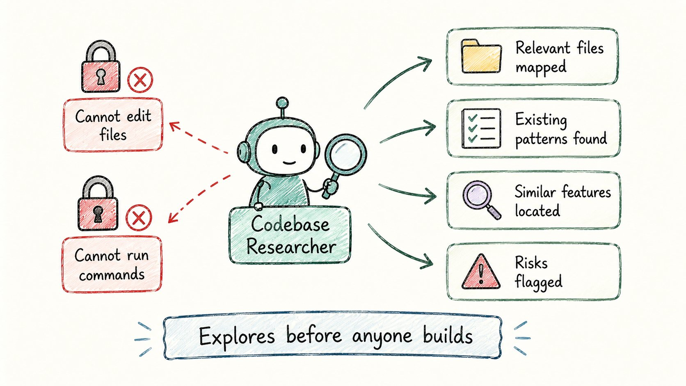
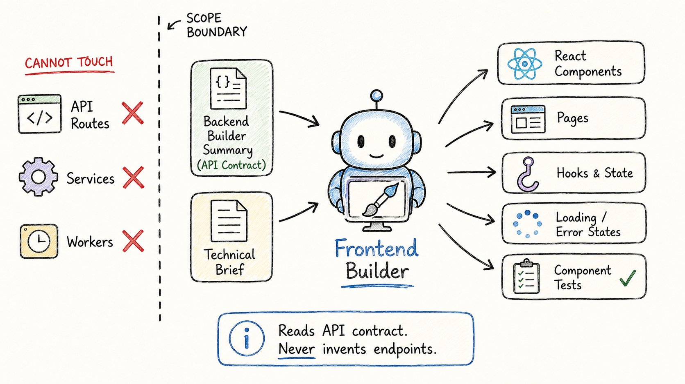
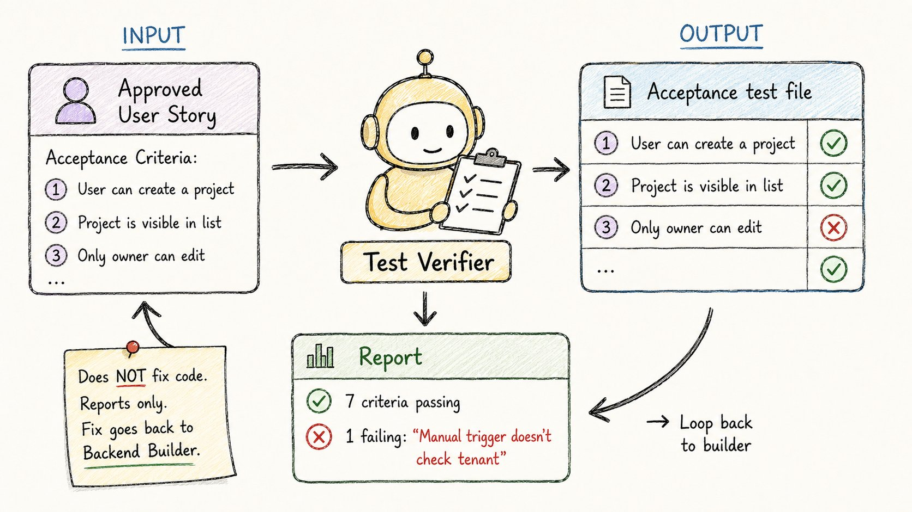
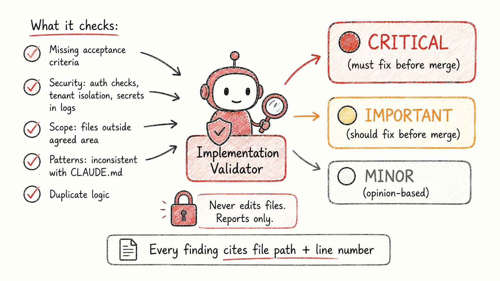
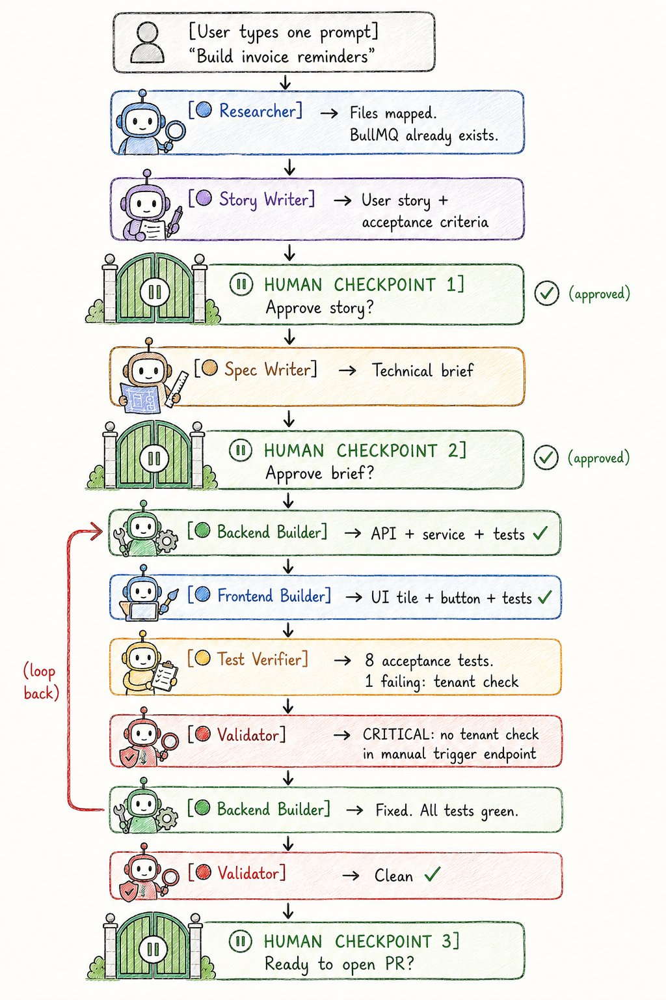

我以为我在用 AI 编程。

实际上我只是打字更快了。

这就是区别——以及那套彻底改变一切的 7 智能体系统。

收藏它。它能为你节省数月时间。

## 没人谈论的问题

**那种感觉高产实则无效的循环：**

→ 让 Claude 构建一个功能 → 它生成代码 → 出错了 → 把错误粘贴回去 → 它打补丁 → 又有东西坏了 → 再次提问

第 1 天：这感觉像魔法。

第 30 天：你花在监督 AI 上的时间比过去写代码的时间还多。

同一个逻辑出现在 3 个不同的地方。

Claude 忘记了你两周前设定的约定。

新功能破坏了旧功能。

测试缺失或很浅。

你醒来意识到：AI 没有失败。

是你的工作流程失败了。

**真正的问题在于结构。**

当你在 Claude Code 中输入"构建这个功能"时，你实际上是在让一个 AI 会话同时扮演：

→ 产品分析师 → 架构师 → 后端工程师 → 前端工程师 → 测试工程师 → 代码审查员

全部同时。

在同一个混乱的对话中。

计划中的错误假设会变成错误的数据库模型。

错误的数据库模型会变成错误的 API。

错误的 API 会变成错误的 UI。

等你发现时，错误已经蔓延到各处。

这叫"感觉编程"（vibe coding）。

它有一个硬上限。

## 转变：从"感觉编程"到软件工厂

**真正改变一切的东西：**

真正的工程团队不会在一个大对话里工作。

不同的人负责不同的工作：

→ 有人澄清用户问题 → 有人考虑架构 → 有人构建 API → 有人构建 UI → 有人考虑边缘情况 → 有人审查

当你把所有这些压缩到一个 AI 会话中时，错误会悄悄累积。

解决方案是将工作分配到**专业化的智能体**。

每个智能体获得：→ 一个专注的 job → 自己干净的上下文窗口 → 仅它真正需要的工具 → 关于它不能碰什么的严格规则

结果是：一个软件工厂。

一个开发者 + 七个专注的智能体 = 一个协调的团队。

以下是让这一切运转的七个智能体。

## 七个智能体

## 智能体 1：代码库研究员

开发者使用 AI 犯的最大错误是什么？

第一步就要求写代码。

AI 接受提示，填补空白的猜测，然后开始生成。

这就是坏设计潜入的时机。

代码库研究员解决了这个问题。

它唯一的工作：**在写任何一行代码之前，检查代码库并解释事情如何运作。**

它做什么：→ 映射相关文件及其角色 → 记录要遵循的现有模式 → 找到已经构建的类似功能 → 标记风险（时区、多租户、重试逻辑）→ 列出需要更新的测试

它不能做什么：→ 编辑文件（仅限只读访问）→ 运行任何修改状态的命令 → 做假设——它会提问而不是猜测

工具：仅限 Read、Grep、Glob。

规则：**每次都在构建之前探索。**

研究员首先运行。始终。

## 智能体 2：故事撰写员

大多数功能失败不是因为代码错了。

而是因为问题从未被清晰地定义。

故事撰写员在做出任何技术决策之前，将粗略的功能想法转化为真正的用户故事。

它收到的输入：→ 你粗略的功能描述 → 研究员的发现

它产生的内容：

**一个用户故事：**"作为一个 [角色]，我希望 [行为]，以便 [结果]。"

**验收标准：**测试可以直接验证的陈述。快乐路径。失败路径。业务规则。

**边缘情况：**边界、重试、多租户问题。

**范围之外：**明确不构建的内容。

**开放问题：**它真正不知道的事情——从不下猜测。

它不能做什么：→ 发明业务规则 → 编写任何代码或技术设计 → 如果有真正不清楚的事情就停止

工具：仅限 Read。

规则：**你阅读这个故事并在任何其他事情发生之前批准它。**

这是节省下游一切的人类检查点。

## 智能体 3：规格撰写员

一旦故事被批准，规格撰写员将其转化为技术简报。

这是每个构建智能体遵循的蓝图。

它收到的输入：→ 你批准的用户故事 → 研究员的发现 → 你项目的 CLAUDE.md 规则

它产生的内容：

→ 数据模型变更（字段、类型、迁移）→ 后台流程/流程 → API 变更（端点、请求/响应形状）→ 前端变更（组件、页面、hooks）→ 需要的测试（成功、失败、边缘情况）→ 风险和开放问题 → 每个将变更的文件

它不能做什么：→ 编辑任何文件 → 发明新基础设施——而是明确指出它 → 跳过租户隔离或时区问题 → 留下未回答的问题

工具：仅限 Read、Grep、Glob。

规则：**这份简报是第二个人类检查点。**

你在任何文件被触碰之前阅读并批准它。

如果你看到"将 ID 存储在内存中"——那是你的红旗。

现在捕获它。不是在 10 个文件被更改之后。

## 智能体 4：后端构建者

现在构建开始了。

后端构建者实现功能的后端部分——仅限后端部分。

它收到的输入：→ 批准的技术简报 → 研究员的发现 → 你项目的 CLAUDE.md

它构建什么：→ API 路由 → 服务和业务逻辑 → 数据库访问和迁移 → 后台作业 → 为它编写的所有内容编写单元测试

它不能做什么：→ 触碰 React 组件、页面或客户端 hooks（那是智能体 5 的工作）→ 在没有指示的情况下发明新依赖 → 修改超出约定范围的文件 → 在不运行类型检查、lint 和测试套件的情况下停止

完成后，它返回一个摘要：→ 每个添加或编辑的文件 → 每个重用的现有 helper 或模式 → 任何本可以提供帮助的 CLAUDE.md 规则

工具：Read、Edit、Write、Bash——仅限于后端文件夹。

分离就是重点。

**后端构建者永远不会意外破坏前端。永远不会。**

## 智能体 5：前端构建者

前端构建者实现 UI 部分——仅限 UI 部分。

它首先阅读后端构建者的摘要。

这很重要。

它精确地按照后端生成的方式消费 API。

它不会发明新的端点。

如果 API 形状对 UI 不正确，它将不匹配作为反馈呈现——而不是作为补丁。

它收到的输入：→ 批准的技术简报 → 研究员的发现 → 后端构建者的摘要（API 契约）

它构建什么：→ React 组件和页面 → 客户端 hooks 和状态 → 加载和错误状态 → 为它编写的所有内容编写组件和单元测试

它不能做什么：→ 触碰服务、API 路由、workers 或迁移（那是智能体 4 的工作）→ 发明端点或响应形状 → 在没有指示的情况下添加依赖 → 在不运行类型检查、lint 和测试套件的情况下停止

工具：Read、Edit、Write、Bash——仅限于前端文件夹。

两个构建者。

两个干净的上下文窗口。

一个破坏另一个工作的机会为零。

## 智能体 6：测试验证者

两个构建者都为各自的代码编写了单元测试。

这还不够。

测试验证者只做一件事：**证明该功能实际上做了用户故事所说的应该做的事情。**

它编写验收测试。

不是单元测试。

是验收测试。

这些测试从外部测试功能——以真实用户会体验的方式。

它收到的输入：→ 批准的用户故事（包含所有验收标准）→ 批准的技术简报 → 两个构建者的摘要

它产生的内容：→ 一个涵盖每个验收标准的验收测试文件 → 一份报告：哪些标准通过，哪些失败，哪些无法干净地覆盖

它不能做什么：→ 修改任何后端或前端代码 → 为无法测试的标准发明变通方法 → 如果一个标准真正没有被覆盖则不标记为已覆盖

如果测试失败：**该功能不满足故事。**

它报告哪个标准失败了。

它不修补代码。

那会回到正确的构建者。

工具：Read、Edit、Write（仅限测试文件）、Bash。

规则：**在验收测试通过之前，你没有功能。**

## 智能体 7：实现验证者

这是捕获所有其他人都错过的智能体。

验证者将当前实现与批准的故事和简报进行比较——并报告差距。

它从不修复任何东西。

它只说真话。

每次运行每个检查：

→ 故事中尚未实现的验收标准 → 没有测试覆盖的失败路径 → 安全问题：缺失的 auth 检查、租户隔离漏洞、日志中的 secrets、向客户端暴露的原始错误 → 超出约定范围变更的文件 → 与 CLAUDE.md 或现有代码不一致的模式 → 应该重用现有 helper 的重复逻辑 → 简报中悄悄跳过的时区或多租户问题

输出始终按严重性分组：

**关键**——合并前必须修复 **重要**——合并前应该修复 **轻微**——基于观点，审查者决定

每个发现都包含文件路径和行号。

如果没有问题，它会直说。

它不会为了显得彻底而编造问题。

工具：仅限 Read、Grep、Glob。

这个智能体是工厂值得信任的原因。

一份自评的论文毫无价值。

一个只看到磁盘上的内容——而不是如何编写的——的验证者是诚实的。

## 链条如何运行

**完整流程——一个提示启动一切：**

你打开 Claude Code 并输入：

"为超过 7 天未付款的发票构建提醒。"

以下是在你没有输入任何其他内容的情况下发生的事情：

**步骤 1 → 研究员**映射你的发票、付款和电子邮件代码。返回相关文件、现有模式、风险。

**步骤 2 → 故事撰写员**生成用户故事和验收标准。

**⏸** **暂停：你阅读并批准故事。**

**步骤 3 → 规格撰写员**将批准的故事转化为技术简报。

**⏸** **暂停：你阅读并批准简报。**（在这里捕获"将 ID 存储在内存中"的错误。）

**步骤 4 → 后端构建者**实现服务、API 路由、BullMQ 作业和单元测试。返回：变更的文件、重用的模式、所有测试通过。

**步骤 5 → 前端构建者**阅读后端构建者的 API 摘要，构建管理 UI 块和提醒按钮，编写组件测试。所有测试通过。

**步骤 6 → 测试验证者**为所有六个验收标准编写验收测试。报告：7 个通过，1 个失败——手动触发不检查租户所有权。

**步骤 7 → 验证者**发现它。用文件路径和行号报告为关键。

**→ 循环回到后端构建者。**应用修复。所有 8 个验收测试通过。验证者再次运行。干净。

**⏸** **暂停：你审查并打开 PR。**

三个人类检查点。

其他一切自行运行。

## 基础：在智能体工作之前，你需要这个

**CLAUDE.md——在每个会话中保留的记忆：**

每次你打开 Claude Code，它从零记忆开始。

CLAUDE.md 解决了这个问题。

它是 repo 根目录的一个 Markdown 文件，每个会话自动加载。

这是永久项目事实的所在：

→ 你的技术栈（Next.js App Router、Node.js、Prisma、BullMQ、Resend）→ 你的命令（npm run dev、npm test、npx prisma migrate dev）→ 架构规则（"业务逻辑存在于服务中。API 路由保持薄。"）→ 不要做的事情（"不要添加 cron——使用 BullMQ。不要记录原始 payment payloads。"）→ 深入文档的指针（docs/billing.md、docs/architecture.md）

保持它在 100-300 行。

每次 AI 做出让你惊讶的错误时，问：CLAUDE.md 中的规则能否防止这个？

添加规则。

几周后，你的 CLAUDE.md 成为 AI 每个错误假设的记录——你的会话会明显变得更好。

**上下文漂移——沉默的杀手：**

大多数 Claude Code 会话不会戏剧性失败。

它们漂移。

一个错误的假设进入上下文。

模型继续在其上构建。

你让 Claude 构建订阅管理。

它设计：User → Subscription。

你记得：订阅属于公司，而不是用户。

如果你只是说"不，订阅属于公司"——Claude 打补丁。

现在你有 user.subscriptionId 和 company.subscriptionId 两者漂浮周围。

**规则：**

→ 小拼写错误？直接更正。→ 错误的架构假设？扔掉对话，用正确的假设重新开始。

带有正确心智模型的干净会话每次都胜过打补丁的会话。

## 结果：真正改变什么

**工厂之前：**

→ 感觉编程循环：提示 → 生成 → 错误 → 补丁 → 重复 → 会话上下文充满噪音 → 错误的假设累积成破碎的功能 → 一个工程师一次只能做一件事 → 每个功能等待合适的人有空

**工厂之后：**

→ 结构化链：研究 → 故事 → 简报 → 构建 → 验证 → 验证 → 每个智能体获得仅包含它需要的干净上下文窗口 → 错误的假设在简报批准时被捕获——而不是在 10 个文件之后 → 一个工程师发送完整的垂直切片：后端、前端、测试、验证 → 团队最好的知识存在于智能体中——而不是被困在人身上

**真正的转变：**

支付专家构建一个支付集成智能体。

现在团队中的每个工程师都可以发送触及计费的功能。

无需等待。

无需交接。

前端 lead 的组件模式存在于前端构建者智能体中。

DevOps 工程师的 CI 检查存在于 hook 中。

QA lead 的边缘情况存在于测试验证者规则中。

**专家知识，作为智能体共享。**

而不是被困在可用性中。

## 如何在这个周末构建你的

**8 步设置检查清单：**

**1.** 安装 Claude Code → [code.claude.com](https://code.claude.com/)

**2.** 创建文件夹结构：→ .claude/agents/ → .claude/skills/feature-factory/ → .claude/skills/build-with-tests/ → .claude/hooks/

**3.** 编写你的 CLAUDE.md（100–300 行：技术栈、命令、架构规则、不要做的列表）

**4.** 使用 Claude Code 中的 /agents 命令创建 7 个智能体。描述每个智能体的角色。Claude 编写文件。你审查并提交。

**5.** 创建 feature-factory 编排器技能。让 Claude 编写它——它读取你的 7 个智能体文件并连接链条。

**6.** 创建 build-with-tests 技能。描述你的团队如何构建：匹配现有模式、随代码编写测试、最后运行类型检查。

**7.** 添加 pre-commit hook。阻止包含 .env、.key、.pem 或 secrets.json 文件的提交。只需要 5 分钟。防止灾难。

**8.** 通过完整链条运行一个真实功能。选择一个小功能。观察它在哪里绊倒。添加规则。工厂自行调整。

**总时间：2–3 小时。**

然后运行几个功能。

经过 3–4 个，工厂了解你的代码库。

你会花更少的时间监督。

更多时间决定下一步构建什么。

## 七个智能体——快速参考

→ **研究员**——在任何构建之前映射代码（仅 Read）→ **故事撰写员**——将想法转化为带验收标准的用户故事（仅 Read）→ **规格撰写员**——将故事转化为技术简报（仅 Read）→ **后端构建者**——构建 API、服务、作业、单元测试（仅后端文件夹）→ **前端构建者**——构建组件、页面、hooks、UI 测试（仅前端文件夹）→ **测试验证者**——针对用户故事编写验收测试（仅测试文件）→ **验证者**——将实现与故事和简报进行比较，报告差距（仅 Read）

**3 个人类检查点：**→ 批准故事 → 批准简报 → 批准 PR

其他一切自行运行。

大多数使用 Claude Code 的开发者仍在感觉编程。

提示 → 生成 → 补丁 → 希望。

这不是错的。

这只是有个上限。

工厂不会让你脱离流程。

它让你脱离不需要你的部分。

你留在你的判断重要的循环中：

这是正确的问题吗？这是正确的设计吗？安全可以发货吗？

智能体处理之间的一切。

这就是使用 AI 作为更快的键盘——

和使用 AI 作为协调团队——的区别。