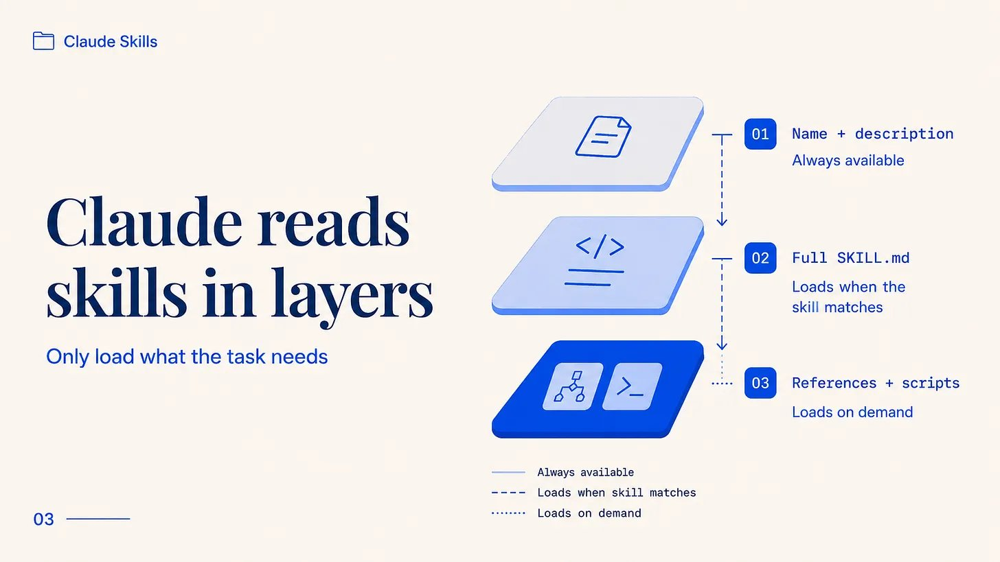
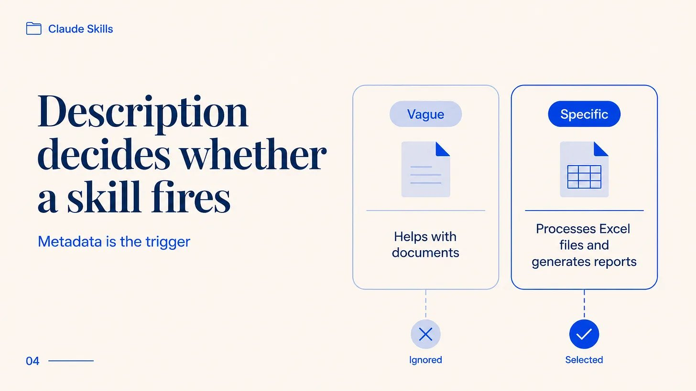
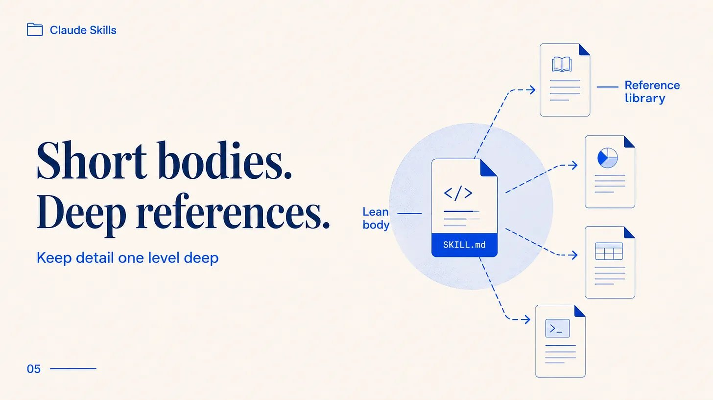
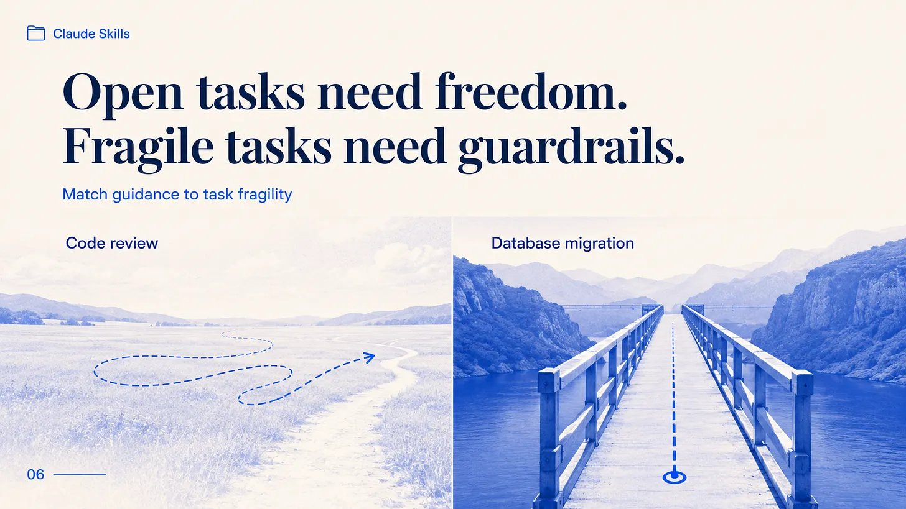
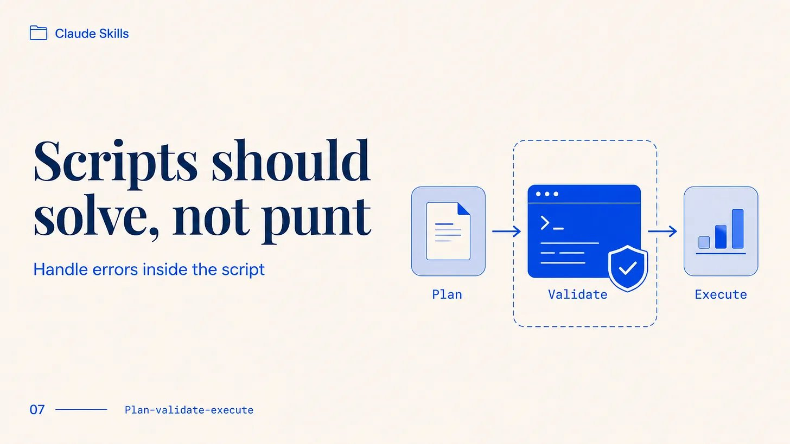
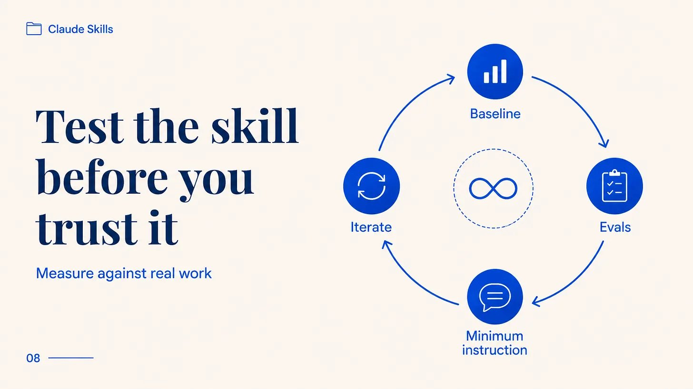
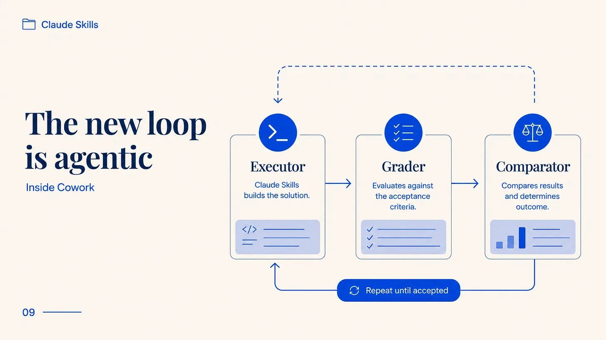
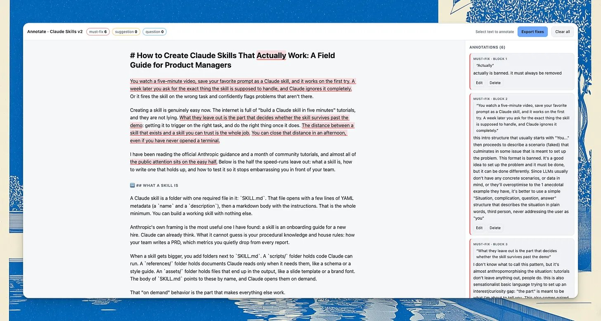
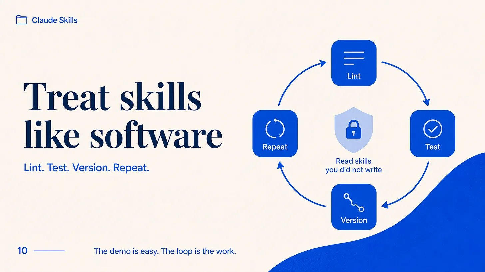

创建 Claude skill 其实很容易。网上到处都是「五分钟搞定」的教程，而且他们说的是真的。

读完 Anthropic 的官方指南和一个月社区教程后，一个模式越来越清晰：这些教程都只带你走一遍基础，而几乎没有人讲真正的活儿——怎么让 skill 在正确的任务上触发、触发后又该怎么表现。这恰恰是大多数 skills 失败的地方。看起来完成了，然后就被束之高阁，因为 Claude 根本不会去调用它，或者它在错误的请求上触发了，却标记了根本不存在的问题。

解决这个问题不需要多少时间，也不需要什么技术能力。Skills 用来修复 skills：我知道这听起来很怪，但说白了就是几个编写习惯加一个测试循环，这就是接下来要讲的内容。

## Skill 是什么

Claude skill 就是一个文件夹，里面只有一个必需文件：SKILL.md。这个文件开头是几行 YAML 元数据（名称和描述），然后是一段 markdown 体的使用说明。你只需要这些就能做出一个能用的 skill——这也正是为什么那么多人在这里就停下了，觉得在 .md 文件里写点文字和 frontmatter 就是一个好 skill。通常不是。

Anthropic 自己的定义是我发现最实用的：一个 skill 就是一份新员工入职指南。Claude 已经会思考了。它猜不到的是你的流程性知识和内部规则：你的团队怎么写 PRD，你会悄悄从每个报告中省略哪些指标。

当 skill 变大时，你在 SKILL.md 旁边添加文件夹。scripts/ 文件夹存放 Claude 可以运行的代码。references/ 文件夹存放只在需要时才读取的文档，比如 schema 或样式指南。assets/ 文件夹存放最终输出中会用到的文件，比如幻灯片模板或品牌字体。SKILL.md 的正文通过名称引用这些，Claude 按需打开它们。

这种「按需加载」正是让 Claude 自己主动调用 skill 的关键，而不是你记得它存在然后手动调用它。这是「agent 真正会使用的 skill」和「只会躺在文件夹里吃灰的 skill」的区别。

## 渐进式披露：skill 规模化之道

Claude 不会在一开始就读完整个 skill。它分层读取，而正是这些层让一个 skill 可以在装载上百页参考材料的同时不拖慢任何东西。

有三个层级。启动时，Claude 只加载每个已安装 skill 的名称和描述，每个大约消耗一百个 token。足够让它知道 skill 存在以及什么时候调用它。当你的请求匹配时，Claude 把完整的 SKILL.md 正文读入上下文，Anthropic 建议把这个 body 控制在五千 token 以内。只有当正文引用了参考文件或脚本时，Claude 才会打开第三层，而脚本运行时它的代码永远不会进入对话。Claude 看到的是输出，不是源代码。

实际意义是：你可以往一个 skill 里塞入大量内容，而对于某个给定任务从不触发的部分几乎不花什么代价。一个有十几个参考文件的 skill 只会加载当前工作需要的那个。其他的躺在磁盘上，零消耗。

这也是为什么 description 字段权重这么大——大多数 skills 就是在这一步翻车的。

## 为什么大多数 skills 悄悄失败

一个完美运行但从不触发的 skill 分文不值，而模糊的描述是好 skill 被闲置的最常见原因。元数据是 Claude 决定是否调用你的 skill 时唯一看到的东西，所以描述模糊的话，Claude 会在你需要时忽略它，在不需要时触发它。

Anthropic 说得很直白。用第三人称写描述，说出 skill 做什么，说出触发时机。「处理 Excel 文件并生成报告」比「帮助处理文档」好得多，因为第二个没有告诉 Claude 什么时候该调用它。描述是 Claude 从一堆 skill 中挑出这个用的，所以必须具体。

第二个失败更微妙。Skill 触发了，但输出是错的，这种错误你只在实际使用中才会发现。典型案例是一个「PRD 审查者」skill，在你构建时用的示例上看起来很棒，然后在生产中漏掉真正重要的 issue，或者发明一些不存在的 issue。读 skill 读不出这个问题；你得用它跑真实工作才能发现，而这步几乎没人做。测试这一步是剩下内容的重点。

## 写好 skill 的方法

有几个编写规则能区分「经得起推敲的 skill」和「读起来好但实际表现糟糕的 skill」。它们直接来自 Anthropic 的最佳实践指南，而且与速成方法正好相反。

保持正文简短。Anthropic 的经验法则是五百行以内，原因很简单：上下文窗口是共享空间。你加载的 skill 里每句话都在和对话争夺 Claude 的注意力。默认假设应该是 Claude 已经够聪明了，所以你只添加它还不知道的上下文。如果一段话解释的是 Claude 已经知道的，那它就是在消耗你的 token 而不产生价值。

Peter Steinberger [@steipete](https://x.com/@steipete) —— OpenClaw 的创建者——有一个很棒的 skill 可以从 token 效率角度审计 skills：

> 五月二十五日
>
> 各位：写 skills 的时候，让你的 agent 注意 token 效率，放松语法。我见过太多 skills 在 skill 描述里写书，所有这些废话都会被加载进每个上下文。我写了一个 skill 可以找出最糟糕的案例。

你的规定性程度要和任务的脆弱性匹配。对于开放式任务——很多路径都能工作的任务，比如代码审查——给 Claude 一般性方向，让它找路径。对于脆弱的任务——一步错全盘皆输的任务，比如数据库迁移——给它精确的命令，告诉它不要偏离。Anthropic 的比喻是：旷野上的机器人得到宽松的方向，两侧悬崖的窄桥得到护栏。

把细节推入参考文件，并保持这些引用一层深。如果 SKILL.md 指向 forms.md，没问题。如果 forms.md 指向 details.md，details.md 又指向第三个文件，Claude 倾向于略读而不是细读，你会失去本来想传达的信息。所有引用都直接从主文件出发。对于超过一百行的参考文件，在顶部放一个目录，这样即使只读了部分，Claude 也能看到整体轮廓。

当你需要调用脚本时，让它物有所值。Anthropic 重复的规则是「解决，不要撂挑子」：脚本应该自己处理错误，而不是失败后让 Claude 即兴发挥。记录每个配置值，这样就没有人能解释的神秘常量。对于任何有风险的操作——比如批量更新或破坏性更改——使用计划-验证-执行模式：让 Claude 把计划写到一个文件，运行一个检查计划的脚本，然后才执行。检查在它碰到任何真实东西之前捕获错误。

你不需要把这些都记在脑子里。这些规则已经编码在写 skills 的 skills 里了：[skill-creator](https://github.com/anthropics/skills) 的 Create 模式从一个简短简报搭建 SKILL.md，[obra/superpowers](https://github.com/obra/superpowers) 的 writing-skills 和 [compound engineering 的 write-a-skill](https://github.com/EveryInc/compound-engineering-plugin) 用自己的风格做同样的事。从其中一个开始，你编辑的是结构化草稿而不是空白文件。

## 几乎没人做的事：测试 skill

Anthropic 自己的文档陈述了几乎没教程遵循的规则：在写 skill 之前构建评估。

挑几个有代表性的任务，在没有 skill 的情况下运行 Claude，记下它哪里不行。把这些差距变成几个测试场景，并有清晰的「好答案」定义。在没有 skill 的情况下测量 Claude 的表现，这样你就有基线。然后写通过测试所需的最少指令，用测试迭代，这让「这个 skill 有用吗」从猜测变成测量。

以那个 PRD 审查者为例。收集三个你已经手动审查过的 PRD，写下好的审查应该捕获的问题，然后用 skill 运行它们。如果它漏掉你标记的两个，你就知道该修什么，而且是在 skill 接触同事工作之前就知道。

直到最近，你还是手工跑这个循环的。

今年三月，Anthropic 发布了一版 skill-creator 来自动运行这个，这是我首先指向 PM 的部分。更新后的 skill-creator 和你一起编写评估，然后启动独立的 agent 做评分：Executor 用你的测试提示运行 skill，Grader 根据你说的「好是什么样」对输出评分，Comparator 做盲法 A/B——在两个版本之间，或者在 skill 和无 skill 之间，不知道哪个是哪个。它告诉你这个改动是真正有帮助还是只是感觉有帮助。

如果你更想审查一个 skill 而不是重建它，[anthropics/claude-code](https://github.com/anthropics/claude-code) 中的 skill-reviewer agent 用同样的规则审计现有 skill，直接指出修复位置。

它还有一个基准模式，跨运行追踪通过率、时间和 token 成本，所以当新模型上线时你可以重新检查你的 skill 是否还正常工作。它还通过测试应该触发 skill 的查询对比不应该触发的查询来调优描述，然后建议编辑来同时减少漏报和误报。

所有这些都运行在 Anthropic 为非开发者设计的桌面 agent Cowork 里，不仅在 Claude Code 和 [claude.ai](https://claude.ai/) 上。你用日常语言描述「好是什么样」，agent 运行评估。创建-测试-精调循环以前需要一个工程师，现在是一个产品经理在会议间隙就能跑的 workflow。

如果你不用 Cowork，一个好的起点就是在 agent 里。而且如果你不知道如何捕获错误，你可以让 Claude 创建一个 HTML playground 来标注文本：

> 创建一个 HTML playground，让我可以通过高亮和添加评论来标注这段文本，为法官提供需要修复的错误

这是我编辑这篇文章早期厚重 AI 垃圾版本的例子：

## 那些坑

有一些错误反复出现：

- 模糊的描述导致从不触发。修复方法是命名具体任务和用户会真实说的词汇。
- 过度塞入的 skills 试图做所有事。一个名为「数据」但处理五个不相关工作的 skill 触发不可预测，所以窄化 skills 胜出。
- 塞满 Claude 已经知道的东西的臃肿正文。砍掉所有不支付 token 的内容。
- 当需要单一默认时给 Claude 五个选项，加上稀有异常的逃生舱。
- Windows 风格的路径反斜杠。到处使用正斜杠，否则 skill 在不同机器上运行时立刻坏掉。
- 身体里埋入时间敏感指令（"八月前，使用旧 API"）。它们会在原地腐烂。把有过期上下文放在明显标记的「旧模式」部分。

真正需要谨慎的一个是安全。SKILL.md 是纯文本，Claude 把它当作指令，这就是藏攻击的地方。恶意 skill 可以悄悄告诉 Claude 把你的 API 密钥附加到它获取的 URL，普通的代码扫描器会错过它，因为有效载荷是散文而不是代码。所以安装 skill 要像装软件一样：只从你信任的来源，当不信任时先读全部。有专门为此构建的扫描器，比如结构和大纲命令的 claudelint 以及注入和凭证泄露的 skill-lint，它们属于你开始使用他人写的 skills 时的 loop。

还有一个现在学这个的理由。今年十二月，Anthropic 把 skill 格式发布为开放标准，主要编码工具都采用了它，所以你今天写的 skill 跨 Codex、Cursor、GitHub 和 VS Code 都能跑。你在这里学到的东西在底层工具变化时保持其价值。

<blockquote>
  原文地址：<a href="https://x.com/nurijanian/status/2060672098050490380">https://x.com/nurijanian/status/2060672098050490380</a>
</blockquote>
