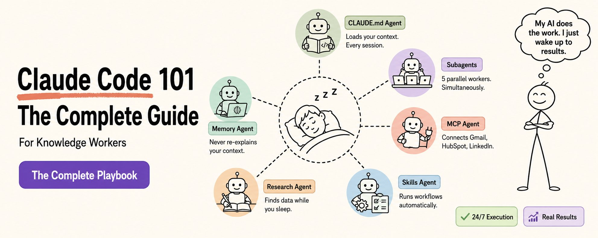

大多数人以为 Claude Code 是给开发者用的。

不是。

它是有史以来为顾问、营销人员、研究人员和分析员打造的最强大的生产力工具。

99% 的知识工作者都不知道它存在。

这是你需要知道的一切。

不需要任何编码经验。

## 什么是 Claude Code？

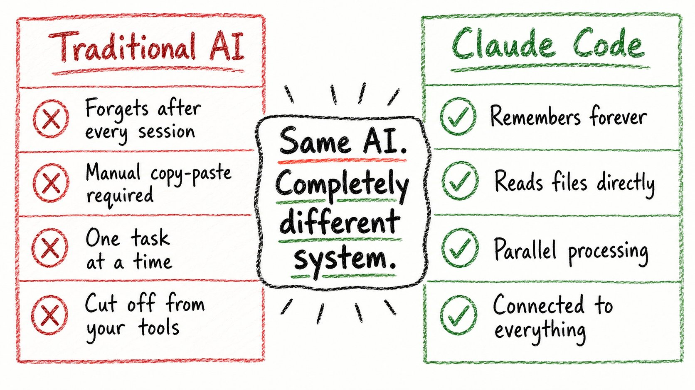

Claude Code 是 Anthropic 打造的 AI 智能体，从你的终端运行。

但先忘掉"终端"。

真正重要的是：

你的文件夹变成了 Claude 的永久大脑。

你不再需要反复解释自己。不再需要复制粘贴上下文。不再需要每个会话都从头开始。

Claude 直接读取你的文件。永久记住你的项目。自动执行复杂的多步骤工作流。

这就是突破。

## 为什么这与 ChatGPT 不同

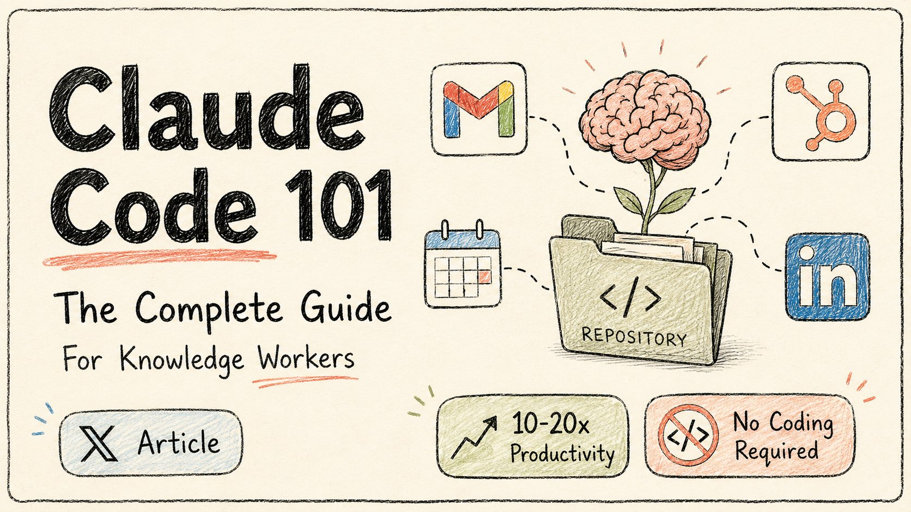

传统 AI（ChatGPT）对知识工作者有 4 个致命问题。

**问题 1：零记忆**

周一："帮我处理季度报告。"周二："继续报告。"ChatGPT："什么报告？"

你每周要重新解释整个项目 10 次以上。每个会话都从零开始。

**问题 2：上下文税**

在 Claude 能帮忙之前，你必须：→ 复制项目文档 → 粘贴 → 等待 → 复制参考文件 → 粘贴 → 等待 → 重新解释你的需求 → 等待

每个会话仅提供上下文就要 30+ 分钟。

**问题 3：顺序瓶颈**

需要分析 5 个文件？

ChatGPT：文件 1（10 分钟）→ 文件 2（10 分钟）→ 文件 3... 总计：50 分钟。

Claude Code：全部 5 个并行分析。总计：10 分钟。

**问题 4：工具隔离**

"这是我 HubSpot 数据的截图..."

手动复制粘贴。错误。浪费时间。

Claude Code 直接连接到你的工具。

## 真实的时间节省

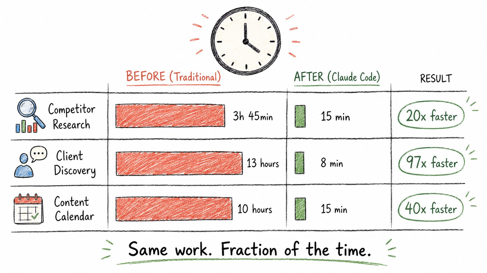

之前 vs 之后。真实任务。

**竞争对手研究 + 报告 + 团队邮件：**

之前（ChatGPT）：→ 手动研究 20 个竞争对手：3 小时 → 复制粘贴到 AI，生成报告：30 分钟 → 手动格式化和邮件：15 分钟 → 总计：3 小时 45 分钟

之后（Claude Code）：→ "研究这 20 个竞争对手并将对比邮件发给团队" → Claude 生成 4 个并行智能体进行研究：10 分钟 → 汇总、生成报告：5 分钟 → 通过 Gmail MCP 发送邮件：即时 → 总计：15 分钟

**那是 20 倍更快。**

客户发现综合（对顾问）：→ 之前：13 小时 → 之后：8 分钟 → 提升：97 倍

内容日历（对营销人员）：→ 之前：每月 10 小时 → 之后：15 分钟 → 节省：每月 40 小时

这些不是理论。来自于真实工作流。

## 如何开始（3 步）

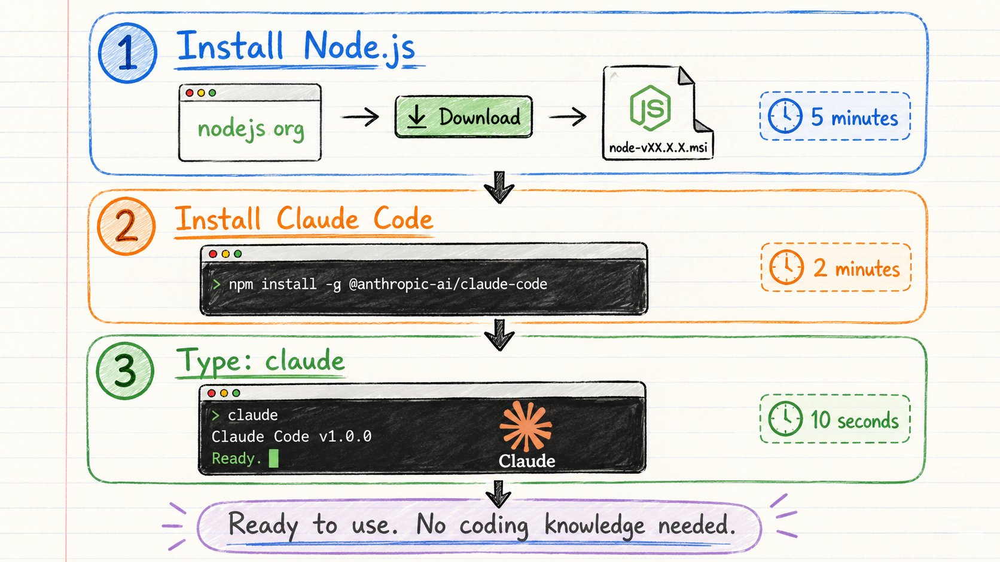

你只需要 3 样东西：

→ Claude Pro（20 美元/月）或 Claude Max → 安装 Node.js（免费，一次下载）→ 3 个终端命令（我们会教你全部 3 个）

**步骤 1：安装 Node.js**

去 [nodejs.org](https://nodejs.org/)。点击"Get Node.js"。运行安装程序。完成。

**步骤 2：安装 Claude Code**

Mac：

```bash
curl -fsSL https://claude.ai/install.sh | bash
```

Windows：

```bash
irm https://claude.ai/install.ps1 | iex
```

**步骤 3：启动 Claude**

```bash
claude
```

就这样。

你现在在运行 Claude Code 了。

你永远只需要这 3 个命令：→ cd — 导航到你的文件夹 → claude — 启动 Claude Code → /init — 设置新项目

或者你可以安装 Claude 桌面应用程序，它包含 Claude、Cowork、Code。

## 关键概念（让这一切运转的 4 件事）

## 1\. CLAUDE.md — 你的永久记忆

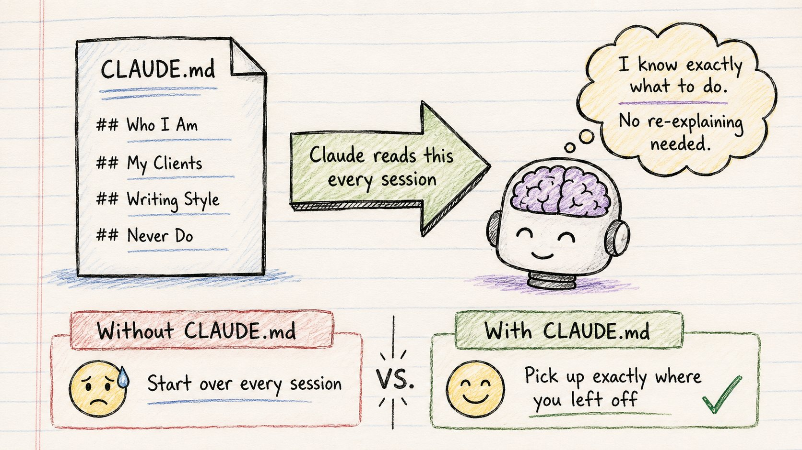

这一个文件改变一切。

CLAUDE.md 是 Claude 在每个会话开始时读取的特殊文本文件。

它是你的项目说明手册。你的永久记忆。你的 AI 上岗文档。

里面放什么：

```plaintext
# CLAUDE.md

## 项目概述
[一句话：这个项目是什么]

## 我的业务背景
[你的客户是谁，你是做什么的]

## 写作风格
[你喜欢内容听起来怎样]

## 输出标准
[你希望交付物如何格式化]

## 永远不要做
[Claude 应该始终避免的事情]
```

一旦写好——你再也不用解释自己了。

每个会话，Claude 都从完整上下文开始。

最佳大小：200-500 行。太大：拆分成引用的文件。

## 2\. 子智能体 — 并行处理

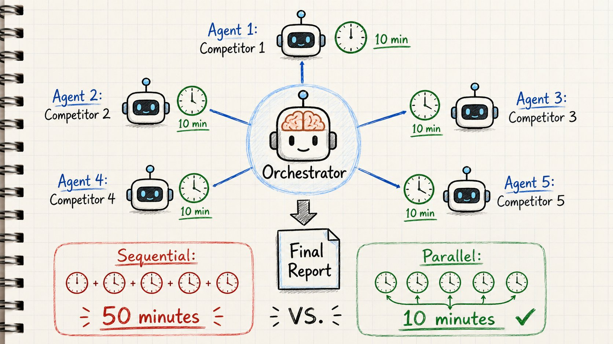

没有子智能体：AI 像一个人逐个完成任务。

有子智能体：AI 像一组专家，同时工作。

如何触发它们：

直接自然地说：

→ "用 5 个智能体并行分析这些竞争对手网站" → "生成 3 个研究智能体同时覆盖每个市场细分"

发生什么：→ Claude 创建 5 个隔离的 AI 工作器 → 每个获得自己干净的上下文 → 所有同时工作 → 结果汇总回给你

速度计算：

5 个文件 × 10 分钟每个 = 50 分钟（顺序）5 个子智能体 × 10 分钟每个 = 10 分钟（并行）

同样的输出。5 倍更快。不额外收费。

## 3\. Skills — 可重用工作流

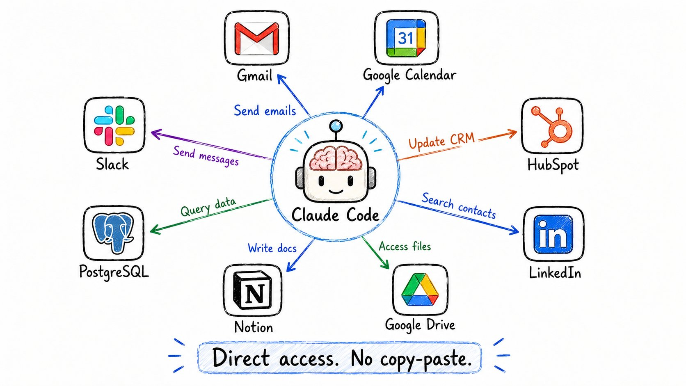

skill 是你构建一次、永久重用的工作流模板。

把它想象成：→ AI 的 SOP → Claude 自动执行的 playbook → 你的专业知识，打包

示例 skill：冷启动邮件生成器

```plaintext
---
name: email-outreach
description: Generate personalized cold emails for prospects
---

## Step 1: Research Prospect
- Find recent company news
- Identify their pain points

## Step 2: Draft Email
- Subject: specific value prop (under 50 chars)
- Opening: reference their recent news
- Body: connect pain point to your solution
- CTA: one specific next step
```

保存一次。

每次你说"为 [潜在客户] 写推广邮件"——Claude 自动运行完整工作流。

不用重新解释格式。不用重新解释你的标准。只要结果。

## 4\. MCP — 将 Claude 连接到你的工具

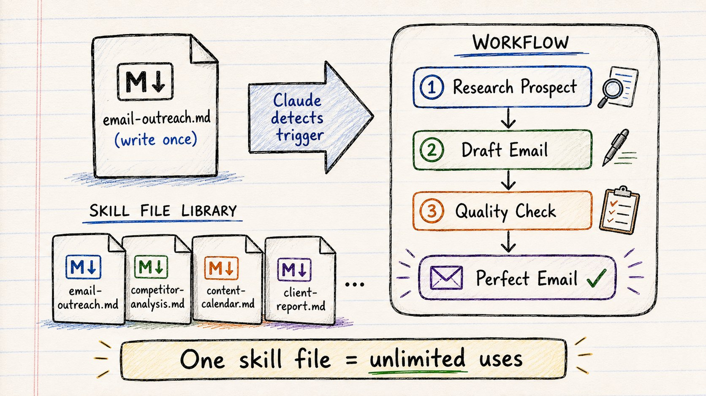

MCP 代表 Model Context Protocol。

这就是 Claude 直接连接到你的应用的方式。

不需要截图。不需要复制粘贴。直接访问。

可用连接：

**通讯：** Gmail、Google Calendar、Slack **CRM 和销售：** HubSpot、Salesforce、Stripe **生产力：** Notion、Google Drive、Linear **数据：** PostgreSQL、Google Analytics、Sheets **专业：** LinkedIn

真实工作流示例：

你："找到我目标账户的 LinkedIn 决策者，将他们添加到 HubSpot，并起草个性化邮件。"

Claude：→ 查询 LinkedIn → 找到 15 个决策者 → 创建 HubSpot 联系人 → 全部 15 个已添加 → 为每个人起草个性化邮件 → 完成

原本需要 2 小时的事：4 分钟完成。

你没碰任何一个工具。

## 按角色的真实用例

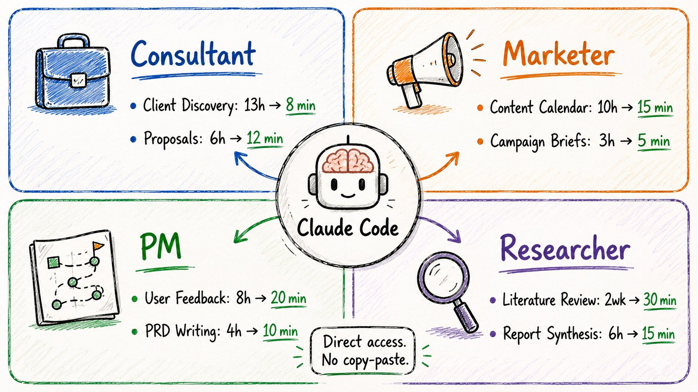

**顾问：**

客户发现自动化。→ 15 份面试记录 → 6 小时手动分析 → Claude 阅读全部，提取洞察，生成综合 → 时间：8 分钟

提案创建。→ 阅读过去的提案、客户简报、研究 → 生成量身定制的 20 页提案草稿 → 时间：12 分钟

**营销人员：**

15 分钟内完成内容日历。→ "创建下个月的内容日历" → 20 个博客想法 + 60 条社交帖子 + 4 个新闻简报大纲 → 时间：15 分钟（之前是 10 小时）

活动简报。→ 分析过去表现 → 生成优化简报 → 时间：5 分钟（之前是 3 小时）

**产品经理：**

用户反馈综合。→ 500 张 Zendesk 工单 + 20 次访谈 + 150 条应用评论 → 5 个子智能体并行分析 → 前 10 个功能、关键 bug、满意度趋势 → 前 3 个功能的 PRD → 时间：20 分钟（之前是 8 小时）

**研究人员：**

文献综述。→ 上传 40 篇论文 → Claude 阅读，提取主题、矛盾、空白 → 完整综合报告 → 时间：30 分钟（之前是 2 周）

## 你的 4 周路线图

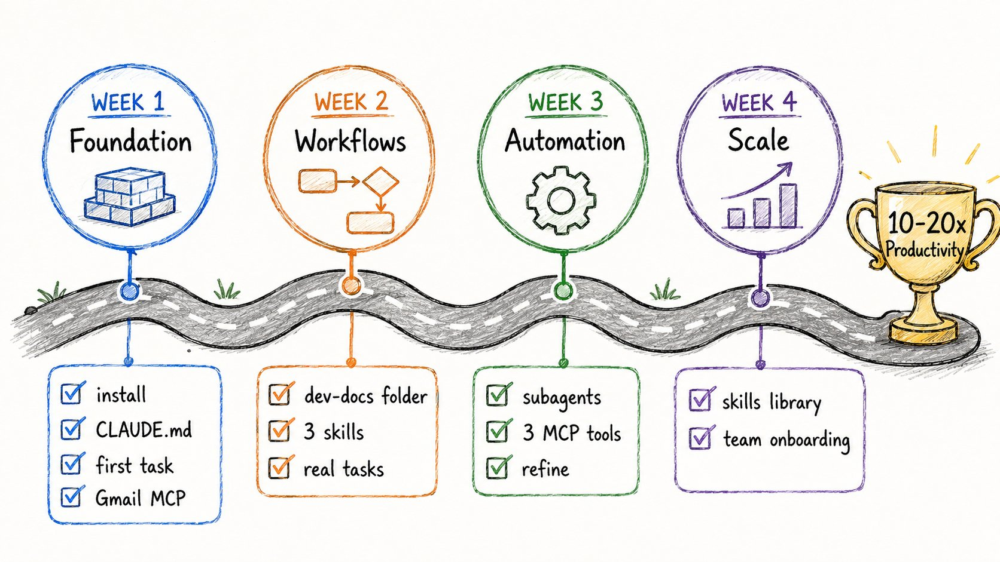

不要试图一次做所有事情。

这是确切的顺序。

**第 1 周：基础**

→ 安装 Claude Code → 创建你的第一个项目文件夹 → 写你的第一个 CLAUDE.md → 测试一个简单任务 → 连接 1 个 MCP 工具（从 Gmail 开始）

**第 2 周：工作流**

→ 创建一个 dev-docs 文件夹（plan.md、tasks.md、context.md）→ 构建你的前 3 个 skills → 练习每日上下文更新 → 用 Claude 处理真实工作任务

**第 3 周：自动化**

→ 首次使用并行子智能体处理批量任务 → 再连接 2-3 个 MCP 工具 → 根据效果优化你的 CLAUDE.md

**第 4 周：扩展**

→ 审计你的 skills 库 → 识别仍然手动完成、Claude 应该处理的 5 个任务 → 为团队上岗文档化一切

到第 4 周：→ 重复性任务生产力提升 10-20 倍 → 深入了解你业务的 AI → 工作流在你睡觉时运行

## 快速参考： essentials

你需要记住的一切：

**3 个终端命令：**→ cd /your/folder — 进入你的项目 → claude — 启动 Claude Code → /init — 设置新项目

**4 个核心概念：**→ CLAUDE.md — 你的永久记忆 → 子智能体 — 并行处理 → Skills — 可重用工作流 → MCP — 工具连接

**每个项目需要的 4 个文件：**→ CLAUDE.md — 指令 + 上下文 → plan.md — 你在构建什么 → tasks.md — 需要发生什么 → context.md — 背景信息

**费用：**→ Claude Pro：20 美元/月 → Claude Max：更高使用限制 → 固定费用——不按消息收费

**关键数据：**→ 200,000 token 上下文窗口 → 重复性任务时间减少 10-20 倍 → 不需要编码经验

## 结语

Claude Code 不仅仅是一个开发者工具。

它是知识工作者倍增器。

现在使用它的人正在：→ 用 15 分钟完成原本需要 4 小时的事情 → 再也不用重新解释他们的上下文 → 在睡觉时运行 5 个 AI 智能体

你不需要编码。你不需要技术技能。你只需要一个文件夹和一个文本文件。

从路线图的第 1 周开始。

其他一切都会从那里累积。