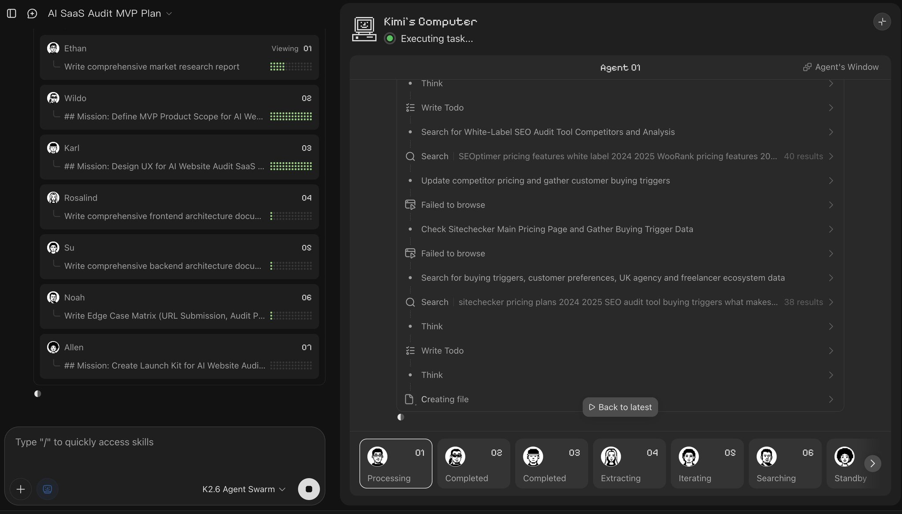
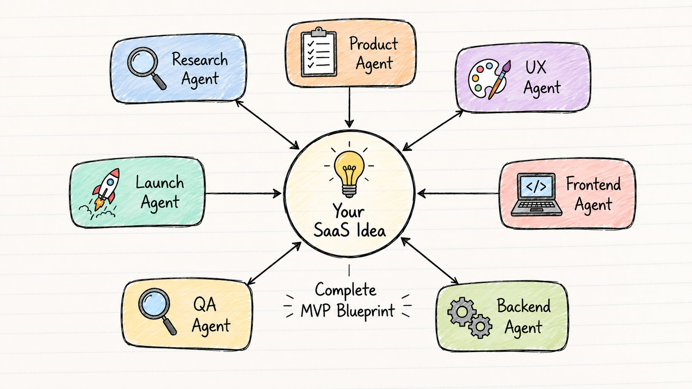
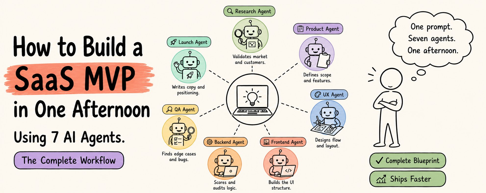
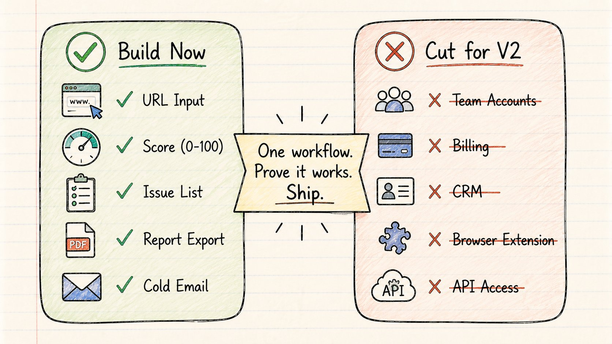
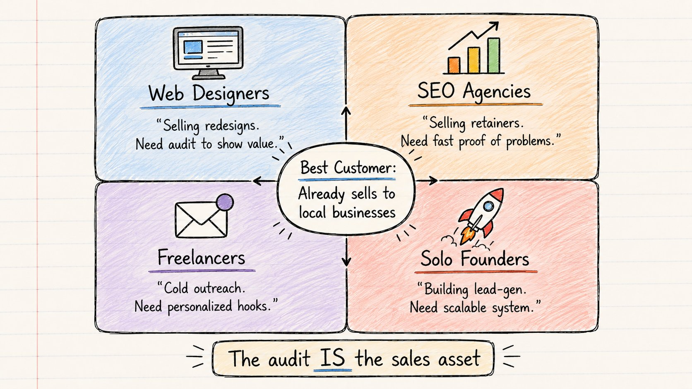
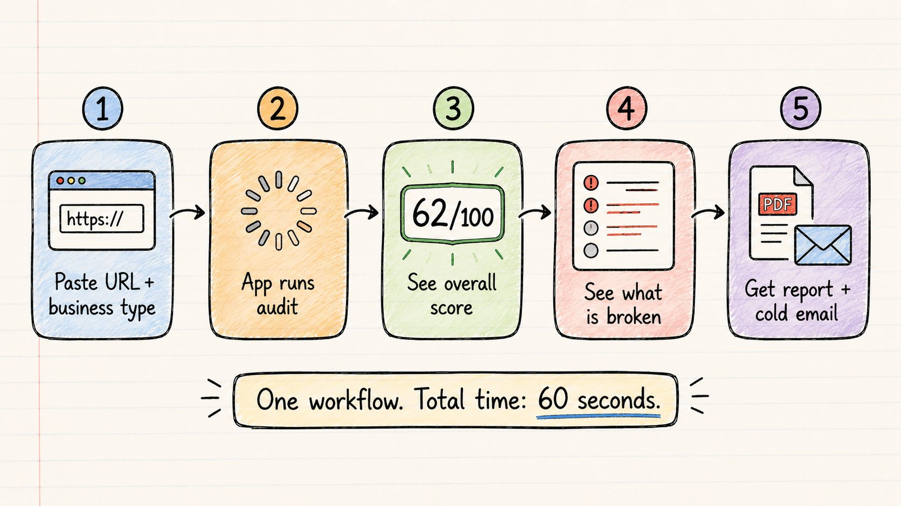
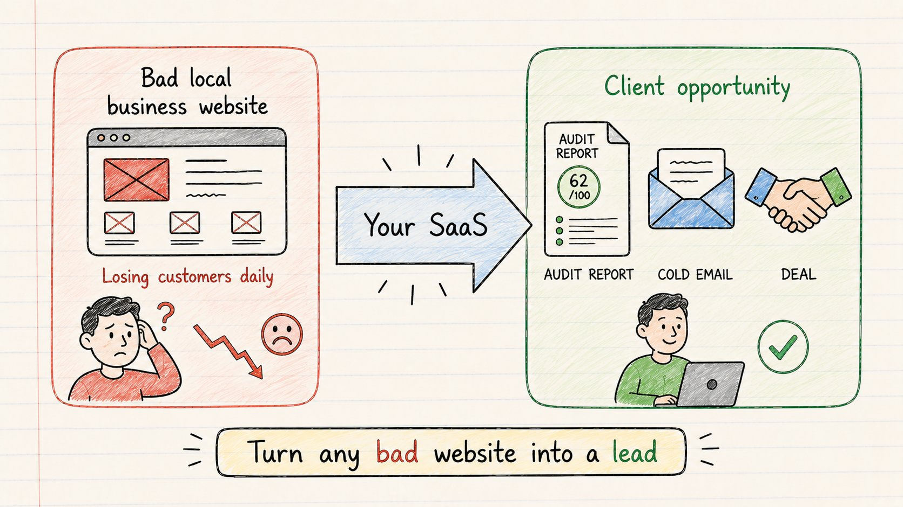
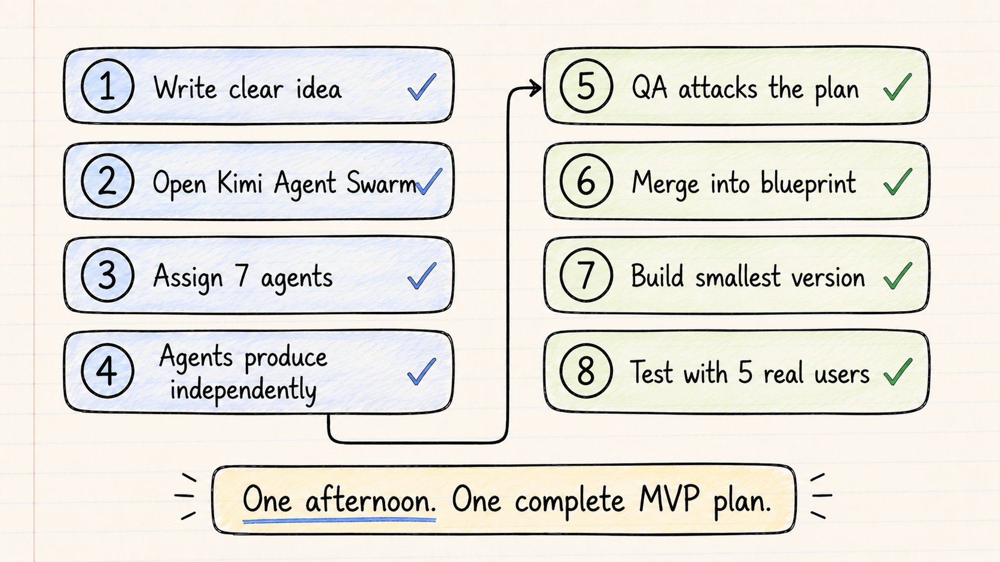
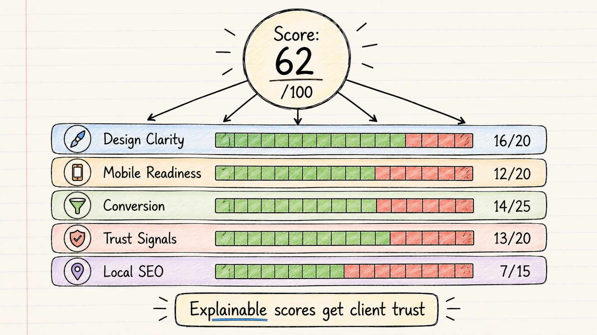

我发布产品已经很多年了。

我知道慢是什么感觉。

任何 SaaS 的第一周是最糟糕的部分。

你整天都在脑子里切换角色。

→ 创始人

→ 研究员

→ 产品经理

→ 设计师

→ 工程师

→ QA 测试员

→ 营销人员

同一个大脑。七份工作。零动力。

上个月我尝试了一些不同的东西。

我停止用一个 AI 模型做所有事情。

相反，我用 Kimi Agent Swarm 构建了一个由 7 个专业智能体组成的团队。

一个下午。一个 SaaS 想法。七个智能体。一份完整的 MVP 蓝图。

以下是这个确切的工作流程。

## 想法

产品：一款面向本地企业的 AI 网站审计 SaaS。

它解决的问题：

500 万个本地企业的网站看起来像是在 2011 年建成的。

没有预约按钮。没有移动端布局。没有信任信号。没有明确的 CTA。没有评价展示区。

一个水暖工可能很擅长水暖工作，但因为他的网站看起来毫无生气而失去客户。

这个 SaaS：输入任何本地企业 URL，获取审计报告、评分，以及一封可以发送给企业主的冷淡邮件。

目标用户：自由职业者、网页设计师、本地 SEO 代理商——任何向本地企业销售网站和服务的人。

这个工具填补的空白：审计本身就是销售素材。

一封通用的冷淡邮件会被忽略。

但一封这样的邮件：

"你的移动端预约按钮坏了，你的主页没有信任信号，而且街上的竞争对手比你多 300 条评价，预约流程也更快"

会得到回复。

这是输出 SaaS 的样子。

## 为什么大多数人在用 AI 构建产品时用错了方式

大多数创始人把 AI 当作一个更好的聊天机器人来使用。

他们给一个模型一个巨大的提示：

"研究市场，设计 UI，构建后端，写着陆页，规划发布。"

输出感觉很肤浅，因为它确实很肤浅。

一个模型在七种不同的思维模式之间切换，每个都只能产生平均水平的工作。

研究员和设计师的思维方式不同。后端工程师和营销人员的思维方式不同。QA 测试员和产品经理的思维方式不同。

让智能体 swarm 起作用的洞察：

→ 专业化产生比通用化更好的输出。

这不是什么新想法。

这就是为什么公司雇用团队而不是一个什么都做的人。

Kimi Agent Swarm 将同样的逻辑应用于 AI。

不是让一个模型"帮我构建一个 SaaS"，而是围绕任务创建一个人工智能小公司。

每个智能体拥有自己的角色。每个智能体产生自己的输出。创始人管理这个系统，而不是管理具体任务。

## 这个 7 智能体系统



这是我在 Kimi Agent Swarm 中组建的团队：

智能体 1 → 研究智能体验证市场、目标客户、竞争对手和用例。

智能体 2 → 产品经理智能体定义 MVP 范围、核心功能、用户旅程、定价模式。

智能体 3 → UX 智能体创建页面结构、用户流程、仪表板布局、报告布局。

智能体 4 → 前端工程师智能体构建 UI 计划和组件结构。

智能体 5 → 后端工程师智能体设计审计逻辑、评分系统、API 结构、数据模型。

智能体 6 → QA 智能体审查 bug、缺失状态、边缘情况和令人困惑的 UX。

智能体 7 → 发布智能体撰写着陆页文案、X 发布帖子、冷淡邮件、产品定位。

每个智能体首先独立工作。然后输出合并成一份构建计划。

这就是它不同于冗长的 ChatGPT 对话的地方。

没有上下文切换。没有"忘记我之前说的"。每个智能体各司其职。

## 核心提示词

这是我给 Kimi 的启动提示词（用作灵感，根据你的需求修改）：

```plaintext
为本地服务企业构建一个 AI 网站审计 SaaS。

目标用户：
- 自由职业者
- 代理商老板
- 本地 SEO 顾问
- 向水暖工、暖通空调、屋顶工、电工、牙医销售网站的网页设计师

核心工作流程：
用户输入本地企业 URL →
应用审计网站 →
生成评分、问题列表、改进清单、客户报告和冷淡邮件

分成 7 个专业智能体：

研究智能体：验证市场、客户、竞争对手
产品智能体：定义 MVP 范围、功能、定价
UX 智能体：用户流程、仪表板、报告布局
前端智能体：UI 结构和组件
后端智能体：评分逻辑、审计系统、API 设计
QA 智能体：边缘情况、缺失状态、失败模式
发布智能体：着陆页、X 帖子、冷淡邮件、定位

每个智能体首先独立工作。
然后将所有输出合并成一份最终的 MVP 计划。
```

大多数人会写一个版本然后等待一个大答案。

Swarm 的意义在于每个智能体从自己的角度产生一个真实的产物。

研究不会考虑按钮颜色。UX 不会发明定价。QA 攻击，而不是防守。发布智能体不会碰后端。

分离即是系统。

这是实际运行的智能体 swarm :)



## 每个智能体的产出

## 智能体 1 — 研究



发现了 4 个真实的客户群体：

→ 向本地企业销售重新设计的网页设计师

→ 销售审计托管服务的 SEO 代理商

→ 做冷淡 outreach 的自由职业者

→ 构建潜在客户生成服务的独立创始人

最重要的客户洞察：

审计不是产品。审计是销售武器。

向本地企业销售的人需要一个更快的方式来创建个性化的、具体的审计。

一封通用的冷淡邮件得到 0 条回复。一封展示具体问题的个性化审计能引起关注。

这个定位改变了整个产品方向。

## 智能体 2 — 产品经理



无情地削减了范围。

版本 1 只需要 5 个屏幕：

→ 首页

→ 审计输入页面

→ 加载/进度页面

→ 审计结果页面

→ 报告导出页面

没有团队账户。没有计费。没有 CRM。没有浏览器扩展。没有市场。没有 API。

只有一个工作流程：

输入 URL → 获取审计 → 发送报告。

核心 MVP 功能：

→ 网站 URL 输入

→ 业务类别选择器

→ 审计评分 0-100

→ 转化清单

→ 移动端就绪清单

→ 信任信号清单

→ CTA 清单

→ 报告摘要

→ 冷淡邮件生成器

→ 自由职业者的建议服务定价

这足以做版本 1。

SaaS MVP 不需要完整。

它需要证明一个工作流程是可行的。

## 智能体 3 — UX



设计了 5 步用户旅程：

第 1 步：粘贴 URL + 选择业务类型

第 2 步：应用运行审计（进度条）

第 3 步：查看总体评分

第 4 步：查看哪些地方出了问题以及原因

第 5 步：获取报告 + 冷淡邮件

Kimi 设计的报告布局：

---

**网站评分：62/100**

正在让你失去客户的问题：

→ 没有可见的预约按钮

→ 移动端布局薄弱

→ 没有 Google 评价区域

→ 没有紧急服务 CTA

→ 首屏信任建设薄弱

快速修复：

→ 添加点击即呼按钮

→ 将评价移到页面顶部

→ 添加服务区域版块

→ 添加前后对比照片

→ 添加预约表单

业务影响：你的网站正在失去那些准备好立刻打电话的移动端访问者。

---

那个布局很重要。

不需要技术性。不需要满是术语。

足够清晰，让一个水暖工在 30 秒内理解。

那是自由职业者发送的东西。那是能约到面谈的东西。

## 智能体 4 — 前端

前端智能体构建了 UI 结构。

英雄区："在 60 秒内审计任何本地企业网站。"

输入卡片：

→ 网站 URL

→ 业务类别（下拉：水暖工、暖通空调、牙医、电工、屋顶工...）

→ 城市

→ 主要服务

结果仪表板：

→ 总体评分（大数字，带颜色编码）

→ 类别评分（5 个条形图）

→ 前 5 个问题（红色高亮）

→ 快速修复（绿色高亮）

→ 生成的报告（预览 + 下载）

→ 冷淡邮件（发送前可编辑）

这个应用不需要花哨的设计。

它需要在 10 秒内展示一个清晰的价值：

粘贴 URL。获取审计。发送给客户。赢得交易。

## 智能体 5 — 后端



跨 5 个类别构建的评分系统：

设计清晰度 → 20 分

移动端就绪 → 20 分

转化就绪 → 25 分

信任信号 → 20 分

本地 SEO 基础 → 15 分

总计：100 分

转化就绪的示例检查：

→ 首屏有明确的 CTA？(+5)

→ 电话号码可见？(+5)

→ 有预约表单？(+5)

→ 服务清晰列出？(+5)

→ 有现在就行动的理由？(+5)

信任信号的示例检查：

→ 评价可见？(+4)

→ 资质证书展示？(+4)

→ 使用真实照片？(+4)

→ 提到经营年限？(+4)

→ 包含保证条款？(+4)

这很重要，因为评分需要可解释。

一个黑箱式的"AI 评分"感觉很假。

一个有具体、清晰原因的评分感觉很实用。

而实用才是会被分享给客户的东西。

## 智能体 6 — QA

这是最有价值的智能体。

QA 智能体做一件事做得很好：它攻击。

Kimi 的 QA 智能体立即发现：

→ 如果 URL 坏了怎么办？

→ 如果网站阻止抓取怎么办？

→ 如果网站几乎没有文字怎么办？

→ 如果企业没有任何评价怎么办？

→ 如果两个审计类别互相矛盾怎么办？

→ 如果生成的邮件听起来太激进了怎么办？

这就是智能体 swarm 打败一个长提示词的地方。

单个模型构建应用会对自己的输出产生情感依恋。

独立的 QA 智能体没有依恋。

它只是找出漏洞。

它添加的修复：

→ 被封锁网站的备用状态

→ 人工覆盖的手动备注字段

→ 每个发现的置信度评分

→ "无法验证"标签

→ 更柔和的邮件语气开关

→ Outreach 发送前的人工审核步骤

最后一点很重要。

你不希望 500 封糟糕的冷淡邮件自动发出。

你希望 500 份强有力的草稿由人工批准。

创始人仍然是编辑。Swarm 做繁重的工作。

## 智能体 7 — 发布



发布智能体用一句话产生了产品定位：

"把差的本地企业网站变成客户机会。"

这比"AI 网站审计工具"强得多。

没有人醒来想要一个审计工具。

他们想要客户。

着陆页结构：

标题：把差的本地企业网站变成客户机会。
副标题：输入任何 URL。获取即时审计。发送个性化报告。达成交易。

三个价值主张：

→ 找到每天都在失去客户的网站

→ 在 60 秒内生成审计

→ 发送能得到回复的报告

X 发布帖子是智能体写的：

------------

**我构建了一个审计本地企业网站并将它们变成客户机会的 SaaS。**

**粘贴 URL。获取 0-100 的评分。准确看到是什么在让他们失去客户。生成客户就绪的报告。发送个性化的冷淡邮件。**

**为自由职业者、网页设计师和本地 SEO 代理商构建。**

**差的网站到处都是。现在每一个都是一条潜在客户。**

------------

简单。清晰。实用。

## 最终输出

在一个下午内，Kimi Agent Swarm 产生了：

→ 经过验证的市场和目标客户

→ 紧凑的 MVP 范围（5 个屏幕，没有功能蔓延）

→ 完整的用户旅程

→ 一个有具体检查的 100 分评分系统

→ UI 结构和组件列表

→ 客户友好的报告布局

→ 带边缘情况的 QA 检查清单

→ 着陆页文案

→ 发布帖子

→ 冷淡邮件模板

这不是一个完整的公司。

但这比大多数创始人独自思考一周后的成果要多。

## 仍然需要你的部分

Kimi 没有在一个下午构建一个十亿美元的 SaaS。

它构建了一个强大的 MVP 蓝图。

这有区别。

一个真正的 SaaS 仍然需要：

→ 生产代码

→ 真实用户

→ 支付和托管

→ 错误处理

→ 客户支持

→ 分销

→ 定价测试

→ 交付前的人工 QA

有些网站阻止抓取。有些审计需要人工验证。有些邮件应该在发送前审核。

这不是"按下按钮，变得富有"。

这个教训比那更有用：

Kimi 取代了产品思考中最初混乱的 70%。

创始人仍然拥有品味、判断力、交付和分销。

改变的是起点。

不是对着空白页面发呆三天，而是从研究输出、产品规格、评分系统、UI 流程和发布计划开始。

认知负荷下降。速度提升。早期决策更快做出。

## 工作流程 — 保存这个



对你的下一个 SaaS 想法使用这个确切顺序：

第 1 步 → 写一个清晰的想法（问题 + 用户 + 核心工作流程）

第 2 步 → 打开 Kimi Agent Swarm

第 3 步 → 分配 7 个具有特定角色的智能体

第 4 步 → 让每个智能体独立产生其产物

第 5 步 → QA 智能体攻击完整计划

第 6 步 → 将输出合并成一份 MVP 蓝图

第 7 步 → 只构建证明工作流程所需的最小版本

第 8 步 → 在添加任何其他东西之前用 5 个真实用户测试

大多数创始人犯的错误：

要求 AI 构建一切。

更好的做法：

要求智能体消除混乱。

研究变得清晰。范围变得清晰。屏幕变得清晰。风险变得清晰。发布角度变得清晰。

这才是真正节省时间的东西。

## 转变

下一代创始人不会仅仅用 AI 来写文案。

他们将管理 swarm。

一个智能体研究。一个智能体设计。一个智能体编码。一个智能体测试。一个智能体发布。

创始人不再是需要完成每个任务的人。

创始人成为指挥机器的人。

这就是 Kimi Agent Swarm 给我的。

不是捷径。

是一支团队。

之前：一个人在七个角色之间切换，在写一行代码之前浪费了一周。

之后：七个智能体并行运行，在一天结束前返回完整的 MVP 计划。

这曾经需要一周。

现在从一条提示词开始。

试试 Kimi Agent Swarm：[kimi.com/agent-swarm](https://kimi.com/agent-swarm)