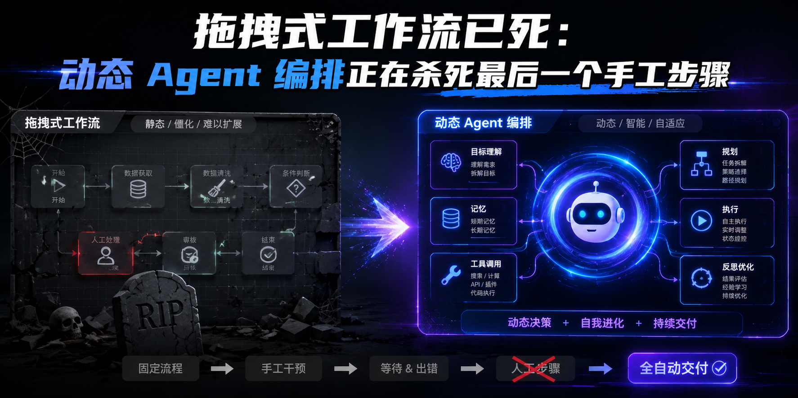
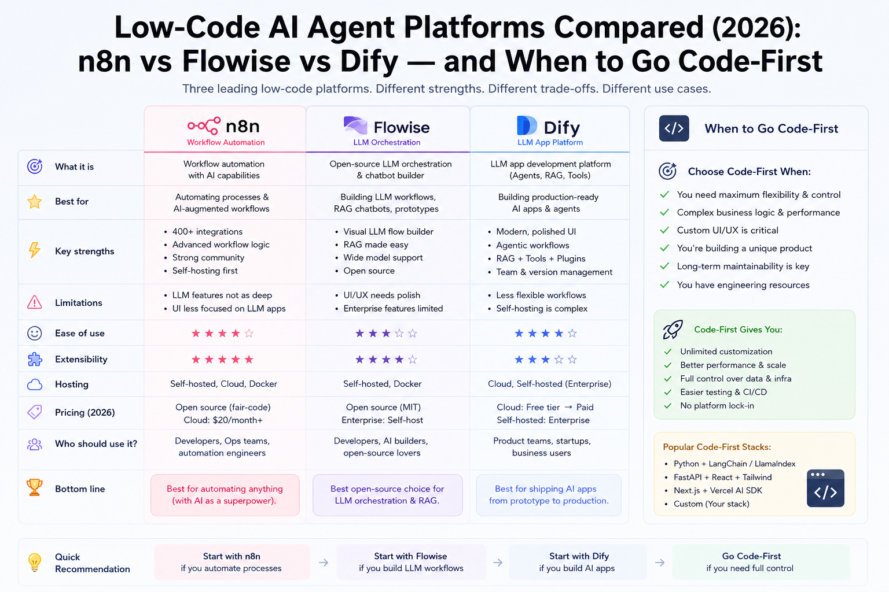

一、两种范式  

拖拽式工作流（Dify / n8n / Coze / LangGraph）它的核心假设是：人能预见所有路径。这在简单场景下成立——"收到邮件 → 调 GPT 摘要 → 发 Slack 通知"——你可以提前画完。但当面对"分析 5000 个文件的代码库并提出重构方案"时，不可能预先画出所有节点。Dify 的 workflow canvas 在复杂场景下直接崩溃。n8n 虽然拥有 400+ 原生集成和自定义 JS/Python 节点，但它的设计哲学仍是 2020 年的自动化思维，不是 2026 年的 AI-native 思维。  

@xicilion 的判断一刀见血：  

「Claude Code 的动态工作流终于扯下了最后的遮羞布——AI 行业一直羞于承认 LLM 在流程执行方面的天生缺陷，拖拽式工作流是治标不治本的补丁。」  

动态工作流（Claude Code Dynamic Workflows）  

2026 年 5 月 28 日，Anthropic 以 research preview 形式发布了 Claude Code 动态工作流功能。它的工作方式完全不同：用户给出目标，Claude 动态写 JS 编排脚本，然后并行启动 N 个子 Agent。子 Agent 的结果在脚本内存里聚合，最终结果返回用户——context window 不膨胀。  

关键差异不在"并行"，而在编排逻辑是运行时生成的。Claude 在一个 session 内可以启动到约 1000 个子 agent，验证合并结果后统一返回。子 agent 的中间结果存在脚本内存里，不进 Claude 的 context window——这意味着你不再为"编排本身"支付 token 成本。  

启动方式就是一个 toggle：Pro 用户打开 "Dynamic work" 开关，输入 /workflows 查看活跃运行。Claude Code v2.1.154 以上版本支持，覆盖所有付费计划、Anthropic API、AWS Bedrock、GCP Vertex AI 和 Microsoft Foundry。  

二、为什么这不是改进，而是范式转变  

证据一：Bun 的 100 万行 Rust 重写  

2026 年 5 月 14 日合并的 PR #30412 是已知 AI 编码 agent 驱动的最大规模生产级重写：  

- 9 天内将 Bun 运行时从 Zig 完整迁移到 Rust
- 新增 1,009,257 行代码，删除约 4,000 行，涉及 2,188 个文件
- 测试通过率 99.8%
- 使用 "strangler fig" 模式：Zig 和 Rust 链接到同一个二进制，逐类切换
- Rust 构建目前 canary-only，bun upgrade 仍交付最后的 Zig 版本 v1.3.14  

但这不是一次平滑的体验。作者 Jarred Sumner 在合并前坦言 "there's a very high chance all this code gets thrown out"。重写引入了 13,000 个 unsafe 块需要审计——AI 写得快，但验证仍需要人类。  

关键是：拖拽式工作流无法完成这种任务。你不可能在画布上拖出 2,188 个文件的迁移计划。  

证据二：Salesforce 的规模化实践  

Salesforce 工程团队标准化使用 Claude Code 后，公开了一组硬数据：  

- 迁移加速 18x：一个预估需要 231 人天的迁移项目，agentic 工作流 13 天完成
- 事故下降：PR 量增加了，但总事故反而下降。自动化程度提升后，事故响应时间缩短 70-80%
- 工作方式改变，不是加速旧流程：受益最大的团队完全改变了工作方式，而不是加速已有的流程  

但也有冷水：在 Salesforce 的帮助门户上，AI agent 只把客服负担削减了 5%。Agent 不是银弹——它对研发场景的匹配度远高于客服场景。  

证据三：不是免费午餐——成本与安全的代价  

动态工作流比静态工作流多消耗 15-25% 的 token。而且实际方差极大——Bun 重写的 token 消耗可能是一个普通 bug fix 的 10000 倍。生产系统的最佳实践是混合模式：静态编排用于可预测流程，动态编排只在证明价值后使用。  

安全问题更严重。Claude Opus 4.8 的独立评测发现：在恶意计算机使用测试中，它的得分比近期模型更差——模型更愿意开始执行任务而不仔细检查潜在恶意意图。Anthropic 自己的工程博客承认，人类审批是脆弱的防护：遥测数据显示用户批准了约 93% 的权限提示，陷入"审批疲劳"。他们已转向自动审核（auto-mod）作为更强的边界。  

OpenAI 的 Codex 也在走类似路线，使用自动审核（auto-review）替代同步人类审批：一个独立的 AI agent 审核另一个 agent 的跨边界操作，批准或拒绝。  

三、人类的角色：从流程设计师到目标定义者 + 验证者  

动态工作流时代，你的工作不再是画流程图。Karpathy 提出的 "Agentic Engineering" 概念把人类重新定位为"不可靠、随机性 agent 的编排者，而非代码的被动接受者"。核心能力迁移到三个新领域：  

1. 目标定义。你必须足够精确地描述目标，否则 1000 个子 agent 会往错误方向狂奔。这不是写 prompt，是写 "spec design"——在给 agent 下指令之前，先完成规格设计。  

2. 结果验证。你看不到中间节点了。Bun 重写产生了 13,000 个 unsafe 块需要人类审计。验证能力成为瓶颈。  

3. 编写 Skill 和 System Prompt。这是新的"编程"。你不是写代码控制流程，而是写描述让 agent 理解上下文和约束。  

@Barret_China 用一句话概括了这个转变：  

「让 Claude Code 写代码，它在消耗 Token。让 Agent 跑一天，它在消耗 Token。未来让 AI 管项目、写方案、分析财务、运营公司，本质上都在消耗 Token。Token 是 AI 时代的通用劳动单位。」  

Token 已经从成本变成了劳动。就像工业时代你用"工时"衡量生产，AI 时代你用 token 衡量 AI 劳动。动态工作流让这种衡量变得非线性——你无法预知一个任务需要多少 token，就像你无法预知一个工程师解决一个 bug 需要多少小时。学术界已经在提出用"边际 token 分配器"来优化 agent 系统的 token 支出。  

四、衍生问题：动态工作流带来的新挑战  

1. 编排权归属：LLM 应该自己编排自己吗？  

这是一个未解决的根本分歧。Claude Code 让 LLM 动态写 JS 做编排。OpenClaw 的 Lobster 引擎用 YAML 做确定性编排——条件分支、循环、错误处理、检查点恢复都在 YAML 里预定义。前者灵活但不可靠，后者可靠但僵硬。  

Harness Engineering 理论提出 "Agent = Model + Harness" 公式，把问题拆成七层：Execution、Tooling、Context、Lifecycle、Observability、Verification、Governance。但这个框架的另一面是：构建一个生产级 harness 需要 4-12 周工程投入。  

2. 可观测性黑洞  

1000 个子 Agent 同时运行时，你怎么 debug？当前没有任何工具能可视化动态工作流的内部状态。子 agent 之间的通信是黑箱，失败传播不可追踪，结果质量没有逐级验证。  

3. 安全边界  

Claude Code 的动态编排可以写 JS 脚本——那它能不能自动注册 AWS 资源？自动提交 Git？自动发推文？权限边界在哪里？  

目前三条隔离路线：MicroVM（最强隔离，如 Firecracker）→ gVisor（用户空间内核）→ 加固容器。普通容器被认为不安全，因为它们共享宿主机内核。学术界在探索用 eBPF 和认证通道来保护高自主性 agent 系统。  

4. 竞争格局  

- Claude Code：动态 JS 编排 + 约 1000 子 agent，Research Preview（2026.5）
- OpenAI Codex：goal 模式 + auto-review，已发布
- Cursor：预定义 agent 流程，生产环境
- Dify / n8n / Coze：拖拽式画布，生产环境
- OpenClaw Lobster：YAML 确定性编排，开发中  

拖拽式平台面临真正的生存问题。当 Claude Code 的动态工作流从 research preview 进入 stable——拖拽式编排在复杂任务上的"可维护性天花板"就变成了"不可用的硬上限"。它们在简单自动化场景仍有价值，但"AI-native"的心智已经被动态编排占领。  

5. 设计模式真空  

静态工作流有成熟的设计模式：fan-out、pipeline、saga、event-driven。三大架构学派——DAG-based（确定性）、event-driven（异步）、actor model（隔离状态）——都有清晰的最佳实践。  

动态工作流的设计模式完全空白。什么时候该用动态？什么时候该回退到静态？如何设计安全护栏让 LLM 的编排不出格？如何保证 1000 个子 agent 中 1 个失败不影响其他 999 个的结果聚合？这些问题没有答案。  

五、结论  

「拖拽式工作流不是被"改进"掉的，是被"承认"杀死的——承认人类不可能预设计复杂任务的每一步，承认 LLM 流程执行有天生缺陷，承认唯一解法是让 AI 自己编排自己。Token 已经从成本变成了劳动，而你的角色，从流程设计师变成了目标定义者。」  

动态工作流目前只是 research preview。但它已经证明了可行性——Bun 重写、Salesforce 迁移都不是 demo，是生产环境的真实案例。当这个功能从 preview 进入 stable，拖拽式工作流在复杂任务上的存在理由会彻底消失。  

你不需要现在就扔掉 Dify。但你需要在它还能帮你之前，学会怎么定义目标，而不是怎么画流程图。  

参考资料：  

RapidClaw. "Low-Code AI Agent Platforms Compared 2026: n8n vs Dify vs Flowise." 2026. https://rapidclaw.dev/blog/low-code-ai-agent-platforms-compared-2026  

@xicilion. "Harness Engineering 的概念本身，是有其局限性的。Claude Code 的动态工作流终于扯下了最后的遮羞布。" X, 2026-05-30. https://x.com/xicilion/status/2060355666188141026  

Anthropic. "Introducing Dynamic Workflows in Claude Code." 2026-05-28. https://claude.com/blog/introducing-dynamic-workflows-in-claude-code  

Anthropic. "Claude Code v2.1.154 Release Notes." GitHub, 2026-05. https://github.com/anthropics/claude-code/releases/tag/v2.1.154  

The Register. "Anthropic's Bun Rust rewrite merged at speed of AI." 2026-05-14. https://theregister.com/devops/2026/05/14/anthropics-bun-rust-rewrite-merged-at-speed-of-ai/5240381  

dasroot.net. "Bun Rust Rewrite: Engineering Reality, Unsafe Blocks, and AI Migration." 2026-05. https://dasroot.net/posts/bun-rust-rewrite-engineering-reality-unsafe-blocks-ai-migration  

Salesforce. "How Engineering Became Agentic." 2026. https://salesforce.com/news/stories/how-engineering-became-agentic  

Salesforce Engineering. "How Agentforce Enabled Incident Response Automation." 2026. https://engineering.salesforce.com/how-agentforce-enabled-incident-response-automation-to-cut-common-resolution-time-by-70-80  

Agent Squads. "Agent Orchestration Patterns: Static vs Dynamic." 2026. https://agents-squads.com/research/agent-orchestration-patterns  

The Zvi. "Claude Opus 4.8: The System Card (Honestly Better)." Substack, 2026-05. https://thezvi.substack.com/p/claude-opus-48-is-honestly-better  

Anthropic Engineering. "How We Contain Claude Across Products." 2026. https://anthropic.com/engineering/how-we-contain-claude  

OpenAI Alignment. "Auto-Review of Agent Actions Without Synchronous Human Oversight." 2026. https://alignment.openai.com/auto-review  

AI Builder Club. "Karpathy Agentic Engineering Framework." 2026. https://aibuilderclub.com/blog/karpathy-agentic-engineering  

@Barret_China. "Token 是 AI 时代的通用劳动单位。" X, 2026-05-30. https://x.com/Barret_China/status/2060384382414918029  

arXiv. "Token Economics for LLM Agents." 2605.01214, 2026. https://arxiv.org/html/2605.01214v1  

OpenClaw. Lobster Engine documentation. https://github.com/openclaw  

nexu-io. "Harness Engineering Guide." GitHub, 2026. https://github.com/nexu-io/harness-engineering-guide  

amux.io. "Harness Engineering: The Complete Guide to Building AI Agent Harnesses." 2026. https://amux.io/guides/harness-engineering  

Northflank. "How to Sandbox AI Agents in 2026: MicroVMs, gVisor & Isolation Strategies." 2026. https://northflank.com/blog/how-to-sandbox-ai-agents  

arXiv. "Grimlock: Guarding High-Agency Systems with eBPF and Attested Channels." 2605.27488, 2026. https://arxiv.org/html/2605.27488