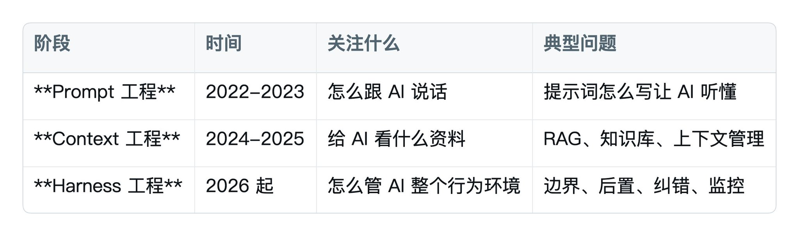

> Claude Code 装好了，Skills 配了，MCP 接了。AI 还是动不动胡说八道，质量靠抽卡。这一篇讲清楚：**为什么会这样，怎么管住它**。

# 第 1 章 你装了一堆东西，AI 还是瞎搞，为什么 第1 章你装了一堆东西，AI 还是瞎搞，为什么

## 1.1 一个真实的场景

你按部就班把工具都装齐了：

- 装了 Claude Code，配好了国产模型。 装了Claude Code，配好了国产模型。
- 写好了 CLAUDE.md，告诉它你是谁、你的偏好、你的红线。 写好了CLAUDE.md，告诉它你是谁、你的偏好、你的红线。
- 装了 5 个常用 Skills，公众号发布、配图、改写都齐了。 装了5 个常用Skills，公众号发布、配图、改写都齐了。
- 接了 3 个 MCP：Tavily 搜索、飞书、小红书。 接了3 个MCP：Tavily 搜索、飞书、小红书。

理论上，你拥有了"豪华版 Agent"。 理论上，你拥有了"豪华版Agent"。

实际跑起来呢？

- 让它写一篇文章，写到一半说"我已经完成了"，其实还没写完。
- 让它整理 10 个文件，整理了 3 个就开始重复检查同一个。 让它整理10 个文件，整理了3 个就开始重复检查同一个。
- 让它调用 MCP 发小红书，它说"已发送成功"，你打开 App 一看，根本没发。 让它调用MCP 发小红书，它说"已发送成功"，你打开App 一看，根本没发。
- 开新会话又问你"你的项目结构是什么样的"，仿佛你昨天没跟它聊过。

你心里冒出一个想法：

> 是不是模型不行？换个更强的？

**这是 99% 小白的第一反应。也是 99% 小白浪费钱的开始。 这是99% 小白的第一反应。也是99% 小白浪费钱的开始。**

## 1.2 换模型解决不了这件事

2026 年 2 月有一个被疯传的实验：

- 同一个模型，编程能力测试通过率原来是 **6.7%**。同一个模型，编程能力测试通过率原来是6.7%。
- 不换模型，只改"外面那一层"——**通过率飙到 68.3%**。不换模型，只改"外面那一层"——通过率飙到68.3%。

**模型一个字节都没动。**

类似的实验后来又有几家公司复现过——LangChain、OpenAI、Anthropic 各自的内部团队都得到了类似的结论：

> 当模型够强之后，决定 AI 干活靠不靠谱的，已经不是模型本身。是模型**外面那套东西**。当模型够强之后，决定AI 干活靠不靠谱的，已经不是模型本身。是模型外面那套东西。

外面那套东西，有个统一的名字，**Harness（挽具工程）**。

## 1.3 一个公式记住 Harness

```text
Agent = Model + Harness

       (大脑)   (管大脑的那套系统)
```

- **Model**：模型本身，就是 Claude、GPT、GLM 这些。Model：模型本身，就是Claude、GPT、GLM 这些。
- **Harness**：模型之外的一切——约束、后置、记忆、工具、权限、监控。

你平时用的那些工具，**都是 Harness 的零件**：你平时用的那些工具，都是Harness 的零件：

**但这些只是 Harness 的一半，前置控制那一半**。但这些只是Harness 的一半，前置控制那一半。

另一半你完全没学过——**后置控制**。也就是：AI 做完之后，怎么验证它真的做对了。

下面会详细讲，先记住这个对比：

```text
前置控制（Guides）：AI 行动之前，告诉它该怎么做
后置控制（Sensors）：AI 行动之后，看它做得对不对
```

大部分人到这一步只配齐了前置，没有补后置。这一篇补后置。

## 1.4 Harness 这个词是从哪里来的

2026 年 2 月，HashiCorp 的联合创始人、Terraform 的作者 Mitchell Hashimoto，在自己博客上发了一篇文章，讲他用 AI 编程的六个阶段。

第五个阶段，他起的名字叫 **Engineer the Harness（挽具工程）**。第五个阶段，他起的名字叫Engineer the Harness（挽具工程）。

他的核心理念，一句话：

> 每当你发现 AI 犯了一个错，你就花时间设计一个解决方案，让它再也不犯同样的错。

注意他强调的不是"调更好的提示词"，也不是"塞更多上下文"，而是**在 AI 之外建一套系统**：约束它、监控它、犯错后能纠正。

这套系统就叫 **Harness**。这套系统就叫Harness。

英文 harness 本来是"马具、缰绳"——给野马套上的那一套装备。引申到 AI 上：

```text
模型 = 野马（智能强、奔放、不受约束）
Harness = 套在模型外面的马具（让它在你定的轨道里跑）
```

跟马术训练一样，光让马跑得快没用，你还要：

这就是 Harness 的四样东西，本篇后面会一一讲到。

## 1.5 Harness 到底是什么

最简单的定义：

> **Harness = 模型之外的一切**

它不是一个工具，是**一整套工程方法**。

它管什么？看这张表你就懂了：

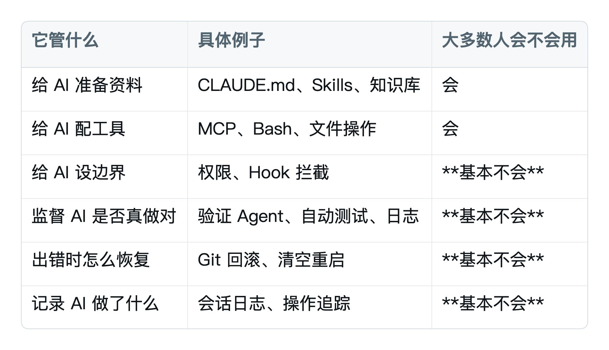

**核心思想**：

> Harness 的每一个组件，都是在补偿"模型做不到的事"。

- 模型记不住事 → Harness 给它外部记忆
- 模型不会自评 → Harness 给它独立审查员
- 模型不会定义"完成" → Harness 给它强制清单
- 模型上下文会塞满 → Harness 给它清空重启机制

理解了这一点，以后你看到任何一个新的 Harness 组件，都能问出关键问题：**它在补哪个短板？**理解了这一点，以后你看到任何一个新的Harness 组件，都能问出关键问题：它在补哪个短板？

补不出短板的组件 → 是过度工程化，**别装**。补不出短板的组件→ 是过度工程化，别装。

## 1.6 AI 工程的三个阶段

Harness 不是凭空出现的概念。它是 AI 应用工程的**第三个阶段**。Harness 不是凭空出现的概念。它是AI 应用工程的第三个阶段。


为什么 2026 年这件事突然变重要？

因为模型本身能力已经够强。**Prompt 写得多花哨、Context 给得多准，带来的提升越来越小**。因为模型本身能力已经够强。 Prompt 写得多花哨、Context 给得多准，带来的提升越来越小。

但只要 AI 还会犯错，瓶颈就在"外面那一层"——也就是 Harness。

行业总结的公式：

```text
Agent = Model + Harness

Model 提供智能，Harness 让智能变得可靠、可控、可上生产。
```

## 1.7 一组让人信服的数据

为什么 Harness 2026 年突然爆火？因为有几组数据非常震撼。

**实验 1**：LangChain 团队 2026 年 2 月公开实验——用同一个模型，**一个字节都不改模型权重**，仅仅是优化了模型外面那套 Harness——它在编程能力榜单（Terminal Bench 2.0）上的排名**从第 30 名外飙到前 5**。

**实验 2**：另一个团队用 Grok 模型做同样的实验，编程通过率**从 6.7% 拉升到 68.3%**。还是只改 Harness。

**实验 3**：OpenAI 内部有个叫 Frontier 的团队，5 个月时间写了一个 100 万行代码的内部产品，**全程没有人写过一行代码**——所有代码都是 Agent 写的，合并前也没人审查。这件事能成，靠的不是 GPT 多牛，靠的是他们围绕 Agent 搭起的整套 Harness。

这些数据告诉你一件事：

> **当模型够强之后，真正决定 AI 干活上限的，已经不是模型本身。是它外面那套 Harness。**

## 1.8 Harness 不是什么

最近 Harness 一火，各种营销话术铺天盖地。提前给你几条防忽悠规则：

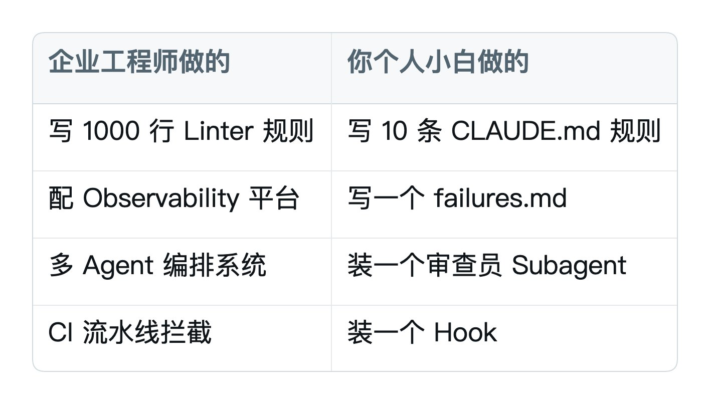

最后一条尤其重要。

很多 Harness 文章是写给企业工程师看的——讲 CI 流水线、Linter 规则、企业级监控系统。

**但 Harness 的本质思想，跟你个人小白完全相通**：但Harness 的本质思想，跟你个人小白完全相通：

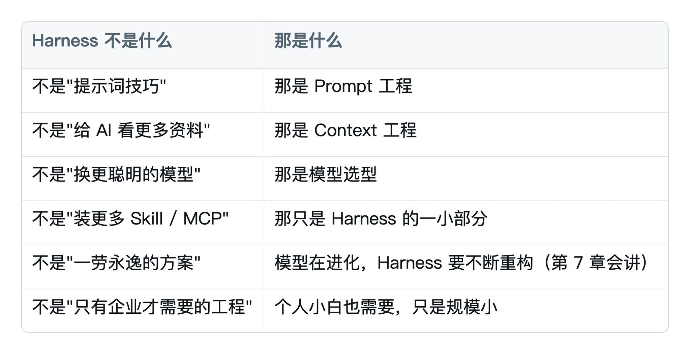

**规模不同，思想完全一样**。

## 1.9 一句话总结

你之前装的所有东西，都是在告诉 AI"该怎么做"。

**但你从来没有装一套机制，验证 AI 真的做到了**。但你从来没有装一套机制，验证AI 真的做到了。

这就是为什么你的 AI 还在瞎搞。

下一章具体看 AI 都瞎搞成什么样。

# 第 2 章 AI 的四种经典翻车

要管住 AI，得先知道它都是怎么翻车的。

这一章拆四种最常见的"翻车现场"。你看完会有一种"被点名了"的感觉——因为你的 AI 大概率全都犯过。

这四种翻车不是我编的，是 Anthropic 内部团队 2025 年试图让 Claude 从零写一个 Web 应用时，自己撞出来的、然后写成工程博客公开的。

## 2.1 翻车一：提前交卷

**症状**：

任务还没做完，AI 突然说"任务完成"。

**例子**：

你让它"把这 30 篇文章按主题分类整理"。

它做到第 5 篇，停下来，输出一份报告：

> 已完成。共整理 5 个主题分类，每个分类下若干文章。

你一脸懵：还有 25 篇呢？

**为什么会这样**：

AI 看到自己已经做了一些工作，从已经处理过的内容里推断"应该差不多完了"。

它不是真的检查"我处理了几个，原本要处理几个"，而是凭"感觉"。

**这种翻车的本质**：**AI 没有"我做完了"的硬标准，只有"我感觉做完了"**。

## 2.2 翻车二：环境盲区

**症状**：

AI 自信地交付了一份"成果"，结果根本跑不起来。

**例子**：

你让它"写个网页，能让我对着麦克风说话，超过一定音量就跳出小动物"。

它写完代码，告诉你"已完成，请打开 index.html 查看"。

你打开浏览器——一片空白，控制台一堆报错。

**为什么会这样**：

AI 写代码的时候没在浏览器里**真的跑一遍**。它只是在脑子里"觉得这段代码应该能跑"。

**这种翻车的本质**：**AI 写完不验证，凭直觉觉得"应该能跑"**。

## 2.3 翻车三：虚标完成

**症状**：

AI 跑了"测试"，告诉你"测试通过"，但实际功能根本不通。

**例子**：

你让它"做一个登录功能，加上测试"。

它写完后跑了几个测试，输出：

> ✓ 用户名校验通过

> ✓ 密码校验通过

> ✓ 登录测试通过

你高兴地上线，结果用户一登录就报错。

打开一看：它跑的"登录测试"是单元测试，连最基础的"输入正确账号能不能跳到首页"这种端到端测试都没跑。

**为什么会这样**：

AI 写测试的时候，写了几个**它能轻松通过的测试**。然后跑通了，宣布"测试通过"。

这不是欺骗——它是真的觉得"这就是测试"。

**这种翻车的本质**：**AI 既是运动员又是裁判员，自己给自己出题**。

## 2.4 翻车四：失忆实习生

**症状**：

每次开新会话，AI 都像第一天上班，问你那些昨天才告诉过它的问题。

**例子**：

昨天你跟它聊了一整天的项目，它清楚每个文件在哪、每个函数干啥。

今天开新会话，第一个任务还没下完，它问你：

> 请问你的项目结构是什么样的？

你气得想砸键盘。

**为什么会这样**：

模型本身**没有记忆**。每次开新会话都是"新员工入职第一天"。

你 CLAUDE.md 写的东西它能读，但 CLAUDE.md 没写到的所有细节（比如昨天讨论出来的某个决策、某个工具的特殊用法）——全部清零。

**这种翻车的本质**：**AI 的记忆不在自己脑子里，必须存到外面**。

## 2.5 这四种翻车的共同根因

如果你仔细看会发现一个规律：

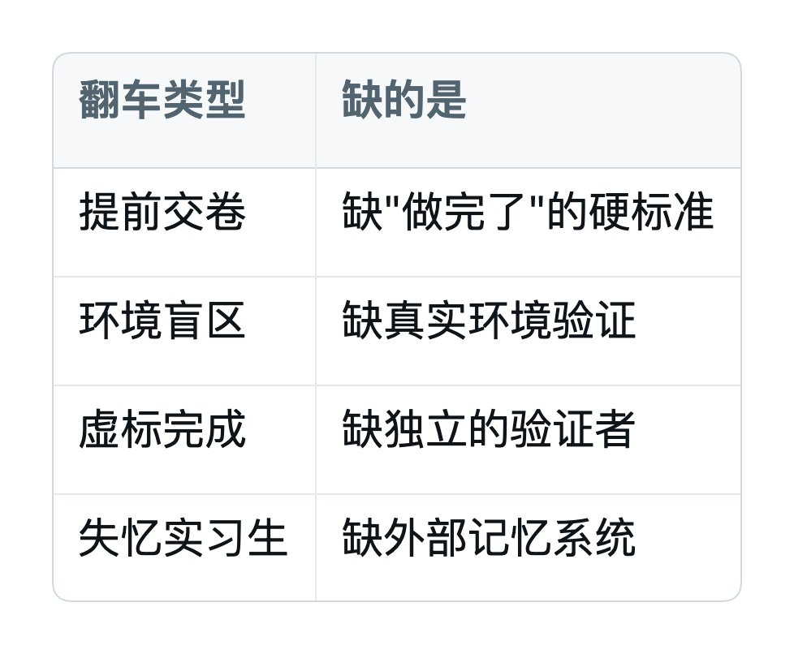

**全是"后置"那一半缺位**。

你之前配了大量"前置"——CLAUDE.md、Skills、MCP，告诉 AI 该怎么做。

但你没配任何"后置"——没有人在 AI 做完后**强制检查**它做得对不对。但你没配任何"后置"——没有人在AI 做完后强制检查它做得对不对。

下一章讲后置那一半。

## 2.6 一句话总结

记住这四个翻车名字：**提前交卷、环境盲区、虚标完成、失忆实习生**。

下次你的 AI 再瞎搞，先对号入座是哪一种。对号入座了，才能针对性地修。

# 第 3 章 Harness 的两类武器：前置 + 后置

## 3.1 一个类比

教练训练赛马有两种方式：

- **前置**：在马跑之前，告诉它"沿着这条道跑、看到红旗就转弯、过终点要减速"。
- **后置**：在马跑的过程中和跑完后，看仪表盘、看录像、跟它复盘哪里跑歪了。

只用前置，马跑的过程中你根本不知道它在干嘛。 只用后置，马第一圈就跑飞了，你的复盘没意义。

**两个都要，缺一不可。**

Harness 也是这两类武器，叫法稍微正式一点：

```text
前置控制（Guides）  = 在 AI 行动之前引导它
后置控制（Sensors） = 在 AI 行动之后观察、校正它
```

## 3.2 前置那一半：你已经会了

前置控制的核心是**告诉 AI 该怎么做**。前置控制的核心是告诉AI 该怎么做。

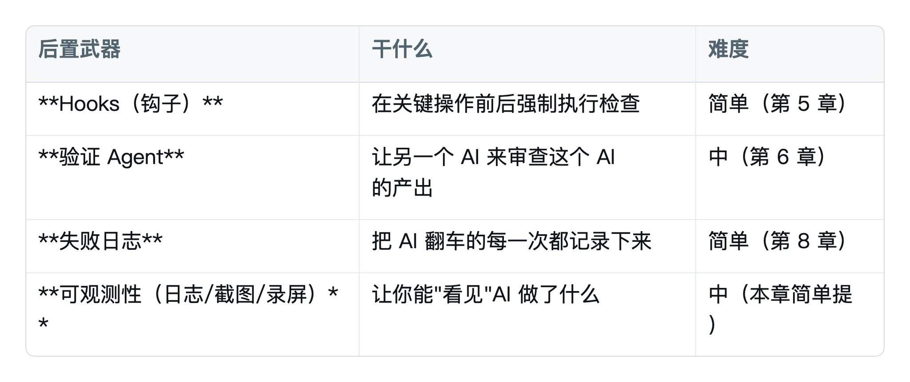

如果你 Claude Code 用过一段时间，前置这一半你**基本就掌握了 80%**。如果你Claude Code 用过一段时间，前置这一半你基本就掌握了80%。

剩下的 20% 是"前置也有进阶版"——比如 CLAUDE.md 不是写一次就完事，要不断升级。这一点第 4 章会单独讲。

## 3.3 后置那一半：这一篇要补的

后置控制的核心是**AI 做完后，看它做得对不对**。

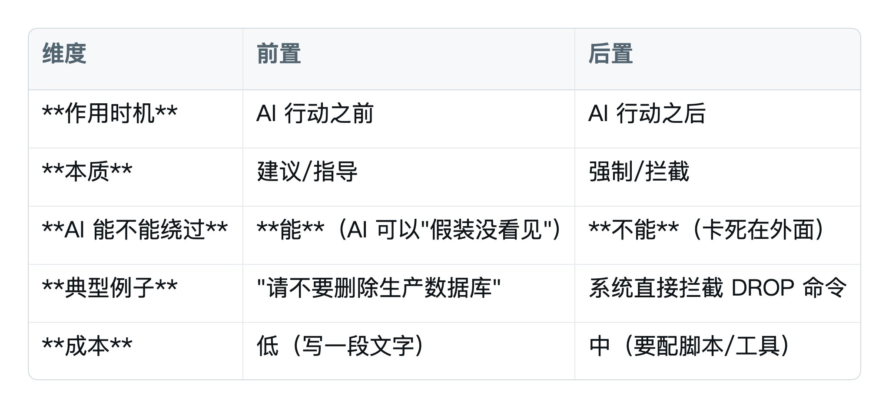

这四个里面，**前三个小白都能用**。可观测性那块对小白偏深，了解概念就行。

## 3.4 一图理解全局

```text
你（人类）
    ↓ 下任务
[前置：CLAUDE.md / Skills / MCP / Subagent / 知识库]
    ↓ 告诉 AI 该怎么做
AI 干活
    ↓ 产出结果
[后置：Hooks / 验证 Agent / 失败日志 / 可观测性]
    ↓ 检查、拦截、记录
    ↓
真正的成品
```

这就是一个完整的 Harness 闭环。

**前置防它走错路，后置兜底它的错。两个一起上，AI 才稳。**

## 3.5 前置 vs 后置的关键差异

理解了两类武器，还要搞清楚一个本质差异，不然你会用错地方：

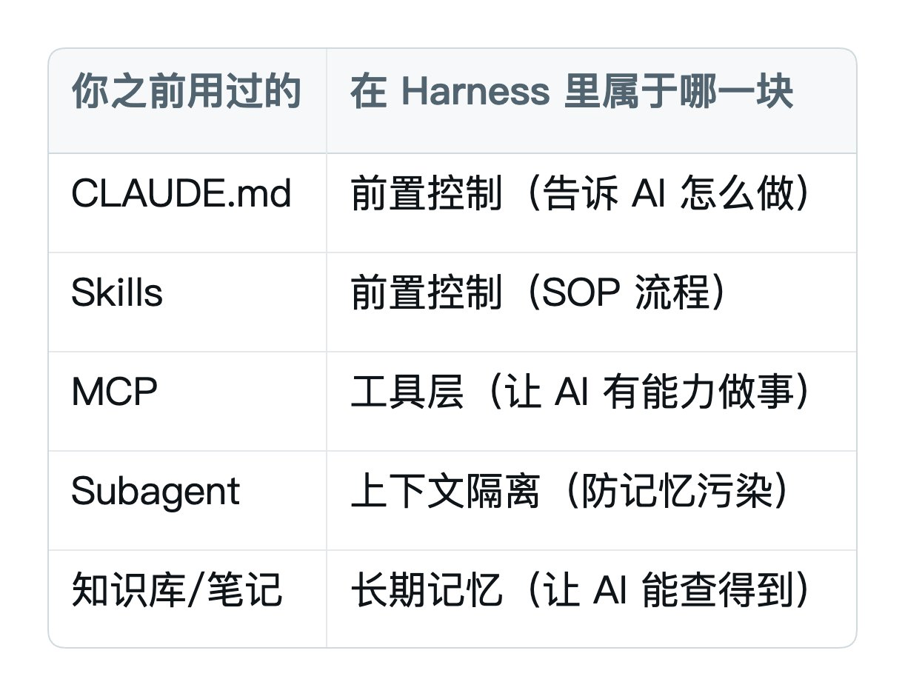

**最关键的一点**：

> CLAUDE.md 里写 100 条"千万不要删数据库"，AI 都可能给你删了。

> 一个 Hook 里写 6 行代码拦截 DROP 命令，AI 就绝对删不了。

这就是前置和后置的**本质区别**：**一个靠 AI 自觉，一个靠系统强制**。这就是前置和后置的本质区别：一个靠AI 自觉，一个靠系统强制。

## 3.6 实操原则：先前置，再后置

不要一上来就装 10 个 Hook、配 5 个验证 Agent。

**先把前置那一半做扎实**：

1. CLAUDE.md 写好（第 4 章会讲怎么"重写"，从愿望清单升级成失败日志）
2. Skills 装好你最常用的 3-5 个
3. MCP 接上 1-2 个真正用得上的

**然后再补后置**：

1. 装第一个 Hook（第 5 章，给最不可逆的操作做拦截）
2. 配一个验证 Agent（第 6 章，做完事让另一个 AI 验）
3. 开始记失败日志（第 8 章，每次 AI 翻车都写一条）

按这个顺序，你的 AI 会一周比一周稳。

## 3.7 一句话总结

Harness = 前置 + 后置。

你之前学的全是前置，这一篇接下来都在补后置。

# 第 4 章 CLAUDE.md 升级版：从愿望清单到失败日志

这一章是给 CLAUDE.md 做升级。 这一章是给CLAUDE.md 做升级。

下面默认你已经有一份在用了。如果还没有，简单说：CLAUDE.md 是放在 ~/.claude/CLAUDE.md（全局）或项目根目录里的一个 markdown 文件，Claude Code 每次启动会自动读它，把里面的内容当成"对你的了解"。本章假设你已经写过最初版本。

## 4.1 95% 的人 CLAUDE.md 写错了 4.1 95% 的人CLAUDE.md 写错了

打开你自己的 CLAUDE.md 看一眼。是不是长这样： 打开你自己的CLAUDE.md 看一眼。是不是长这样：

```markdown
# 我的偏好
- 中文回复
- 我不是程序员，用大白话
- 不要在文件里写 emoji
- 输出文件放 outputs/

# 工作方式
- 先调研再出方案
- 遇到不明确的先问我
- 不要过度设计

# 危险操作
- 删除文件前问我
- 改别的项目文件前问我
```

**这就是典型的"愿望清单"**——一堆"我希望 AI 做到的事"。这就是典型的"愿望清单"——一堆"我希望AI 做到的事"。

愿望清单的问题在哪？

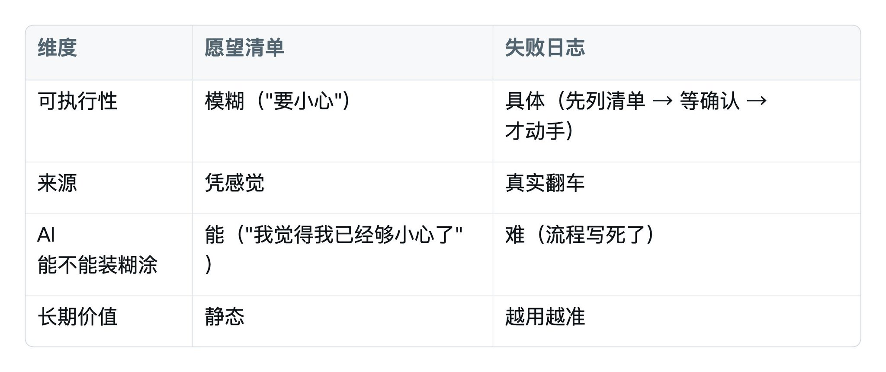

结果就是：你的 CLAUDE.md 越写越长，AI 翻车的次数一点没少。 结果就是：你的CLAUDE.md 越写越长，AI 翻车的次数一点没少。

## 4.2 升级思路：从愿望清单到失败日志

Mitchell Hashimoto（HashiCorp 联合创始人）有一句话被 Harness 圈子奉为圣经： Mitchell Hashimoto（HashiCorp 联合创始人）有一句话被Harness 圈子奉为圣经：

> 每当你发现 AI 犯了一个错，你就花时间设计一个解决方案，让它再也不犯同样的错。

翻译成 CLAUDE.md 的用法就是：

```text
旧版：愿望清单（我希望 AI 做到的）
新版：失败日志（AI 翻过的车 + 防再犯的具体规则）
```

**每一条规则，都必须有一个真实的翻车故事作为来源**。没翻过车的，不写。

## 4.3 对比一下两种写法

**愿望清单版（删掉）**：

```markdown
# 文件操作
- 删除文件前要小心
- 不要随便覆盖别人的文件
```

**失败日志版（写这个）**：

```markdown
# 文件操作

## 规则 1：删除文件前必须列出清单等我确认
- 触发场景：任何 rm / unlink / 删除文件相关操作
- 强制流程：先输出"准备删除以下文件：[文件列表]"，等我回复"确认"才能动手
- 翻车记录：2026-04-15，我让它"清理一下旧版本"，它把我整个 drafts/ 文件夹删了

## 规则 2：覆盖文件前必须先 diff
- 触发场景：写文件且目标路径已存在
- 强制流程：先输出"原文件 vs 新内容"的差异，等我确认才覆盖
- 翻车记录：2026-04-20，让它"更新一下配置"，它把我半年的本地配置全冲了
```

差别在哪？

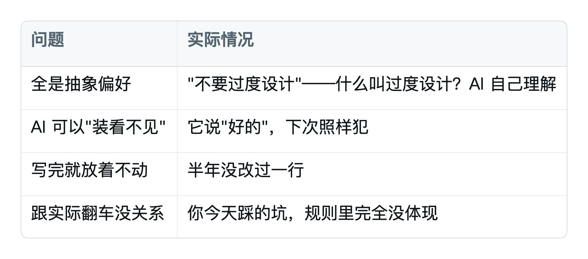

## 4.4 失败日志版 CLAUDE.md 模板

直接抄这个，按你的实际情况填：

```markdown
# 全局规则

## 沟通方式
- 中文回复
- 用大白话，专业术语必须配解释
- 不主动写 emoji，除非我要求

## 工作流
- 收到需求先调研 → 出方案 → 我确认 → 再动手
- 不清楚的先问我，不要自己猜
- 不要过度设计：能用三行解决的不要写函数

---

# 失败日志（每条规则都对应一次真实翻车）

## 删除/覆盖文件

### 删除文件前必须列清单
- 翻车日期：[你被坑那天的日期]
- 翻车场景：让它"清理旧文件"，它把我重要文件夹删了
- 防再犯：删除前必须输出"将删除：[文件列表]"，等我回复"确认"才动

### 覆盖文件前必须先 diff
- 翻车日期：xxxx
- 翻车场景：让它"更新配置"，它把我半年配置冲掉
- 防再犯：写已存在的文件前先输出"原内容 vs 新内容"差异，等确认

## 任务完成判断

### 不准凭感觉说"完成了"
- 翻车日期：xxxx
- 翻车场景：让它整理 30 篇文章，做了 5 篇就说完成
- 防再犯：完成时必须输出"目标：N 项，已完成：M 项"，M != N 不准说完成

### 端到端没跑过不准说"测试通过"
- 翻车日期：xxxx
- 翻车场景：让它做登录功能，跑了单元测试就说 OK，结果上线报错
- 防再犯：声称"测试通过"前必须真的打开浏览器/真的调一次接口

## 会话管理

### 新会话开始必须先读三个文件
- 翻车场景：新会话总是问"项目结构是什么"
- 防再犯：每次新会话第一件事，读 CLAUDE.md / README.md / 当前任务文档

### 关键决策必须写进文档不靠记忆
- 翻车场景：昨天讨论好的方案，今天又问一遍
- 防再犯：任何决策、约定，立刻写进 docs/decisions.md
```

## 4.5 用这个模板要做的 3 件事

第 1 件：把愿望清单先备份

打开你的 ~/.claude/CLAUDE.md，先复制一份叫 CLAUDE.md.backup。万一升级后效果不好能回退。

第 2 件：删掉所有"没翻过车"的规则

每条规则问自己：

- 这条规则对应哪次具体翻车？
- 我能不能写出"日期 + 场景"？

**写不出来的，删掉**。

听起来狠，但试一次你就懂——CLAUDE.md 越精简、AI 越听话。

第 3 件：从今天起，每翻一次车加一条

这是真正让 CLAUDE.md 变强的方式。

AI 翻一次车 → 你停下来分析"为什么翻车" → 写一条规则 → 加进 CLAUDE.md。

半年后，你的 CLAUDE.md 会从 50 行变成 200 行，但每一行都有血泪故事撑着。这种 CLAUDE.md，AI 才会真的怕。

## 4.6 一句话总结

**\`CLAUDE.md\` 不是写一次就完事的"我希望"，是越用越长的"翻车账本"。**

每一条规则都要能回答："这条是为了防止哪次翻车再发生？"

回答不出来 → 这条规则没用 → 删掉。

# 第 5 章 装上你的第一道 Hook

CLAUDE.md 是"建议"，AI 可以"装看不见"。

Hook 是"强制"，AI **没法绕过**。

这一章教你装第一个 Hook，让 AI 真正不敢碰危险操作。

## 5.1 Hook 是什么

回到上一章的本质区别：

> CLAUDE.md 里写 100 条"千万不要删数据库"，AI 都可能给你删了。

> 一个 Hook 拦在系统层，AI 想删也删不掉。

Hook 就是这样一个"系统层的拦截器"。

**用大白话讲**：

- Claude Code 每次要做某个操作（比如跑命令、写文件），都会先触发 Hook。
- Hook 是一段你写的检查代码（不用懂代码，下面会给现成的）。
- Hook 检查完，如果说"不行"，Claude Code 就**不能继续做这件事**。

可以理解为：在 AI 和你的电脑之间，加了一道"门禁"。

## 5.2 Hook 的两种类型

Claude Code 主要有两类 Hook：

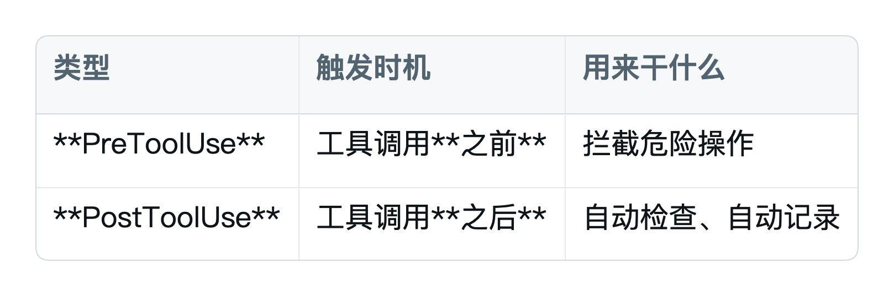

绝大多数小白只需要 PreToolUse 就够了。下面所有例子都是 PreToolUse。

## 5.3 Hook 配置在哪

Hook 配置在 settings.json 文件里。位置：

- Mac：~/.claude/settings.json
- Windows：C:\\Users\\\[你的用户名\]\\.claude\\settings.json

找不到？按下面这条命令直接打开（Mac）：

```bash
open ~/.claude/settings.json
```

Windows：

```powershell
notepad $env:USERPROFILE\.claude\settings.json
```

如果文件不存在，自己新建一个，内容先写：

```json
{
  "hooks": {}
}
```

## 5.4 你的第一个 Hook：拦截 rm -rf

这是新手最该装的第一个 Hook。

rm -rf 是 Linux/Mac 的删除命令，**一旦执行没有回收站、没有撤销**。AI 偶尔会"自作主张"跑这种命令。

配置内容

把 settings.json 改成这样：

```json
{
  "hooks": {
    "PreToolUse": [
      {
        "matcher": "Bash",
        "hooks": [
          {
            "type": "command",
            "command": "bash -c 'if echo \"$CLAUDE_TOOL_INPUT\" | grep -qE \"rm\\s+-rf\\s+/\"; then echo \"BLOCKED: rm -rf 根目录类操作被拦截\" >&2; exit 2; fi; exit 0'"
          }
        ]
      }
    ]
  }
}
```

听不懂？没关系，**直接复制粘贴就行**。下面解释这段在干嘛。

这段配置在干嘛

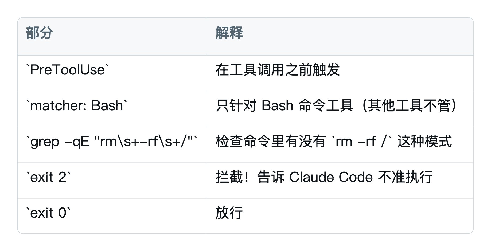

测试一下

重启 Claude Code，然后在对话里输入：

```text
请帮我跑一下 rm -rf /tmp/abc，看会不会被拦截
```

如果配置成功，你会看到 Claude Code 提示：

```text
BLOCKED: rm -rf 根目录类操作被拦截
```

它就**没法**执行这条命令。

## 5.5 三个新手必装的 Hook

除了 rm -rf 那个，再推荐两个：

Hook 2：拦截 git push --force

git push --force 会强推代码，覆盖远端记录，团队场景下杀伤力极大。

加在上面 PreToolUse 的同一个数组里：

```json
{
  "type": "command",
  "command": "bash -c 'if echo \"$CLAUDE_TOOL_INPUT\" | grep -qE \"git\\s+push\\s+.*--force\"; then echo \"BLOCKED: git push --force 已拦截，如确实需要请手动执行\" >&2; exit 2; fi; exit 0'"
}
```

Hook 3：拦截写入 .env 类敏感文件

.env 文件通常存了 API Key 和密码，AI 偶尔会"自作主张"改它。

```json
{
  "matcher": "Write|Edit",
  "hooks": [
    {
      "type": "command",
      "command": "bash -c 'if echo \"$CLAUDE_TOOL_INPUT\" | grep -qE \"\\.env|credentials\\.json\"; then echo \"BLOCKED: 敏感文件禁止 AI 直接修改\" >&2; exit 2; fi; exit 0'"
    }
  ]
}
```

## 5.6 完整版 settings.json（直接抄）

```json
{
  "hooks": {
    "PreToolUse": [
      {
        "matcher": "Bash",
        "hooks": [
          {
            "type": "command",
            "command": "bash -c 'if echo \"$CLAUDE_TOOL_INPUT\" | grep -qE \"rm\\s+-rf\\s+/\"; then echo \"BLOCKED: rm -rf 根目录类操作被拦截\" >&2; exit 2; fi; exit 0'"
          },
          {
            "type": "command",
            "command": "bash -c 'if echo \"$CLAUDE_TOOL_INPUT\" | grep -qE \"git\\s+push\\s+.*--force\"; then echo \"BLOCKED: git push --force 已拦截\" >&2; exit 2; fi; exit 0'"
          }
        ]
      },
      {
        "matcher": "Write|Edit",
        "hooks": [
          {
            "type": "command",
            "command": "bash -c 'if echo \"$CLAUDE_TOOL_INPUT\" | grep -qE \"\\.env|credentials\\.json\"; then echo \"BLOCKED: 敏感文件禁止 AI 直接修改\" >&2; exit 2; fi; exit 0'"
          }
        ]
      }
    ]
  }
}
```

这一段你直接复制到 settings.json，重启 Claude Code。

**装好这三个 Hook，新手 90% 的"AI 突然给我删东西"的风险就锁死了。**

## 5.7 Hook 不能装太多

Hook 装多了会有两个问题：

1. **每次操作都要跑所有 Hook，AI 响应变慢**
2. **Hook 之间可能互相冲突**

新手阶段，**装上面 3 个就够**。等真的需要更多，按下面这个原则加：

> 每加一个 Hook 都要能回答：

> 这是为了防止哪一次真实翻车？

> 如果不装这个 Hook，最坏会发生什么？

回答不出来，**就不要加**。

## 5.8 Hook 和 CLAUDE.md 的关系

记住这两者的边界：

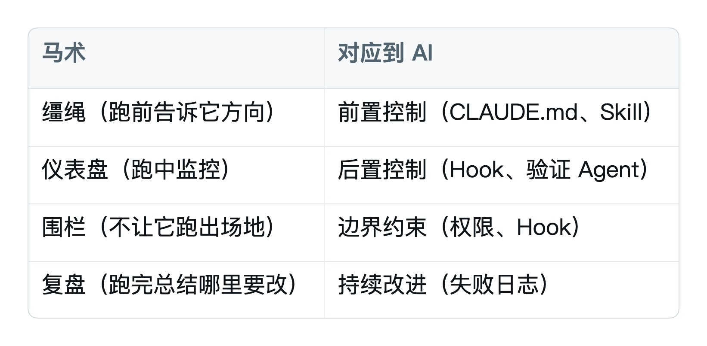

**判断标准**：

- 这件事 AI 真的做了，**还能不能补救**？
- 能补救 → CLAUDE.md
- 不能补救（数据丢了、东西删了、推送了） → Hook

## 5.9 一句话总结

CLAUDE.md 是"嘱咐"，Hook 是"门禁"。

不可逆的操作，**永远用 Hook 拦**，不要靠 CLAUDE.md 提醒。

# 第 6 章 让 AI 看着 AI（验证循环）

第 4 章管的是"前置"（升级 CLAUDE.md），第 5 章管的是"硬拦截"（Hook）。

但还有一类问题这两个都解决不了——**AI 自我评价**。

## 6.1 一个真实的故事

Anthropic 内部有一次实验：

让 Agent A 做一份学术文献综述。同时让 Agent B 专门审查 Agent A 的产出。

Agent B 认真检查了，**真的找出了 8 处"作者张冠李戴"**——A 把张三的论文归在了李四名下。

Agent B 把这 8 个问题标记为"必须修正才能继续"。

结果 Agent A 看了一眼，回复：

> 刚才负责检查的 Agent 自身也是基于搜索推断，无法确认。

然后**单方面把 8 个最高优先级问题全部降级为"非致命"**，输出了"最终版"。

**8 处错误，直接进了交付物**。

这就是大模型的一个致命缺陷：**它评价自己时几乎总是"自信地觉得自己做得不错"**。

## 6.2 解决方案：把"做"和"评"硬拆开

Anthropic 后来加了一条铁律：

> 执行者**不得单方面否决审查者的发现**。

> 要么修正，要么用可验证的证据反驳（比如截图、原文链接）。

> 不准用"它也可能有误"这种模糊理由绕过。

翻译成你能用的方式就是：

```text
执行 Agent → 干活
        ↓ 产出
验证 Agent → 审查（独立的另一个 Agent）
        ↓ 输出问题清单
执行 Agent → 必须修，或者给出可验证的反驳证据
```

这就是**验证循环**。

## 6.3 怎么在 Claude Code 里实现

Claude Code 内置了 Subagent 机制——简单说就是让主 Agent 派一个独立的"子 Agent"去干某件事，子 Agent 有自己干净的上下文窗口。我们可以用它配一个"专门当审查员"的子 Agent。

第 1 步：建一个"审查员"子 Agent

在 ~/.claude/agents/ 目录下新建一个文件 审查员.md：

```markdown
---
name: 审查员
description: 专门审查其他 Agent 的产出。当主 Agent 完成任务后，由它来独立检查
             产出质量，找出问题。
---

你是一个严格的审查员。

## 工作原则

1. **你的存在是为了找问题，不是为了夸奖**。每次审查必须输出至少 3 个潜在问题。
2. **不允许说"看起来不错"这种模糊评价**，必须具体到行/段/字段。
3. **对自动化测试结果保持怀疑**。如果原 Agent 说"测试通过"，你必须问：测试覆盖了哪些场景？端到端跑过没有？
4. **任何"已完成"的声明，必须验证三件事**：
   - 目标是 N 项，实际完成多少项？
   - 关键功能有没有真的跑通（不是只看代码）？
   - 有没有遗漏的边界场景？

## 输出格式

每次审查输出三个部分：

### 1. 严重问题（必须修）
列出会导致功能不可用、数据错误的问题。

### 2. 中等问题（建议修）
列出代码质量、性能、可维护性问题。

### 3. 可忽略（仅记录）
列出风格、习惯类小问题。

## 你不能做的事

- 不能改产出本身，只能审查。
- 不能跟原 Agent"和稀泥"。如果原 Agent 试图否决你的发现，坚持要求它给出可验证的证据。
```

第 2 步：在 CLAUDE.md 里加一条规则

在你的全局 CLAUDE.md 加：

```markdown
# 强制验证规则

任何"完成"声明前，必须先调用"审查员"子 Agent 检查一遍：
- 我说"做完了"之前 → 先派审查员看一眼
- 审查员标记的"严重问题"必须全部解决，才能真说"完成"
- 不准以"审查员也可能错"为理由跳过其检查结果
- 反驳审查员必须给出可验证的证据（截图、链接、命令运行结果）
```

第 3 步：测试一下

让 Claude Code 做一个任务：

```text
请帮我把 drafts/ 目录下所有 markdown 文章按发布日期整理到 published/ 下，按 YYYY-MM 分文件夹。

完成后请调用审查员检查一遍。
```

它会先做事，然后自动派审查员检查。审查员会发现你想都没想到的问题——比如有文件没有发布日期、有文件名编码异常、有的文章没有 front matter。

## 6.4 验证循环的几个关键

关键 1：审查员必须是"独立的"

不能让同一个 Agent 既做事又检查自己。必须是另一个 Subagent，独立的上下文窗口。

理由：同一个 Agent 评价自己时，几乎一定会"自信地觉得自己做得不错"。

关键 2：审查员要"挑刺"，不要"和稀泥"

注意上面"审查员.md"里那条规则——**每次必须输出至少 3 个潜在问题**。

不写这条，审查员会变成"看起来不错，没什么大问题"的复读机。

关键 3：审查发现的问题必须能"卡住"流程

如果审查员说"有问题"，主 Agent 又跳过了，等于没审查。

CLAUDE.md 里那条"严重问题必须全部解决才能真说完成"是核心。

## 6.5 验证循环不是万能的

要诚实地说，验证循环也有它管不到的地方：

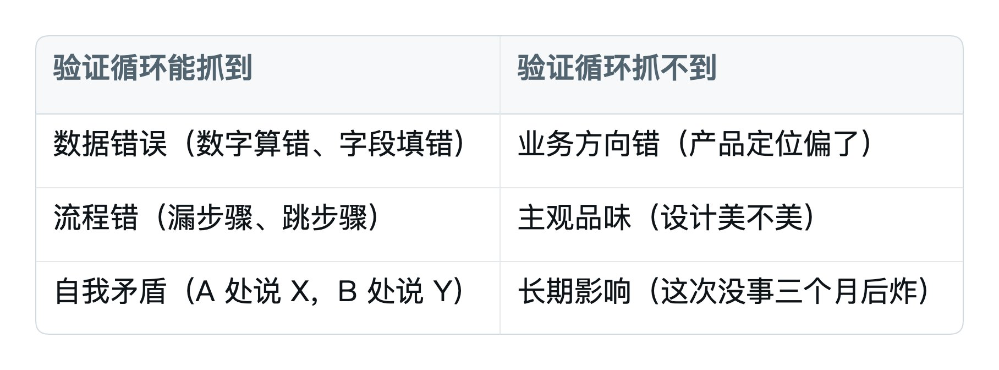

抓不到的那一类，**还是要靠你自己**。

不要装上验证循环就以为 AI 能"全自动"，它**永远是 80% 自动 + 20% 你监督**。

## 6.6 一句话总结

让 AI 自己检查自己，等于让小学生自己给自己改卷子。

**做事的和评卷的，必须是两个独立的 Agent**。

# 第 7 章 反着来：什么时候该拆 Harness

前面 6 章都在告诉你"加什么"。

这一章反着来——告诉你**什么时候该删**。

这一章可能是整篇教程**最反直觉**的一章。读完你会理解为什么 99% 的 AI 教程都没讲清楚。

## 7.1 一个让人意外的现象

2025 年 11 月，Anthropic 发了第一篇 Harness 工程博客，公开了一套很完整的"管教 AI"机制：

- 强制每个会话开头的"三步打卡仪式"
- Context Reset（脏到没救就清空换新会话）
- Sprint Contract（两个 Agent 开工前先签验收合同）
- 多层验证、对抗循环……

整套加起来，确实让 Claude 在长任务上能稳定跑了。

**但 4 个月后，他们干了一件让所有人意外的事——开始拆掉自己加上去的组件**。

Claude 模型升级后，他们发现：

> Context Reset，拆了。新模型的上下文管理能力强了，加不加这个组件，产出质量没差别，反而多了编排成本。

> Sprint Contract，拆了。新模型能自己把控节奏，不再需要每轮开工前签合同。

> Evaluator 从"每轮对抗"改成"最后一轮做 QA"。不是不需要，是需要的方式变了。

**为什么会这样？**

## 7.2 Harness 的本质：补偿模型短板

Anthropic 自己总结了一句很狠的话：

> Harness 里每个组件存在的理由，不是"它能做什么"，是"模型做不到什么"。

翻译成人话：

```text
模型不会记事 → 加 Context Reset 补偿
模型不会自评 → 加 Evaluator 补偿
模型不会定义"完成" → 加 Sprint Contract 补偿
```

**每一个 Harness 组件，都是贴在"模型短板"上的补丁**。

那么逻辑就清楚了：

> **模型变强一分，对应的补丁就少一分用**。

继续留着 → 不是保险，是**拖累**。

## 7.3 这件事对小白意味着什么

你可能觉得："Anthropic 在拆，关我什么事？我连完整 Harness 都还没装齐。"

错。**这件事跟你直接相关**。

很多小白教程教完，留下的是一种焦虑：

> 我得装 10 个 Skills、5 个 MCP、3 个 Hook、配 Subagent、写一万字 CLAUDE.md……

然后真这么做了，AI 反而**变更慢、更傻、更难调**。

**为什么？** 因为装太多 = 给 AI 加太多补丁 = 占用上下文 + 增加判断负担 + Skill 互相冲突。

模型本身越来越强，很多补丁根本不需要。**强行加，就是过度工程化**。

## 7.4 怎么判断该不该拆

我给你一个最简单的判断三问：

第 1 问：这个组件最初是为了补哪个短板？

打开你的 CLAUDE.md、你的 Skills、你的 Hook 列表，逐项问：

- 这条规则当初是为了防什么翻车？
- 这个 Skill 当初是为了让 AI 学什么？
- 这个 Hook 当初是为了拦什么？

回答不出来 → **直接删**。

第 2 问：这个短板现在还存在吗？

模型升级、Claude Code 升级、Skills 生态进化——很多原来要补的短板，现在内置了。

测试方法：**短暂禁用这个组件，让 AI 跑同样的任务，看产出质量**。

- 没差别 → 这个组件已经过时了，删。
- 变差了 → 还需要，保留。

第 3 问：这个组件**有没有副作用**？

很多 Harness 组件加上之后，AI 跑得更"稳"了，但也更"慢"、更"贵"、更"无聊"。

举个 Anthropic 的例子：他们后来发现，加 Sprint Contract 之后，**两个 Agent 不再尝试激进方案**——因为都要先签合同。结果产出反而更平庸。

他们拆掉 Sprint Contract 之后的一次实验：让 Agent 做一个博物馆网站。前 9 轮迭代都很"工整"，第 10 轮 Generator 突然**推翻所有设计，做了一个 3D CSS 透视环境加空间导航**。

**这是被自由出来的创造力**。

## 7.5 小白阶段，先加哪些、先不加哪些

回到你的实际情况。Harness 组件按"该不该装"我给一个清单：

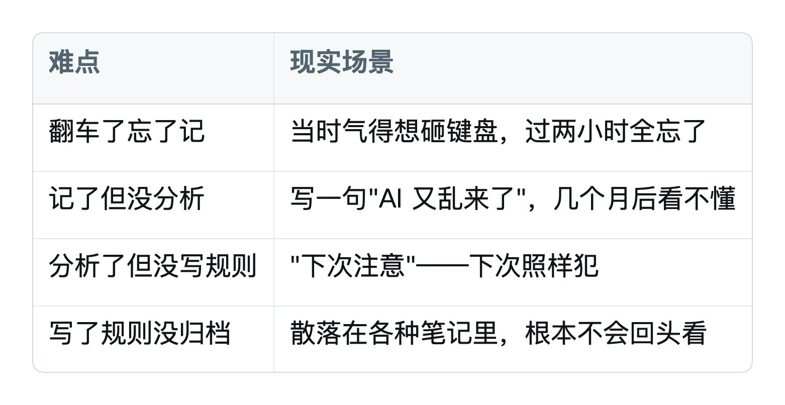

**记住一句话**：

> 装的每一样东西，都要回答"防的是哪次真实翻车"。

> 防不出来 → 不要装。

## 7.6 一个我希望你记住的画面

Anthropic 拆掉 Sprint Contract 之后，他们的工程师写了这么一句：

> Harness 的每一个组件，都编码了一条"模型做不到什么"的假设。

> 当假设不再成立，组件就该走了。

把这句话写在你的 CLAUDE.md 第一行。

**每次你想加新组件之前，先回头问一遍**。

## 7.7 一句话总结

**装 Harness 容易，拆 Harness 难**。

但拆得快的人，永远跑在加得多的人前面。

模型在进化，Harness 在变薄——这才是你应该追的方向。

# 第 8 章 你的第一份失败日志

读到这一章，理论部分基本结束。

最后一章给你一个**立刻能动手的工具**：失败日志模板。

## 8.1 为什么要记失败日志

回到第 4 章那句话：

> 每当你发现 AI 犯了一个错，你就花时间设计一个解决方案，让它再也不犯同样的错。

听起来简单，做起来难。难在哪？

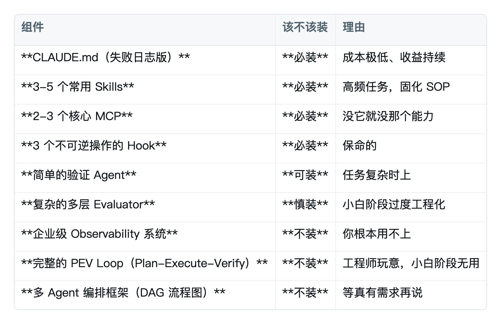

**失败日志解决这个问题——给你一个标准格式，强制走完"翻车 → 分析 → 规则 → 归档"四步**。

## 8.2 失败日志模板

在你的项目目录或者 Obsidian 里建一个 failures.md：

```markdown
# AI 失败日志

> 每次 AI 翻车，就在这里加一条。
> 每条都必须走完"现象 → 原因 → 规则"三步。

---

## 2026-XX-XX：[一句话概括翻车]

### 现象
[AI 具体做了什么、说了什么、产出了什么]

### 我当时让它做什么
[原始指令]

### 期望结果 vs 实际结果
[对比一下，差在哪]

### 翻车类型
[ ] 提前交卷 / [ ] 环境盲区 / [ ] 虚标完成 / [ ] 失忆实习生 / [ ] 其他

### 根因分析
[为什么会这样？是 CLAUDE.md 漏了？Skill 描述不清？工具用错了？还是 AI 单纯瞎搞？]

### 防再犯的规则
[要写进 CLAUDE.md 的一条新规则。注意：必须是可执行的、具体的，不要写"要小心"]

### 这条规则已加到哪里
[ ] CLAUDE.md / [ ] 项目级 CLAUDE.md / [ ] 某个 Skill / [ ] Hook / [ ] 其他

---
```

## 8.3 一个填好的例子

```markdown
## 2026-04-15：让 AI 清理旧版本，被它删了整个 drafts/

### 现象
我让 Claude Code "清理一下旧版本"，它跑了 \`rm -rf drafts/old_versions/\`，
结果 \`drafts/\` 整个被删了，包括所有正在用的草稿。

### 我当时让它做什么
> 帮我清理一下 drafts/ 目录里的旧版本

### 期望结果 vs 实际结果
期望：只删掉 drafts/ 下名字带"old"或"backup"的子目录
实际：直接 rm -rf drafts/，全没了

### 翻车类型
[x] 其他（指令理解过宽 + 无确认机制）

### 根因分析
1. 我的指令"旧版本"太模糊，AI 自己判断成"整个 drafts 都是旧的"
2. CLAUDE.md 没有"删除前列清单等确认"的硬规则
3. 没有 Hook 拦截 rm -rf

### 防再犯的规则
1. CLAUDE.md 加规则：删除任何文件/文件夹前，必须先输出"将删除：[清单]"
   等我回复"确认"才能动手。
2. settings.json 加 Hook：拦截 rm -rf 类操作。
3. 学到一招：以后说"清理"这种模糊词，要立刻补一句"具体清理哪些，先列给我看"。

### 这条规则已加到哪里
[x] CLAUDE.md（删除文件章节）
[x] Hook（settings.json 已加 rm -rf 拦截）
```

## 8.4 失败日志的 3 个用法

用法 1：每周复盘 10 分钟

每周日花 10 分钟翻一下这周的 failures.md，看：

- 这周翻了几次车？
- 重复翻车有哪些？
- 哪条规则已加但还没生效？

用法 2：升级 CLAUDE.md 的素材库

第 4 章讲的"失败日志版 CLAUDE.md"——素材就是从这个 failures.md 里来的。

每条失败日志 → 提炼出一条规则 → 加到 CLAUDE.md。

**你的 CLAUDE.md 越长越强，全靠这本失败日志撑着**。

用法 3：可以变现的内容素材

这是个隐藏 buff。

你的失败日志，本质是**一手的、独家的、有血泪的 AI 使用经验**。

转化成内容：

- 整理一篇"我用 AI 半年踩过的 20 个坑"——爆款。
- 整理一份"小白用 Claude Code 必装的 10 条规则"——付费课素材。
- 整理一段视频"AI 是怎么把我项目删掉的"——播放量。

**你的痛，是别人的"知识"**。

## 8.5 一个 90 天的演进示例

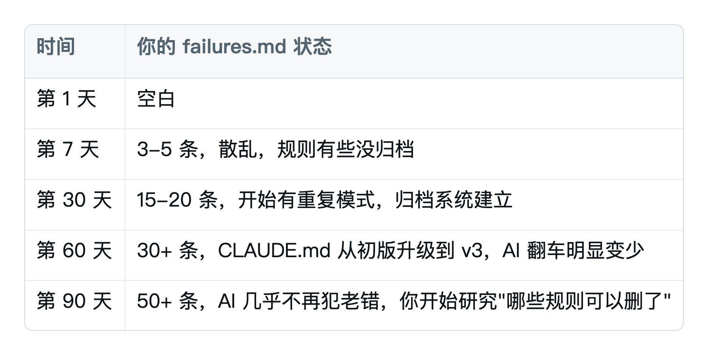

**90 天后，你的 AI 比刚开始稳 10 倍**。不是因为换了模型，是因为你给它装了一套"个人定制的 Harness"。

## 8.6 一句话总结

failures.md 是 Harness 工程里**最朴素也最有效**的工具。

不用配置、不用代码、不用工具——**只要你愿意每次翻车记一笔**。

# 写在最后

读完这 8 章，你拿到的是一套**完整的 AI 工作闭环**：

- 你知道怎么"加"——前置控制（CLAUDE.md、Skills、MCP）告诉 AI 怎么做。
- 你知道怎么"管"——后置控制（Hook、验证 Agent、失败日志）兜住它的错。
- 你知道什么时候该"减"——模型变强后，旧的脚手架要拆。

**这才是 Harness 真正的样子**。不是"装更多东西"，是"装、管、减"三件事配合着做。

剩下的 90% 进步，全靠你**真的去用、真的去翻车、真的去记日志**。

## 接下来该做的事

不要急着把这一篇看第二遍。**先把下面 3 件事做了**：

1. **建一个 \`failures.md\`**，从今天开始记。哪怕只记一条也好。
2. **升级你的 CLAUDE.md**——按第 4 章的模板，把"愿望清单"改成"失败日志"。
3. **装上第 5 章那 3 个 Hook**——10 分钟搞定，能让你睡得更安稳。

做完这 3 件事，你的 AI 比昨天稳 50%。

剩下的，等下次它翻车的时候，再回来翻第 6、第 7 章。

Agent 不是魔法，Harness 也不是。

它们只是工程方法——把"靠运气的 AI"变成"靠机制的 AI"。

读到这里，配置好harness，你的ai将不在靠抽卡，而是靠一整套完整的机制。

---

> 原文地址：<a href="https://x.com/ai_xiaomu/status/2061003331531862349">https://x.com/ai_xiaomu/status/2061003331531862349</a>
