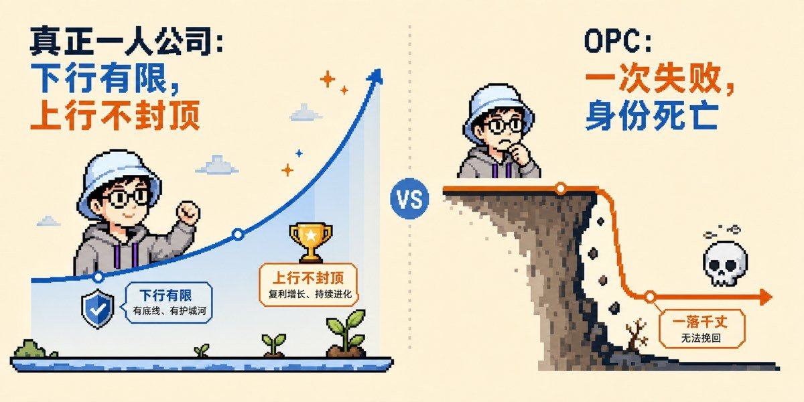
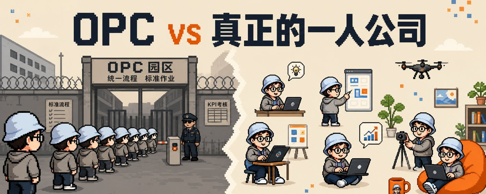
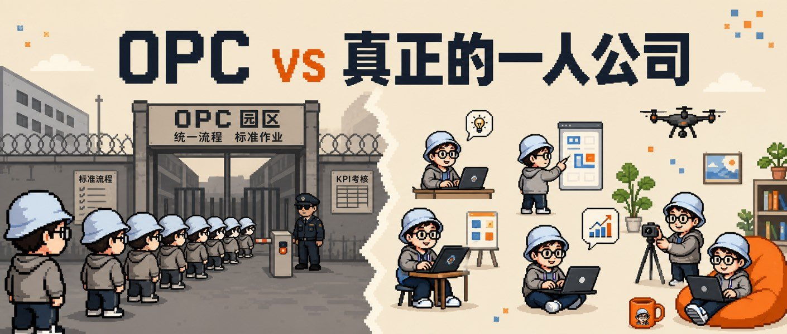
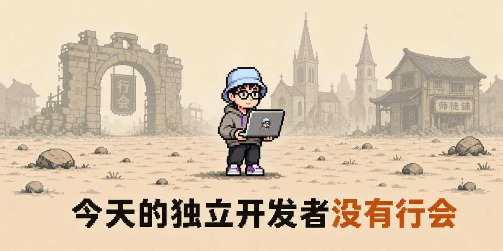
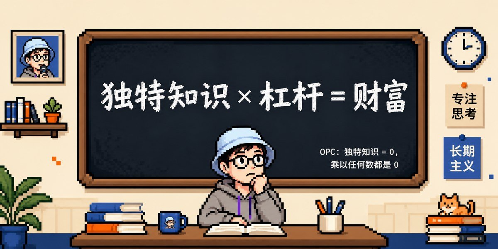

> 但这就是创业的正常代价。

虎嗅前几天那篇《2026年第一批一人公司老板已经退场》在朋友圈刷屏。三个失败案例，几组数据，结论是「一人公司是创业鸦片」。

我读完想说的是：是的，一人公司大部分会失败。

但这不是问题，这是常态。

奶茶店5年存活率15%。独立游戏95%赚不到钱。公众号99%没破万粉。餐厅第一年关店率60%以上。任何形态的创业，从0开始做任何事情，从概率上讲就是大部分会失败。一人公司80%跑不通，放进这个分母里其实是正常水平。

那篇文章的问题不在论据，在选择性。把所有创业都成立的失败率，重新包装成「一人公司」的特殊危机，然后给出一个不该做的结论。

真正值得讨论的不是失败率，是另外两件事：

AI 改变了什么，才让2026年的一人公司值得讨论？

那些跑通的人，跟跑不通的人，到底差在哪？

## 一、AI给了个体一次强化学习的机会

这句话听起来像鸦片，但我想用一个真实的技术比喻来讲。

大模型为什么这两年变强这么快？参数堆得多是一方面，但真正的关键是**RLHF**（基于人类反馈的强化学习）。模型做出动作，环境给反馈，权重更新，再做下一个动作。这个循环跑得够多次、奖励信号够准，模型就强了。

过去的创业者，最缺的就是这个循环。

开一家奶茶店赔进去20万，关掉一家服装店亏50万，做一个游戏花3年没人玩。每一次失败都是大额沉没成本，下一次再尝试得攒三五年钱。运气不好就转行回去了。这种「试一次错三年」的频率，根本跑不出强化学习。

AI 把这个循环的成本砍到几乎为零。

塔勒布讲过一个概念叫**凸性**（convexity）。他在 [Edge.org](http://edge.org/) 那篇文章里写过精确版本，大意是：增益大于损失的非对称函数是非线性凸函数，类似金融期权；错误（或变化）对你的伤害，远小于它能给你带来的收

翻成人话：下行有限，上行不封顶。这种事，应该多做几次。失败9次成本可控，成功1次cover全部。

过去这个公式只对有资本的人成立。VC 投10家公司死9家，剩1家爆赚。个人没法跑凸性，单次失败就把家底打没了。

AI 把凸性下放给了每一个普通人。

Marc Lou 把这件事说得最直白：「Ship 20 products knowing 19 will fail.」做20个产品，知道其中19个会失败。他过去12个月营收100万美元，靠的不是某一个breakout product，是「我能ship 100次而你只能ship 1次」这件事。

我自己也是这样。最近一年做过的东西大部分没成，但每一次失败都是几天到一两周的时间、几十到几千块工具费，下一次就更知道哪里该绕。这是 AI 给个体最大的礼物：它让你能多次失败，让强化学习从大公司的特权变成个人的日常。

## 二、AI 补足了一个人过去做不到的所有能力

具体讲讲 AI 在帮一个人做什么。 具体讲讲AI 在帮一个人做什么。

**多语言、跨地区运营**​。Pieter Levels（[@levelsio](https://x.com/@levelsio)）一个人，公开数据约13.8万美元每月，用户分布在70多个国家。这件事在AI之前不是不能做，是要做得先花十年学英文+雇翻译+做本地化。现在AI替你跑这一段，你专心做产品判断。

**写作和内容产能**​。Dan Koe 2024年营收420万美元，自述毛利98%。一个人，一份周更newsletter，分发到7个平台。AI让他的「一篇 newsletter」变成「21条社交平台posts」，这是过去整个内容部门做的事。

**把想法变成代码变成产品**​。Tony Dinh 7年 Big Tech工程师辞职后做 TypingMind，累计破百万美元营收，20000+付费用户。他每天工作4小时。AI把「写代码」从他的工作里减掉，他专心做产品判断。

**全栈一人作坊**​。Marc Lou 自己说他的AI setup是「一个代码编辑器加一个聊天窗口」，用基础工具 ship了6个新app加300个feature。

AI 在做的事，是把过去你必须组个团队才能做的事，变成一个人加几个 AI agent 就能做的事。 AI 在做的事，是把过去你必须组个团队才能做的事，变成一个人加几个AI agent 就能做的事。

顺便声明：我自己也在做一人公司（虽然我其实不想用任何标签概念定义自己），不过我确实在某种程度上被央媒塑造成了OPC的典型代表。毕竟一个人在干开发产品、经营自媒体、做skill、卖书等一大堆事。

但这里有一个关键判断要讲清楚：**AI 放大的是你已经有的东西**​。

## 三、AI 是杠杆，不是引擎

Naval有个财富公式：**specific knowledge × leverage = wealth**​。

specific knowledge 是 Naval 的说法。它指的不是某项技能。技能可以被教、被培训、被外包；specific knowledge是不可教授的独特组合：你的品味、判断、世界观、长期浸泡某个领域积累的肌肉记忆。Naval的原话大意是：如果你能被培训出来，那别人也能，你就是可替换的。

回头看那五个跑通的样本：

Pieter在2014年开始「12 startups in 12 months」实验的时候，AI还不会写代码。他靠的是十年自学的全栈技术栈、对数字游民群体的亲身浸泡、和在Hacker News/X上build in public的本能。

Dan Koe 在做内容创业前做了多年agency，亲手交付过copywriting funnel的全套服务。

Justin Welsh 在做 solopreneur之前，已经在ZocDoc和PatientPop把销售团队从0带到5500万美元ARR。 Justin Welsh 在做solopreneur之前，已经在ZocDoc和PatientPop把销售团队从0带到5500万美元ARR。

Marc Lou 是用三年时间ship过20-30个失败产品练出来的执行肌肉。

Tony Dinh 是7年 Big Tech工程经验给了他「看见AI产品里UI/UX空缺」的眼光。 Tony Dinh 是7年Big Tech工程经验给了他「看见AI产品里UI/UX空缺」的眼光。

他们的 AI 杠杆都很大，但被放大的是他们自己已经有的东西。每个人的 specific knowledge都是5-15年某种深度浸泡留下的。

如果 specific knowledge 那一项是 0，杠杆再大，0乘任何数都是0。 如果specific knowledge 那一项是0，杠杆再大，0乘任何数都是0。

很多人冲进AI创业最后被打回来，根本原因不是AI不行，是他们想跳过那5-15年的浸泡。这段时间无法跳过。AI 抹平的是工具门槛，不是品味门槛。

## 四、那「注定失败」该怎么理解

回到这篇文章的标题。

一人公司「注定失败」，是真的吗？

是真的，也不是真的。

是真的：从概率上讲，做任何新事情的人 80% 会失败。一人公司没什么例外。 是真的：从概率上讲，做任何新事情的人80% 会失败。一人公司没什么例外。

不是真的：失败不是结局，是创业的入场券。

那篇文章批评的「满屏我用AI三天赚三千块」的爽文是真的有害。它有害不是因为它说创业能成功，是因为它把「成功」包装成「轻松」。只要按流程走、报这个课、入这个园区，就能上岸。

真正的创业从来不是上岸，是站在浪里。

一人公司注定大部分会失败。但失败不是不能承受的。AI让失败的成本从「赔20万+三年」降到「几千块+几个月」，从重伤变擦伤。从重伤里你爬不起来，从擦伤里你只是停一下、想一想、再做下一件事。

杀不死你的，让你更强大。这句话在过去对个体创业者其实不太成立——单次失败就把家底打没了，哪还有「下一次」。AI 让这句话第一次真正成立。

## 五、行会消失之后

不过有一件事，那篇文章没讲，我得讲。

工业革命的时代讨论过一个老问题。匠师嵌在行会、教会、家族、师徒的网里，失败有兜底，技艺有传承。**今天的独立开发者没有行会**​。AI让你看上去什么都能做，但也让你失去了所有可以求助的对象。

我自己2025年12月有过一条即刻动态，大意是：自从搭了 Claude Code 自动化写作的工作流，做文章和视频都轻松太多。然后逐渐发现，当我自己真想做个更难的、需要更长时间的选题时，发现糟了，自己越来越不愿意忍受那缓慢的枯燥的过程了。把脑力工作外包后，想再收回来真没那么容易。

这是真问题。AI 让你能高频试错，但也让你的「单次专注深度」在退化。 这是真问题。 AI 让你能高频试错，但也让你的「单次专注深度」在退化。

解药不是回大厂，是给自己造一个虚拟的行会：读者、用户、X上的同行、播客同温层。这个虚拟行会跟传统师徒制不一样，但本质需求是一样的。你需要可以求助的对象、可以被骂醒的环境、可以校准方向的同行。

那篇文章里有一句最有用的话：

「如果没有任何补贴、没有任何课程可卖、也没有投资人看上你，你的AI一人公司，还能靠什么活下来？」

这是个好问题。但它的用法不是「答不上来就别做」，是**用来检查自己有没有把杠杆架在空地上**​：

- 我有什么 specific knowledge 是别人没有的？ 我有什么specific knowledge 是别人没有的？
- 我能持续 ship 吗（每周或每月有新东西出来）？ 我能持续ship 吗（每周或每月有新东西出来）？
- 我有没有给自己造一个虚拟的行会？

三个都有，去做。会失败，但 AI 让你的失败便宜得多。三个都没有，先去攒。AI 不会让一个 specific knowledge 是 0 的你突然成功，AI 只会让一个已经有 specific knowledge 的你的成功几率放大一个数量级。

## 结尾

回到开头那句话：一人公司大部分会失败。

是的。但这没什么不得了的。

AI 第一次让普通人也能跑出大公司才有的强化学习循环。失败不再是终点，是反馈信号。每一次失败完，你只是更知道哪里不该走。

「注定失败」这个判断，对所有创业都成立。对一人公司成立。对奶茶店、独立游戏、餐厅、自媒体也成立。但「注定失败」之后还有一句话：杀不死你的，让你更强大。

我自己侥幸活到现在，靠的是开始得早、撞过的墙够多、留下的疤痕也没人帮我擦干净。这些东西的获得方式只有一个，就是不停地做、不停地失败、不停地从失败里把下一次再做一遍的勇气和方向感拣回来。

AI 让这件事变得便宜了。仅此而已。

---

> 原文地址：<a href="https://x.com/AlchainHust/status/2060923562345832451">https://x.com/AlchainHust/status/2060923562345832451</a>
